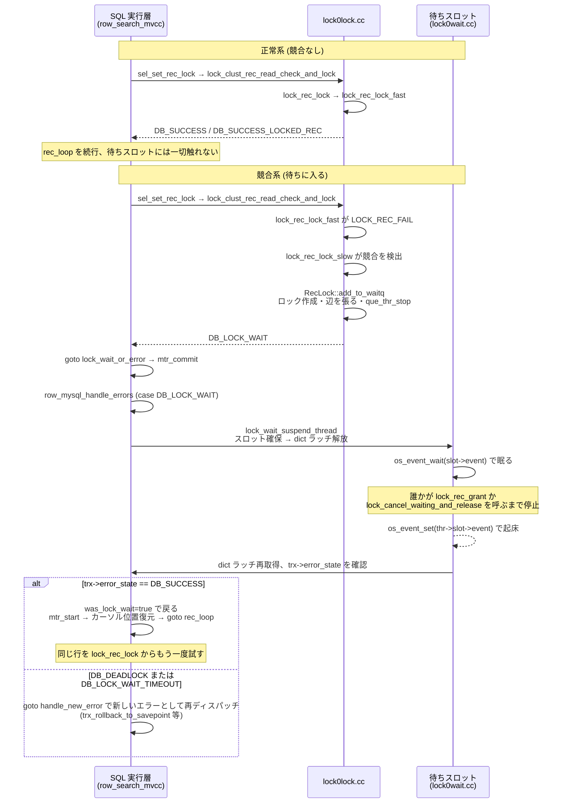
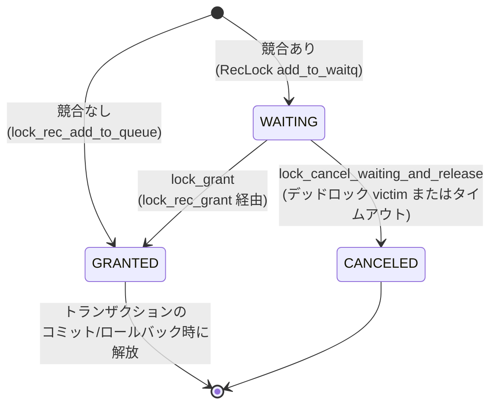

> **前提**: [ロックの種類 (InnoDB)](./lock-modes-and-types/) / [行ロックとページラッチの継ぎ目](./locks-and-page-latches/)

## この層の責務

このページが追うのは 1 つの問いだけだ。**`SELECT ... FOR UPDATE` や `UPDATE` が 1 行に X ロックを要求してから、実際にそのロックが GRANTED になる (または諦める) までに、コードはどこを通り、戻り値はどこで変わり、スレッドはどこで眠ってどこで起きるか。**

個々のパーツはすでに他のページが担当している。

- ロックの種類・next-key lock・gap lock の意味 → [ロックの種類](./lock-modes-and-types/)
- 行ロックとページラッチの境界、latch order → [行ロックとページラッチの継ぎ目](./locks-and-page-latches/)
- 待ち行列がどう並び替わるか (CATS) → [CATS](./lock-scheduling-cats/)
- 循環をどう見つけて victim をどう選ぶか → [デッドロック検出](./deadlock-detection/)

このページはそれらを結ぶ**配線**だけを見る。呼び出しの深さは 3 層に分かれる。

1. **SQL 実行層** — `row_search_mvcc` (SELECT) や `row_ins_step` / `row_upd_step` (INSERT/UPDATE) が「この行にこのモードでロックしたい」と要求する
2. **`lock0lock.cc`** — 要求を受けて、競合がなければ即座に、競合すればロックを WAITING 状態で登録して `DB_LOCK_WAIT` を返す
3. **`lock0wait.cc`** — `DB_LOCK_WAIT` を受け取ったスレッドが実際に眠り、誰かに起こされるまで待つ

3 層のどこで戻り値が変わるか、どこでスレッドが眠るかを、上から下まで追う。

## 主要な型とその関係

### `dberr_t` の戻り値がそのまま状態遷移を表す

この経路には専用の状態機械オブジェクトがない。**代わりに `dberr_t` の戻り値そのものが「今どういう状態か」を運ぶ。**

| 戻り値                              | 意味                                                                                     | 誰が返すか                                                                 |
| ----------------------------------- | ---------------------------------------------------------------------------------------- | -------------------------------------------------------------------------- |
| `DB_SUCCESS`                        | 既に十分なロックを持っている、または暗黙ロックで済んだ                                   | `lock_rec_lock_slow`                                                       |
| `DB_SUCCESS_LOCKED_REC`             | 新しい明示ロックを競合なしで作れた                                                       | `lock_rec_lock_fast` / `lock_rec_lock_slow`                                |
| `DB_LOCK_WAIT`                      | 競合したので待ちキューに入った (WAITING)                                                 | `RecLock::add_to_waitq`                                                    |
| `DB_DEADLOCK`                       | 待つ前に強制ロールバック対象だと分かった、または待った末にデッドロックの victim になった | `RecLock::add_to_waitq` / `lock_wait_suspend_thread`                       |
| `DB_LOCK_WAIT_TIMEOUT`              | 待った末にタイムアウトした                                                               | `lock_wait_try_cancel` (背景スレッド) 経由で `trx->error_state` に書かれる |
| `DB_SKIP_LOCKED` / `DB_LOCK_NOWAIT` | `SELECT ... SKIP LOCKED` / `NOWAIT` で競合したので待たずに返る                           | `lock_rec_lock_slow`                                                       |

**`DB_SUCCESS` 系と `DB_LOCK_WAIT` の間に質的な違いはない。** どちらも「エラーではない」。この経路のややこしさは、`DB_LOCK_WAIT` が SQL 実行層から見ると一度エラーハンドラ (`row_mysql_handle_errors`) を経由する点にある。エラー用の入口を、エラーではない「まだ決着していない」状態の中継にも使っている。

### `RecLock` — 待ちキュー登録という手続きを 1 箇所にまとめたクラス

[`lock0priv.h#L690-L907`](https://github.com/mysql/mysql-server/blob/mysql-8.4.11/storage/innobase/include/lock0priv.h#L690) の `class RecLock` は、永続するオブジェクトではなく**「待ちに入る」という一連の操作をまとめたスタック上のヘルパー**だ。コンストラクタで `(thr, index, block, heap_no, mode)` を受け取り、`add_to_waitq()` を呼ぶとロックを作って待ち行列に登録し、辺を張り、状態を `TRX_QUE_LOCK_WAIT` にする。フィールドは `m_thr` / `m_trx` / `m_mode` / `m_index` / `m_rec_id` の 5 つだけで、待ち登録に必要な情報以上のものは持たない。

### `srv_slot_t` — スレッドを起こすための唯一のチャネル

[`srv0srv.h`](https://github.com/mysql/mysql-server/blob/mysql-8.4.11/storage/innobase/include/srv0srv.h#L1228) の `struct srv_slot_t` が、寝ているスレッドを起こす手段を 1 つだけ持つ。

```cpp title="storage/innobase/include/srv0srv.h"
struct srv_slot_t {
  ...
  /** Event used in suspending the thread when it has nothing to do. */
  os_event_t event;

  /** Suspended query thread (only used for user threads). */
  que_thr_t *thr;
};
```

`event` が唯一の起床経路で、`os_event_wait(slot->event)` が唯一の入眠経路になる。この 1 対 1 の単純さが、後述する「起こす側の不変条件」を成り立たせている。

### `trx->lock.wait_lock` / `trx->error_state` — 待ち手の状態を表す 2 つのフィールド

- `trx->lock.wait_lock` — 今待っている `lock_t*`。起こされる (grant されるかキャンセルされる) と `nullptr` に戻る
- `trx->error_state` — 目覚めたときに何が起きたかを伝えるチャネル。`DB_SUCCESS` (普通に取れた) / `DB_DEADLOCK` (victim にされた) / `DB_LOCK_WAIT_TIMEOUT` (タイムアウトした) のいずれかが、**眠っている間に他のスレッドによって書き込まれる**

`os_event_set` という 1 ビットの通知だけでは「なぜ起きたか」が伝わらないので、その情報は別チャネルの `trx->error_state` に乗せてある。

## 処理の流れ

### 正常系と競合系



### `lock_t` 1 個のライフサイクル

上のシーケンス図はスレッドを主語にしたが、視点を変えて**ロックオブジェクト `lock_t` 1 個**を主語にすると状態は 4 つしかない。



**`WAITING` から `GRANTED` になる経路と `CANCELED` になる経路は、前節で見たとおり同じ `lock_reset_wait_and_release_thread_if_suspended` を通って初めてスレッドに通知される。** ロック自身の状態遷移 (`LOCK_WAIT` ビットの着脱) と、それを待っているスレッドの起床は別の出来事だが、この 2 つを繋ぐ関数が 1 本しかないことが、この経路全体の見通しを良くしている。

### 1. 入口 — SQL 実行層から `lock0lock.cc` へ

SELECT の各行に対するロック要求は、`row_search_mvcc` ([`row0sel.cc#L4420`](https://github.com/mysql/mysql-server/blob/mysql-8.4.11/storage/innobase/row/row0sel.cc#L4420)) から直接ではなく、ヘルパー `sel_set_rec_lock` ([`row0sel.cc#L1138`](https://github.com/mysql/mysql-server/blob/mysql-8.4.11/storage/innobase/row/row0sel.cc#L1138)) を経由する。

```cpp title="storage/innobase/row/row0sel.cc"
static inline dberr_t sel_set_rec_lock(btr_pcur_t *pcur, const rec_t *rec,
                                       dict_index_t *index,
                                       const ulint *offsets,
                                       select_mode sel_mode, ulint mode,
                                       ulint type, que_thr_t *thr, mtr_t *mtr) {
  ...
  if (index->is_clustered()) {
    err = lock_clust_rec_read_check_and_lock(
        lock_duration_t::REGULAR, block, rec, index, offsets, sel_mode,
        static_cast<lock_mode>(mode), type, thr);
  } else {
    ...
    err = lock_sec_rec_read_check_and_lock(
        lock_duration_t::REGULAR, block, rec, index, offsets, sel_mode,
        static_cast<lock_mode>(mode), type, thr);
  }
  return (err);
}
```

インデックスの種類 (クラスタード/セカンダリ/空間) で `lock_clust_rec_read_check_and_lock` ([`lock0lock.cc#L5509`](https://github.com/mysql/mysql-server/blob/mysql-8.4.11/storage/innobase/lock/lock0lock.cc#L5509)) と `lock_sec_rec_read_check_and_lock` ([`lock0lock.cc#L5460`](https://github.com/mysql/mysql-server/blob/mysql-8.4.11/storage/innobase/lock/lock0lock.cc#L5460)) に振り分けるだけの薄いラッパーで、**どちらの関数も最終的に同じ `lock_rec_lock` を呼ぶ**。ロックモードの決め方自体 (`FOR UPDATE` / `FOR SHARE` からどのモードになるか) は [ロックの種類](./lock-modes-and-types/) の管轄なので、ここでは「呼ばれる」という事実だけを押さえる。

更新系 (INSERT/UPDATE/DELETE) の入口は `lock_clust_rec_modify_check_and_lock` ([L5350](https://github.com/mysql/mysql-server/blob/mysql-8.4.11/storage/innobase/lock/lock0lock.cc#L5350)) と `lock_sec_rec_modify_check_and_lock` ([L5402](https://github.com/mysql/mysql-server/blob/mysql-8.4.11/storage/innobase/lock/lock0lock.cc#L5402)) で、こちらも内部で `lock_rec_lock` に合流する。以降はどちらの入口を通っても同じ経路になる。

### 2. `lock_rec_lock` の 3 層 — 戻り値が最初に分岐する場所

`lock_rec_lock` ([`lock0lock.cc#L1878`](https://github.com/mysql/mysql-server/blob/mysql-8.4.11/storage/innobase/lock/lock0lock.cc#L1878)) 自体は分岐だけの薄い関数だ。

```cpp title="storage/innobase/lock/lock0lock.cc"
static dberr_t lock_rec_lock(bool impl, select_mode sel_mode, ulint mode,
                             const buf_block_t *block, ulint heap_no,
                             dict_index_t *index, que_thr_t *thr) {
  ...
  switch (lock_rec_lock_fast(impl, mode, block, heap_no, index, thr)) {
    case LOCK_REC_SUCCESS:
      return (DB_SUCCESS);
    case LOCK_REC_SUCCESS_CREATED:
      return (DB_SUCCESS_LOCKED_REC);
    case LOCK_REC_FAIL:
      return (
          lock_rec_lock_slow(impl, sel_mode, mode, block, heap_no, index, thr));
    default:
      ut_error;
  }
}
```

**高速路 (`lock_rec_lock_fast`, [L1631](https://github.com/mysql/mysql-server/blob/mysql-8.4.11/storage/innobase/lock/lock0lock.cc#L1631)) が通るのは、対象ページに明示ロックが 0 個か、既にちょうど自分の trx が持つ 1 個だけの場合に限る。** それ以外 (他の trx のロックがある、複数のロックが並んでいる) は問答無用で `LOCK_REC_FAIL` になり、低速路に落ちる。高速路自身はページ上のロックを高々 1 個しか見ないので、走査コストが定数で済む。

**低速路 (`lock_rec_lock_slow`, [L1763](https://github.com/mysql/mysql-server/blob/mysql-8.4.11/storage/innobase/lock/lock0lock.cc#L1763)) で戻り値が本当に分かれる。**

```cpp title="storage/innobase/lock/lock0lock.cc"
  const auto *held_lock = lock_rec_has_expl(checked_mode, block, heap_no, trx);

  if (held_lock != nullptr) {
    if (checked_mode == mode) {
      return (DB_SUCCESS);
    }
    ...
    return (DB_SUCCESS);
  }
  const auto conflicting =
      lock_rec_other_has_conflicting(mode, block, heap_no, trx);

  if (conflicting.wait_for != nullptr) {
    switch (sel_mode) {
      case SELECT_SKIP_LOCKED:
        return (DB_SKIP_LOCKED);
      case SELECT_NOWAIT:
        return (DB_LOCK_NOWAIT);
      case SELECT_ORDINARY:
        RecLock rec_lock(thr, index, block, heap_no, mode);
        trx_mutex_enter(trx);
        dberr_t err = rec_lock.add_to_waitq(conflicting.wait_for);
        trx_mutex_exit(trx);
        return (err);
    }
  }
  if (!impl || conflicting.bypassed) {
    lock_rec_add_to_queue(LOCK_REC | mode, block, heap_no, index, trx);
    return (DB_SUCCESS_LOCKED_REC);
  }
  return (DB_SUCCESS);
```

順に見ると 4 通りの出口がある。

1. **既に十分なロックを持っている** → `lock_rec_has_expl` が非 null → `DB_SUCCESS` (何もしない)
2. **競合なし、ロックを新規作成** → `lock_rec_add_to_queue` → `DB_SUCCESS_LOCKED_REC`
3. **競合あり、`SKIP LOCKED`/`NOWAIT`** → 待たずに `DB_SKIP_LOCKED` / `DB_LOCK_NOWAIT`
4. **競合あり、通常の SELECT/更新** → `RecLock::add_to_waitq` を呼び、その戻り値をそのまま返す (`DB_LOCK_WAIT` か `DB_DEADLOCK`)

**ここまでのすべての分岐は 1 つの trx mutex の中で完結する** (`trx_mutex_enter(trx)` / `trx_mutex_exit(trx)`)。待ち行列に入れるかどうかの判定自体はマイクロ秒オーダーで、重いのはこの後だ。

### 3. `RecLock::add_to_waitq` — 待ち行列への登録

```cpp title="storage/innobase/lock/lock0lock.cc"
dberr_t RecLock::add_to_waitq(const lock_t *wait_for, const lock_prdt_t *prdt) {
  ...
  if (m_trx->in_innodb & TRX_FORCE_ROLLBACK) {
    return (DB_DEADLOCK);
  }

  m_mode |= LOCK_WAIT;

  prepare();

  lock_t *lock = create(m_trx, prdt);

  lock_create_wait_for_edge(lock, wait_for);

  ut_ad(lock_get_wait(lock));

  set_wait_state(lock);

  MONITOR_INC(MONITOR_LOCKREC_WAIT);

  return (DB_LOCK_WAIT);
}
```

[`lock0lock.cc#L1459-L1492`](https://github.com/mysql/mysql-server/blob/mysql-8.4.11/storage/innobase/lock/lock0lock.cc#L1459)。内部の順序は固定だ。

1. `TRX_FORCE_ROLLBACK` が立っていれば、待ち行列に触る前に `DB_DEADLOCK` で即座に抜ける (別のトランザクションを高優先度で通すために、この trx は既にロールバック確定として扱われている状態)
2. `m_mode |= LOCK_WAIT` — これから作るロックが WAITING であることを型に刻む
3. `prepare()` — 事前条件のチェックと `que_thr` の状態設定
4. `create(m_trx, prdt)` — `lock_t` を実際に作り、ハッシュに登録する
5. `lock_create_wait_for_edge(lock, wait_for)` — `waiter->lock.blocking_trx` に相手を 1 本だけセットする ([デッドロック検出](./deadlock-detection/) が読むのはこの 1 本の辺だけ)
6. `set_wait_state(lock)` ([L1442-L1457](https://github.com/mysql/mysql-server/blob/mysql-8.4.11/storage/innobase/lock/lock0lock.cc#L1442)) — `trx->lock.wait_started` を記録し、`que_state = TRX_QUE_LOCK_WAIT` にして `que_thr_stop(m_thr)` を呼ぶ
7. `DB_LOCK_WAIT` を返す

**この時点ではまだ何も眠っていない。** 眠るのはこの関数を抜けて `lock0lock.cc` から `DB_LOCK_WAIT` が SQL 実行層に返り、そこから寝る手続きが明示的に呼ばれてからだ。

### 4. `DB_LOCK_WAIT` が上に伝わる — 一度エラーハンドラを経由する

`row_search_mvcc` の中で `sel_set_rec_lock` の戻り値を受ける switch は `DB_LOCK_WAIT` を専用に扱う。

```cpp title="storage/innobase/row/row0sel.cc"
      case DB_LOCK_WAIT:
        ut_ad(!dict_index_is_spatial(index));
        prebuilt->new_rec_lock.reset();
        ut_a(!use_semi_consistent);
        goto lock_wait_or_error;
```

[`row0sel.cc#L5295`](https://github.com/mysql/mysql-server/blob/mysql-8.4.11/storage/innobase/row/row0sel.cc#L5295) 付近。`lock_wait_or_error` ラベル ([L5916](https://github.com/mysql/mysql-server/blob/mysql-8.4.11/storage/innobase/row/row0sel.cc#L5916)) は成功と失敗の両方の合流点で、`mtr_commit(&mtr)` でページラッチを手放してから `row_mysql_handle_errors` ([L5942](https://github.com/mysql/mysql-server/blob/mysql-8.4.11/storage/innobase/row/row0sel.cc#L5942)) を呼ぶ。**ラッチを放してから待ちに入るのは、[行ロックとページラッチの継ぎ目](./locks-and-page-latches/) で見た「ラッチを持ったまま任意に長い待ちに入らない」という規約の別の現れ**で、ここでは深入りしない。

`row_mysql_handle_errors` ([`row0mysql.cc#L653`](https://github.com/mysql/mysql-server/blob/mysql-8.4.11/storage/innobase/row/row0mysql.cc#L653)) は名前が示すとおりエラーハンドラだが、`DB_LOCK_WAIT` に対しては他のエラーと違う扱いをする。

```cpp title="storage/innobase/row/row0mysql.cc"
    case DB_LOCK_WAIT:
      trx_kill_blocking(trx);
      DEBUG_SYNC_C("before_lock_wait_suspend");

      lock_wait_suspend_thread(thr);

      if (trx->error_state != DB_SUCCESS) {
        que_thr_stop_for_mysql(thr);
        goto handle_new_error;
      }

      *new_err = err;
      return (true);
```

[L706-L720](https://github.com/mysql/mysql-server/blob/mysql-8.4.11/storage/innobase/row/row0mysql.cc#L706)。**この 1 ケースだけが、他のエラーのように即座にロールバックせず、`lock_wait_suspend_thread` という「実際に眠る」関数を呼ぶ。** 戻ってきたときの分岐が経路の要になる。

- `trx->error_state == DB_SUCCESS` (普通にロックが取れた) → `*new_err = DB_LOCK_WAIT` をセットして関数は `true` を返す。これが「lock wait があって、それが正常に終わった」を呼び出し元に伝える唯一の合図になる
- それ以外 (`DB_DEADLOCK` / `DB_LOCK_WAIT_TIMEOUT` などが `trx->error_state` に書かれていた) → `goto handle_new_error` で関数の先頭に戻り、**新しいエラーとして switch に入り直す** (`DB_DEADLOCK` なら `trx_rollback_to_savepoint(trx, nullptr)` で全ロールバック、という具合に別ページ ([デッドロック検出](./deadlock-detection/)) の経路に合流する)

### 5. `lock_wait_suspend_thread` — 実際に眠る場所

```cpp title="storage/innobase/lock/lock0wait.cc"
void lock_wait_suspend_thread(que_thr_t *thr) {
  ...
  slot = lock_wait_table_reserve_slot(thr, lock_wait_timeout);
  lock_wait_mutex_exit();
  ...
  ulint had_dict_lock = trx->dict_operation_lock_mode;
  switch (had_dict_lock) {
    case RW_S_LATCH:
      row_mysql_unfreeze_data_dictionary(trx);
      break;
    case RW_X_LATCH:
      rw_lock_x_unlock(dict_operation_lock);
      break;
  }
  ...
  os_event_wait(slot->event);
  ...
  if (had_dict_lock == RW_S_LATCH) {
    row_mysql_freeze_data_dictionary(trx, UT_LOCATION_HERE);
  } else if (had_dict_lock == RW_X_LATCH) {
    rw_lock_x_lock(dict_operation_lock, UT_LOCATION_HERE);
  }

  lock_wait_table_release_slot(slot);
  ...
  if (trx->error_state == DB_DEADLOCK) {
    return;
  }
  if (trx->error_state == DB_LOCK_WAIT_TIMEOUT) {
    MONITOR_INC(MONITOR_TIMEOUT);
  }
}
```

[`lock0wait.cc#L206-L353`](https://github.com/mysql/mysql-server/blob/mysql-8.4.11/storage/innobase/lock/lock0wait.cc#L206)。要点を分解する。

1. **早期リターンの可能性** — `lock_wait_mutex_enter()` + `trx_mutex_enter(trx)` の下で `thr->state == QUE_THR_RUNNING` を確認する。すでに `lock_grant` 側が起こす準備を終えていれば、眠らずにここで抜ける
2. **スロット確保** — `lock_wait_table_reserve_slot(thr, lock_wait_timeout)` で `srv_slot_t` を 1 つ予約する。この呼び出しは同時に、背景スレッドがデッドロック検出を走らせるきっかけにもなる ([デッドロック検出](./deadlock-detection/) が扱う `lock_wait_request_check_for_cycles`)
3. **dict ラッチの一時解放** — [行ロックとページラッチの継ぎ目](./locks-and-page-latches/) が扱う「待ちに入る前に持っているラッチを放す」規約が、ここでは `dict_operation_lock` について switch 文として書かれている
4. **`os_event_wait(slot->event)` ([L297](https://github.com/mysql/mysql-server/blob/mysql-8.4.11/storage/innobase/lock/lock0wait.cc#L297)) で実際に眠る。** ここが経路全体で唯一スレッドが停止する場所だ
5. **起床後の後始末** — dict ラッチの再取得、スロットの解放 (`lock_wait_table_release_slot`)、待ち時間の統計記録
6. **`trx->error_state` の確認** — `DB_DEADLOCK` ならそのまま return (呼び出し元の `row_mysql_handle_errors` が `goto handle_new_error` で拾う)、`DB_LOCK_WAIT_TIMEOUT` ならタイムアウトのカウンタを増やす

### 6. 起こす側 — 誰が `os_event_set` を呼ぶか

起こす経路は 2 つあるが、**最終的に同じ 1 つの関数を通る。**

**(a) ロックが解放されて GRANTED になる場合。** 誰かが行ロックを解放すると `lock_rec_grant` ([`lock0lock.cc#L2288`](https://github.com/mysql/mysql-server/blob/mysql-8.4.11/storage/innobase/lock/lock0lock.cc#L2288)) が呼ばれ、キュー上の WAITING ロックを 1 つずつ `lock_grant_or_update_wait_for_edge` ([L2255](https://github.com/mysql/mysql-server/blob/mysql-8.4.11/storage/innobase/lock/lock0lock.cc#L2255)) にかける。

```cpp title="storage/innobase/lock/lock0lock.cc"
static void lock_grant_or_update_wait_for_edge(lock_t *lock) {
  ut_ad(lock->is_waiting());
  const lock_t *blocking_lock = lock_has_to_wait_in_queue(lock, nullptr);
  if (blocking_lock == nullptr) {
    lock_grant(lock);
  } else {
    lock_update_wait_for_edge(lock, blocking_lock);
  }
}
```

もう競合しないと分かれば `lock_grant` ([L1944](https://github.com/mysql/mysql-server/blob/mysql-8.4.11/storage/innobase/lock/lock0lock.cc#L1944))、まだ他の誰かを待つ必要があれば辺を更新するだけで終わる (この待ち行列の並び替え自体は [CATS](./lock-scheduling-cats/) の管轄)。`lock_grant` の最後の仕事が `lock_reset_wait_and_release_thread_if_suspended(lock)` ([L420](https://github.com/mysql/mysql-server/blob/mysql-8.4.11/storage/innobase/lock/lock0wait.cc#L420)) の呼び出しだ。

**(b) デッドロックの victim にされる、またはタイムアウトでキャンセルされる場合。** 経路は別だが、`lock_cancel_waiting_and_release` ([`lock0lock.cc#L5831`](https://github.com/mysql/mysql-server/blob/mysql-8.4.11/storage/innobase/lock/lock0lock.cc#L5831)) が呼ばれる。

```cpp title="storage/innobase/lock/lock0lock.cc"
void lock_cancel_waiting_and_release(trx_t *trx) {
  const auto lock = trx->lock.wait_lock.load();
  if (lock_get_type_low(lock) == LOCK_REC) {
    lock_rec_dequeue_from_page(lock);
  } else {
    lock_table_dequeue(lock);
  }
  lock_reset_wait_and_release_thread_if_suspended(lock);
}
```

**(a) と (b) は「なぜ起こすか」がまったく違うのに、最後に呼ぶ関数は同じ `lock_reset_wait_and_release_thread_if_suspended` だ。** この関数 ([L420-L462](https://github.com/mysql/mysql-server/blob/mysql-8.4.11/storage/innobase/lock/lock0wait.cc#L420)) が `que_thr_end_lock_wait` を呼んで `thr` を取り出し、`lock_wait_release_thread_if_suspended` ([L359-L418](https://github.com/mysql/mysql-server/blob/mysql-8.4.11/storage/innobase/lock/lock0wait.cc#L359)) に渡す。

```cpp title="storage/innobase/lock/lock0wait.cc"
static void lock_wait_release_thread_if_suspended(que_thr_t *thr) {
  ...
  if (thr->slot != nullptr && thr->slot->in_use && thr->slot->thr == thr) {
    if (trx->lock.was_chosen_as_deadlock_victim) {
      trx->error_state = DB_DEADLOCK;
      trx->lock.was_chosen_as_deadlock_victim = false;
    }
    os_event_set(thr->slot->event);
  }
}
```

**起床理由 (grant か victim か) の情報は `os_event_set` という 1 ビットの通知には乗らない。** `trx->error_state` に書き込んでから `os_event_set` を呼ぶことで、寝ていたスレッドが起きたあとに `trx->error_state` を読めば理由が分かる、という形で情報を運んでいる。タイムアウトの場合は `trx->error_state = DB_LOCK_WAIT_TIMEOUT` が `lock_wait_try_cancel` ([`lock0wait.cc#L463`](https://github.com/mysql/mysql-server/blob/mysql-8.4.11/storage/innobase/lock/lock0wait.cc#L463)、背景スレッドの `lock_wait_check_and_cancel` から呼ばれる。詳細は [デッドロック検出](./deadlock-detection/) の背景スレッドの節) の中で `lock_cancel_waiting_and_release` を呼ぶ**前**にセットされる。

### 7. 起きたあと — リトライの単位は「SQL 文」ではなく「row 操作のステップ」

`os_event_wait` から戻った `lock_wait_suspend_thread` は `row_mysql_handle_errors` に戻り、`trx->error_state == DB_SUCCESS` なら `true` を返す。この戻り値を受け取った側の処理は、SELECT と INSERT/UPDATE で置き場所が違うが、**やっていることは同じ形**をしている。

SELECT (`row_search_mvcc`) 側。

```cpp title="storage/innobase/row/row0sel.cc"
  if (row_mysql_handle_errors(&err, trx, thr, nullptr)) {
    /* It was a lock wait, and it ended */
    thr->lock_state = QUE_THR_LOCK_NOLOCK;
    mtr_start(&mtr);
    ...
    sel_restore_position_for_mysql(&same_user_rec, BTR_SEARCH_LEAF, pcur,
                                   moves_up, &mtr);
    ...
    mode = pcur->m_search_mode;
    goto rec_loop;
  }
```

[`row0sel.cc#L5942-L5983`](https://github.com/mysql/mysql-server/blob/mysql-8.4.11/storage/innobase/row/row0sel.cc#L5942) (`goto rec_loop` は同ファイルの `rec_loop:` ラベル、[L4937](https://github.com/mysql/mysql-server/blob/mysql-8.4.11/storage/innobase/row/row0sel.cc#L4937))。カーソル位置を `sel_restore_position_for_mysql` で復元してから、**`row_search_mvcc` という同じ 1 回の関数呼び出しの中で** `rec_loop` に戻ってロック取得からやり直す。

INSERT (`row_insert_for_mysql_using_ins_graph`) 側も同型だ。

```cpp title="storage/innobase/row/row0mysql.cc"
run_again:
  thr->run_node = node;
  row_ins_step(thr);
  err = trx->error_state;
  if (err != DB_SUCCESS) {
    auto was_lock_wait = row_mysql_handle_errors(&err, trx, thr, &savept);
    if (was_lock_wait) {
      goto run_again;
    }
    ...
  }
```

[`row0mysql.cc#L1505-L1606`](https://github.com/mysql/mysql-server/blob/mysql-8.4.11/storage/innobase/row/row0mysql.cc#L1505) (`goto run_again` は [L1606](https://github.com/mysql/mysql-server/blob/mysql-8.4.11/storage/innobase/row/row0mysql.cc#L1606))。UPDATE (`row_update_for_mysql_using_upd_graph`, [L2266-L2384](https://github.com/mysql/mysql-server/blob/mysql-8.4.11/storage/innobase/row/row0mysql.cc#L2266)) も `row_upd_step(thr)` を同じ形で `goto run_again` からやり直す。

**この経路の「リトライ」が指しているのは、SQL のパースからやり直すことでも、MySQL サーバ層まで戻ることでもない。InnoDB の内部関数呼び出し (`row_ins_step` / `row_upd_step` / `rec_loop` の再実行) だけで完結する、1 段深いレベルのリトライだ。** SQL 実行層 (ハンドラ API を呼ぶ側) には、途中でロック待ちが起きたことすら見えない。

対照的に、`DB_DEADLOCK` や `DB_LOCK_WAIT_TIMEOUT` (かつ `innodb_rollback_on_timeout=ON`) で `trx_rollback_to_savepoint` まで進んだ場合は、この `goto run_again` / `goto rec_loop` の輪から外れて `ha_innodb.cc` のエラー変換 ([デッドロック検出](./deadlock-detection/) が扱う `convert_error_code_to_mysql`) まで戻る。**ここから先の「リトライ」は InnoDB の内部関数呼び出しではなく、アプリケーションが SQL 文またはトランザクションを最初から投げ直すという、まったく別の粒度の話になる。**

## 守られている不変条件

### 起床経路は 1 本しかない

[`lock_wait_release_thread_if_suspended`](https://github.com/mysql/mysql-server/blob/mysql-8.4.11/storage/innobase/lock/lock0wait.cc#L359) のコメントが明言している——**`os_event_set` を呼ぶ関数はこれ 1 つだけ**であり、呼ばれるのは必ず `lock_reset_lock_and_trx_wait(lock)` で `trx->lock.wait_lock` を `nullptr` に戻した直後、lock_sys の shard latch を持ったクリティカルセクションの中だけだ。この 2 条件から、**1 回の待ちに対して起床は必ず 1 回しか起きない**ことが保証される。grant と cancel という 2 つの独立した経路が同じ trx を同時に起こそうとする心配をしなくていいのは、この保証があるからだ。

### `trx->error_state` は眠る前に必ず `DB_SUCCESS` にリセットされる

`lock_wait_suspend_thread` は `lock_wait_mutex_enter()` の直後、まだスロットを予約する前に `trx->error_state = DB_SUCCESS;` を実行する。眠っている間に書き込まれる値 (`DB_DEADLOCK` / `DB_LOCK_WAIT_TIMEOUT`) だけが、起きたあとの分岐に意味を持つようにするための初期化で、これがないと前回の待ちで残ったエラーを誤読しかねない。

### 出次数 1 の辺しか張らない

`lock_create_wait_for_edge` が `waiter->lock.blocking_trx` にセットするのは 1 本だけで、複数の相手を同時に指すことはない。これは [デッドロック検出](./deadlock-detection/) が単純な色塗り DFS で閉路を見つけられる前提そのものであり、この経路の登録処理 (`RecLock::add_to_waitq`) の時点で保証されている。

### `LOCK_WAIT` ビットが GRANTED/WAITING を表す唯一の状態

```cpp title="storage/innobase/include/lock0priv.h"
  bool is_waiting() const { return (type_mode & LOCK_WAIT); }
```

[`lock0priv.h#L198`](https://github.com/mysql/mysql-server/blob/mysql-8.4.11/storage/innobase/include/lock0priv.h#L198)。`lock_t` に GRANTED/WAITING 専用のフィールドはなく、`type_mode` の 1 ビットがそれを兼ねる。`RecLock::add_to_waitq` の `m_mode |= LOCK_WAIT` (ロック作成前) と、`lock_grant` の内部で行われるビットのクリア (grant 時) が、このビットの立つ/落ちるの全てだ。

## つまずきどころ

### `row_mysql_handle_errors` は「エラーハンドラ」だが `DB_LOCK_WAIT` はエラーではない

この関数を初めて読むと、`switch (err)` の中に `DB_DUPLICATE_KEY` や `DB_DEADLOCK` と並んで `DB_LOCK_WAIT` があるので、同列のエラーに見える。だが `DB_LOCK_WAIT` の case だけが実際に「待つ」処理をして、待ち終わったら (成功なら) `true` を返して制御を呼び出し元に戻す。**この関数は「エラー処理」と「lock wait の待機」という 2 つの役割を 1 つの switch に同居させている**——名前と実際の責務にずれがあるので、他のケースを読む感覚で `DB_LOCK_WAIT` の分岐を読むと、`lock_wait_suspend_thread` を呼んだあとに何が起きるかを見落としやすい。

### リトライは SQL 文の再実行ではない

`goto run_again` / `goto rec_loop` という命名から、「その SQL 文をもう一度実行し直している」と誤読しやすい。実際には**同じ関数呼び出しの中で、InnoDB のクエリグラフの 1 ステップ (`row_ins_step` / `row_upd_step`) か、カーソルの 1 反復 (`rec_loop`) をやり直しているだけ**で、SQL のパースやオプティマイザは一切再実行されない。「デッドロックはアプリでリトライすべき」という [デッドロック検出](./deadlock-detection/) の結論と混同しないこと——アプリ側のリトライが必要になるのは、この内部リトライの輪から外れて `trx_rollback_to_savepoint` まで進んだ場合だけだ。

### `lock_rec_lock_fast` はページ上のロックが 0 個か 1 個のときしか通らない

高速路の判定は「対象ページのハッシュチェインを 1 個だけ覗いて、それ以上あれば `LOCK_REC_FAIL`」という単純さで成り立っている。**ホットな行 (複数トランザクションが next-key lock を並べて持っている行) では、ロック取得のたびに毎回低速路 (`lock_rec_lock_slow`) の `lock_rec_has_expl` / `lock_rec_other_has_conflicting` という O(そのページのロック数) の走査を通ることになる。** 高頻度アクセスの行が集中するテーブルでロック取得のオーバーヘッドが目立つときは、まずこの高速路が外れているかどうかを疑う価値がある。

### 起きた直後に「なぜ起きたか」を知る手段は `trx->error_state` だけ

`os_event_set` はただの 1 ビットの通知であり、grant なのか victim なのかタイムアウトなのかという情報を運ばない。この情報は起こす側が `os_event_set` を呼ぶ**前**に `trx->error_state` へ書き込んでおくことで伝わる。**書き込みの順序 (`error_state` を先に、`os_event_set` を後に) が逆転すると、起きたスレッドが古い値を読んでしまう**——コード上は素朴な代入と関数呼び出しの並びに見えるが、この順序自体が契約になっている。

## 最終確認用の一覧

本文で引用した関数名・行番号 (すべて `mysql-8.4.11` タグでの `git show` 済み)。

| ファイル                               | シンボル/内容                                                                  | 行          |
| -------------------------------------- | ------------------------------------------------------------------------------ | ----------- |
| `storage/innobase/row/row0sel.cc`      | `dberr_t row_search_mvcc`                                                      | L4420       |
| `storage/innobase/row/row0sel.cc`      | `static inline dberr_t sel_set_rec_lock`                                       | L1138       |
| `storage/innobase/row/row0sel.cc`      | `case DB_LOCK_WAIT: goto lock_wait_or_error`                                   | L5295       |
| `storage/innobase/row/row0sel.cc`      | `rec_loop:` ラベル                                                             | L4937       |
| `storage/innobase/row/row0sel.cc`      | `lock_wait_or_error:` ラベル                                                   | L5916       |
| `storage/innobase/row/row0sel.cc`      | `row_mysql_handle_errors` 呼び出しとリトライ                                   | L5942-L5983 |
| `storage/innobase/lock/lock0lock.cc`   | `lock_sec_rec_read_check_and_lock`                                             | L5460       |
| `storage/innobase/lock/lock0lock.cc`   | `lock_clust_rec_read_check_and_lock`                                           | L5509       |
| `storage/innobase/lock/lock0lock.cc`   | `lock_clust_rec_modify_check_and_lock`                                         | L5350       |
| `storage/innobase/lock/lock0lock.cc`   | `lock_sec_rec_modify_check_and_lock`                                           | L5402       |
| `storage/innobase/lock/lock0lock.cc`   | `static inline lock_rec_req_status lock_rec_lock_fast`                         | L1631       |
| `storage/innobase/lock/lock0lock.cc`   | `static dberr_t lock_rec_lock_slow`                                            | L1763       |
| `storage/innobase/lock/lock0lock.cc`   | `static dberr_t lock_rec_lock`                                                 | L1878       |
| `storage/innobase/lock/lock0lock.cc`   | `void RecLock::set_wait_state`                                                 | L1442-L1457 |
| `storage/innobase/lock/lock0lock.cc`   | `dberr_t RecLock::add_to_waitq`                                                | L1459-L1492 |
| `storage/innobase/lock/lock0lock.cc`   | `static void lock_grant`                                                       | L1944       |
| `storage/innobase/lock/lock0lock.cc`   | `static void lock_grant_or_update_wait_for_edge`                               | L2255       |
| `storage/innobase/lock/lock0lock.cc`   | `static void lock_rec_grant`                                                   | L2288       |
| `storage/innobase/lock/lock0lock.cc`   | `void lock_cancel_waiting_and_release`                                         | L5831       |
| `storage/innobase/include/lock0priv.h` | `class RecLock`                                                                | L690-L907   |
| `storage/innobase/include/lock0priv.h` | `bool lock_t::is_waiting()`                                                    | L198        |
| `storage/innobase/include/srv0srv.h`   | `struct srv_slot_t`                                                            | L1228       |
| `storage/innobase/row/row0mysql.cc`    | `bool row_mysql_handle_errors`                                                 | L653        |
| `storage/innobase/row/row0mysql.cc`    | `case DB_LOCK_WAIT:`                                                           | L706-L720   |
| `storage/innobase/row/row0mysql.cc`    | `static dberr_t row_insert_for_mysql_using_ins_graph` (`goto run_again` L1606) | L1505       |
| `storage/innobase/row/row0mysql.cc`    | `static dberr_t row_update_for_mysql_using_upd_graph` (`goto run_again` L2384) | L2266       |
| `storage/innobase/lock/lock0wait.cc`   | `void lock_wait_suspend_thread` (`os_event_wait` L297)                         | L206-L353   |
| `storage/innobase/lock/lock0wait.cc`   | `static void lock_wait_release_thread_if_suspended`                            | L359-L418   |
| `storage/innobase/lock/lock0wait.cc`   | `void lock_reset_wait_and_release_thread_if_suspended`                         | L420-L462   |
| `storage/innobase/lock/lock0wait.cc`   | `static void lock_wait_try_cancel`                                             | L463        |
