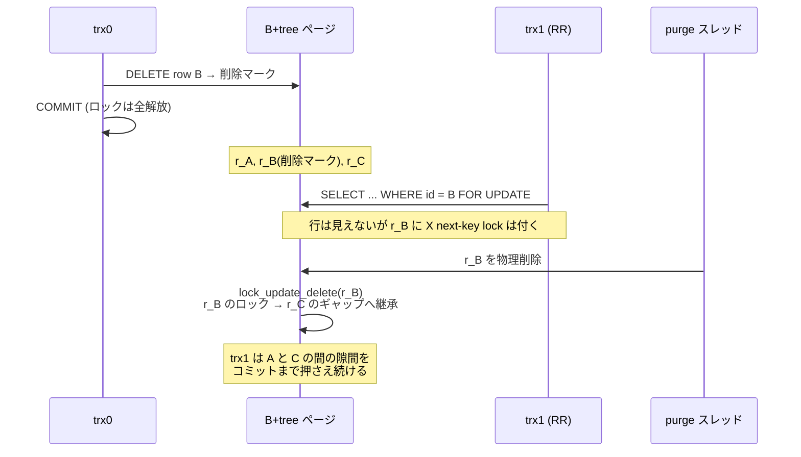

> **前提**: [ロックの種類 (InnoDB)](./lock-modes-and-types/) / [B+tree の操作](./btree-operations/)

## 何を学んだか

`lock_sys` は行を「テーブル + インデックス + 主キー値」で識別していない。**ページ番号とページ内のヒープ番号で識別している。** `lock0lock.h` の設計コメントが、その代償をそのまま書いている。

> The Lock-sys identifies records by their page_no (the identifier of the page which contains the record) and the heap_no (the position in page's internal array of allocated records), as opposed to table, index and primary key. This becomes important in case of B-tree merges, splits, or reallocation of variable-length records, all of which need to notify the Lock-sys to reflect the change.

つまり **B+tree がページを触るたびに `lock_sys` へ通知しなければならない**。通知の入口は `lock_update_*` / `lock_move_*` という名前で 15 個ほどあり、`btr0btr.cc` と `btr0cur.cc` から呼ばれている。

読んでみると、やっていることは 2 種類しかなかった。

- **move** — ビットマップの該当ビットを別の (ページ, ヒープ番号) に移し、元を消す。モードはそのまま
- **inherit** — 別のレコードに**ギャップロックとして**同じモードを追加する。元は消さない

そして操作のほとんどが **supremum の付け替え**に見える。supremum はページの右端の隙間を代表する擬似レコードなので、「ページの境界が動く」ことは「supremum が持っていた隙間の権利が動く」ことと同じだからだ。

もう 1 つ、このページを書くきっかけになった挙動がある。**削除された行のロックは消えず、次のレコードのギャップロックとして生き残る。** `DELETE` の直後ではなく、purge がその行を物理的に取り除くときに `lock_update_delete` が呼ばれ、そこで継承が起きる。**「もう存在しない行を守っていたロック」が「隣の行の手前の隙間」に化ける**、というのが InnoDB のロックが直感より広く見える理由の 1 つだ。

## なぜそうなっているか

**物理アドレスで識別しているのは、ロックをビットマップにするためだ。** `lock_t` 1 個がページ 1 枚に対応し、その中の行はビット 1 本で表される ([ロックの種類のページ](./lock-modes-and-types/))。キー値で識別する設計なら 1 行 1 構造体になり、1 万行を更新するトランザクションが 1 万個の構造体を持つことになる。**ビットマップにできたのは物理アドレスで揃えたおかげで、その代わりに物理構造の変化を追いかける義務を負った。**

**ギャップロックを「継承」しなければならないのは、隙間が消えないからだ。** ギャップロックの意味は「この隙間に行を挿入させない」であって、特定の行を守っているのではない。行 B が消えれば、A と B の間の隙間と B と C の間の隙間は 1 つに融合する。**融合後の隙間を誰も守らなくなれば、そこにファントムが入り込む。** だから消える行のロックは、隙間の新しい代表者——次のレコード——に引き継がれる。

**待機中のロックまで「許可済みのギャップロック」として継承するのは、待つ理由が消えるからだ。** 待っていたのはその行そのものへのアクセス権で、行が消えれば待つ対象がない。しかし「その隙間を守りたかった」という意図は残る。だからギャップロックに格下げして許可する。

**insert intention だけは継承されない。** これは「ここに挿入したい」という一時的な意図であって、隙間の保護ではないからだ ([INSERT のロックのページ](./insert-and-duplicate-check/))。継承すると、挿入し終わったトランザクションが無関係な隙間を永久に押さえることになる。

**READ COMMITTED で継承しないのは、そもそもギャップロックを作らない方針の一部だ** ([RR と RC の違い](./locking-in-rr-vs-rc/))。ただし例外がある。**制約検査のために取ったロックは、RC でも文の終わりまでは継承する。** `INSERT` は「重複を検査する」「実際に挿入する」の 2 段階で動き、1 段目で取ったロックが 2 段目まで生きていることを前提にしている。その間に purge が対象行を消すと保護が消えてしまう。

**ページ内でレコードが動くとき infimum に預けるのは、infimum が絶対に動かないからだ。** 可変長カラムの更新でレコードのサイズが変わると、レコードは同じページ内の別の場所か、別のページに移る。移動中にロックの置き場所が要る。infimum はページに必ず 1 個あり、ヒープ番号が固定で、ユーザレコードとしては使われない。**空いている番地としてちょうどいい。**

## ソースコードのどこか

### 2 つの基本操作

継承のほう ([`lock0lock.cc#L2458`](https://github.com/mysql/mysql-server/blob/mysql-8.4.11/storage/innobase/lock/lock0lock.cc#L2458))。

```cpp title="storage/innobase/lock/lock0lock.cc"
  lock_sys->rec_hash.find_on_record(RecID{block, heap_no}, [&](lock_t *lock) {
    if (!lock->trx->skip_lock_inheritance &&
        !lock_rec_get_insert_intention(lock) &&
        !lock->index->table->skip_gap_locks() &&
        (!lock->trx->skip_gap_locks() || lock->trx->lock.inherit_all.load())) {
      lock_rec_add_to_queue(LOCK_REC | LOCK_GAP | lock_get_mode(lock),
                            heir_block, heir_heap_no, lock->index, lock->trx);
    }
    return false;
  });
```

**継承するかどうかの条件が 4 つ並んでいるのが、このページの中心だ。**

| 条件                                      | 意味                                                        |
| ----------------------------------------- | ----------------------------------------------------------- |
| `!skip_lock_inheritance`                  | XA PREPARE でギャップロックを手放したトランザクションは除外 |
| `!lock_rec_get_insert_intention(lock)`    | insert intention は継承しない                               |
| `!index->table->skip_gap_locks()`         | データディクショナリ表は MDL で守られるので除外             |
| `!trx->skip_gap_locks() \|\| inherit_all` | RC は原則除外。ただし `inherit_all` が立っていれば継承      |

そして追加されるモードには `LOCK_GAP` が付く。**元が next-key lock でも record lock でも、継承先ではギャップロックになる。**

移動のほう ([L2536](https://github.com/mysql/mysql-server/blob/mysql-8.4.11/storage/innobase/lock/lock0lock.cc#L2536))。

```cpp title="storage/innobase/lock/lock0lock.cc"
  lock_hash.find_on_record(RecID{donator, donator_heap_no}, [&](lock_t *lock) {
    const ulint type_mode = lock->type_mode;

    lock_rec_clear_request_no_wakeup(lock, donator_heap_no);

    /* Note that we FIRST reset the bit, and then set the lock:
    the function works also if donator == receiver */

    lock_rec_add_to_queue(type_mode, receiver, receiver_heap_no, lock->index,
                          lock->trx);
    return false;
  });
```

`type_mode` をそのまま渡すので**モードは変わらない**。先にビットを落としてから立てる理由も書いてある——同じページ内の移動 (`donator == receiver`) でも壊れないようにするためだ。

### ページ分割 — supremum の付け替え

分割は「左ページの右端」が「右ページの右端」になる操作だ。

```
分割前:  [ left: r1 r2 r3 r4 (sup) ]
                            ^^^^^ 右端の隙間はここが代表

分割後:  [ left: r1 r2 (sup) ] -> [ right: r3 r4 (sup) ]
                        ^^^^^              ^^^^^
                        新しい隙間          元の右端の隙間
```

`lock_update_split_right` ([L2932](https://github.com/mysql/mysql-server/blob/mysql-8.4.11/storage/innobase/lock/lock0lock.cc#L2932)) はこの 2 つを 2 行で処理する。

```cpp title="storage/innobase/lock/lock0lock.cc"
  /* Move the locks on the supremum of the left page to the supremum
  of the right page */

  lock_rec_move(right_block, left_block, PAGE_HEAP_NO_SUPREMUM,
                PAGE_HEAP_NO_SUPREMUM);

  /* Inherit the locks to the supremum of left page from the successor
  of the infimum on right page */

  lock_rec_inherit_to_gap(left_block, right_block, PAGE_HEAP_NO_SUPREMUM,
                          heap_no);
```

1 行目が**元の右端の隙間の権利を右ページへ move**、2 行目が**右ページの先頭レコードのロックを左ページの新しい supremum へ inherit**。2 行目が要るのは、分割線がちょうど「守られていた隙間」の内側を通ったときに、その隙間の左半分を守る者がいなくなるからだ。

併合は逆で、`lock_update_merge_right` ([L2957](https://github.com/mysql/mysql-server/blob/mysql-8.4.11/storage/innobase/lock/lock0lock.cc#L2957)) が左ページの supremum のロックを、併合先の先頭レコードへ継承してから、左ページのロックを解放する。**ここで待機中のロックが起こされる** (`lock_rec_reset_and_release_wait_low`)。

`lock_update_discard` ([L3114](https://github.com/mysql/mysql-server/blob/mysql-8.4.11/storage/innobase/lock/lock0lock.cc#L3114)) はもっと乱暴だ。ページが捨てられるとき、**そのページ上の全レコードのロックを 1 つの相続人 (heir) に集約する**。infimum から supremum まで順に回り、すべて `lock_rec_inherit_to_gap` で heir に流し込む。ページ 1 枚分のロックが 1 レコードのギャップロックに畳まれる。

### 挿入と削除

挿入 ([`lock_update_insert`, L3163](https://github.com/mysql/mysql-server/blob/mysql-8.4.11/storage/innobase/lock/lock0lock.cc#L3163)) は「次のレコード」からギャップロックだけを受け継ぐ。使う関数が `lock_rec_inherit_to_gap_if_gap_lock` ([L2514](https://github.com/mysql/mysql-server/blob/mysql-8.4.11/storage/innobase/lock/lock0lock.cc#L2514)) に変わっているのがポイントで、条件が少し違う。

```cpp title="storage/innobase/lock/lock0lock.cc"
    if (!lock->trx->skip_lock_inheritance &&
        !lock_rec_get_insert_intention(lock) &&
        (heap_no == PAGE_HEAP_NO_SUPREMUM || !lock_rec_get_rec_not_gap(lock))) {
```

**`LOCK_REC_NOT_GAP` (行そのものだけのロック) は継承しない。** 新しい行が割り込んでも、既存の行に対する権利は変わらないからだ。ここには RC の除外条件が無い——挿入で分割された隙間は、RC でも元の権利者が持ち続ける。

削除 ([`lock_update_delete`, L3189](https://github.com/mysql/mysql-server/blob/mysql-8.4.11/storage/innobase/lock/lock0lock.cc#L3189)) は 3 行だ。

```cpp title="storage/innobase/lock/lock0lock.cc"
  /* Let the next record inherit the locks from rec, in gap mode */

  lock_rec_inherit_to_gap(block, block, next_heap_no, heap_no);

  /* Reset the lock bits on rec and release waiting transactions */

  lock_rec_reset_and_release_wait(block, heap_no);
```

呼び出し元は `btr_cur_optimistic_delete` ([`btr0cur.cc#L4574`](https://github.com/mysql/mysql-server/blob/mysql-8.4.11/storage/innobase/btr/btr0cur.cc#L4574)) と `btr_cur_pessimistic_delete` ([L4730](https://github.com/mysql/mysql-server/blob/mysql-8.4.11/storage/innobase/btr/btr0cur.cc#L4730))。**この 2 つを呼ぶのは主に purge だ** ([purge のページ](./purge/))。`DELETE` 文が行うのは削除マークを立てることだけで、レコードが物理的に消えるのは purge が来たときなので、**継承もそのタイミングで起きる**。



change buffer のマージも同じ関数を通る ([`ibuf0ibuf.cc#L3769`](https://github.com/mysql/mysql-server/blob/mysql-8.4.11/storage/innobase/ibuf/ibuf0ibuf.cc#L3769))。8.4 では change buffer は既定で無効だが、経路としては残っている ([change buffer のページ](./change-buffer/))。

### 制約検査のロックだけ RC でも継承する

`lock_rec_inherit_to_gap` の上には 20 行のコメントがあり、`inherit_all` というヒューリスティックの説明になっている。

> It is not easy to tell if a particular lock was created for constraint check or not, because we do not store this bit of information on it. What we do, is we use a heuristic: whenever a trx requests a lock with lock_duration_t::AT_LEAST_STATEMENT we set trx->lock.inherit_all, meaning that locks of this trx need to be inherited. And we clear trx->lock.inherit_all on statement end.

**ロックに「制約検査で取った」という印を持たせる代わりに、トランザクション側に 1 ビット立てる。** `AT_LEAST_STATEMENT` を指定して取るのは重複検査の経路だけで ([`row0ins.cc#L1390`](https://github.com/mysql/mysql-server/blob/mysql-8.4.11/storage/innobase/row/row0ins.cc#L1390))、そのとき `lock_protect_locks_till_statement_end` がフラグを立てる。降ろすのは文の終わり ([`lock_on_statement_end`, L2444](https://github.com/mysql/mysql-server/blob/mysql-8.4.11/storage/innobase/lock/lock0lock.cc#L2444)、`trx_mark_sql_stat_end` から呼ばれる)。

**粒度が「トランザクション単位 × 文の間」なので、実際には制約検査以外のロックも巻き込んで継承される。** 精度より単純さを取った実装だと、コメント自身が認めている。

反対側のフラグが `skip_lock_inheritance` で、XA PREPARE のときに立つ ([`trx0trx.cc#L3028`](https://github.com/mysql/mysql-server/blob/mysql-8.4.11/storage/innobase/trx/trx0trx.cc#L3028))。宣言のコメントに理由が書いてある——レプリケーションの適用で、並行する UNIQUE INSERT や REPLACE が取ったギャップロックに引っかかりたくない ([RR と RC の違い](./locking-in-rr-vs-rc/))。

### レコードが動くときの一時退避

`btr_cur_pessimistic_update` の中 ([`btr0cur.cc#L3690`](https://github.com/mysql/mysql-server/blob/mysql-8.4.11/storage/innobase/btr/btr0cur.cc#L3690), [L4004](https://github.com/mysql/mysql-server/blob/mysql-8.4.11/storage/innobase/btr/btr0cur.cc#L4004))。

```cpp title="storage/innobase/lock/lock0lock.cc"
void lock_rec_store_on_page_infimum(
    const buf_block_t *block, const rec_t *rec)
{
  ulint heap_no = page_rec_get_heap_no(rec);
  ...
  lock_rec_move(block, block, PAGE_HEAP_NO_INFIMUM, heap_no);
}
```

[L3221](https://github.com/mysql/mysql-server/blob/mysql-8.4.11/storage/innobase/lock/lock0lock.cc#L3221)。対になる `lock_rec_restore_from_page_infimum` ([L3244](https://github.com/mysql/mysql-server/blob/mysql-8.4.11/storage/innobase/lock/lock0lock.cc#L3244)) は、移動先のページと元のページの**両方の**シャードを latch して戻す。移動先が別ページでもよいのはこのためだ。

この仕組みがあるので、ページ再編成の関数にも注意書きが付いている。

> NOTE: we copy also the locks set on the infimum of the page; the infimum may carry locks if an update of a record is occurring on the page, and its locks were temporarily stored on the infimum.

### 再編成だけ手が込んでいる

`lock_move_reorganize_page` ([L2597](https://github.com/mysql/mysql-server/blob/mysql-8.4.11/storage/innobase/lock/lock0lock.cc#L2597)) は、ページ内のヒープ番号が総入れ替えになるので、**全ロックをいったんヒープにコピーしてビットマップを空にし、新旧のページを infimum から同時に辿りながら付け替える**。

その前に 1 行だけ、目的の分かりにくい呼び出しがある。

```cpp title="storage/innobase/lock/lock0lock.cc"
    lock_move_granted_locks_to_front(old_locks);
```

[L2573](https://github.com/mysql/mysql-server/blob/mysql-8.4.11/storage/innobase/lock/lock0lock.cc#L2573) の関数で、コピーしたリストの中で許可済みロックを前に集める。これは**「キューの中では許可済みが待機中より前」という不変条件**を再構築後も保つためだ。この不変条件はデッドロック検出が依存している ([CATS のページ](./lock-scheduling-cats/))。

呼び出し元は `btr_page_reorganize_low` ([`btr0btr.cc#L1285`](https://github.com/mysql/mysql-server/blob/mysql-8.4.11/storage/innobase/btr/btr0btr.cc#L1285)) と、圧縮ページの再圧縮 ([`page0zip.cc#L2620`](https://github.com/mysql/mysql-server/blob/mysql-8.4.11/storage/innobase/page/page0zip.cc#L2620))。**圧縮テーブルは再編成が起きやすいので、この経路も相応に通る** ([行フォーマットのページ](./record-format/))。

### 通知の一覧

| 関数                                | 呼び出し元                                   | 何をするか                                      |
| ----------------------------------- | -------------------------------------------- | ----------------------------------------------- |
| `lock_move_reorganize_page`         | `btr_page_reorganize_low` / `page0zip.cc`    | 全ロックを退避して新ヒープ番号に付け替え        |
| `lock_move_rec_list_end` / `_start` | ページ分割の実処理                           | 移動するレコード群のロックを新ページへ move     |
| `lock_update_split_right` / `_left` | `btr_page_split_and_insert`                  | supremum の move + 隣接ページからの inherit     |
| `lock_update_split_point`           | `btr_page_split_and_insert`                  | 分割点の隙間だけ inherit                        |
| `lock_update_merge_right` / `_left` | `btr_compress`                               | supremum の inherit + 待機解放 + 破棄ページ掃除 |
| `lock_update_root_raise`            | `btr_root_raise_and_insert`                  | root の supremum を新ページへ move              |
| `lock_update_discard`               | `btr_discard_page`                           | ページ全体のロックを 1 レコードに集約           |
| `lock_update_insert`                | `btr_cur_optimistic_insert` など             | 次レコードからギャップロックだけ inherit        |
| `lock_update_delete`                | `btr_cur_*_delete` (主に purge)、ibuf マージ | 次レコードへ inherit + 待機解放                 |
| `lock_rec_store_on_page_infimum`    | `btr_cur_pessimistic_update`、R-tree 分割    | 移動中のロックを infimum に退避                 |

## どう活かすか

**「もう無い行」のギャップロックが残るのは仕様だ。** `DELETE` した行の範囲を別のトランザクションが `INSERT` できずに待つ、という現象は、消えた行のロックが隣に継承された結果として説明できる。`performance_schema.data_locks` の `LOCK_DATA` には**継承先のレコードの値**が出るので、DELETE した値そのものは出てこない ([data_locks のページ](./data-locks-and-sys-schema/))。**ログに出ているキーと、アプリが消したキーが一致しないことがある。**

**大量 DELETE の直後に INSERT が詰まるなら、purge の遅れを疑う。** 継承が起きるのは purge が物理削除するときだが、purge が遅れている間は削除マーク付きのレコードがそのまま残り、そのレコード自体が next-key lock の対象になり続ける。**`History list length` を見るのが先**で、ロックの調査はその後でいい ([purge のページ](./purge/))。

**ホットなページの分割は、ロックの付け替えを伴う。** 分割は左右 2 ページのシャードを同時に latch する ([lock_sys のページ](./lock-sys-sharding/))。単調増加 PK の末尾ページに INSERT が集中する構成では、分割のたびにこの経路が走る。**「末尾ページが熱い」問題は B+tree の latch だけの話ではない。**

**RC ならギャップロックが全く残らない、とは言えない。** 制約検査のために取ったロックは `inherit_all` の分だけ継承される。しかもフラグはトランザクション単位なので、**同じ文の中で取った他のロックも巻き込まれる**。RC にしても `INSERT ... ON DUPLICATE KEY UPDATE` 周りのデッドロックが消えないのは、この経路が残っているからだ ([INSERT のロックのページ](./insert-and-duplicate-check/))。

**圧縮テーブルではロックの付け替えが余計に走る。** 再圧縮に失敗するとページ再編成が起き、そのたびに `lock_move_reorganize_page` が全ロックをコピーし直す。ロックを大量に持つトランザクションと圧縮テーブルの組み合わせは、**見えにくいところで CPU を使う**。
