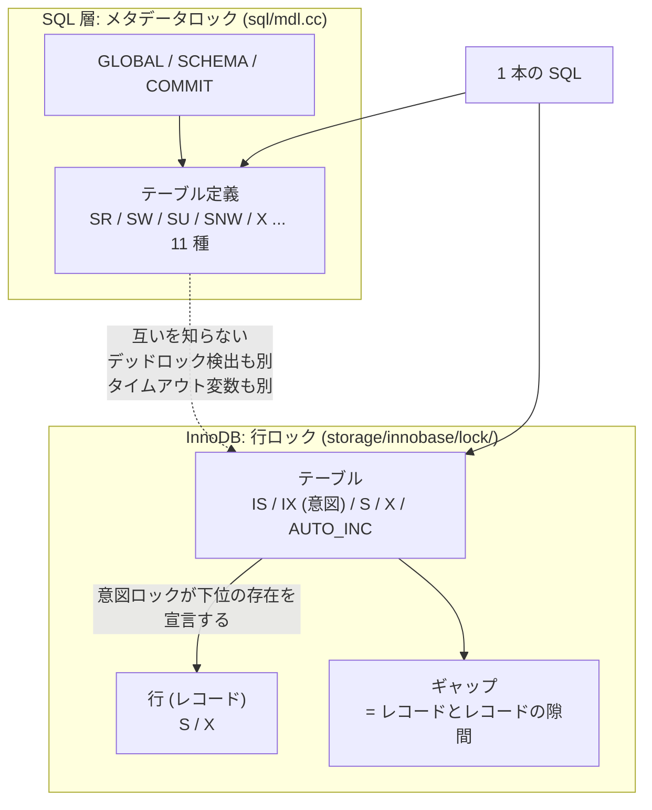

> **前提**: [分離レベルとアノマリ](./isolation-levels-and-anomalies/)

## 何を学んだか

ロックの話は 2 つの軸に分けると整理できる。

- **モード** — どう使いたいか。読むだけの**共有 (S)** と、書き換える**排他 (X)**。S 同士だけが共存できる
- **対象** — 何をロックするか。ここが階層になっている

対象の階層はこうなっている。



読み取るべき点が 4 つある。

**1. 階層があるから「意図ロック」が要る。** 誰かが `LOCK TABLES t WRITE` でテーブル全体の X を取ろうとしたとき、「今この表のどこかの行にロックが掛かっていないか」を確かめる必要がある。全行を調べるのは現実的でないので、**行にロックを掛ける側が先に親 (テーブル) に印を置く**。それが intention shared (IS) と intention exclusive (IX) だ。IS と IX は互いに競合せず、テーブル全体の S / X とだけ競合する。

**2. 「ギャップ」という対象は、存在しない行をロックするための唯一の手段だ。** ファントムを防ぐには「これから挿入されるかもしれない行」を止めなければならないが、存在しない行にはロックを掛けられない。だからインデックスの順序上の**隙間**を対象にする。ギャップロックの効果は「その隙間への挿入を止める」ことだけで、それ以外は何も邪魔しない ([ロックの種類 (実装)](./lock-modes-and-types/))。

**3. いつ外すかがもう 1 つの軸になる。** 2 相ロック (2PL) は「取る段階」と「外す段階」を分ける規則で、いったん外し始めたら二度と取らない。InnoDB はさらに厳しい strict 2PL で、**書き込みのロックはコミット / ロールバックまで一切外さない**。だから「トランザクションを短くする」がロック競合の第一の対処になる。

**4. MySQL にはもう 1 層ある。** テーブル定義を守る**メタデータロック (MDL)** が SQL 層にあって、InnoDB の行ロックとは完全に別の機構だ。2 つのロックマネージャは互いの待ちグラフを見ないので、またがるデッドロックは検出されない。待ち時間の上限を決める変数も別々になっている。

|                               | InnoDB の行ロック                           | MDL                                      |
| ----------------------------- | ------------------------------------------- | ---------------------------------------- |
| どこにあるか                  | `storage/innobase/lock/`                    | `sql/mdl.cc`                             |
| 守るもの                      | 行とギャップ、テーブルの意図                | テーブル**定義**                         |
| 寿命                          | コミットまで                                | コミットまで                             |
| デッドロック検出              | **背景スレッドが周期的に**見る              | **待ちに入るスレッド自身**がその場で見る |
| タイムアウト変数              | `innodb_lock_wait_timeout` (既定 **50 秒**) | `lock_wait_timeout` (既定 **1 年**)      |
| 見るビュー                    | `performance_schema.data_locks`             | `performance_schema.metadata_locks`      |
| `SHOW PROCESSLIST` の `State` | (行ロック待ちは特別な名前を持たない)        | `Waiting for table metadata lock`        |

**変数名が紛らわしいのが実務上いちばんの罠だ。** `lock_wait_timeout` は MDL 用で、既定が 1 年ある。

## なぜそうなっているか

### なぜ意図ロックという回りくどい仕組みが要るのか

粒度が階層になっている以上、**上位のロックを取る側が下位の状態を知る手段**が要る。素直にやるなら全行を走査して確かめることになるが、1 億行のテーブルでそれはできない。

だから「下位にロックを掛けるなら、掛ける前に上位へ印を置け」という規則にする。上位のロックを取る側は印だけ見ればよくなり、判定が O(1) になる。**意図ロック同士が決して衝突しない**のは、印が「存在の宣言」でしかなく、排他性を主張していないからだ。

代金は、行ロックを取るたびに (実際にはトランザクション + テーブルにつき 1 回) テーブルロックのキューを触ることだ。これが `lock_sys` のテーブル用シャードへの競合として現れる ([lock_sys — 512 シャードと latching](./lock-sys-sharding/))。

### なぜギャップという概念が必要なのか

ファントムは「まだ存在しない行」が原因で起きる。存在しない行にはロックを掛けられないので、**代わりに「値の範囲」をロックする**しかない。理論上の道具は述語ロック (predicate lock) で、「`WHERE x BETWEEN 10 AND 20` を満たす行すべて」をロックする。だが任意の述語同士の重なり判定は高くつく。

InnoDB の近似は「インデックスの順序上の隙間」だ。B+tree のレコードとレコードの間を 1 つの対象とみなし、そこへの挿入だけを禁じる。判定はキーの比較で済む。

近似であることの帰結が 2 つある。**インデックスがない条件では範囲を表現できない**ので、`WHERE non_indexed = 5` の `UPDATE` は全行に next-key lock を掛けることになる。そして**ロックの範囲は「述語が指す論理的な範囲」ではなく「走査したインデックス上の物理的な範囲」**になる。同じ条件でも、使われたインデックスが違えばロックの掛かり方が変わる。

### なぜ 2PL なのか

直列化可能性を保証する最も単純な規則が 2PL だからだ。「外し始めたら二度と取らない」という制約さえ守れば、実行結果は何らかの直列実行と一致する。

InnoDB がさらに strict にして**コミットまで一切外さない**のは、ロールバックとの整合のためだ。文の途中でロックを外すと、その行を他人が読んでしまったあとで自分がロールバックする可能性がある (cascading abort)。コミットまで持てばこれが起きない。

代金は明快で、**トランザクションが長いほどロックを持つ時間が長い**。「トランザクションを短く」という定石は、この 1 点だけで説明できる。

### なぜ MDL が別レイヤなのか

テーブル定義は SQL 層のものだ。`TABLE_SHARE` は SQL 層のキャッシュで、パーティションを持てば複数の `handler` にまたがるし、原理的には複数のエンジンをまたぐこともある。**InnoDB のテーブルロックだけでは、定義を差し替えてよいタイミングを決められない。**

分けた代金は 2 つある。

- **またがるデッドロックが検出されない。** InnoDB の行ロックを待っているセッションが MDL を持っていて、MDL を待っているセッションが行ロックを持っていても、どちらのグラフにも閉路が見えない。どちらかのタイムアウトが切れるまで待つことになる
- **待ち方が非対称になる。** MDL は待ちに入るスレッド自身がグラフを辿るので、デッドロックなら即座に `ER_LOCK_DEADLOCK` が返る。InnoDB は背景スレッドが周期的に見るので、`innodb_lock_wait_timeout` (既定 50 秒) に先に当たることがある ([デッドロック検出](./deadlock-detection/))

## ソースコードのどこか

### モードは 5 つ、行に使うのは 2 つだけ

```cpp title="storage/innobase/include/lock0types.h"
/* Basic lock modes */
enum lock_mode {
  LOCK_IS = 0,          /* intention shared */
  LOCK_IX,              /* intention exclusive */
  LOCK_S,               /* shared */
  LOCK_X,               /* exclusive */
  LOCK_AUTO_INC,        /* locks the auto-inc counter of a table
                        in an exclusive mode */
  LOCK_NONE,            /* this is used elsewhere to note consistent read */
  LOCK_NUM = LOCK_NONE, /* number of lock modes */
  LOCK_NONE_UNSET = 255
};
```

[`lock0types.h#L53`](https://github.com/mysql/mysql-server/blob/mysql-8.4.11/storage/innobase/include/lock0types.h#L53)。互換性は 5×5 の表で決まる。

```cpp title="storage/innobase/include/lock0priv.h"
 Note that for rows, InnoDB only acquires S or X locks.
 For tables, InnoDB normally acquires IS or IX locks.
 S or X table locks are only acquired for LOCK TABLES.
 Auto-increment (AI) locks are needed because of
 statement-level MySQL binlog.
 See also lock_mode_compatible().
 */
static const byte lock_compatibility_matrix[5][5] = {
    /**         IS     IX       S     X       AI */
    /* IS */ {true, true, true, false, true},
    /* IX */ {true, true, false, false, true},
    /* S  */ {true, false, true, false, false},
    /* X  */ {false, false, false, false, false},
    /* AI */ {true, true, false, false, false}};
```

[`lock0priv.h#L593`](https://github.com/mysql/mysql-server/blob/mysql-8.4.11/storage/innobase/include/lock0priv.h#L593)。コメントが役割分担をそのまま書いている。**行には S と X しか使わず、テーブルには通常 IS と IX しか使わない。** テーブルの S / X が出てくるのは `LOCK TABLES` のときだけだ。

表の見どころは 2 行目・3 行目の交差点だ。**IX と IX は互換 (true)** なので、複数のセッションが同じテーブルに同時に書ける。**IX と S は非互換 (false)** なので、誰かが行を書いている間はテーブル全体の共有ロックが取れない。**IS と IX も互換**で、意図ロック同士は決してぶつからない。「下位に何かある」という宣言でしかないからだ。

### 行を触る前に必ずテーブルへ意図ロックを置く

```cpp title="storage/innobase/row/row0sel.cc"
  wait_table_again:
    err = lock_table(0, index->table,
                     prebuilt->select_lock_type == LOCK_S ? LOCK_IS : LOCK_IX,
                     thr);
```

[`row_search_mvcc` (`row0sel.cc#L4835`)](https://github.com/mysql/mysql-server/blob/mysql-8.4.11/storage/innobase/row/row0sel.cc#L4835)。`SELECT ... FOR SHARE` なら IS、`FOR UPDATE` なら IX。ロックなしの `SELECT` はこの `else` 側に来ないので、**意図ロックすら取らない**。

挿入側も同じ形をしている。

```cpp title="storage/innobase/row/row0ins.cc"
    if (trx->id == node->trx_id) {
      /* No need to do IX-locking */

      goto same_trx;
    }

    err = lock_table(0, node->table, LOCK_IX, thr);
```

[`row_ins` (`row0ins.cc#L3695`)](https://github.com/mysql/mysql-server/blob/mysql-8.4.11/storage/innobase/row/row0ins.cc#L3695)。同じトランザクションが直前にも同じテーブルへ挿入していたら省く、というキャッシュが入っている。**意図ロックはテーブルにつき 1 個で足りる**ので、1 万行の `INSERT` でも `lock_table` は 1 回しか通らない。

行ロック側にはこれを前提にしたアサーションが並んでいる。

```cpp title="storage/innobase/lock/lock0lock.cc"
        lock_table_has(thr_get_trx(thr), index->table, LOCK_IX) ||
```

[`lock_rec_lock_fast` (`lock0lock.cc#L1650`)](https://github.com/mysql/mysql-server/blob/mysql-8.4.11/storage/innobase/lock/lock0lock.cc#L1650) ほか十数か所。**「行に X を取るなら、テーブルに IX を持っているはず」が不変条件**として機械的に検査されている。

### 外すのはコミットの 1 か所

```cpp title="storage/innobase/lock/lock0lock.cc"
void lock_trx_release_locks(trx_t *trx) /*!< in/out: transaction */
```

[`lock0lock.cc#L5904`](https://github.com/mysql/mysql-server/blob/mysql-8.4.11/storage/innobase/lock/lock0lock.cc#L5904)。`trx_commit_in_memory` から呼ばれる。**「取る」は文の実行中に何度も起きるが、「外す」はここ 1 回**という形が strict 2PL の実装だ。

例外は 2 つある。READ COMMITTED では条件に合わなかった行のロックを文の途中で外し、XA PREPARE でギャップロックだけ先に手放す。どちらも RC 以下限定で、[RR と RC の違い](./locking-in-rr-vs-rc/)で扱う。

### MDL は別の enum、別の互換行列

```cpp title="sql/mdl.h"
enum enum_mdl_type {
  ...
  MDL_INTENTION_EXCLUSIVE = 0,
```

[`sql/mdl.h#L196`](https://github.com/mysql/mysql-server/blob/mysql-8.4.11/sql/mdl.h#L196)。11 種類あり、`SELECT` が取る `MDL_SHARED_READ`、書き込み系の `MDL_SHARED_WRITE`、`ALTER TABLE` の第 1 段階で取る `MDL_SHARED_UPGRADABLE`、`DROP` / `RENAME` の `MDL_EXCLUSIVE` などが並ぶ。

**InnoDB と同じ「意図ロック」の考え方がここにもある** (`MDL_INTENTION_EXCLUSIVE`) が、こちらはテーブルではなく GLOBAL / SCHEMA といったスコープに対して使う。同じ概念を、別の階層に対して、別の実装で持っていることになる。

11 種類の意味と互換行列、そして「待っている X の後ろに後続が全部並ぶ」という性質は[MDL — ALTER が「固まる」正体](./metadata-locking/)にある。

## どう活かすか

### 詰まったとき、まず「どの層か」を切り分ける

`SHOW PROCESSLIST` の `State` 列が最初の分岐になる。

| State                              | どの層か                                | 次に見るもの                                        |
| ---------------------------------- | --------------------------------------- | --------------------------------------------------- |
| `Waiting for table metadata lock`  | **MDL**                                 | `performance_schema.metadata_locks`                 |
| `Waiting for commit lock`          | **MDL** (`FLUSH TABLES WITH READ LOCK`) | 同上、`OBJECT_TYPE = 'COMMIT'`                      |
| `updating` / `statistics` で長時間 | **InnoDB の行ロック**                   | `performance_schema.data_locks` / `data_lock_waits` |

**取り違えると何も見つからない。** MDL で止まっているときに `data_locks` を見ても空だし、その逆も同じだ。`SHOW PROCESSLIST` 自体は MDL を取らないので、詰まっている最中でも実行できる。

### タイムアウト変数が 2 つあることを設定に反映する

`innodb_lock_wait_timeout` を 5 秒に絞っても、`lock_wait_timeout` は既定 1 年のままだ。**DDL を流す前にセッション単位で下げる**のが現実的な対処になる。

```sql
SET SESSION lock_wait_timeout = 10;
ALTER TABLE users ADD COLUMN ...;
```

取れなければ 10 秒で失敗する。失敗すること自体が目的で、取れない ALTER が待ち続けると後続のクエリが全部その後ろに並ぶ ([MDL](./metadata-locking/))。

### `data_locks` に出ていないから安全、とは言えない

自分が `INSERT` / `UPDATE` した行には自分の `DB_TRX_ID` が入っていて、それ自体が排他ロックとして働く (暗黙ロック)。`lock_t` は作られないので `data_locks` に現れない。**競合が起きて初めて行が生える。** ロックの調査は「今のスナップショット」ではなく「待ちが起きている瞬間」に取る必要がある ([ロックの種類 (実装)](./lock-modes-and-types/))。

### この続き

- record / gap / next-key / insert intention の実装と互換表は[ロックの種類 — record / gap / next-key / insert intention、暗黙ロック](./lock-modes-and-types/)
- RC でギャップロックがどこで消えるかは[RR と RC の違い](./locking-in-rr-vs-rc/)
- MDL の 11 種と 2 枚の互換行列、`ALTER` が固まる連鎖は[MDL — ALTER が「固まる」正体](./metadata-locking/)
- デッドロック検出が周期的である理由は[デッドロック検出 — 背景スレッドが wait-for graph を見る](./deadlock-detection/)
- ロック構造がページ単位である理由と 512 シャードは[lock_sys — 512 シャードと latching](./lock-sys-sharding/)
- ロックを外す側の順序は[コミットとロールバックの内部](./commit-and-rollback-internals/)
