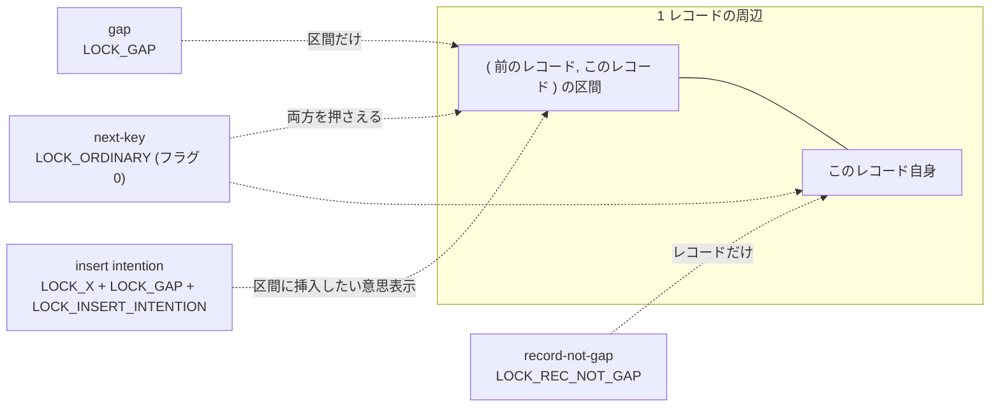

## 何を学んだか

InnoDB の行ロックについて、ソースを読んで印象が変わったのは 3 点だった。

**1. `lock_t` は行 1 件ではなくページ 1 枚に対応する。** 構造体の中身は `page_id` と `n_bits` で、その直後にビットマップが続く。同じページの同じ種類のロックを 100 行分取っても、構造体は 1 個でビットが 100 本立つだけだ。

**2. next-key lock は「フラグが 1 つも立っていない状態」である。** `LOCK_ORDINARY == 0` で、`LOCK_GAP` / `LOCK_REC_NOT_GAP` / `LOCK_INSERT_INTENTION` はそこに足すフラグ。つまり **InnoDB のデフォルトの行ロックは next-key lock で、ギャップを外すほうが特別扱い**という設計になっている。

**3. ロックは取れるとは限らないし、そもそも作られないことも多い。** 自分が書いた行には `DB_TRX_ID` が自分の ID で入っているので、それが**暗黙ロック**として働く。`lock_t` が作られるのは、他人がその行を触りに来て `lock_rec_convert_impl_to_expl` が呼ばれたときだけだ。だから `performance_schema.data_locks` に出てこない行でも、実質ロックされていることがある。

## ソースコードのどこか

### `lock_t` — ページ 1 枚 + ビットマップ

```cpp title="storage/innobase/include/lock0priv.h"
/** Record lock for a page */
struct lock_rec_t {
  /** The id of the page on which records referenced by this lock's bitmap are
  located. */
  page_id_t page_id;
  /** number of bits in the lock bitmap;
  Must be divisible by 8.
  NOTE: the lock bitmap is placed immediately after the lock struct */
  uint32_t n_bits;
```

[`lock0priv.h#L84`](https://github.com/mysql/mysql-server/blob/mysql-8.4.11/storage/innobase/include/lock0priv.h#L84)。`lock_t` 本体は [L137](https://github.com/mysql/mysql-server/blob/mysql-8.4.11/storage/innobase/include/lock0priv.h#L137) にあり、`tab_lock` と `rec_lock` の union、`trx`、`index`、`hash`、そして `type_mode` を持つ。ビットの添字は**レコードのヒープ番号** ([ページの構造](./page-layout/)) だ。

`type_mode` は 1 つの `uint32_t` にモードと型フラグを詰め込んでいる。

```cpp title="storage/innobase/include/lock0lock.h"
constexpr uint32_t LOCK_MODE_MASK = 0xF;
/** table lock */
constexpr uint32_t LOCK_TABLE = 16;
/** record lock */
constexpr uint32_t LOCK_REC = 32;
...
constexpr uint32_t LOCK_WAIT = 256;
/* Precise modes */
/** this flag denotes an ordinary next-key lock in contrast to LOCK_GAP or
 LOCK_REC_NOT_GAP */
constexpr uint32_t LOCK_ORDINARY = 0;
...
constexpr uint32_t LOCK_GAP = 512;
...
constexpr uint32_t LOCK_REC_NOT_GAP = 1024;
...
constexpr uint32_t LOCK_INSERT_INTENTION = 2048;
```

[`lock0lock.h#L949-L983`](https://github.com/mysql/mysql-server/blob/mysql-8.4.11/storage/innobase/include/lock0lock.h#L949)。下位 4 ビットがモード (`lock_mode` enum、[`lock0types.h#L54`](https://github.com/mysql/mysql-server/blob/mysql-8.4.11/storage/innobase/include/lock0types.h#L54): `LOCK_IS` / `LOCK_IX` / `LOCK_S` / `LOCK_X` / `LOCK_AUTO_INC`)、上のビットが型フラグ。

`LOCK_ORDINARY == 0` なので、next-key lock を判定する述語は「フラグが立っていないこと」を確かめる形になる。

```cpp title="storage/innobase/include/lock0priv.h"
static inline bool lock_mode_is_next_key_lock(ulint mode) {
  static_assert(LOCK_ORDINARY == 0, "LOCK_ORDINARY must be 0 (no flags)");
  ut_ad((mode & LOCK_TABLE) == 0);
  mode &= ~(LOCK_WAIT | LOCK_REC);
  ...
  return (mode & ~(LOCK_MODE_MASK)) == LOCK_ORDINARY;
}
```

[L119](https://github.com/mysql/mysql-server/blob/mysql-8.4.11/storage/innobase/include/lock0priv.h#L119)。対になる述語は [`is_gap()` (L201)](https://github.com/mysql/mysql-server/blob/mysql-8.4.11/storage/innobase/include/lock0priv.h#L201) / [`is_record_not_gap()` (L204)](https://github.com/mysql/mysql-server/blob/mysql-8.4.11/storage/innobase/include/lock0priv.h#L204) / [`is_next_key_lock()` (L207)](https://github.com/mysql/mysql-server/blob/mysql-8.4.11/storage/innobase/include/lock0priv.h#L207) / [`is_insert_intention()` (L212)](https://github.com/mysql/mysql-server/blob/mysql-8.4.11/storage/innobase/include/lock0priv.h#L212)。

4 種類を並べるとこうなる。



### 待つかどうかを決める 1 つの関数

行ロックの互換性判定は [`locksys::rec_lock_check_conflict` (`lock0lock.cc#L553`)](https://github.com/mysql/mysql-server/blob/mysql-8.4.11/storage/innobase/lock/lock0lock.cc#L553) に集約されている。**8.4 では `lock_rec_has_to_wait` という名前の関数はなく**、[`rec_lock_has_to_wait` (L653)](https://github.com/mysql/mysql-server/blob/mysql-8.4.11/storage/innobase/lock/lock0lock.cc#L653) がこれを呼ぶ薄いラッパになっている。中身はガード節の列だ。

1. 同じトランザクション → 待たない
2. モード (`LOCK_S` / `LOCK_X`) が互換 → 待たない (1 と 2 はソースでは 1 つの `if` にまとまっている)
3. (高優先度トランザクションの特例)
4. **要求がギャップロック (または supremum 上) で、insert intention でない → 何も待たない**
5. **要求が insert intention でなく、既存ロックにギャップフラグが立っている → 待たない**
6. **要求がギャップフラグ付き (= insert intention) で、既存が record-not-gap → 待たない**
7. **既存が insert intention → 誰も待たない**
8. 要求も既存も X のレコードロックで、既存が待ち状態、かつ自分がすでに「その既存ロックを待たせている granted ロック」を持っている → `CAN_BYPASS` (追い越してよい) ([L622](https://github.com/mysql/mysql-server/blob/mysql-8.4.11/storage/innobase/lock/lock0lock.cc#L622))
9. それ以外 → 待つ

4 と 7 にはソースのコメントが付いている。

```cpp title="storage/innobase/lock/lock0lock.cc"
  if ((lock_is_on_supremum || (type_mode & LOCK_GAP)) &&
      !(type_mode & LOCK_INSERT_INTENTION)) {
    /* Gap type locks without LOCK_INSERT_INTENTION flag
    do not need to wait for anything. This is because
    different users can have conflicting lock types
    on gaps. */

    return Conflict::NO_CONFLICT;
  }
```

モードの互換性そのものは [`lock_compatibility_matrix` (`lock0priv.h#L593`)](https://github.com/mysql/mysql-server/blob/mysql-8.4.11/storage/innobase/include/lock0priv.h#L593) にある 5×5 の表で決まる。

```cpp title="storage/innobase/include/lock0priv.h"
static const byte lock_compatibility_matrix[5][5] = {
    /**         IS     IX       S     X       AI */
    /* IS */ {true, true, true, false, true},
    /* IX */ {true, true, false, false, true},
    /* S  */ {true, false, true, false, false},
    /* X  */ {false, false, false, false, false},
    /* AI */ {true, true, false, false, false}};
```

**行ロックで使われるのは S と X だけ**で、`IS` / `IX` はテーブルロック (意図ロック)、`AI` は AUTO-INC ロック用だ。行に対しては「S 同士だけ互換、それ以外は非互換」に縮む。

### 行ロックの互換表

上のガード節から、行ロック同士の待ち関係を書き下すとこうなる (ガード 3 と 8 は高優先度トランザクションや待ち状態のロックが絡む特例なので、ここでは除く)。行が**これから取ろうとするロック**、列が**他のトランザクションがすでに持っているロック**。○ は待たない、✗ は待つ。

| 要求 \ 既存            | S gap | S rec-not-gap | S next-key | X gap | X rec-not-gap | X next-key | X insert intention |
| ---------------------- | ----- | ------------- | ---------- | ----- | ------------- | ---------- | ------------------ |
| **S gap**              | ○     | ○             | ○          | ○     | ○             | ○          | ○                  |
| **S rec-not-gap**      | ○     | ○             | ○          | ○     | ✗             | ✗          | ○                  |
| **S next-key**         | ○     | ○             | ○          | ○     | ✗             | ✗          | ○                  |
| **X gap**              | ○     | ○             | ○          | ○     | ○             | ○          | ○                  |
| **X rec-not-gap**      | ○     | ✗             | ✗          | ○     | ✗             | ✗          | ○                  |
| **X next-key**         | ○     | ✗             | ✗          | ○     | ✗             | ✗          | ○                  |
| **X insert intention** | ✗     | ○             | ✗          | ✗     | ○             | ✗          | ○                  |

この表から読み取れることを言葉にすると次のようになる。

- **ギャップロックを取る側は絶対に待たない。** 「gap を取る」行は全部 ○ だ。X gap と X gap も衝突しない。ギャップロックは「ここに他人が入ってこないようにする」機能しか持たず、ギャップロック同士は共存する
- **insert intention だけがギャップロックに引っかかる。** 表の最下行を見ると、S gap / X gap / S next-key / X next-key に対して ✗ が付いている。**ギャップロックの唯一の効果は「INSERT を止めること」**だ
- **insert intention は誰も待たせない。** 最右列は全部 ○。ソースのコメントが「next-key lock が insert intention を待つと不要なデッドロックになるから」と説明している
- **insert intention は record-not-gap を待たない。** 挿入は「隙間」に対する操作なので、レコード自身の排他ロックとは競合しない

なお next-key を要求する行 (3 行目・6 行目) が「X gap」列でも ○ なのは、既存がギャップロックなら「レコードを触る」要求は無条件で通るという 5 番目のガード節による。**next-key lock を要求する側が、他人のギャップロックで待たされることはない。**

### 暗黙ロック — レコードの `DB_TRX_ID` がロックである

自分が INSERT / UPDATE した行には、自分の ID が `DB_TRX_ID` に入る。**この事実そのものが排他ロックとして働く**。`lock_t` は作られない。

他のトランザクションがその行に触ろうとすると、明示ロックへの変換が起きる。

```cpp title="storage/innobase/lock/lock0lock.cc"
    if (!trx_state_eq(trx, TRX_STATE_COMMITTED_IN_MEMORY) &&
        !lock_rec_has_expl(LOCK_X | LOCK_REC_NOT_GAP, block, heap_no, trx)) {
      ulint type_mode;

      type_mode = (LOCK_REC | LOCK_X | LOCK_REC_NOT_GAP);

      lock_rec_add_to_queue(type_mode, block, heap_no, index, trx, true);
    }
```

[`lock_rec_convert_impl_to_expl_for_trx` (L5245)](https://github.com/mysql/mysql-server/blob/mysql-8.4.11/storage/innobase/lock/lock0lock.cc#L5245) の核心部。**暗黙ロックは常に `LOCK_X | LOCK_REC_NOT_GAP` に変換される。** ギャップは含まない。

呼び出し側は [`lock_rec_convert_impl_to_expl` (L5301)](https://github.com/mysql/mysql-server/blob/mysql-8.4.11/storage/innobase/lock/lock0lock.cc#L5301) で、クラスタードインデックスなら `DB_TRX_ID` を読んで `trx_rw_is_active` にかけるだけ。セカンダリインデックスは葉に `DB_TRX_ID` がないので、[`row_vers_impl_x_locked` (`row0vers.cc#L528`)](https://github.com/mysql/mysql-server/blob/mysql-8.4.11/storage/innobase/row/row0vers.cc#L528) でクラスタード側の版鎖を辿る羽目になる ([セカンダリインデックスと MVCC](./secondary-index-visibility/))。

### ロックを取る入口

読み取りロックの入口は 2 つ。

- [`lock_clust_rec_read_check_and_lock` (L5509)](https://github.com/mysql/mysql-server/blob/mysql-8.4.11/storage/innobase/lock/lock0lock.cc#L5509)
- [`lock_sec_rec_read_check_and_lock` (L5460)](https://github.com/mysql/mysql-server/blob/mysql-8.4.11/storage/innobase/lock/lock0lock.cc#L5460)

どちらも**まずシャード latch の外で `lock_rec_convert_impl_to_expl` を呼び、その後で `Shard_latch_guard` を取って `lock_rec_lock` に入る**。暗黙→明示の変換は自分でシャード latch を取り直す ([lock_sys のシャーディング](./lock-sys-sharding/))。

`lock_rec_lock` ([L1878](https://github.com/mysql/mysql-server/blob/mysql-8.4.11/storage/innobase/lock/lock0lock.cc#L1878)) は速い道と遅い道に分かれる。[`lock_rec_lock_fast` (L1631)](https://github.com/mysql/mysql-server/blob/mysql-8.4.11/storage/innobase/lock/lock0lock.cc#L1631) は「そのページにロックが 1 つもない、または自分の同じ `type_mode` のロックが 1 つだけある」場合を扱い、ビットを立てて終わる。それ以外は [`lock_rec_lock_slow` (L1763)](https://github.com/mysql/mysql-server/blob/mysql-8.4.11/storage/innobase/lock/lock0lock.cc#L1763) に落ちて互換性を全部確かめる。

### SKIP LOCKED / NOWAIT はここで分岐する

`lock_rec_lock_slow` の中で、衝突が見つかった直後に分岐がある。

```cpp title="storage/innobase/lock/lock0lock.cc"
  if (conflicting.wait_for != nullptr) {
    switch (sel_mode) {
      case SELECT_SKIP_LOCKED:
        return (DB_SKIP_LOCKED);
      case SELECT_NOWAIT:
        return (DB_LOCK_NOWAIT);
      case SELECT_ORDINARY:
        ...
        dberr_t err = rec_lock.add_to_waitq(conflicting.wait_for);
```

[L1824-L1839](https://github.com/mysql/mysql-server/blob/mysql-8.4.11/storage/innobase/lock/lock0lock.cc#L1824)。`select_mode` は [`lock0types.h#L47`](https://github.com/mysql/mysql-server/blob/mysql-8.4.11/storage/innobase/include/lock0types.h#L47) の 3 値 enum で、`SELECT ... FOR UPDATE SKIP LOCKED` / `NOWAIT` が `ha_innobase::store_lock` ([`ha_innodb.cc#L19843`](https://github.com/mysql/mysql-server/blob/mysql-8.4.11/storage/innobase/handler/ha_innodb.cc#L19843)) でここにマップされる。

**重要なのは、この 2 つが待ちロックを作らずに帰ることだ。** 待ちキューに入らないので wait-for graph にも現れず、デッドロックの当事者にもならない。

### `FOR SHARE` / `FOR UPDATE` がロックモードになるまで

`ha_innodb.cc` の `ha_innobase::external_lock` の中にそのままの表がコメントで置かれている。

```
    +--------------------+----------------+-----------------+------+
    | non-locking SELECT | NONE [1]       | S [3]           | NONE |
    | SELECT FOR SHARE   | S [2]          | S               | NONE |
    | SELECT FOR UPDATE  | X              | X               | X    |
    +--------------------+----------------+-----------------+------+
```

[L19006-L19019](https://github.com/mysql/mysql-server/blob/mysql-8.4.11/storage/innobase/handler/ha_innodb.cc#L19006)。左の列が SERIALIZABLE 未満、中央が SERIALIZABLE。**SERIALIZABLE では素の `SELECT` が `LOCK_S` に化ける**のがここで分かる (autocommit のときは例外で `LOCK_NONE` のまま)。

`FOR UPDATE` が `LOCK_X` になるのは [L18992](https://github.com/mysql/mysql-server/blob/mysql-8.4.11/storage/innobase/handler/ha_innodb.cc#L18992)、`FOR SHARE` が `LOCK_S` になるのは `store_lock` が `TL_READ_WITH_SHARED_LOCKS` を受けたときだ。

そして **gap を付けるかどうか (`LOCK_ORDINARY` か `LOCK_REC_NOT_GAP` か) は別の軸**で、`row_search_mvcc` が走査中に決める ([RR と RC のページ](./locking-in-rr-vs-rc/))。

## なぜそうなっているか

**`lock_t` をページ単位にしたのは、B+tree のページ分割・併合と足並みを揃えるためだ。** ページが分割されると、そのページ上のロックも新しいページへ移す必要がある。`lock_rec_move` / `lock_rec_inherit_to_gap` のような操作は「ページとヒープ番号」を単位にしていて、`lock_t` がページ単位ならビットマップの付け替えで済む。行 1 件 1 構造体にすると、分割のたびに数十個のロックを個別に張り替えることになる。副次的に、範囲スキャンで同一ページの多数の行をロックしてもメモリが増えないという利点も付いてくる。

**`LOCK_ORDINARY == 0` にしたのは、next-key lock が既定だからだ。** InnoDB の RR がファントムを防げるのは、素直に走査したときに取るロックが next-key だからで、「ギャップを外す」ほうを明示的なフラグにしておけば、フラグを見落としたコードが安全側に倒れる。実際 `lock_mode_is_next_key_lock` の `static_assert` はこの前提が崩れないことを守っている。

**ギャップロック同士が衝突しないのは、ギャップロックが「範囲の所有」ではなく「INSERT の禁止」だからだ。** 互換表の最下行以外が全部 ○ になるのはこの帰結で、複数のトランザクションが同じ隙間に同時にギャップロックを持ってよい。もし所有権として扱ったら、範囲スキャンが至るところで衝突して RR は実用にならない。

**暗黙ロックがあるのは、ロック構造体を作らずに済ませたいからだ。** INSERT した行に毎回 `lock_t` を作れば、1 万行の INSERT で 1 万回のロック生成が要る。実際にはその行を他人が触ることはほとんどないので、「触りに来たやつが変換する」という遅延評価にしている。代償として、`lock_rec_convert_impl_to_expl` は他人のトランザクションのために他人の名義でロックを作るという奇妙な操作になり、その間トランザクションが消えないよう参照カウント (`trx_is_referenced`) で押さえている。

## どう活かすか

**`performance_schema.data_locks` に出ていないから安全、とは言えない。** 自分が INSERT / UPDATE した行のロックは暗黙ロックなので構造体が存在せず、`data_locks` に現れない。競合が起きて初めて行が生える。ロック調査は「今のスナップショット」ではなく「待ちが起きている瞬間」に取る必要がある ([data_locks のページ](./data-locks-and-sys-schema/))。

**`LOCK_DATA` が `supremum pseudo-record` になっている行はギャップロックだ。** ページ末尾の supremum に対するロックは常にギャップとして扱われる (`rec_lock_check_conflict` の 4 番目のガード節)。**この行が見えたら、誰かの INSERT を止めている可能性がある**と読む。

**`SELECT ... FOR UPDATE` を「行だけ押さえる」つもりで使うと INSERT を止める。** RR では next-key lock なので、レコードの手前のギャップも押さえる。ジョブキューのように「1 行取って処理する」用途では、押さえた行の周辺への INSERT が止まる。`... FOR UPDATE SKIP LOCKED` はロック済み行を飛ばすが、ギャップの扱いは変わらない。ギャップを外したいなら分離レベルを RC にするのが正攻法だ ([RR と RC のページ](./locking-in-rr-vs-rc/))。

**`NOWAIT` と `SKIP LOCKED` は待ちキューに入らないので、デッドロックにならない代わりに公平性もない。** `NOWAIT` は `ER_LOCK_NOWAIT` を即座に返す。リトライループを書くなら、指数バックオフを入れないと待っている他のセッションを追い越し続けることになる。

**「`Lock wait timeout exceeded` は出るのにデッドロックにはならない」ケースの説明がこの表にある。** 待ち相手が insert intention だけなら誰も待たない (最右列が全部 ○) ので、`INSERT` 同士は原則ぶつからない。ぶつかるのは片方がギャップロックか next-key lock を持っているときで、その典型が UNIQUE 制約の重複検査だ ([INSERT のロックのページ](./insert-and-duplicate-check/))。

**同じページに大量のロックを取っても `lock_t` の個数は増えない。** `SHOW ENGINE INNODB STATUS` の TRANSACTIONS セクションに出る `N lock struct(s)` は構造体の個数で、`N row lock(s)` が実際にビットの立っている行数だ。この 2 つが大きく食い違うのは正常で、`lock struct` の数が少ないからロックが緩いという読み方はできない。
