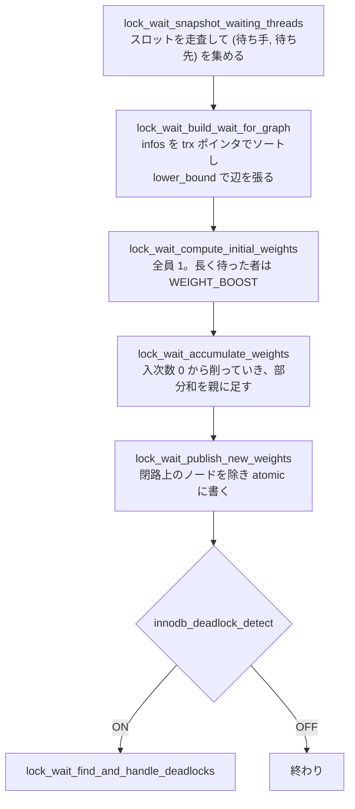

> **前提**: [ロックの種類 (InnoDB)](./lock-modes-and-types/) / [デッドロック検出](./deadlock-detection/)

## 何を学んだか

ロック待ちの説明はたいてい「キューに並んで順番を待つ」で終わる。InnoDB はそうなっていない。

- **キューの中の待ち行列は、許可の順番を決めていない。** ロックが解放されるとき、InnoDB は待っているロックを**重み順に並べ替えてから**許可の可否を判定する
- 重みは `trx->lock.schedule_weight` で、意味は**「このトランザクションが (推移的に) 何本のトランザクションを止めているか」**。多くを止めている者を先に通せば、より多くが動き出せるという理屈
- これは論文から来ている。ヘッダに出典が書いてある——"Contention-Aware Lock Scheduling for Transactional Databases"。**略称が CATS**
- 重みを計算するのは**デッドロック検出と同じ背景スレッド**。同じ wait-for graph のスナップショットから、閉路探索と重み計算の両方をやる
- したがって **`innodb_deadlock_detect=OFF` にしても、スナップショットと重み計算は毎回走る**。止まるのは閉路探索だけだ
- 待ち続けている者が飢えないよう、**長く待った者には重みのブースト**が入る。基準は「自分が待ち始めてから 2n 件の待ちが発生したか」
- そして**待機中のロックを追い越すこと (bypass) は意図的に禁止**されている。禁止しないと `S` の流入で `X` が永久に待たされる

## なぜそうなっているか

**FIFO は公平だがスループットを最大化しない。** ロック待ちの木を考えると、20 本のトランザクションを止めている待ち手と、誰も止めていない待ち手が同じキューに並ぶことがある。前者を先に通せば 20 本が動き出すが、後者を先に通しても 1 本しか進まない。**CATS は「合計でどれだけ多くのトランザクションを走らせられるか」を基準に順序を決める。**

**重みをその場で計算しないのは、ロック解放が高頻度な操作だからだ。** 解放のたびに wait-for graph 全体を歩いていては話にならない。だから**背景スレッドが定期的に計算して各トランザクションの `std::atomic` に書き込み、解放側は `memory_order_relaxed` で読むだけ**にしている。順序の精度は近似で構わない——間違った順序で許可しても正しさは損なわれず、遅くなるだけだからだ。

**それでもスナップショットを取ってからソートするのは、比較関数の一貫性のためだ。** `std::sort` は比較が実行中に変わるとアルゴリズムが壊れる。重みは他スレッドが書き換えるので、**読んだ値をペアにして保持してからソートする**。コード中のコメントがこの理由を明記している。

**bypass を禁止したのは飢餓を防ぐためだ。** 待つ理由 (blocking transaction) はトランザクションごとに 1 つしか記録されない。新しい要求は許可済みと待機中の両方に対して衝突を見るが、許可の判定では許可済みしか見ない。ここで「待機中の相手はもう無視してよい」としたくなるが、**`X` が待っている前を `S` が次々に通り抜けられるようになってしまう**。だから blocking transaction が終わるまでは通さない、という規約を維持している。

**長く待った者をブーストするのは、CATS が本質的に不公平だからだ。** 誰も止めていない軽いトランザクションは、重い者に永久に追い越されうる。判定の基準がおもしろい——**「自分が待ち始めてから 2n 件の予約が発生した (n は現在の待ち手の数) なら、少なくとも n 件に追い越された計算になるので不公平だ」**というヒューリスティックになっている。

**許可済みグループを逆時系列に保っているのは、デッドロック検出のためだ。** 待ち手が「誰のせいで待っているか」を選ぶとき、古い許可済みロックから順に見る。新しい許可済みロックは先頭に足されるので、**古いものから選べば、いつかは必ず全員が blocking transaction として観測される**。常に先頭から選ぶと、新しいロックが次々に来るせいで特定の相手が永久に観測されず、その相手とのデッドロックが検出されない。

## ソースコードのどこか

### キューは 1 本、群は 2 つ

設計の全体像は [`storage/innobase/include/lock0lock.h#L130`](https://github.com/mysql/mysql-server/blob/mysql-8.4.11/storage/innobase/include/lock0lock.h#L130) から 100 行ほどのコメントにある。図がそのまま描いてある。

```
                                           |
Grows <---- [HEAD] [G7 -- G3 -- G2 -- G1] -|- [W4 -- W5 -- W6] [TAIL] ---> Grows
                         Grant Group       |         Wait Group

        G - Granted W - waiting,
        suffix number is the chronological order of requests.
```

**許可済みは先頭に足すので逆時系列、待機中は末尾に足すので時系列。** そしてコメントは、待機中の順序に意味が無いことをはっきり書いている。

> In the Wait Group the locks are in chronological order. We will not assert this invariant as there is no significance of the order (and hence the position) as the locks are re-ordered based on CATS weight while making a choice for grant, and CATS weights change constantly to reflect current shape of the Wait-for graph.

**「並んだ順に意味はない」と明言されている。** 逆に許可済み側の逆時系列は `ut_ad` で検証される。デッドロック検出が依存しているからだ。

重みの型は 32bit 符号なし ([`lock0types.h#L91`](https://github.com/mysql/mysql-server/blob/mysql-8.4.11/storage/innobase/include/lock0types.h#L91))。

```cpp title="storage/innobase/include/lock0types.h"
typedef uint32_t trx_schedule_weight_t;
```

### 解放するとき、4 つの箱に仕分ける

`lock_rec_grant_by_heap_no` ([`lock0lock.cc#L2129`](https://github.com/mysql/mysql-server/blob/mysql-8.4.11/storage/innobase/lock/lock0lock.cc#L2129)) が本体だ。まずキューを 1 周して 4 つに分ける。

```cpp title="storage/innobase/lock/lock0lock.cc"
  Locks<lock_t *> low_priority_light{heap.get()};
  Locks<lock_t *> waiting{heap.get()};
  Locks<lock_t *> granted{heap.get()};
  Locks<LockDescriptorEx> low_priority_heavier{heap.get()};
```

| 箱                     | 中身                                       |
| ---------------------- | ------------------------------------------ |
| `granted`              | 既に許可されているロック                   |
| `waiting`              | High Priority トランザクションの待機ロック |
| `low_priority_heavier` | 重み 2 以上の待機ロック (重みとペアで持つ) |
| `low_priority_light`   | 重み 1 以下の待機ロック                    |

仕分けの途中に、このアルゴリズムの要になる 1 行がある。

```cpp title="storage/innobase/lock/lock0lock.cc"
    /* We will only consider granting the `lock`, if we are the reason it
    was waiting. */
    if (blocking_trx != in_trx) {
      return false;
    }
```

**「自分を blocking transaction として指しているロック」しか候補にしない。** 他の誰かを待っている待ち手は、この解放では絶対に許可されない。これが bypass 禁止の実装だ。

並べ替えは `stable_sort` で、重みの降順。同点は元の位置順になる。

```cpp title="storage/innobase/lock/lock0lock.cc"
  /* We want high schedule weight to be in front, and break ties by position */
  std::stable_sort(low_priority_heavier.begin(), low_priority_heavier.end(),
                   [](const LockDescriptorEx &a, const LockDescriptorEx &b) {
                     return (a.first > b.first);
                   });
  for (const auto &descriptor : low_priority_heavier) {
    waiting.push_back(descriptor.second);
  }
  waiting.insert(waiting.end(), low_priority_light.begin(),
                 low_priority_light.end());
```

最終的な順序は **High Priority → 重い順 → 軽いもの (元の順)**。High Priority は Group Replication のための概念で、コメントいわく「CATS の重みとは今のところ無関係」だ。

そのあと順に許可を試す。ここに 1 つ罠がある。

```cpp title="storage/innobase/lock/lock0lock.cc"
    const lock_t *blocking_lock =
        lock_rec_has_to_wait_for_granted(wait_lock, granted, new_granted_index);
    if (blocking_lock == nullptr) {
      lock_grant(wait_lock);

      lock_rec_move_granted_to_front(wait_lock, rec_id);

      granted.push_back(wait_lock);
    } else {
      lock_update_wait_for_edge(wait_lock, blocking_lock);
    }
```

**このループで許可されたロックは `granted` に追加され、後続の判定対象になる。** つまり重い者が先に許可されると、軽い者は「さっき許可されたばかりのロック」と衝突して待ち続けることがある。許可できなかった場合は、待つ理由 (wait-for graph の辺) を更新して次へ進む。

`lock_rec_grant` ([L2288](https://github.com/mysql/mysql-server/blob/mysql-8.4.11/storage/innobase/lock/lock0lock.cc#L2288)) には、この関数を呼ぶ前の早期リターンがある。コメントが実運用の観察を書いていて興味深い。

> In some scenarios, in particular in replication appliers, it is often the case, that there are no WAITING locks, and in such situation iterating over all bits, and calling lock_rec_grant_by_heap_no() slows down the execution noticeably.

**レプリカの適用スレッドはロック待ちがほぼ発生しないので、ベクタを確保するだけ無駄**という話だ ([レプリケーション遅延のページ](./replication-lag/))。

### 重みを計算するのは背景スレッド

`lock0wait.cc` の後半がまるごと重み計算になっている。入口は 1 つ ([L1377](https://github.com/mysql/mysql-server/blob/mysql-8.4.11/storage/innobase/lock/lock0wait.cc#L1377))。

```cpp title="storage/innobase/lock/lock0wait.cc"
static void lock_wait_update_schedule_and_check_for_deadlocks() {
  ...
  auto table_reservations = lock_wait_snapshot_waiting_threads(infos);
  lock_wait_build_wait_for_graph(infos, outgoing);

  /* We don't update trx->lock.schedule_weight for trxs on cycles. */
  lock_wait_compute_and_publish_weights_except_cycles(infos, table_reservations,
                                                      outgoing, new_weights);

  if (innobase_deadlock_detect) {
    /* This will also update trx->lock.schedule_weight for trxs on cycles. */
    lock_wait_find_and_handle_deadlocks(infos, outgoing, new_weights);
  }
}
```

**`if (innobase_deadlock_detect)` が最後の 1 ブロックだけを包んでいる。** スナップショット取得、グラフ構築、重み計算・公開はその外にある。呼び出すのは `lock_wait_timeout_thread` ([L1432](https://github.com/mysql/mysql-server/blob/mysql-8.4.11/storage/innobase/lock/lock0wait.cc#L1432)) で、待ち手が現れるたびに叩き起こされ、そうでなくても 1 秒ごとに回る ([デッドロック検出のページ](./deadlock-detection/))。

処理は 4 段だ。



**ブーストの基準**が [L607](https://github.com/mysql/mysql-server/blob/mysql-8.4.11/storage/innobase/lock/lock0wait.cc#L607) にある。

```cpp title="storage/innobase/lock/lock0wait.cc"
  const trx_schedule_weight_t WEIGHT_BOOST =
      n == 0 ? 1 : std::min<trx_schedule_weight_t>(n, 1e9 / n);
  new_weights.clear();
  new_weights.resize(n, 1);
  const uint64_t MAX_FAIR_WAIT = 2 * n;
  for (size_t from = 0; from < n; ++from) {
    if (infos[from].reservation_no + MAX_FAIR_WAIT < table_reservations) {
      new_weights[from] = WEIGHT_BOOST;
    }
  }
```

`reservation_no` は待ちスロットを予約したときの通し番号だ。**自分の予約番号と現在の総予約数の差が 2n を超えたらブースト。** 上のコメントが「公平な世界では 2n 回の待ちに対して 2n 回の起床があり、n 人ほど起きたら自分の番のはずだ」という考え方を説明している。`1e9 / n` でクランプするのは、部分和を取るときのオーバーフロー対策だ。

**重みの累積は DFS ではない** ([L834](https://github.com/mysql/mysql-server/blob/mysql-8.4.11/storage/innobase/lock/lock0wait.cc#L834))。各ノードの出次数は高々 1 なので (待つ理由は 1 つだけ)、入次数 0 のノードから順に削っていくトポロジカルソートで足し込める。処理し終わって `incoming_count` が 0 にならなかったノードが**閉路上のノード**になり、そのまま「閉路かどうか」の判定に使われる。**1 つの配列が重み計算と閉路検出の両方を兼ねている。**

公開するとき ([L886](https://github.com/mysql/mysql-server/blob/mysql-8.4.11/storage/innobase/lock/lock0wait.cc#L886)) には ABA の確認が入る。スナップショットを取ってから計算するまでの間に、そのスロットが解放されて別のトランザクションに再利用されているかもしれない。`slot->in_use && slot->reservation_no == infos[id].reservation_no` の両方を見る。

### グラフの作り方に残っている実験の跡

`lock_wait_build_wait_for_graph` ([L650](https://github.com/mysql/mysql-server/blob/mysql-8.4.11/storage/innobase/lock/lock0wait.cc#L650)) は、trx ポインタでソートしてから `lower_bound` で辺を張る。`O(n log n)` だ。なぜハッシュを使わないかが書いてある。

> Using unordered_map<trx_t*,int> however causes too much (de)allocations as its bucket chains are implemented as a linked lists - overall it works much slower than sort. The fastest implementation was to use custom implementation of a hash table with open addressing and double hashing with a statically allocated 2 * srv_max_n_threads buckets. This however did not increase transactions per second, so introducing a custom implementation seems unjustified here.

**「自作ハッシュが一番速かったが、TPS は上がらなかったので採用しない」。** さらに上の `lock_wait_update_schedule_and_check_for_deadlocks` には、もっと長い実験の記録が残っている。

> I was tempted to declare `infos` as `static` ... But, I've run many many various experiments, with/without static, with infos declared outside, with reserve(n) using various values of n (128, srv_max_n_threads, even a simple ML predictor), and nothing, NOTHING was faster than just using local vector as we do here

理由の推測まで書かれている——現代の malloc は ptmalloc2 系で、スレッド数より多いアリーナを持ち、ブロックしないように割り当てるから。**「変える前に必ず実測しろ、分散が大きい」**という警告で締められている。

### 観測

重みの再計算は 1 回ごとにカウンタが上がる ([`srv0mon.cc#L218`](https://github.com/mysql/mysql-server/blob/mysql-8.4.11/storage/innobase/srv/srv0mon.cc#L218))。

```cpp title="storage/innobase/srv/srv0mon.cc"
    {"lock_schedule_refreshes", "lock",
     "Number of times the wait-for graph was analyzed to update schedule "
     "weights of transactions",
     MONITOR_DEFAULT_ON, MONITOR_DEFAULT_START, MONITOR_SCHEDULE_REFRESHES},
```

`MONITOR_DEFAULT_ON` なので、有効化なしで見える ([メトリクスのページ](./innodb-stats-and-metrics/))。

```sql
SELECT NAME, COUNT FROM information_schema.INNODB_METRICS
 WHERE NAME = 'lock_schedule_refreshes';
```

一方で、**重みそのものを見る手段は無い**。`schedule_weight` は `performance_schema.data_locks` にも `SHOW ENGINE INNODB STATUS` にも出てこない。アルゴリズムを切り替えるシステム変数も 8.4 には存在しない。**CATS は常に有効で、観測も調整もできない。**

## どう活かすか

**「先に待った方が先に取れる」を前提にしない。** ロック待ちの時間はキューの位置ではなく、そのトランザクションが何を止めているかで決まる。**待ち時間の分散は FIFO より大きくなる**ので、`innodb_lock_wait_timeout` を待ち時間の実測値ぎりぎりに詰めると、たまに外れを引く。既定の 50 秒を短くするなら、平均ではなく裾を見て決める。

**`innodb_deadlock_detect=OFF` は思ったほど軽くならない。** 背景スレッドはスナップショットと重み計算を毎回行い、その間 `lock_wait_mutex` を保持する。OFF で消えるのは閉路探索と victim 選択だけだ。**`innodb_lock_wait_timeout` を短くしてタイムアウトで倒す運用に切り替えるなら、その効果は「デッドロックの検出コストが消える」ではなく「global X ラッチを取る区間が消える」と理解しておく** ([lock_sys のページ](./lock-sys-sharding/))。

**待ち手が増えるとスケジューリング自体のコストが上がる。** スナップショットは待ち中のスロットを全部走査し、その後 `O(n log n)` のソートが走る。しかもこれが最短 1 秒間隔、待ちが発生するたびに追加で起きる。**「待ちが多い」状態は、待たされているクエリだけでなくサーバ全体に効く。**

**長いトランザクションが優先されるわけではない。** 重みは「止めている数」であって「実行時間」でも「保持しているロックの数」でもない。デッドロックの victim 選択に使われる `trx_weight_ge` (ロック数 + undo 量) とは**別の指標**だ ([デッドロック検出のページ](./deadlock-detection/))。同じ「重み」という言葉が 2 つの意味で使われているので、`SHOW ENGINE INNODB STATUS` のデッドロックログを読むときは混同しない。

**ロック待ちのグラフが浅ければ CATS は効かない。** 全員の重みが 1 なら順序は元のまま——実質 FIFO になる。CATS が効くのは**待ちが連鎖している**ときで、それは 1 本のホットな行に長いトランザクションがぶら下がっている状況だ。**その状況を作らないことが最初の対策**で、スケジューラの賢さに期待する話ではない。
