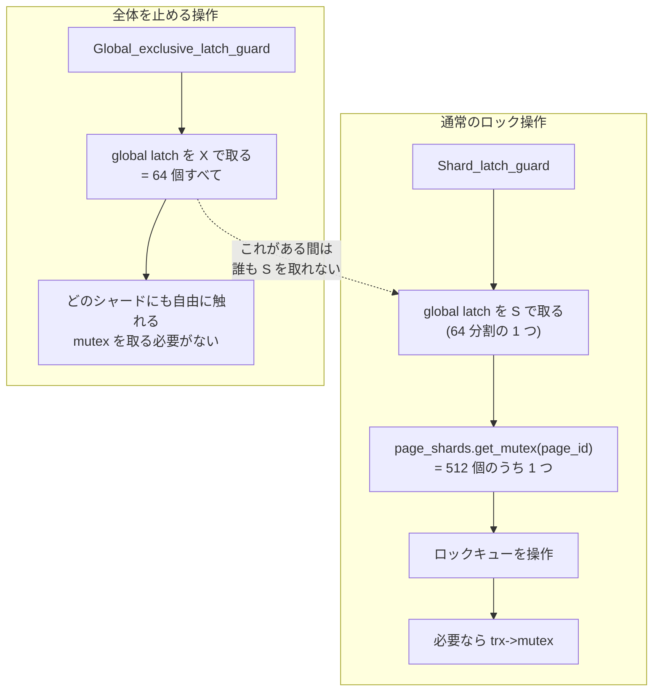

> **前提**: [ロックの種類 (InnoDB)](./lock-modes-and-types/)

## 何を学んだか

`lock_t` はハッシュテーブルにぶら下がったキューで管理されている ([ロックのページ](./lock-modes-and-types/))。そのキューを守る仕組みが `lock_sys` の latch だ。**8.4 の構造は 2 層になっている。**

- 下の層: **ページ用 512 個 + テーブル用 512 個の mutex**。1 つの mutex が複数のロックキューをまとめて守る
- 上の層: **global latch という read-write ラッチ**。普段は S (共有) で取り、シャードの mutex と組み合わせて使う。「全部止める」ときだけ X (排他) で取る

`lock0latches.h` の冒頭コメントに図がそのまま描いてある。

```
  [                           global latch                                ]
                                  |
                                  v
  [table shard 1] ... [table shard 512] [page shard 1] ... [page shard 512]
```

そしてもう 1 つ。**この global latch 自体もシャーディングされている。** 単純な `rw_lock_t` では、S ラッチのカウンタを増減するときに全スレッドが同じキャッシュラインを叩き合うので、ARM で遅すぎたという理由が書かれている。内部的に 64 個の `rw_lock_t` に分散されている。

読んでいて一番効いたのは**latching order** だった。`global latch` → `shard mutex` → `trx->mutex` の順でしか取れない。この制約が、コミット時のロック解放処理を「リストから 1 個取り出して、mutex を放して、シャードを latch して、mutex を取り直して、まだリストにあるか確かめる」という奇妙な形にしている。

## なぜそうなっているか

**単一 mutex を捨てたのは、コア数の増加に対して明らかなボトルネックだったからだ。** ヘッダのコメントが「かつてはすべてを 1 本の latch が守っていた」と書いている。行ロックの取得はほぼ全 DML が通る経路なので、ここが直列化されるとコア数を増やしても性能が伸びない。

**「1 キュー 1 latch」にしなかったのは、latch オブジェクトの数と生成・破棄のコストを避けるためだ。** これもコメントが明言している——「極端には各キューを別の latch で守ることも考えられるが、latch オブジェクトが多くなりすぎ、必要に応じて作ったり消したりしなければならない。そこでより保守的な方法を取る」。**固定 512 個なら起動時に作りきりで済む。**

**それでも global latch を残したのは、「全部止める」操作が必要だからだ。** デッドロック検出は複数のシャードにまたがるトランザクションを一貫した状態で見なければならない。512 個の mutex を 1 つずつ取ることもできるが、コメントいわく「デバッグビルドでは lock_sys の検証で `stop the world` が頻発するので遅すぎた」。**rw-latch を 1 段挟むと、X を 1 回取るだけで全シャードを封じられる。**

**global latch をさらに 64 分割したのは、S 側のコストを消すためだ。** ほぼすべての操作が global を S で取るので、ここが単一のカウンタだと結局同じキャッシュラインの奪い合いになる。分割すれば S は自分のシャードだけを触ればよく、X だけが 64 個全部を回る。**X が稀であることを前提にした非対称な最適化**だ。

**latching order を `global → shard → trx` に固定したのは、デッドロックを構造的に防ぐためだ。** ロック管理の仕組み自身がデッドロックしては話にならない。順序が一方向なら循環はできない。代償として `trx->lock.trx_locks` を安全に走査できなくなり、上の 7 段の手順のような回り道が要る。

## ソースコードのどこか

### `Latches` クラス

[`storage/innobase/include/lock0latches.h#L103`](https://github.com/mysql/mysql-server/blob/mysql-8.4.11/storage/innobase/include/lock0latches.h#L103) の `class Latches`。メンバは 3 つしかない ([L264](https://github.com/mysql/mysql-server/blob/mysql-8.4.11/storage/innobase/include/lock0latches.h#L264))。

```cpp title="storage/innobase/include/lock0latches.h"
  Unique_sharded_rw_lock global_latch;

  Page_shards page_shards;

  Table_shards table_shards;
```

シャード数は 1 つの定数で決まる。

```cpp title="storage/innobase/include/lock0latches.h"
  /** Number of page shards, and also number of table shards.
  Must be a power of two */
  static constexpr size_t SHARDS_COUNT = 512;
```

[L163-L165](https://github.com/mysql/mysql-server/blob/mysql-8.4.11/storage/innobase/include/lock0latches.h#L163)。`Page_shards` ([L176](https://github.com/mysql/mysql-server/blob/mysql-8.4.11/storage/innobase/include/lock0latches.h#L176)) と `Table_shards` ([L223](https://github.com/mysql/mysql-server/blob/mysql-8.4.11/storage/innobase/include/lock0latches.h#L223)) がそれぞれ `Padded_mutex mutexes[SHARDS_COUNT]` を持つ。**`ut::Cacheline_padded` で包まれている**ので、隣り合うシャードが false sharing を起こさない。合計 1024 個の mutex がキャッシュライン単位で並ぶ。

### シャードの決め方

ページ側には条件がある。

```cpp title="storage/innobase/lock/lock0latches.cc"
size_t Latches::Page_shards::get_shard(const page_id_t &page_id) {
  ...
  /* We need a property that if two pages are mapped to the same bucket of the
  hash table, and thus their lock queues are merged, then these two lock queues
  are protected by the same shard. This is why to compute the shard we use the
  cell_id as the input and not the original lock_rec_hash_value's result. */
  return lock_sys->rec_hash.get_cell_id(lock_rec_hash_value(page_id)) %
         SHARDS_COUNT;
}
```

[`lock0latches.cc#L36`](https://github.com/mysql/mysql-server/blob/mysql-8.4.11/storage/innobase/lock/lock0latches.cc#L36)。**ハッシュ値ではなくセル ID を使う。** 2 つのページが同じハッシュバケットに落ちればロックキューは同じ連結リストになるので、それらは必ず同じシャードでなければならない。ハッシュ値を直接 512 で割ると、この性質が壊れる。

テーブル側は単純だ。

```cpp title="storage/innobase/lock/lock0latches.cc"
size_t Latches::Table_shards::get_shard(const table_id_t table_id) {
  return table_id % SHARDS_COUNT;
}
```

[L69](https://github.com/mysql/mysql-server/blob/mysql-8.4.11/storage/innobase/lock/lock0latches.cc#L69)。テーブルは 1 つにつきキューが 1 つなので、ID を割るだけでよい。

### global latch は 64 分割された rw-lock

```cpp title="storage/innobase/lock/lock0latches.cc"
Latches::Unique_sharded_rw_lock::Unique_sharded_rw_lock() {
  rw_lock.create(
#ifdef UNIV_PFS_RWLOCK
      lock_sys_global_rw_lock_key,
#endif
      LATCH_ID_LOCK_SYS_GLOBAL, 64);
}
```

[L92](https://github.com/mysql/mysql-server/blob/mysql-8.4.11/storage/innobase/lock/lock0latches.cc#L92)。理由はヘッダのコメントにある。

> However, it turned out that on ARM architecture, the default implementation of read-write latch (rw_lock_t) is too slow because increments and decrements of the number of s-latchers is implemented as read-update-try-to-write loop, which means multiple threads try to modify the same cache line disrupting each other.

`Unique_sharded_rw_lock` ([`lock0latches.h#L115`](https://github.com/mysql/mysql-server/blob/mysql-8.4.11/storage/innobase/include/lock0latches.h#L115)) は `thread_local size_t m_shard_id` を持ち、**自分がどの内部シャードを S ラッチしたかをスレッドごとに覚える**。だからインスタンスは 1 つしか作れない (`Unique_` の名前の由来)。X ラッチのときは 64 個全部を押さえる。

### RAII ガードの一覧

`lock0guards.h` に 7 つある。使い分けがそのまま「何をしようとしているか」を表す。

| ガード                         | 取るもの                       | 用途                                         |
| ------------------------------ | ------------------------------ | -------------------------------------------- |
| `Shard_latch_guard`            | global S + シャード mutex 1 個 | 通常のロック取得・解放                       |
| `Shard_latches_guard`          | global S + シャード mutex 2 個 | ページ間でロックを移す (B+tree の分割・併合) |
| `Global_shared_latch_guard`    | global S のみ                  | シャードを個別に latch し直しながら回る処理  |
| `Global_exclusive_latch_guard` | global X                       | 全体を止める                                 |
| `Global_exclusive_try_latch`   | global X (try)                 | 止められなければ諦める                       |
| `Shard_naked_latch_guard`      | シャード mutex 1 個のみ        | すでに global を持っている文脈用             |
| `Shard_naked_latches_guard`    | シャード mutex 2 個のみ        | 同上 (2 シャード版)                          |

`Shard_latches_guard` ([`lock0guards.h#L171`](https://github.com/mysql/mysql-server/blob/mysql-8.4.11/storage/innobase/include/lock0guards.h#L171)) は内部で `Shard_naked_latches_guard` を使い、**2 つの mutex をアドレス順 (`std::less<Lock_mutex *>`) に取る**。同じ 2 つのシャードを逆順に取るスレッドがいるとデッドロックするので、順序を固定している。

### `owns_page_shard` が latching の規約を表している

```cpp title="storage/innobase/include/lock0latches.h"
  bool owns_page_shard(const page_id_t &page_id) const {
    return owns_exclusive_global_latch() ||
           (page_shards.get_mutex(page_id).is_owned() &&
            owns_shared_global_latch());
  }
```

[L321](https://github.com/mysql/mysql-server/blob/mysql-8.4.11/storage/innobase/include/lock0latches.h#L321)。**「global を X で持っている」か「global を S で持ち、かつそのシャードの mutex を持っている」のどちらか**。デバッグビルドの `ut_ad` でロック関数の頭にほぼ必ず置かれていて、これが実質的な事前条件の宣言になっている。

### global exclusive を取る場所

ツリー全体で十数箇所しかない。代表的なものを挙げる。**リンク先の行は関数の先頭ではなく、`Global_exclusive_latch_guard` を宣言している行**を指している。

| 場所                                                                                                                                                         | 何をするか                                                                     |
| ------------------------------------------------------------------------------------------------------------------------------------------------------------ | ------------------------------------------------------------------------------ |
| [`lock_wait_check_candidate_cycle` (`lock0wait.cc#L1206`)](https://github.com/mysql/mysql-server/blob/mysql-8.4.11/storage/innobase/lock/lock0wait.cc#L1206) | デッドロック閉路の検証と victim 選択                                           |
| [`lock_remove_all_on_table` (`lock0lock.cc#L4303`)](https://github.com/mysql/mysql-server/blob/mysql-8.4.11/storage/innobase/lock/lock0lock.cc#L4303)        | DROP TABLE / TRUNCATE                                                          |
| [`try_release_read_locks_in_x_mode` (L4084)](https://github.com/mysql/mysql-server/blob/mysql-8.4.11/storage/innobase/lock/lock0lock.cc#L4084)               | RC の XA PREPARE でギャップロックを外す (S モードで 5 回失敗した後の fallback) |
| [`lock_release_autoinc_locks` の呼び出し元 (L5894)](https://github.com/mysql/mysql-server/blob/mysql-8.4.11/storage/innobase/lock/lock0lock.cc#L5894)        | AUTO-INC ロックの解放 (複数テーブルにまたがりうるため)                         |
| [`lock_table_has_locks` (L6038)](https://github.com/mysql/mysql-server/blob/mysql-8.4.11/storage/innobase/lock/lock0lock.cc#L6038)                           | テーブルにロックが残っているかの確認                                           |
| [`lock_sys_resize` (L345)](https://github.com/mysql/mysql-server/blob/mysql-8.4.11/storage/innobase/lock/lock0lock.cc#L345)                                  | バッファプールのリサイズに伴うハッシュ再構築                                   |
| [`trx_print` (`trx0trx.cc#L2675`)](https://github.com/mysql/mysql-server/blob/mysql-8.4.11/storage/innobase/trx/trx0trx.cc#L2675)                            | トランザクションの情報を印字する                                               |
| [`srv_printf_innodb_monitor` (`srv0srv.cc#L1409`)](https://github.com/mysql/mysql-server/blob/mysql-8.4.11/storage/innobase/srv/srv0srv.cc#L1409)            | `SHOW ENGINE INNODB STATUS`                                                    |
| [`trx0i_s.cc#L826`](https://github.com/mysql/mysql-server/blob/mysql-8.4.11/storage/innobase/trx/trx0i_s.cc#L826)                                            | `INFORMATION_SCHEMA.INNODB_TRX` などのキャッシュ生成                           |

**観測系がここに並んでいるのが重要だ。** `SHOW ENGINE INNODB STATUS` は lock_sys 全体を止めて印字する。`srv_printf_innodb_monitor` は `nowait` 引数で 2 つの経路を持ち、`nowait` なら `Global_exclusive_try_latch` を試して取れなければ `FAIL TO OBTAIN LOCK MUTEX, SKIP LOCK INFO PRINTING` と出してロック情報を諦める ([L1409](https://github.com/mysql/mysql-server/blob/mysql-8.4.11/storage/innobase/srv/srv0srv.cc#L1409))。そうでなければ待つ版で確実に全体を止める ([L1417](https://github.com/mysql/mysql-server/blob/mysql-8.4.11/storage/innobase/srv/srv0srv.cc#L1417))。



### latching order がコードの形を決めている

`lock_trx_release_locks` からコミット時のロック解放に降りると、`try_release_all_locks` に妙な手順の説明がある。

```cpp title="storage/innobase/lock/lock0lock.cc"
  However the latching order only allows us to obtain trx->mutex AFTER any
  lock_sys latch. One way around this problem is to simply latch the whole
  lock_sys in exclusive mode (which also prevents any changes to
  trx->lock.trx_locks), however this impacts performance (TPS drops on
  sysbench {pareto,uniform}-2S-{128,1024}-usrs tests by 3% to 11%) Here we
  use a different approach:
  1. we extract lock from the list when holding the trx->mutex,
  2. identify the shard of lock_sys it belongs to,
  3. release the trx->mutex,
  4. acquire the lock_sys shard's latch,
  5. and reacquire the trx->mutex,
  6. verify that the lock pointer is still in trx->lock.trx_locks (so it is
  safe to access it),
  7. and only then perform any action on the lock.
```

[`try_release_all_locks` (`lock0lock.cc#L4125`)](https://github.com/mysql/mysql-server/blob/mysql-8.4.11/storage/innobase/lock/lock0lock.cc#L4125)。**「全部 X で取れば簡単だが 3〜11% 遅くなるので、7 段の手順を踏む」**という判断がそのまま書かれている。失敗したら `false` を返して呼び出し側が `std::this_thread::yield()` してやり直す。

同じ理由で `lock_rec_convert_impl_to_expl` ([L5301](https://github.com/mysql/mysql-server/blob/mysql-8.4.11/storage/innobase/lock/lock0lock.cc#L5301)) は、呼び出し元の `Shard_latch_guard` の**外**で呼ばれ、内部で自分のシャード latch を取り直す ([`lock_clust_rec_read_check_and_lock` の L5529-L5535](https://github.com/mysql/mysql-server/blob/mysql-8.4.11/storage/innobase/lock/lock0lock.cc#L5529))。

## どう活かすか

**`SHOW ENGINE INNODB STATUS` は lock_sys 全体を止める。** 高並行の本番で毎秒叩くようなものではない。監視エージェントがこれを短い間隔でポーリングしていると、それ自体がロック取得の詰まりになる。同じことが `performance_schema.data_locks` にも言える ([data_locks のページ](./data-locks-and-sys-schema/))。**ロックの調査は「問題が起きているときに 1 回」が原則**だ。

**デッドロック検出も一瞬だが全体を止める。** 検出そのものは背景スレッドで走るが、閉路を検証して victim を選ぶ区間だけ global X を取る ([デッドロック検出のページ](./deadlock-detection/))。デッドロックが毎秒何十件も出るような設計だと、この区間が積み上がる。「デッドロックはリトライすればよい」は正しいが、**頻度が高いこと自体がスループットのコスト**になる。

**`DROP TABLE` / `TRUNCATE` は lock_sys 全体を止める。** `lock_remove_all_on_table` が global X を取るからだ。MDL の待ち ([MDL のページ](./metadata-locking/)) とは別のコストで、業務時間中に大きなテーブルを落とすときはこの一瞬も勘定に入る。

**シャード数は変えられない。** `SHARDS_COUNT` はコンパイル時定数で、システム変数はない。チューニングの余地はないので、ロック競合が疑わしいときは `performance_schema` の `wait/synch/mutex/innodb/lock_sys_page_mutex` などの待ちを見て、**シャードの調整ではなくアプリのロック範囲を減らす**方向で考えることになる。

**同じページに集中する更新はシャードも共有する。** シャードはページ ID のハッシュから決まるので、ホットな 1 ページへの更新は必ず同じ mutex を通る。単調増加 PK の末尾ページへの INSERT が集中するようなパターンは、B+tree の latch だけでなく lock_sys のシャードでも同じ場所を叩く ([クラスタードインデックス](./clustered-index/))。
