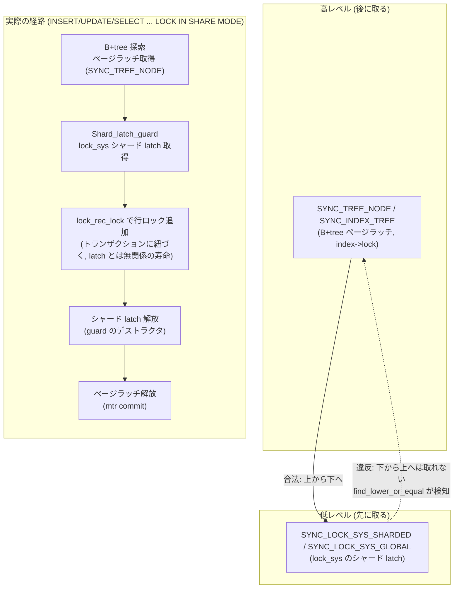

> **前提**: [ロックの種類 (InnoDB)](./lock-modes-and-types/) / [ラッチとミューテックス](./latches-and-mutexes/) / [lock_sys — 512 シャードと latching](./lock-sys-sharding/)

## 何を学んだか

行ロックとラッチは別の世界の話だと思っていた。行ロックはトランザクションが持ちコミットまで生きる、ラッチはスレッドが持ち数マイクロ秒で離す ([ロックの種類](./lock-modes-and-types/))。デッドロック検出の対象になるのは行ロックだけで、ラッチは順序で衝突を防ぐ ([ラッチとミューテックス](./latches-and-mutexes/))。この 2 つは別レイヤーで、境界を意識する必要はないと思っていた。

コードを読むと、境界は `ut_ad` という形で実行時に埋め込まれていた。**「B+tree のページラッチを持ったまま行ロックを取ってよい」というのは暗黙の了解ではなく、`lock_rec_lock` の事前条件として書かれている。** そして latch order (`sync0types.h` の `latch_level_t`) を見ると、B+tree のページラッチ (`SYNC_TREE_NODE` / `SYNC_INDEX_TREE`) は lock_sys のシャード latch (`SYNC_LOCK_SYS_SHARDED` / `SYNC_LOCK_SYS_GLOBAL`) より**上位**にある。順序は「先に取るものが下、後に取るものが上」なので、これは「ページラッチ → シャード latch」の順でしか取れないという意味になる。逆順、つまりシャード latch を持ったまま新たにページラッチを取ることは違反だ。

この一方通行は不便な制約に見えるが、読み進めると逆で、**この一方通行があるからこそ「ページを latch した状態で B+tree を降りて行を見つけ、そのまま行ロックを付けて latch を放す」という InnoDB の基本動作が、デッドロックの心配なしに書けている。** ページラッチとシャード latch の間に順序があること自体が、両者の継ぎ目の設計そのものだった。

もう 1 つ意外だったのは、`lock_clust_rec_read_check_and_lock` を読んで気づいた**暗黙ロックから明示ロックへの変換 (`lock_rec_convert_impl_to_expl`) の呼び出し位置**だ。関数の中身は「変換 → シャード latch を取る → 行ロックを付ける → latch を放す」という順に見えるが、latch を取るブロックは変換のあとに始まっている。変換だけがシャード latch の**外**にある。理由は変換処理が別のページ (クラスタードインデックスの版) を latch する必要があるからで、シャード latch を持った状態では取れない。ここでも latch order が呼び出し位置という形のコードに変換されていた。

## なぜそうなっているか

**latch order が「先に取るものが下」という向きなのは、循環を作らないための唯一の手段だからだ。** ラッチはデッドロックを検出して片方を巻き戻すという選択肢がない ([ラッチとミューテックス](./latches-and-mutexes/))。だから InnoDB は「レベルの高いものから低いものへしか取れない」という規則を全ラッチに強制し、循環そのものを作れなくしている。この規則を破っていないかを検査するのが `LatchDebug::find_lower_or_equal` で、`sync0debug.cc` の `assert_all_held_are_above` から呼ばれる。

```cpp title="storage/innobase/sync/sync0debug.cc"
const Latched *LatchDebug::find_lower_or_equal(
    const Latches *latches, latch_level_t limit) const UNIV_NOTHROW {
  Latches::const_iterator end = latches->end();

  for (Latches::const_iterator it = latches->begin(); it != end; ++it) {
    if (it->m_level <= limit) {
      return (&(*it));
    }
  }

  return (nullptr);
}
```

[`sync0debug.cc#L603`](https://github.com/mysql/mysql-server/blob/mysql-8.4.11/storage/innobase/sync/sync0debug.cc#L603)。スレッドが今持っているラッチのリストを走査して、**要求しているレベル以下 (= 同じか、より後に取るべきもの) を持っていないか**を探す。見つかれば `crash()` で `ut_error` になる。つまり「B+tree のページラッチ (`SYNC_TREE_NODE`) を持ったまま、それより下の `SYNC_LOCK_SYS_SHARDED` を新たに取る」のは合法 (下は "先に取るべきもの" ではなく "後に取るべきもの" だから通る、という向きに注意——`m_level <= limit` が違反条件なので、**すでに持っているものが要求するものと同じか低ければ違反**になる。B+tree のレベルは lock_sys より高いので、B+tree を持った状態で lock_sys を要求しても違反にならない)。逆に、lock_sys のシャード latch を持った状態で新たに B+tree のページラッチを要求すると、持っているものの方がレベルが低いので `find_lower_or_equal` が引っかかり、そこで `ut_error` になる。**この一方通行が、行ロックの実装がどこでページラッチを "使い切ってから" lock_sys に入るかを決めている。**

**`lock_rec_lock` の事前条件が実行時 assert になっているのは、latch order をコンパイル時に検査できないからだ。** `owns_page_shard` や `lock_table_has` は実行パスに依存する動的な状態なので、デバッグビルドで踏んだときにだけ検査できる。裏を返せば、**「テーブルの意図ロック → ページシャードの latch → 行ロック」という順序は、コメントではなく assert として強制されている**——リリースビルドでは消えるが、テストとレビューがこれに依存している。

**暗黙→明示変換がシャード latch の外に出ているのは、latch order が両方を同時に満たせないからだ。** 変換処理 (`row_vers_impl_x_locked` に行き着く) はクラスタードインデックスの版を辿るため、対象と別のページの latch が要る。すでにシャード latch (対象ページの lock_sys シャード) を持った状態で別のページラッチを新たに取ろうとすると、**latch order 上「後に取るべきもの (lock_sys シャード) を持ったまま、先に取るべきもの (ページラッチ) を取る」**ことになり違反になる。だから変換はシャード latch の外、まだ何のロック関連 latch も持っていない時点で済ませておく。

## ソースコードのどこか

### latch order の向き — B+tree は lock_sys より上位

`latch_level_t` の該当箇所を並べる (前提ページの表と同じ enum、この 2 群だけを抜く)。

```cpp title="storage/innobase/include/sync0types.h"
enum latch_level_t {
  SYNC_UNKNOWN = 0,
  ...
  SYNC_TRX_SYS,

  SYNC_LOCK_SYS_SHARDED,
  SYNC_LOCK_SYS_GLOBAL,
  SYNC_LOCK_WAIT_SYS,
  ...
  SYNC_FSP_PAGE,
  SYNC_FSP,
  ...
  SYNC_TREE_NODE,
  SYNC_TREE_NODE_FROM_HASH,
  SYNC_TREE_NODE_NEW,
  SYNC_INDEX_TREE,
  ...
```

[`sync0types.h#L201`](https://github.com/mysql/mysql-server/blob/mysql-8.4.11/storage/innobase/include/sync0types.h#L201) の `enum latch_level_t` 全体のうち、`SYNC_LOCK_SYS_SHARDED` が [L271](https://github.com/mysql/mysql-server/blob/mysql-8.4.11/storage/innobase/include/sync0types.h#L271)、`SYNC_LOCK_SYS_GLOBAL` が [L272](https://github.com/mysql/mysql-server/blob/mysql-8.4.11/storage/innobase/include/sync0types.h#L272)、`SYNC_TREE_NODE` が [L298](https://github.com/mysql/mysql-server/blob/mysql-8.4.11/storage/innobase/include/sync0types.h#L298)、`SYNC_INDEX_TREE` が [L301](https://github.com/mysql/mysql-server/blob/mysql-8.4.11/storage/innobase/include/sync0types.h#L301)。**enum の定義順そのものが順序を表している** (後ろにあるほど後に取る、= レベルが高い)。B+tree 関連の 2 つは lock_sys の 2 つより後ろにある。

つまり実装として書けるのは以下の一方向だけになる。



B+tree を降りている間はページラッチを持ったままで、その内側で `Shard_latch_guard` に入る。**外側 (ページラッチ) → 内側 (シャード latch)** の順で latch のネストが深くなり、行ロックはその最も内側で作られてシャード latch より長く生き続ける。

### `lock_rec_lock` の事前条件

```cpp title="storage/innobase/lock/lock0lock.cc"
static dberr_t lock_rec_lock(bool impl, select_mode sel_mode, ulint mode,
                             const buf_block_t *block, ulint heap_no,
                             dict_index_t *index, que_thr_t *thr) {
  ut_ad(locksys::owns_page_shard(block->get_page_id()));
  ut_ad(!srv_read_only_mode);
  ut_ad((LOCK_MODE_MASK & mode) != LOCK_S ||
        lock_table_has(thr_get_trx(thr), index->table, LOCK_IS));
  ut_ad((LOCK_MODE_MASK & mode) != LOCK_X ||
        lock_table_has(thr_get_trx(thr), index->table, LOCK_IX));
  ...
```

[`lock0lock.cc#L1878`](https://github.com/mysql/mysql-server/blob/mysql-8.4.11/storage/innobase/lock/lock0lock.cc#L1878)。4 行の `ut_ad` が、行ロックを作る前に何が揃っていなければならないかを言っている。

1. `locksys::owns_page_shard(block->get_page_id())` — **対象ページの lock_sys シャード latch をすでに持っている**こと。行ロックはシャード latch の内側でしか作れない ([lock_sys のシャーディング](./lock-sys-sharding/) の `owns_page_shard` の定義)
2. `LOCK_S` を要求するなら `lock_table_has(trx, table, LOCK_IS)` — **テーブルの意図共有ロックをすでに持っている**こと
3. `LOCK_X` を要求するなら `lock_table_has(trx, table, LOCK_IX)` — **テーブルの意図排他ロックをすでに持っている**こと

**「テーブルの意図ロック → ページシャードの latch → 行ロック」という順序は、この 3 つの `ut_ad` として実装に埋め込まれている。** どれか 1 つでも欠けた状態で `lock_rec_lock` を呼べば、デバッグビルドはその場で落ちる。

### 呼び出し元 2 つが証明する latch のスコープ

`lock_sec_rec_read_check_and_lock` と `lock_clust_rec_read_check_and_lock` はどちらも同じ形をしている (セカンダリ / クラスタードの違いだけ)。

```cpp title="storage/innobase/lock/lock0lock.cc"
dberr_t lock_clust_rec_read_check_and_lock(
    const lock_duration_t duration, const buf_block_t *block, const rec_t *rec,
    dict_index_t *index, const ulint *offsets, const select_mode sel_mode,
    const lock_mode mode, const ulint gap_mode, que_thr_t *thr) {
  ...
  heap_no = page_rec_get_heap_no(rec);

  if (heap_no != PAGE_HEAP_NO_SUPREMUM) {
    lock_rec_convert_impl_to_expl(block, rec, index, offsets);
  }

  DEBUG_SYNC_C("after_lock_clust_rec_read_check_and_lock_impl_to_expl");
  {
    locksys::Shard_latch_guard guard{UT_LOCATION_HERE, block->get_page_id()};

    if (duration == lock_duration_t::AT_LEAST_STATEMENT) {
      lock_protect_locks_till_statement_end(thr);
    }

    ut_ad(mode != LOCK_X ||
          lock_table_has(thr_get_trx(thr), index->table, LOCK_IX));
    ut_ad(mode != LOCK_S ||
          lock_table_has(thr_get_trx(thr), index->table, LOCK_IS));

    err = lock_rec_lock(false, sel_mode, mode | gap_mode, block, heap_no, index,
                        thr);

    MONITOR_INC(MONITOR_NUM_RECLOCK_REQ);
  }
  ...
```

[`lock0lock.cc#L5509`](https://github.com/mysql/mysql-server/blob/mysql-8.4.11/storage/innobase/lock/lock0lock.cc#L5509)。`lock_rec_convert_impl_to_expl` の呼び出し ([L5530](https://github.com/mysql/mysql-server/blob/mysql-8.4.11/storage/innobase/lock/lock0lock.cc#L5530)) は `Shard_latch_guard` のブロック ([L5535](https://github.com/mysql/mysql-server/blob/mysql-8.4.11/storage/innobase/lock/lock0lock.cc#L5535) 開始) の**外**にある。ガードの中身は `lock_protect_locks_till_statement_end` + 2 つの `ut_ad` + `lock_rec_lock` + `MONITOR_INC` だけで、**シャード latch を持っている時間は「行ロックを 1 つ付ける」以上のことをしていない。** セカンダリ側も同じ形で、`lock_rec_convert_impl_to_expl` の呼び出しが [L5481](https://github.com/mysql/mysql-server/blob/mysql-8.4.11/storage/innobase/lock/lock0lock.cc#L5481)、ガード開始が [L5484](https://github.com/mysql/mysql-server/blob/mysql-8.4.11/storage/innobase/lock/lock0lock.cc#L5484) ([`lock0lock.cc#L5460`](https://github.com/mysql/mysql-server/blob/mysql-8.4.11/storage/innobase/lock/lock0lock.cc#L5460) が関数の先頭)。

なぜ変換だけ外に出せるのか (出さねばならないのか) は `lock_rec_convert_impl_to_expl` の中身を見ると分かる。

```cpp title="storage/innobase/lock/lock0lock.cc"
void lock_rec_convert_impl_to_expl(const buf_block_t *block, const rec_t *rec,
                                   dict_index_t *index, const ulint *offsets) {
  trx_t *trx;

  ut_ad(!locksys::owns_exclusive_global_latch());
  ...
  if (index->is_clustered()) {
    trx_id_t trx_id;

    trx_id = lock_clust_rec_some_has_impl(rec, index, offsets);
    ...
```

[`lock0lock.cc#L5301`](https://github.com/mysql/mysql-server/blob/mysql-8.4.11/storage/innobase/lock/lock0lock.cc#L5301)。セカンダリインデックスの行のときは `lock_sec_rec_some_has_impl` を経由し、そこにヒントがある。

```cpp title="storage/innobase/lock/lock0lock.cc"
    /* In this case it is possible that some transaction has an implicit
    x-lock. We have to look in the clustered index. */

  } else {
    trx = row_vers_impl_x_locked(rec, index, offsets);
  }
```

[`lock0lock.cc#L1032`](https://github.com/mysql/mysql-server/blob/mysql-8.4.11/storage/innobase/lock/lock0lock.cc#L1032)。コメントが明言している——**「クラスタードインデックスを見に行かなければならない」。** `row_vers_impl_x_locked` はセカンダリインデックスの行に対応するクラスタードインデックスの行と、その版チェーン (undo ログを遡る) を辿る。これは対象のセカンダリページとは別のページの読み取りを伴うので、追加のページラッチが要る。**すでに対象ページの lock_sys シャード latch を持った状態でこれを呼ぶと、latch order 上「シャード latch (低レベル) を持ったまま新たに B+tree のページラッチ (高レベル) を取る」ことになり、違反になる。** だから変換は `Shard_latch_guard` に入る前、まだシャード latch を持っていない時点で済ませておく必要がある。

### 寿命の対比

| 対象                    | 誰が持つ                       | 典型的な生存期間             | 解放されるタイミング                                                                       |
| ----------------------- | ------------------------------ | ---------------------------- | ------------------------------------------------------------------------------------------ |
| B+tree のページラッチ   | mtr (mini-transaction)         | 数命令〜1 つの B+tree 操作分 | `mtr_commit` ([mini-transaction](./mini-transaction/))                                     |
| lock_sys シャード latch | スレッド (`Shard_latch_guard`) | 数十命令 (行ロック 1 個分)   | ガードのデストラクタ                                                                       |
| 行ロック (`lock_t`)     | トランザクション               | 文からコミットまで           | `trx` のコミット/ロールバック ([コミットとロールバック](./commit-and-rollback-internals/)) |

3 段の生存期間は 3 桁以上違う。**下 2 段 (ページラッチ・シャード latch) はどちらもスレッドが持ってすぐ放すラッチで、行ロックだけがトランザクションという別の主体に紐づいて生き続ける。** この落差があるからこそ、ラッチの区間を極小化する設計 (latch order・シャーディング) と、行ロックを長く持たせたままデッドロックを検出する設計 ([デッドロック検出](./deadlock-detection/)) は、それぞれ別の道具で解かれている。

### ラッチを持ったまま行ロックの完了を待たない

行ロックの待ちに実際に入る `lock_wait_suspend_thread` は、眠る前に**自分が持っているラッチを手放す**。

```cpp title="storage/innobase/lock/lock0wait.cc"
  ulint had_dict_lock = trx->dict_operation_lock_mode;

  switch (had_dict_lock) {
    case 0:
      break;
    case RW_S_LATCH:
      /* Release foreign key check latch */
      row_mysql_unfreeze_data_dictionary(trx);

      DEBUG_SYNC_C("lock_wait_release_s_latch_before_sleep");
      break;
    case RW_X_LATCH:
      /* We may wait for rec lock in dd holding
      dict_operation_lock for creating FTS AUX table */
      ut_ad(!dict_sys_mutex_own());
      rw_lock_x_unlock(dict_operation_lock);
      break;
  }
```

[`lock_wait_suspend_thread` (`lock0wait.cc#L206`) の L260-277](https://github.com/mysql/mysql-server/blob/mysql-8.4.11/storage/innobase/lock/lock0wait.cc#L260)。`dict_operation_lock` は行ロックとは別物 (データディクショナリの rw-lock、[メタデータロック](./metadata-locking/)とも別レイヤー) だが、扱いの構造は同じだ。**行ロックの完了 (`os_event_wait(slot->event)`, [L297](https://github.com/mysql/mysql-server/blob/mysql-8.4.11/storage/innobase/lock/lock0wait.cc#L297)) を待つ前に、保持していたラッチを必ず放す。** 起きたあとは逆順で取り直す。

```cpp title="storage/innobase/lock/lock0wait.cc"
  if (had_dict_lock == RW_S_LATCH) {
    row_mysql_freeze_data_dictionary(trx, UT_LOCATION_HERE);
  } else if (had_dict_lock == RW_X_LATCH) {
    rw_lock_x_lock(dict_operation_lock, UT_LOCATION_HERE);
  }
```

[L311-315](https://github.com/mysql/mysql-server/blob/mysql-8.4.11/storage/innobase/lock/lock0wait.cc#L311)。**「ラッチを持ったまま行ロックの完了を待たない」という規約が、ここでは switch 文というコードの形で強制されている。** 行ロックの待ちは他のトランザクションのコミット待ちになりうるので、任意に長い。その間ラッチを握り続けたら、ラッチを待つ他のスレッド全員がその任意の長さに引き込まれる。ラッチとロックが同じスレッド内で交差する場所では、**必ずラッチを先に手放してから行ロックの待ちに入る**、という順序がここに現れている。

### `SYNC_LEVEL_VARYING` — レベルを固定できないラッチ

バッファプールのブロックラッチ (`BUF_BLOCK_LOCK`) は、上の表のどのレベルにも固定されていない。

```cpp title="storage/innobase/sync/sync0debug.cc"
  LATCH_ADD_RWLOCK(BUF_BLOCK_LOCK, SYNC_LEVEL_VARYING, buf_block_lock_key);
```

[`sync0debug.cc#L1428`](https://github.com/mysql/mysql-server/blob/mysql-8.4.11/storage/innobase/sync/sync0debug.cc#L1428)。`SYNC_LEVEL_VARYING` の定義側のコメントがそのまま理由を書いている。

```cpp title="storage/innobase/include/sync0types.h"
  /** Level is varying. Only used with buffer pool page locks, which
  do not have a fixed level, but instead have their level set after
  the page is locked; see e.g.  ibuf_bitmap_get_map_page(). */

  SYNC_LEVEL_VARYING,
```

[`sync0types.h#L333`](https://github.com/mysql/mysql-server/blob/mysql-8.4.11/storage/innobase/include/sync0types.h#L333)。**同じ `buf_block_t::lock` という 1 つの rw-lock オブジェクトが、latch した瞬間には B+tree のページなのか、change buffer のビットマップページなのか、まだ分からない。** ページを latch してヘッダを読み、種別が判明したところで初めて `SYNC_TREE_NODE` や `SYNC_IBUF_BITMAP` といった具体的なレベルを設定する ([`buf_block_t::lock`](https://github.com/mysql/mysql-server/blob/mysql-8.4.11/storage/innobase/include/sync0types.h#L333) を持つラッチそのものは 1 種類だが、後付けでレベルが変わる)。`find_lower_or_equal` などの検査コードは `it->m_level <= limit` を見る前に `SYNC_LEVEL_VARYING` を素通りさせる分岐を持っていて ([`sync0debug.cc#L230`](https://github.com/mysql/mysql-server/blob/mysql-8.4.11/storage/innobase/sync/sync0debug.cc#L230) 付近)、**この 1 種類のラッチだけは順序検査の対象から一時的に外れる**ことでこの後付けを許している。

行ロックとの継ぎ目で言うと、B+tree のページとして latch された後は `SYNC_TREE_NODE` として振る舞うので、上で見た「B+tree → lock_sys」という順序制約はそのまま効く。**`SYNC_LEVEL_VARYING` はラッチの識別が遅延するだけで、確定した後のラッチ順序規則そのものを緩めるわけではない。**

## どう活かすか

**「なぜ行ロックの取得コードがこの形をしているのか」を latch order から読めるようになる。** `lock_clust_rec_read_check_and_lock` を初めて読むと、暗黙ロック変換の呼び出しが妙に手前にあるように見える。だが `lock_rec_convert_impl_to_expl` → `row_vers_impl_x_locked` が別ページの latch を要求すること、B+tree のページラッチが lock_sys のシャード latch より高いレベルにあることの 2 点を知っていれば、**この配置が latch order の一方通行から要求される唯一の位置**だと分かる。同じ発想で、`lock_sys` 周りの他の関数を読むときも「シャード latch のブロックに何が入っていて何が入っていないか」を先に見ると、境界の理由がだいたい説明できる。

**自分でこの手のラッチ + 長寿命ロックの組み合わせを実装するときの型がここにある。** 「短命なラッチ (数十命令) の内側で、長命なオブジェクト (トランザクション寿命) への参照を 1 つ作って抜ける」という形にすれば、ラッチの保持時間を長命なオブジェクトの寿命から切り離せる。逆に「長命なオブジェクトを操作するために外部リソースの読み取りが必要」なケースが分かっているなら、その読み取りを短命ラッチの外に出す——`lock_rec_convert_impl_to_expl` がまさにその形をしている。

**ラッチと待ちが交差する場所は、`lock_wait_suspend_thread` の switch 文のように「待ちに入る前に必ず放す」を明示的なコードにしておくと事故が減る。** 何らかのグローバルなラッチや mutex を持ったまま、完了時刻が読めない待ち (行ロック、外部 I/O、他スレッドの完了通知) に入るコードを書きそうになったら、ここでも同じ構造の問題が起きる。**「待ちに入る前にラッチを手放し、起きたら取り直す」という順序を明示的な分岐として書く**のが、InnoDB がこの問題を解いたやり方だ。

**`SYNC_LEVEL_VARYING` のような「後から種別が決まるリソース」に順序を強制する検査を書くときは、検査コード自身に迂回路が要る。** 固定レベルを前提にした検査をそのまま適用すると、種別確定前の一瞬が常に違反として引っかかる。InnoDB は該当するラッチの種類 (`BUF_BLOCK_LOCK` のみ) を検査から明示的に除外することで解決している。**「例外を型で表現する」ではなく「例外を検査ロジックの分岐として明示する」**という選択で、ラッチオブジェクトの種類を増やさずに済んでいる。

## 最終確認用の一覧

本文で引用した関数名・行番号 (すべて `mysql-8.4.11` タグでの `git show` 済み)。

| ファイル                                | シンボル/内容                                                     | 行                                   |
| --------------------------------------- | ----------------------------------------------------------------- | ------------------------------------ |
| `storage/innobase/include/sync0types.h` | `enum latch_level_t` 開始                                         | L201                                 |
| `storage/innobase/include/sync0types.h` | `SYNC_LOCK_SYS_SHARDED`                                           | L271                                 |
| `storage/innobase/include/sync0types.h` | `SYNC_LOCK_SYS_GLOBAL`                                            | L272                                 |
| `storage/innobase/include/sync0types.h` | `SYNC_TREE_NODE`                                                  | L298                                 |
| `storage/innobase/include/sync0types.h` | `SYNC_INDEX_TREE`                                                 | L301                                 |
| `storage/innobase/include/sync0types.h` | `SYNC_LEVEL_VARYING`                                              | L333                                 |
| `storage/innobase/sync/sync0debug.cc`   | `LatchDebug::find_lower_or_equal`                                 | L603                                 |
| `storage/innobase/sync/sync0debug.cc`   | `LATCH_ADD_RWLOCK(BUF_BLOCK_LOCK, SYNC_LEVEL_VARYING, ...)`       | L1428                                |
| `storage/innobase/lock/lock0lock.cc`    | `lock_sec_rec_some_has_impl` 内 `row_vers_impl_x_locked` 呼び出し | L1032                                |
| `storage/innobase/lock/lock0lock.cc`    | `static dberr_t lock_rec_lock`                                    | L1878                                |
| `storage/innobase/lock/lock0lock.cc`    | `lock_sec_rec_read_check_and_lock`                                | L5460 (変換 L5481, guard 開始 L5484) |
| `storage/innobase/lock/lock0lock.cc`    | `lock_clust_rec_read_check_and_lock`                              | L5509 (変換 L5530, guard 開始 L5535) |
| `storage/innobase/lock/lock0lock.cc`    | `void lock_rec_convert_impl_to_expl`                              | L5301                                |
| `storage/innobase/lock/lock0wait.cc`    | `void lock_wait_suspend_thread`                                   | L206                                 |
| `storage/innobase/lock/lock0wait.cc`    | `dict_operation_lock_mode` の switch (放す側)                     | L260-277                             |
| `storage/innobase/lock/lock0wait.cc`    | `os_event_wait(slot->event)`                                      | L297                                 |
| `storage/innobase/lock/lock0wait.cc`    | `dict_operation_lock` の取り直し                                  | L311-315                             |
