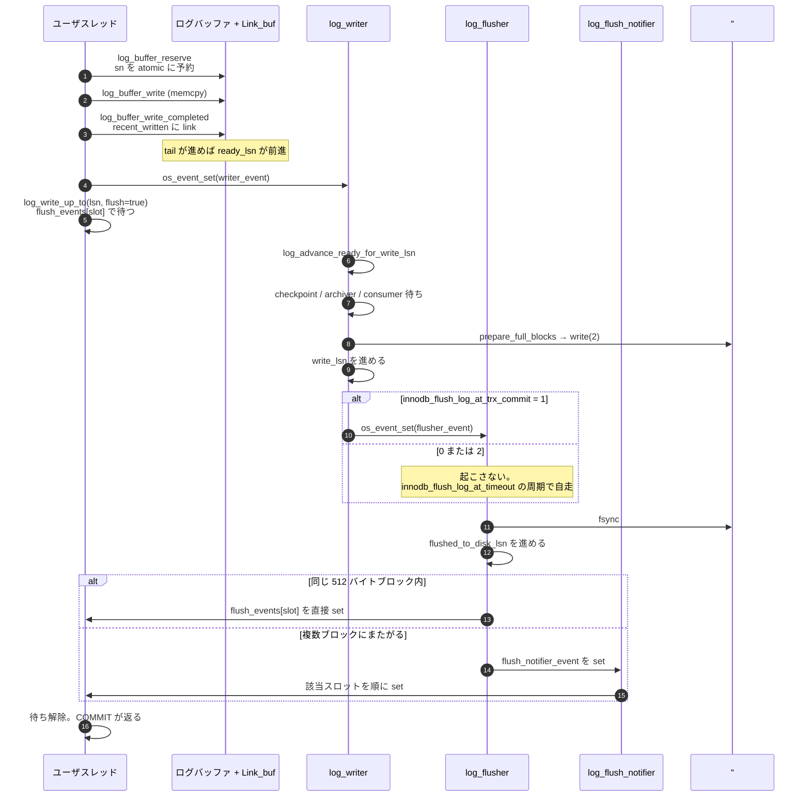

> **前提**: [redo ログ](./redo-log-walkthrough/) / [mini-transaction](./mini-transaction/)

## 何を学んだか

redo の書き込みには 6 本のスレッドが関わる。名前はそのまま `Srv_threads` の `m_log_writer` などのフィールドになっていて、[スレッドモデルのページ](./thread-model/)で見た通り `log0log.cc` 側で作られる。

| スレッド             | 仕事                                                 | 進める LSN            |
| -------------------- | ---------------------------------------------------- | --------------------- |
| `log_writer`         | ログバッファ → ファイルへ `write(2)`                 | `write_lsn`           |
| `log_flusher`        | ファイルへ `fsync`                                   | `flushed_to_disk_lsn` |
| `log_write_notifier` | `write_lsn` の前進を待つ人へ通知                     | —                     |
| `log_flush_notifier` | `flushed_to_disk_lsn` の前進を待つ人へ通知           | —                     |
| `log_checkpointer`   | チェックポイントを打つ ([専用ページ](./checkpoint/)) | `last_checkpoint_lsn` |
| `log_files_governor` | redo ファイルの作成・削除・リサイズ                  | —                     |

**ユーザスレッドはこの 4 本の誰にもデータを渡さない。** ログバッファへ自分で `memcpy` して、`Link_buf` にリンクを張って、あとは「自分の LSN まで届いたか」だけを待つ。渡すのではなく共有メモリに置いて去るので、書き込み経路にキューもロックもない ([redo ログ walkthrough](./redo-log-walkthrough/))。

そして本題の 1 つ。**`innodb_flush_log_at_trx_commit=2` が失うのは「OS ごと落ちたときの直近数秒のコミット」だけで、mysqld のプロセスクラッシュでは何も失わない。** `write(2)` は済んでいるので、データは OS のページキャッシュにある。プロセスが消えてもカーネルが生きていれば、そのままディスクに書かれる。

もう 1 つ。**`log_writer` は書く前に 3 種類の相手を待ちうる。** チェックポイントが進まないとき、redo archiver が遅れているとき、そして MySQL Enterprise Backup のような外部の redo 消費者が遅れているとき。この待ちに落ちると、redo を書けないので**サーバ全体のコミットが止まる**。



## なぜそうなっているか

**書く人と `fsync` する人を分けたのは、両者の待ち時間の性質が違うからだ。** `write(2)` はページキャッシュへのコピーで、普通はマイクロ秒で返る。`fsync` はデバイス次第でミリ秒かかる。1 本で回すと、`fsync` の間に溜まった redo を誰も `write` できず、次の `fsync` の対象が小さくなって効率が落ちる。分けておけば、`fsync` している間に writer が次の分を書き進め、**次の `fsync` 1 回でより多くのコミットをまとめて確定できる**。これは binlog のグループコミット ([2PC のページ](./two-phase-commit-and-group-commit/)) と同じ発想で、redo 側では明示的なステージを持たずスレッドの分離だけで実現している。

**通知を別スレッドに出したのは、扇形展開のコストが本体の critical path に乗るのを避けるためだ。** 1 回の `fsync` で数千スレッドが起きうる。`os_event_set` を数千回呼ぶ間 `log_flusher_mutex` を持っていると、その分だけ次の `fsync` が遅れる。

**ログバッファへの書き込みを lock-free にしたのは、8.0 で最も効いた変更の 1 つだ。** 5.7 までは `log_sys->mutex` の下で「予約 → コピー → dirty page 登録」を全部やっていた。コア数が増えるとここが単一のボトルネックになる。8.0 では atomic な予約 1 回に縮め、順序の回復を `Link_buf` に押し出した。**代償が「flush list の順序が緩む」ことで**、チェックポイント側が近似値を扱うようになった ([mini-transaction のページ](./mini-transaction/))。

**`=2` を「1 秒分のデータを失う」と要約するのは雑すぎる。** 失うのは「`fsync` されていない `write(2)` 済みのデータ」で、これが消える条件は OS がページキャッシュを吐き出す前に落ちることだ。mysqld の `SIGSEGV` や OOM Killer では失われない。**逆に、失われないと信じてよいのは「InnoDB のデータ」だけ**で、`sync_binlog=1` にしていても binlog と InnoDB の状態がクラッシュ後にずれうる。

## ソースコードのどこか

### ログバッファへの書き込みには mutex がない

[`log_buffer_reserve` (`log0buf.cc#L859`)](https://github.com/mysql/mysql-server/blob/mysql-8.4.11/storage/innobase/log/log0buf.cc#L859) が `log.sn` を atomic に進めるところが唯一の直列化点で、その後の `memcpy` は完全に並行だ。順序を回復するのが [`log_buffer_write_completed` (L1061)](https://github.com/mysql/mysql-server/blob/mysql-8.4.11/storage/innobase/log/log0buf.cc#L1061) の `recent_written` になる。

```cpp title="storage/innobase/log/log0buf.cc"
  while (!log.recent_written.has_space(start_lsn)) {
    os_event_set(log.writer_event);
    ++wait_loops;
    std::this_thread::sleep_for(std::chrono::microseconds(20));
  }
  ...
  std::atomic_thread_fence(std::memory_order_release);
  ...
  log.recent_written.add_link_advance_tail(start_lsn, end_lsn);
```

**リングに枠がなければ log_writer を叩き起こして 20 マイクロ秒寝る。** log_writer が `write_lsn` を進めるとリングの後ろが解放されるので、待っている側にとっては「writer が遅れている」の合図になる。この回数は `MONITOR_LOG_ON_RECENT_WRITTEN_WAIT_LOOPS` に積まれる。

### log_writer — 待ってから書く

[`log_writer` (`log0write.cc#L2239`)](https://github.com/mysql/mysql-server/blob/mysql-8.4.11/storage/innobase/log/log0write.cc#L2239) のループは、`log_advance_ready_for_write_lsn` で `recent_written` の tail を進めてから、`write_lsn < ready_lsn` なら [`log_writer_write_buffer` (L2125)](https://github.com/mysql/mysql-server/blob/mysql-8.4.11/storage/innobase/log/log0write.cc#L2125) を呼ぶ。その中で 3 つの待ちが並ぶ。

```cpp title="storage/innobase/log/log0write.cc"
  const lsn_t checkpoint_limited_lsn =
      log_writer_wait_on_checkpoint(log, last_write_lsn, next_write_lsn);
  ...
  if (arch_log_sys != nullptr) {
    log_writer_wait_on_archiver(log, next_write_lsn);
  }
  ...
  log_writer_wait_on_consumers(log, next_write_lsn);
```

- [`log_writer_wait_on_checkpoint` (L1984)](https://github.com/mysql/mysql-server/blob/mysql-8.4.11/storage/innobase/log/log0write.cc#L1984) — redo に空きがないとき。5 秒進まないと `Out of space in the redo log. Checkpoint LSN: %llu.` をエラーログに出す ([チェックポイントのページ](./checkpoint/))
- [`log_writer_wait_on_archiver` (L1996)](https://github.com/mysql/mysql-server/blob/mysql-8.4.11/storage/innobase/log/log0write.cc#L1996) — clone / redo archiving が有効なとき。`Log writer is waiting for redo-archiver to catch up unarchived: %llu bytes.` を出し、1 秒進まなければ archiver 側を中断する
- [`log_writer_wait_on_consumers` (L2069)](https://github.com/mysql/mysql-server/blob/mysql-8.4.11/storage/innobase/log/log0write.cc#L2069) — 上の 2 つ以外の redo 消費者。8.4.11 ではここに来る消費者は MEB (MySQL Enterprise Backup) しかないと assert している

```cpp title="storage/innobase/log/log0write.cc"
    /* This should not be a checkpointer nor archiver, as we've used dedicated
    log_writer_wait_on_checkpoint() and log_writer_wait_on_archiver() to wait
    for them already */
    ut_ad(name == "MEB");
```

**「バックアップを取っている間だけコミットが詰まる」という現象の出どころがこれだ。** メッセージは `Redo log writer is waiting for %s redo log consumer which is currently reading LSN=%llu ...` で、1 秒に 1 回出る。

書けるようになったら `prepare_full_blocks` でブロックヘッダを埋め、`write(2)` して `write_lsn` を進め、[`notify_about_advanced_write_lsn` (L1590)](https://github.com/mysql/mysql-server/blob/mysql-8.4.11/storage/innobase/log/log0write.cc#L1590) で通知する。

### `=2` の正体は「flusher を起こさない」1 行

```cpp title="storage/innobase/log/log0write.cc"
static inline void notify_about_advanced_write_lsn(log_t &log,
                                                   lsn_t old_write_lsn,
                                                   lsn_t new_write_lsn) {
  if (!log.writer_threads_paused.load(std::memory_order_acquire)) {
    if (srv_flush_log_at_trx_commit == 1) {
      os_event_set(log.flusher_event);
    }
```

**`innodb_flush_log_at_trx_commit` が 1 でないとき、log_writer は log_flusher を起こさない。** flusher 側は [`log_flusher` (L2504)](https://github.com/mysql/mysql-server/blob/mysql-8.4.11/storage/innobase/log/log0write.cc#L2504) の中で対称的な分岐を持つ。

```cpp title="storage/innobase/log/log0write.cc"
    if (srv_flush_log_at_trx_commit != 1) {
      const auto current_time = Log_clock::now();
      ...
      const auto flush_every = get_srv_flush_log_at_timeout();

      if (time_elapsed < flush_every) {
        log_flusher_mutex_exit(log);
        ...
          os_event_wait_time_low(log.flusher_event, flush_every - time_elapsed,
                                 0);
```

つまり `=0` / `=2` では、flusher は `innodb_flush_log_at_timeout` (既定 1 秒) の周期でしか `fsync` しない。**「1 秒に 1 回」の実体はこのタイマーだ。**

`fsync` そのものは [`log_flush_low` (L2430)](https://github.com/mysql/mysql-server/blob/mysql-8.4.11/storage/innobase/log/log0write.cc#L2430) にあり、**対象は常に `write_lsn` までに限られる**。

```cpp title="storage/innobase/log/log0write.cc"
  const lsn_t last_flush_lsn = log.flushed_to_disk_lsn.load();

  const lsn_t flush_up_to_lsn = log.write_lsn.load();

  if (flush_up_to_lsn == last_flush_lsn) {
    os_event_set(log.old_flush_event);
    return;
  }
```

### コミットが待つ場所

[`log_write_up_to` (`log0write.cc#L1086`)](https://github.com/mysql/mysql-server/blob/mysql-8.4.11/storage/innobase/log/log0write.cc#L1086) が入口だ。`flush_to_disk` が真のとき、`=1` 以外なら**待つ側が自分で flusher を起こす**。

```cpp title="storage/innobase/log/log0write.cc"
    if (srv_flush_log_at_trx_commit != 1) {
      /* We need redo flushed, but because trx != 1, we have
      disabled notifications sent from log_writer to log_flusher.

      The log_flusher might be sleeping for 1 second, and we need
      quick response here. Log_writer avoids waking up log_flusher,
      so we must do it ourselves here.
```

**`=2` でも、明示的に `fsync` が必要な場面 (DDL や `FLUSH LOGS`) では即座に起こされる。** `=2` は「コミットのたびには待たない」であって、「絶対に `fsync` しない」ではない。

### 通知のスロット — 512 バイトごとにまとめる

待つ側は `log.write_events[]` / `log.flush_events[]` という配列 (既定 2048 スロット、`INNODB_LOG_EVENTS_DEFAULT`) の 1 スロットで寝る。対応する `innodb_log_write_events` / `innodb_log_flush_events` は `ENABLE_EXPERIMENT_SYSVARS` 付きでビルドしたときにしか現れないので、通常のビルドでは変えられない。スロットの選び方は [`log_compute_wait_event_slot` (L763)](https://github.com/mysql/mysql-server/blob/mysql-8.4.11/storage/innobase/log/log0write.cc#L763) だ。

```cpp title="storage/innobase/log/log0write.cc"
  return ((lsn - 1) / OS_FILE_LOG_BLOCK_SIZE) & (events_n - 1);
```

**同じ 512 バイトブロックに属する LSN を待つスレッドは、同じスロットで寝る。** flusher が 1 ブロック分だけ進めたなら、そのスロットを直接 `os_event_set` すれば済む。複数ブロックにまたがったときだけ notifier スレッドに投げて、スロットを順に叩いてもらう。

```cpp title="storage/innobase/log/log0write.cc"
    if (first_slot == last_slot) {
      log_sync_point("log_flush_before_users_notify");
      os_event_set(log.flush_events[first_slot]);
    } else {
      log_sync_point("log_flush_before_notifier_notify");
      os_event_set(log.flush_notifier_event);
    }
```

**notifier が 2 本ある理由がこれだ。** 通知の扇形展開を flusher / writer 本人にやらせると、その間 `fsync` も `write` も止まる。分けておけば、本体は次の I/O にすぐ進める。

### `innodb_log_writer_threads=OFF`

[`ha_innodb.cc#L22870`](https://github.com/mysql/mysql-server/blob/mysql-8.4.11/storage/innobase/handler/ha_innodb.cc#L22870) のこの変数を切ると、4 本は寝たままになり、`log_write_up_to` が `log_self_write_up_to` に分岐して**待っているスレッド自身が `write` と `fsync` を行う**。ヘルプ文もそう書いている。

```text
"Whether the log writer threads should be activated (ON), or write/flush "
"of the redo log should be done by each thread individually (OFF)."
```

既定は ON。同時実行が低いとき、スレッドを起こす往復のほうが `write` より高くつくので OFF が速いことがある。

## どう活かすか

**`innodb_flush_log_at_trx_commit=2` の判断基準は「OS ごと落ちる確率」だ。** 物理サーバの電源断・カーネルパニック・ハイパーバイザの障害では最大 `innodb_flush_log_at_timeout` 秒分のコミットが消える。**アプリケーションのクラッシュ・mysqld の異常終了・`kill -9` では消えない。** レプリカ側で `=2` を使うのが定石なのは、ソースからもう一度受け取れるからで、ソース側で使うなら「1 秒分の確定済みトランザクションが消えても業務が成立するか」を先に決める。

**`Innodb_os_log_pending_fsyncs` と `Innodb_data_fsyncs` が張り付いているなら、ディスクの `fsync` レイテンシがコミットの上限を決めている。** このときスレッド数を増やしても TPS は伸びない。`performance_schema` の待ちイベントでは `wait/synch/mutex/innodb/log_flusher_mutex` や `wait/io/file/innodb/innodb_log_file` に出る。

**エラーログの `Redo log writer is waiting for ... redo log consumer` は、バックアップやクローンが redo を読み切れていない合図だ。** 現象としては「コミットが一斉に固まる」になる。`innodb_redo_log_capacity` を増やすか、バックアップの並行実行をやめるかの二択で、放置すると全書き込みが止まる。

**`innodb_log_writer_threads=OFF` を試す価値があるのは、同時実行が数十本以下でレイテンシを詰めたいときだけだ。** 高負荷では ON のほうが確実に速い。ON / OFF はオンラインで切り替えられるので、実測して決める。

**ログバッファ待ち (`log_buffer_reserve` での停止) は `Innodb_log_waits` に出る。** これが増えているなら `innodb_log_buffer_size` が小さいか、log_writer が上の 3 つの待ちのどれかで詰まっている。**前者と後者で対処が正反対**なので、エラーログを先に見る。
