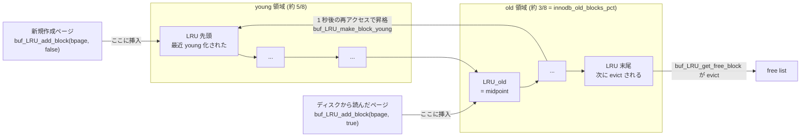

## 何を学んだか

素朴な LRU をバッファプールに使うと、**1 本の `SELECT * FROM huge_table` がキャッシュを全部入れ替える**。読んだページは全部「最近使った」ので先頭に入り、それまで温まっていたページを端から押し出す。しかもスキャンで読んだページはもう二度と使われない。最悪の交換だ。

InnoDB の答えは、LRU リストを 1 本のまま**論理的に 2 つの領域に割る**ことだった。

- **young (new) 領域** — 先頭側。約 5/8
- **old 領域** — 末尾側。約 3/8 (`innodb_old_blocks_pct` 既定 37)

そして規則を 2 つ置く。

1. **ディスクから読んだページは old 領域の先頭 (= midpoint) に挿入する**。young の先頭ではない
2. **old にあるページが young に昇格するのは、最初のアクセスから `innodb_old_blocks_time` (既定 1000ms) 以上経ってから再びアクセスされたときだけ**

これで何が起きるか。全表スキャンは 1 枚のページを読んで、そのページの中のレコードを一気に処理して、次のページへ行く。同じページへの 2 回目のアクセスはあっても**数ミリ秒以内**だ。だから昇格の条件を満たさない。スキャンしたページは old 領域の中で押し流されて消えていき、**young 領域には一切触らない**。

一方、本当にホットなインデックスページは秒をまたいで繰り返し引かれるので、条件を満たして young に上がる。

さらに手前にもう 1 つ条件がある。**LRU が 512 ブロック (`BUF_LRU_OLD_MIN_LEN`) より短いときは、この分割そのものが存在しない**。起動直後やごく小さなプールでは、ただの LRU として動く。

観測点は `SHOW ENGINE INNODB STATUS` の `young-making rate` と `not young-making rate` だ。前者が高いのは「old に入ったページがどんどん昇格している」、後者が高いのは「old に入ったページが昇格せずに終わっている」。**全表スキャンが暴れているサインは後者が高いこと**で、そのとき young 領域は守られている。

## ソースコードのどこか

### 定数

[`storage/innobase/include/buf0lru.h#L59`](https://github.com/mysql/mysql-server/blob/mysql-8.4.11/storage/innobase/include/buf0lru.h#L59)。

```cpp title="storage/innobase/include/buf0lru.h"
/** Minimum LRU list length for which the LRU_old pointer is defined
8 megabytes of 16k pages */
constexpr uint32_t BUF_LRU_OLD_MIN_LEN = 8 * 1024 / 16;
```

`8 * 1024 / 16 = 512`。コメントが「16KB ページで 8MB 分」と言っているとおり、**ページサイズを変えてもこの定数はページ枚数として 512 のまま**だ。4KB ページなら 2MB 分になる。

比率は 1/1024 刻みで持つ ([L217](https://github.com/mysql/mysql-server/blob/mysql-8.4.11/storage/innobase/include/buf0lru.h#L217))。

```cpp title="storage/innobase/include/buf0lru.h"
/** The denominator of buf_pool->LRU_old_ratio. */
constexpr uint32_t BUF_LRU_OLD_RATIO_DIV = 1024;
/** Maximum value of buf_pool->LRU_old_ratio.
@see buf_LRU_old_adjust_len
@see buf_pool->LRU_old_ratio_update */
constexpr uint32_t BUF_LRU_OLD_RATIO_MAX = BUF_LRU_OLD_RATIO_DIV;
/** Minimum value of buf_pool->LRU_old_ratio.
@see buf_LRU_old_adjust_len
@see buf_pool->LRU_old_ratio_update
The minimum must exceed
(BUF_LRU_OLD_TOLERANCE + 5) * BUF_LRU_OLD_RATIO_DIV / BUF_LRU_OLD_MIN_LEN. */
constexpr uint32_t BUF_LRU_OLD_RATIO_MIN = 51;
```

**パーセントではなく 1024 分率**なのは、512 要素のリストでも 1 ブロック未満の精度で境界を決められるようにするためだ。`innodb_old_blocks_pct` は入口でこの単位に変換される ([`buf_LRU_old_ratio_update_instance` `buf0lru.cc#L2340`](https://github.com/mysql/mysql-server/blob/mysql-8.4.11/storage/innobase/buf/buf0lru.cc#L2340))。

```cpp title="storage/innobase/buf/buf0lru.cc"
  ratio = old_pct * BUF_LRU_OLD_RATIO_DIV / 100;
  if (ratio < BUF_LRU_OLD_RATIO_MIN) {
    ratio = BUF_LRU_OLD_RATIO_MIN;
  } else if (ratio > BUF_LRU_OLD_RATIO_MAX) {
    ratio = BUF_LRU_OLD_RATIO_MAX;
  }
```

境界の遊びは [`buf0lru.cc#L67`](https://github.com/mysql/mysql-server/blob/mysql-8.4.11/storage/innobase/buf/buf0lru.cc#L67) の `BUF_LRU_OLD_TOLERANCE = 20` と `BUF_LRU_NON_OLD_MIN_LEN = 5`。

```cpp title="storage/innobase/buf/buf0lru.cc"
constexpr uint32_t BUF_LRU_OLD_TOLERANCE = 20;

/** The minimum amount of non-old blocks when the LRU_old list exists
(that is, when there are more than BUF_LRU_OLD_MIN_LEN blocks).
@see buf_LRU_old_adjust_len */
constexpr uint32_t BUF_LRU_NON_OLD_MIN_LEN = 5;
```

### リストの形



`buf_pool_t` は先頭ポインタのほかに **midpoint を指す `LRU_old` と、そこから末尾までの長さ `LRU_old_len`** を持つ ([`buf0buf.h#L2486`](https://github.com/mysql/mysql-server/blob/mysql-8.4.11/storage/innobase/include/buf0buf.h#L2486))。

```cpp title="storage/innobase/include/buf0buf.h"
  /** Pointer to the about LRU_old_ratio/BUF_LRU_OLD_RATIO_DIV oldest blocks in
  the LRU list; NULL if LRU length less than BUF_LRU_OLD_MIN_LEN; NOTE: when
  LRU_old != NULL, its length should always equal LRU_old_len */
  buf_page_t *LRU_old;
```

「LRU が 512 未満なら `LRU_old` は `NULL`」がここに書いてある。

### 挿入 — `buf_LRU_add_block_low`

[`buf0lru.cc#L1647`](https://github.com/mysql/mysql-server/blob/mysql-8.4.11/storage/innobase/buf/buf0lru.cc#L1647)。

```cpp title="storage/innobase/buf/buf0lru.cc"
  if (!old || (UT_LIST_GET_LEN(buf_pool->LRU) < BUF_LRU_OLD_MIN_LEN)) {
    UT_LIST_ADD_FIRST(buf_pool->LRU, bpage);

    bpage->freed_page_clock = buf_pool->freed_page_clock;
  } else {
...
    UT_LIST_INSERT_AFTER(buf_pool->LRU, buf_pool->LRU_old, bpage);

    buf_pool->LRU_old_len++;
  }
```

**`old == true` でも、LRU が 512 未満なら先頭に入る**。ここが「512 未満では分割そのものが無効」の実装だ。

その直後で長さを見て、512 ちょうどになった瞬間に初期化する。

```cpp title="storage/innobase/buf/buf0lru.cc"
  if (UT_LIST_GET_LEN(buf_pool->LRU) > BUF_LRU_OLD_MIN_LEN) {
    ut_ad(buf_pool->LRU_old);

    /* Adjust the length of the old block list if necessary */

    buf_page_set_old(bpage, old);
    buf_LRU_old_adjust_len(buf_pool);

  } else if (UT_LIST_GET_LEN(buf_pool->LRU) == BUF_LRU_OLD_MIN_LEN) {
    /* The LRU list is now long enough for LRU_old to become
    defined: init it */

    buf_LRU_old_init(buf_pool);
```

[`buf_LRU_old_init` (L1497)](https://github.com/mysql/mysql-server/blob/mysql-8.4.11/storage/innobase/buf/buf0lru.cc#L1497) は乱暴で、**いったん全ブロックを old にしてから境界を戻す**。

```cpp title="storage/innobase/buf/buf0lru.cc"
  /* We first initialize all blocks in the LRU list as old and then use
  the adjust function to move the LRU_old pointer to the right
  position */

  for (buf_page_t *bpage = UT_LIST_GET_LAST(buf_pool->LRU); bpage != nullptr;
       bpage = UT_LIST_GET_PREV(LRU, bpage)) {
...
    /* This loop temporarily violates the
    assertions of buf_page_set_old(). */
    bpage->old = true;
  }

  buf_pool->LRU_old = UT_LIST_GET_FIRST(buf_pool->LRU);
  buf_pool->LRU_old_len = UT_LIST_GET_LEN(buf_pool->LRU);

  buf_LRU_old_adjust_len(buf_pool);
```

512 要素のループなので許容されている。1 回きりの初期化だ。

### 境界の維持 — `buf_LRU_old_adjust_len`

目標の長さは [`calculate_desired_LRU_old_size` (L1429)](https://github.com/mysql/mysql-server/blob/mysql-8.4.11/storage/innobase/buf/buf0lru.cc#L1429)。

```cpp title="storage/innobase/buf/buf0lru.cc"
static size_t calculate_desired_LRU_old_size(const buf_pool_t *buf_pool) {
  return std::min(UT_LIST_GET_LEN(buf_pool->LRU) *
                      static_cast<size_t>(buf_pool->LRU_old_ratio) /
                      BUF_LRU_OLD_RATIO_DIV,
                  UT_LIST_GET_LEN(buf_pool->LRU) -
                      (BUF_LRU_OLD_TOLERANCE + BUF_LRU_NON_OLD_MIN_LEN));
}
```

第 2 項があるので、**`innodb_old_blocks_pct` を 95 まで上げても young 領域は最低 25 ブロック残る**。`LRU_old` がリストの端を指すことを防いでいる。

[`buf_LRU_old_adjust_len` (L1440)](https://github.com/mysql/mysql-server/blob/mysql-8.4.11/storage/innobase/buf/buf0lru.cc#L1440) は目標との差が `BUF_LRU_OLD_TOLERANCE` (20) を超えたときだけポインタを 1 つずつずらす。

```cpp title="storage/innobase/buf/buf0lru.cc"
    if (old_len + BUF_LRU_OLD_TOLERANCE < new_len) {
      buf_pool->LRU_old = LRU_old = UT_LIST_GET_PREV(LRU, LRU_old);
...
      old_len = ++buf_pool->LRU_old_len;
      buf_page_set_old(LRU_old, true);

    } else if (old_len > new_len + BUF_LRU_OLD_TOLERANCE) {
      buf_pool->LRU_old = UT_LIST_GET_NEXT(LRU, LRU_old);
      old_len = --buf_pool->LRU_old_len;
      buf_page_set_old(LRU_old, false);
    } else {
      return;
    }
```

**1 ブロック挿入するたびに厳密に比率を合わせない**のがこの 20 の意味だ。挿入と削除が交互に来ても、境界が振動して `buf_page_set_old` を連打することがなくなる。

### 昇格の判定 — `buf_page_peek_if_too_old`

`buf_page_get_gen` は最後に `buf_page_make_young_if_needed` を呼ぶ ([`buf0buf.cc#L3219`](https://github.com/mysql/mysql-server/blob/mysql-8.4.11/storage/innobase/buf/buf0buf.cc#L3219))。

```cpp title="storage/innobase/buf/buf0buf.cc"
static void buf_page_make_young_if_needed(buf_page_t *bpage) {
...
  if (buf_page_peek_if_too_old(bpage)) {
    buf_page_make_young(bpage);
  }
}
```

判定の本体が [`buf0buf.ic#L180`](https://github.com/mysql/mysql-server/blob/mysql-8.4.11/storage/innobase/include/buf0buf.ic#L180) で、ここが midpoint 方式の心臓だ。

```cpp title="storage/innobase/include/buf0buf.ic"
static inline bool buf_page_peek_if_too_old(const buf_page_t *bpage) {
  buf_pool_t *buf_pool = buf_pool_from_bpage(bpage);

  if (buf_pool->freed_page_clock == 0) {
    /* If eviction has not started yet, do not update the
    statistics or move blocks in the LRU list.  This is
    either the warm-up phase or an in-memory workload. */
    return false;
  } else if (get_buf_LRU_old_threshold() != std::chrono::seconds::zero() &&
             bpage->old) {
    const auto access_time = buf_page_is_accessed(bpage);

    if (access_time != std::chrono::steady_clock::time_point{} &&
        (std::chrono::steady_clock::now() - access_time) >=
            get_buf_LRU_old_threshold()) {
      return true;
    }

    buf_pool->stat.n_pages_not_made_young++;
    return false;
  } else {
    return (!buf_page_peek_if_young(bpage));
  }
}
```

3 分岐ある。

1. **まだ 1 度も evict していない** (`freed_page_clock == 0`) → 何もしない。プールが埋まりきる前は LRU を動かす意味がないし、統計も汚したくない
2. **`innodb_old_blocks_time != 0` かつ old 領域にいる** → `access_time` (**初回アクセス時刻**) からの経過が閾値以上なら昇格。未満なら `n_pages_not_made_young` を増やして据え置き
3. **それ以外 (young 領域にいる、または `old_blocks_time = 0`)** → 先頭から十分遠ければ昇格

`access_time` が**最終アクセスではなく初回アクセス**であることが重要だ。`single_page` は `access_time` がゼロのときだけ `buf_page_set_accessed` を呼ぶ ([`buf0buf.cc#L4395`](https://github.com/mysql/mysql-server/blob/mysql-8.4.11/storage/innobase/buf/buf0buf.cc#L4395))。

```cpp title="storage/innobase/buf/buf0buf.cc"
  /* Check if this is the first access to the page */
  const auto access_time = buf_page_is_accessed(&block->page);

  /* This is a heuristic and we don't care about ordering issues. */
  if (access_time == std::chrono::steady_clock::time_point{}) {
    buf_page_mutex_enter(block);

    buf_page_set_accessed(&block->page);

    buf_page_mutex_exit(block);
  }
```

つまり**「old に入ってから 1 秒以内に何度触られても昇格しない」**。10 万回触っても 1 秒以内なら据え置きだ。3 の `buf_page_peek_if_young` ([L161](https://github.com/mysql/mysql-server/blob/mysql-8.4.11/storage/innobase/include/buf0buf.ic#L161)) は別の見方をする。

```cpp title="storage/innobase/include/buf0buf.ic"
  /* FIXME: bpage->freed_page_clock is 31 bits */
  return ((buf_pool->freed_page_clock & ((1UL << 31) - 1)) <
          ((ulint)bpage->freed_page_clock +
           (buf_pool->curr_size *
            (BUF_LRU_OLD_RATIO_DIV - buf_pool->LRU_old_ratio) /
            (BUF_LRU_OLD_RATIO_DIV * 4))));
```

`freed_page_clock` は「これまでに何ブロック evict したか」のカウンタで、ブロックが最後に先頭に来たときの値を覚えている。**「先頭に来てから young 領域の 1/4 相当のブロックが evict されるまでは、まだ十分に前のほうにいる」**という近似で、リストを歩かずに位置を推定している。ポインタを辿らないので mutex がいらない。

### 昇格の実装

[`buf_LRU_make_block_young` (L1717)](https://github.com/mysql/mysql-server/blob/mysql-8.4.11/storage/innobase/buf/buf0lru.cc#L1717) が統計を上げて付け替える。

```cpp title="storage/innobase/buf/buf0lru.cc"
void buf_LRU_make_block_young(buf_page_t *bpage) {
  buf_pool_t *buf_pool = buf_pool_from_bpage(bpage);

  ut_ad(mutex_own(&buf_pool->LRU_list_mutex));

  if (bpage->old) {
    buf_pool->stat.n_pages_made_young++;
  }

  buf_LRU_remove_block(bpage);
  buf_LRU_add_block_low(bpage, false);
}
```

**`n_pages_made_young` が増えるのは old からの昇格だけ**。young 内の並べ替えはカウントされない。これが `young-making rate` の分子になる。

### 空きブロックの取得と evict

[`buf_LRU_get_free_block` (L1311)](https://github.com/mysql/mysql-server/blob/mysql-8.4.11/storage/innobase/buf/buf0lru.cc#L1311) の先頭コメントが手順を全部書いている。

```cpp title="storage/innobase/buf/buf0lru.cc"
* iteration 0:
  * get a block from free list, success:done
  * if buf_pool->try_LRU_scan is set
    * scan LRU up to srv_LRU_scan_depth to find a clean block
    * the above will put the block on free list
    * success:retry the free list
  * flush one dirty page from tail of LRU to disk
    * the above will put the block on free list
    * success: retry the free list
* iteration 1:
  * same as iteration 0 except:
    * scan whole LRU list
    * scan LRU list even if buf_pool->try_LRU_scan is not set
* iteration > 1:
  * same as iteration 1 but sleep 10ms
```

**ユーザスレッドは常に free list からしかブロックを取らない**。LRU からの evict も、dirty page の書き出しも、その結果ブロックを free list に置くための手段でしかない。`srv_LRU_scan_depth` は `innodb_lru_scan_depth` (既定 1024、[`ha_innodb.cc#L22685`](https://github.com/mysql/mysql-server/blob/mysql-8.4.11/storage/innobase/handler/ha_innodb.cc#L22685)) だ。

20 回まわっても取れないと警告が出る。

```cpp title="storage/innobase/buf/buf0lru.cc"
  if (n_iterations > 20 && srv_buf_pool_old_size == srv_buf_pool_size) {
    ib::warn(ER_IB_MSG_134)
        << "Difficult to find free blocks in the buffer pool"
           " ("
        << n_iterations << " search iterations)! " << flush_failures
        << " failed attempts to"
           " flush a page! Consider increasing the buffer pool"
           " size. ...
```

エラーログのこのメッセージは「バッファプールが足りない」ではなく **「page cleaner が追いついていない」の可能性も同じくらい高い** ([flush list と page cleaner](./flush-list-and-page-cleaner/))。メッセージの中で `fsync` が遅い可能性に触れているのはそのためだ。

### 設定値

| 変数                     | 既定               | 範囲           | 定義                                                                                                                          |
| ------------------------ | ------------------ | -------------- | ----------------------------------------------------------------------------------------------------------------------------- |
| `innodb_old_blocks_pct`  | 37 (`100 * 3 / 8`) | 5–95           | [`ha_innodb.cc#L23017`](https://github.com/mysql/mysql-server/blob/mysql-8.4.11/storage/innobase/handler/ha_innodb.cc#L23017) |
| `innodb_old_blocks_time` | 1000 (ms)          | 0–UINT32_MAX   | [L23022](https://github.com/mysql/mysql-server/blob/mysql-8.4.11/storage/innobase/handler/ha_innodb.cc#L23022)                |
| `innodb_lru_scan_depth`  | 1024               | 100–UINT32_MAX | [L22685](https://github.com/mysql/mysql-server/blob/mysql-8.4.11/storage/innobase/handler/ha_innodb.cc#L22685)                |

`innodb_old_blocks_time = 0` にすると 2 番目の分岐が消え、**old 領域のページも 1 回触れば即座に昇格する**。つまり全表スキャン耐性が消えて、midpoint 挿入の効果が「1 回だけ old に入る」に縮む。

## なぜそうなっているか

**素朴な LRU は「アクセス回数」と「アクセスの散らばり」を区別できない。** 短時間に 100 回触られたページと、1 時間にわたって 100 回触られたページは、LRU から見れば同じ「最近使った」だ。しかし前者はスキャンの副産物で、後者はホットデータだ。`innodb_old_blocks_time` は**時間軸を判定条件に持ち込むことでこの 2 つを分ける**。

**「2 回目のアクセスまでの時間」を見るのは、B+tree の構造から来ている。** 1 枚のリーフページには数十〜数百件のレコードが載る。スキャンはそのページを掴んで、全レコードを処理して、次のページへ行く。この間ページは buf-fix されたままで、複数回 `buf_page_get_gen` が呼ばれることもあるが、全部同じミリ秒だ。一方、ホットなページ (root や上位の内部ノード、頻繁に引かれるリーフ) は、別々のクエリから別々の時刻に引かれる。**閾値 1 秒は「同一クエリの中か、別のクエリか」を分ける線**として置かれている。

**midpoint を 3/8 に置いたのは、スキャンページに「昇格するチャンス」を与えるためだ。** old 領域が短すぎると、本当にホットなページが 1 秒待つ前に evict されてしまう。長すぎると young 領域が痩せる。3/8 は「1 秒の猶予を与えるのに十分な滞在時間」と「hot set を保持する容量」の折衷になっている。

**512 未満で分割を無効にしているのは、統計的に意味がなくなるからだ。** LRU が 100 ブロックしかないときに 3/8 を old にしても、37 ブロックの中でページはあっという間に流れる。`BUF_LRU_OLD_RATIO_MIN = 51` のコメントが `(BUF_LRU_OLD_TOLERANCE + 5) * BUF_LRU_OLD_RATIO_DIV / BUF_LRU_OLD_MIN_LEN` を超えること、と条件を書いているのも同じ話で、**512 ブロックのリストでも `LRU_old` が端を指さないように**定数が相互に縛られている。static_assert でそれを検査している。

**昇格の判定を近似で済ませているのは、LRU_list_mutex を取りたくないからだ。** `buf_page_peek_if_too_old` にも `buf_page_peek_if_young` にも「NOTE: does not reserve the LRU list mutex」「Not protected by any mutex or latch」と書いてある。**`buf_page_get_gen` は毎回のページ取得で呼ばれる**ので、ここで mutex を取ると全てのページアクセスが 1 本の mutex に直列化される。`freed_page_clock` による位置推定は、少しくらい外れても LRU の順序がわずかにずれるだけで正しさに影響しない、という判断だ。

**「free list からしか取らない」に統一したのも並行性のためだ。** ユーザスレッドが LRU の末尾を直接掴んで使うと、LRU_list_mutex を長く持つことになる。free list を緩衝材に挟むことで、LRU の走査と evict を page cleaner に押しつけ、ユーザスレッドは `free_list_mutex` を一瞬取るだけで済む。`innodb_lru_scan_depth` が「page cleaner が毎秒どれだけ free list を補充するか」の設定なのは、この分業の帰結だ。

## どう活かすか

**`SHOW ENGINE INNODB STATUS` の BUFFER POOL AND MEMORY セクションで 3 つの数を並べて読む。** 出力は [`buf0buf.cc#L6806`](https://github.com/mysql/mysql-server/blob/mysql-8.4.11/storage/innobase/buf/buf0buf.cc#L6806) がこう作る。

```cpp title="storage/innobase/buf/buf0buf.cc"
    fprintf(file,
            "Buffer pool hit rate %lu / 1000,"
            " young-making rate %lu / 1000 not %lu / 1000\n",
```

- **hit rate が低く、not young-making rate が高い** → 大量のページを読んでは捨てている。全表スキャンかバッチ処理が走っている。**midpoint 方式は正しく働いていて、young 領域は守られている**。慌ててプールを増やす前に、そのクエリがインデックスを使っていないかを疑う
- **hit rate が低く、young-making rate も高い** → ワーキングセットがプールに入りきっていない。ページを読んでは 1 秒後にまた読んでいる。ここは本当に `innodb_buffer_pool_size` の話
- **hit rate が高い** → LRU は健全。遅さの原因は別の層にある

**`Pages made young` / `not young` の累積値と `youngs/s` / `non-youngs/s` は別行に出る。** 累積は起動からの合計なので、変化を見るには 2 回打って差を取るか、レートのほうを見る。

**バッチ処理の前に `innodb_old_blocks_time` を上げる、は 8.4 では不要なことが多い。** 8.0 以前の運用記事で「バッチの前に `innodb_old_blocks_time=10000` にする」という手順を見かけるが、既定 1000ms でスキャンページはほぼ確実に弾かれる。効くのは**「スキャンだがページ内の処理に 1 秒以上かかる」**ケース、たとえば大きな BLOB を読みながら重い変換をかけるバッチだ。この場合だけ閾値を上げる意味がある。

**逆に `innodb_old_blocks_time = 0` にするのは、ほぼ常に間違いだ。** 全表スキャン耐性が消える。「バッファプールのウォームアップを速くしたい」なら [dump/load](./buffer-pool-walkthrough/) を使う。

**`innodb_old_blocks_pct` をいじるのは最後の手段。** 上げるとスキャン耐性は上がるが young が痩せる。下げると hot set は増えるが、1 秒待てずに evict されるページが出る。**まず `not young-making rate` を見て、それが低い (= 昇格が普通に起きている) なら pct をいじる理由はない**。

**`Difficult to find free blocks in the buffer pool` がエラーログに出たら、まず page cleaner を疑う。** このメッセージは `buf_LRU_get_free_block` が 20 回空振りしたときに出る。プールが小さいのか、`innodb_io_capacity` が実ディスクに対して低すぎて書き出しが追いつかないのか、あるいは `fsync` が遅いのかは、`SHOW ENGINE INNODB STATUS` の `Pending writes` と `pending flushes (fsync)` を並べて切り分ける。

**プールが小さい環境ではそもそも old/young がない。** `innodb_buffer_pool_size = 128M` の開発環境なら 16KB × 8192 ページなので分割は効いているが、それより小さい設定や起動直後は 512 未満で無効になる。**開発環境で「スキャンしたらキャッシュが飛んだ」を再現できないのは、しばしばこれが理由**ではなく、逆に「小さすぎて分割が無効」なせいでもっと激しく飛んでいる。本番と同じ挙動を見たいならプールサイズも近づける。

**`innodb_lru_scan_depth` を上げるのは、free list が枯れているときだけ。** `SHOW ENGINE INNODB STATUS` の `Free buffers` が常時 0 に張り付いているのが症状だ。ただしこれは page cleaner の 1 周あたりの仕事を増やすので、`innodb_io_capacity` とセットで考える必要がある ([page cleaner のページ](./flush-list-and-page-cleaner/))。
