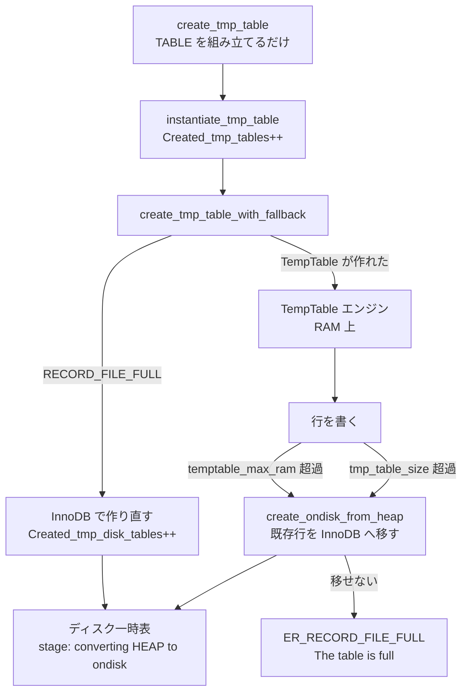

> **前提**: [iterator executor](./executor-walkthrough/) / [ページとバッファ](./page-and-buffer/)

## 何を学んだか

`AccessPath::Type` の `MATERIALIZE` と `TEMPTABLE_AGGREGATE` は、どちらも「内部一時表に書いてから読み直す」形の実行だ。EXPLAIN の `Using temporary` ([`opt_explain_traditional.cc#L49`](https://github.com/mysql/mysql-server/blob/mysql-8.4.11/sql/opt_explain_traditional.cc#L49)) がこれを指す。

このページの要点は 4 つある。

1. **`MaterializeIterator` と `TemptableAggregateIterator` はヘッダに存在しない。** `composite_iterators.cc` の中だけで定義された template で、外に出ているのは名前空間 1 つにつき `CreateIterator` という factory 関数だけだ
2. **上限が 3 つあり、意味が違う。** `tmp_table_size` は**テーブル 1 つあたり**でセッション変数、`temptable_max_ram` は**サーバ全体**でグローバル、`temptable_max_mmap` は**既定 0** で実質無効
3. **どの上限に当たっても同じ `Result::RECORD_FILE_FULL` が投げられる。** 呼び出し側はそれを見て「InnoDB のディスク一時表に切り替える」か「`The table is full` を返す」かに分岐する
4. **ディスクに落ちる経路が 2 本ある。** テーブル作成時 (`create_tmp_table_with_fallback`) と、行を書いている最中 (`create_ondisk_from_heap`) だ



## なぜそうなっているか

**上限が 3 つに分かれているのは、守りたいものが違うからだ。** `tmp_table_size` は「1 つのクエリが暴走してもこれ以上は使わない」というセッション側の防波堤で、`temptable_max_ram` は「サーバ全体で TempTable が食う RAM の総量」というサーバ側の防波堤だ。TempTable エンジンは MEMORY エンジンと違ってブロックをスレッド間で共有する仕組み (`shared_block`) を持つので、グローバルな会計が必要になった。

**`temptable_max_mmap` の既定が 0 なのは、mmap 経路の存在意義が薄れたからだ。** 元々は「RAM は超えたがディスク一時表にはしたくない」中間段階として導入されたが、`temptable_use_mmap` が deprecated になり、既定も 0 になった。**8.0 の記事で `temptable_max_mmap` を調整する話が出てきたら、8.4 ではその段が存在しないと考えてよい** ([前提: ページとバッファ](./page-and-buffer/) の話とは別に、ここは純粋にサーバプロセスのヒープの話だ)。

**フォールバック先が MyISAM ではなく InnoDB なのは 8.0 からの変更で、8.4 でもそのままだ。** `create_tmp_table_with_fallback` も `create_ondisk_from_heap` も `innodb_hton` を直接名指ししている。つまりディスク一時表は `.ibd` (正確にはセッション一時テーブルスペース) に作られ、InnoDB のバッファプールを通る。ディスク一時表が増えるとバッファプールが汚れる、という副作用がここから来る。

**`create_tmp_table_with_fallback` で 1024 バイト超の `CHAR` を弾いているのは InnoDB 側の制約だ。**

```cpp title="sql/sql_tmp_table.cc"
  /*
    INNODB's fixed length column size is restricted to 1024. Exceeding this can
    result in incorrect behavior.
  */
```

長い `VARCHAR` を含む `GROUP BY` が `ER_TOO_LONG_KEY` で落ちることがあるのは、この分岐に当たっている。

**`tmp_table_size` を実行中に変えられない、とわざわざコメントに書いてあるのは、変えられそうに見えるからだ。** セッション変数なので `SET SESSION tmp_table_size = ...` は成功するが、実行中のクエリが既に作った一時表の上限は動かない。ヒント (`SET_VAR`) で指定するときも、クエリ開始時点の値が使われる。

## ソースコードのどこか

### 公開されているのは factory だけ

[`composite_iterators.h#L429`](https://github.com/mysql/mysql-server/blob/mysql-8.4.11/sql/iterators/composite_iterators.h#L429) から始まる名前空間には、`Operand` 構造体と関数 1 つしかない。

```cpp title="sql/iterators/composite_iterators.h"
RowIterator *CreateIterator(
    THD *thd, Mem_root_array<materialize_iterator::Operand> operands,
    const MaterializePathParameters *path_params,
    unique_ptr_destroy_only<RowIterator> table_iterator, JOIN *join);

}  // namespace materialize_iterator
```

[L516-521](https://github.com/mysql/mysql-server/blob/mysql-8.4.11/sql/iterators/composite_iterators.h#L516)。`temptable_aggregate_iterator` も同じ形で [L523-547](https://github.com/mysql/mysql-server/blob/mysql-8.4.11/sql/iterators/composite_iterators.h#L523) にある。

実体は `.cc` の中だ。

```cpp title="sql/iterators/composite_iterators.cc"
template <typename Profiler>
class MaterializeIterator final : public TableRowIterator {
```

[L1250](https://github.com/mysql/mysql-server/blob/mysql-8.4.11/sql/iterators/composite_iterators.cc#L1250)。さらにこれは無名名前空間 (L558-1446) の中にある。[`TemptableAggregateIterator` (L3721)](https://github.com/mysql/mysql-server/blob/mysql-8.4.11/sql/iterators/composite_iterators.cc#L3721) は無名名前空間の外だが、やはりヘッダには出ていない。

template 引数の意味はコメントに書かれている。

```cpp title="sql/iterators/composite_iterators.cc"
  'Profiler' should be 'IteratorProfilerImpl' for 'EXPLAIN ANALYZE' and
  'DummyIteratorProfiler' otherwise. It is implemented as a a template
  parameter rather than a pointer to a base class in order to minimize
  the impact this probe has on normal query execution.
```

factory が実行時に `thd->lex->is_explain_analyze` を見て、どちらの実体化を作るか選ぶ ([`composite_iterators.cc#L3608`](https://github.com/mysql/mysql-server/blob/mysql-8.4.11/sql/iterators/composite_iterators.cc#L3608))。

```cpp title="sql/iterators/composite_iterators.cc"
RowIterator *materialize_iterator::CreateIterator(
    THD *thd, Mem_root_array<Operand> operands,
    const MaterializePathParameters *path_params,
    unique_ptr_destroy_only<RowIterator> table_iterator, JOIN *join) {
  if (thd->lex->is_explain_analyze) {
    RowIterator *const table_iter_ptr = table_iterator.get();

    auto iter = new (thd->mem_root) MaterializeIterator<IteratorProfilerImpl>(
        thd, std::move(operands), path_params, std::move(table_iterator), join);
```

**この 2 つは `TimingIterator` で包まれない。** 包むと「materialize にかかった時間」と「一時表を読む時間」が二重に足されるので、自前の profiler を持ち、内側の table iterator に `SetOverrideProfiler` で押し込む ([`timing_iterator.h#L150` 付近のコメント](https://github.com/mysql/mysql-server/blob/mysql-8.4.11/sql/iterators/timing_iterator.h#L150))。

### 一時表の作成と実体化

一時表の `TABLE` 構造体を組み立てるのが [`create_tmp_table` (`sql_tmp_table.cc#L885`)](https://github.com/mysql/mysql-server/blob/mysql-8.4.11/sql/sql_tmp_table.cc#L885)。ここではまだファイルもメモリも確保しない。実際に開くのが [`instantiate_tmp_table` (L2378)](https://github.com/mysql/mysql-server/blob/mysql-8.4.11/sql/sql_tmp_table.cc#L2378) だ。

```cpp title="sql/sql_tmp_table.cc"
  thd->inc_status_created_tmp_tables();

  // @todo WL#6570 Unsure if this is wise: We may choose a different engine on
  // repeated execution.
  // @todo WL#6570: select_options required???
  if (table->file == nullptr && setup_tmp_table_handler(thd, table, 0)) {
    return true;
  }
  if (share->db_type() == temptable_hton) {
    if (create_tmp_table_with_fallback(thd, table)) return true;
```

`Created_tmp_tables` ([`mysqld.cc#L11412`](https://github.com/mysql/mysql-server/blob/mysql-8.4.11/sql/mysqld.cc#L11412)) が増えるのはここ。**メモリ上の一時表も 1 としてカウントされる**ので、この値が大きいこと自体は問題ではない。

### 経路 1 — 作成時のフォールバック

[`create_tmp_table_with_fallback` (L2281)](https://github.com/mysql/mysql-server/blob/mysql-8.4.11/sql/sql_tmp_table.cc#L2281)。

```cpp title="sql/sql_tmp_table.cc"
  int error =
      table->file->create(share->table_name.str, table, &create_info, nullptr);
  if (error == HA_ERR_RECORD_FILE_FULL &&
      table->s->db_type() == temptable_hton) {
    table->file = get_new_handler(
        table->s, false, share->alloc_for_tmp_file_handler, innodb_hton);
    error = table->file->create(share->table_name.str, table, &create_info,
                                nullptr);
  }

  if (error) {
    table->file->print_error(error, MYF(0)); /* purecov: inspected */
    table->db_stat = 0;
    return true;
  } else {
    if (table->s->db_type() != temptable_hton) {
      thd->inc_status_created_tmp_disk_tables();
    }
    return false;
  }
```

**`Created_tmp_disk_tables` が増えるのはこの `else` 節だ** ([`mysqld.cc#L11407`](https://github.com/mysql/mysql-server/blob/mysql-8.4.11/sql/mysqld.cc#L11407))。判定は「エンジンが TempTable でない」であって、「途中でディスクに落ちた」ではない。行が 1 行も入っていなくても、作成時点で InnoDB になればカウントされる。

TempTable の `create` は行を 1 行も書かないのに `RECORD_FILE_FULL` を返しうる。行サイズからページあたりの行数を計算し、`tmp_table_size` を per-table limit として `Table` を構築する段階でメモリを取るからだ ([`temptable/src/handler.cc#L150`](https://github.com/mysql/mysql-server/blob/mysql-8.4.11/storage/temptable/src/handler.cc#L150))。

```cpp title="storage/temptable/src/handler.cc"
    size_t per_table_limit = thd_get_tmp_table_size(ha_thd());
    auto &kv_store = kv_store_shard[thd_thread_id(ha_thd())];
    const auto insert_result = kv_store.emplace(
        std::piecewise_construct, std::forward_as_tuple(table_name),
        std::forward_as_tuple(mysql_table, m_shared_block,
                              all_columns_are_fixed_size, per_table_limit));
```

**`tmp_table_size` はこの瞬間に読まれて固定される。** クエリ実行中に `SET` しても効かない、とアロケータのコメントが明言している (後述)。

### 経路 2 — 書き込み中の変換

行を書いていて溢れた場合は [`create_ondisk_from_heap` (L2595)](https://github.com/mysql/mysql-server/blob/mysql-8.4.11/sql/sql_tmp_table.cc#L2595) が呼ばれる。

```cpp title="sql/sql_tmp_table.cc"
bool create_ondisk_from_heap(THD *thd, TABLE *wtable, int error,
                             bool insert_last_record, bool ignore_last_dup,
                             bool *is_duplicate) {
  int write_err = 0;
  bool table_on_disk = false;
  DBUG_TRACE;

  if (error != HA_ERR_RECORD_FILE_FULL) {
    /*
      We don't want this error to be converted to a warning, e.g. in case of
      INSERT IGNORE ... SELECT.
    */
    wtable->file->print_error(error, MYF(ME_FATALERROR));
    return true;
  }
```

`HA_ERR_RECORD_FILE_FULL` 以外は素通しで、それ以外なら InnoDB へ移し替える (`share.db_plugin = ha_lock_engine(thd, innodb_hton);`)。**このとき既に書いた行を全部 InnoDB に書き直す**ので、大きい一時表ほど変換コストが高い。処理中は `stage_converting_heap_to_ondisk` というステージ名になるので、`SHOW PROCESSLIST` で `converting HEAP to ondisk` と見える。

呼び出し元は `composite_iterators.cc` の中に 5 か所ある。`MaterializeIterator` の書き込み、`TemptableAggregateIterator` の書き込み、set operation のハッシュ溢れなど、一時表に書くところすべてだ。

### 3 つの上限

```cpp title="sql/sys_vars.cc"
static Sys_var_ulonglong Sys_tmp_table_size(
    "tmp_table_size",
    "If an internal in-memory temporary table in the MEMORY or TempTable "
    "storage engine exceeds this size, MySQL will automatically convert it "
    "to an on-disk table ",
    HINT_UPDATEABLE SESSION_VAR(tmp_table_size), CMD_LINE(REQUIRED_ARG),
    VALID_RANGE(1024, std::numeric_limits<ulonglong>::max()),
    DEFAULT(16 * 1024 * 1024), BLOCK_SIZE(1));
```

[L5066](https://github.com/mysql/mysql-server/blob/mysql-8.4.11/sql/sys_vars.cc#L5066)。`SESSION_VAR` で既定 16MiB。

```cpp title="sql/sys_vars.cc"
/* Default is updated to min(3% of physical memory, 4 GB) */
static Sys_var_ulonglong Sys_temptable_max_ram(
    "temptable_max_ram",
    ...
    GLOBAL_VAR(temptable_max_ram), CMD_LINE(REQUIRED_ARG),
    VALID_RANGE(2 << 20 /* 2 MiB */, ULLONG_MAX),
    DEFAULT(std::clamp(ulonglong{3 * (my_physical_memory() / 100)},
                       1ULL << 30 /* 1 GiB */, 1ULL << 32 /* 4 GiB */)),
    BLOCK_SIZE(1));

static Sys_var_ulonglong Sys_temptable_max_mmap(
    "temptable_max_mmap",
    ...
    GLOBAL_VAR(temptable_max_mmap), CMD_LINE(REQUIRED_ARG),
    VALID_RANGE(0, ULLONG_MAX), DEFAULT(0), BLOCK_SIZE(1));
```

[L5130](https://github.com/mysql/mysql-server/blob/mysql-8.4.11/sql/sys_vars.cc#L5130) と [L5141](https://github.com/mysql/mysql-server/blob/mysql-8.4.11/sql/sys_vars.cc#L5141)。**どちらも `GLOBAL_VAR`。そして `temptable_max_mmap` の既定は 0 だ。** `temptable_use_mmap` ([L5149](https://github.com/mysql/mysql-server/blob/mysql-8.4.11/sql/sys_vars.cc#L5149)) は deprecated。つまり **8.4 の既定では mmap 経路は使われず、RAM を使い切ったら即ディスク一時表**になる。

`internal_tmp_mem_storage_engine` ([L5121](https://github.com/mysql/mysql-server/blob/mysql-8.4.11/sql/sys_vars.cc#L5121)) の既定は `TMP_TABLE_TEMPTABLE`。選択肢は `MEMORY` と `TempTable` の 2 つだけだ。

### アロケータ — 2 か所で同じ例外を投げる

`temptable_max_ram` / `temptable_max_mmap` を見るのは [`Prefer_RAM_over_MMAP_policy` (`allocator.h#L216`)](https://github.com/mysql/mysql-server/blob/mysql-8.4.11/storage/temptable/include/temptable/allocator.h#L216)。

```cpp title="storage/temptable/include/temptable/allocator.h"
 *  1. Use RAM as long as temptable_max_ram threshold is not reached.
 *  2. Start using MMAP when temptable_max_ram threshold is reached.
 *  3. Go back using RAM as soon as RAM consumption drops below the
 *     temptable_max_ram threshold and there is enough space to accommodate the
 *     new block given the size.
 *  4. Not take into account per-table memory limits defined through
 *     tmp_table_size SYSVAR.
```

4 番目が重要で、**このポリシーは `tmp_table_size` を見ない**。ブロックの取得元 (RAM か mmap か) を決めるだけで、どちらも取れなければ [L234](https://github.com/mysql/mysql-server/blob/mysql-8.4.11/storage/temptable/include/temptable/allocator.h#L234) で `throw Result::RECORD_FILE_FULL;` する。

`tmp_table_size` はもう一段上の `Allocator::allocate` で見る ([L589](https://github.com/mysql/mysql-server/blob/mysql-8.4.11/storage/temptable/include/temptable/allocator.h#L589))。

```cpp title="storage/temptable/include/temptable/allocator.h"
  /* temptable::Table is allowed to fit no more data than the given threshold
   * controlled through TableResourceMonitor abstraction. TableResourceMonitor
   * is a simple abstraction which is in its part an alias for tmp_table_size, a
   * system variable that end MySQL users will be using to control this
   * threshold.
   *
   * Updating the tmp_table_size threshold can only be done through the separate
   * SET statement which implies that the tmp_table_size threshold cannot be
   * updated during the duration of some query which is running within the same
   * session. Separate sessions can still of course change this value to their
   * liking.
   */
  if (m_table_resource_monitor.consumption() + n_bytes_requested >
      m_table_resource_monitor.threshold()) {
    throw Result::RECORD_FILE_FULL;
  }
```

**投げられる例外は同じ `Result::RECORD_FILE_FULL` だ。** 上位はどちらの上限に当たったのか区別できない。だから「`Created_tmp_disk_tables` が増えた」だけでは、`tmp_table_size` が足りないのか `temptable_max_ram` を使い切ったのかが分からない。

### `The table is full`

`RECORD_FILE_FULL` が InnoDB へのフォールバックで解決しなかった場合、`ER_RECORD_FILE_FULL` がクライアントに返る。

```
ER_RECORD_FILE_FULL
        ...
        eng "The table '%-.192s' is full"
```

[`share/messages_to_clients.txt#L2737`](https://github.com/mysql/mysql-server/blob/mysql-8.4.11/share/messages_to_clients.txt#L2737)。内部一時表の場合、テーブル名には `#sql_...` のような内部名が入る。

## どう活かすか

**`Created_tmp_disk_tables` は「ディスクに落ちた回数」ではなく「TempTable 以外のエンジンで作られた一時表の数」だ。** 監視で見るなら `Created_tmp_tables` との比率を見る。比率が高いなら、まず「一時表を作らせない」方向 (インデックスで `GROUP BY` / `ORDER BY` を吸収する、[ORDER BY / GROUP BY のページ](./sort-avoidance-and-ordering/)) を検討し、それが無理なら `tmp_table_size` を上げる。

**`tmp_table_size` を上げるときは、同時実行数を掛けて考える。** セッション変数なので、`SET GLOBAL tmp_table_size = 1G` は「1 セッションが 1GB 使ってよい」ではなく「全セッションがそれぞれ 1GB 使ってよい」を意味する。ただし総量は `temptable_max_ram` で頭打ちになるので、そちらが実質的なサーバ全体の上限になる。**`tmp_table_size` を上げても `temptable_max_ram` が小さいままだと、結局そこで `RECORD_FILE_FULL` になる。**

**`The table is full` が内部一時表で出たら、まず `tmp_table_size` と `temptable_max_ram` の両方を確認する。** ユーザーが作った `CREATE TEMPORARY TABLE` でも同じエラーになるが、そちらは `default_tmp_storage_engine` (既定 InnoDB) の話になるのでディスク容量を疑う。テーブル名が `#sql` で始まっていれば内部一時表だ。

**`converting HEAP to ondisk` が `SHOW PROCESSLIST` に見えたら、そのクエリは一時表を書き直している最中だ。** 既に書いた行を全部移すので、一時表が大きいほど長い。`tmp_table_size` を上げてこの変換自体を起こさないようにするか、そもそも一時表を作らせないようにするかの二択になる。

**`temptable_max_mmap` を触る記事は 8.4 では読み替える。** 既定 0、`temptable_use_mmap` は deprecated。RAM を超えたら次はディスク一時表 (InnoDB) で、中間段階はない。

**`Using temporary` と `Using filesort` が同時に出るのは、一時表に書いてからその一時表をソートしているという意味だ。** `Using temporary; Using filesort` は 2 回スキャンが入る。この組み合わせは `GROUP BY a ORDER BY b` のように、集約の並びと出力の並びが違うときに出る ([filesort のページ](./filesort/))。
