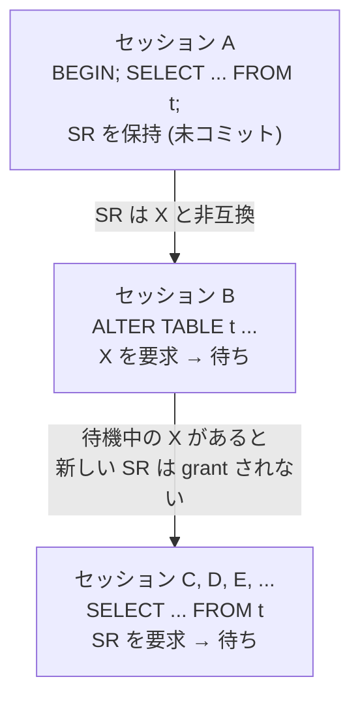

> **前提**: [ロックの種類 (前提)](./lock-kinds/) / [ALTER TABLE](./ddl-walkthrough/)

## 何を学んだか

MySQL の運用でいちばん怖い止まり方は、たぶんこれだ。

1. 誰かが `BEGIN; SELECT * FROM users WHERE id = 1;` を打って、そのまま放置している
2. デプロイスクリプトが `ALTER TABLE users ADD COLUMN ...` を実行する
3. `users` に対する**すべてのクエリ**が止まる

3 が起きるのが理不尽に見える。ALTER は「1 の SELECT」を待っているだけのはずで、新しく来た SELECT は関係ないはずだ。だが実際には全部止まる。

理由は 2 つある。**MDL の寿命がトランザクション単位であること**と、**MDL の互換行列が「待っている X の後ろに新しい共有要求を並ばせる」ように書かれていること**だ。



1 本目の矢印は「granted な SR が X をブロックする」、2 本目は「waiting な X が SR をブロックする」で、**別々の行列に書かれた別々のルール**だ。両方が同時に成り立つから、たった 1 本の放置トランザクションがテーブル全体を止められる。

そして待ち時間の上限は、既定では実質「無限」だ。

```cpp title="sql/sql_const.h"
constexpr const unsigned long LONG_TIMEOUT{3600 * 24 * 365};
```

```cpp title="sql/sys_vars.cc"
static Sys_var_ulong Sys_lock_wait_timeout(
    "lock_wait_timeout",
    "Timeout in seconds to wait for a lock before returning an error.",
    HINT_UPDATEABLE SESSION_VAR(lock_wait_timeout), CMD_LINE(REQUIRED_ARG),
    VALID_RANGE(1, LONG_TIMEOUT), DEFAULT(LONG_TIMEOUT), BLOCK_SIZE(1));
```

[`sql/sys_vars.cc#L2339`](https://github.com/mysql/mysql-server/blob/mysql-8.4.11/sql/sys_vars.cc#L2339)。**`lock_wait_timeout` の既定は 31536000 秒 = 1 年**だ。`innodb_lock_wait_timeout` (既定 50 秒) と混同しやすいが、別の変数で、MDL に効くのは前者のほうになる。

## なぜそうなっているか

**MDL が InnoDB の行ロックと別の機構である必然性は、「テーブル定義はエンジンより上のレイヤにある」ことだ。** `TABLE_SHARE` は SQL 層のキャッシュで、パーティションや複数エンジンにまたがることもある。InnoDB のテーブルロックだけでは、`.frm` 相当の定義を差し替えてよいタイミングを決められない。だから SQL 層に独立したロックマネージャが要る。

**「待機中の X が後続の共有要求をブロックする」設計は、飢餓を防ぐためだ。** もし新しい SR を無制限に grant してしまうと、読み取りが絶えない本番テーブルでは X が永久に取れない。優先度行列の `X` の列がほぼ全部 `-` なのはそのためで、**ALTER を必ず終わらせるという保証と引き換えに、待っている間は全部止まる**という代償を払っている。これは選択であって、バグではない。

`SH` だけが例外なのも同じ理由の裏返しで、「メタデータしか見ないので、データの一貫性を壊しようがない」要求だけを追い越させている。ただし型のコメントには釘が刺してある。

```cpp title="sql/mdl.h"
    Since SH lock is compatible with SNRW lock, the connection that
    holds SH lock lock should not try to acquire any kind of table-level
    or row-level lock, as this can lead to a deadlock.
```

**SH を持ったまま行ロックを取りに行くとデッドロックする。** だから `I_S` の充填は行を読まない範囲でしか SH を使えない。

**`lock_wait_timeout` の既定が 1 年なのは、DDL を途中で失敗させたくないからだ。** 5.5 で MDL が導入されたとき、`ALTER TABLE` が数十秒のタイムアウトで失敗するようになったら移行の障害が大きすぎた。結果として「デッドロックしていないなら待ち続ける」が既定になっている。**この値をセッション変数として下げるかどうかは運用側の判断に委ねられている。**

**MDL の寿命がトランザクション単位なのは、トランザクション中にテーブル定義が変わらないことを保証するためだ。** 文ごとに解放してしまうと、`BEGIN; SELECT * FROM t; SELECT * FROM t; COMMIT;` の 2 回で列が変わりうる。特に repeatable read のスナップショットと定義が食い違うと、undo から古い版を復元するときに列の対応が付かなくなる。

## ソースコードのどこか

### 11 種類のロック型

[`sql/mdl.h#L196`](https://github.com/mysql/mysql-server/blob/mysql-8.4.11/sql/mdl.h#L196) の `enum_mdl_type` に 11 種類が並ぶ。定義順が「弱い → 強い」になっていて、`type >= MDL_SHARED_UPGRADABLE` のような比較がコード中で使われる。

| 略号 | 定数                        | 誰が取るか                                                              |
| ---- | --------------------------- | ----------------------------------------------------------------------- |
| IX   | `MDL_INTENTION_EXCLUSIVE`   | scoped ロック専用 (GLOBAL / SCHEMA / COMMIT など)。テーブルには使わない |
| S    | `MDL_SHARED`                | メタデータだけ見るとき。`HANDLER ... OPEN`、prepared statement の準備   |
| SH   | `MDL_SHARED_HIGH_PRIO`      | `INFORMATION_SCHEMA` の充填。**待機中の X を無視して grant される**     |
| SR   | `MDL_SHARED_READ`           | `SELECT`、サブクエリ、`LOCK TABLES ... READ`                            |
| SW   | `MDL_SHARED_WRITE`          | `INSERT` / `UPDATE` / `DELETE` / `SELECT ... FOR UPDATE`                |
| SWLP | `MDL_SHARED_WRITE_LOW_PRIO` | `LOW_PRIORITY` 付きの DML                                               |
| SU   | `MDL_SHARED_UPGRADABLE`     | **`ALTER TABLE` の第 1 段階**。読みも書きも通す                         |
| SRO  | `MDL_SHARED_READ_ONLY`      | `LOCK TABLES ... READ`                                                  |
| SNW  | `MDL_SHARED_NO_WRITE`       | ALTER の COPY 経路と `LOCK=SHARED`。読みは通す                          |
| SNRW | `MDL_SHARED_NO_READ_WRITE`  | `LOCK TABLES ... WRITE`                                                 |
| X    | `MDL_EXCLUSIVE`             | `CREATE` / `DROP` / `RENAME`、ALTER の prepare と commit                |

SU のコメントが目的をそのまま書いている。

```cpp title="sql/mdl.h"
  /*
    An upgradable shared metadata lock which allows concurrent updates and
    reads of table data.
    A connection holding this kind of lock can read table metadata and read
    table data. It should not modify data as this lock is compatible with
    SRO locks.
    Can be upgraded to SNW, SNRW and X locks. ...
    To be used for the first phase of ALTER TABLE.
  */
  MDL_SHARED_UPGRADABLE,
```

**「昇格できる」ことが型として表現されている**のがポイントだ。SU を持ったまま待っている間は他の SU 要求が入れないので、2 本の ALTER が同時に同じテーブルの X を狙って永久にすれ違うことがない。

### 互換行列 (granted)

行列は `MDL_lock::m_object_lock_strategy` の中にコメント付きで置かれている ([`sql/mdl.cc#L2194`](https://github.com/mysql/mysql-server/blob/mysql-8.4.11/sql/mdl.cc#L2194))。コードは「非互換ビットマップ」だが、コメントに人間が読める形の表がある。

```cpp title="sql/mdl.cc"
         Request  |  Granted requests for lock            |
          type    | S  SH  SR  SW  SWLP  SU  SRO  SNW  SNRW  X  |
        ----------+---------------------------------------------+
        S         | +   +   +   +    +    +   +    +    +    -  |
        SH        | +   +   +   +    +    +   +    +    +    -  |
        SR        | +   +   +   +    +    +   +    +    -    -  |
        SW        | +   +   +   +    +    +   -    -    -    -  |
        SWLP      | +   +   +   +    +    +   -    -    -    -  |
        SU        | +   +   +   +    +    -   +    -    -    -  |
        SRO       | +   +   +   -    -    +   +    +    -    -  |
        SNW       | +   +   +   -    -    -   +    -    -    -  |
        SNRW      | +   +   -   -    -    -   -    -    -    -  |
        X         | -   -   -   -    -    -   -    -    -    -  |
```

読み方は「行 = これから取りたい型、列 = 既に grant されている型」で、`-` なら待つ。運用で覚える価値があるのはこの表の 4 行だ。

- **SU の行**: SR とも SW とも `+`。だから `ALTER TABLE` を打った瞬間は何も止まらない
- **SU の列**: SU 自身とだけ `-`。だから ALTER 待ちの間も既存の DML は通り続ける
- **X の行**: 全部 `-`。**X を取るには、そのテーブルに対する MDL を持つ他のセッションが 1 つもいない状態が必要**
- **SNW の行**: SW と SWLP が `-`。COPY 経路の ALTER 中に書き込みだけが止まる理由

### 互換行列 (waiting) — 「後続が全部止まる」の出どころ

もう 1 枚、**待機中の要求に対する優先度行列**がある ([`sql/mdl.cc#L2257`](https://github.com/mysql/mysql-server/blob/mysql-8.4.11/sql/mdl.cc#L2257))。

```cpp title="sql/mdl.cc"
         Request  |         Pending requests for lock          |
          type    | S  SH  SR  SW  SWLP  SU  SRO  SNW  SNRW  X |
        ----------+--------------------------------------------+
        S         | +   +   +   +    +    +   +    +     +   - |
        SH        | +   +   +   +    +    +   +    +     +   + |
        SR        | +   +   +   +    +    +   +    +     -   - |
        SW        | +   +   +   +    +    +   +    -     -   - |
        SWLP      | +   +   +   +    +    +   -    -     -   - |
        SU        | +   +   +   +    +    +   +    +     +   - |
        SRO       | +   +   +   -    +    +   +    +     -   - |
        SNW       | +   +   +   +    +    +   +    +     +   - |
        SNRW      | +   +   +   +    +    +   +    +     +   - |
        X         | +   +   +   +    +    +   +    +     +   + |
```

**X の列を縦に見ると、`SH` と `X` 以外は全部 `-` だ。** これが冒頭の連鎖の 2 本目の矢印にあたる。ALTER が X を待っている間、新しい `SELECT` (SR) も `INSERT` (SW) も grant されない。X が待ち行列にいるだけで、後続が全部止まる。

`SH` (`MDL_SHARED_HIGH_PRIO`) だけが `+` になっているのは意図的で、型の定義コメントに理由が書いてある。

```cpp title="sql/mdl.h"
  /*
    A high priority shared metadata lock.
    Used for cases when there is no intention to access object data (i.e.
    data in the table).
    "High priority" means that, unlike other shared locks, it is granted
    ignoring pending requests for exclusive locks. Intended for use in
    cases when we only need to access metadata and not data, e.g. when
    filling an INFORMATION_SCHEMA table.
```

**`INFORMATION_SCHEMA` へのクエリだけが X 待ちを追い越せる。** 障害中に `SHOW PROCESSLIST` や `I_S` が返ってくるのはこのおかげだ。

行列は 4 枚ある。連続で grant された回数が `max_write_lock_count` を超えると、コード中で "piglet" と呼ばれる SW、"hog" と呼ばれる SNW / SNRW / X の優先度を落とした別の行列に切り替わる ([`sql/mdl.cc#L581`](https://github.com/mysql/mysql-server/blob/mysql-8.4.11/sql/mdl.cc#L581))。ただし **`max_write_lock_count` の既定は `ULONG_MAX`** なので ([`sys_vars.cc#L2979`](https://github.com/mysql/mysql-server/blob/mysql-8.4.11/sql/sys_vars.cc#L2979))、通常は 1 枚目しか使われない。

### ロックの寿命はトランザクション

DML が取る MDL の duration は `MDL_TRANSACTION` 固定だ。文ではなくトランザクションの終わりまで持つ。

```cpp title="sql/sql_parse.cc"
  // Pure table aliases do not need to be locked:
  if (!(table_options & TL_OPTION_ALIAS)) {
    MDL_REQUEST_INIT(&ptr->mdl_request, MDL_key::TABLE, ptr->db,
                     ptr->table_name, mdl_type, MDL_TRANSACTION);
  }
```

[`sql/sql_parse.cc#L6198`](https://github.com/mysql/mysql-server/blob/mysql-8.4.11/sql/sql_parse.cc#L6198)。型は文の種類から決まる。

```cpp title="sql/table.h"
inline enum enum_mdl_type mdl_type_for_dml(enum thr_lock_type lock_type) {
  return lock_type >= TL_WRITE_ALLOW_WRITE
             ? (lock_type == TL_WRITE_LOW_PRIORITY ? MDL_SHARED_WRITE_LOW_PRIO
                                                   : MDL_SHARED_WRITE)
             : MDL_SHARED_READ;
}
```

[`sql/table.h#L2797`](https://github.com/mysql/mysql-server/blob/mysql-8.4.11/sql/table.h#L2797)。**`SELECT` は SR、書き込み系は SW。** そして解放は `trans_commit` / `trans_rollback` の中の `thd->mdl_context.release_transactional_locks()` でしか起きない。

**ここが問題の核心だ。** InnoDB の read view は autocommit なら文の終わりで捨てられるが、明示的に `BEGIN` したトランザクションでは MDL も read view も `COMMIT` / `ROLLBACK` まで残る。「アプリが `SELECT` を投げたあと `COMMIT` を送り忘れて接続をプールに返す」というだけで、そのテーブルの DDL は永久に止められる。**その `SELECT` が読み取り専用でも、1 行しか返していなくても関係ない。**

### ロック管理は単一の LF_HASH

5.7 には MDL のハッシュを分割する `metadata_locks_hash_instances` があったが、8.4 では**パーティションがなく `MDL_map` が持つ `LF_HASH` は 1 本**だ。

```cpp title="sql/mdl.cc"
  /** LF_HASH with all locks in the server. */
  LF_HASH m_locks;
```

[`sql/mdl.cc#L248`](https://github.com/mysql/mysql-server/blob/mysql-8.4.11/sql/mdl.cc#L248)。分割をやめられたのは、lock-free ハッシュにしたうえで**「衝突しないロック型は `m_fast_path_state` の 64 ビットカウンタを atomic に増やすだけ」**という fast path を入れたからだ。SR / SW のような "unobtrusive" な型は、`MDL_lock` のリストに繋がずカウンタを進める。X のような "obtrusive" な型が現れたときだけ、遅い経路に落ちる。

`GLOBAL` / `COMMIT` / `ACL_CACHE` の 3 つはハッシュを引かず専用のシングルトンを見る ([L1187](https://github.com/mysql/mysql-server/blob/mysql-8.4.11/sql/mdl.cc#L1187))。全接続が触るので、ハッシュ探索のコストすら惜しい。

### デッドロック検出

MDL にもデッドロックがある。ロックを待ち始めるときに `find_deadlock()` を呼ぶ ([`sql/mdl.cc#L4046`](https://github.com/mysql/mysql-server/blob/mysql-8.4.11/sql/mdl.cc#L4046))。

```cpp title="sql/mdl.cc"
void MDL_context::find_deadlock() {
  while (true) {
    /*
      The fact that we use fresh instance of gvisitor for each
      search performed by find_deadlock() below is important,
      the code responsible for victim selection relies on this.
    */
    Deadlock_detection_visitor dvisitor(this);
    MDL_context *victim;

    if (!visit_subgraph(&dvisitor)) {
      /* No deadlocks are found! */
      break;
    }
    victim = dvisitor.get_victim();
    ...
    if (victim == this) break;
```

**InnoDB の行ロックのデッドロック検出とはここが違う。** InnoDB は背景スレッドが周期的に見るだけだが ([デッドロック検出のページ](./deadlock-detection/))、MDL は**待ちに入るスレッド自身がその場でグラフを辿る**。だから MDL のデッドロックは即座に `ER_LOCK_DEADLOCK` になる。犠牲者の選び方は重みの小さいほうだ。

```cpp title="sql/mdl.cc"
void Deadlock_detection_visitor::opt_change_victim_to(MDL_context *new_victim) {
  if (m_victim == nullptr ||
      m_victim->get_deadlock_weight() >= new_victim->get_deadlock_weight()) {
```

なお **MDL と InnoDB の行ロックにまたがるデッドロックは検出されない。** グラフが別だからだ。この場合は `lock_wait_timeout` か `innodb_lock_wait_timeout` のどちらかが先に切れるまで待つことになる。

### 何を待っているかの名前

待ち状態の名前は名前空間ごとに固定文字列で持っている。

```cpp title="sql/mdl.cc"
PSI_stage_info MDL_key::m_namespace_to_wait_state_name[NAMESPACE_END] = {
    {0, "Waiting for global read lock", 0, PSI_DOCUMENT_ME},
    {0, "Waiting for backup lock", 0, PSI_DOCUMENT_ME},
    {0, "Waiting for tablespace metadata lock", 0, PSI_DOCUMENT_ME},
    {0, "Waiting for schema metadata lock", 0, PSI_DOCUMENT_ME},
    {0, "Waiting for table metadata lock", 0, PSI_DOCUMENT_ME},
    ...
    {0, "Waiting for commit lock", 0, PSI_DOCUMENT_ME},
```

[`sql/mdl.cc#L115`](https://github.com/mysql/mysql-server/blob/mysql-8.4.11/sql/mdl.cc#L115)。**`SHOW PROCESSLIST` の `State` が `Waiting for table metadata lock` なら、原因は行ロックではなく MDL だ。** ここを取り違えると `performance_schema.data_locks` を見に行ってしまい、何も出てこない。

## どう活かすか

**`ALTER TABLE` が返ってこないときは、まず `performance_schema.metadata_locks` を見る。** このテーブルは MDL の granted と pending の両方を持っている ([`storage/perfschema/table_md_locks.cc`](https://github.com/mysql/mysql-server/blob/mysql-8.4.11/storage/perfschema/table_md_locks.cc))。

```sql
SELECT OBJECT_TYPE, OBJECT_SCHEMA, OBJECT_NAME,
       LOCK_TYPE, LOCK_DURATION, LOCK_STATUS, OWNER_THREAD_ID
  FROM performance_schema.metadata_locks
 WHERE OBJECT_SCHEMA = 'mydb' AND OBJECT_NAME = 'users';
```

`LOCK_STATUS` は `PENDING` / `GRANTED` / `PRE_ACQUIRE_NOTIFY` / `POST_RELEASE_NOTIFY` の 4 値 ([`storage/perfschema/table_helper.cc`](https://github.com/mysql/mysql-server/blob/mysql-8.4.11/storage/perfschema/table_helper.cc) の `set_field_mdl_status`)。`LOCK_TYPE` は enum の名前がそのまま出る (`SHARED_READ`、`SHARED_UPGRADABLE`、`EXCLUSIVE` など)。

_\*探すのは「`LOCK_STATUS = 'GRANTED'` かつ `LOCK_TYPE` が SHARED_* の行のうち、いちばん古いもの」だ。_* それが ALTER を止めている犯人。`OWNER_THREAD_ID` を使って接続を特定する。

```sql
SELECT t.PROCESSLIST_ID, t.PROCESSLIST_TIME, t.PROCESSLIST_INFO,
       ml.LOCK_TYPE, ml.LOCK_STATUS
  FROM performance_schema.metadata_locks ml
  JOIN performance_schema.threads t ON t.THREAD_ID = ml.OWNER_THREAD_ID
 WHERE ml.OBJECT_SCHEMA = 'mydb' AND ml.OBJECT_NAME = 'users'
 ORDER BY ml.LOCK_STATUS DESC, t.PROCESSLIST_TIME DESC;
```

`PROCESSLIST_INFO` は**現在実行中の文**なので、放置トランザクションでは `NULL` になる。犯人ほど手がかりが少ない。そのときは `performance_schema.events_statements_history` でそのスレッドの直近の文を見るか、`information_schema.INNODB_TRX` の `trx_started` で開始時刻を取る。

`metadata_locks` に行が出るには `performance_schema_instrument = 'wait/lock/metadata/sql/mdl=ON'` と `setup_consumers` の `global_instrumentation` が要る。**8.4 では既定で有効だが、明示的に絞っている環境では出ない。**

**`SHOW PROCESSLIST` の `State` 列で切り分けられる。**

| State                                                                   | 原因                                                     | 見るべきもの                                                                                 |
| ----------------------------------------------------------------------- | -------------------------------------------------------- | -------------------------------------------------------------------------------------------- |
| `Waiting for table metadata lock`                                       | MDL                                                      | `performance_schema.metadata_locks`                                                          |
| `Waiting for table level lock`                                          | THR_LOCK (MyISAM など)                                   | `SHOW OPEN TABLES`                                                                           |
| `updating` / `statistics` で長時間 + `SHOW ENGINE INNODB STATUS` に待ち | InnoDB の行ロック                                        | `performance_schema.data_locks` ([data_locks と sys スキーマ](./data-locks-and-sys-schema/)) |
| `Waiting for commit lock`                                               | `FLUSH TABLES WITH READ LOCK`                            | `OBJECT_TYPE = 'COMMIT'` の行 ([トランザクションの調停](./transaction-coordination/))        |
| `Waiting for table flush`                                               | `FLUSH TABLES` 後に古い `TABLE_SHARE` を掴んだままの接続 | `SHOW PROCESSLIST` の最古の接続                                                              |

**DDL を打つ前に `lock_wait_timeout` をセッション単位で下げる。** これは既定 1 年への現実的な対処になる。

```sql
SET SESSION lock_wait_timeout = 10;
ALTER TABLE users ADD COLUMN ...;
```

10 秒で X が取れなければ `ER_LOCK_WAIT_TIMEOUT` (1205) で落ちる。**落ちること自体が目的だ。** 取れなかった ALTER が待ち続けて後続を全部止めるより、失敗して再試行するほうが被害が小さい。ただし [ALTER の walkthrough](./ddl-walkthrough/) で見たとおり、online DDL では X の窓が prepare 前と commit 前の 2 回開く。**長い構築フェーズを終えたあとの 2 回目でタイムアウトすると、そこまでの作業が全部無駄になる。** 短くしすぎるとこの無駄が増える。

**アプリケーション側の対策は「読み取り専用トランザクションを開きっぱなしにしない」に尽きる。** ORM の暗黙トランザクション、コネクションプールに返す前の `COMMIT` 忘れ、`autocommit=0` のまま `SELECT` だけ打つクライアント。どれも MDL を持ったまま何もしていない状態を作る。`interactive_timeout` / `wait_timeout` はアイドル接続を切るので保険にはなるが、**アプリが定期的に何かを送っていると切れない**。

**マイグレーションを本番に流すなら、事前に「そのテーブルに対する最古の MDL の年齢」を測っておく。** 上のクエリの `PROCESSLIST_TIME` の最大値がそれで、この値が DDL の待ち時間の下限になる。数分単位の値が常時出ているなら、そのままの ALTER は危険だと分かる。

**`SHOW PROCESSLIST` 自体は MDL を取らない。** 障害中でも実行できるので、まずこれを見るのが正しい。`SELECT * FROM information_schema.TABLES` のような統計付きの I_S クエリは対象テーブルを開く経路に入りうるので、詰まっている最中には避けたほうがいい ([データディクショナリのページ](./data-dictionary/))。
