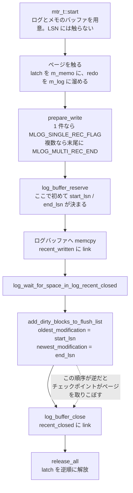

> **前提**: [redo ログ](./redo-log-walkthrough/) / [ページの構造](./page-layout/)

## 何を学んだか

**InnoDB には 2 段のトランザクションがある。** ユーザから見える `trx_t` と、その下でページの物理的な整合性だけを守る mini-transaction (mtr) だ。

B+tree のページ分割を考えると必要性がはっきりする。1 回の分割は、親ページ・分割元・新しいページ・左右の兄弟のリンクと、5 枚以上のページを触る。**この途中の状態でクラッシュしたページ群は、B+tree として壊れている。** ユーザトランザクションのロールバックは論理的な巻き戻し (行を元の値に戻す) なので、この物理的な破損は直せない。

だから InnoDB は別の単位を置いた。mtr の性質は 3 つある。

1. **触ったページの latch を、mtr が終わるまで手放さない** — 途中の状態を他のスレッドに見せない
2. **生成した redo レコードを自分のバッファに溜め、コミット時に一気にログバッファへ移す** — 途中まで redo に出ることがない
3. **コミット時に、複数レコードなら末尾に `MLOG_MULTI_REC_END` を付ける** — リカバリ側は「終端が来るまでは適用しない」と判断できる

そして本題はここだ。

> **dirty page は mtr commit の時点で flush list に載り、そのときの `oldest_modification` は「その mtr が予約した redo レコード群の開始 LSN」である。既に dirty なら更新しない。**

「mtr を開始した時刻」ではない。**LSN が割り当てられるのは mtr の開始時ではなく commit の中**で、`log_buffer_reserve` が呼ばれた瞬間だ。この 1 点を取り違えると、チェックポイントの説明が全部ずれる。



なぜ `oldest_modification` が重要かというと、[チェックポイント](./checkpoint/)の定義が「flush list に残っている `oldest_modification` の最小値より先には進めない」だからだ。**ページ P の `oldest_modification` が L なら、L 以降の redo は P を復元するのに必要で、L より前のチェックポイントを打っても P は救えない。** 逆に L より前は捨ててよい。

## なぜそうなっているか

**mtr が latch を最後まで持つのは、redo が「physiological」だからだ。** InnoDB の redo レコードは「ページ P のオフセット O にこのバイト列を書け」という物理的な指示ではなく、「ページ P にこのレコードを挿入せよ」という半論理的な指示を含む。適用にはページの現在の内容が要る。だから**適用の前提になるページの状態が、記録の時点と同じでなければならない**。途中で他のスレッドに書き換えられると、リカバリ時の再適用が別の結果になる。latch を持ち続けることでこれを保証している。

**mtr が redo を自前のバッファに溜めてから一気に移すのは、共有ログバッファの占有時間を最小にするためだ。** ページ分割の途中でログバッファの領域を握ったままだと、その間ほかのスレッドが予約できない。`log_buffer_reserve` の atomic 1 回だけに縮めることで、この層の直列化点をほぼ消している ([redo ログ walkthrough](./redo-log-walkthrough/))。

**`oldest_modification` を上書きしないのは、チェックポイントの安全側に倒すためだ。** ページ P が LSN 100 で汚れ、LSN 200 でもう一度変更されたとする。もし 200 で上書きすると、チェックポイントは 200 まで進めてしまい、100 の redo は捨てられる。P がまだディスクに書かれていなければ、100 の変更が失われる。だから最初の 1 回だけ記録する。

**逆に `newest_modification` は毎回上書きする。** こちらは「このページを書くとき、どこまで redo を `fsync` すべきか」の値で、最新であればあるほど安全側になる。**2 つの LSN が逆向きに更新されるのは、それぞれ別の不変条件を守っているから**だ。

## ソースコードのどこか

### mtr の一生 — `start` と `commit`

[`mtr_t::start` (`mtr0mtr.cc#L562`)](https://github.com/mysql/mysql-server/blob/mysql-8.4.11/storage/innobase/mtr/mtr0mtr.cc#L562) は 2 本のバッファを初期化するだけで、**LSN には一切触らない**。

```cpp title="storage/innobase/mtr/mtr0mtr.cc"
  new (&m_impl.m_log) mtr_buf_t();
  new (&m_impl.m_memo) mtr_buf_t();

  m_impl.m_mtr = this;
  m_impl.m_log_mode = MTR_LOG_ALL;
  m_impl.m_inside_ibuf = false;
  m_impl.m_modifications = false;
  m_impl.m_n_log_recs = 0;
  m_impl.m_state = MTR_STATE_ACTIVE;
```

- `m_log` — redo レコードを溜めるバッファ
- `m_memo` — 取得した latch とバッファフィックスしたページの一覧。解放は逆順

[`mtr_t::commit` (L659)](https://github.com/mysql/mysql-server/blob/mysql-8.4.11/storage/innobase/mtr/mtr0mtr.cc#L659) は、redo レコードが 1 つでもあるか、no-redo な変更があるときだけ `Command::execute()` に進む。読むだけの mtr は latch を返して終わりだ。

### `prepare_write` — 単一か複数かの 1 ビット

[`prepare_write` (L757)](https://github.com/mysql/mysql-server/blob/mysql-8.4.11/storage/innobase/mtr/mtr0mtr.cc#L757) が、レコード群の境界をリカバリ側に伝える印を付ける。

```cpp title="storage/innobase/mtr/mtr0mtr.cc"
  if (n_recs <= 1) {
    ut_ad(n_recs == 1);

    /* Flag the single log record as the
    only record in this mini-transaction. */

    *m_impl->m_log.front()->begin() |= MLOG_SINGLE_REC_FLAG;

  } else {
    /* Because this mini-transaction comprises
    multiple log records, append MLOG_MULTI_REC_END
    at the end. */

    mlog_catenate_ulint(&m_impl->m_log, MLOG_MULTI_REC_END, MLOG_1BYTE);
    ++len;
  }
```

`MLOG_SINGLE_REC_FLAG = 128` は型バイトの最上位ビットだ ([`mtr0types.h#L67`](https://github.com/mysql/mysql-server/blob/mysql-8.4.11/storage/innobase/include/mtr0types.h#L67))。**レコード型は 7 ビットしかないのは、この 1 ビットを境界の印に使っているから**で、`MLOG_BIGGEST_TYPE` は 76 に収まっている ([`mtr0types.h#L263`](https://github.com/mysql/mysql-server/blob/mysql-8.4.11/storage/innobase/include/mtr0types.h#L263))。

### `MLOG_*` — `_8027` 互換 variant

型の一覧を眺めると、同じ操作に 2 つの型があることに気づく ([`mtr0types.h#L63` からの `mlog_id_t`](https://github.com/mysql/mysql-server/blob/mysql-8.4.11/storage/innobase/include/mtr0types.h#L63))。

```cpp title="storage/innobase/include/mtr0types.h"
  MLOG_REC_INSERT_8027 = 9,
  ...
  MLOG_REC_INSERT = 67,
  MLOG_REC_CLUST_DELETE_MARK = 68,
  MLOG_REC_DELETE = 69,
  MLOG_REC_UPDATE_IN_PLACE = 70,
```

`_8027` が付くのは 8.0.27 以前の形式で、新しい番号 (67 以降) が 8.0.29 以降の形式だ。**書くのは常に新しい型だが、読む側は両方を解釈できる**。8.0.29 の INSTANT DDL (行バージョン) で、インデックス情報を redo レコードに載せる必要が生じたのがこの分岐の理由になっている ([INSTANT のページ](./instant-ddl-row-versions/))。アップグレード直後の初回起動で、古い形式の redo をリカバリするために残っている。

### `Command::execute` — 5 段の順序

[L839](https://github.com/mysql/mysql-server/blob/mysql-8.4.11/storage/innobase/mtr/mtr0mtr.cc#L839)。ここが mtr の核心だ。

```cpp title="storage/innobase/mtr/mtr0mtr.cc"
    auto handle = log_buffer_reserve(*log_sys, len);

    write_log.m_handle = handle;
    write_log.m_lsn = handle.start_lsn;

    m_impl->m_log.for_each_block(write_log);
    ...
    log_wait_for_space_in_log_recent_closed(*log_sys, handle.start_lsn);

    DEBUG_SYNC_C("mtr_redo_before_add_dirty_blocks");

    add_dirty_blocks_to_flush_list(handle.start_lsn, handle.end_lsn);

    log_buffer_close(*log_sys, handle);

    m_impl->m_mtr->m_commit_lsn = handle.end_lsn;
  ...
  release_all();
  release_resources();
```

1. **`log_buffer_reserve`** — ここで初めて LSN 区間 `[start_lsn, end_lsn)` が決まる
2. **`for_each_block(write_log)`** — mtr のバッファからログバッファへ `memcpy`。この中で `log_buffer_write_completed` が `recent_written` にリンクを張る
3. **`log_wait_for_space_in_log_recent_closed`** — `recent_closed` に自分の枠が空くまで待つ
4. **`add_dirty_blocks_to_flush_list`** — 触ったページを flush list へ
5. **`log_buffer_close`** — `recent_closed` にリンクを張る。これで `Added dirty pages up to` が進みうる

**4 が 5 より先に来るのが決定的だ。** `recent_closed.tail()` が LSN X まで進んでいるなら、X より前の LSN を持つ mtr のページはすべて flush list に載り終えている。だからチェックポイントは安心して X まで進める。逆順だったら、まだ flush list に載っていないページの redo を捨ててしまう。

### `oldest_modification` の決定

[`add_dirty_blocks_to_flush_list` (L827)](https://github.com/mysql/mysql-server/blob/mysql-8.4.11/storage/innobase/mtr/mtr0mtr.cc#L827) が `m_memo` を逆順に舐め、X ラッチまたは SX ラッチを持つページを [`buf_flush_note_modification` (`buf0flu.ic#L57`)](https://github.com/mysql/mysql-server/blob/mysql-8.4.11/storage/innobase/include/buf0flu.ic#L57) に渡す。

```cpp title="storage/innobase/include/buf0flu.ic"
  if (end_lsn != 0) {
    ut_ad(block->page.get_newest_lsn() <= end_lsn);
    block->page.set_newest_lsn(end_lsn);
  }
  ...
  if (!block->page.is_dirty()) {
    auto buf_pool = buf_pool_from_block(block);

    buf_flush_insert_into_flush_list(buf_pool, block, start_lsn);
  } else if (start_lsn != 0) {
    ut_ad(block->page.get_oldest_lsn() <= start_lsn);
  }
```

読み取れることが 3 つある。

- **`newest_modification` は毎回 `end_lsn` で上書き**される。これが「そのページを書き出す前に redo をどこまで `fsync` すべきか」になる
- **`oldest_modification` は、まだ dirty でないときだけ `start_lsn` で設定**される。既に dirty なら、より古い値がそのまま残る
- `else` 側の assert が「既存の `oldest_modification` は今回の `start_lsn` 以下」を主張している。ページは自分を最初に汚した mtr の LSN を、書き出されるまで持ち続ける

### flush list は厳密な昇順ではない

素朴には「flush list を `oldest_modification` 昇順に保てば、末尾を見るだけで最小値が分かる」と思える。実際にはそうなっていない。`buf0flu.cc` のコメントがはっきり書いている。

```cpp title="storage/innobase/buf/buf0flu.cc"
/** Checks that order of two consecutive pages in flush list would be valid,
according to their oldest_modification values.

@remarks
We have a relaxed order in flush list, but still we have guarantee,
that the earliest added page has oldest_modification not greater than
minimum oldest_midification of all dirty pages by more than number of
slots in the log recent closed buffer.
```

原因は 3 の待ちにある。`recent_closed` の幅の中では、mtr が flush list に載る順序が LSN 順とずれてよい。ずれの上限が `recent_closed` の容量 (既定 2MB。変更する変数は実験用ビルドにしかない) で、[`buf_pool_get_oldest_modification_lwm` (`buf0buf.cc#L484`)](https://github.com/mysql/mysql-server/blob/mysql-8.4.11/storage/innobase/buf/buf0buf.cc#L484) がその分を引いて安全側の下限を返す。

```cpp title="storage/innobase/buf/buf0buf.cc"
  const lsn_t lag = log_buffer_flush_order_lag(log);
  ...
  if (lsn > lag) {
    return (std::max(checkpoint_lsn, lsn - lag));
```

**「flush list の末尾を見て最小の `oldest_modification` を取る」という 8.0.11 以前の設計が、lock-free 化の代償として近似に置き換わった。** その近似の誤差を定数で押さえているのがこの `lag` だ。

## どう活かすか

**`SHOW ENGINE INNODB STATUS` の LOG セクションで、`Added dirty pages up to` と `Log buffer completed up to` の差を見る。** この差が広がっているとき、redo はログバッファに入っているのに dirty page がまだ flush list に載っていない mtr が滞留している。差の上限は `recent_closed` の容量 (既定 2MB) で、常時張り付いているならその待ち (`log_wait_for_space_in_log_recent_closed` の 20 マイクロ秒スリープ) が入っている。**この容量を変える変数は `ENABLE_EXPERIMENT_SYSVARS` 付きビルドにしかないので、対処は redo の書き出しを速くする側にしかない。** 仮に広げられたとしても、広げるとチェックポイントが取れる LSN が保守的になる。

**`Pages flushed up to` と `Last checkpoint at` の差ではなく、`Log sequence number` と `Last checkpoint at` の差 (checkpoint age) を見る。** これが `innodb_redo_log_capacity` に近づくと同期 flush が始まり、最終的に書き込みが止まる ([チェックポイントのページ](./checkpoint/))。

**巨大な単一 DML が redo を膨らませるのは、mtr が大きくなるからではない。** mtr は行 1 件〜ページ数枚の単位で切られ、1 文の中で何度もコミットされる。膨らむのは mtr の数だ。ただし**巨大な `ALTER TABLE` や `INSERT ... SELECT` は、latch を持つ時間の長い mtr を作りうる**ので、その間 page cleaner がそのページを書けない。

**アップグレード直後の初回起動で redo リカバリが走ると、`_8027` 形式のレコードを読むことになる。** 8.0.27 以前からアップグレードするときにクラッシュ停止すると、この経路を通る。通常は slow shutdown してからアップグレードするので通らないが、**「アップグレード前にきれいに落とす」が推奨される理由の 1 つ**がここにある ([クラッシュリカバリのページ](./crash-recovery/))。

**`ut_ad` ベースの検証は release ビルドで消える。** `log_free_check_validate()` は「危険な latch を持ったまま `log_free_check()` を呼んでいないか」を検査するが、debug ビルドでしか動かない ([ビルドとデバッグのページ](./build-and-debug/))。mtr 周りの不変条件を自分で確かめたいときは `-DWITH_DEBUG=1` が要る。
