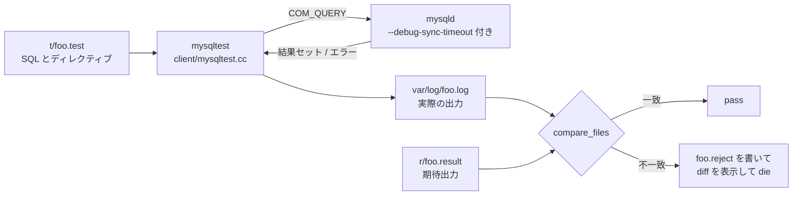

> **前提**: [ビルドとデバッガ](./build-and-debug/) / [ディレクトリ地図](./directory-map/)

## 何を学んだか

MySQL のテストは 2 系統ある。数はまったく釣り合っていない。

| 系統                 | 実体                                   | 数 (8.4.11)            |
| -------------------- | -------------------------------------- | ---------------------- |
| MTR (MySQL Test Run) | サーバを起動し SQL を流して出力を diff | `.test` が **8982** 本 |
| gunit                | GoogleTest による C++ 単体テスト       | `-t.cc` が **299** 本  |

しかも gunit の 299 本のうち InnoDB のものは [`unittest/gunit/innodb/CMakeLists.txt#L38`](https://github.com/mysql/mysql-server/blob/mysql-8.4.11/unittest/gunit/innodb/CMakeLists.txt#L38) に列挙された **18 個** (ほかに `lob/` に 1 本) しかなく、その中身は `ut0crc32` / `ut0lock_free_hash` / `ut0math` / `ut0rbt` / `sync0rw` / `os0file` / `mem0mem` といったユーティリティ層に偏っている。

**B+tree の分割にも、`lock_rec_lock` にも、read view の可視性判定にも、単体テストは 1 つも存在しない。** この章で読んできた [B+tree の楽観/悲観挿入](./btree-operations/)も、[next-key lock](./lock-modes-and-types/)も、[MVCC の版選択](./read-view-and-visibility/)も、**検証しているのは MTR だけ**だ。

その MTR は、テストコードを 1 行も C++ で書かない。`.test` に SQL とディレクティブを書き、サーバの応答をそのままテキストとして受け、`.result` と比較する。



**これは「テストが仕様書である」を極端に推し進めた形だ。** `.result` には `SHOW ENGINE INNODB STATUS` の出力も、`EXPLAIN` の全列も、エラーメッセージの文面も、警告の順序もそのまま入っている。だから**ある挙動の仕様を知りたいときは `.result` を grep する**のが最短経路になる。

## なぜそうなっているか

**B+tree やロックの単体テストが書けないのは、それらが単体で存在できないからだ。** `btr_cur_optimistic_insert` を呼ぶには、初期化済みのバッファプール、mtr、データディクショナリの `dict_index_t`、テーブルスペースのファイル、そして latch 機構が要る。つまり**ほぼ InnoDB 全体を起動する必要がある**。それをやるなら `mysqld` を起動して SQL を投げるほうが早い。gunit のテストが `ut0*` と `os0file` に偏っているのは、**依存を持たない層がそこしかない**という事実の裏返しだ。

`lob/` サブディレクトリを見るとこの制約への抵抗の跡が残っている。`buf0buf.h` / `fil0fil.h` / `mtr0log.h` などをテスト用に**書き直したスタブ**を置いて、LOB のページ操作だけを取り出そうとしている。1 つの機能を単体テスト可能にするのにこれだけの偽装が要る、という見積もりがそのまま残っている。

**逆に、結合テストの網羅性は異常に高い。** 8982 本の `.test` が、エラーメッセージの文面から `EXPLAIN` の 1 列まで固定している。バイト単位の diff は脆く見えるが、**「意図せず出力が変わった」を必ず検出する**という性質を持つ。オプティマイザのコスト計算を 1 行変えると、`.result` が数十ファイル変わる。**その差分がそのままレビュー対象になる**というのが、この方式の実質的な効用だ。セマンティクスのある比較にしていたら、この効用は消える。

**`.result` を「実行可能な仕様書」にしているのは意図的だ。** `--record` で再生成できるので、開発者にとっては書くコストが低い。読む側にとっては「このバージョンのサーバがこの SQL に対して実際に何を返すか」が確定した形で残る。マニュアルより信用できる情報源になっている。

**それでも `.result` は仕様ではない、という限界もある。** 記録されているのは「たまたまこう出力された」ことであって、「こう出力されるべき」ではない。`--record` を軽率に回すと、バグをそのまま期待値に固定できてしまう。だからレビューで `.result` の差分が問われる。

## ソースコードのどこか

### `mysql-test-run.pl` — 8251 行のドライバ

[`mysql-test/mysql-test-run.pl`](https://github.com/mysql/mysql-server/blob/mysql-8.4.11/mysql-test/mysql-test-run.pl) が全部を仕切る。テストの収集、サーバの起動、並列実行、テスト前後の状態検査、失敗の再実行までを 1 本の Perl スクリプトでやっている。

既定で走るスイートは [L241](https://github.com/mysql/mysql-server/blob/mysql-8.4.11/mysql-test/mysql-test-run.pl#L241) の配列で決まる。38 個ある。

```perl title="mysql-test/mysql-test-run.pl"
our @DEFAULT_SUITES = qw(
  auth_sec
  binlog
  binlog_gtid
  binlog_nogtid
  ...
```

`mysql-test/suite/` には 61 ディレクトリあるので、**23 個は既定では走らない**。NDB 関連 (`ndb*` が 9 個)、`group_replication`、`stress`、`large_tests`、`lock_order` などがそれにあたる。

主要なスイートの規模を数えるとこうなる。

| スイート                  | `t/*.test` | この章のどこに対応するか                                                                                 |
| ------------------------- | ---------- | -------------------------------------------------------------------------------------------------------- |
| `main` (`mysql-test/t/`)  | 1460       | SQL 層全般。[パーサ](./parser-walkthrough/)から[エグゼキュータ](./executor-walkthrough/)まで             |
| `innodb`                  | 806        | [物理構造](./innodb-physical-walkthrough/)、[ロック](./lock-modes-and-types/)、[DDL](./ddl-walkthrough/) |
| `perfschema`              | 765        | [performance_schema](./performance-schema-internals/)                                                    |
| `sys_vars`                | 749        | システム変数の型・範囲・スコープの網羅                                                                   |
| `rpl`                     | 653        | [レプリケーション](./applier-and-mta/)全般                                                               |
| `x`                       | 331        | [X Protocol](./x-protocol-messages/)                                                                     |
| `rpl_gtid` / `rpl_nogtid` | 244 / 189  | [GTID](./gtid/) 有無の両方を回す                                                                         |
| `binlog`                  | 172        | [binlog](./binlog-walkthrough/)                                                                          |
| `opt_trace`               | 30         | [optimizer trace](./explain-analyze-and-tree/)                                                           |

`rpl_gtid` と `rpl_nogtid` が別スイートになっているのが目を引く。**GTID の有無は挙動が違いすぎて、同じテストを設定違いで回すのでは足りない**という判断だ。

### 判定は `compare_files` の 1 行

比較の本体は `mysqltest` 側にある。[`client/mysqltest.cc#L2217`](https://github.com/mysql/mysql-server/blob/mysql-8.4.11/client/mysqltest.cc#L2217):

```cpp title="client/mysqltest.cc"
static void check_result() {
  const char *mess = "Result content mismatch\n";
  ...
  switch (compare_files(log_file.file_name(), result_file_name)) {
    case RESULT_OK:
      break; /* ok */
```

不一致なら実際の出力を `.reject` にコピーし、diff を表示して `die` する ([L2251](https://github.com/mysql/mysql-server/blob/mysql-8.4.11/client/mysqltest.cc#L2251))。

```cpp title="client/mysqltest.cc"
      /* Put reject file in opt_logdir */
      fn_format(reject_file, result_file_name, opt_logdir, ".reject",
                MY_REPLACE_DIR | MY_REPLACE_EXT);
```

**この比較にはセマンティクスが一切ない。** バイト列が違えば落ちる。だから `.result` には「行の順序」「空白」「警告の出る順番」まで固定されている。逆に言えば、テストを通すためには**行の順序が安定するように SQL を書かないといけない**。`.result` に `ORDER BY` が異様に多いのはこのためだ。

期待出力の再生成は `--record` で行う ([L1719](https://github.com/mysql/mysql-server/blob/mysql-8.4.11/mysql-test/mysql-test-run.pl#L1719))。ヘルプの文面がそのまま説明になっている ([L8030](https://github.com/mysql/mysql-server/blob/mysql-8.4.11/mysql-test/mysql-test-run.pl#L8030))。

```text
record TESTNAME       (Re)genereate the result file for TESTNAME.
```

1 箇所だけ例外がある。`show_diff` が「無視してよい差分」を返したときは、テスト失敗ではなくスキップになる ([`mysqltest.cc#L2258`](https://github.com/mysql/mysql-server/blob/mysql-8.4.11/client/mysqltest.cc#L2258))。

```cpp title="client/mysqltest.cc"
      const bool ignored_diff =
          show_diff(nullptr, result_file_name, reject_file);
      if (ignored_diff) {
        abort_not_supported_test(
            "Hypergraph optimizer did not support all queries.");
      }
```

**[hypergraph オプティマイザ](./hypergraph-optimizer/)は既存の全テストを通せないので、テストフレームワークの側に逃げ道が彫られている。** 未完成の機能が本流のテストスイートと同居するための仕掛けで、8.4 での hypergraph の位置づけがここにも表れている。

### `include/` の `.inc` — 896 個の前提条件と待ち合わせ

`.test` は他のファイルを `--source` で取り込める。`mysql-test/include/` に **896 個**の `.inc` がある。役割は大きく 3 つ。

**1. 前提条件のスキップ判定。** [`include/have_debug.inc`](https://github.com/mysql/mysql-server/blob/mysql-8.4.11/mysql-test/include/have_debug.inc) は 5 行しかない。

```text title="mysql-test/include/have_debug.inc"
let $have_debug = `SELECT VERSION() LIKE '%debug%'`;
if (!$have_debug)
{
  --skip Test requires 'have_debug'
}
```

release ビルドでは `DBUG_EXECUTE_IF` も `DEBUG_SYNC` も空マクロなので ([ビルドのページ](./build-and-debug/))、これを `--source` しているテストは丸ごとスキップされる。**「MTR が全部通った」は「debug ビルドで通った」とは別の意味になる。**

**2. 待ち合わせ。** [`include/wait_condition.inc`](https://github.com/mysql/mysql-server/blob/mysql-8.4.11/mysql-test/include/wait_condition.inc) は SQL が真を返すまで 0.1 秒間隔で回す。既定は 300 回、つまり 30 秒。

```text title="mysql-test/include/wait_condition.inc"
let $wait_counter= 300;
if ($wait_timeout)
{
  let $wait_counter= `SELECT $wait_timeout * 10`;
}
```

「あるセッションがロック待ちに入ったこと」を確認するのに `information_schema.processlist` を回す用途で、`.test` の中に頻出する。

**3. 後始末の検査。** `count_sessions.inc` / `wait_until_count_sessions.inc` の対で、テストが接続をリークしていないことを確かめる。`mysql-test-run.pl` 側にも `check_testcase` があり ([L7183](https://github.com/mysql/mysql-server/blob/mysql-8.4.11/mysql-test/mysql-test-run.pl#L7183))、テストの前後でサーバの状態を `--record` モードで撮って比較する。**テストが世界を汚したら、そのテスト自身が落ちる。**

### この章で引いた 3 本のテストを読む

**`suite/innodb/t/deadlock_detect.test`** — [デッドロック検出](./deadlock-detection/)を「切ったとき何が起きるか」で検証している。`innodb_deadlock_detect=OFF` と `innodb_lock_wait_timeout=2` を組み合わせ、2 セッションで交差するロックを取り、`--error ER_LOCK_WAIT_TIMEOUT` が出ることを期待する。

```text title="mysql-test/suite/innodb/t/deadlock_detect.test"
connection con1;
BEGIN;
SELECT * FROM t1 WHERE id = 2 FOR UPDATE;
--send SELECT * FROM t1 WHERE id = 1 FOR UPDATE;

connection default;
--send SELECT * FROM t1 WHERE id = 2 FOR UPDATE;

connection con1;
--error ER_LOCK_WAIT_TIMEOUT
--reap;
```

`--send` で非同期に送り、`--reap` で結果を回収する。**この 2 つのディレクティブが、複数セッションの並行実行を記述する土台**になっている。

**`suite/innodb/t/deadlock_on_lock_upgrade.test`** (131 行) — [ロック昇格](./lock-modes-and-types/)によるデッドロックを、3 セッションで**確定的に**再現する。冒頭のコメントが手順の全文になっている。

```text title="mysql-test/suite/innodb/t/deadlock_on_lock_upgrade.test"
# 1. `deleter` is the first to get the required lock
# 2. `holder` enqueues a waiting lock
# 3. `waiter` enqueues right after `holder`
# 4. `deleter` commits, releasing the lock, and granting it to `holder`
# 5. `holder` now observes that the row was deleted, so it needs to
#    "seal the gap", by obtaining a LOCK_X|LOCK_REC, but..
# 6. this causes a deadlock between `holder` and `waiter`
```

この 6 段を順序どおりに実行させるのに使われるのが `DEBUG_SYNC` だ。

```text title="mysql-test/suite/innodb/t/deadlock_on_lock_upgrade.test"
--connection deleter
  SET DEBUG_SYNC =
    'lock_sec_rec_read_check_and_lock_has_locked
      SIGNAL deleter_has_locked
      WAIT_FOR waiter_has_locked';
  --send DELETE FROM t WHERE a = 9999
```

**本来ならタイミング次第でしか起きない現象が、同期点の名前で完全に固定されている。** [ビルドのページ](./build-and-debug/)で見た `DEBUG_SYNC` の実用例がこれだ。

**`suite/innodb/t/innodb-index-online-purge.test`** — [オンライン DDL の row log](./online-index-build-row-log/) と [purge](./purge/) が交差する場面を作る。`row_log_apply_before` という同期点で `ALTER` を止め、その間に別セッションで DML をコミットして purge を走らせる。

```text title="mysql-test/suite/innodb/t/innodb-index-online-purge.test"
connection con2;
SET DEBUG_SYNC='row_log_apply_before SIGNAL created_u WAIT_FOR dml_done_u';
--send
ALTER TABLE u ADD INDEX (c);
```

`information_schema.processlist` を `wait_condition.inc` で回して「`Waiting for table metadata lock` になったこと」を確認してから先に進む。[MDL](./metadata-locking/) の待ちが実際に起きたことを、状態文字列で検証している。

### gunit — 何がテストされていて、何がされていないか

[`unittest/gunit/innodb/CMakeLists.txt#L38`](https://github.com/mysql/mysql-server/blob/mysql-8.4.11/unittest/gunit/innodb/CMakeLists.txt#L38) の `TESTS` がすべてだ。

```cmake title="unittest/gunit/innodb/CMakeLists.txt"
SET(TESTS
  #example
  fil_path
  fts0vlc
  ha_innodb
  fts0fts
  log0log
  mem0mem
  os0file
  os0thread-create
  srv0conc
  sync0rw
  ut0bitset
  ut0crc32
  ut0lock_free_hash
  ut0math
  ut0mem
  ut0new
  ut0rbt
  ut0rnd
)
```

`log0log-t.cc` (750 行) だけがやや毛色が違い、`MLOG_TEST` という**テスト専用の redo レコード型**を使って、8 スレッドで[ログバッファ](./log-writer-threads/)に並行に書き込み、`Link_buf` が順序を回復できることを検証している。とはいえ検証対象はログバッファという 1 データ構造であって、[redo の経路全体](./redo-log-walkthrough/)ではない。

`ha_innodb-t.cc` は 98 行で、テストは `innobase_convert_name` 1 つだけ。**「`ha_innodb` の単体テストがある」と言えるような代物ではない。**

### `lock_order_dependencies.txt` — テストではなく静的な契約

`mysql-test/lock_order_dependencies.txt` は **4246 行**の 1 行 1 制約のファイルで、「この latch を持ったままこの latch を取ってよい」を全部列挙している。

```text title="mysql-test/lock_order_dependencies.txt"
ARC FROM "mutex/archive/Archive_share::mutex" TO "mutex/mysys/THR_LOCK_open"
ARC FROM "mutex/csv/tina" TO "mutex/mysys/THR_LOCK_open"
ARC FROM "mutex/group_rpl/LOCK_applier_module_run" TO "mutex/innodb/trx_mutex"
```

名前は [performance_schema](./performance-schema-internals/) の instrument 名そのものだ。ロック取得の計装がすでに全部入っているので、**それを使って実行時に取得順序を検査できる**。実装は `sql/debug_lock_order.cc`、実行は `mysql-test-run.pl --lock-order` で、依存ファイルをサーバに渡す ([L6394](https://github.com/mysql/mysql-server/blob/mysql-8.4.11/mysql-test/mysql-test-run.pl#L6394))。

```perl title="mysql-test/mysql-test-run.pl"
    mtr_add_arg($args, "--loose-lock_order");
    mtr_add_arg($args, "--loose-lock_order_dependencies=$lo_dep_1");
```

`suite/lock_order/` にはテストが 1 本 (`cycle.test`) しかない。**このスイートの価値は「テストを増やすこと」ではなく「既存の全テストを `--lock-order` 付きで回し直すこと」にある。** [`lock_sys` のシャード](./lock-sys-sharding/)や[バッファプールの latch 順序](./buffer-pool-walkthrough/)のような、この章で「守られている不変条件」として書いてきたものの一部は、このファイルの行として明文化されている。

## どう活かすか

**ある挙動の仕様を確かめたいときは、まず `mysql-test/` を grep する。** ドキュメントより速く、確実で、バージョンが特定できる。

```sh
# ER_LOCK_WAIT_TIMEOUT がどんな場面で出るか
git grep -l 'ER_LOCK_WAIT_TIMEOUT' mysql-test/suite/innodb/t/

# instant DDL が何回目で rebuild になるか
git grep -rn 'row_versions' mysql-test/suite/innodb/r/ | head

# Seconds_Behind_Source が 0 を返す条件
git grep -rn 'Seconds_Behind_Source' mysql-test/suite/rpl/r/ | head
```

**エラーメッセージの文面から逆引きできる。** 本番のログに出た文字列をそのまま `mysql-test/` に投げると、その状況を作っているテストが見つかる。テストを読めば「何をするとそれが出るか」が SQL で書いてある。エラー番号の定義は `share/messages_to_error_log.txt` と `share/messages_to_clients.txt` にある。

**`EXPLAIN` の出力形式を知りたいときは `r/explain*.result` を読む。** [EXPLAIN の列](./explain-columns/)がどんな値を取りうるか、`Extra` にどんな文字列が入るかは、`.result` に実例が並んでいる。マニュアルの列挙より網羅的だ。

**自分の環境で再現しない競合状態を追うときは、似た現象のテストを探して雛形にする。** `git grep DEBUG_SYNC mysql-test/suite/innodb/t/` で出てくるテストは、すべて「タイミング依存の現象を確定的に再現する手順書」だ。同期点の名前をソースで引けば、どの関数のどこで止まるかが分かる。

**特定のテストだけ debug ビルドで回すのは 1 コマンドで済む。**

```sh
cd mysql-test
./mtr --suite=innodb deadlock_on_lock_upgrade
./mtr --suite=innodb 'deadlock*'          # 名前で絞る
./mtr --record --suite=innodb my_new_test  # 期待出力を生成
```

失敗したときは `var/log/<test>.log` に実際の出力が、`.reject` に期待値との差分の元が残る。

**latch の取得順序を疑うときは `--lock-order` を付けて回す。** 新しく latch を足すコードを書いたときや、`SEMAPHORES` セクション ([SHOW ENGINE INNODB STATUS](./innodb-status-sections/)) に見慣れない待ちが出るときに効く。`lock_order_dependencies.txt` に載っていない順序でロックを取ると、実行時に検出される。

**MTR が通ったことを過信しない。** release ビルドでは `have_debug.inc` を持つテストが丸ごとスキップされる。逆に、debug ビルドでしか出ない `ut_ad` の失敗もある。**「どのビルドで何本走ったか」までがテスト結果**だと考えたほうがよい。
