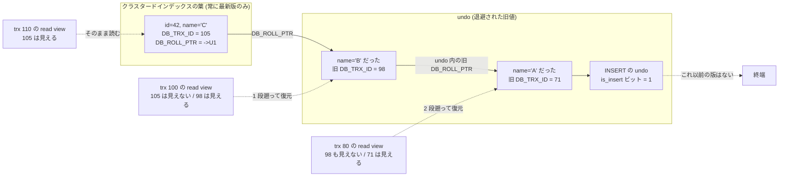

## 何を学んだか

同じ行を 1 人が更新していて、もう 1 人が読もうとしている。ロックだけで一貫性を守るなら、読み手は書き手のコミットを待つしかない。集計クエリ 1 本が OLTP の書き込みを止める、あるいはその逆が起きる。

MVCC (multi-version concurrency control) の答えは単純だ。**行を上書きせず、新しい版を作る。読み手は「自分が読むべき時刻」に合う版を選ぶ。** 誰も待たない。

必要な部品は 3 つしかない。

1. **版に付ける名札** — その版を作ったトランザクションの ID。InnoDB では行の隠し列 `DB_TRX_ID` (6 バイト)
2. **読み手が持つ判定規則** — 「どの ID の変更が自分に見えるか」。データのコピーではなく、数個の値でできている ([read view](./read-view-and-visibility/))
3. **ごみ回収** — 誰からも見えなくなった版を消す仕組み

3 番目が要るのが MVCC の宿命だ。上書きしないということは、放っておけば版が溜まり続けるということでもある。

### 古い版をどこに置くか

ここで設計が二分する。

**PostgreSQL は新旧をテーブル本体に並べる。** `UPDATE` は heap に新しいタプルを追記し、古いタプルに「いつまで有効だったか」を書き込む。テーブルには生きている行と死んだ行が混在し、`VACUUM` が死んだ行を回収する。

**InnoDB はテーブル本体に最新版だけを置く。** `UPDATE` は B+tree の葉のレコードをその場で書き換え、**変更前の値を undo ログへ退避**する。行にはもう 1 本の隠し列 `DB_ROLL_PTR` (7 バイト) があり、それが退避先の undo レコードを指す。undo レコードはさらに 1 つ前の `DB_ROLL_PTR` を持つので、遡ると版の鎖になる。



**この選択の帰結が、InnoDB を使ううえでの性格をほぼ決めている。**

|                           | PostgreSQL (heap に並べる)                            | InnoDB (undo へ退避)                        |
| ------------------------- | ----------------------------------------------------- | ------------------------------------------- |
| 最新版の読み              | 生きているタプルを探す必要がある                      | B+tree の葉にそのままある                   |
| 古い版の読み              | 同じくらいのコスト                                    | **版鎖を 1 段ずつ復元する**                 |
| `UPDATE` 時のインデックス | 行が物理的に動くので全インデックスを更新 (HOT で緩和) | **PK が変わらなければセカンダリは触らない** |
| ごみが溜まる場所          | テーブル本体が膨らむ                                  | **undo テーブルスペースが膨らむ**           |
| 回収する仕組み            | `VACUUM`                                              | `purge` (背景スレッド)                      |
| 回収できる境界            | 最も古いスナップショット                              | 最も古い read view                          |

**「最新版の読み書きが速い代わりに、長いトランザクションが undo を膨らませる」**というのが InnoDB 側の要約になる。テーブルは膨らまないが、undo が膨らむ。しかも undo が消えないと古い版を読む側の鎖も伸び続けるので、遅さと肥大が同時に来る。

回収の境界が「最も古い読み手」であることは両者に共通で、**1 本の長い読み取りトランザクションが全体のごみ回収を止める**という現象も共通だ。`VACUUM` が効かないときに長いトランザクションを疑うのと同じ手順が、InnoDB でも通用する。

## ソースコードのどこか

### 名札は行に埋まっている

```cpp title="storage/innobase/include/data0type.h"
/** row id: a 48-bit integer */
constexpr uint32_t DATA_ROW_ID = 0;
/** stored length for row id */
constexpr uint32_t DATA_ROW_ID_LEN = 6;

/** Transaction id: 6 bytes */
constexpr size_t DATA_TRX_ID = 1;
...
/** Rollback data pointer: 7 bytes */
constexpr size_t DATA_ROLL_PTR = 2;
```

[`data0type.h#L176`](https://github.com/mysql/mysql-server/blob/mysql-8.4.11/storage/innobase/include/data0type.h#L176)。**`DB_TRX_ID` 6 バイトと `DB_ROLL_PTR` 7 バイトが、MVCC のためだけに全行が払っているコスト**だ。合わせて 13 バイト。`INT` 3 列ぶんより大きい。

どの列がどこに入るかは[クラスタードインデックス](./clustered-index/)、バイト列としての形は[行フォーマット変換](./row-format-conversion/)にある。

### 判定は 12 行

```cpp title="storage/innobase/include/read0types.h"
  [[nodiscard]] bool changes_visible(trx_id_t id,
                                     const table_name_t &name) const {
    ut_ad(id > 0);

    if (id < m_up_limit_id || id == m_creator_trx_id) {
      return (true);
    }
    ...
    if (id >= m_low_limit_id) {
      return (false);

    } else if (m_ids.empty()) {
      return (true);
    }

    const ids_t::value_type *p = m_ids.data();

    return (!std::binary_search(p, p + m_ids.size(), id));
  }
```

[`read0types.h#L163`](https://github.com/mysql/mysql-server/blob/mysql-8.4.11/storage/innobase/include/read0types.h#L163)。スナップショットの実体は**データのコピーではなく、3 つの数と 1 本のソート済み配列**だ。詳細は[read view と可視性](./read-view-and-visibility/)。

### 退避の入口は 1 つ

```cpp title="storage/innobase/trx/trx0rec.cc"
/** Writes information to an undo log about an insert, update, or a delete
 marking of a clustered index record. This information is used in a rollback of
 the transaction and in consistent reads that must look to the history of this
 transaction.
 @return DB_SUCCESS or error code */
dberr_t trx_undo_report_row_operation(
```

[`trx0rec.cc#L2112`](https://github.com/mysql/mysql-server/blob/mysql-8.4.11/storage/innobase/trx/trx0rec.cc#L2112)。関数コメントが役割の兼務をそのまま書いている。**「ロールバックに使う」と「一貫読み取りが履歴を見るのに使う」は同じ記録**だ ([undo ログ](./undo-log/))。

### 回収の境界

```cpp title="storage/innobase/trx/trx0purge.cc"
  if (purge_sys->iter.trx_no >= purge_sys->view.low_limit_no()) {
    return nullptr;
  }
```

[`trx0purge.cc#L2213`](https://github.com/mysql/mysql-server/blob/mysql-8.4.11/storage/innobase/trx/trx0purge.cc#L2213)。`purge_sys->view` は**その時点で生きている最も古い read view の複製**で、purge はそれより新しい undo に触らない。この 3 行が「長いトランザクションが 1 本あると `History list length` が伸び続ける」の全部だ ([purge](./purge/))。

## なぜそうなっているか

### なぜ最新版だけをテーブルに置くのか

InnoDB のテーブルは PK の B+tree そのものだ ([クラスタードインデックス](./clustered-index/))。ここに新旧の版を並べると、`WHERE id = 42` の検索が「id = 42 の版を全部見て、自分に見えるものを選ぶ」になる。同じキーの複数レコードを走査する分、点検索が重くなる。

最新版だけを置けば、PK 検索は木を 1 回降りて 1 件読むだけで終わる。**多くのトランザクションが最新版を読む**という前提の下では、これが一番効く。

もう 1 つ、**セカンダリインデックスを触らずに済む**という効果が大きい。行が物理的に動かないので、PK に含まれない列を更新してもセカンダリインデックスの葉は無傷だ。`UPDATE t SET updated_at = NOW() WHERE id = 1` がインデックス 10 本のテーブルでも B+tree 1 本しか触らないのはこの帰結で、PostgreSQL が HOT (heap-only tuple) という別の仕掛けで解こうとしているのと同じ問題を、構造で回避している。

### その代償

3 つある。

- **古い版の読みは版鎖の長さに比例する。** `UPDATE` の undo には変更された列の旧値しか入っていないので、最新版に更新ベクタを逆適用して 1 段ずつ復元する。同じ行を何度も更新するワークロード (カウンタなど) では鎖が伸びる
- **セカンダリインデックスの葉には `DB_TRX_ID` も `DB_ROLL_PTR` もない。** 版の鎖はクラスタードインデックスにしかないので、セカンダリインデックスだけで済むはずのクエリでも、可視性を確かめるためにクラスタード側へ戻ることがある ([セカンダリインデックスと MVCC](./secondary-index-visibility/))
- **undo が消えないと何も進まない。** 古い read view が 1 つあるだけで purge が止まり、undo テーブルスペースが膨らみ、版鎖も伸びる

### なぜ回収の境界を「最も古い読み手」だけで決めるのか

厳密には「今生きているどの read view からも見えない版」を消してよい。read view が {1000, 1500, 1800} のとき、`trx_no` 1200 の版は 1000 の view からしか見えないので、その view がその行を読まないなら消せる。

だがそれを判定するには全 view と全行の関係を調べる必要がある。**最も古い view だけを見れば、比較 1 回で安全側に倒せる。** その代償が「1 本の長い読み取りが全体を止める」という挙動で、`VACUUM` が同じ理由で止まるのとまったく同じ構図だ。

### `INSERT` の undo だけ特別扱いされる

挿入前の状態は「行が存在しない」なので、復元すべき値がない。だから `INSERT` の undo レコードには**主キーしか入っていない**し、コミットの瞬間に捨てられる。`UPDATE` / `DELETE` の undo だけが history list に積まれて purge を待つ。

**追記専用のテーブルでは `History list length` が伸びない**のはこのためだ。逆に、論理削除 (`UPDATE ... SET deleted_at = NOW()`) は全部 update undo になる ([undo ログ](./undo-log/))。

## どう活かすか

### `History list length` が伸びたら、疑うのは書き手ではなく読み手

`SHOW ENGINE INNODB STATUS` の TRANSACTIONS セクションに出るこの数字は、purge されていない update undo の本数だ。伸び続けているとき、まず見るのは書き込み量ではなく最古のトランザクションになる。

```sql
SELECT trx_id, trx_state, trx_started,
       TIMESTAMPDIFF(SECOND, trx_started, NOW()) AS age_sec,
       trx_mysql_thread_id, trx_query
  FROM information_schema.INNODB_TRX
 ORDER BY trx_started;
```

**`trx_query` が `NULL` でも無罪ではない。** REPEATABLE READ では最初の `SELECT` で read view が固定されるので、そのあとアプリケーションが何もせず接続を握っているだけでも purge は止まる ([purge](./purge/))。

### 同じ行を高頻度で更新する設計を避ける

版鎖の長さは「その行が更新された回数のうち、まだ purge されていない分」だ。1 行のカウンタを毎秒 100 回更新すれば、purge が 10 秒遅れただけで鎖が 1000 段になる。古い read view を持つセッションはその 1000 段を毎回歩く。

集約先を分割する (シャードして最後に足す)、バッファして間引く、といった定石が効くのはこの構造のためだ。

### 「MySQL は VACUUM がなくて楽」は半分だけ正しい

テーブル本体が死んだ行で膨らまないのは事実だ。だが**回収の必要そのものはなくなっていない**。場所が undo に移り、名前が purge になり、監視すべき数字が `History list length` になっただけだ。

PostgreSQL の運用で見ていたものとの対応はこうなる。

| PostgreSQL                                  | InnoDB                                                |
| ------------------------------------------- | ----------------------------------------------------- |
| `VACUUM`                                    | purge スレッド                                        |
| `pg_stat_activity` の `xact_start` が古い行 | `INNODB_TRX` の `trx_started` が古い行                |
| dead tuple 数                               | `History list length`                                 |
| テーブル / インデックスの bloat             | undo テーブルスペースの肥大 (+ B+tree ページの虫食い) |
| `autovacuum_max_workers`                    | `innodb_purge_threads`                                |

### この続き

- スナップショットの実体 (3 つの数と 1 つのリスト) は[read view と可視性](./read-view-and-visibility/)
- 版鎖の作られ方と `INSERT` / `UPDATE` の非対称は[undo ログ — 巻き戻しと古い版の両方に使う](./undo-log/)
- 回収の実装と `History list length` の読み方は[purge — 誰にも見えなくなった版を消す](./purge/)
- セカンダリインデックスに版がないことの面倒さは[セカンダリインデックスと MVCC — 葉に版がない](./secondary-index-visibility/)
- `trx_t` に ID が付くタイミングは[トランザクション — trx_t の一生](./transaction-walkthrough/)
- どの分離レベルでスナップショットがいつ作られるかは[分離レベルとアノマリ](./isolation-levels-and-anomalies/)
