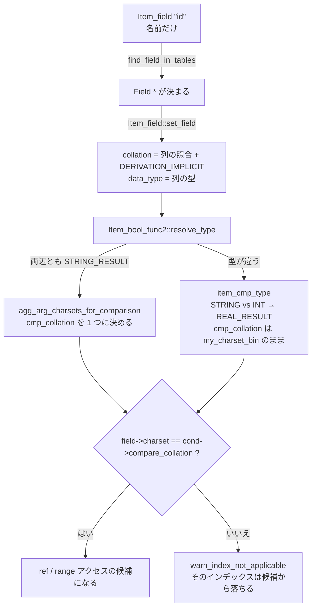

> **前提**: [2 パスと contextualize](./parse-tree-and-contextualize/)

## 何を学んだか

`contextualize` を抜けた時点の `Item_field` は、**列名の文字列しか持っていない**。`SELECT id FROM t` の `id` は `Item_field(POS(), NullS, NullS, "id")` でしかなく、どのテーブルの何バイト目かも、型も、照合順序も分かっていない。

これを埋めるのが `Query_block::prepare` から呼ばれる `fix_fields` だ。やっていることは 3 つある。

1. **どの `Field` を指すのかを決める** — 名前解決テーブルの並びを線形に走査し、複数当たったら `ER_NON_UNIQ_ERROR`
2. **その `Field` から属性をコピーする** — 型、照合順序と derivation、NULL 可能性、最大長
3. **親ノードが子の属性を集約する** — `Item_func_eq::resolve_type` が両辺の照合順序を突き合わせ、比較の型と比較の照合順序を 1 つ決める

3 番目が本ページの主題である。**比較の照合順序が列の照合順序と違ってしまったら、その列のインデックスは使えない。** MySQL が「インデックスがあるのに使わない」ことの代表的な原因は、実行時の判断ではなくこの解決段階の集約結果として決まっている。



## なぜそうなっているか

**照合順序の集約を「値の変換」ではなく「比較器の選択」として実装したのは、インデックスを守るためだ。** 素直に実装するなら、弱い方を強い方の照合順序に `CONVERT` してから比較すればよい。式の意味としては正しいが、列が関数で包まれた瞬間にインデックスは使えない。MySQL は比較文脈でだけ `only_consts = true` を渡し、列は裸のまま残して「この比較はこの照合順序で行う」という情報を `Arg_comparator` に持たせる道を選んだ。結果として、**片方の列だけはインデックスを使える**余地が残る。

**型が違うときに REAL に落とすのは SQL 標準ではなく MySQL の方言だ。** `types_allow_materialization` のコメントがその自覚を書いている ([`sql_select.cc#L1274`](https://github.com/mysql/mysql-server/blob/mysql-8.4.11/sql/sql_select.cc#L1274))。

```cpp title="sql/sql_select.cc"
  /*
    Materialization uses index lookup which implicitly converts the type of
    res_outer into that of res_inner.
    However, this can be done only if it respects rules in:
    https://dev.mysql.com/doc/refman/8.0/en/type-conversion.html
    ...
    Those rules say that, generally, if types differ, we convert them to
    REAL.
    So, looking up into a number is ok: outer will be converted to
    number. Collations don't matter.
    This covers e.g. looking up INT into DECIMAL, CHAR into INT, DECIMAL into
    BIT.
  */
  if (num_inner) return true;
  // Conversely, looking up one number into a non-number is not possible.
  if (num_outer) return false;
```

**数値の列に文字列を当てるのは平気、文字列の列に数値を当てるのは無理**、という非対称がここに一番きれいに書かれている。前者は文字列を数値に直せばインデックスの探索キーになる。後者は `123` に対応する文字列が `'123'` なのか `'0123'` なのか `' 123'` なのか決まらないので、探索キーが作れない。

**名前解決を線形走査のままにしているのは、`MAX_TABLES` が 61 だからだ。** ハッシュを作るコストが割に合わない規模で、しかも修飾されていない名前は曖昧性検査のために最後まで見る必要がある。

## ソースコードのどこか

### 解決の順番 — `Query_block::prepare`

[`sql/sql_resolver.cc#L179`](https://github.com/mysql/mysql-server/blob/mysql-8.4.11/sql/sql_resolver.cc#L179)。骨格だけ抜くとこうなる。

```cpp title="sql/sql_resolver.cc"
  if (setup_tables(thd, get_table_list(), false)) return true;

  if ((derived_table_count || table_func_count) &&
      resolve_placeholder_tables(thd, true))
    return true;
  ...
  if (with_wild && setup_wild(thd)) return true;
  if (setup_base_ref_items(thd)) return true; /* purecov: inspected */

  if (setup_fields(thd, thd->want_privilege, /*allow_sum_func=*/true,
                   /*split_sum_funcs=*/true, /*column_update=*/false,
                   insert_field_list, &fields, base_ref_items))
    return true;
  ...
  // Set up join conditions and WHERE clause
  if (setup_conds(thd)) return true;

  // Set up the GROUP BY clause
  int all_fields_count = fields.size();
  if (group_list.elements && setup_group(thd)) return true;
```

**テーブル → SELECT リスト → WHERE / ON → GROUP BY → HAVING → ORDER BY** の順だ。SELECT リストが `WHERE` より先なのは、`HAVING` と `ORDER BY` が SELECT リストのエイリアスを参照できるようにするためで、そのために `setup_base_ref_items` が「SELECT リストの各式へのポインタ配列」(`base_ref_items`) を先に作っておく。

[`setup_tables` (L1234)](https://github.com/mysql/mysql-server/blob/mysql-8.4.11/sql/sql_resolver.cc#L1234) は join nest を平らにして `leaf_tables` の並びを作り、各テーブルに 0 から番号を振る。

```cpp title="sql/sql_resolver.cc"
    tr->set_tableno(tableno);
    leaf_table_count++;  // Count the input tables of the query
```

この番号がそのまま `table_map` のビット位置になる。`Item::used_tables()` が返すビットマップも、join 順序探索が扱う集合も全部これだ。**「この式はどのテーブルに依存するか」という問いが、ここで整数のビット演算に落ちる。**

[`setup_wild` (L1437)](https://github.com/mysql/mysql-server/blob/mysql-8.4.11/sql/sql_resolver.cc#L1437) が `*` を展開する。面白い最適化が 1 つ入っている。

```cpp title="sql/sql_resolver.cc"
      if (subsel != nullptr &&
          subsel->subquery_type() == Item_subselect::EXISTS_SUBQUERY &&
          !having_cond()) {
        /*
          It is EXISTS(SELECT * ...) and we can replace * by any constant.

          Item_int do not need fix_fields() because it is basic constant.
        */
        *it = new Item_int(NAME_STRING("Not_used"), 1,
                           MY_INT64_NUM_DECIMAL_DIGITS);
```

`EXISTS (SELECT * FROM ...)` の `*` は `1` に置き換わる。`EXISTS (SELECT 1 ...)` と書いても速くならない、と言われる根拠がこれである (ただし `HAVING` があると置換しない)。

[`setup_conds` (L1494)](https://github.com/mysql/mysql-server/blob/mysql-8.4.11/sql/sql_resolver.cc#L1494) が `WHERE` と `ON` を解決する。

```cpp title="sql/sql_resolver.cc"
  if (m_where_cond) {
    assert(m_where_cond->is_bool_func());
    resolve_place = Query_block::RESOLVE_CONDITION;
    thd->where = "where clause";
    if ((!m_where_cond->fixed &&
         m_where_cond->fix_fields(thd, &m_where_cond)) ||
        m_where_cond->check_cols(1))
      return true;
```

`thd->where` に置く文字列が、そのままエラーメッセージの末尾になる。`ERROR 1054 (42S22): Unknown column 'x' in 'where clause'` の `'where clause'` はこの 1 行だ。`"having clause"`、`"on clause"`、`"order clause"` などが同じ仕組みで切り替わる。

### `Item_field::fix_fields` — 線形走査で列を探す

[`sql/item.cc#L5872`](https://github.com/mysql/mysql-server/blob/mysql-8.4.11/sql/item.cc#L5872)。本体は [`find_field_in_tables` (`sql_base.cc#L8100`)](https://github.com/mysql/mysql-server/blob/mysql-8.4.11/sql/sql_base.cc#L8100) に委ねられる。

```cpp title="sql/sql_base.cc"
  for (cur_table = first_table; cur_table != last_table;
       cur_table = cur_table->next_name_resolution_table) {
    Field *cur_field = find_field_in_table_ref(
        thd, cur_table, name, length, item->item_name.ptr(), db, table_name,
        ref, want_privilege, allow_rowid, &field_index,
        register_tree_change, &actual_table);
    ...
    if (cur_field) {
      ...
      /*
        If we found a fully qualified field we return it directly as it can't
        have duplicates.
       */
      if (db) return cur_field;

      if (found) {
        if (report_error == REPORT_ALL_ERRORS ||
            report_error == IGNORE_EXCEPT_NON_UNIQUE)
          my_error(ER_NON_UNIQ_ERROR, MYF(0),
                   table_name ? item->full_name() : name, thd->where);
        return (Field *)nullptr;
      }
      found = cur_field;
    }
  }
```

**修飾されていない列名は全テーブルを最後まで走査する。** 途中で見つかっても打ち切らないのは、2 つ目が見つかったら `ER_NON_UNIQ_ERROR` (1052) にしなければならないからだ。逆に `db.tbl.col` のように完全修飾されていれば、見つかった時点で即 return する。

走査の順序は `next_name_resolution_table` で、`m_table_list` (FROM の並び) とは別のリンクである。`NATURAL JOIN` / `USING` があると、結合列を「どちらのテーブルにも属さない共通列」として見せるために、この並びが張り替えられる。

### `set_field` — Field から属性を写し取る

見つかった `Field` から `Item_field` に属性がコピーされる ([`item.cc#L3018`](https://github.com/mysql/mysql-server/blob/mysql-8.4.11/sql/item.cc#L3018))。

```cpp title="sql/item.cc"
  collation.set(field_par->charset(), field_par->derivation(),
                field_par->repertoire());
  set_data_type(field_par->type());
  decimals = field->decimals();
  unsigned_flag = field_par->is_flag_set(UNSIGNED_FLAG);
  max_length = char_to_byte_length_safe(field_par->char_length(),
                                        collation.collation->mbmaxlen);
```

`derivation` が一緒に付いてくるのがポイントだ。`Field::derivation()` の既定は `DERIVATION_IMPLICIT` ([`field.h#L1615`](https://github.com/mysql/mysql-server/blob/mysql-8.4.11/sql/field.h#L1615))、数値型の列は `DERIVATION_NUMERIC` を返す。

```cpp title="sql/field.h"
enum Derivation {
  DERIVATION_IGNORABLE = 6,
  DERIVATION_NUMERIC = 5,
  DERIVATION_COERCIBLE = 4,
  DERIVATION_SYSCONST = 3,
  DERIVATION_IMPLICIT = 2,
  DERIVATION_NONE = 1,
  DERIVATION_EXPLICIT = 0
};
```

**値が小さいほど強い。** 明示的な `COLLATE` (0) > 列 (2) > システム定数 (3) > リテラル (4) という強さの順序で、これがマニュアルの「coercibility」表の実体である。

### `DTCollation::aggregate` — 2 つの照合順序から 1 つを選ぶ

[`sql/item.cc#L2560`](https://github.com/mysql/mysql-server/blob/mysql-8.4.11/sql/item.cc#L2560)。判断の骨格はこうだ。

```cpp title="sql/item.cc"
bool DTCollation::aggregate(DTCollation &dt, uint flags) {
  // With two EXPLICIT derivations, collations must be equal:
  if (collation != dt.collation && derivation == DERIVATION_EXPLICIT &&
      dt.derivation == DERIVATION_EXPLICIT) {
    return true;
  }
  if (!my_charset_same(collation, dt.collation)) {
    ...
    } else if ((flags & MY_COLL_ALLOW_SUPERSET_CONV) &&
               left_is_superset(this, &dt)) {
      // Do nothing
    ...
    } else {
      // Cannot apply conversion
      set(&my_charset_bin, DERIVATION_NONE, (dt.repertoire | repertoire));
      return true;
    }
  } else if (derivation < dt.derivation) {
    // Do nothing
  } else if (dt.derivation < derivation) {
    set(dt);
  } else {
```

同じ文字セット同士なら derivation の小さい方 (強い方) が勝つ。文字セットが違うなら、片方が他方のスーパーセットかどうか、あるいは弱い方を変換できるかを見る。どちらもできなければ `DERIVATION_NONE` を返し、呼び出し側が `ER_CANT_AGGREGATE_2COLLATIONS` (1267) を出す。**`Illegal mix of collations` はこの分岐の末端である。**

最後の `else` に、同じ文字セットで derivation も同じだが照合順序が違う場合の規則がある。

```cpp title="sql/item.cc"
      // When aggregating a binary and a non-binary collation for the same
      // character set, the binary collation is preferred.
      if (collation->state & MY_CS_BINSORT) return false;
      if (dt.collation->state & MY_CS_BINSORT) {
        set(dt);
        return false;
      }
      const CHARSET_INFO *bin =
          get_charset_by_csname(collation->csname, MY_CS_BINSORT, MYF(0));
      set(bin, DERIVATION_NONE);
```

`utf8mb4_0900_ai_ci` の列と `utf8mb4_general_ci` の列を比較すると、**どちらでもない `utf8mb4_bin` に落ちる**。両方の列がそれぞれのインデックスを使えなくなるのはこのためだ。

### `agg_item_charsets` — 文脈で規則を変える

集約の入口は 1 つ ([`item.cc#L2817`](https://github.com/mysql/mysql-server/blob/mysql-8.4.11/sql/item.cc#L2817)) だが、呼ぶ側は 2 つのフラグ集合を使い分ける。

```cpp title="sql/item.h"
inline bool agg_item_charsets_for_string_result(DTCollation &c,
                                                const char *name, Item **items,
                                                uint nitems, int item_sep = 1) {
  const uint flags = MY_COLL_ALLOW_SUPERSET_CONV |
                     MY_COLL_ALLOW_COERCIBLE_CONV | MY_COLL_ALLOW_NUMERIC_CONV;
  return agg_item_charsets(c, name, items, nitems, flags, item_sep, false);
}
inline bool agg_item_charsets_for_comparison(DTCollation &c, const char *name,
                                             Item **items, uint nitems,
                                             int item_sep = 1) {
  const uint flags = MY_COLL_ALLOW_SUPERSET_CONV |
                     MY_COLL_ALLOW_COERCIBLE_CONV | MY_COLL_DISALLOW_NONE;
  return agg_item_charsets(c, name, items, nitems, flags, item_sep, true);
}
```

[`sql/item.h#L4057`](https://github.com/mysql/mysql-server/blob/mysql-8.4.11/sql/item.h#L4057)。違いは 2 つある。

|                              | 文字列結果 (`CONCAT` など)    | 比較 (`=`, `<`, `IN`)   |
| ---------------------------- | ----------------------------- | ----------------------- |
| `MY_COLL_ALLOW_NUMERIC_CONV` | あり (数値を文字列化してよい) | なし                    |
| `MY_COLL_DISALLOW_NONE`      | なし                          | あり (曖昧なら即エラー) |
| 最後の引数 `only_consts`     | `false`                       | **`true`**              |

`only_consts` が決定的だ。[`agg_item_set_converter` (`item.cc#L2711`)](https://github.com/mysql/mysql-server/blob/mysql-8.4.11/sql/item.cc#L2711) の中でこう効く。

```cpp title="sql/item.cc"
    size_t dummy_offset;
    // If told so (from comparison code), only add converter for const values.
    if (only_consts && !(*arg)->const_item()) continue;
```

**比較文脈では、定数にしか変換器 (`CONVERT(... USING cs)`) を挿さない。** 列には挿さない。`CONCAT(col_latin1, col_utf8)` なら片方の列が変換器で包まれるが、`col_latin1 = col_utf8` では両方の列が裸のまま残り、代わりに「比較はこの照合順序で行う」という指示 (`cmp.cmp_collation`) だけが記録される。

理由は明らかで、**列を変換器で包んだら、その列のインデックスは絶対に使えなくなる**からだ。包まずに残しておけば、少なくとも「比較の照合順序と列の照合順序が一致する側」はインデックスを使える。

### 型が違うと照合の集約は走らない

[`Item_bool_func2::resolve_type` (`item_cmpfunc.cc#L743`)](https://github.com/mysql/mysql-server/blob/mysql-8.4.11/sql/item_cmpfunc.cc#L743)。

```cpp title="sql/item_cmpfunc.cc"
  if (thd->lex->sql_command != SQLCOM_SHOW_CREATE &&
      args[0]->result_type() == STRING_RESULT &&
      args[1]->result_type() == STRING_RESULT &&
      agg_arg_charsets_for_comparison(cmp.cmp_collation, args, 2))
    return true;

  args[0]->cmp_context = args[1]->cmp_context =
      item_cmp_type(args[0]->result_type(), args[1]->result_type());
```

**両辺が `STRING_RESULT` のときだけ**照合順序を集約する。片方が数値なら `cmp.cmp_collation` は `DTCollation` のコンストラクタが入れた既定値、すなわち `my_charset_bin` / `DERIVATION_NONE` のまま残る。

そして比較の型は [`item_cmp_type` (`item.cc#L9611`)](https://github.com/mysql/mysql-server/blob/mysql-8.4.11/sql/item.cc#L9611) が決める。

```cpp title="sql/item.cc"
Item_result item_cmp_type(Item_result a, Item_result b) {
  if (a == b) {
    assert(a != INVALID_RESULT);
    return a;
  } else if (a == ROW_RESULT || b == ROW_RESULT) {
    return ROW_RESULT;
  }
  if ((a == INT_RESULT || a == DECIMAL_RESULT) &&
      (b == INT_RESULT || b == DECIMAL_RESULT)) {
    return DECIMAL_RESULT;
  }
  return REAL_RESULT;
}
```

`STRING_RESULT` と `INT_RESULT` は最後の行に落ちて **`REAL_RESULT`** になる。`WHERE varchar_col = 123` は「文字列の比較」ではなく「両辺を `double` にしてからの比較」として解決される。

### そしてインデックスが落ちる

ref アクセスの候補を集める [`add_key_field` (`sql_optimizer.cc#L7197`)](https://github.com/mysql/mysql-server/blob/mysql-8.4.11/sql/sql_optimizer.cc#L7197) に、この 2 つを同時に弾く検査がある。

```cpp title="sql/sql_optimizer.cc"
      /*
        Check if the field and value are comparable in the index.
       */
      if (!comparable_in_index(cond, field, Field::itRAW, cond->functype(),
                               *value) ||
          (field->cmp_type() == STRING_RESULT &&
           field->match_collation_to_optimize_range() &&
           field->charset() != cond->compare_collation())) {
        warn_index_not_applicable(stat->join()->thd, field, possible_keys);
        return false;
      }
```

後半の条件が、上で追ってきた 2 つのケースを両方捕まえる。

- 照合違いの列同士 → `compare_collation()` は集約結果 (たとえば `utf8mb4_bin`) で、列の照合と違う
- 文字列列 = 数値 → `compare_collation()` は既定の `my_charset_bin` で、やはり列の照合と違う

前半の [`comparable_in_index` (`range_optimizer/range_optimizer.cc#L1226`)](https://github.com/mysql/mysql-server/blob/mysql-8.4.11/sql/range_optimizer/range_optimizer.cc#L1226) はコメントで結論を言っている。

```cpp title="sql/range_optimizer/range_optimizer.cc"
  /*
    Usually an index cannot be used if the column collation differs
    from the operation collation. However, a case insensitive index
    may be used for some binary searches:

       WHERE latin1_swedish_ci_column = 'a' COLLATE lati1_bin;
       WHERE latin1_swedish_ci_colimn = BINARY 'a '
  */
```

同じ関数は range 分析からも呼ばれる ([`range_analysis.cc` の `get_mm_leaf`](https://github.com/mysql/mysql-server/blob/mysql-8.4.11/sql/range_optimizer/range_analysis.cc#L1392))。つまり ref も range も同じ門で止まる ([range 分析のページ](./range-optimizer/))。

等価伝播も同じ理由で止まる。[`check_simple_equality` (`sql_optimizer.cc#L3879`)](https://github.com/mysql/mysql-server/blob/mysql-8.4.11/sql/sql_optimizer.cc#L3879) は `Item_equal` を作る前に型の一致を要求する。

```cpp title="sql/sql_optimizer.cc"
    if (const_item && field_item->result_type() == const_item->result_type()) {
      if (field_item->result_type() == STRING_RESULT) {
        const CHARSET_INFO *cs = field_item->field->charset();
        ...
        if ((cs != down_cast<Item_func *>(item)->compare_collation()) ||
            !cs->coll->propagate(cs, nullptr, 0))
          return false;
```

`a = b AND b = 'x'` から `a = 'x'` を導く多重等価は、照合順序か型が食い違った瞬間に作られなくなる。**インデックスが 1 つ落ちるだけでなく、その条件が他のテーブルに伝わらなくなる**ので、join 順序の選択肢も減る ([join 順序のページ](./join-order-search/))。

## どう活かすか

### 症状 1: 文字列カラムに数値を渡すと全表スキャンになる

```sql
-- user_code VARCHAR(32) にインデックスがある
SELECT * FROM users WHERE user_code = 12345;   -- type: ALL
SELECT * FROM users WHERE user_code = '12345'; -- type: ref
```

引用符の有無で `item_cmp_type` の答えが `STRING_RESULT` から `REAL_RESULT` に変わり、`cmp_collation` が `my_charset_bin` のままになって `add_key_field` の検査で落ちる。ORM やドライバがバインド値を数値として送っていると、SQL の見た目からは分からない。

しかも正しさの面でも危ない。`REAL` 比較なので `'12345abc'` も `'0012345'` も `' 12345'` も **同じ行としてマッチする**。「重複がないはずのコードで複数行返る」という現象は、たいていこの型変換が原因だ。

**確認方法。** `EXPLAIN` の直後に `SHOW WARNINGS` を打つ。[`warn_index_not_applicable`](https://github.com/mysql/mysql-server/blob/mysql-8.4.11/sql/sql_optimizer.cc#L7155) は `EXPLAIN` か `sql_safe_updates` のときにだけ警告を積む。

```cpp title="sql/sql_optimizer.cc"
  if (thd->lex->is_explain() ||
      thd->variables.option_bits & OPTION_SAFE_UPDATES)
    for (uint j = 0; j < field->table->s->keys; j++)
      if (cant_use_index.is_set(j))
        push_warning_printf(thd, Sql_condition::SL_WARNING,
                            ER_WARN_INDEX_NOT_APPLICABLE,
                            ER_THD(thd, ER_WARN_INDEX_NOT_APPLICABLE), "ref",
                            field->table->key_info[j].name, field->field_name);
```

メッセージは `Cannot use ref access on index '<idx>' due to type or collation conversion on field '<col>'`。**普通に実行しただけでは出ない警告**なので、遅いクエリを見つけたら `EXPLAIN` + `SHOW WARNINGS` をセットで打つ習慣にしておくとよい。

### 症状 2: 照合順序の違う列を JOIN するとインデックスが効かない

```sql
-- a.code は utf8mb4_general_ci、b.code は utf8mb4_0900_ai_ci
SELECT * FROM a JOIN b ON a.code = b.code;
```

`DTCollation::aggregate` は同じ文字セット・同じ derivation・違う照合順序を見て `utf8mb4_bin` に落とす。**どちらの列の照合順序でもない**ので、`a.code` のインデックスも `b.code` のインデックスも `add_key_field` の検査で落ちる。両側が全表スキャンになり、hash join に落ちる。

文字セットまで違えば (`latin1` と `utf8mb4`)、`Illegal mix of collations` (1267) でそもそも実行できないこともある。エラーになる方がまだ気づきやすい。

**起きやすい場面。**

- MySQL 8.0 で新規作成したテーブル (既定 `utf8mb4_0900_ai_ci`) と、5.7 から移行したテーブル (`utf8mb4_general_ci`) を JOIN する
- `CREATE TABLE ... COLLATE` を指定した表と指定しなかった表が混ざる
- 内部一時表やビュー経由で照合順序が変わる

**確認方法。**

```sql
SELECT TABLE_NAME, COLUMN_NAME, COLLATION_NAME
FROM information_schema.COLUMNS
WHERE TABLE_SCHEMA = DATABASE() AND COLLATION_NAME IS NOT NULL
ORDER BY COLLATION_NAME;
```

複数の照合順序が混在していたら、JOIN キーになる列から先に揃える。`ALTER TABLE ... CONVERT TO CHARACTER SET ... COLLATE ...` はテーブル全体を作り直すので、DDL の重さは [ALGORITHM の決定](./alter-algorithm-selection/)を見て見積もる。

**その場しのぎ。** `ON a.code = b.code COLLATE utf8mb4_general_ci` と書けば `DERIVATION_EXPLICIT` (0) が最強なので比較は `general_ci` になり、`a.code` 側のインデックスだけは使えるようになる。ただし `b.code` 側は確実に使えなくなるので、駆動表の選択とセットで考える必要がある。

### 症状 3: `Illegal mix of collations` が JOIN でだけ出る

単体の `SELECT` では出ないのに JOIN すると 1267 になる、というのは `MY_COLL_DISALLOW_NONE` の効果だ。比較文脈だけがこのフラグを立てていて、集約結果が `DERIVATION_NONE` になった時点でエラーにする。`CONCAT` のような文字列結果文脈では同じ組み合わせでも通ることがある。

「なぜ表示はできるのに比較できないのか」の答えがここにある。

### 一般化して持ち帰るもの

- **「解決」段階で決まった型と照合順序は、後段では覆せない。** オプティマイザは `Item` の属性を読むだけで、比較の意味を変えることはしない。だから遅いクエリを見るとき、最初に疑うべきは統計やヒントではなく「両辺の型と照合順序が一致しているか」である
- **関数で包まれた列はインデックスを失う、という一般則の正体は変換器の挿入だ。** `DATE(created_at) = '2026-01-01'` も `agg_item_set_converter` と同じ話で、列が式の中に入った瞬間に `field->eq(key_part->field)` が成り立たなくなる
- **エラーにならない暗黙変換の方が危ない。** 1267 は落ちるので気づくが、`REAL` への暗黙変換は静かに通って結果まで変える
