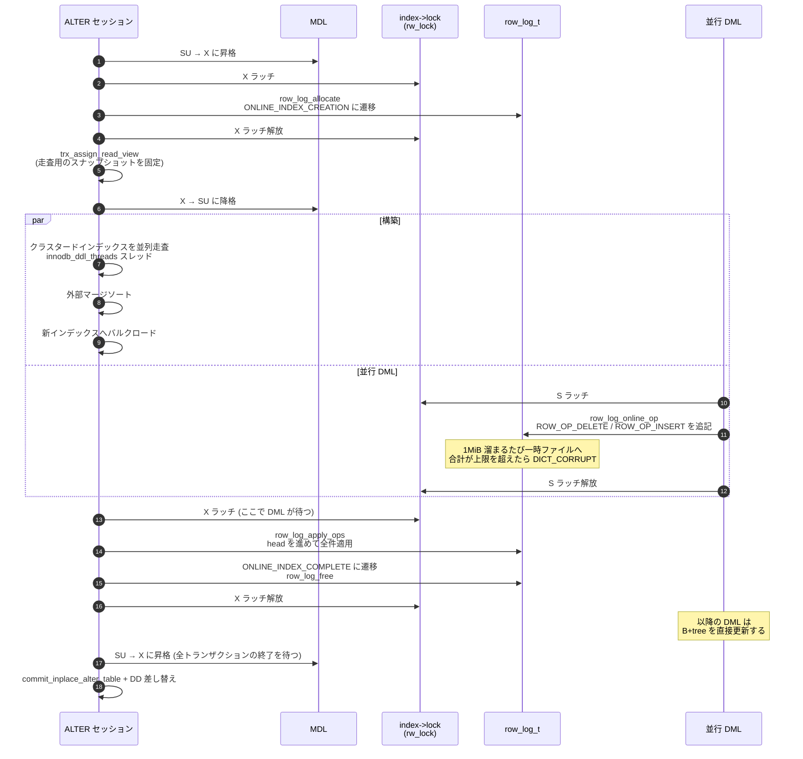

> **前提**: [ALGORITHM と LOCK の決定](./alter-algorithm-selection/) / [セカンダリインデックス](./secondary-index/)

## 何を学んだか

`ALTER TABLE t ADD INDEX (c), ALGORITHM=INPLACE, LOCK=NONE` は、こういう構造になっている。

1. **prepare** — 排他 MDL の下で、空のインデックス構造を作り、`row_log_t` を確保し、そのインデックスの状態を `ONLINE_INDEX_CREATION` にする
2. **build** — MDL を SU に落とす。クラスタードインデックスをスナップショットで走査し、ソートして、新インデックスにバルクロードする。**この間の DML は新インデックスを直接更新せず、`row_log_t` に追記する**
3. **apply** — 構築が終わったら、インデックスの X ラッチを取って row log を適用する。適用中に来た DML は同じ X ラッチで待つ
4. **commit** — MDL を排他に上げて、DD を差し替える

「インデックスを作りながら DML を受ける」の実体は、**DML が新インデックスの B+tree ではなく別のバッファに書いている**ということだ。追記専用なので競合しない。

読み手が取り違えやすいのはここだ。**row log の適用は「排他 MDL の下」ではない。** 適用が始まる時点で MDL はまだ SU で、他のセッションはテーブルを開いたままだ。止めているのは `dict_index_get_lock(index)` の X ラッチ、つまり**その 1 本のインデックスに対する latch** だけになる。MDL の排他はさらにその後、`ha_commit_inplace_alter_table` の直前に取る ([ALTER の walkthrough](./ddl-walkthrough/))。

`row_log_t` はメモリだけではない。1 ブロック分溜まるとファイルに書き出す。その総量が `innodb_online_alter_log_max_size` (既定 128MiB) を超えると、**そこで構築が失敗する**。

## なぜそうなっているか

**row log を「追記専用のバイト列」にしたのは、DML 側のコストを最小化するためだ。** 新インデックスの B+tree を直接更新する設計にすると、構築中のツリーは断片的なので探索が成立しない。並べ替え済みの部分と未構築の部分が混在するからだ。追記なら位置を探す必要がなく、`mutex_enter` + `memcpy` で済む。

**上限を設けたのは、追記が構築より速いと永久に終わらないからだ。** 書き込みが激しいテーブルでは、走査が終わるまでに溜まったログの適用中にさらにログが溜まり、収束しない可能性がある。`innodb_online_alter_log_max_size` は「収束しないなら早めに諦める」ための閾値になっている。**上げれば通る可能性は上がるが、適用フェーズが長くなり、その間 X ラッチで DML が止まる。**

**適用を MDL の排他ではなくインデックスの X ラッチでやるのは、影響範囲を絞るためだ。** MDL を排他にすると、そのテーブルへの**すべての**アクセスが止まる。インデックスの X ラッチなら、止まるのは「そのインデックスを更新しようとする DML」だけで、読み取りは通る (新インデックスはまだ公開されていないので、誰もそれを読まない)。

**走査を REPEATABLE READ に固定しているのは、row log との整合を取るためだ** ([ALTER の walkthrough](./ddl-walkthrough/))。コメントが理由を 2 つ挙げている。

```cpp title="storage/innobase/handler/handler0alter.cc"
    /* We must scan the index at an isolation level >= READ COMMITTED, because
    a dirty read will see half written blob references.
    ...
    When creating a secondary index online, this table scan must not see
    records that have only been inserted to the clustered index, but have
    not been written to the online_log of index[]. If we performed
    READ UNCOMMITTED, it could happen that the ADD INDEX reaches
    ONLINE_INDEX_COMPLETE state between the time the DML thread has updated
    the clustered index but has not yet accessed secondary index. */
```

**走査が row log より「先」を見てしまうと、その行が二重に入るか、逆に抜ける。** スナップショットを prepare 時点に固定することで、「スナップショット以前は走査が拾う、以後は row log が拾う」という排他的な分担が成立する。**セッションの分離レベルが READ COMMITTED でも、この走査だけは RR になる。**

**ログの溢れを `DICT_CORRUPT` で表現しているのは、DML 側にエラーを返す先がないからだ。** `INSERT` を打ったユーザに「他の誰かの ALTER が失敗しました」とは返せない。フラグを立てて DML は成功させ、ALTER 側が適用時に気づいて `ONLINE_INDEX_ABORTED` にする。**このとき失敗するのは ALTER だけで、データは一切壊れていない。** 「corrupt」という名前は、まだ公開されていない索引の内部状態を指しているだけだ。

## ソースコードのどこか

### インデックスの 4 状態

```cpp title="storage/innobase/include/dict0mem.h"
/** The status of online index creation */
enum online_index_status {
  /** the index is complete and ready for access */
  ONLINE_INDEX_COMPLETE = 0,
  /** the index is being created, online
  (allowing concurrent modifications) */
  ONLINE_INDEX_CREATION,
  /** secondary index creation was aborted and the index
  should be dropped as soon as index->table->n_ref_count reaches 0,
  or online table rebuild was aborted and the clustered index
  of the original table should soon be restored to
  ONLINE_INDEX_COMPLETE */
  ONLINE_INDEX_ABORTED,
  /** the online index creation was aborted, the index was
  dropped from the data dictionary and the tablespace, and it
  should be dropped from the data dictionary cache as soon as
  index->table->n_ref_count reaches 0. */
  ONLINE_INDEX_ABORTED_DROPPED
};
```

[`dict0mem.h#L1638`](https://github.com/mysql/mysql-server/blob/mysql-8.4.11/storage/innobase/include/dict0mem.h#L1638)。`dict_index_t` の中では 2 ビットしか使っていない。

```cpp title="storage/innobase/include/dict0mem.h"
  /** enum online_index_status. Transitions from ONLINE_INDEX_COMPLETE (to
  ONLINE_INDEX_CREATION) are protected by dict_operation_lock and
  dict_sys->mutex. Other changes are protected by index->lock. */
  unsigned online_status : 2;
```

### DML 側の分岐

`UPDATE` (削除+挿入を含む) がセカンダリインデックスを触るとき、この状態を見る。

```cpp title="storage/innobase/row/row0upd.cc"
  if (!index->is_committed()) {
    /* The index->online_status may change if the index is
    or was being created online, but not committed yet. It
    is protected by index->lock. */

    mtr_s_lock(dict_index_get_lock(index), &mtr, UT_LOCATION_HERE);

    switch (dict_index_get_online_status(index)) {
      case ONLINE_INDEX_COMPLETE:
        /* This is a normal index. Do not log anything.
        Perform the update on the index tree directly. */
        break;
      case ONLINE_INDEX_CREATION:
        /* Log a DELETE and optionally INSERT. */
        row_log_online_op(index, entry, 0);

        if (!node->is_delete) {
          mem_heap_empty(heap);
          entry =
              row_build_index_entry(node->upd_row, node->upd_ext, index, heap);
          ut_a(entry);
          row_log_online_op(index, entry, trx->id);
        }
        [[fallthrough]];
      case ONLINE_INDEX_ABORTED:
      case ONLINE_INDEX_ABORTED_DROPPED:
        mtr_commit(&mtr);
        goto func_exit;
    }
```

[`row0upd.cc#L2230`](https://github.com/mysql/mysql-server/blob/mysql-8.4.11/storage/innobase/row/row0upd.cc#L2230)。**分岐は `mtr_s_lock` (共有ラッチ) の下で行われる。** 複数の DML が同時に row log に書ける。`ONLINE_INDEX_ABORTED` に落ちていたら何も書かずに素通りするのもポイントで、失敗した索引に対する DML は捨ててよい。

更新は必ず「DELETE 1 件 + INSERT 1 件」に分解される。`trx_id` が 0 なら DELETE、非ゼロなら INSERT だ。**セカンダリインデックスに更新という操作は存在しない**という [セカンダリインデックスのページ](./secondary-index/) の話が、ここでも同じ形で出てくる。

挿入側は `row_log_online_op_try` ([`row0ins.cc#L2896`](https://github.com/mysql/mysql-server/blob/mysql-8.4.11/storage/innobase/row/row0ins.cc#L2896))、undo によるロールバックは [`row0uins.cc#L198`](https://github.com/mysql/mysql-server/blob/mysql-8.4.11/storage/innobase/row/row0uins.cc#L198) から呼ばれる。

### `row_log_t` の構造

[`storage/innobase/row/row0log.cc#L185`](https://github.com/mysql/mysql-server/blob/mysql-8.4.11/storage/innobase/row/row0log.cc#L185)。3844 行あるファイルの中心にある構造体だ。

```cpp title="storage/innobase/row/row0log.cc"
struct row_log_t {
  /** File descriptor */
  ddl::Unique_os_file_descriptor file;

  /** Mutex protecting error, max_trx and tail */
  ib_mutex_t mutex;
  ...
  /** Table that is being rebuilt, or NULL when this is a secondary index that
  is being created online */
  dict_table_t *table;
  ...
  /** Biggest observed trx_id in row_log_online_op(); protected by mutex and
  index->lock S-latch, or by index->lock X-latch only */
  trx_id_t max_trx;

  /** writer context; protected by mutex and index->lock S-latch, or by
  index->lock X-latch only */
  row_log_buf_t tail;

  /** Reader context; protected by MDL only; modifiable by
  row_log_apply_ops() */
  row_log_buf_t head;
```

**`tail` (書き手) と `head` (読み手) が分かれている**のが要点だ。ヘッダのコメントがこう説明している。

```cpp title="storage/innobase/row/row0log.cc"
When head.blocks == tail.blocks, the reader will access tail.block
directly. When also head.bytes == tail.bytes, both counts will be
reset to 0 and the file will be truncated.
```

**書き手が追いつかれたら (head が tail に追いついたら) ファイルを切り詰める。** 適用が速ければファイルは伸びない。

`table` が非 NULL なら「表の再構築 (`row_log_table_*`)」、NULL なら「セカンダリインデックスの作成 (`row_log_online_op`)」。**同じ構造体を 2 つの用途で使い分けている。**

### 書き込みとファイルへの溢れ

```cpp title="storage/innobase/row/row0log.cc"
  ut_ad(log->tail.bytes < srv_sort_buf_size);
  avail_size = srv_sort_buf_size - log->tail.bytes;

  if (mrec_size > avail_size) {
    b = log->tail.buf;
  } else {
    b = log->tail.block + log->tail.bytes;
  }

  if (trx_id != 0) {
    *b++ = ROW_OP_INSERT;
    trx_write_trx_id(b, trx_id);
    b += DATA_TRX_ID_LEN;
  } else {
    *b++ = ROW_OP_DELETE;
  }
```

[`row_log_online_op` L279](https://github.com/mysql/mysql-server/blob/mysql-8.4.11/storage/innobase/row/row0log.cc#L279)。**1 レコードは「1 バイトの操作種別 + (INSERT なら 6 バイトの trx_id) + extra_size + シリアライズされたタプル」**だ。

ブロックが満杯になるとファイルへ書き出す。上限チェックはここにある。

```cpp title="storage/innobase/row/row0log.cc"
  if (mrec_size >= avail_size) {
    dberr_t err;
    IORequest request(IORequest::ROW_LOG | IORequest::WRITE);
    const os_offset_t byte_offset =
        (os_offset_t)log->tail.blocks * srv_sort_buf_size;

    if (byte_offset + srv_sort_buf_size >= srv_online_max_size) {
      goto write_failed;
    }
    ...
    log->tail.blocks++;
    if (err != DB_SUCCESS) {
    write_failed:
      /* We set the flag directly instead of
      invoking dict_set_corrupted() here,
      because the index is not "public" yet. */
      index->type |= DICT_CORRUPT;
    }
```

**上限超過は「エラーを返す」のではなく「インデックスに `DICT_CORRUPT` を立てる」形で伝わる。** DML 側にはエラーを返せない (ユーザは `INSERT` をしただけで、ALTER の失敗を返すわけにいかない) からだ。DML はそのまま成功し、ALTER 側が後で気づく。

`srv_sort_buf_size` は `innodb_sort_buffer_size` (既定 1MiB) で、**`innodb_ddl_buffer_size` ではない。**

### 適用

```cpp title="storage/innobase/row/row0log.cc"
dberr_t row_log_apply(const trx_t *trx, dict_index_t *index,
                      struct TABLE *table, Alter_stage *stage) {
  ...
  stage->begin_phase_log_index();

  log_free_check();

  rw_lock_x_lock(dict_index_get_lock(index), UT_LOCATION_HERE);

  if (!index->table->is_corrupted()) {
    error = row_log_apply_ops(trx, index, &dup, stage);
  } else {
    error = DB_SUCCESS;
  }

  if (error != DB_SUCCESS) {
    ...
    index->type |= DICT_CORRUPT;
    index->table->drop_aborted = true;

    dict_index_set_online_status(index, ONLINE_INDEX_ABORTED);
  } else {
    ut_ad(dup.m_n_dup == 0);
    dict_index_set_online_status(index, ONLINE_INDEX_COMPLETE);
  }
```

[`row0log.cc#L3801`](https://github.com/mysql/mysql-server/blob/mysql-8.4.11/storage/innobase/row/row0log.cc#L3801)。**`rw_lock_x_lock(dict_index_get_lock(index))` が「DML を止める瞬間」の正体だ。** MDL ではない。DML 側は同じラッチを共有側で取る (葉だけを触るなら `mtr_s_lock`、ツリー変更を伴うなら `mtr_sx_lock`) ので、ここで待たされる。

`ONLINE_INDEX_COMPLETE` への遷移を X ラッチの中でやるので、**「row log に書くべきか、直接 B+tree を更新すべきか」の判定が中途半端な状態を見ることはない。**

ログが大きすぎたことの検出は `row_log_apply_ops` の出口にある。

```cpp title="storage/innobase/row/row0log.cc"
  switch (error) {
    case DB_SUCCESS:
      break;
    case DB_INDEX_CORRUPT:
      if (((os_offset_t)index->online_log->tail.blocks + 1) *
              srv_sort_buf_size >=
          srv_online_max_size) {
        /* The log file grew too big. */
        error = DB_ONLINE_LOG_TOO_BIG;
      }
      [[fallthrough]];
```

**`DICT_CORRUPT` が立っていた原因がログ肥大かどうかを、ここでサイズを見直して判定している。** そのうえで SQL 層に見える形のエラーに変換する。

```cpp title="storage/innobase/handler/handler0alter.cc"
      case DB_ONLINE_LOG_TOO_BIG:
        assert(ctx->online);
        my_error(ER_INNODB_ONLINE_LOG_TOO_BIG, MYF(0),
                 get_error_key_name(m_prebuilt->trx->error_key_num,
                                    ha_alter_info, m_prebuilt->table));
        break;
```

`ER_INNODB_ONLINE_LOG_TOO_BIG` = **1799**。メッセージは `Creating index '%-.192s' required more than 'innodb_online_alter_log_max_size' bytes of modification log. Please try again.` だ。

### 全体の並び



### 並列度と 2 つのバッファ

構築フェーズの並列度とメモリは、`ddl::Context` を作るときに THD から取る。

```cpp title="storage/innobase/handler/handler0alter.cc"
  ddl::Context ddl(trx, m_prebuilt->table, ctx->new_table, ctx->online,
                   ctx->add_index, ctx->add_key_numbers, ctx->num_to_add_index,
                   altered_table, ctx->add_cols, ctx->col_map, ctx->add_autoinc,
                   ctx->sequence, ctx->skip_pk_sort, ctx->m_stage, add_v,
                   eval_table, thd_ddl_buffer_size(m_prebuilt->trx->mysql_thd),
                   thd_ddl_threads(m_prebuilt->trx->mysql_thd));

  const auto err = clean_up(ddl.build());
```

[`handler0alter.cc#L6366`](https://github.com/mysql/mysql-server/blob/mysql-8.4.11/storage/innobase/handler/handler0alter.cc#L6366)。8.0.27 以降、構築のコードは `storage/innobase/ddl/` に分かれている。

| ファイル          | 行数 | 役割                                                    |
| ----------------- | ---- | ------------------------------------------------------- |
| `ddl0builder.cc`  | 2191 | `Builder`。1 本のインデックスの構築を状態機械で駆動する |
| `ddl0loader.cc`   | 521  | `Loader`。複数の `Builder` にタスクを配る               |
| `ddl0par-scan.cc` | 419  | クラスタードインデックスの並列走査                      |
| `ddl0merge.cc`    | 530  | 外部マージソート                                        |
| `ddl0buffer.cc`   | 254  | ソート用のメモリバッファ                                |
| `ddl0ctx.cc`      | 580  | `ddl::Context`。全体の設定と共有状態                    |

`Builder` の状態は `INIT` → `ADD` → `SETUP_SORT` → `SORT` → `BTREE_BUILD` → `FINISH` → `STOP` と進み ([`ddl0impl-builder.h#L50`](https://github.com/mysql/mysql-server/blob/mysql-8.4.11/storage/innobase/include/ddl0impl-builder.h#L50))、row log の適用は最後の `finalize()` にある。

```cpp title="storage/innobase/ddl/ddl0builder.cc"
  if (err == DB_SUCCESS) {
    write_redo(m_index);

    DEBUG_SYNC(m_ctx.thd(), "row_log_apply_before");

    err = row_log_apply(m_ctx.m_trx, m_index, m_ctx.m_table, m_local_stage);

    DEBUG_SYNC(m_ctx.thd(), "row_log_apply_after");
  }
```

**3 つのサイズ変数が別々の目的を持つ**ので混同しやすい。

| 変数                               | 既定   | 効く場所                                                        |
| ---------------------------------- | ------ | --------------------------------------------------------------- |
| `innodb_ddl_buffer_size`           | 1MiB   | 構築側 (走査・ソート) が使うメモリ。THD 単位                    |
| `innodb_ddl_threads`               | 4      | 構築側の並列度。THD 単位                                        |
| `innodb_sort_buffer_size`          | 1MiB   | **row log の 1 ブロックのサイズ**。読み取り専用のグローバル変数 |
| `innodb_online_alter_log_max_size` | 128MiB | row log の総量の上限。グローバル                                |

`innodb_sort_buffer_size` は名前と裏腹に、8.0.27 以降のソートには使われず **row log のブロックサイズ専用**になっている ([`ha_innodb.cc#L22776`](https://github.com/mysql/mysql-server/blob/mysql-8.4.11/storage/innobase/handler/ha_innodb.cc#L22776))。

### 表の再構築のときの row log

`ADD PRIMARY KEY` や `ALTER COLUMN ... NOT NULL` のように表を書き直す場合は、**クラスタードインデックスに row log を張る**。

```cpp title="storage/innobase/handler/handler0alter.cc"
    if (ctx->online) {
      /* Allocate a log for online table rebuild. */
      rw_lock_x_lock(&clust_index->lock, UT_LOCATION_HERE);
      bool ok = row_log_allocate(
          clust_index, ctx->new_table,
          !(ha_alter_info->handler_flags & Alter_inplace_info::ADD_PK_INDEX),
          ctx->add_cols, ctx->col_map, path);
      rw_lock_x_unlock(&clust_index->lock);
```

適用側は `row_log_table_apply` で、こちらは `row_log_online_op` ではなく `row_log_table_insert` / `row_log_table_update` / `row_log_table_delete` が書き込む。**PK が変わるかどうか (`same_pk`) でログの内容が変わる**のがセカンダリインデックス版との大きな違いで、PK が変わるなら旧行の全列を記録しないと新表のどこに入れるか決められない。ログはより大きくなる。

BLOB は別扱いで、`log->blobs` (ページ番号 → ログのオフセットの `std::map`) を使って「解放済みの off-page 列を触らない」ようにしている。

## どう活かすか

### 症状から引く

**`ERROR 1799 (HY000): Creating index 'idx_foo' required more than 'innodb_online_alter_log_max_size' bytes of modification log. Please try again.`** — 構築中の DML 量がログ上限を超えた。対処は 3 つ。

1. `innodb_online_alter_log_max_size` を上げる (グローバル、動的)。ただし適用フェーズが長くなり、その間 DML が止まる時間が伸びる
2. 書き込みの少ない時間帯に流す
3. `innodb_ddl_threads` を上げて構築を速く終わらせる。ログが溜まる時間そのものを短くする

**メッセージに出るのはインデックス名だ。** 表の再構築中に失敗した場合は `GEN_CLUST_INDEX` (暗黙の主キー) や `PRIMARY` が出る。「作っていないはずのインデックスの名前が出た」なら、それは表の再構築を伴う ALTER だったということになる。

**「ALTER が終盤で止まって、そのテーブルの `INSERT` だけが遅い」** — row log の適用中だ。`performance_schema.events_stages_current` で `alter table (log apply index)` か `alter table (log apply table)` を探す。この stage は `PSI_FLAG_STAGE_PROGRESS` 付きなので進捗が見える。

```sql
SELECT t.PROCESSLIST_ID, es.EVENT_NAME,
       es.WORK_COMPLETED, es.WORK_ESTIMATED
  FROM performance_schema.events_stages_current es
  JOIN performance_schema.threads t USING (THREAD_ID)
 WHERE es.EVENT_NAME LIKE 'stage/innodb/alter table%';
```

**「ALTER が終わったのに `SHOW CREATE TABLE` にインデックスがない」** — `ONLINE_INDEX_ABORTED` になったのに ALTER 自体はエラーを返せた、というのが正常系だ。エラーが出ていたはずなので、クライアント側でエラーを握りつぶしていないか確認する。

**`ALTER` 中にディスクが埋まる。** row log の一時ファイルは `innodb_tmpdir` (未設定なら `tmpdir`) に置かれる。表の再構築なら「新テーブルのサイズ + ソート用の一時ファイル + row log」が同時に必要になる。**元テーブルと同じくらいの空きでは足りない。**

### 事前に見積もる

row log の量は「構築中に発生する DML の件数 × 1 件あたりのバイト数」でおおよそ決まる。セカンダリインデックスなら 1 件あたり `1 + (INSERT なら 6) + インデックスタプルのサイズ` 程度で、UPDATE は 2 件 (DELETE + INSERT) に分解される。

構築時間の見積もりは `alter table (read PK and internal sort)` の進捗から取れる。**本番に流す前に、同じサイズのステージングで一度計測しておくのが唯一まともな方法だ。**

### `innodb_ddl_threads` を上げる判断

既定は 4。上げると走査とソートが速くなり、結果として row log が溜まる時間が短くなる。上限は 64。ただし**バッファプールの汚染と I/O 負荷も比例して増える** ([LRU と midpoint 挿入](./lru-and-midpoint/))。`innodb_ddl_buffer_size` は 1 スレッドあたりではなく DDL 全体の上限なので、スレッドを増やすとスレッドあたりのメモリは減る。両方を同時に上げるのが筋になる。

両方ともセッション変数なので、DDL を打つ接続だけで設定できる。

```sql
SET SESSION innodb_ddl_threads = 8;
SET SESSION innodb_ddl_buffer_size = 268435456;  -- 256MiB
ALTER TABLE users ADD INDEX idx_created (created_at), ALGORITHM=INPLACE, LOCK=NONE;
```

### MTR で挙動を確かめる

`mysql-test/suite/innodb/t/` に online DDL のテストが揃っている。`innodb-index-online.test` は `innodb_online_alter_log_max_size` を極端に小さくして `ER_INNODB_ONLINE_LOG_TOO_BIG` を再現し、`innodb-index-online-purge.test` は purge と row log の相互作用を見る。`builder_error_case.test` は構築側のエラー経路を網羅している。**`DEBUG_SYNC` の名前 (`row_log_apply_before` / `row_log_apply_after` / `innodb_inplace_alter_table_enter`) がそのままテストのフックになっている**ので、どの瞬間に何が起きるかを追いたいときはこれらを読むのが早い。
