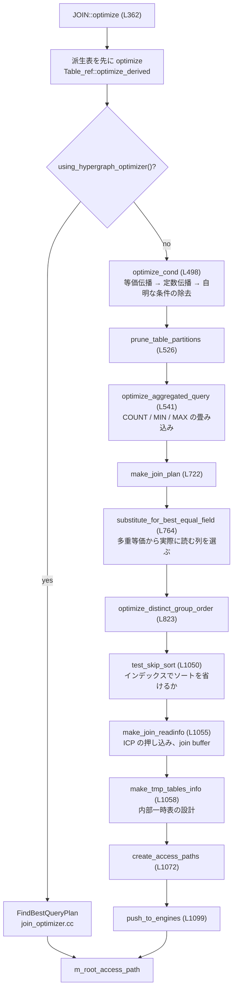

> **前提**: [パーサとリゾルバ](./parser-walkthrough/) / [名前解決と Item ツリー](./name-resolution-and-items/)

## この層の責務

入力は解決済みの `Query_block`、出力は `AccessPath` の木だ。それだけである。

[SELECT の一生](./life-of-a-select/)で見たとおり、経路は `Sql_cmd_dml::execute_inner` → `Query_expression::optimize` → `JOIN::optimize` と降りる。この層が終わった時点で、どのテーブルをどの順で、どのインデックスで、どう繋ぐかは全部決まっている。実行は決まったことをなぞるだけだ ([AccessPath のページ](./access-path-tree/))。

[`sql/sql_optimizer.cc#L362`](https://github.com/mysql/mysql-server/blob/mysql-8.4.11/sql/sql_optimizer.cc#L362) の `JOIN::optimize` は 800 行を超える 1 本の関数で、その大半が**段を順に呼ぶだけ**の記述になっている。段の中身は別関数や別ファイルにあり、この章の残りの 9 ページはその中身を 1 段ずつ開けていく。

だからこのページの主題は段そのものではなく、**段の順番**だ。順番が固定されているせいで、次のようなことが起きる。

- パーティション pruning は WHERE の等価伝播の**後**に走る。だから `WHERE a = b AND b = 20240101` でも pruning が効く
- 統計を見るのは join 順序を決める**前**の 1 回だけ。join 順序が決まってから「このテーブルは実は 10 行しかない」と分かっても、順序は決め直さない
- ソート回避の判定は join 順序が決まった**後**。だから「ORDER BY のためにこのテーブルを先頭に置く」という判断はほとんどできない
- `optimizer_switch` を見る箇所は段ごとにばらばらで、1 箇所に集まっていない



`make_join_plan` の中がさらに 5 段に割れていて、そこが実質の本体である。

## 主要な型とその関係

段をまたいで持ち回られる状態は `JOIN` オブジェクトに全部ぶら下がっている。段の順番が意味を持つのは、この共有状態を段が順に書き換えていくからだ。

| 型                                       | どこ                               | 何を持つか                                                                                                               |
| ---------------------------------------- | ---------------------------------- | ------------------------------------------------------------------------------------------------------------------------ |
| `JOIN`                                   | `sql/sql_optimizer.h`              | 1 つの `Query_block` の最適化状態のすべて。`where_cond`、`best_ref`、`positions`、`best_positions`、`m_root_access_path` |
| `JOIN_TAB`                               | `sql/sql_opt_exec_shared.h`        | 最適化中の 1 テーブル。`type()` (EXPLAIN の `type` 列)、`keyuse()`、`range_scan()`、`records()`                          |
| `POSITION`                               | 同上                               | join 順序探索の 1 手。「このテーブルをこのアクセス方法でここに置いたときの累積コストと行数」                             |
| `Key_use`                                | 同上                               | 「この列 = この式」から作られる ref アクセスの候補。1 テーブルに複数                                                     |
| `Optimize_table_order`                   | `sql/sql_planner.cc`               | join 順序探索の本体。`search_depth` と `prune_level` をコンストラクタで固定する                                          |
| `Cost_model_server` / `Cost_model_table` | `sql/opt_costmodel.h`              | コスト定数への窓口 ([統計とコストモデル](./statistics-and-cost-model/))                                                  |
| `AccessPath`                             | `sql/join_optimizer/access_path.h` | 出力。旧オプティマイザと hypergraph の合流点                                                                             |
| `QEP_TAB`                                | `sql/sql_opt_exec_shared.h`        | 実行向けに整理し直した 1 テーブル。`make_join_readinfo` 以降                                                             |

`JOIN_TAB` の配列が 3 本あるのが読みにくいところだ。`join_tab` が生成順、`best_ref` が「現在の最良順序」、`map2table` が table number からの逆引きになっている。join 順序探索は `best_ref` の並べ替えとして表現される。`ASSERT_BEST_REF_IN_JOIN_ORDER` というマクロが段のあちこちに置いてあり、`best_ref` が正しい順に並んでいることを debug ビルドで確かめている。

`Optimize_table_order` の 2 つのパラメータは、コンストラクタで一度だけ決まる ([`sql/sql_planner.cc#L126`](https://github.com/mysql/mysql-server/blob/mysql-8.4.11/sql/sql_planner.cc#L126))。

```cpp title="sql/sql_planner.cc"
Optimize_table_order::Optimize_table_order(THD *thd_arg, JOIN *join_arg,
                                           Table_ref *sjm_nest_arg)
    : thd(thd_arg),
      join(join_arg),
      search_depth(determine_search_depth(thd->variables.optimizer_search_depth,
                                          join->tables - join->const_tables)),
      prune_level(thd->variables.optimizer_prune_level),
```

つまり `optimizer_search_depth` を途中で変えても、その文の探索には効かない。詳細は [join 順序のページ](./join-order-search/)。

## 処理の流れ

### 0. 派生表を先に最適化する

本体の前に、`leaf_tables` を舐めて `is_view_or_derived()` なものを [`Table_ref::optimize_derived` (`sql/sql_derived.cc#L1660`)](https://github.com/mysql/mysql-server/blob/mysql-8.4.11/sql/sql_derived.cc#L1660) で先に最適化する。マージされた派生表はここに来ない — マージは解決フェーズで済んでいる ([サブクエリのページ](./subquery-transformations/))。

**マテリアライズされる派生表が const なら、この時点で実際に materialize される。** 最適化中にテーブルが作られて中身が詰まる、という段があるのはここと後述の const table 読み込みの 2 箇所だ。

### 1. `optimize_cond` — WHERE を書き換える

[L498](https://github.com/mysql/mysql-server/blob/mysql-8.4.11/sql/sql_optimizer.cc#L498) から呼ばれる [`optimize_cond` (L10509)](https://github.com/mysql/mysql-server/blob/mysql-8.4.11/sql/sql_optimizer.cc#L10509) は、optimizer trace にそのまま出てくる 3 段になっている。

```cpp title="sql/sql_optimizer.cc"
    step_wrapper.add_alnum("transformation", "equality_propagation");
    ...
      if (build_equal_items(thd, *cond, cond, nullptr, true, join_list,
                            cond_equal))
    ...
    step_wrapper.add_alnum("transformation", "constant_propagation");
    ...
      if (propagate_cond_constants(thd, nullptr, *cond, *cond)) return true;
    ...
    step_wrapper.add_alnum("transformation", "trivial_condition_removal");
    ...
      if (remove_eq_conds(thd, *cond, cond, cond_value)) return true;
```

1 段目の `build_equal_items` が `t1.a = t2.b AND t2.b = t3.c` を `Item_equal(t1.a, t2.b, t3.c)` という 1 個の多重等価にまとめる。**この 1 段が、後続のほぼ全部の前提になる。** ref アクセスの候補 (`Key_use`) は多重等価から作られるし、定数伝播もパーティション pruning もここで作った等価クラスを使う。

`cond_value` が `COND_FALSE` になったら `zero_result_cause = "Impossible WHERE"` を立てて即座に脱出する。この脱出は関数内に 8 箇所ある `goto setup_subq_exit` の 1 つで、いずれも「行が 0 件と分かった」か「テーブルを読まずに答えが出た」ケースだ。

### 2. パーティション pruning

[L526](https://github.com/mysql/mysql-server/blob/mysql-8.4.11/sql/sql_optimizer.cc#L526) の `prune_table_partitions()`。**等価伝播の後に置かれている**のが要点で、`WHERE a = b AND b = '2024-01-01'` の `a` にも定数が届いた状態で pruning できる ([パーティショニングのページ](./partitioning/))。

なお、この時点でテーブルはすでにロック済みである。`Sql_cmd_dml::execute` が `lock_tables` を prepare と optimize の間に置いているためだ。パーティション pruning がロック範囲を絞れるのは、`lock_tables` が**パーティション単位のロックを遅延**しているからで、テーブル自体の MDL はすでに取られている。

### 3. 集約の畳み込み

[L541](https://github.com/mysql/mysql-server/blob/mysql-8.4.11/sql/sql_optimizer.cc#L541) から [`optimize_aggregated_query` (`sql/opt_sum.cc#L277`)](https://github.com/mysql/mysql-server/blob/mysql-8.4.11/sql/opt_sum.cc#L277)。GROUP BY のない集約だけが対象で、4 通りの結果を返す。

| 戻り値          | 意味                                       | その後                                                                             |
| --------------- | ------------------------------------------ | ---------------------------------------------------------------------------------- |
| `AGGR_COMPLETE` | 全部の式の値が確定した                     | `zero_result_cause = "Select tables optimized away"`、`FakeSingleRow` を返して終了 |
| `AGGR_DELAYED`  | COUNT だけ実行時に `ha_records()` で数える | 通常の最適化を続け、`select_count = true`                                          |
| `AGGR_EMPTY`    | 元表が空だと分かった                       | 0 行の AccessPath                                                                  |
| `AGGR_REGULAR`  | 畳み込めない                               | 通常の最適化を続ける                                                               |

`SELECT MAX(id) FROM t` が `Select tables optimized away` になるのはここだ。**インデックスの端を 1 回読む処理が最適化フェーズの中で走っている。**

### 4. `make_join_plan` — 実質の本体

[L722](https://github.com/mysql/mysql-server/blob/mysql-8.4.11/sql/sql_optimizer.cc#L722) から [L5359](https://github.com/mysql/mysql-server/blob/mysql-8.4.11/sql/sql_optimizer.cc#L5359)。この中でさらに順番がある。

1. **`update_ref_and_keys`** — WHERE と join 条件から `Key_use` の配列を作る。「`t.col = 式` の形になっている述語」を全部拾い、どのインデックスのどのキーパートに当たるかを記録する
2. **`pull_out_semijoin_tables`** — 依存関係だけで semijoin nest から出せるテーブルを外に出す ([サブクエリのページ](./subquery-transformations/))
3. **`extract_const_tables` (L5684) / `extract_func_dependent_tables`** — 0 行または 1 行と分かるテーブルを const にする。**const table はここで実際に読まれ、列の値が定数として WHERE に埋め込まれる**
4. **`estimate_rowcount` (L5989)** — テーブルごとの行数見積り。この中で range 分析 (`test_quick_select`) が走る
5. **`optimize_keyuse` (L10985)** — `Key_use` に `ref_table_rows` を埋める。探索ループを速くするための前計算
6. **`Optimize_table_order::choose_table_order`** — join 順序の探索 ([join 順序のページ](./join-order-search/))
7. **`decide_subquery_strategy`** — IN→EXISTS かマテリアライズかの決定 ([サブクエリのページ](./subquery-transformations/))
8. **`get_best_combination`** — `best_positions` から `JOIN_TAB` の並びを作り、`tab->set_type()` で EXPLAIN の `type` を確定させる

4 の `estimate_rowcount` の中身が重要だ。

```cpp title="sql/sql_optimizer.cc (L6051 付近)"
    if (!tab->const_keys.is_clear_all() ||
        !tab->skip_scan_keys.is_clear_all()) {
      /*
        This call fills tab->range_scan() with the best range access method
        possible for this table, and only if it's better than table scan.
        It also fills tab->needed_reg.
      */
      const ha_rows records =
          get_quick_record_count(thd, tab, row_limit, condition);
```

**range 分析はここで 1 回、テーブルごとに独立に走る。** join 順序が決まる前なので、「他のテーブルの列に依存する条件」は使えない。使えなかったインデックスは `needed_reg` に記録され、順序が決まってから `make_join_query_block` が必要に応じて `test_quick_select` をやり直す ([range 分析のページ](./range-optimizer/))。

### 5. `substitute_for_best_equal_field`

[L764](https://github.com/mysql/mysql-server/blob/mysql-8.4.11/sql/sql_optimizer.cc#L764)。多重等価 `Item_equal(t1.a, t2.b, t3.c)` を、確定した join 順序に照らして具体的な比較に展開する。「先に読まれるテーブルの列」を左辺に選ぶので、**join 順序が決まらないとこの段は実行できない**。段 1 で作った等価クラスがここで回収される。

### 6. ソートと一時表

`optimize_distinct_group_order` (L823) が DISTINCT や GROUP BY を消せるかを見て、`test_skip_sort` (L1050) がインデックスでソートを省けるかを見る ([ORDER BY のページ](./sort-avoidance-and-ordering/))。その結果を受けて `need_tmp_before_win` が決まり、`make_tmp_tables_info` (L1058) が内部一時表の枚数と定義を決める ([内部一時表のページ](./materialization-and-temptable/))。

その間の `make_join_readinfo` (L1055) が ICP の押し込みと join buffer の設定をやる ([アクセスパス選択のページ](./access-path-selection/))。

### 7. `create_access_paths` と `push_to_engines`

[L1072](https://github.com/mysql/mysql-server/blob/mysql-8.4.11/sql/sql_optimizer.cc#L1072) で [`JOIN::create_access_paths` (`sql/sql_executor.cc#L3043`)](https://github.com/mysql/mysql-server/blob/mysql-8.4.11/sql/sql_executor.cc#L3043) を呼び、`QEP_TAB` の配列から `AccessPath` の木を組む。

最後に [`push_to_engines` (L1178)](https://github.com/mysql/mysql-server/blob/mysql-8.4.11/sql/sql_optimizer.cc#L1178)。

```cpp title="sql/sql_optimizer.cc"
bool JOIN::push_to_engines() {
  DBUG_TRACE;
  assert(m_root_access_path != nullptr);

  for (Table_ref *tl = query_block->leaf_tables; tl; tl = tl->next_leaf) {
    const handlerton *hton = tl->table->file->hton_supporting_engine_pushdown();
```

コメントが順序の制約を明記している — **AccessPath を作った後、iterator を作る前でなければならない**。押し込みは AccessPath 自体を書き換える (FILTER を消す、JOIN アルゴリズムを変える) ので、iterator を先に作ってしまうと辻褄が合わなくなる。

## 守られている不変条件

**同じ `JOIN` を 2 回最適化しない。**

```cpp title="sql/sql_optimizer.cc (L374)"
  // to prevent double initialization on EXPLAIN
  if (optimized) return false;
```

EXPLAIN は `unit->optimize()` を通ってから実行の直前で分岐するが、`EXPLAIN` 中に同じ `JOIN` が再び最適化されうる経路があり、そこを塞いでいる。

**`setup_subq_exit` に飛ぶときは `m_root_access_path` が必ず埋まっている。**

```cpp title="sql/sql_optimizer.cc (L1109)"
setup_subq_exit:

  assert(zero_result_cause != nullptr);
  assert(m_root_access_path != nullptr);
```

8 つの早期脱出のどれを通っても、根の AccessPath は存在する。「0 行を返すプラン」も立派なプランとして表現される (`create_access_paths_for_zero_rows()`)。エグゼキュータ側に「プランが無い」というケースを作らないための設計だ。

**hypergraph 経路に入ったら旧経路のコードは一切通らない。** 分岐の直後にコメントと assert がある。

```cpp title="sql/sql_optimizer.cc (L711)"
  // ----------------------------------------------------------------------------
  //       All of this is never called for the hypergraph join optimizer!
  // ----------------------------------------------------------------------------

  assert(!thd->lex->using_hypergraph_optimizer());
```

2 つのオプティマイザは `JOIN::optimize` の中で完全に分かれ、`AccessPath` の木という出力だけを共有する ([hypergraph のページ](./hypergraph-optimizer/))。

**`no_changes` を渡した `test_if_skip_sort_order` はプランを変えない。** debug ビルドでは `Plan_change_watchdog` ([L2142](https://github.com/mysql/mysql-server/blob/mysql-8.4.11/sql/sql_optimizer.cc#L2142)) が `type` / `range_scan` / `ref().key` / `index` を関数の入口でコピーし、デストラクタで全部一致することを assert する。「見積りのためだけに呼ぶ」呼び出しと「実際に変える」呼び出しが同じ関数なので、こういう見張りが要る。

**`best_ref` は常に join 順序に並んでいる。** `ASSERT_BEST_REF_IN_JOIN_ORDER` が段の入口ごとに置かれている。

## つまずきどころ

### 最適化フェーズでディスクを読んでいる

「オプティマイザは統計だけ見る」というのは正しくない。この層は少なくとも 3 箇所で実際に I/O を起こす。

- **const table の読み込み** (`extract_const_tables`)。主キー完全一致で 1 行に決まるテーブルは、最適化中に読まれて値が定数化される
- **range 分析の index dive** (`test_quick_select` → `records_in_range` → `btr_estimate_n_rows_in_range`)。B+tree を実際に潜って区間の行数を数える ([統計とコストモデル](./statistics-and-cost-model/))
- **MIN/MAX の畳み込み** (`optimize_aggregated_query`)。インデックスの端を読む

だから **EXPLAIN が遅いことがある**。等価な範囲が大量にある `IN (...)` では index dive の回数が増えるので、`eq_range_index_dive_limit` (既定 200) を超えたところで統計に切り替わる。

### 統計を見るのは 1 回だけで、join 順序の後には戻らない

`estimate_rowcount` は `choose_table_order` の前に 1 回走る。順序が決まった後で「このテーブルは先行テーブルの列で絞れる」と分かっても、行数見積りはやり直されない — やり直されるのは `needed_reg` に記録された range 分析だけだ。多段 join で `rows` が実際と桁違いになるとき、この一方通行が原因のことがある。

### `JOIN::exec` は存在しない

8.0 系の途中まで、`JOIN::optimize` の対になる関数として `JOIN::exec` があった。8.4 には無い。最適化の出力は `AccessPath` で、実行は [`Query_expression::ExecuteIteratorQuery` (`sql/sql_union.cc#L1688`)](https://github.com/mysql/mysql-server/blob/mysql-8.4.11/sql/sql_union.cc#L1688) の `Read()` ループだ ([エグゼキュータのページ](./executor-walkthrough/))。ソースのコメントには `JOIN::exec` への言及がまだ残っているので、grep すると紛らわしい。

### `optimizer_switch` は 1 箇所で読まれていない

段ごとに `thd->optimizer_switch_flag(...)` が散らばっている。`index_merge` 系は `test_quick_select` の中、`condition_fanout_filter` は `calculate_scan_cost` と `choose_table_order` の中、`prefer_ordering_index` は `test_if_skip_sort_order` の中、といった具合だ。しかもヒントが同じ場所で `hint_table_state()` として重なる ([ヒントと optimizer_switch](./optimizer-hints-and-switches/))。「このスイッチはどこで効くのか」は grep するしかない。

### EXPLAIN もここを全部通る

`EXPLAIN SELECT ...` は `unit->optimize(..., create_iterators=true, ...)` を通り、AccessPath を作り、iterator まで作ってから実行の直前で分岐する。だから EXPLAIN には MDL 取得も const table 読み込みも index dive も伴う。**EXPLAIN が MDL 待ちで止まる**のはこのためだ ([MDL のページ](./metadata-locking/))。
