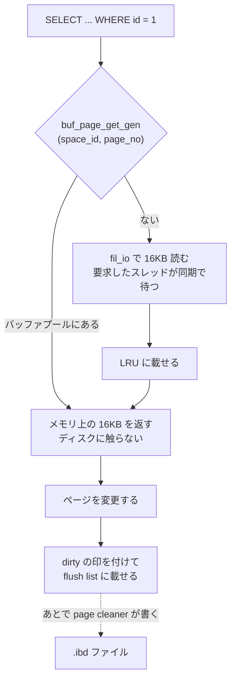

## 何を学んだか

ストレージは任意のバイト位置を任意の長さで読ませてくれない。ブロックデバイスの最小単位は 512 バイトか 4KB で、その途中の 3 バイトだけを書き換えることはできない。読んで、変えて、丸ごと書き戻すしかない。

データベースはこの制約の上に、自分の固定長単位を 1 つ置く。それが**ページ**だ。InnoDB のページは既定で 16KB ある。

```
論理                              物理
+-------------------------+
| 行 (可変長)              |
+-------------------------+
        ↓ 何十件かまとめて
+-------------------------+
| ページ 16384 バイト      |  ← InnoDB が扱う最小単位。読みも書きもこの単位
+-------------------------+
        ↓ 64 枚まとめて
+-------------------------+
| エクステント 1MB         |  ← ファイル上の連続確保の単位
+-------------------------+
        ↓
+-------------------------+
| .ibd ファイル            |
+-------------------------+
        ↓ 4 枚ずつ
+-------------------------+
| デバイスのブロック 4KB   |
+-------------------------+
```

ここから 4 つのことが決まる。

1. **「1 行だけ読む」という操作は存在しない。** `WHERE id = 1` で 1 行返るクエリも、その行が載っているページ 1 枚をまるごとメモリに載せる。100 バイトの行を取るために 16KB を読む
2. **一度載せたページは捨てない。** 次のクエリが同じページの別の行を欲しがる確率は高い。この「載せたまま置いておく場所」がバッファプールだ
3. **書き込みも同じ単位になる。** 1 バイト更新しても書くのは 16KB。だから InnoDB は変更したページをすぐ書かず、メモリ上で dirty の印を付けて溜める
4. **性能の話がほぼ全部「何ページ触ったか」に還元される。** 行数ではない。同じ 1000 行でも、1000 枚のページに散っているのと 10 枚に固まっているのでは 100 倍違う



**読みは同期、書きは非同期**という非対称が、この構造の芯にある。読む側は待つしかないが、書く側は「いつか書けばよい」ことにできる。いつか書けばよくするための仕掛けが [WAL](./wal-and-recovery-basics/) だ。

## ソースコードのどこか

### ページサイズは 1 つの定数から派生する

[`storage/innobase/include/univ.i#L310`](https://github.com/mysql/mysql-server/blob/mysql-8.4.11/storage/innobase/include/univ.i#L310)。

```cpp title="storage/innobase/include/univ.i"
/* Define the Min, Max, Default page sizes. */
/** Minimum Page Size Shift (power of 2) */
constexpr uint32_t UNIV_PAGE_SIZE_SHIFT_MIN = 12;
/** Maximum Page Size Shift (power of 2) */
constexpr uint32_t UNIV_PAGE_SIZE_SHIFT_MAX = 16;
/** Default Page Size Shift (power of 2) */
constexpr uint32_t UNIV_PAGE_SIZE_SHIFT_DEF = 14;
...
/** Minimum page size InnoDB currently supports. */
constexpr uint32_t UNIV_PAGE_SIZE_MIN = 1 << UNIV_PAGE_SIZE_SHIFT_MIN;
/** Maximum page size InnoDB currently supports. */
constexpr size_t UNIV_PAGE_SIZE_MAX = 1 << UNIV_PAGE_SIZE_SHIFT_MAX;
/** Default page size for InnoDB tablespaces. */
constexpr uint32_t UNIV_PAGE_SIZE_DEF = 1 << UNIV_PAGE_SIZE_SHIFT_DEF;
```

`1 << 14` = **16384**。範囲は 4KB (`1 << 12`) から 64KB (`1 << 16`) で、いずれも 2 の冪だ。

そして「現在のページサイズ」はコンパイル時定数ではない。

```cpp title="storage/innobase/include/univ.i"
/** The 2-logarithm of UNIV_PAGE_SIZE: */
#define UNIV_PAGE_SIZE_SHIFT srv_page_size_shift

/** The universal page size of the database */
#define UNIV_PAGE_SIZE ((ulint)srv_page_size)
```

[L290-294](https://github.com/mysql/mysql-server/blob/mysql-8.4.11/storage/innobase/include/univ.i#L290)。**`UNIV_PAGE_SIZE` はグローバル変数へのマクロ**で、起動時に `innodb_page_size` の値が入る。だからこの章に出てくる 16252 や 8126 といった数字は、すべて「16KB のとき」の値だ。

システム変数の宣言はこうなっている。

```cpp title="storage/innobase/handler/ha_innodb.cc"
static MYSQL_SYSVAR_ULONG(page_size, srv_page_size,
                          PLUGIN_VAR_OPCMDARG | PLUGIN_VAR_READONLY |
                              PLUGIN_VAR_NOPERSIST,
                          "Page size to use for all InnoDB tablespaces.",
                          nullptr, nullptr, UNIV_PAGE_SIZE_DEF,
                          UNIV_PAGE_SIZE_MIN, UNIV_PAGE_SIZE_MAX, 0);
```

[`ha_innodb.cc#L22815`](https://github.com/mysql/mysql-server/blob/mysql-8.4.11/storage/innobase/handler/ha_innodb.cc#L22815)。`PLUGIN_VAR_READONLY` なので**起動後は変えられない**。しかもヘルプ文が言うとおり「all InnoDB tablespaces」に効くので、既存のデータディレクトリに対して値を変えると起動しない。

### ページに触る道は 1 本

```cpp title="storage/innobase/include/buf0buf.h"
buf_block_t *buf_page_get_gen(const page_id_t &page_id,
                              const page_size_t &page_size, ulint rw_latch,
                              buf_block_t *guess, Page_fetch mode,
                              ut::Location location, mtr_t *mtr,
                              bool dirty_with_no_latch = false);
```

[`buf0buf.h#L444`](https://github.com/mysql/mysql-server/blob/mysql-8.4.11/storage/innobase/include/buf0buf.h#L444)。**`(space_id, page_no)` を渡すとメモリ上の 16KB が返る**、というのが InnoDB のストレージ抽象のすべてだ。B+tree の探索も undo の読み書きもこの関数を通る。中で何が起きるかは[バッファプールの walkthrough](./buffer-pool-walkthrough/) にある。

### dirty かどうかは LSN 1 つで表す

```cpp title="storage/innobase/include/buf0buf.h"
  lsn_t get_oldest_lsn() const noexcept { return oldest_modification; }
...
  bool is_dirty() const noexcept { return get_oldest_lsn() > 0; }
```

[`buf0buf.h#L1364`](https://github.com/mysql/mysql-server/blob/mysql-8.4.11/storage/innobase/include/buf0buf.h#L1364)。「変更されたか」ではなく「**いつ**変更されたか」を持っている。この LSN が[チェックポイント](./checkpoint/)の計算にそのまま使われる。

## なぜそうなっているか

### なぜ固定長なのか

ページ番号 `N` のページはファイルの `N × page_size` バイト目にある。この掛け算 1 回で位置が決まるのが固定長の価値だ。可変長にすると「ページ番号 → ファイルオフセット」の索引がもう 1 段必要になり、その索引自体をどこに置くかという問題が生まれる。

固定長であることは他のところにも波及する。バッファプールは chunk からページサイズで切り出した配列を管理できるし、ページ 1 枚が必ず 1 回の I/O に収まる。**「ページ 1 枚」がメモリ管理・I/O・latch・リカバリのすべてに共通する単位になる**のは、長さが揃っているからだ。

### なぜ 16KB なのか

大きくすると得られるもの:

- B+tree の 1 ページあたりの分岐数 (fan-out) が増え、木が浅くなる ([B+tree のページ](./btree-basics/))
- 順次読みのシステムコール回数が減る
- ページヘッダ 38 バイトとトレイラ 8 バイトのオーバーヘッド率が下がる

小さくすると得られるもの:

- 1 行更新のために読み書きするバイト数が減る
- ページ latch と `lock_t` のビットマップの単位が細かくなり、同じページへの競合が減る ([ロックのページ](./lock-modes-and-types/))
- バッファプールに載るページ枚数が増え、ランダムアクセス主体のワークロードで無駄が減る

16KB は「回転ディスクのシーク時間が支配的だった時代に、1 回の I/O でなるべく多く取る」ことに寄せた値で、`UNIV_PAGE_SIZE_SHIFT_ORIG` という定数名 (「既定が変わった場合に備えた元の値」) が残っているとおり、当時から動かす余地は想定されていた。それでも既定は 20 年動いていない。

### なぜ OS のページキャッシュに任せないのか

`read(2)` すれば OS がキャッシュしてくれる。それでもデータベースが自前のキャッシュを持つのは、OS が知らないことを知っているからだ。

- **どのページをまだ書いてはいけないか。** WAL の規則は「そのページの変更を記録した redo が `fsync` されるまでページを書かない」だが、OS のページキャッシュに書き込んだ時点で、いつディスクへ落ちるかは OS が決めてしまう
- **どのページが重要か。** 全表スキャンで通り過ぎるだけのページと、B+tree の root ページは価値が違う。OS からはどちらも「最近読まれたページ」に見える ([LRU と midpoint 挿入](./lru-and-midpoint/))
- **二重にキャッシュしたくない。** 同じ 16KB を OS とバッファプールの両方に置くとメモリが半分無駄になる

だから InnoDB は `O_DIRECT` で OS のキャッシュを迂回する道を持っている。8.4 では `innodb_flush_method` を明示しなければ起動時に一時ファイルで `O_DIRECT` が使えるかを試し、使えれば採用する。**8.0 の記事にある「既定は fsync (バッファード I/O)」は 8.4 では当てはまらない** ([読み込みと I/O](./read-ahead-and-io/))。

## どう活かすか

### 「1 行しか返らないのに遅い」を読み替える

返る行数は指標にならない。見るべきは触ったページ数だ。`SELECT ... WHERE non_indexed = 1` は 1 行返しても全ページを読む。同じ 1 行でも、`EXPLAIN` の `rows` が 100 万なら 100 万件ぶんのページを踏んでいる。

`performance_schema.table_io_waits_summary_by_table` の `COUNT_READ` と、`SHOW GLOBAL STATUS` の `Innodb_buffer_pool_read_requests` (バッファプールへの要求) / `Innodb_buffer_pool_reads` (ディスクまで行った回数) を並べると、「ページを何枚触ったか」と「うち何枚が実 I/O だったか」が分かる。後者が伸びていないなら、遅さの原因はディスクではない。

### 行を小さくすることは 1 ページあたりの行数を増やすこと

1 行 200 バイトなら 1 ページに 80 行、400 バイトなら 40 行入る。同じ範囲スキャンで読むページ数がちょうど 2 倍になる。**列を削る・`NOT NULL` にする・`VARCHAR` の宣言長を詰めるといった話が効くのは、最終的にここに効くから**だ ([レコードの構造](./record-format/))。

### `innodb_page_size` は事実上変えられない

`PLUGIN_VAR_READONLY` なので実行中には変えられないし、既存のデータディレクトリに対して別の値で起動することもできない。変えるなら初期化からやり直して論理バックアップで移すことになる。

しかも `Row size too large (> 8126)` や `Specified key was too long; max key length is 767 bytes` といった上限がページサイズから派生するので、値を変えると通っていた `CREATE TABLE` が通らなくなることがある ([ページの構造](./page-layout/)、[レコードの構造](./record-format/))。触る前提の値ではない。

### この続き

- ページの中身が実際にどう並んでいるかは[ページの構造](./page-layout/)
- バッファプールが `(space_id, page_no)` をメモリに変換する経路は[バッファプール — buf_page_get_gen が全読み書きの入口](./buffer-pool-walkthrough/)
- 全表スキャンでキャッシュが壊れないようにする仕掛けは[LRU と midpoint 挿入](./lru-and-midpoint/)
- dirty page がいつ書かれるかは[flush list と page cleaner](./flush-list-and-page-cleaner/)
- ページをファイル上にどう並べるかは[物理構造 — テーブルスペース → エクステント → ページ → レコード](./innodb-physical-walkthrough/)
