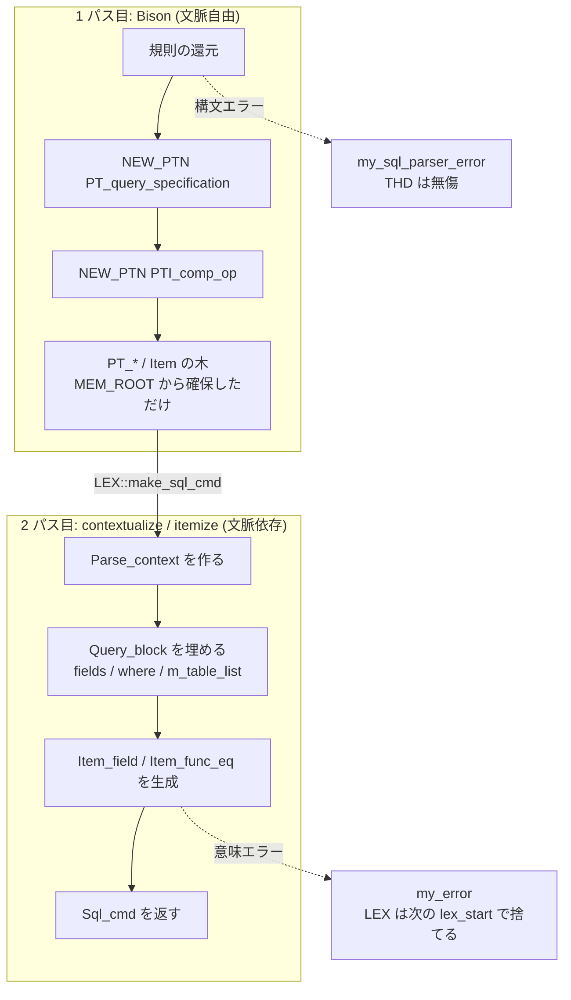

> **前提**: [パーサとリゾルバ](./parser-walkthrough/)

## 何を学んだか

Bison の意味アクションは、ふつう「文法規則が還元された瞬間に意味的な処理をする場所」だ。MySQL も 8.0 より前はそう書かれていて、`SELECT ... FROM t WHERE ...` を還元しながら `THD` の `LEX` を直接書き換えていた。

8.4 の中核 DML はそうなっていない。アクションがするのは `PT_*` ノードを 1 個作ることだけで、**文脈に依存する処理は全部 2 パス目に追い出されている**。

```cpp title="sql/sql_yacc.yy (bool_pri)"
        | bool_pri comp_op predicate
          {
            $$= NEW_PTN PTI_comp_op(@$, $1, $2, $3);
          }
```

`a = 1` を還元しても `Item_func_eq` はまだできない。`PTI_comp_op` という「左辺・演算子・右辺を覚えているだけの箱」ができるだけだ。実際の `Item` になるのは 2 パス目である。

```cpp title="sql/parse_tree_items.cc"
bool PTI_comp_op::do_itemize(Parse_context *pc, Item **res) {
  if (super::do_itemize(pc, res) || left->itemize(pc, &left) ||
      right->itemize(pc, &right))
    return true;

  *res = (*boolfunc2creator)(false)->create(left, right);
  return *res == nullptr;
}
```

2 パスに分けたことで、次の 3 つが同時に手に入る。

1. **構文エラーがセッション状態を変えない。** 1 パス目は `MEM_ROOT` からノードを取るだけなので、途中で止まっても捨てるものがない
2. **文脈に依存する判断を、必要な文脈が揃ってから 1 箇所で書ける。** 「この識別子は `HAVING` の中にいるか」「この `SELECT` は何番目の集合演算項か」は、還元の瞬間には分からないことがある
3. **1 パス目の出力がそのまま印字できる。** これが `SHOW PARSE_TREE` になっている



## なぜそうなっているか

### 「文脈自由」を守ると、失敗が安くなる

1 パス目が確保するのは `THD::mem_root` 上のノードだけで、ここには文が終われば丸ごと解放されるアリーナが使われる。構文エラーで途中終了しても、個別に巻き戻す対象がない。

`THD::cleanup_after_parse_error` に残された例外が、この方針の輪郭を逆から示している。

```cpp title="sql/sql_class.cc"
/**
  Restore session state in case of parse error.

  This is a clean up function that is invoked after the Bison generated
  parser before returning an error from THD::sql_parser(). If your
  semantic actions manipulate with the session state (which
  is a very bad practice and should not normally be employed) and
  need a clean-up in case of error, and you can not use %destructor
  rule in the grammar file itself, this function should be used
  to implement the clean up.
*/
void THD::cleanup_after_parse_error() {
  sp_head *sp = lex->sphead;

  if (sp) {
    sp->m_parser_data.finish_parsing_sp_body(this);
    ...
```

[`sql/sql_class.cc#L3187`](https://github.com/mysql/mysql-server/blob/mysql-8.4.11/sql/sql_class.cc#L3187)。「意味アクションがセッション状態をいじるのは非常に悪い作法で、通常やるべきではない」と明言したうえで、**それでも残っている 1 つ (ストアドプログラム本文の `sp_head`) だけ**を片付けている。関数の本体が 8 行しかないことが、方針が実際に効いていることの証拠になる。

### 文法から文脈を追い出すと、規則が減る

`PTI_simple_ident_ident` の例が分かりやすい。`HAVING` の中の識別子と `WHERE` の中の識別子を文法で区別しようとすると、`expr` の規則一式を `having_expr` として複製することになる。18000 行の文法ファイルがさらに倍になる。

同じ理由が `INTO` 句の扱いにもコメントとして残っている。

```cpp title="sql/sql_yacc.yy (select_stmt の前のコメント)"
  While it's possible to write an unambiguous grammar, it would force us to
  duplicate the entire <select statement> syntax all the way down to the <into
  clause>. So instead we solve it by writing an ambiguous grammar and use
  precedence rules to sort out the shift/reduce conflict.
```

MySQL は「あいまいな文法 + 後段での判断」を選び続けている。`%expect 59` という宣言が、59 個の shift/reduce 衝突を承知の上で受け入れていることを示している。

### 2 パス目でも `Query_block` は「作られる」のではなく「埋められる」

`lex_start` の時点で空の `Query_block` が 1 つできている ([パーサ walkthrough](./parser-walkthrough/))。2 パス目はその中身を埋めていく。サブクエリのぶんだけが追加で作られ、その呼び出しは文法ではなく contextualize 側にある。

```console
$ git grep -n 'lex->new_query(' mysql-8.4.11 -- sql/
sql/parse_tree_nodes.cc:4437:  Query_block *child = lex->new_query(pc->select);
```

ツリー全体で 1 箇所、しかも `parse_tree_nodes.cc` の中。**文法ファイルから `Query_block` を作る経路はもう残っていない**。

## ソースコードのどこか

### 2 パス目の入口 — `LEX::make_sql_cmd`

Bison が返す値は木の根 1 個 (`Parse_tree_root **`) で、そのあと明示的に 2 パス目が呼ばれる。

```cpp title="sql/sql_class.cc"
  Parse_tree_root *root = nullptr;
  if (my_sql_parser_parse(this, &root) || is_error()) {
    ...
    cleanup_after_parse_error();
    return true;
  }
  if (root != nullptr && lex->make_sql_cmd(root)) {
    return true;
  }
```

[`sql/sql_class.cc#L3101`](https://github.com/mysql/mysql-server/blob/mysql-8.4.11/sql/sql_class.cc#L3101)。`make_sql_cmd` の本体は 4 行しかない ([`sql_lex.cc#L5124`](https://github.com/mysql/mysql-server/blob/mysql-8.4.11/sql/sql_lex.cc#L5124))。

```cpp title="sql/sql_lex.cc"
bool LEX::make_sql_cmd(Parse_tree_root *parse_tree) {
  if (!will_contextualize) return false;

  m_sql_cmd = parse_tree->make_cmd(thd);
  if (m_sql_cmd == nullptr) return true;

  assert(m_sql_cmd->sql_command_code() == sql_command);

  return false;
}
```

`will_contextualize` というフラグがあることに注目したい。**2 パス目は飛ばせる**。コメントはこう説明している。

```cpp title="sql/sql_lex.h"
  /**
    Used to inform the parser whether it should contextualize the parse
    tree. When we get a pure parser this will not be needed.
  */
  bool will_contextualize;
```

「純粋なパーサになったらこのフラグは要らなくなる」。つまり 2 パス化は今も途中で、`LEX` を直接触るアクションが残っている限りこのスイッチが要る、という自己申告になっている。

### 木の頂点 — `Parse_tree_root::make_cmd`

`SELECT` の 2 パス目は [`PT_select_stmt::make_cmd` (`parse_tree_nodes.cc#L765`)](https://github.com/mysql/mysql-server/blob/mysql-8.4.11/sql/parse_tree_nodes.cc#L765)。

```cpp title="sql/parse_tree_nodes.cc"
Sql_cmd *PT_select_stmt::make_cmd(THD *thd) {
  Parse_context pc(thd, thd->lex->current_query_block());

  thd->lex->sql_command = m_sql_command;

  if (m_qe->contextualize(&pc)) {
    return nullptr;
  }
  ...
  if (pc.finalize_query_expression()) return nullptr;

  // Ensure that first query block is the current one
  assert(pc.select->select_number == 1);
  ...
  if (thd->lex->sql_command == SQLCOM_SELECT)
    return new (thd->mem_root) Sql_cmd_select(thd->lex->result);
  else  // (thd->lex->sql_command == SQLCOM_DO)
    return new (thd->mem_root) Sql_cmd_do(nullptr);
}
```

`Parse_context` を 1 個作って木に流す。これが「文脈」の実体で、中身は `thd`、`mem_root`、**今どの `Query_block` を埋めているか**、そして集合演算の入れ子を追うスタックだ ([`parse_tree_node_base.h#L420`](https://github.com/mysql/mysql-server/blob/mysql-8.4.11/sql/parse_tree_node_base.h#L420))。

### `contextualize` は `final`、オーバーライドするのは `do_contextualize`

```cpp title="sql/parse_tree_node_base.h"
  virtual bool contextualize(Context *pc) final {
    // For condition#2 below ... If position is empty, this item was not
    // created in the parser; so don't show it in the parse tree.
    if (pc->m_show_parse_tree == nullptr || this->m_pos.is_empty())
      return do_contextualize(pc);

    Show_parse_tree *tree = pc->m_show_parse_tree.get();

    if (begin_parse_tree(tree)) return true;

    if (do_contextualize(pc)) return true;

    if (end_parse_tree(tree)) return true;

    return false;
  }
```

[`sql/parse_tree_node_base.h#L319`](https://github.com/mysql/mysql-server/blob/mysql-8.4.11/sql/parse_tree_node_base.h#L319)。**非仮想の `final` で包み、中身だけを仮想にする**という定型で、包みの部分が `SHOW PARSE_TREE` の印字を担当している。派生クラスは印字のことを知らなくてよい。

包まれる側 [`do_contextualize` (L283)](https://github.com/mysql/mysql-server/blob/mysql-8.4.11/sql/parse_tree_node_base.h#L283) の基底実装は 2 つのことしかしない。

```cpp title="sql/parse_tree_node_base.h"
  virtual bool do_contextualize(Context *pc) {
    uchar dummy;
    if (check_stack_overrun(pc->thd, STACK_MIN_SIZE, &dummy)) return true;

#ifndef NDEBUG
    assert(!contextualized);
    contextualized = true;
#endif  // NDEBUG

    return false;
  }
```

スタック溢れの検査と、`contextualized` フラグを立てること。**フラグはデバッグビルドにしか存在しない**。リリースビルドでは `bool contextualized` の書き込みごと消える。

派生クラスは必ず `super::do_contextualize(pc)` を先頭で呼ぶ規約になっていて、これで深い式木を再帰で降りたときのスタック溢れが 1 ノードごとに検査される。`(((((...)))))` を何万重にも書いてもクラッシュせず `ER_STACK_OVERRUN_NEED_MORE` になるのはこの仕掛けだ。

### `Item` は同じ構造を `itemize` という名前で持つ

`Item` は `Parse_tree_node` を継承していない。にもかかわらず 2 パス構成に参加する必要があるので、同型の仕組みを別名で持っている。

```cpp title="sql/item.h"
 private:
  /*
    Hide the contextualize*() functions: call/override the itemize()
    in Item class tree instead.
  */
  bool do_contextualize(Parse_context *) override {
    assert(0);
    return true;
  }
```

`itemize` が `contextualize` と違うのは、**自分自身を別のオブジェクトに差し替えられる**点だ。

```cpp title="sql/item.h"
  virtual bool itemize(Parse_context *pc, Item **res) final {
```

戻り値の `Item **res` が要るのは、たとえば `PTI_simple_ident_ident` が文脈によって `Item_field` にも `Item_ref` にもなるからだ。

```cpp title="sql/parse_tree_items.cc"
    if ((pc->select->parsing_place == CTX_HAVING &&
         pc->select->get_in_sum_expr() == 0u) ||
        (pc->select->parsing_place == CTX_QUALIFY &&
         pc->select->in_window_expr == 0u)) {
      *res = new (pc->mem_root) Item_ref(POS(), NullS, NullS, ident.str);
    } else {
      *res = new (pc->mem_root) Item_field(POS(), NullS, NullS, ident.str);
    }
```

[`parse_tree_items.cc#L374`](https://github.com/mysql/mysql-server/blob/mysql-8.4.11/sql/parse_tree_items.cc#L374)。同じ `x` という識別子でも、`HAVING` の中なら `Item_ref` (SELECT リストのエイリアスを指しうる)、それ以外なら `Item_field`。**還元の瞬間には `HAVING` の中かどうか分からない**ので、これを 1 パス目に書くことはできない。

`parsing_place` は `Query_block` のメンバで、2 パス目の進行に合わせて `PT_query_specification::do_contextualize` が付け替えていく。

```cpp title="sql/parse_tree_nodes.cc"
  pc->select->parsing_place = CTX_SELECT_LIST;
  ...
  if (item_list->contextualize(pc)) return true;

  // Ensure we're resetting parsing place of the right select
  assert(pc->select->parsing_place == CTX_SELECT_LIST);
  pc->select->parsing_place = CTX_NONE;
```

[`parse_tree_nodes.cc#L1230`](https://github.com/mysql/mysql-server/blob/mysql-8.4.11/sql/parse_tree_nodes.cc#L1230)。**設定と assert がペアで書かれている**のは、子ノードが `parsing_place` を勝手に書き換えて戻し忘れることを防ぐためだ。

### `SHOW PARSE_TREE` — 1 パス目の出力をそのまま印字する

[`PT_show_parse_tree::make_cmd` (`parse_tree_nodes.cc#L4723`)](https://github.com/mysql/mysql-server/blob/mysql-8.4.11/sql/parse_tree_nodes.cc#L4723) がやっていることは、想像より雑で面白い。

```cpp title="sql/parse_tree_nodes.cc"
Sql_cmd *PT_show_parse_tree::make_cmd(THD *thd) {
  LEX *lex = thd->lex;

  std::string parse_tree_str = m_parse_tree_stmt->get_printable_parse_tree(thd);

  if (parse_tree_str.empty()) return nullptr;

  // get_printable_parse_tree() must have updated lex, and we want to
  // start-over with a new query. So reset lex.
  // 'result' may be non-null for an INTO clause. lex->reset() doesn't like
  // non-null 'result'.
  lex->result = nullptr;
  lex_start(thd);

  lex->sql_command = m_sql_command;

  if (build_query_for_show_parse(m_pos, thd, parse_tree_str) == nullptr)
    return nullptr;
```

対象の文を**本当に contextualize してしまい**、その過程で `Show_parse_tree` が集めた JSON を文字列として取り出し、`LEX` を `lex_start` で丸ごと捨ててから、`SELECT '<json>' AS Show_parse_tree` という別の文を組み立て直す。[`build_query_for_show_parse` (L3737)](https://github.com/mysql/mysql-server/blob/mysql-8.4.11/sql/parse_tree_nodes.cc#L3737) のコメントがそのまま言っている。

```cpp title="sql/parse_tree_nodes.cc"
/**
  Build a parsed tree for :
  SELECT '...json tree string...' as show_parse_tree.
  Essentially the SHOW PARSE_TREE statement is converted into the above
  SQL and passed to the executor.
*/
```

ノード名は `typeid(*this).name()` で取っている ([`parse_tree_node_base.h`](https://github.com/mysql/mysql-server/blob/mysql-8.4.11/sql/parse_tree_node_base.h#L319) の `begin_parse_tree`)。だから出力には `PT_query_specification` のようなクラス名がマングルされた形で並ぶ。

ノード固有の情報は `add_json_info` という別の仮想関数で足す。ここにも順序の理由が書いてある。

```cpp title="sql/parse_tree_node_base.h"
  // Add node-specific fields. Do it here rather than in end_parse_tree() : We
  // want to show field values *before* they get changed in contextualization.
  // E.g. join type can change from left to right join.
```

**contextualize は PT ノードを書き換えることがある**ので、印字は `do_contextualize` の前に行う。実例が [`PT_joined_table::contextualize_tabs` (`parse_tree_nodes.cc#L166`)](https://github.com/mysql/mysql-server/blob/mysql-8.4.11/sql/parse_tree_nodes.cc#L166) にある。

```cpp title="sql/parse_tree_nodes.cc"
bool PT_joined_table::contextualize_tabs(Parse_context *pc) {
  if (m_left_table_ref != nullptr) return false;  // already done

  bool was_right_join = m_type & JTT_RIGHT;
  // rewrite to LEFT JOIN
  if (was_right_join) {
    m_type =
        static_cast<PT_joined_table_type>((m_type & ~JTT_RIGHT) | JTT_LEFT);
    std::swap(m_left_pt_table, m_right_pt_table);
  }
```

**`RIGHT JOIN` は 2 パス目の冒頭で `LEFT JOIN` に書き換えられ、左右のテーブルが入れ替わる。** 以降のリゾルバもオプティマイザも `RIGHT JOIN` を知らない。入れ替えた事実は `Table_ref::join_order_swapped` にだけ残り、`EXPLAIN` のテーブル順が書いた順と違って見える理由になる。`add_json_info` はこの書き換えの前に呼ばれるので、`SHOW PARSE_TREE` には `RIGHT OUTER JOIN` と出る。

## どう活かすか

**構文エラーを投げてもセッションは汚れない、と信頼してよい。** アプリケーションが SQL を組み立てて `ER_PARSE_ERROR` を食らったとき、その接続を捨てる必要はない。`autocommit` もトランザクション状態も変数も、パースが失敗した時点では変わっていない。コネクションプールの検証クエリが構文エラーになる事故 (方言の取り違えなど) でも、接続そのものは再利用できる。

ただし**意味エラー (2 パス目以降) は話が別**だ。`ER_BAD_FIELD_ERROR` や `ER_NON_UNIQ_ERROR` は `contextualize` / `fix_fields` の中で出るので、`LEX` は途中まで埋まっている。`LEX` は次の文の `lex_start` で捨てられるので実害はないが、「エラーの種類でどこまで進んだかが分かる」ことは覚えておくと切り分けに効く。

| エラー                      | 出る場所                            | その時点で起きていること             |
| --------------------------- | ----------------------------------- | ------------------------------------ |
| `ER_PARSE_ERROR` (1064)     | 1 パス目                            | 何も起きていない。MDL も取っていない |
| `ER_TOO_MANY_TABLES` (1116) | contextualize または `setup_tables` | PT ツリーはある                      |
| `ER_NO_SUCH_TABLE` (1146)   | `open_tables_for_query`             | MDL を取りに行った後                 |
| `ER_BAD_FIELD_ERROR` (1054) | `fix_fields`                        | テーブルは開いている。MDL は保持中   |

3 行目と 4 行目は**MDL を握った状態でエラーになる**。だから存在しない列を参照するだけのクエリでも、`ALTER TABLE` と競合して待たされることがある ([MDL のページ](./metadata-locking/))。

**`SHOW PARSE_TREE` は開発機のデバッグビルドでだけ使う。** リリースビルドでは `PARSE_TREE` トークンで構文エラーになる (既定が OFF、[パーサ walkthrough のつまずきどころ](./parser-walkthrough/))。逆に言えば、`WITH_DEBUG` でビルドした MySQL を手元に持っておくと、「この書き方はパーサ的にどう解釈されているか」を実行せずに確認できる。`EXPLAIN` は最適化後の姿しか見せてくれないので、両者は別の道具だ。

**巨大な自動生成 SQL は 1 パス目のメモリを食う。** ノードは全部 `MEM_ROOT` に積まれ、文が終わるまで解放されない。`IN (?, ?, ..., ?)` を数万個並べるようなクエリは、実行前のパース段階でメモリを使う。上限は `parser_max_mem_size` で、`parse_sql` がこれを `MEM_ROOT` の容量上限として設定し、超えたら `ER_CAPACITY_EXCEEDED` を出してレキサ側から `ABORT_SYM` を返す。

```cpp title="sql/sql_parse.cc"
  thd->mem_root->set_max_capacity(thd->variables.parser_max_mem_size);
  thd->mem_root->set_error_for_capacity_exceeded(true);
```

「クエリが長すぎてサーバのメモリが膨らむ」という症状の一部は、実行ではなくここで起きている。バインドパラメータを使うか、`IN` リストを分割するかで、パース段階のノード数そのものを減らすのが対処になる。
