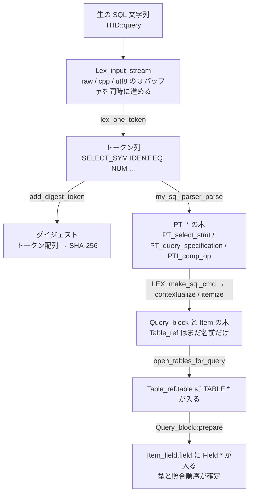

> **前提**: [SELECT の一生](./life-of-a-select/)

## この層の責務

入口は [`dispatch_sql_command`](https://github.com/mysql/mysql-server/blob/mysql-8.4.11/sql/sql_parse.cc#L5275)、出口は `Query_block::prepare` が返った状態だ。この区間には最適化も実行も出てこない。やっているのは**バイト列を、オプティマイザが読める形に変えること**だけである。

「読める形」とは具体的に次の 3 つが揃った状態を指す。

- `Query_block` の木ができていて、`FROM` の各テーブルが `Table_ref` として繋がっている
- `WHERE` / `SELECT` リストの式が `Item` の木になっていて、各 `Item_field` が実際の `Field *` を指している
- 各 `Item` の型・照合順序・NULL 可能性が確定している

3 つ目が地味だが重要で、コストモデルも range 分析も「この式は何型か」を前提にしている。`WHERE varchar_col = 123` でインデックスが使われなくなる理由は、この層で比較の型が決まってしまうことにある ([名前解決と Item ツリー](./name-resolution-and-items/))。

そしてこの層には、MySQL の中でも珍しく**きれいに分かれた 4 段**がある。字句解析、構文解析、contextualize、名前解決だ。段の境界がどこにあるかを先に固定しておくと、「この時点でテーブルは開いているのか」「この時点でセッション変数は変わったのか」という質問に毎回答えなくて済む。



## 主要な型とその関係

### 入力側 — `Parser_state` と `Lex_input_stream`

`Parser_state` は文 1 本の間だけ生きるスタック上のオブジェクトで、その中に [`Lex_input_stream`](https://github.com/mysql/mysql-server/blob/mysql-8.4.11/sql/sql_lex.h#L3306) を持つ。名前に反して、これは**3 本のバッファを並行して進める装置**だ。

```cpp title="sql/sql_lex.h"
  /** Beginning of the query text in the input stream, in the raw buffer. */
  const char *m_buf;
  ...
  /** Pre-processed buffer. */
  char *m_cpp_buf;
  ...
  /** UTF8-body buffer created during parsing. */
  char *m_body_utf8;
```

- **raw** — クライアントから来たバイト列そのもの
- **cpp** — 「echo」されたテキスト。バージョンコメント `/*!80000 ... */` の中身は展開され、マーカーは消える
- **utf8 body** — ビューやストアドの本文を保存するために UTF-8 化したもの

なぜ 3 本要るのか。`SELECT /*!80000 SQL_NO_CACHE */ 1` のような文は、パーサに渡す時点では中身を展開しておきたいが、`Item` に持たせる位置情報 (`POS`) は raw と cpp の両方が要る。エラーメッセージは raw の位置を指し、ビュー定義の保存は cpp を使う。

バージョンコメントの処理は [`lex_one_token` の `MY_LEX_LONG_COMMENT`](https://github.com/mysql/mysql-server/blob/mysql-8.4.11/sql/sql_lex.cc#L1919) にある。

```cpp title="sql/sql_lex.cc"
            ulong version = strtol(version_str, nullptr, 10);
            if (version <= MYSQL_VERSION_ID) {
              /* Accept ('M') 'M' 'm' 'm' 'd' 'd' */
              lip->yySkipn(strlen(version_str));
              /* Expand the content of the special comment as real code */
              lip->set_echo(true);
              state = MY_LEX_START;
              break; /* Do not treat contents as a comment.  */
```

`set_echo` の切り替えだけで、raw には残り cpp からは消える、という制御をしている。

### 中間表現 — `PT_*` と `Parse_tree_root`

Bison の意味アクションが作るのは `PT_*` のノードだけだ。頂点は [`Parse_tree_root`](https://github.com/mysql/mysql-server/blob/mysql-8.4.11/sql/parse_tree_nodes.h#L162) で、抽象メソッドは 1 つしかない。

```cpp title="sql/parse_tree_nodes.h"
class Parse_tree_root {
  ...
 public:
  /// Textual location of a token just parsed.
  POS m_pos;

  virtual Sql_cmd *make_cmd(THD *thd) = 0;
```

`SELECT` なら [`PT_select_stmt`](https://github.com/mysql/mysql-server/blob/mysql-8.4.11/sql/parse_tree_nodes.h#L1880)。その下は `PT_query_expression` → `PT_query_specification` → `PT_table_reference` / `Item` と続く。文法規則はほぼ `NEW_PTN` でノードを組むだけになっている。

```cpp title="sql/sql_yacc.yy (query_specification)"
query_specification:
          SELECT_SYM
          select_options
          select_item_list
          into_clause
          opt_from_clause
          opt_where_clause
          ...
          {
            $$= NEW_PTN PT_query_specification(
                                      @$,
                                      $1,  // SELECT_SYM
                                      $2,  // select_options
                                      $3,  // select_item_list
                                      $4,  // into_clause
                                      $5,  // from
                                      $6,  // where
```

`NEW_PTN` は `new(YYMEM_ROOT)` のマクロ ([`sql_yacc.yy#L225`](https://github.com/mysql/mysql-server/blob/mysql-8.4.11/sql/sql_yacc.yy#L225))。すべて文の `MEM_ROOT` から取るので、個別の `delete` はない。

### 出力側 — `LEX` / `Query_expression` / `Query_block` / `Table_ref`

| 型                                                                                               | 場所            | 何を持つか                                                                                      |
| ------------------------------------------------------------------------------------------------ | --------------- | ----------------------------------------------------------------------------------------------- |
| [`LEX`](https://github.com/mysql/mysql-server/blob/mysql-8.4.11/sql/sql_lex.h#L3852)             | `sql/sql_lex.h` | 文 1 本ぶんの全部。`sql_command`、`unit` (根の `Query_expression`)、`m_sql_cmd`、`query_tables` |
| [`Query_expression`](https://github.com/mysql/mysql-server/blob/mysql-8.4.11/sql/sql_lex.h#L626) | 同上            | 集合演算のレベル。`UNION` / `INTERSECT` / `EXCEPT` の木 (`Query_term`) を持つ                   |
| [`Query_block`](https://github.com/mysql/mysql-server/blob/mysql-8.4.11/sql/sql_lex.h#L1167)     | 同上            | 1 つの `SELECT`。`fields`、`m_where_cond`、`m_table_list`、`context`                            |
| [`Table_ref`](https://github.com/mysql/mysql-server/blob/mysql-8.4.11/sql/table.h#L2865)         | `sql/table.h`   | `FROM` に現れた 1 項目。8.0 までの `TABLE_LIST`                                                 |

`LEX` は**文ごとに使い回される**。`dispatch_sql_command` の冒頭で `lex_start(thd)` が `LEX::reset()` を呼び、新しい `Query_expression` と `Query_block` を 1 組作る ([`sql_lex.cc#L508`](https://github.com/mysql/mysql-server/blob/mysql-8.4.11/sql/sql_lex.cc#L508))。つまり**パースが始まる前に、空の `Query_block` が 1 つだけ既にある**。`Parse_context::select` の初期値はこれだ。

`Item` は `Parse_tree_node` の仲間ではない。継承関係を持たせずに、同じ 2 パス構造を `itemize()` という別名で実装している ([2 パスのページ](./parse-tree-and-contextualize/))。

## 処理の流れ

### 1. `dispatch_sql_command` が LEX をリセットしてダイジェストを要求する

```cpp title="sql/sql_parse.cc"
void dispatch_sql_command(THD *thd, Parser_state *parser_state) {
  ...
  mysql_reset_thd_for_next_command(thd);
  // It is possible that rewritten query may not be empty (in case of
  // multiqueries). So reset it.
  thd->reset_rewritten_query();
  lex_start(thd);

  thd->m_parser_state = parser_state;
  invoke_pre_parse_rewrite_plugins(thd);
  thd->m_parser_state = nullptr;

  // we produce digest if it's not explicitly turned off
  // by setting maximum digest length to zero
  if (get_max_digest_length() != 0)
    parser_state->m_input.m_compute_digest = true;
```

ここでやるのはフラグを立てることまでで、ダイジェストの計算はレキサの中で走る ([ダイジェストのページ](./statement-digest/))。

### 2. `parse_sql` が Diagnostics_area を差し替える

[`parse_sql` (`sql_parse.cc#L7118`)](https://github.com/mysql/mysql-server/blob/mysql-8.4.11/sql/sql_parse.cc#L7118) は Bison を呼ぶ前に、パーサ専用の `Diagnostics_area` を積む。

```cpp title="sql/sql_parse.cc"
  /*
    Use a temporary DA while parsing. We don't know until after parsing
    whether the current command is a diagnostic statement, in which case
    we'll need to have the previous DA around to answer questions about it.
  */
  Diagnostics_area *parser_da = thd->get_parser_da();
  Diagnostics_area *da = thd->get_stmt_da();
```

理由がそのまま書いてある。`SHOW WARNINGS` や `GET DIAGNOSTICS` は**前の文の DA を読む文**なので、その文自体をパースするときに DA を潰してはいけない。パースが終わってから、条件が積まれていた場合だけ本来の DA に移し替える。

同じ関数の中で、ダイジェストのリスナがレキサに刺さる。

```cpp title="sql/sql_parse.cc"
        parser_state->m_lip.m_digest = thd->m_digest;
        parser_state->m_lip.m_digest->m_digest_storage.m_charset_number =
            thd->charset()->number;
```

### 3. `THD::sql_parser` — Bison 本体と後片付け

```cpp title="sql/sql_class.cc"
bool THD::sql_parser() {
  ...
  Parse_tree_root *root = nullptr;
  if (my_sql_parser_parse(this, &root) || is_error()) {
    /*
      Restore the original LEX if it was replaced when parsing
      a stored procedure. We must ensure that a parsing error
      does not leave any side effects in the THD.
    */
    cleanup_after_parse_error();
    return true;
  }
  if (root != nullptr && lex->make_sql_cmd(root)) {
    return true;
  }
  return false;
}
```

[`sql/sql_class.cc#L3101`](https://github.com/mysql/mysql-server/blob/mysql-8.4.11/sql/sql_class.cc#L3101)。**`my_sql_parser_parse` が成功したあと、別のステップとして `make_sql_cmd` が呼ばれている**のが 2 パス構成の姿だ。Bison が返ってきた時点では、まだ `Query_block` には何も入っていない。

### 4. レキサ — `my_sql_parser_lex` と `lex_one_token`

Bison が 1 トークン要求するたびに [`my_sql_parser_lex` (`sql_lex.cc#L1367`)](https://github.com/mysql/mysql-server/blob/mysql-8.4.11/sql/sql_lex.cc#L1367) が呼ばれる。実体は [`lex_one_token` (`sql_lex.cc#L1469`)](https://github.com/mysql/mysql-server/blob/mysql-8.4.11/sql/sql_lex.cc#L1469) だが、その外側に 2 つの仕掛けがある。

**1 トークンの先読み。** `WITH ROLLUP` だけのために LALR(2) が要るので、`WITH` を見たら次を読んでしまい、`ROLLUP` なら `WITH_ROLLUP_SYM` という 1 個のトークンに潰す。違えば `lookahead_token` に退避する。

**巨大クエリの中断。** 8.4 のこの関数には、1MB を超えるクエリに対してだけ効く中断チェックが入っている。

```cpp title="sql/sql_lex.cc"
  static constexpr size_t LARGE_QUERY_THRESHOLD = 1024 * 1024;
  static constexpr size_t CONNECTED_CHECK_BYTES = 64 * 1024;

  if (thd->query().length > LARGE_QUERY_THRESHOLD) {
    if (thd->is_killed()) {
      my_error(ER_QUERY_INTERRUPTED, MYF(0));
      return ABORT_SYM;
    }
```

`is_killed()` は毎トークン、`is_connected()` (poll + ioctl) は 64KB ごと。**巨大な `INSERT ... VALUES` を投げてクライアントが死んだとき、パース中でも止まれる**のはここのおかげだ。逆に 1MB 未満のクエリはパースを始めたら最後まで走る。

キーワード判定は [`find_keyword`](https://github.com/mysql/mysql-server/blob/mysql-8.4.11/sql/sql_lex.cc#L910) が生成済みの完全ハッシュを引く。

```cpp title="sql/sql_lex.cc"
  const SYMBOL *symbol =
      function ? Lex_hash::sql_keywords_and_funcs.get_hash_symbol(tok, len)
               : Lex_hash::sql_keywords.get_hash_symbol(tok, len);
```

元表は [`sql/lex.h` の `symbols[]`](https://github.com/mysql/mysql-server/blob/mysql-8.4.11/sql/lex.h#L61) で、823 エントリの 1 本の配列だ。コメントに「These are kept sorted for human lookup (the symbols are hashed)」とある。**ソートされているのは人間のためで、引くのはハッシュ**。ハッシュ表 `sql/sql_lex_hash.cc` はビルド時に `sql/gen_lex_hash.cc` が生成する。

### 5. contextualize — ここで初めて `Query_block` が埋まる

`LEX::make_sql_cmd` が根の `make_cmd` を呼ぶ ([`sql_lex.cc#L5124`](https://github.com/mysql/mysql-server/blob/mysql-8.4.11/sql/sql_lex.cc#L5124))。`SELECT` なら [`PT_select_stmt::make_cmd` (`parse_tree_nodes.cc#L765`)](https://github.com/mysql/mysql-server/blob/mysql-8.4.11/sql/parse_tree_nodes.cc#L765)。

```cpp title="sql/parse_tree_nodes.cc"
Sql_cmd *PT_select_stmt::make_cmd(THD *thd) {
  Parse_context pc(thd, thd->lex->current_query_block());

  thd->lex->sql_command = m_sql_command;

  if (m_qe->contextualize(&pc)) {
    return nullptr;
  }
  ...
  if (pc.finalize_query_expression()) return nullptr;

  // Ensure that first query block is the current one
  assert(pc.select->select_number == 1);
```

`Parse_context` は「contextualization の環境データ」で、`thd`、`mem_root`、**現在の `Query_block`**、そして集合演算の木を組み立てるためのスタック `m_stack` を持つ ([`parse_tree_node_base.h#L420`](https://github.com/mysql/mysql-server/blob/mysql-8.4.11/sql/parse_tree_node_base.h#L420))。

`FROM` のテーブルが `Table_ref` になるのはこの中だ。

```cpp title="sql/parse_tree_nodes.cc"
bool PT_table_factor_table_ident::do_contextualize(Parse_context *pc) {
  if (super::do_contextualize(pc)) return true;

  THD *thd = pc->thd;
  Yacc_state *yyps = &thd->m_parser_state->m_yacc;

  if (pc->select->table_count() >= MAX_TABLES) {
    my_error(ER_TOO_MANY_TABLES, MYF(0), static_cast<int>(MAX_TABLES));
    return true;
  }

  m_table_ref = pc->select->add_table_to_list(
      thd, table_ident, opt_table_alias, 0, yyps->m_lock_type, yyps->m_mdl_type,
      opt_key_definition, opt_use_partition, nullptr, pc);
```

[`Query_block::add_table_to_list`](https://github.com/mysql/mysql-server/blob/mysql-8.4.11/sql/sql_parse.cc#L5998) は名前に反して `sql/sql_parse.cc` にいる。ここでやるのは識別子の検証、`lower_case_table_names` の適用、CTE 名かどうかの判定、そして `Table_ref` の割り当てまで。**`Table_ref::table` はまだ `nullptr`** で、`db` と `table_name` という文字列しか入っていない。

最後に `finalize_query_expression` がスタックのトップを取り出し、`Query_expression` の `Query_term` として据える ([`parse_tree_node_base.cc#L49`](https://github.com/mysql/mysql-server/blob/mysql-8.4.11/sql/parse_tree_node_base.cc#L49))。

### 6. `open_tables_for_query` が `TABLE` を繋ぐ

`Sql_cmd_dml::prepare` ([`sql_select.cc#L490`](https://github.com/mysql/mysql-server/blob/mysql-8.4.11/sql/sql_select.cc#L490)) が名前解決の直前にテーブルを開く。

```cpp title="sql/sql_select.cc"
  /*
    Open tables and expand views.
    During prepare of query (not as part of an execute), acquire only
    S metadata locks instead of SW locks to be compatible with concurrent
    LOCK TABLES WRITE and global read lock.
  */
  if (open_tables_for_query(
          thd, lex->query_tables,
          needs_explicit_preparation() ? MYSQL_OPEN_FORCE_SHARED_MDL : 0)) {
```

ここで MDL を取り、データディクショナリから `TABLE_SHARE` を引き、`Table_ref::table` に `TABLE *` が入る ([データディクショナリのページ](./data-dictionary/))。**`ALTER TABLE` を待つ「固まった SELECT」は、まだ 1 バイトもデータを読んでいないこの地点で止まっている** ([MDL のページ](./metadata-locking/))。

ビューはここで展開される。だから `Query_block::setup_tables` が見るテーブル数は、パーサが数えた数より増えうる。

### 7. `Query_block::prepare` — 名前解決

[`sql/sql_resolver.cc#L179`](https://github.com/mysql/mysql-server/blob/mysql-8.4.11/sql/sql_resolver.cc#L179)。順序が意味を持つので、そのまま並べる。

```cpp title="sql/sql_resolver.cc (Query_block::prepare 抜粋)"
  if (setup_tables(thd, get_table_list(), false)) return true;

  if ((derived_table_count || table_func_count) &&
      resolve_placeholder_tables(thd, true))
    return true;
  ...
  if (with_wild && setup_wild(thd)) return true;
  if (setup_base_ref_items(thd)) return true; /* purecov: inspected */

  if (setup_fields(thd, thd->want_privilege, /*allow_sum_func=*/true,
                   /*split_sum_funcs=*/true, /*column_update=*/false,
                   insert_field_list, &fields, base_ref_items))
    return true;
  ...
  // Set up join conditions and WHERE clause
  if (setup_conds(thd)) return true;

  // Set up the GROUP BY clause
  int all_fields_count = fields.size();
  if (group_list.elements && setup_group(thd)) return true;
```

- [`setup_tables` (L1234)](https://github.com/mysql/mysql-server/blob/mysql-8.4.11/sql/sql_resolver.cc#L1234) — join nest を平らにして `leaf_tables` の並びを作り、各テーブルに 0 から番号 (`tableno`) を振る。この番号がそのまま `table_map` のビット位置になり、オプティマイザ全体で「どのテーブルに依存する式か」を表すのに使われる
- [`resolve_placeholder_tables` (L1363)](https://github.com/mysql/mysql-server/blob/mysql-8.4.11/sql/sql_resolver.cc#L1363) — derived table / CTE / テーブル関数を解決する。`Query_block::resolve_subquery` という関数は存在しない
- [`setup_wild` (L1437)](https://github.com/mysql/mysql-server/blob/mysql-8.4.11/sql/sql_resolver.cc#L1437) — `*` を実際の列に展開する
- `setup_fields` ([`sql_base.cc#L9160`](https://github.com/mysql/mysql-server/blob/mysql-8.4.11/sql/sql_base.cc#L9160)) — SELECT リストの各 `Item` に `fix_fields` を掛ける
- [`setup_conds` (L1494)](https://github.com/mysql/mysql-server/blob/mysql-8.4.11/sql/sql_resolver.cc#L1494) — `WHERE` と `ON` を解決する

**SELECT リストが `WHERE` より先**なのは、`ORDER BY` や `HAVING` がエイリアスを参照できるようにするためだ。`setup_conds` の中で `thd->where = "where clause"` を置いているのも見どころで、`ERROR 1054 (42S22): Unknown column 'x' in 'where clause'` の後半はこの文字列そのものである。

## 守られている不変条件

**構文エラーはセッション状態を変えない。** Bison の意味アクションは DML の中核では `PT_*` を作るだけで `THD` を触らず、`parse_sql` はパーサ専用の DA を積んでいる。残った例外 (ストアドの `sp_head`) だけを `THD::cleanup_after_parse_error` が片付ける。詳しくは [2 パスのページ](./parse-tree-and-contextualize/)。

**`Query_block::prepare` はデータを見ない。** `lock_tables` は `prepare` の後、`optimize` の前にある ([SELECT の一生](./life-of-a-select/))。だから prepare 段階で使えるのはメタデータだけで、「実際の行数を見て解決を変える」ことはできない。

**`prepare` に入る時点でエラーは立っていない。** 関数の先頭に `assert(!thd->is_error())` があり、`setup_conds` の末尾にも同じ assert がある。エラーを立てたのに `false` を返す経路をデバッグビルドで潰している。

**contextualize は 1 ノードにつき 1 回だけ。** `Parse_tree_node_tmpl::do_contextualize` がデバッグビルドで `assert(!contextualized)` を張っている ([`parse_tree_node_base.h#L283`](https://github.com/mysql/mysql-server/blob/mysql-8.4.11/sql/parse_tree_node_base.h#L283))。prepared statement を再実行するとき、PT ツリーを作り直さずに 2 回目の contextualize を掛けようとするとここで落ちる。

**テーブル番号は `MAX_TABLES` 未満。** パーサ側 (`PT_table_factor_table_ident`) とリゾルバ側 (`setup_tables`) の両方で検査している。理由はコメントに書いてある。

```cpp title="sql/sql_resolver.cc"
    /*
      The parser already checks table counts based on syntactic structure,
      but the resolver check is still necessary because:

      1. View expansion: A view may expand into many leaf tables
      2. Derived tables: Complex subqueries add tables not visible in parser
      3. Recursive CTEs: Expansion happens at resolution time
      4. The parser counts syntactic tables; we count actual leaf tables here
    */
```

## つまずきどころ

### `sql/sql_lexer.cc` は存在しない

レキサは `sql/sql_lex.cc` の中にあり、キーワード表は `sql/lex.h`、ハッシュ表 `sql/sql_lex_hash.cc` と digest 用の `sql/lex_token.h` はビルド時に生成される (`sql/gen_lex_hash.cc` と `sql/gen_lex_token.cc` がその生成器)。ツリーを `ls` しても `lex_token.h` は見つからない。

### 文法ファイルの一部は今も `Lex->` を直接触る

「Bison アクションは `PT_*` を作るだけ」という説明は、`SELECT` / `INSERT` / `UPDATE` / `DELETE` の中核には当てはまるが、`sql_yacc.yy` 全体では 358 行が `Lex->` を含んでいる。たとえば `CHANGE REPLICATION SOURCE` は今も `Lex->mi.host = $3.str;` のように書き込む。

これが安全なのは、`LEX` が**文ごとにリセットされる領域**だからだ。`lex_start` が毎回 `LEX::reset()` を呼ぶので、途中で構文エラーになった文の書き込みは次の文に持ち越されない。危険なのは `THD` 側のセッション変数を触ることで、そちらは規約で禁じられている。

### `SHOW PARSE_TREE` はリリースビルドでは使えない

PT ツリーを JSON で覗ける `SHOW PARSE_TREE <statement>` があるが、既定で有効なのはデバッグビルドだけだ。

```cmake title="CMakeLists.txt"
# Allow SHOW PARSE_TREE on debug build by default.
IF(CMAKE_BUILD_TYPE_UPPER STREQUAL "DEBUG" OR WITH_DEBUG)
  SET(WITH_SHOW_PARSE_TREE_DEFAULT ON)
ELSE()
  SET(WITH_SHOW_PARSE_TREE_DEFAULT OFF)
ENDIF()
```

無効なビルドでは文法規則そのものが `syntax_error_at` を投げるので、「そんな構文はない」という顔をする。hypergraph オプティマイザと同じ扱いだ ([ビルドとデバッガのページ](./build-and-debug/))。

### `Query_block` の番号は 1 から始まり、パース順に振られる

`EXPLAIN` の `id` 列や `optimizer_trace` の `select#` はこの `select_number` である。`PT_select_stmt::make_cmd` の末尾に `assert(pc.select->select_number == 1)` があるとおり、最上位は必ず 1。サブクエリは出現順に 2, 3, ... と増える。最適化でサブクエリが semijoin に潰れると番号が消えるので、`EXPLAIN` の `id` が飛ぶことがある ([サブクエリのページ](./subquery-transformations/))。

### パースの入口は `COM_QUERY` だけではない

prepared statement は `mysqld_stmt_prepare` から `parse_sql` に入る ([PS のページ](./binary-protocol-prepared-statements/))。ビュー定義は `open_tables` の途中で再帰的に `parse_sql` を呼ぶ。パーティション式や生成列の式は `GRAMMAR_SELECTOR_*` トークンを先頭に注入して同じ文法の一部だけを使う (`Lex_input_stream::is_partial_parser`)。X Protocol の CRUD メッセージも、最終的には SQL 文字列に組み立て直されてこの経路に合流する ([X Plugin のページ](./x-plugin-session-and-sql/))。

部分パーサだけはダイジェストを作らない。`parse_sql` の assert がそれを表明している。

```cpp title="sql/sql_parse.cc"
  /*
    Partial parsers (GRAMMAR_SELECTOR_*) are not supposed to compute digests.
  */
  assert(!parser_state->m_lip.is_partial_parser() ||
         !parser_state->m_input.m_has_digest);
```
