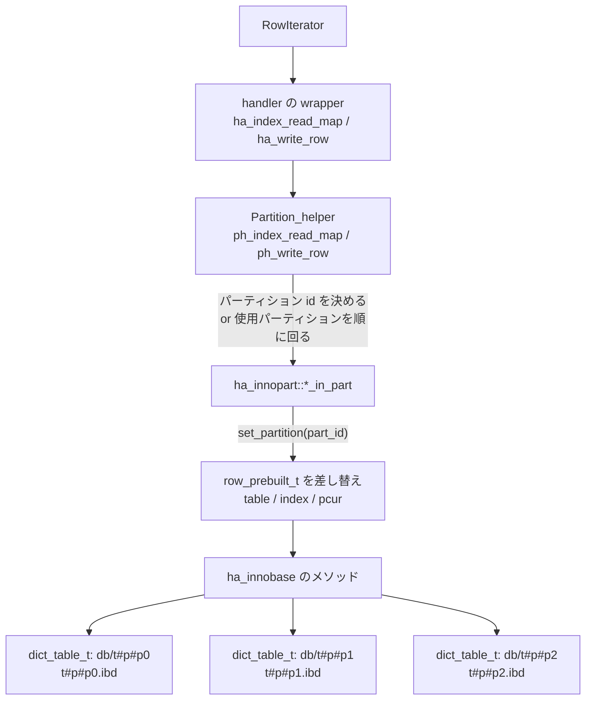

> **前提**: [handler](./handler-walkthrough/) / [range 分析](./range-optimizer/)

## 何を学んだか

パーティショニングは「テーブルを分割する機能」ではなく、**2 つの別々の仕掛けの組**だ。

1. **pruning** — `WHERE` からパーティションの集合を絞る。実装は range オプティマイザの流用で、パーティション式に使われている列だけを並べた**架空のインデックス**を作り、そのインデックスに対する区間解析の結果からパーティション番号を逆算する
2. **実行の振り分け** — `Partition_helper` が `handler` の 1 メソッドを受け取り、対象パーティションごとの `*_in_part` メソッドに展開する。InnoDB では 1 パーティションが独立した `dict_table_t` とテーブルスペース (`t#p#p0.ibd`) なので、複数パーティションの走査は複数のカーソルを同時に動かすことになる

そして重要な制約が 1 つある。**すべての UNIQUE インデックス (PRIMARY KEY を含む) は、パーティション式に出てくる列を全部含まなければならない。** これは 1 の都合でも 2 の都合でもなく、「一意性の検査を 1 パーティションの中だけで完結させたい」という要請から来ている。

pruning が呼ばれる場所も押さえておく。**`prune_partitions()` は 2 回走る。** `Query_block::prepare` の中で定数条件だけを使って 1 回 (ロックするパーティションを絞るため)、`JOIN::optimize` の早い段でもう 1 回 ([JOIN::optimize のページ](./optimizer-walkthrough/))。[SELECT の一生](./life-of-a-select/)で見た `prepare → lock_tables → optimize` という順序は、この 2 回のためにある。

## なぜそうなっているか

**pruning に range オプティマイザを流用したのは、`WHERE` から区間を取り出す仕事が全く同じだからだ。** `PARTITION BY RANGE (id)` で `id` の区間が分かれば、そこからパーティション番号は計算できる。専用の条件解析器を書くと、`OR` の扱い、`IN` の展開、`BETWEEN` の正規化、型変換のルールを二重に実装することになる。架空のインデックスを 1 本でっち上げて `get_mm_tree` に食わせれば、それが全部ただで手に入る。**代償は、range 分析が扱えない形の述語では pruning が一切効かないことだ。** 「パーティション式に列を渡せば効きそう」という直感が外れるのは、判定しているのがパーティション式ではなく `SEL_TREE` を作れるかどうかだから。

**pruning を prepare と optimize で 2 回走らせているのは、ロック範囲と精度のトレードオフだ。** ロックはテーブルを開いた直後に取る必要があるが、その時点ではまだ join 順序も決まっておらず、他テーブルの値に依存する条件は使えない。だから prepare では定数条件だけで `lock_partitions` を削り、optimize でロック後に使える条件も含めてもう一度 `read_partitions` を削る。**この 2 段構えのために `lock_tables` が prepare と optimize の間に置かれている** ([SELECT の一生](./life-of-a-select/))。

**UNIQUE がパーティション列を含まなければならないのは、グローバルインデックスがないからだ。** InnoDB のインデックスはパーティション (= `dict_table_t`) の中に閉じている。`UNIQUE (email)` を `PARTITION BY HASH(user_id)` のテーブルに張ると、同じ email が別パーティションに入りうるので、重複を検出するには全パーティションのインデックスを引く必要がある。挿入のたびに N 回のインデックス検索と N 個のギャップロックが要る。**MySQL はその機能を実装せず、制約として禁じるほうを選んだ。** ここが「パーティショニングを入れたらスキーマを変えざるを得なかった」の原因になる。

**`Partition_helper` が `handler` の外側にいるのは、パーティショニングをエンジンから独立させたかったからだ。** クラスコメントの「継承して `*_in_part` を実装せよ」という形は、テンプレートメソッドパターンそのものだ。順序付き走査のマージ、AUTO_INCREMENT の調停、パーティション間の行移動 (`UPDATE` でパーティションが変わる場合) は全部 `Partition_helper` 側にあり、エンジンは「あるパーティションに対する 1 操作」だけを書けばよい。**そして `ha_innopart` は `ha_innobase` を継承することで、その「1 操作」すら書かずに済ませている。**

## ソースコードのどこか

### pruning の入口 — [`sql/range_optimizer/partition_pruning.cc#L251`](https://github.com/mysql/mysql-server/blob/mysql-8.4.11/sql/range_optimizer/partition_pruning.cc#L251)

`sql/opt_range.cc` は 8.4 には存在せず、range 関連は `sql/range_optimizer/` に分割されている。partition pruning もその中にある。

```cpp title="sql/range_optimizer/partition_pruning.cc"
/**
  Perform partition pruning for a given table and condition.
  ...
  @note This function assumes that lock_partitions are setup when it
  is invoked. The function analyzes the condition, finds partitions that
  need to be used to retrieve the records that match the condition, and
  marks them as used by setting appropriate bit in part_info->read_partitions
  In the worst case all partitions are marked as used. If the table is not
  yet locked, it will also unset bits in part_info->lock_partitions that is
  not set in read_partitions.
*/

bool prune_partitions(THD *thd, TABLE *table, Query_block *query_block,
                      Item *pprune_cond) {
```

**出力は 2 つのビットマップだ。** `read_partitions` は「読むパーティション」、`lock_partitions` は「ロックするパーティション」。まだロックしていない段階でだけ後者も削れる、というのがコメントに書いてある条件だ。

冒頭のガードが 2 回呼ばれることを示している。

```cpp title="sql/range_optimizer/partition_pruning.cc"
  /*
    If the prepare stage already have completed pruning successfully,
    it is no use of running prune_partitions() again on the same condition.
    Since it will not be able to prune anything more than the previous call
    from the prepare step.
  */
  if (part_info && part_info->is_pruning_completed) return false;

  table->all_partitions_pruned_away = false;

  if (!part_info) return false; /* not a partitioned table */
  ...
  if (!pprune_cond) {
    mark_all_partitions_as_used(part_info);
    return false;
  }
```

**`WHERE` がなければ即座に全パーティションが使用中になる。** 1 回目の呼び出しは [`Query_block::prepare` (`sql/sql_resolver.cc#L870`)](https://github.com/mysql/mysql-server/blob/mysql-8.4.11/sql/sql_resolver.cc#L870)。

```cpp title="sql/sql_resolver.cc"
  if (partitioned_table_count && prune) {
    for (Table_ref *tbl = leaf_tables; tbl; tbl = tbl->next_leaf) {
      /*
        This will only prune constant conditions, which will be used for
        lock pruning.
      */
      if (prune_partitions(thd, tbl->table, this,
                           tbl->join_cond() ? tbl->join_cond() : m_where_cond))
        return true; /* purecov: inspected */

      if (tbl->table->all_partitions_pruned_away &&
          !tbl->is_inner_table_of_outer_join())
        set_empty_query();
```

2 回目は [`JOIN::prune_table_partitions` (`sql/sql_optimizer.cc#L2839`)](https://github.com/mysql/mysql-server/blob/mysql-8.4.11/sql/sql_optimizer.cc#L2839)、`JOIN::optimize` から [L526](https://github.com/mysql/mysql-server/blob/mysql-8.4.11/sql/sql_optimizer.cc#L526) で呼ばれる。

```cpp title="sql/sql_optimizer.cc"
  if (query_block->partitioned_table_count && prune_table_partitions()) {
```

`optimize_cond` の直後で、`make_join_plan` よりずっと前だ。**pruning の結果はコスト見積もりの前提になる**ので、この位置でなければならない。

```cpp title="sql/sql_optimizer.cc"
bool JOIN::prune_table_partitions() {
  assert(query_block->partitioned_table_count);

  for (Table_ref *tbl = query_block->leaf_tables; tbl; tbl = tbl->next_leaf) {
    // This will try to prune non-static conditions, which can be probed after
    // the tables are locked.
```

### 架空のインデックスを作る

pruning の本体は range 分析だ。そのために「パーティション式に使われている列を並べたインデックス」を捏造する ([`partition_pruning.cc#L1096`](https://github.com/mysql/mysql-server/blob/mysql-8.4.11/sql/range_optimizer/partition_pruning.cc#L1096))。

```cpp title="sql/range_optimizer/partition_pruning.cc"
/*
  ...
  DESCRIPTION
    Create partition index description. Partition index description is:

      part_index(used_fields_list(part_expr), used_fields_list(subpart_expr))

    If partitioning/sub-partitioning uses BLOB or Geometry fields, then
    corresponding fields_list(...) is not included into index description
    and we don't perform partition pruning for partitions/subpartitions.
*/

static bool create_partition_index_description(PART_PRUNE_PARAM *ppar) {
```

その上で通常の range 分析を回す。

```cpp title="sql/range_optimizer/partition_pruning.cc"
  range_par->keys = 1;  // one index
  range_par->using_real_indexes = false;
  unsigned real_keynr = 0;
  range_par->real_keynr = &real_keynr;

  bitmap_clear_all(&part_info->read_partitions);

  prune_param.key = prune_param.range_param.key_parts;
  SEL_TREE *tree;
  int res;

  tree = get_mm_tree(thd, range_par, prev_tables, read_tables, current_table,
                     /*remove_jump_scans=*/false, pprune_cond);
  if (!tree) goto all_used;

  if (tree->type == SEL_TREE::IMPOSSIBLE) {
    /* Cannot improve the pruning any further. */
    part_info->is_pruning_completed = true;
    goto end;
  }

  if (tree->type != SEL_TREE::KEY) goto all_used;
```

`using_real_indexes = false` が「これは本物のインデックスではない」という印だ。`get_mm_tree` は[range 分析のページ](./range-optimizer/)で見るのと同じ関数で、`SEL_TREE` が返る。**`SEL_TREE::KEY` にならなければ `goto all_used`、つまり pruning は諦めて全パーティションを読む。**

**これが pruning の効き方を決めている。** range 分析が区間を作れる形の述語 (`=`、`<`、`BETWEEN`、`IN`) でしか pruning は効かない。`WHERE YEAR(created_at) = 2026` のように列に関数を被せると `SEL_TREE` が作れないので、`PARTITION BY RANGE (YEAR(created_at))` と定義していても全パーティションを読む。

### 実行側 — `Partition_helper`

[`sql/partitioning/partition_handler.h#L390`](https://github.com/mysql/mysql-server/blob/mysql-8.4.11/sql/partitioning/partition_handler.h#L390)。使い方がクラスコメントに書いてある。

```cpp title="sql/partitioning/partition_handler.h"
  How to use it:
  Inherit it and implement:
  - *_in_part() functions for row operations.
  - write_row_in_new_part() for handling 'fast' alter partition.
*/
class Partition_helper {
```

クラス内の純粋仮想関数は 24 個で、その大半が `*_in_part`。`handler` の pure virtual が 12 個 ([handler のページ](./handler-walkthrough/)) だったのと比べると、**このクラスは `handler` より要求が強い**。行の読み書きだけでなく `index_first_in_part` / `index_last_in_part` / `index_prev_in_part` まで pure だ。順序付きの走査を自前でやるので、逆方向の走査も必須になる。

書き込みは [`ph_write_row` (`partition_handler.cc#L454`)](https://github.com/mysql/mysql-server/blob/mysql-8.4.11/sql/partitioning/partition_handler.cc#L454)。

```cpp title="sql/partitioning/partition_handler.cc"
  error = m_part_info->get_partition_id(m_part_info, &part_id, &func_value);
  ...
  if (!m_part_info->is_partition_locked(part_id)) {
    DBUG_PRINT("info", ("Write to non-locked partition %u (func_value: %ld)",
                        part_id, (long)func_value));
    error = HA_ERR_NOT_IN_LOCK_PARTITIONS;
    goto exit;
  }
  m_last_part = part_id;
  DBUG_PRINT("info", ("Insert in partition %d", part_id));

  error = write_row_in_part(part_id, buf);
```

**行を書く先はパーティション式の評価結果で 1 つに決まる。** 決まった先がロック済みでなければ `HA_ERR_NOT_IN_LOCK_PARTITIONS` になる。これがクライアントには `ER_NO_PARTITION_FOR_GIVEN_VALUE` や、`INSERT ... PARTITION (p0)` を指定したときのエラーとして見える。

全表スキャンは [`ph_rnd_next` (L1538)](https://github.com/mysql/mysql-server/blob/mysql-8.4.11/sql/partitioning/partition_handler.cc#L1538) が素朴にパーティションを順に舐める。

```cpp title="sql/partitioning/partition_handler.cc"
  while (true) {
    result = rnd_next_in_part(part_id, buf);
    if (!result) {
      m_last_part = part_id;
      m_part_spec.start_part = part_id;
      return 0;
    }
    ...
    if (result != HA_ERR_END_OF_FILE)
      goto end_dont_reset_start_part;  // Return error

    /* End current partition */
    DBUG_PRINT("info", ("rnd_end on partition %d", part_id));
    if ((result = rnd_end_in_part(part_id, true))) break;

    /* Shift to next partition */
    part_id = m_part_info->get_next_used_partition(part_id);
```

**1 パーティションを読み切ってから次に移る。** 全表スキャンには順序の要求がないので、これで足りる。

### 順序付きインデックス走査は優先度付きキュー

インデックスを使う場合はそうはいかない。`ORDER BY` の順や range scan の順を守るには、全パーティションのカーソルを同時に進めて先頭同士を比較する必要がある。[`ph_index_read_map` (L1832)](https://github.com/mysql/mysql-server/blob/mysql-8.4.11/sql/partitioning/partition_handler.cc#L1832) から `common_index_read` を経て分岐する。

```cpp title="sql/partitioning/partition_handler.cc"
  if (!m_ordered_scan_ongoing) {
    /*
      We use unordered index scan when read_range is used and flag
      is set to not use ordered.
      We also use an unordered index scan when the number of partitions to
      scan is only one.
      The unordered index scan will use the partition set created.
    */
    DBUG_PRINT("info", ("doing unordered scan"));
    error = handle_unordered_scan_next_partition(buf);
  } else {
    ...
    error = handle_ordered_index_scan(buf);
  }
```

**読むパーティションが 1 つに絞れていれば順序付き走査は不要になる。** pruning がここまで効いてくる。

順序付き走査の準備は [`init_record_priority_queue` (L1659)](https://github.com/mysql/mysql-server/blob/mysql-8.4.11/sql/partitioning/partition_handler.cc#L1659)。

```cpp title="sql/partitioning/partition_handler.cc"
int Partition_helper::init_record_priority_queue() {
  uint used_parts = m_part_info->num_partitions_used();
  ...
    alloc_len = used_parts * (m_rec_offset + m_rec_length);
    /* Allocate a key for temporary use when setting up the scan. */
    alloc_len += m_table->s->max_key_length;

    m_ordered_rec_buffer = static_cast<uchar *>(
        my_malloc(key_memory_partition_sort_buffer, alloc_len, MYF(MY_WME)));
```

**「使うパーティション数 × 1 行ぶん」のバッファを毎回 malloc する。** `m_rec_length` は `TABLE_SHARE::reclength`、つまり[固定長の MySQL 行](./row-format-conversion/)だ。パーティション 1000 個 × 行 1KB なら 1MB を確保する。

そして [`handle_ordered_index_scan` (L2434)](https://github.com/mysql/mysql-server/blob/mysql-8.4.11/sql/partitioning/partition_handler.cc#L2434) が各パーティションから 1 行ずつ読んで優先度付きキューに積む。

```cpp title="sql/partitioning/partition_handler.cc"
  m_top_entry = NO_CURRENT_PART_ID;
  m_queue->clear();
  parts.reserve(m_queue->capacity());
  assert(m_part_info->is_partition_used(m_part_spec.start_part));
  ...
  for (/* continue from above */; i <= m_part_spec.end_part;
       i = m_part_info->get_next_used_partition(i)) {
```

**最初の 1 行を返すために、使うパーティション全部から 1 行ずつ読む。** `LIMIT 1` でも同じだ。

### InnoDB 側 — 1 パーティション = 1 テーブル

[`storage/innobase/handler/ha_innopart.h#L222`](https://github.com/mysql/mysql-server/blob/mysql-8.4.11/storage/innobase/handler/ha_innopart.h#L222) の継承がすべてを語っている。

```cpp title="storage/innobase/handler/ha_innopart.h"
class ha_innopart : public ha_innobase,
                    public Partition_helper,
                    public Partition_handler {
```

**`ha_innobase` を継承しているので、`*_in_part` の実装は「対象パーティションに切り替えてから親クラスのメソッドを呼ぶ」だけになる** ([`ha_innopart.cc#L1421`](https://github.com/mysql/mysql-server/blob/mysql-8.4.11/storage/innobase/handler/ha_innopart.cc#L1421))。

```cpp title="storage/innobase/handler/ha_innopart.cc"
int ha_innopart::write_row_in_part(uint part_id, uchar *record) {
  int error;
  Field *saved_next_number_field = table->next_number_field;
  DBUG_TRACE;
  set_partition(part_id);
  ...
  error = ha_innobase::write_row(record);
  update_partition(part_id);
```

インデックス読みも同じ形だ ([L1876](https://github.com/mysql/mysql-server/blob/mysql-8.4.11/storage/innobase/handler/ha_innopart.cc#L1876))。

```cpp title="storage/innobase/handler/ha_innopart.cc"
int ha_innopart::index_read_map_in_part(uint part, uchar *record,
                                        const uchar *key,
                                        key_part_map keypart_map,
                                        enum ha_rkey_function find_flag) {
  int error;

  set_partition(part);
  error = ha_innobase::index_read_map(record, key, keypart_map, find_flag);
  update_partition(part);
  return (error);
}
```

肝は [`set_partition` (L1270)](https://github.com/mysql/mysql-server/blob/mysql-8.4.11/storage/innobase/handler/ha_innopart.cc#L1270)。`row_prebuilt_t` は 1 個しかないので、**パーティションごとの状態を退避しておいて差し替える**。

```cpp title="storage/innobase/handler/ha_innopart.cc"
void ha_innopart::set_partition(uint part_id) {
  ...
  if (m_pcur_parts != nullptr) {
    m_prebuilt->pcur = &m_pcur_parts[m_pcur_map[part_id]];
  }
  ...
  const auto &part{m_parts[part_id]};
  m_prebuilt->ins_node = part.m_ins_node;
  m_prebuilt->upd_node = part.m_upd_node;
  ...
  m_prebuilt->sql_stat_start = m_sql_stat_start_parts.test(part_id);
  m_prebuilt->table = m_part_share->get_table_part(part_id);
  m_prebuilt->index = innopart_get_index(part_id, active_index);
```

`m_prebuilt->table` が差し替わっているのが決定的だ。**パーティションごとに `dict_table_t` が別々にある。** 開くところを見ると、パーティション名で個別のテーブルとして開いている ([`Ha_innopart_share::open_one_table_part` (L131)](https://github.com/mysql/mysql-server/blob/mysql-8.4.11/storage/innobase/handler/ha_innopart.cc#L131))。

```cpp title="storage/innobase/handler/ha_innopart.cc"
bool Ha_innopart_share::open_one_table_part(
    dd::cache::Dictionary_client *client, THD *thd, const TABLE *table,
    const dd::Partition *dd_part, const char *part_name,
    dict_table_t **part_dict_table) {
  dict_table_t *part_table = nullptr;
  bool cached = false;

  dict_sys_mutex_enter();
  part_table = dict_table_check_if_in_cache_low(part_name);
```

`part_name` の形式は [`storage/innobase/include/dict0types.h#L73`](https://github.com/mysql/mysql-server/blob/mysql-8.4.11/storage/innobase/include/dict0types.h#L73) で定義されている。

```cpp title="storage/innobase/include/dict0types.h"
namespace dict_name {
/** Partition separator in dictionary table name and file name. */
constexpr char PART_SEPARATOR[] = "#p#";
...
/** Sub-Partition separator in dictionary table name and file name. */
constexpr char SUB_PART_SEPARATOR[] = "#sp#";

/** Alternative partition separator from 8.0.17 and older versions. */
constexpr char ALT_PART_SEPARATOR[] = "#P#";
```

**8.0.17 以前は大文字の `#P#` だった。** ファイル名にそのまま出るので、大文字小文字を区別しないファイルシステムとの互換のために両方を受け付けるコードが残っている。`db/t#p#p0` が InnoDB のテーブル名で、ファイルは `t#p#p0.ibd`。**1 パーティション = 1 `dict_table_t` = 1 テーブルスペース = 1 ファイル**だ。



### UNIQUE の制約

[`sql/sql_partition.cc#L1070`](https://github.com/mysql/mysql-server/blob/mysql-8.4.11/sql/sql_partition.cc#L1070) が検査している。

```cpp title="sql/sql_partition.cc"
static bool check_unique_keys(TABLE *table) {
  bool all_fields, some_fields;
  bool result = false;
  const uint keys = table->s->keys;
  uint i;
  DBUG_TRACE;

  for (i = 0; i < keys; i++) {
    if (table->key_info[i].flags & HA_NOSAME)  // Unique index
    {
      set_indicator_in_key_fields(table->key_info + i);
      check_fields_in_PF(table->part_info->full_part_field_array, &all_fields,
                         &some_fields);
      clear_indicator_in_key_fields(table->key_info + i);
      if (unlikely(!all_fields)) {
        my_error(ER_UNIQUE_KEY_NEED_ALL_FIELDS_IN_PF, MYF(0), "UNIQUE INDEX");
```

PRIMARY KEY 用の [`check_primary_key` (L1031)](https://github.com/mysql/mysql-server/blob/mysql-8.4.11/sql/sql_partition.cc#L1031) も同じ形だ。関数コメントは 2 つとも `This is a temporary limitation that will hopefully be removed after a while.` と書いているが、8.4 でもそのまま残っている。

エラーメッセージは括弧書きが重要だ。

```
ER_UNIQUE_KEY_NEED_ALL_FIELDS_IN_PF
        eng "A %-.192s must include all columns in the table's partitioning function (prefixed columns are not considered)."
```

**`(prefixed columns are not considered)`** — `UNIQUE KEY (name(10), created_at)` のような prefix 付きの列は「含んでいる」と見なされない。

## どう活かすか

**pruning が効いたかどうかは `EXPLAIN` の `partitions` 列で確認する。** ここに全パーティションが並んでいたら pruning は失敗している。`EXPLAIN FORMAT=JSON` なら `partitions` 配列として出る ([EXPLAIN の列のページ](./explain-columns/))。

**pruning が効かなくなる書き方を覚えておく。** 効かないのは、パーティション列に関数を被せたとき (`WHERE YEAR(created_at) = 2026`)、範囲が定数に落ちないとき (`WHERE created_at > NOW() - INTERVAL 1 DAY` は定数に畳めるので効くが、他テーブルの列との比較は 2 回目の pruning でも効かないことがある)、そして**そもそも `WHERE` にパーティション列が出てこないとき**だ。1 つ目は `PARTITION BY RANGE COLUMNS(created_at)` に変えて `WHERE created_at >= '2026-01-01' AND created_at < '2027-01-01'` と書けば効く。

**パーティション数を増やしすぎると、pruning が効かないクエリのコストが線形に伸びる。** 順序付きインデックス走査は「使うパーティション数 × 1 行」のバッファを malloc し、最初の 1 行を返すために全パーティションから 1 行ずつ読む。**`ORDER BY id LIMIT 1` が、パーティション 1000 個のテーブルでは 1000 回のインデックス検索になる。** 非パーティションテーブルなら 1 回だ。

**パーティションはテーブルスペースの数を増やす。** 1 パーティション = 1 `.ibd` ファイルなので、`innodb_open_files` とファイルディスクリプタの上限に効く。`table_definition_cache` も、パーティションごとの定義を持つぶん多く要る ([データディクショナリのページ](./data-dictionary/))。

**`UNIQUE` の制約はスキーマ設計の順序を変える。** 「あとからパーティション化する」ができないテーブルがある。`id` が PK で `created_at` でパーティションしたいなら、PK を `(id, created_at)` に変えるか `(created_at, id)` に変える必要があり、これはセカンダリインデックスの葉に入るクラスタリングキーが太ることを意味する ([セカンダリインデックスのページ](./secondary-index/))。パーティション化の判断は、この PK 変更のコストと合わせて評価する。

**パーティショニングが本当に効くのは「パーティションごと捨てられる」ときだ。** `ALTER TABLE ... DROP PARTITION` はテーブルスペースを 1 個消すだけなので、同じ行数の `DELETE` と比べて桁違いに速く、undo も redo もほとんど出ない ([undo ログのページ](./undo-log/))。逆に、検索の高速化だけを目的にパーティションを入れるなら、まずインデックスで足りないかを確認したほうがいい。**pruning で読むパーティションを 1/10 にするより、正しいインデックスで読む行を 1/1000 にするほうが効く場面が多い。**
