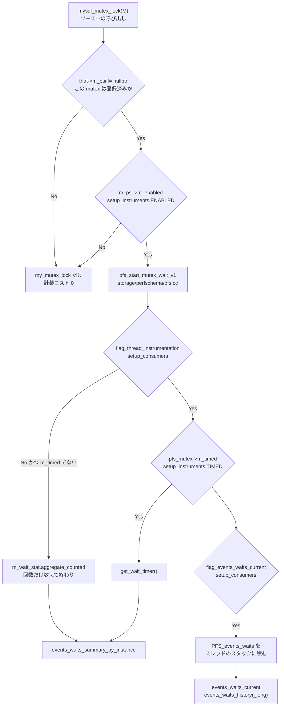

## 何を学んだか

`performance_schema` は「メモリ上にあるテーブル」というより、**サーバ全体に埋め込まれた計装点と、その結果を貯めた固定サイズのバッファ群**だ。SQL から見える 113 個のテーブルは、そのバッファを読む view にすぎない。

読みどころは、オーバーヘッドをどう抑えているかだ。計装点は `mysql_mutex_lock` のようなマクロとしてソース全体に散らばっているが、有効でないときのコストは**ポインタ比較 1 回と bool 比較 1 回**まで削ってある。そこから先は 3 段のゲートを通り、通過した段だけ仕事が増える。



もう 1 つの読みどころは、メモリ量の決め方だ。`performance_schema_*` のサイジング変数の多くは既定値が `-1` (`PFS_AUTOSCALE_VALUE`) で、これは「起動時に他の変数から決める」という意味になる。決め方は連続的な計算ではなく、**small / medium / large の 3 つのハードコードされたプロファイルから 1 つ選ぶ**だけだ。

## ソースコードのどこか

### 計装マクロの中身

計装点はマクロから inline 関数に展開される。mutex なら [`include/mysql/psi/mysql_mutex.h#L242`](https://github.com/mysql/mysql-server/blob/mysql-8.4.11/include/mysql/psi/mysql_mutex.h#L242) の `inline_mysql_mutex_lock` だ。

```cpp title="include/mysql/psi/mysql_mutex.h"
#ifdef HAVE_PSI_MUTEX_INTERFACE
  if (that->m_psi != nullptr) {
    if (that->m_psi->m_enabled) {
      /* Instrumentation start */
      PSI_mutex_locker *locker;
      PSI_mutex_locker_state state;
      locker = PSI_MUTEX_CALL(start_mutex_wait)(
          &state, that->m_psi, PSI_MUTEX_LOCK, src_file, src_line);

      /* Instrumented code */
      result = my_mutex_lock(&that->m_mutex ...);

      /* Instrumentation end */
      if (locker != nullptr) {
        PSI_MUTEX_CALL(end_mutex_wait)(locker, result);
      }

      return result;
    }
  }
#endif

  /* Non instrumented code */
  result = my_mutex_lock(&that->m_mutex ...);
```

外側の分岐は「この mutex に PSI オブジェクトが割り当てられているか」、内側は `PSI_instr::m_enabled` (= `setup_instruments.ENABLED`) だ。両方通らなければ、素の `pthread_mutex_lock` に 2 回の分岐が乗るだけになる。`PSI_mutex_locker_state` はスタック上のローカル変数なので、ここでの確保もない。

`mysql_mutex_lock(M)` が `__FILE__` / `__LINE__` を渡すのも設計の一部で、`events_waits_current` の `SOURCE` 列はここから来ている。

### サーバ側の実装 — 3 段のゲート

`PSI_MUTEX_CALL(start_mutex_wait)` の実体は [`pfs_start_mutex_wait_v1` (`storage/perfschema/pfs.cc#L3775`)](https://github.com/mysql/mysql-server/blob/mysql-8.4.11/storage/perfschema/pfs.cc#L3775)。冒頭のコメントが分業を明示している。

```cpp title="storage/perfschema/pfs.cc"
  /* The caller checks for m_enabled. */
#if 0
  if (!pfs_mutex->m_enabled) {
    return nullptr;
  }
#endif

  uint flags;
  ulonglong timer_start = 0;

  if (flag_thread_instrumentation) {
    PFS_thread *pfs_thread = my_thread_get_THR_PFS();
    ...
    if (pfs_mutex->m_timed) {
      timer_start = get_wait_timer();
      state->m_timer_start = timer_start;
      flags |= STATE_FLAG_TIMED;
    }

    if (flag_events_waits_current) {
      ...
      PFS_events_waits *wait = pfs_thread->m_events_waits_current;
```

`flag_thread_instrumentation` が偽で `m_timed` も偽なら、最短経路に落ちる。

```cpp title="storage/perfschema/pfs.cc"
    } else {
      /*
        Complete shortcut.
      */
      /* Aggregate to EVENTS_WAITS_SUMMARY_BY_INSTANCE (counted) */
      pfs_mutex->m_mutex_stat.m_wait_stat.aggregate_counted();
      return nullptr;
    }
```

つまり `TIMED='NO'` にすると**時計を読まなくなる**。回数だけは数えるので `COUNT_STAR` は動き続ける。時計 (`get_wait_timer()`) が P_S のコストの主成分なので、「オーバーヘッドが気になるが回数は見たい」ときの正しい設定は `ENABLED='YES', TIMED='NO'` になる。

`flag_*` は 16 個ある consumer のグローバルなキャッシュで、[`storage/perfschema/pfs_server.cc#L195`](https://github.com/mysql/mysql-server/blob/mysql-8.4.11/storage/perfschema/pfs_server.cc#L195) 以降でまとめて代入される。`setup_consumers` の行を `UPDATE` するとこの bool が書き換わる。

### `setup_*` テーブル

8 枚ある。`storage/perfschema/table_setup_*.cc` がそれぞれ 1 枚ずつ実装している。

| テーブル                                           | 何を制御するか                                 | 実装                                                                                                                                      |
| -------------------------------------------------- | ---------------------------------------------- | ----------------------------------------------------------------------------------------------------------------------------------------- |
| `setup_instruments`                                | 計装点ごとの `ENABLED` / `TIMED`               | [`table_setup_instruments.cc`](https://github.com/mysql/mysql-server/blob/mysql-8.4.11/storage/perfschema/table_setup_instruments.cc)     |
| `setup_consumers`                                  | 収集先ごとの `ENABLED` (16 行固定)             | [`table_setup_consumers.cc#L47`](https://github.com/mysql/mysql-server/blob/mysql-8.4.11/storage/perfschema/table_setup_consumers.cc#L47) |
| `setup_objects`                                    | スキーマ / テーブル単位の対象絞り込み          | [`table_setup_objects.cc`](https://github.com/mysql/mysql-server/blob/mysql-8.4.11/storage/perfschema/table_setup_objects.cc)             |
| `setup_actors`                                     | ユーザ / ホスト単位の対象絞り込み              | [`table_setup_actors.cc`](https://github.com/mysql/mysql-server/blob/mysql-8.4.11/storage/perfschema/table_setup_actors.cc)               |
| `setup_threads`                                    | スレッドクラスごとの `ENABLED` / `HISTORY`     | [`table_setup_threads.cc`](https://github.com/mysql/mysql-server/blob/mysql-8.4.11/storage/perfschema/table_setup_threads.cc)             |
| `setup_meters` / `setup_metrics` / `setup_loggers` | OpenTelemetry 向けのメータ・メトリック・ロガー | `table_setup_meters.cc` ほか                                                                                                              |

`setup_instruments` の列は [`table_setup_instruments.cc#L54`](https://github.com/mysql/mysql-server/blob/mysql-8.4.11/storage/perfschema/table_setup_instruments.cc#L54) にそのまま書いてある。

```cpp title="storage/perfschema/table_setup_instruments.cc"
    "  NAME VARCHAR(128) not null,\n"
    "  ENABLED ENUM ('YES', 'NO') not null,\n"
    "  TIMED ENUM ('YES', 'NO'),\n"
    "  PROPERTIES SET('singleton', 'progress', 'user', 'global_statistics', "
    ...
    "  VOLATILITY int not null,\n"
    "  DOCUMENTATION LONGTEXT,\n"
```

`TIMED` が nullable なのは、時間を測らない種類の計装点 (memory、error など) があるからだ。`DOCUMENTATION` にはソースに書かれた説明文がそのまま入る。

`setup_consumers` の 16 行は [`table_setup_consumers.cc#L47`](https://github.com/mysql/mysql-server/blob/mysql-8.4.11/storage/perfschema/table_setup_consumers.cc#L47) にハードコードされている。`events_{waits,stages,statements,transactions}_{current,history,history_long}` の 12 個に、`events_statements_cpu` / `global_instrumentation` / `thread_instrumentation` / `statements_digest` を加えた数だ。行を挿入することはできない。

### 計装点のクラス数はコンパイル時に決まる

計装点の**種類**の上限は [`storage/perfschema/pfs_server.h#L57`](https://github.com/mysql/mysql-server/blob/mysql-8.4.11/storage/perfschema/pfs_server.h#L57) のマクロで固定されている。

```cpp title="storage/perfschema/pfs_server.h"
#define PFS_AUTOSCALE_VALUE (-1)
#define PFS_AUTOSIZE_VALUE (-1)

#ifndef PFS_MAX_MUTEX_CLASS
#define PFS_MAX_MUTEX_CLASS 350
#endif
#ifndef PFS_MAX_RWLOCK_CLASS
#define PFS_MAX_RWLOCK_CLASS 100
#endif
#ifndef PFS_MAX_COND_CLASS
#define PFS_MAX_COND_CLASS 150
#endif
```

`wait/synch/mutex/...` という名前の種類が最大 350 個、という意味だ。**インスタンスの数**ではない。プラグインが計装点を登録するとここを消費するので、`Performance_schema_mutex_classes_lost` というステータス変数で溢れを検出できるようになっている。

### 自動サイジングは 3 択

`PFS_AUTOSCALE_VALUE` / `PFS_AUTOSIZE_VALUE` はどちらも `-1` で、[`sql/sys_vars.cc`](https://github.com/mysql/mysql-server/blob/mysql-8.4.11/sql/sys_vars.cc#L721) の多数の `performance_schema_*` 変数の既定値になっている。これを実際の数に変えるのが [`pfs_automated_sizing` (`storage/perfschema/pfs_autosize.cc#L159`)](https://github.com/mysql/mysql-server/blob/mysql-8.4.11/storage/perfschema/pfs_autosize.cc#L159) で、中身は驚くほど単純だ。

```cpp title="storage/perfschema/pfs_autosize.cc"
PFS_sizing_data small_data = {
    /* History sizes */
    5, 100, 5, 100, 5, 100, 5, 100,
    /* Digests */
    1000,
    /* Session connect attrs. */
    512};
...
static PFS_sizing_data *estimate_hints(const PFS_global_param *param) {
  if ((param->m_hints.m_max_connections <= MAX_CONNECTIONS_DEFAULT) &&
      (param->m_hints.m_table_definition_cache <= TABLE_DEF_CACHE_DEFAULT) &&
      (param->m_hints.m_table_open_cache <= TABLE_OPEN_CACHE_DEFAULT)) {
    /* The my.cnf used is either unchanged, or lower than factory defaults. */
    return &small_data;
  }
  ...
  /* Looks like a server in production. */
  return &large_data;
}
```

`max_connections` / `table_definition_cache` / `table_open_cache` の 3 つを既定値と比べ、すべて既定以下なら `small`、2 倍以下なら `medium`、それ以上なら `large` を選ぶ。[`apply_heuristic` (L111)](https://github.com/mysql/mysql-server/blob/mysql-8.4.11/storage/perfschema/pfs_autosize.cc#L111) が `< 0` のフィールドだけをプロファイルの値で埋める。

`small` と `large` の差は `events_*_history_long` が 100 対 10000、digest が 1000 対 10000 だ。**`max_connections` を上げただけで `events_statements_history_long` が 100 倍になる**ということで、P_S のメモリが急に増えたときはここを疑う。

行を貯めるバッファ自体は [`PFS_buffer_scalable_container` (`storage/perfschema/pfs_buffer_container.h`)](https://github.com/mysql/mysql-server/blob/mysql-8.4.11/storage/perfschema/pfs_buffer_container.h#L97) が管理し、ページ単位に遅延確保する。起動時に上限ぶんを一気に確保するわけではないので、`SHOW STATUS LIKE 'Performance_schema%'` の `_lost` カウンタが 0 のあいだは実メモリが上限に届いていないこともある。

### ダイジェストのキーはスキーマ名込み

[`PFS_digest_key` (`storage/perfschema/pfs_digest.h#L53`)](https://github.com/mysql/mysql-server/blob/mysql-8.4.11/storage/perfschema/pfs_digest.h#L53) は 2 つのフィールドを持つ。

```cpp title="storage/perfschema/pfs_digest.h"
struct PFS_digest_key {
  PFS_schema_name m_schema_name;
  unsigned char m_hash[DIGEST_HASH_SIZE];
};
```

`events_statements_summary_by_digest` の行はこの組で識別される。[レキサが計算するダイジェスト](./statement-digest/)自体はスキーマ名を含まないので、**同じ SQL を別のデフォルトスキーマで実行すると別の行になる**。`SCHEMA_NAME` 列を無視して `DIGEST` だけで集計すると二重に数える。

`PFS_statements_digest_stat` はダイジェストごとに `PFS_statement_stat` (実行回数・時間・行数などの集計) と `PFS_histogram`、そして代表クエリのサンプル 1 本 (`m_query_sample`) を持つ。`QUERY_SAMPLE_TEXT` はその 1 本で、いちばん遅かったものが `m_query_sample_timer_wait` の比較で残る。

### `.h.pp` は実装ではなく ABI のスナップショット

`include/mysql/psi/` には `psi_abi_mutex_v1.h` と `psi_abi_mutex_v1.h.pp` のような対が並んでいる。`.h` 側は 3 行しかない。

```cpp title="include/mysql/psi/psi_abi_mutex_v1.h"
#define HAVE_PSI_MUTEX_INTERFACE
#define MY_GLOBAL_INCLUDED
#define MY_PSI_CONFIG_INCLUDED
#include "mysql/psi/psi_mutex.h"
```

`.pp` はこれをプリプロセッサに通した結果をリポジトリにコミットしたものだ。ビルド時に [`cmake/do_abi_check.cmake`](https://github.com/mysql/mysql-server/blob/mysql-8.4.11/cmake/do_abi_check.cmake) が同じ手順で `.out` を生成し、`.pp` と `diff` する。差分が出たらビルドが落ちる。

> A ABI change that causes a build to fail will always be accompanied by new canons (.out files). ... A developer with a justified API change will then do a `mv <build directory>/abi_check.out include/mysql/plugin.pp` to replace the old canons with the new ones.

つまり `.h.pp` を読んでも P_S の実装は何も分からない。「この構造体レイアウトを勝手に変えるな」という宣言だ。P_S の計装点はプラグインやストレージエンジンから呼ばれるので、構造体を変えると既存のバイナリが壊れる。

## なぜそうなっているか

### なぜ判定を 3 段に分けたか

計装点は MySQL のソース全体に数万か所ある。すべてを 1 個のグローバルフラグで切り替えるだけなら簡単だが、それでは「特定の mutex だけ見る」ができない。逆に毎回テーブルを引いていたら遅すぎる。

そこで、判定に必要な情報を**判定する場所ごとに一番近い場所へ複製**してある。

- `PSI_instr::m_enabled` — 計装点オブジェクトの中。呼び出し側から 1 回のロードで読める
- `flag_*` — グローバル変数。`PFS_ALIGNED` が付いていて false sharing を避けている
- `PFS_thread::m_enabled` — スレッドローカルの `THR_PFS` から辿る

`setup_instruments` を `UPDATE` すると、対応する全インスタンスの `m_enabled` を書き換えて回る (`update_instruments_derived_flags`)。読む側を速くするために、書く側でコストを払う設計だ。

### なぜ自動サイジングが 3 択なのか

「メモリを N% 使う」のような連続的な式にすると、`my.cnf` を少し変えるたびにメモリ使用量が変わり、再現性がなくなる。3 つの離散的なプロファイルなら、閾値をまたがない限り同じ値になる。

そして選択のヒントに使う 3 変数 (`max_connections`、`table_definition_cache`、`table_open_cache`) は、いずれも「このサーバがどれくらいの規模を想定しているか」の代理指標だ。コメントもそう書いている — 既定のままなら開発機、2 倍程度なら中規模、それ以上なら本番。

### なぜ `SHOW PROCESSLIST` に 2 実装あるのか

`performance_schema_show_processlist` ([`sql/sys_vars.cc#L572`](https://github.com/mysql/mysql-server/blob/mysql-8.4.11/sql/sys_vars.cc#L572)) を `ON` にすると、`SHOW PROCESSLIST` の実装が P_S の `processlist` テーブル側に切り替わる。既定は `OFF` だ。

```cpp title="sql/sys_vars.cc"
static Sys_var_bool Sys_pfs_processlist(
    "performance_schema_show_processlist",
    "Default startup value to enable SHOW PROCESSLIST "
    "in the performance schema.",
    GLOBAL_VAR(pfs_processlist_enabled), CMD_LINE(OPT_ARG), DEFAULT(false),
```

理由は `LOCK_thd_data` の競合だ。従来の実装は全 `THD` を走査して 1 本ずつ mutex を取るので、接続数が多いサーバでは `SHOW PROCESSLIST` 自体がスループットを落とす。P_S 版はスレッドごとに用意された P_S のバッファを読むので、実行中のセッションを止めない。変数を更新すると deprecation の警告が出る ([L560](https://github.com/mysql/mysql-server/blob/mysql-8.4.11/sql/sys_vars.cc#L560))。

> When it is removed, SHOW PROCESSLIST will always use the performance schema implementation.

いずれ P_S 版に一本化される。

## どう活かすか

**P_S のオーバーヘッドを測らずに全部切らない。** 切るべき順番は決まっている。まず `setup_instruments` の `TIMED` を `NO` にすると時計読みが消えて、回数だけ残る。それでも足りなければ `ENABLED` を `NO` にする。最後の手段が `performance_schema=OFF` で、これは再起動が要る。`wait/synch/%` (mutex・rwlock・cond) がいちばん数が多く、既定でも大半は無効になっている。

**`Performance_schema_%_lost` を監視する。** `SHOW GLOBAL STATUS LIKE 'Performance_schema%'` に `_lost` で終わるカウンタが並ぶ。0 でなければサイジングが足りず、**データが黙って落ちている**。`Performance_schema_digest_lost` が増えていれば、ダイジェストの配列が埋まって**新しいクエリがすべて配列の 0 番の行に合算されている** ([`pfs_digest.cc#L301`](https://github.com/mysql/mysql-server/blob/mysql-8.4.11/storage/perfschema/pfs_digest.cc#L301))。その行は `DIGEST` が `NULL` で出るので、`NULL` の行の `COUNT_STAR` が大きければ `performance_schema_digests_size` を上げる。

**`events_statements_summary_by_digest` を `SCHEMA_NAME` ごとに見る。** キーが「スキーマ名 + ハッシュ」なので、同じクエリでも接続時の `USE` が違えば別行になる。マルチテナントで DB を分けている構成では、同じ SQL が数百行に散る。集計するなら `GROUP BY DIGEST` する。

**`events_waits_*` は既定で無効。** 「`events_waits_current` が空だ」というのはバグではない。`setup_consumers` の `events_waits_current` は既定 `NO` だ。`SUM_TIMER_WAIT` 系の集計テーブル (`events_waits_summary_by_instance` など) は consumer と無関係に埋まるので、まずそちらを見る。

**接続数を増やしたら P_S のメモリが跳ねた。** `max_connections` が既定 (`MAX_CONNECTIONS_DEFAULT`) を超えると `estimate_hints` が `medium` / `large` に切り替わり、`events_*_history_long` が 100 → 1000 → 10000 に増える。`performance_schema_events_statements_history_long_size` を明示的に指定すれば、自動サイジングの対象外になる。

**`SHOW PROCESSLIST` が重い。** 接続数が多いなら `performance_schema_show_processlist=ON` にするか、直接 `performance_schema.processlist` を読む。従来実装は `THD` ごとに `LOCK_thd_data` を取る ([接続層](./connection-layer/))。

**遅いクエリの実体を P_S から掘る。** `SUM_TIMER_WAIT` の大きいダイジェストを見つけたら、`SUM_CREATED_TMP_DISK_TABLES` ([内部一時表](./materialization-and-temptable/))、`SUM_SORT_MERGE_PASSES` ([filesort](./filesort/))、`SUM_NO_INDEX_USED` ([アクセスパスの選択](./access-path-selection/)) を見ると、どの層が原因かの当たりが付く。これらのカウンタは `SHOW STATUS` の同名変数と同じ場所で加算されている ([ログとステータス変数](./logs-and-status-variables/))。ロック待ちなら [data_locks と sys スキーマ](./data-locks-and-sys-schema/)へ、実行計画なら [EXPLAIN ANALYZE](./explain-analyze-and-tree/) へ進む。
