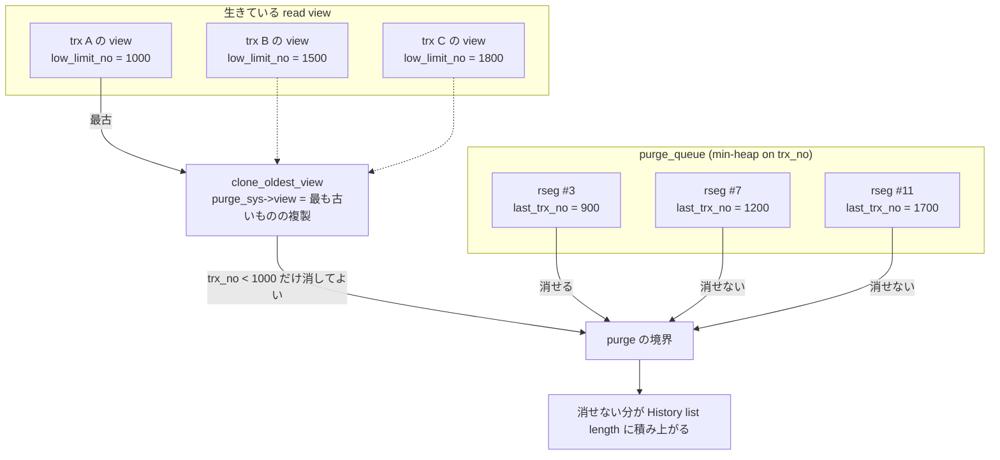

> **前提**: [undo ログ](./undo-log/) / [read view と可視性](./read-view-and-visibility/)

## 何を学んだか

InnoDB の `DELETE` は行を消さない。レコードに delete-mark を立てて、旧値を undo に残し、コミットする。`UPDATE` も同じで、旧版は undo ログの中に残る ([undo ログのページ](./undo-log/))。**この「残したもの」を後から回収するのが purge だ。**

回収してよいかどうかの判定は、たった 1 つの数で決まる。

```cpp title="storage/innobase/trx/trx0purge.cc (L2213)"
  if (purge_sys->iter.trx_no >= purge_sys->view.low_limit_no()) {
    return nullptr;
  }
```

`purge_sys->view` は**その時点で生きている最も古い read view のコピー**だ。purge はそれより新しい `trx_no` の undo に触らない。ここから、この章でいちばん実務に効く一文が出る。

**purge が追いつかないというのは、たいてい「古い read view が生きている」ということであって、purge スレッドが遅いということではない。**

`SHOW ENGINE INNODB STATUS` の `History list length` が伸び続けるとき、疑うべき順序は次のようになる。

1. **長いトランザクションが 1 本ある** — `SELECT` だけのトランザクションでも、REPEATABLE READ なら最初の読みで read view が固定され、コミットするまで purge を止める
2. **書き込みが purge の処理能力を超えている** — このときだけ `innodb_purge_threads` や `innodb_purge_batch_size` の話になる
3. **purge が止められている** — `PURGE_STATE_STOP`、read-only モード、`innodb_force_recovery >= 2`

1 と 2 は打ち手がまったく違う。1 に対して purge スレッドを増やしても、**そもそも消してよい版が 1 つも無い**ので何も起きない。



## なぜそうなっているか

**purge が必要なのは、InnoDB が「テーブル本体には最新版だけを置き、古い版は undo に退避する」という選択をしたからだ。** PostgreSQL は新旧の版をテーブル本体に並べて置き、VACUUM が死んだ版を回収する。InnoDB は本体を常に最新に保つ代わりに、undo 側にごみが溜まる。回収するものが「テーブルのページ」ではなく「undo のセグメント」になっただけで、**古い読者が居る間は回収できない**という制約は同じだ。この対比は[MVCC の前提ページ](./mvcc-basics/)にある。

**キューの要素を rseg にしたのは、トランザクション単位だとキューが際限なく伸びるからだ。** 1 秒に 1 万トランザクションをコミットする系で、purge が 1 分遅れたら 60 万要素になる。rseg 単位にすれば要素数は rseg の本数で頭打ちになり、それぞれの rseg の中は history list という連結リストが `trx_no` 順を保つ。**「順序付きの短いキュー」と「順序付きの長いリスト」を組み合わせて、優先度キューのサイズを抑えている。**

`last_page_no == FIL_NULL` のときだけ push する条件も、この構造から出ている。rseg が既にキューに入っているなら、その rseg の history list に繋ぐだけでよい。コメントの「User threads only produce events when a rollback segment is empty」がそれを言っている。

**purge の境界を「最古の read view」1 つに単純化したのは、正確さより判定の安さを取った結果だ。** 厳密には「どの生きている view からも見えない版」を消してよいので、view が {1000, 1500, 1800} のとき `trx_no` が 1200 の版は trx A からしか見えず、A がその行を読まないなら消せる。しかしそれを判定するには全 view と全行の関係を調べる必要がある。**最古の view だけを見れば、O(1) の比較 1 回で安全側に倒せる。** その代償が「1 本の長い読み取りが全体の purge を止める」という挙動である。

**DML に sleep を挿すという手段が乱暴なのは、他に効く手が無いからだ。** purge が追いつかないのは書き込みが速すぎるからで、書き込みを遅くする以外に history list を縮める方法がない。既定で無効 (`innodb_max_purge_lag = 0`) になっているのは、**この機能が「サーバが死ぬよりはマシ」という最後の砦**であって、日常的に踏む場所ではないからだ。

## ソースコードのどこか

### キューに積まれるのは「空だった rseg」だけ

コミット時、undo ログは rollback segment の history list の先頭に繋がれる ([`trx_purge_add_update_undo_to_history` (`trx0purge.cc#L315`)](https://github.com/mysql/mysql-server/blob/mysql-8.4.11/storage/innobase/trx/trx0purge.cc#L315))。同じ関数の中で `History list length` のカウンタが増え、必要なら purge が起こされる。

```cpp title="storage/innobase/trx/trx0purge.cc (L368)"
  if (update_rseg_history_len) {
    trx_sys->rseg_history_len.fetch_add(n_added_logs);
    if (trx_sys->rseg_history_len.load() >
        srv_n_purge_threads * srv_purge_batch_size) {
      srv_wake_purge_thread_if_not_active();
    }
  }
```

**起こす閾値が `innodb_purge_threads × innodb_purge_batch_size`** になっている。既定の 4 × 300 なら 1200 件で、それ未満なら purge は寝たまま (ただし master thread が毎秒起こしに来る、[スレッド一覧のページ](./innodb-threads-walkthrough/))。

そして purge のキューに積まれる条件は、[`trx0trx.cc#L1535`](https://github.com/mysql/mysql-server/blob/mysql-8.4.11/storage/innobase/trx/trx0trx.cc#L1535) にある。

```cpp title="storage/innobase/trx/trx0trx.cc"
  /* If the rollack segment is not empty then the
  new trx_t::no can't be less than any trx_t::no
  already in the rollback segment. User threads only
  produce events when a rollback segment is empty. */
  if ((redo_rseg != nullptr && redo_rseg->last_page_no == FIL_NULL) ||
      (temp_rseg != nullptr && temp_rseg->last_page_no == FIL_NULL)) {
    TrxUndoRsegs elem;
    ...
    purge_sys->purge_queue->push(std::move(elem));
```

**キューの要素はトランザクションではなく rollback segment だ。** しかも `last_page_no == FIL_NULL` (= その rseg の history list が空だった) ときにしか push しない。一度 push された rseg は、purge が空にするまでキューに入りっぱなしになる。

だから**キューの長さは rseg の本数で頭打ちになる**。1 億件の undo が溜まっていても、キューの要素数は高々 rseg の数 (既定では undo tablespace 2 個 × 128 + テンポラリ分) にしかならない。`History list length` とキューの長さは別物である。

### キューの型 — `trx_no` の min-heap

[`storage/innobase/include/trx0types.h#L628`](https://github.com/mysql/mysql-server/blob/mysql-8.4.11/storage/innobase/include/trx0types.h#L628)。

```cpp title="storage/innobase/include/trx0types.h"
typedef std::priority_queue<
    TrxUndoRsegs, std::vector<TrxUndoRsegs, ut::allocator<TrxUndoRsegs>>,
    TrxUndoRsegs>
    purge_pq_t;
```

比較関数が要素型自身 ([`TrxUndoRsegs` (L554)](https://github.com/mysql/mysql-server/blob/mysql-8.4.11/storage/innobase/include/trx0types.h#L554)) を兼ねている、という珍しい書き方をしている。比較の中身は [L610](https://github.com/mysql/mysql-server/blob/mysql-8.4.11/storage/innobase/include/trx0types.h#L610)。

```cpp title="storage/innobase/include/trx0types.h"
  /** Compare two TrxUndoRsegs based on trx_no.
  @param lhs first element to compare
  @param rhs second element to compare
  @return true if elem1 > elem2 else false.*/
  bool operator()(const TrxUndoRsegs &lhs, const TrxUndoRsegs &rhs) {
    return (lhs.m_trx_no > rhs.m_trx_no);
  }
```

`>` を返すので `std::priority_queue` は **min-heap** になる。top が最も古い `trx_no` だ。purge は古い順にしか進めないので、この順序が本質的になる。

`TrxUndoRsegs` が保持する rseg は最大 2 本 (`Rsegs_array<2>`) で、`ut_a(m_rsegs_n < 2)` が守っている。1 トランザクションが使う rseg は redo 用と temporary 用の高々 2 本だからだ。

取り出し側は [`TrxUndoRsegsIterator::set_next` (`trx0purge.cc#L108`)](https://github.com/mysql/mysql-server/blob/mysql-8.4.11/storage/innobase/trx/trx0purge.cc#L108)。**同じ `trx_no` の要素は取り出しながら合流させる。**

```cpp title="storage/innobase/trx/trx0purge.cc"
  mutex_enter(&m_purge_sys->pq_mutex);

  /* Only purge consumes events from the priority queue, user
  threads only produce the events. */
```

コメントが production / consumption の役割分担を明示している。**キューの consumer は purge coordinator 1 本だけ**なので、`pq_mutex` の競合はほぼ producer 側 (コミットするユーザスレッド) の間でしか起きない。

### 境界を決めるのは最古の read view

purge バッチの入口 [`trx_purge` (`trx0purge.cc#L2388`)](https://github.com/mysql/mysql-server/blob/mysql-8.4.11/storage/innobase/trx/trx0purge.cc#L2388) が、毎回 view を取り直す。

```cpp title="storage/innobase/trx/trx0purge.cc"
  srv_dml_needed_delay = trx_purge_dml_delay();

  /* The number of tasks submitted should be completed. */
  ut_a(purge_sys->n_submitted == purge_sys->n_completed);

  rw_lock_x_lock(&purge_sys->latch, UT_LOCATION_HERE);

  trx_sys->mvcc->clone_oldest_view(&purge_sys->view);

  rw_lock_x_unlock(&purge_sys->latch);
```

[`MVCC::clone_oldest_view` (`read0read.cc#L627`)](https://github.com/mysql/mysql-server/blob/mysql-8.4.11/storage/innobase/read/read0read.cc#L627) は、`trx_sys` の mutex を取って最も古い view を探し、複製する。

```cpp title="storage/innobase/read/read0read.cc"
void MVCC::clone_oldest_view(ReadView *view) {
  trx_sys_mutex_enter();

  ReadView *oldest_view = get_oldest_view();

  if (oldest_view == nullptr) {
    view->prepare(0);
    trx_sys_mutex_exit();
  } else {
    view->copy_prepare(*oldest_view);
    trx_sys_mutex_exit();
    view->copy_complete();
  }
  /* Update view to block purging transaction till GTID is persisted. */
  auto &gtid_persistor = clone_sys->get_gtid_persistor();
  auto gtid_oldest_trxno = gtid_persistor.get_oldest_trx_no();
  view->reduce_low_limit(gtid_oldest_trxno);
}
```

最後の 3 行が見落としやすい。**GTID の永続化が遅れていると、read view が 1 つも無くても purge の境界が下げられる。** GTID persister スレッド ([`clone0repl.cc`](https://github.com/mysql/mysql-server/blob/mysql-8.4.11/storage/innobase/clone/clone0repl.cc#L731)) が `mysql.gtid_executed` に書き終わるまで、その分の undo は消せない。`gtid_mode=ON` の環境で「長いトランザクションが無いのに History list length が下がりきらない」ときの候補になる。

read view の中身 (`low_limit_no` を含む 3 つの数と 1 つのリスト) は[read view と可視性のページ](./read-view-and-visibility/)にある。

undo tablespace の truncate も同じ境界を使う ([`trx0purge.cc#L1609`](https://github.com/mysql/mysql-server/blob/mysql-8.4.11/storage/innobase/trx/trx0purge.cc#L1609))。

```cpp title="storage/innobase/trx/trx0purge.cc"
  ut_ad(limit->trx_no <= purge_sys->view.low_limit_no());
```

**`innodb_undo_log_truncate` が効かない**という現象も、たいていは同じ根っこ (undo が消せていないので truncate できない) に行き着く。

### 使うスレッド数は毎バッチ増減する

[`srv_do_purge` (`srv0srv.cc#L2891`)](https://github.com/mysql/mysql-server/blob/mysql-8.4.11/storage/innobase/srv/srv0srv.cc#L2891) が、`innodb_purge_threads` を上限としたプールとして扱う。

```cpp title="storage/innobase/srv/srv0srv.cc"
    if (trx_sys->rseg_history_len.load() > rseg_history_len ||
        (srv_max_purge_lag > 0 && rseg_history_len > srv_max_purge_lag)) {
      /* History length is now longer than what it was
      when we took the last snapshot. Use more threads. */

      if (n_use_threads < n_threads) {
        ++n_use_threads;
      }

    } else if (srv_check_activity(old_activity_count) && n_use_threads > 1) {
      /* History length same or smaller since last snapshot,
      use fewer threads. */

      --n_use_threads;
```

**前回より history list が伸びていたら 1 本増やし、縮んでいたら 1 本減らす。** 1 バッチにつき ±1 という控えめな制御なので、負荷の急変には追随が遅い。`innodb_purge_threads` を上げても、実際に使われるまでにバッチを何回か回す必要がある。

コーディネータ本体 ([`srv_purge_coordinator_thread` (L3078)](https://github.com/mysql/mysql-server/blob/mysql-8.4.11/storage/innobase/srv/srv0srv.cc#L3078)) は「1 件も消せなかったら寝る」というだけのループになっている。

```cpp title="storage/innobase/srv/srv0srv.cc"
    if (srv_shutdown_state.load() < SRV_SHUTDOWN_PURGE &&
        (purge_sys->state == PURGE_STATE_STOP || n_total_purged == 0)) {
      srv_purge_coordinator_suspend(slot, rseg_history_len);
    }
```

**「消せる版が無い」と「仕事が無い」を区別していない。** 長いトランザクションが 1 本張り付いていると、purge coordinator はほぼずっと suspend していて CPU も使わない。`top -H` で `ib_srv_purge` が暇そうに見えるのは、詰まっていないという意味ではない。

### DML 側に sleep を挿す — `innodb_max_purge_lag`

[`trx_purge_dml_delay` (`trx0purge.cc#L2313`)](https://github.com/mysql/mysql-server/blob/mysql-8.4.11/storage/innobase/trx/trx0purge.cc#L2313)。

```cpp title="storage/innobase/trx/trx0purge.cc"
  if (srv_max_purge_lag > 0 && trx_sys->rseg_history_len.load() >
                                   srv_n_purge_threads * srv_purge_batch_size) {
    float ratio;

    ratio = float(trx_sys->rseg_history_len.load()) / srv_max_purge_lag;

    if (ratio > 1.0) {
      /* If the history list length exceeds the srv_max_purge_lag, the data
      manipulation statements are delayed by at least 5 microseconds. */
      delay = (ulint)((ratio - 0.9995) * 10000);
    }

    if (delay > srv_max_purge_lag_delay) {
      delay = srv_max_purge_lag_delay;
    }
```

計算した値はグローバル変数 `srv_dml_needed_delay` に入り、DML の入口で読まれる ([`row0mysql.cc#L140`](https://github.com/mysql/mysql-server/blob/mysql-8.4.11/storage/innobase/row/row0mysql.cc#L140))。

```cpp title="storage/innobase/row/row0mysql.cc"
/** Delays an INSERT, DELETE or UPDATE operation if the purge is lagging. */
static void row_mysql_delay_if_needed(void) {
  if (srv_dml_needed_delay) {
    std::this_thread::sleep_for(
        std::chrono::microseconds(srv_dml_needed_delay));
  }
}
```

**ただ `sleep_for` するだけ。** 遅延の単位はマイクロ秒で、`innodb_max_purge_lag_delay` (既定 0 = 上限なし) が天井になる。式は `(history / max_purge_lag - 0.9995) × 10000` μ 秒なので、`innodb_max_purge_lag = 100000` に対して history が 200000 なら 1 行あたり約 10 ミリ秒だ。

**`innodb_max_purge_lag_delay` を 0 のままにすると上限が効かない**という罠がある。`delay > srv_max_purge_lag_delay` の比較で、0 は「上限 0 μ 秒」ではなく `delay` が常に大きいので `delay = 0` になり、結果として遅延が無効になる。つまり `innodb_max_purge_lag` を設定しても `innodb_max_purge_lag_delay` を同時に設定しなければ何も起きない。

## どう活かすか

### `History list length` が伸びる

`SHOW ENGINE INNODB STATUS` の TRANSACTIONS セクションに 2 行が並ぶ ([`lock0lock.cc#L4487` 付近](https://github.com/mysql/mysql-server/blob/mysql-8.4.11/storage/innobase/lock/lock0lock.cc#L4487))。

```
Trx id counter 1902
Purge done for trx's n:o < 1000 undo n:o < 0 state: running but idle
History list length 384102
```

読み方は次のとおり。

| 見えるもの                                              | 意味                                                     | 次に見るもの                                              |
| ------------------------------------------------------- | -------------------------------------------------------- | --------------------------------------------------------- |
| `Purge done for trx's n:o` が伸びない                   | 最古の read view がそこで止まっている                    | `information_schema.INNODB_TRX` の `trx_started` が古い行 |
| `state: running but idle`                               | 消せる版が無くて寝ている。purge スレッドは詰まっていない | 同上                                                      |
| `state: running` で `n:o` は伸びるが history が減らない | 書き込みが purge を上回っている                          | `innodb_purge_threads`、`innodb_purge_batch_size`         |
| `state: disabled`                                       | read-only モードか `innodb_force_recovery >= 2`          | 起動オプション                                            |

**`state: running but idle` と出ているのに `History list length` が数十万ある、というのがいちばん典型的な形**で、これは「purge が遅い」ではなく「古い read view が生きている」の顔だ。

犯人の探し方はこう。

```sql
SELECT trx_id, trx_state, trx_started,
       TIMESTAMPDIFF(SECOND, trx_started, NOW()) AS age_sec,
       trx_mysql_thread_id, trx_query
  FROM information_schema.INNODB_TRX
 ORDER BY trx_started;
```

**`trx_query` が NULL でも無罪ではない。** REPEATABLE READ では最初の `SELECT` で read view が固定され、そのあとアプリケーションが何もせずコネクションを握っているだけでも purge は止まったままになる ([read view のページ](./read-view-and-visibility/))。ORM のトランザクション境界が広すぎる、バッチが `START TRANSACTION` したまま外部 API を叩いている、といったパターンが該当する。

READ COMMITTED なら文ごとに read view を取り直すので、**同じアプリケーションでも RC のほうが purge は進みやすい**。ただし長時間走る単一の `SELECT` は RC でもその文の間ずっと view を持つ。

### 症状と打ち手

- **「長いトランザクションが purge を止める」** — `INNODB_TRX` で `trx_started` の古い順に見る。アプリ側のトランザクション境界を縮める。`innodb_purge_threads` を上げても効かない
- **「purge lag で DML が遅延する」** — `innodb_max_purge_lag` を設定した環境でのみ起きる。`INNODB_METRICS` の `purge_dml_delay_usec` (`MONITOR_DML_PURGE_DELAY`) に現在の遅延が出る ([INNODB_METRICS のページ](./innodb-stats-and-metrics/))
- **「undo tablespace が縮まない」** — `innodb_undo_log_truncate` は消せる undo が無ければ何もできない。まず History list length を下げる
- **「削除したのにテーブルが縮まない」** — purge がレコードを物理削除しても B+tree のページは返らない。`OPTIMIZE TABLE` (InnoDB では実質 rebuild) の話になる ([ALTER のページ](./alter-algorithm-selection/))

### 監視するなら 2 つ

`History list length` は `SHOW ENGINE INNODB STATUS` をパースしないと取れないが、同じ値は `INNODB_METRICS` の `trx_rseg_history_len` からも取れる。

```sql
SELECT name, count FROM information_schema.INNODB_METRICS
 WHERE name IN ('trx_rseg_history_len', 'purge_dml_delay_usec',
                'purge_invoked', 'purge_undo_log_pages');
```

そして**最古のトランザクションの経過秒数**をアラートに載せる。History list length は書き込み量に比例して跳ねるので閾値を決めにくいが、「10 分以上生きているトランザクションが居る」は環境によらず異常だと言い切りやすい。

### `innodb_purge_threads` を上げてよいのはどこか

上げて効くのは「書き込みが purge の処理能力を上回っている」ケースだけで、その徴候は `Purge done for trx's n:o` が着実に伸びているのに history list も伸びている、という形になる。**`innodb_purge_threads` は再起動が必要**な read-only 変数で、既定値は CPU 数が 16 以下なら 1、それより多ければ 4 だ ([`ha_innodb.cc#L22313`](https://github.com/mysql/mysql-server/blob/mysql-8.4.11/storage/innobase/handler/ha_innodb.cc#L22313))。

動的に効くのは `innodb_purge_batch_size` (既定 300、1〜5000) のほうで、こちらは 1 バッチで処理する undo ページ数を決める。ただしこの値は「purge を起こす閾値」(`innodb_purge_threads × innodb_purge_batch_size`) にも掛かるので、大きくすると purge の起動自体が遅れる。**片側だけを見て決められない値である。**
