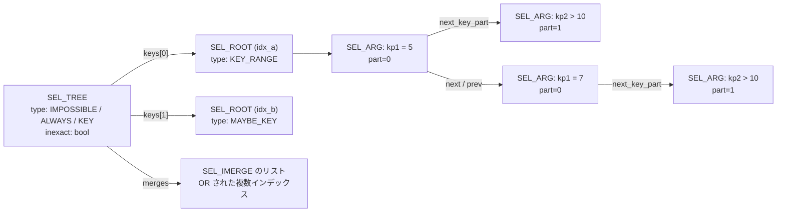

> **前提**: [JOIN::optimize](./optimizer-walkthrough/) / [統計とコストモデル](./statistics-and-cost-model/)

## 何を学んだか

range 分析の仕事は 1 つだ。**WHERE 句を、インデックスごとの「読むべきキー区間の集合」に翻訳する。**

`WHERE a = 5 AND b > 10` を、インデックス `(a, b)` に対して `[(5,10) < key <= (5,+inf)]` という区間に直す。この翻訳ができれば range スキャンが選択肢になり、できなければ選択肢にすらならない。「インデックスがあるのに使われない」の相当な部分は、**コスト比較で負けたのではなく、そもそも候補が作られなかった**ケースである。

8.4 では `sql/opt_range.cc` は存在せず、[`sql/range_optimizer/`](https://github.com/mysql/mysql-server/tree/mysql-8.4.11/sql/range_optimizer) に 36 ファイルへ分割されている。入口は [`test_quick_select` (`range_optimizer.cc#L484`)](https://github.com/mysql/mysql-server/blob/mysql-8.4.11/sql/range_optimizer/range_optimizer.cc#L484) 1 本で、パーティション pruning ([`partition_pruning.cc`](https://github.com/mysql/mysql-server/blob/mysql-8.4.11/sql/range_optimizer/partition_pruning.cc)) も同じ SEL_ARG グラフを使い回している。

このモジュールが作る候補は 6 種類ある。

| 候補                        | AccessPath::Type              | EXPLAIN の見え方                             |
| --------------------------- | ----------------------------- | -------------------------------------------- |
| 単一インデックスの range    | `INDEX_RANGE_SCAN`            | `type: range`                                |
| loose index scan (GROUP BY) | `GROUP_INDEX_SKIP_SCAN`       | `type: range` + `Using index for group-by`   |
| skip scan                   | `INDEX_SKIP_SCAN`             | `type: range` + `Using index for skip scan`  |
| ROR intersection            | `ROWID_INTERSECTION`          | `type: index_merge` + `Using intersect(...)` |
| index merge union           | `INDEX_MERGE` / `ROWID_UNION` | `type: index_merge` + `Using union(...)`     |
| (フルスキャンに負ける)      | —                             | `type: ALL`                                  |

## なぜそうなっているか

**「余計に読む」を許したのは、ブール代数を厳密に守ると候補がほとんど作れなくなるからだ。** `(a > 1 AND b > 2) OR c = 3` のような条件を区間の集合に厳密に写像するのは難しい。だが「必要な行を全部含む区間」なら簡単に作れる。読んだ後に条件を再評価するのはどうせ必要なので、緩い側に倒しても正しさは壊れない。この設計判断が `inexact` フラグとして明文化されたのは比較的最近で、旧オプティマイザは今もフラグを見ずに常に再評価している。

**SEL_ARG が赤黒木とリンクリストの二重構造なのは、区間の AND と OR の両方を速くやるためだ。** OR (`key_or`) は区間リストの併合で、順序が要る。AND (`key_and`) は交差で、検索が要る。`next`/`prev` の順序リストと `left`/`right` の探索木を同じノードに持たせることで、どちらも O(n log n) で回る。`use_count` による遅延コピーがあるのは、AND / OR のたびに巨大なグラフを複製しないためである。

**LIKE が「区間は作るが広い」で処理されるのは、そのほうが分岐が減るからだ。** 「先頭ワイルドカードなら候補を作らない」という特別扱いを入れると、`LIKE 'a%b%'` や照合順序の contraction のような中間ケースをどこで切るかを決めなければならない。全部同じ経路で区間を作り、広すぎる区間はコストモデルに落としてもらう、というほうが単純だ。**コストモデルが判断するので、テーブルが極端に小さければ `'%abc'` でもインデックスが選ばれることはありうる。**

**range 分析が join 順序より前に走るのは、順序探索が行数見積りを必要とするからだ。** 卵と鶏の関係になっていて、MySQL は「まず単独で分析し、他テーブル依存のものは `needed_reg` に置いて後回し」という順で切っている ([JOIN::optimize のページ](./optimizer-walkthrough/))。

## ソースコードのどこか

### SEL_ARG のグラフ

中心のデータ構造は 3 段になっている。

- **`SEL_TREE`** ([`tree.h#L872`](https://github.com/mysql/mysql-server/blob/mysql-8.4.11/sql/range_optimizer/tree.h#L872)) — テーブル 1 枚ぶん。`keys[i]` がインデックス `i` の区間集合、`merges` が index merge の候補
- **`SEL_ROOT`** ([`tree.h#L69`](https://github.com/mysql/mysql-server/blob/mysql-8.4.11/sql/range_optimizer/tree.h#L69)) — 1 つのキーパートに対する区間集合。赤黒木の根
- **`SEL_ARG`** ([`tree.h#L466`](https://github.com/mysql/mysql-server/blob/mysql-8.4.11/sql/range_optimizer/tree.h#L466)) — 「初等区間」1 個。`min_value <=? keypartX <=? max_value`

`SEL_ARG` は「同じキーパートの兄弟」と「次のキーパートへの子」の 2 方向に繋がる。ヘッダの図がそのまま構造を示している。

```
     tree->keys[i]
      |
      |             $              $
      |    part=1   $     part=2   $    part=3
      |             $              $
      |  +-------+  $   +-------+  $   +--------+
      |  | kp1<1 |--$-->| kp2=5 |--$-->| kp3=10 |
      |  +-------+  $   +-------+  $   +--------+
      |      |      $              $       |
      |      |      $              $   +--------+
      |      |      $              $   | kp3=12 |
      |      |      $              $   +--------+
      |  +-------+  $              $
      \->| kp1=2 |--$--------------$-+
         +-------+  $              $ |   +--------+
             |      $              $  ==>| kp3=11 |
         +-------+  $              $ |   +--------+
         | kp1=3 |--$--------------$-+       |
         +-------+  $              $     +--------+
             |      $              $     | kp3=14 |
            ...     $              $     +--------+
```

縦の線が `next` / `prev` (同じキーパートの区間リスト)、横の `-->` が `next_key_part` (次のキーパートへ) だ。同じキーパートの区間リストは赤黒木でもあり、`left` / `right` / `parent` で繋がっている。



`SEL_ROOT::Type` は 3 つで、`MAYBE_KEY` が独特だ。「このインデックスに範囲述語はあるが、他のテーブルの列を参照しているので今は使えない」という状態を表す。該当インデックスのビットが `JOIN_TAB::needed_reg` に立ち、join 順序が決まってから範囲最適化をやり直す判断材料になる。

### `get_mm_tree` — 条件木から SEL_TREE へ

[`range_analysis.cc#L845`](https://github.com/mysql/mysql-server/blob/mysql-8.4.11/sql/range_optimizer/range_analysis.cc#L845) が `Item` の木を再帰的に降り、AND なら `tree_and`、OR なら `tree_or` で SEL_TREE を合成する。葉は `get_mm_parts` → `get_mm_leaf` で、`Field` とキーパートの対応を見て `SEL_ARG` を 1 個作る。

この関数のドキュメントは、**正しさの基準をわざと緩めている**ことを宣言している。

```cpp title="sql/range_optimizer/range_analysis.cc (L804 付近)"
  get_mm_tree() employs a relaxed boolean algebra where the solution
  may be bigger than what the rules of boolean algebra accept. In
  other words, get_mm_tree() may return range access plans that will
  read more rows than the input conditions dictate.
  ...
  The effect of this is that the result includes a "bigger" solution than
  necessary. This is OK since all conditions will be used as filters
  after row retrieval.
```

**区間は必ず「必要な行を全部含む」が、「余計な行を含まない」保証はない。** 余計に読んだ行は取得後にフィルタで落とす。この一方向の緩さが `SEL_TREE::inexact` フラグ ([`tree.h#L921`](https://github.com/mysql/mysql-server/blob/mysql-8.4.11/sql/range_optimizer/tree.h#L921)) に記録される。

```cpp title="sql/range_optimizer/tree.h"
    If a SEL_TREE is inexact, the predicates must be rechecked after the
    range scan, using a filter. (Note that it is never too narrow, only ever
    exact or too broad.) The old join optimizer always does this, no matter
    what the inexact flag is set to.
```

最後の 1 文が効いている。**旧オプティマイザは inexact かどうかに関係なく常に条件を再評価する。** このフラグを本気で使うのは hypergraph 側だけだ。

### LIKE の扱い

[`range_analysis.cc#L1477`](https://github.com/mysql/mysql-server/blob/mysql-8.4.11/sql/range_optimizer/range_analysis.cc#L1477) から `LIKE_FUNC` の専用経路が始まる。パターン文字列から「取りうる最小のキー」と「最大のキー」を作って、その 1 区間を `SEL_ARG` にする。

```cpp title="sql/range_optimizer/range_analysis.cc (L1532)"
    like_error = my_like_range(
        field->charset(), res->ptr(), res->length(), like_func->escape(),
        wild_one, wild_many, field_length, (char *)min_str + offset,
        (char *)max_str + offset, &min_length, &max_length);
    if (like_error)  // Can't optimize with LIKE
      goto end;

    // LIKE is tricky to get 100% exact, especially with Unicode collations
    // (which can have contractions etc.), and will frequently be a bit too
    // broad. To be safe, we currently always set that LIKE range scans are
    // inexact and must be rechecked by means of a filter afterwards.
    *inexact = true;
```

その前に 2 つの早期脱出がある。

```cpp title="sql/range_optimizer/range_analysis.cc (L1500 / L1528)"
    if (field->cmp_type() != STRING_RESULT)
      goto end;  // Can only optimize strings
    ...
    // We can only optimize with LIKE if the escape string is known.
    if (!like_func->escape_is_evaluated()) goto end;
```

`my_like_range` の実体は照合順序ごとに差し替わる。8bit 照合の版 ([`strings/ctype-simple.cc#L833`](https://github.com/mysql/mysql-server/blob/mysql-8.4.11/strings/ctype-simple.cc#L833)) を読むと、**先頭が `%` でもエラーを返さない**ことが分かる。

```cpp title="strings/ctype-simple.cc"
    if (*ptr == w_many) /* '%' in SQL */
    {
      /* Calculate length of keys */
      *min_length = ((cs->state & MY_CS_BINSORT) ? (size_t)(min_str - min_org)
                                                 : res_length);
      *max_length = res_length;
      do {
        *min_str++ = 0;
        *max_str++ = (char)cs->max_sort_char;
      } while (min_str != min_end);
      return false;
    }
```

`%` に当たった時点で、残りの min を `\0` で、max を `max_sort_char` で埋め尽くして `false` (最適化可能) を返す。

- `LIKE 'abc%'` → min = `abc\0\0...`、max = `abc\xff\xff...`。**狭い区間**
- `LIKE '%abc'` → min = `\0\0\0...`、max = `\xff\xff\xff...`。**インデックス全体を覆う区間**

つまり `'%abc'` でも SEL_ARG は作られる。ただしその区間はインデックス全体なので、後のコスト比較でフルスキャン (あるいはカバリングインデックスのフルスキャン) に負ける。「range にならない」というより「**range になるが、常に負ける range にしかならない**」が正確だ。

`my_like_range` が真に `true` (最適化不可) を返すのは、不正なマルチバイト列 (`MY_CS_ILSEQ`) の場合だけである。

### 候補を作る順番

`test_quick_select` の後半は、候補を順に作って `best_cost` を更新していく。順番自体に意味がある ([`range_optimizer.cc#L595` 以降](https://github.com/mysql/mysql-server/blob/mysql-8.4.11/sql/range_optimizer/range_optimizer.cc#L595))。

1. **カバリングインデックスのフルスキャン**。`covering_keys` の中で最短のものと、テーブルスキャンのコストを比べて安いほうを基準線 `cost_est` にする
2. **`get_mm_tree`** で SEL_TREE を作る。`IMPOSSIBLE` なら即 `-1` を返す (これが `Impossible WHERE noticed after reading const tables`)
3. **`get_best_group_skip_scan`** — loose index scan。**SEL_TREE が無くても作れる**ので、順序がここ
4. **`get_best_skip_scan`** — `optimizer_switch` の `skip_scan`、またはヒント
5. **`get_key_scans_params`** — 普通の単一インデックス range。ここが本命
6. **`get_best_ror_intersect`** — ROR intersection。`DELETE` では作らない、降順では作らない
7. **`get_best_disjunct_quick`** — `tree->merges` から index merge union

`get_best_group_skip_scan` が range より先にあるのは、SEL_TREE が `KEY` 型でなくても (WHERE が無くても) GROUP BY だけで成立するからだ。

### `optimizer_switch` の読まれ方

index merge 系のフラグは関数の冒頭でまとめて読まれ、ローカル変数に落とされる。

```cpp title="sql/range_optimizer/range_optimizer.cc (L558)"
  const bool index_merge_allowed =
      thd->optimizer_switch_flag(OPTIMIZER_SWITCH_INDEX_MERGE);
  const bool index_merge_union_allowed =
      index_merge_allowed &&
      thd->optimizer_switch_flag(OPTIMIZER_SWITCH_INDEX_MERGE_UNION);
```

`index_merge=off` にすると `index_merge_union` / `index_merge_sort_union` / `index_merge_intersection` も全部無効になる。コメントにも `OPTIMIZER_SWITCH_INDEX_MERGE disables all index merge sub strategies` と書いてある。

## どう活かすか

### `LIKE` の前方一致と後方一致

- **`col LIKE 'abc%'`** — 狭い区間ができる。`type: range`、`Extra` に `Using where` (常に再評価するため)
- **`col LIKE '%abc'`** — インデックス全体の区間ができ、コストで負ける。実質 `type: ALL`。後方一致が必要なら、逆順の生成列にインデックスを張るか全文検索を使う
- **`col LIKE CONCAT(?, '%')`** — プリペアドステートメントでも、実行時に値が確定していれば区間は作られる。ただし `escape_is_evaluated()` が false になる書き方 (`ESCAPE` に非定数) では候補ごと作られない
- **数値列に `LIKE`** — `field->cmp_type() != STRING_RESULT` で即座に諦める。`WHERE int_col LIKE '123%'` は range にならない

### `OR` と index_merge

`WHERE a = 1 OR b = 2` は、`a` と `b` に別々のインデックスがあれば index merge union の候補になる。ならないときの典型は次のとおり。

- **片方にインデックスが無い** — 片方でも欠けると全体をフルスキャンするしかない
- **同じインデックスの別キーパート** — `(a, b)` 1 本しか無い場合、`b = 2` の側で区間が作れない
- **`index_merge=off`** — 手動で切っている、またはヒントで `NO_INDEX_MERGE`
- **コストで負けた** — index merge は行 ID のソートと重複除去が要るので、選択率が悪いと負ける

`OR` を `UNION ALL` に手で書き換えると速くなるのは、index merge のコストモデルを迂回して 2 本の range スキャンを強制できるからだ。

### 区間が作られたかを確認する

`optimizer_trace` の `range_analysis` オブジェクトを見るのが確実だ。

- `setup_range_conditions` — `get_mm_tree` の結果
- `analyzing_range_alternatives` — インデックスごとの `ranges` (実際の区間が文字列で出る)、`rows`、`cost`、`chosen`
- `chosen: false` + `cause: "cost"` — 区間はできたが負けた。統計を疑う ([統計とコストモデル](./statistics-and-cost-model/))
- そもそもインデックスが列挙されていない — 区間が作れていない。型変換か、キーパートの位置か、`LIKE` の形を疑う

### メモリ上限に当たることがある

`range_optimizer_max_mem_size` (既定 8MB) を超えると、range 最適化は途中で諦めて `ER_CAPACITY_EXCEEDED` と `ER_CAPACITY_EXCEEDED_IN_RANGE_OPTIMIZER` (`Range optimization was not done for this query.`) を警告として出す。`IN (...)` の要素が数万個あるクエリや、巨大な `OR` の並びで起きる。諦めた結果はフルスキャンなので、突然遅くなったのに EXPLAIN 以外に手がかりが無い、という形で現れる。`SHOW WARNINGS` を EXPLAIN の直後に打つと分かる。

### パーティション pruning も同じ構造を使う

[`partition_pruning.cc`](https://github.com/mysql/mysql-server/blob/mysql-8.4.11/sql/range_optimizer/partition_pruning.cc) は `get_mm_tree` を「実在しないインデックス」(パーティションキー) に対して呼ぶ。だから **range 分析が区間を作れない条件は、パーティション pruning も効かない**。`WHERE DATE(created_at) = '2024-01-01'` が pruning されないのは、`DATE(...)` が `Field` でなく関数なので `get_mm_leaf` に到達しないからだ ([パーティショニングのページ](./partitioning/))。
