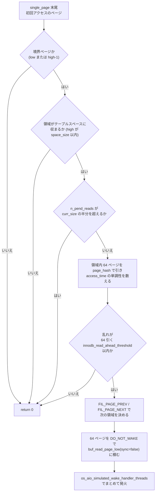
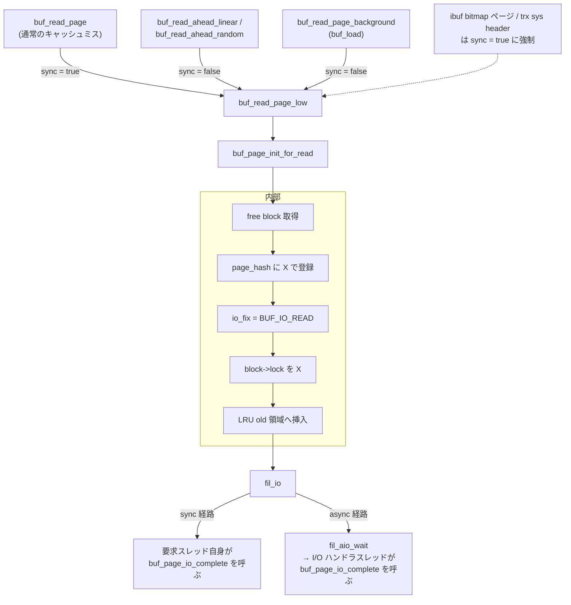
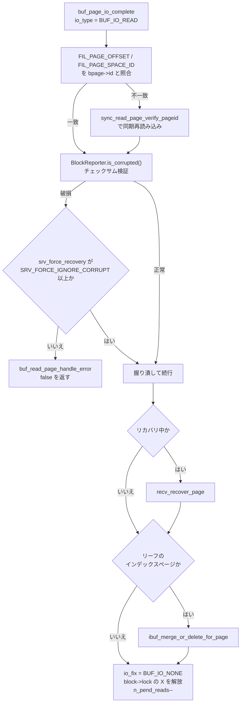

> **前提**: [バッファプール](./buffer-pool-walkthrough/) / [LRU と midpoint 挿入](./lru-and-midpoint/)

## 何を学んだか

キャッシュミスは `buf_page_get_gen` の中で**同期 I/O** になる。読んだスレッドはそこで止まる。1 枚 16KB を 1 回のシステムコールで読むのを繰り返すと、B+tree のリーフを 1 万ページ辿るのに 1 万回待つことになる。

InnoDB の答えが **read-ahead** で、2 種類ある。

|            | linear read-ahead                              | random read-ahead                                |
| ---------- | ---------------------------------------------- | ------------------------------------------------ |
| きっかけ   | ページへの**初回アクセス**                     | キャッシュ**ミスして読んだ**直後                 |
| 判定       | 領域内が**昇順か降順に並んで**アクセスされたか | 領域内に**最近アクセスされたページが何枚あるか** |
| 呼ぶ場所   | `single_page` の末尾                           | `Buf_fetch::read_page` の中                      |
| 設定       | `innodb_read_ahead_threshold` (既定 56)        | `innodb_random_read_ahead` (既定 **OFF**)        |
| ステータス | `Innodb_buffer_pool_read_ahead`                | `Innodb_buffer_pool_read_ahead_rnd`              |

どちらも「領域」= `read_ahead_area` の単位で動く。この値は設定項目ではなく**プールサイズから導出される**。

```
read_ahead_area = min(64, 2 の冪に切り上げた (curr_size / 32))
```

普通のサイズのプールでは常に 64 になる。この 64 が、`buf_pool_get` がページ番号の下位 6 bit を捨ててインスタンスを決めることと対応している ([バッファプールのページ](./buffer-pool-walkthrough/))。

I/O の実行側も 3 つ押さえておく。

- **AIO** — 読みは `innodb_read_io_threads` 本、書きは `innodb_write_io_threads` 本のセグメントに分かれる。Linux では `innodb_use_native_aio` が使えれば libaio、駄目ならシミュレート AIO
- **O_DIRECT** — 8.4 の `innodb_flush_method` の既定は「明示指定がなければ**起動時に実際に試して**、成功したら `O_DIRECT`」。8.0 の `fsync` 固定から変わった
- **read-ahead の効果測定** — `Innodb_buffer_pool_read_ahead_evicted` が「先読みしたが一度も触られずに追い出された」枚数

## なぜそうなっているか

**領域の境界でしか判定しないのは、判定コストを 1/32 にするためだ。** 判定ループは 64 回の page hash 参照 (それぞれ rw_lock の取得を伴う) を行う。これを全ページアクセスでやると、先読みで節約した分を判定コストで食い潰す。境界の 2 枚だけに絞れば、64 ページあたり 2 回で済む。**先読みは 64 ページ分の効果を持つので、判定 1 回のコストは十分に薄まる**。

**アクセス時刻の単調性で判定するのは、「順に舐めている」を検出する最も安い方法だからだ。** ページ番号の連続性を見るだけでは足りない。B+tree のリーフは物理的に飛び飛びになりうるし、逆にランダムアクセスがたまたま連番になることもある。**時刻の順序は「この領域を一方向に走っている」という意図を捉える**。ページの `access_time` はどのみち midpoint 判定のために記録しているので、追加コストがない。

**次の領域をページヘッダのリンクから決めるのは、read-ahead を B+tree から独立させるためだ。** `buf0rea.cc` はインデックスの構造を一切知らない。`FIL_PAGE_PREV` / `FIL_PAGE_NEXT` という「ページの自然な前後」だけを見る。ファイル冒頭のコメントが「From the higher level we only need the information if a file page has a natural successor or predecessor page」と言っているとおりで、**バッファプール層とインデックス層の境界を守るための抽象化**だ。undo ページや LOB ページのように B+tree でないものにも同じ機構が効くのはこのおかげでもある。

**random read-ahead が既定 OFF なのは、順序を見ないぶん外れやすいからだ。** 「13 枚がアクティブだから残り 51 枚も読む」は、hot なページが領域内に散らばっているだけのときに 51 枚を無駄に読む。SSD ではシークコストがないので、余分な読み込みはそのままメモリ帯域とプール容量の無駄になる。**HDD で「シーク 1 回で 1MB 読める」ことが前提だった最適化**が、前提の変化で既定 OFF になった典型例だ。

**`innodb_read_ahead_threshold` が「64 からの引き算」として使われるのは、値の意味を人間向きにするためだ。** コードが欲しいのは「許容できる乱れの枚数」だが、設定として自然なのは「これだけ揃っていたら先読みする」だ。`64 - threshold` の 1 行がその変換になっている。だから**値を上げるほど先読みが厳しくなる** (56 → 乱れ 8 枚まで、62 → 2 枚まで)。直感と逆になりやすい。

**O_DIRECT を実行時 probe にしたのは、ビルド時にもマニュアル設定にも寄せられなかったからだ。** カーネルが O_DIRECT をサポートしていても、データディレクトリのファイルシステムが対応していなければ開けない。ビルド時のマクロでは分からず、かといって管理者に毎回明示させるのは「デフォルトで妥当な設定」という要求と衝突する。**「実際に試す」が唯一確実な判定方法**で、起動時に 1 回だけ払えばよいコストでもある。

**O_DIRECT を既定にしたのは、二重キャッシュの解消が単純に得だからだ。** バッファプールは OS のページキャッシュと同じデータを持つ。`innodb_buffer_pool_size` にメモリの 70% を割り当てている環境で OS もキャッシュすると、実効的なキャッシュ容量は増えないのにメモリが 2 倍使われる。しかもページキャッシュへのコピーが CPU を食う。**InnoDB は自前で LRU も先読みも持っているので、OS のキャッシュから得るものが少ない**。

## ソースコードのどこか

### 領域の大きさ

[`buf0buf.cc#L299`](https://github.com/mysql/mysql-server/blob/mysql-8.4.11/storage/innobase/buf/buf0buf.cc#L299)。

```cpp title="storage/innobase/buf/buf0buf.cc"
/** Number of pages to read ahead */
static const ulint BUF_READ_AHEAD_PAGES = 64;
/** The maximum portion of the buffer pool that can be used for the
read-ahead buffer.  (Divide buf_pool size by this amount) */
static const ulint BUF_READ_AHEAD_PORTION = 32;
```

初期化は [L1356](https://github.com/mysql/mysql-server/blob/mysql-8.4.11/storage/innobase/buf/buf0buf.cc#L1356)。

```cpp title="storage/innobase/buf/buf0buf.cc"
    buf_pool->read_ahead_area = static_cast<page_no_t>(
        std::min(BUF_READ_AHEAD_PAGES,
                 ut_2_power_up(buf_pool->curr_size / BUF_READ_AHEAD_PORTION)));
```

`curr_size` は 1 インスタンスのページ数、`ut_2_power_up` は「n 以上で最小の 2 の冪」だ。`curr_size / 32` が 33 以上、つまり **1 インスタンスが 1056 ページ (16KB ページで約 16.5MB) 以上なら 64 で頭打ち**になる。それ未満だと 32、16 と落ちる。プールのリサイズ時も [L2594](https://github.com/mysql/mysql-server/blob/mysql-8.4.11/storage/innobase/buf/buf0buf.cc#L2594) で同じ式で再計算される。

**`read_ahead_area` は「1 度に読む枚数」であると同時に「アクセスパターンを判定する窓の大きさ」**でもある。両方が同じ 64 なのがこの設計の要点で、「64 ページ分きれいに舐めたなら、次の 64 ページも舐めるだろう」という推論になっている。

### linear read-ahead

呼び出しは `single_page` の一番最後だ ([`buf0buf.cc#L4436`](https://github.com/mysql/mysql-server/blob/mysql-8.4.11/storage/innobase/buf/buf0buf.cc#L4436))。

```cpp title="storage/innobase/buf/buf0buf.cc"
  if (m_mode != Page_fetch::PEEK_IF_IN_POOL &&
      m_mode != Page_fetch::POSSIBLY_FREED_NO_READ_AHEAD &&
      access_time == std::chrono::steady_clock::time_point{}) {
    /* In the case of a first access, try to apply linear read-ahead */

    buf_read_ahead_linear(m_page_id, m_page_size, ibuf_inside(m_mtr));
  }
```

**キャッシュヒットでも呼ばれる**ことに注意する。条件は「初回アクセス」であって「ミス」ではない。すでにプールにあるページでも、そのページに初めて触ったなら先読みの判定が走る。

[`buf_read_ahead_linear` (`buf0rea.cc#L329`)](https://github.com/mysql/mysql-server/blob/mysql-8.4.11/storage/innobase/buf/buf0rea.cc#L329) は、まず**領域の境界にいるか**を見る。

```cpp title="storage/innobase/buf/buf0rea.cc"
  low = (page_id.page_no() / buf_read_ahead_linear_area) *
        buf_read_ahead_linear_area;
  high = (page_id.page_no() / buf_read_ahead_linear_area + 1) *
         buf_read_ahead_linear_area;

  if ((page_id.page_no() != low) && (page_id.page_no() != high - 1)) {
    /* This is not a border page of the area: return */

    return (0);
  }
```

**領域の先頭ページか最終ページに来たときだけ判定する**。64 ページのうち 62 枚では即座に return する。この早期脱出があるから、`buf_page_get_gen` の全呼び出しに仕掛けても実質的なコストが乗らない。

```
read_ahead_area (64 ページ) のうち判定するのは両端の 2 枚だけ

  page_no:  low                                              high-1
            +----+----+----+--- 判定しない 62 枚 ---+----+----+
判定対象?     | ●  |    |    |                          |    | ●  |
            +----+----+----+--------------------------+----+----+
             境界ページ (low)                    境界ページ (high-1)
             ここに来たときだけ buf_read_ahead_linear が判定を実行する
```

判定を通ったときの流れ全体を追うとこうなる。



次に許容できる乱れの数を決める。

```cpp title="storage/innobase/buf/buf0rea.cc"
  /* How many out of order accessed pages can we ignore
  when working out the access pattern for linear readahead */
  threshold = std::min(static_cast<page_no_t>(64 - srv_read_ahead_threshold),
                       buf_pool->read_ahead_area);
```

`innodb_read_ahead_threshold` の既定は 56 なので `threshold = 8`。**64 ページのうち 8 枚まで乱れていても先読みする**。設定値の意味は「64 枚中これだけ順番どおりならよい」であり、範囲も 0–64 に固定されている ([`ha_innodb.cc#L23251`](https://github.com/mysql/mysql-server/blob/mysql-8.4.11/storage/innobase/handler/ha_innodb.cc#L23251))。`read_ahead_area` が 64 未満のときは領域の大きさが上限になる。

判定ループは領域内の全ページを page hash で引き、**初回アクセス時刻が単調に並んでいるか**を数える。

```cpp title="storage/innobase/buf/buf0rea.cc"
    } else if (pred_bpage) {
      /* Note that buf_page_is_accessed() returns
      the time of the first access.  If some blocks
      of the extent existed in the buffer pool at
      the time of a linear access pattern, the first
      access times may be nonmonotonic, even though
      the latest access times were linear.  The
      threshold (srv_read_ahead_factor) should help
      a little against this. */
```

コメントが正直に限界を認めている。**「以前からプールにあったページの初回アクセス時刻は古いままなので、順序が崩れて見える」**。閾値の 8 枚の余裕はそのための保険でもある。

判定を通ったら、**ページの中身から次の領域を決める**。

```cpp title="storage/innobase/buf/buf0rea.cc"
  pred_offset = fil_page_get_prev(frame);
  succ_offset = fil_page_get_next(frame);

  rw_lock_s_unlock(hash_lock);

  if ((page_id.page_no() == low) && (succ_offset == page_id.page_no() + 1)) {
    /* This is ok, we can continue */
    new_offset = pred_offset;

  } else if ((page_id.page_no() == high - 1) &&
             (pred_offset == page_id.page_no() - 1)) {
    /* This is ok, we can continue */
    new_offset = succ_offset;
  } else {
```

`FIL_PAGE_PREV` / `FIL_PAGE_NEXT` は[ページヘッダ](./page-layout/)にある論理的な兄弟リンクだ。**B+tree のリーフが物理的に連続しているとは限らない**ので、ファイル上の次の 64 ページではなく、リンクを辿った先の領域を読む。これが「read-ahead が B+tree の構造を知らずに済む」設計になっている。

その直前のコメントが並行制御について注釈している。

```cpp title="storage/innobase/buf/buf0rea.cc"
  /* Read the natural predecessor and successor page addresses from
  the page; NOTE that because the calling thread may have an x-latch
  on the page, we do not acquire an s-latch on the page, this is to
  prevent deadlocks. Even if we read values which are nonsense, the
  algorithm will work. */
```

**ページ latch を取らずに中身を読む**。呼び出し元がすでに X latch を持っているかもしれないからだ。壊れた値を読んでも、その先の境界チェックで弾かれるだけなので害がない。ヒューリスティックであることを利用した割り切りだ。

読み込みは非同期で投げる。

```cpp title="storage/innobase/buf/buf0rea.cc"
      count += buf_read_page_low(&err, false, IORequest::DO_NOT_WAKE, ibuf_mode,
                                 cur_page_id, page_size, false);
```

第 2 引数の `false` が `sync = false`、`DO_NOT_WAKE` が「I/O ハンドラをまだ起こすな」。**64 個全部キューに積んでから最後にまとめて起こす**。

```cpp title="storage/innobase/buf/buf0rea.cc"
  /* In simulated aio we wake the aio handler threads only after
  queuing all aio requests. */
```

### random read-ahead

[`buf_read_ahead_random` (L153)](https://github.com/mysql/mysql-server/blob/mysql-8.4.11/storage/innobase/buf/buf0rea.cc#L153) は、`Buf_fetch::read_page` がディスクから 1 枚読んだ直後に呼ばれる。判定は「領域内に最近アクセスされたページが何枚あるか」だけだ。

```cpp title="storage/innobase/buf/buf0rea.cc"
    if (bpage != nullptr &&
        buf_page_is_accessed(bpage) !=
            std::chrono::steady_clock::time_point{} &&
        buf_page_peek_if_young(bpage)) {
      recent_blocks++;

      if (recent_blocks >= BUF_READ_AHEAD_RANDOM_THRESHOLD(buf_pool)) {
        rw_lock_s_unlock(hash_lock);
        goto read_ahead;
      }
    }
```

閾値は [L57](https://github.com/mysql/mysql-server/blob/mysql-8.4.11/storage/innobase/buf/buf0rea.cc#L57)。

```cpp title="storage/innobase/buf/buf0rea.cc"
inline page_no_t BUF_READ_AHEAD_RANDOM_THRESHOLD(const buf_pool_t *b) {
  return 5 + b->read_ahead_area / 8;
}
```

`read_ahead_area = 64` なら 13 枚。**順序は一切見ない**。「この 64 ページのうち 13 枚が young 領域にいる = この領域は今アクティブだ」という判断で、残り全部を読む。

`buf_page_peek_if_young` を使っているのがポイントで、[LRU のページ](./lru-and-midpoint/)で見たとおりこれは mutex を取らない近似判定だ。

既定は OFF ([`ha_innodb.cc#L23246`](https://github.com/mysql/mysql-server/blob/mysql-8.4.11/storage/innobase/handler/ha_innodb.cc#L23246))。

```cpp title="storage/innobase/handler/ha_innodb.cc"
static MYSQL_SYSVAR_BOOL(
    random_read_ahead, srv_random_read_ahead, PLUGIN_VAR_NOCMDARG,
    "Whether to use read ahead for random access within an extent.", nullptr,
    nullptr, false);
```

### 両方に効く安全弁

どちらの関数も、先読みを始める前に**未完了の読み込みが多すぎないか**を確認する。

```cpp title="storage/innobase/buf/buf0rea.cc"
/** If there are buf_pool->curr_size per the number below pending reads, then
read-ahead is not done: this is to prevent flooding the buffer pool with
i/o-fixed buffer blocks */
static constexpr uint32_t BUF_READ_AHEAD_PEND_LIMIT = 2;
```

```cpp title="storage/innobase/buf/buf0rea.cc"
  if (buf_pool->n_pend_reads >
      buf_pool->curr_size / BUF_READ_AHEAD_PEND_LIMIT) {
    return (0);
  }
```

**プールの半分が読み込み中なら先読みを止める**。I/O fix された block は evict できないので、これを放置するとプール全体が身動きできなくなる。

また linear 側は「領域がテーブルスペースの末尾を跨ぐなら諦める」。

```cpp title="storage/innobase/buf/buf0rea.cc"
    if (high > space_size) {
      /* The area is not whole */
      return (0);
    }
```

**小さいテーブルでは linear read-ahead が一度も発火しない**。64 ページ (1MB) に満たないテーブルは領域が完結しないからだ。

### 読み込みの実行

[`buf_read_page_low` (L66)](https://github.com/mysql/mysql-server/blob/mysql-8.4.11/storage/innobase/buf/buf0rea.cc#L66) が read-ahead と通常読み込みの共通の底になる。入口は 3 つあるが、**sync/async の違いが完了処理の呼び手を分ける**という点で 1 本の図にまとめられる。



```cpp title="storage/innobase/buf/buf0rea.cc"
  bpage = buf_page_init_for_read(mode, page_id, page_size, unzip);
...
  IORequest request(type | IORequest::READ);

  *err = fil_io(request, sync, page_id, page_size, 0, page_size.physical(), dst,
                bpage);
```

`buf_page_init_for_read` が free block を取り、page hash に登録し、`io_fix = BUF_IO_READ` を立て、`block->lock` を X で掴み、**LRU の midpoint に挿入する**。この時点でページはまだ空だが page hash からは見える。だから同じページを求めた別のスレッドは `lookup()` でこの block を見つけ、`buf_wait_for_read` で S latch を待つことになる。**同じページを 2 回読むことがないのはこの仕掛けによる**。

同期が強制される例外が 2 つある。

```cpp title="storage/innobase/buf/buf0rea.cc"
  if (ibuf_bitmap_page(page_id, page_size) || trx_sys_hdr_page(page_id)) {
    /* Trx sys header is so low in the latching order that we play
    safe and do not leave the i/o-completion to an asynchronous
    i/o-thread. Ibuf bitmap pages must always be read with
    synchronous i/o, to make sure they do not get involved in
    thread deadlocks. */

    sync = true;
  }
```

この 2 種のページは read-ahead の対象からも外されている。

### 読み込みの完了 — `buf_page_io_complete`

[`buf_page_io_complete` (`buf0buf.cc#L5802`)](https://github.com/mysql/mysql-server/blob/mysql-8.4.11/storage/innobase/buf/buf0buf.cc#L5802) が読み込みの後始末をする。呼び手は 2 通りで、通常のキャッシュミスなら [`buf_read_page` の中 (`buf0rea.cc#L145`)](https://github.com/mysql/mysql-server/blob/mysql-8.4.11/storage/innobase/buf/buf0rea.cc#L145) で要求スレッド自身が、read-ahead や `buf_load` なら [`fil_aio_wait` (`fil0fil.cc#L7967`)](https://github.com/mysql/mysql-server/blob/mysql-8.4.11/storage/innobase/fil/fil0fil.cc#L7967) の中で I/O ハンドラスレッドが呼ぶ。関数の先頭にある `current_thread_has_io_responsibility()` の表明が、「この I/O を完了させる責任を持つのは常にこのスレッドだけ」という前提を守る。



**ページ ID の照合**が最初の関門だ。読み込んだフレームの `FIL_PAGE_OFFSET` / `FIL_PAGE_SPACE_ID` を、要求した `bpage->id` と突き合わせる。一致しなければ `sync_read_page_verify_pageid` で**同期で読み直す**。コードのコメントが理由を明言している。

```cpp title="storage/innobase/buf/buf0buf.cc"
      /* In HCS environment, an issue is seen whereby the linux AIO system
      call io_getevents() reports a successful page read, but the buffer
      block is not having the data from the disk.  To overcome this
      unexplained behaviour, a synchronous read operation is performed to
      actually fetch data from the disk. */
```

**AIO が成功を報告しても中身が来ていないことがある**、という libaio 側の既知の事象への対処が本体コードに組み込まれている。

次が**チェックサム検証**だ。`BlockReporter(...).is_corrupted()` が破損を検出すると、既定 (`srv_force_recovery < SRV_FORCE_IGNORE_CORRUPT`) では `buf_read_page_handle_error` を呼んで `false` を返す。`innodb_force_recovery` を上げていれば握り潰して続行する。リカバリ中なら `recv_recover_page` で redo を適用し、リーフのインデックスページなら [change buffer](./change-buffer/) のマージ (`ibuf_merge_or_delete_for_page`) がここで走る。

最後の仕上げが `buf_page_set_io_fix(bpage, BUF_IO_NONE)` と `rw_lock_x_unlock_gen(&block->lock, BUF_IO_READ)` だ。`_gen` に `BUF_IO_READ` という pass 値を渡しているのは、**ロックしたスレッドと解錠するスレッドが違う**ことがある (read-ahead) からで、通常の再帰チェックを迂回する必要がある。

### AIO のセグメント

[`AIO::start` (`os0file.cc#L6102`)](https://github.com/mysql/mysql-server/blob/mysql-8.4.11/storage/innobase/os/os0file.cc#L6102) が読み用と書き用の配列を分けて作る。

```cpp title="storage/innobase/os/os0file.cc"
  s_reads =
      create(LATCH_ID_OS_AIO_READ_MUTEX, n_readers * n_per_seg, n_readers);
...
  for (size_t i = 0; i < n_readers; ++i) {
    ut_a(n_segments < SRV_MAX_N_IO_THREADS);
    srv_io_thread_function[n_segments++] = "read thread";
  }

  s_writes =
      create(LATCH_ID_OS_AIO_WRITE_MUTEX, n_writers * n_per_seg, n_writers);
```

`n_readers` / `n_writers` がそのまま `innodb_read_io_threads` / `innodb_write_io_threads` で、**セグメント 1 つにスレッド 1 本**が対応する ([`io_handler_thread`](https://github.com/mysql/mysql-server/blob/mysql-8.4.11/storage/innobase/os/os0file.cc#L6181))。読みと書きが別の配列・別の mutex なので、書き込みの詰まりが読み込みを止めることはない。

Linux native AIO が使えないと判明したら、その場でシミュレート AIO に落ちる。

```cpp title="storage/innobase/os/os0file.cc"
  /* Check if native aio is supported on this system and tmpfs */
  if (srv_use_native_aio && !is_linux_native_aio_supported()) {
    ib::warn(ER_IB_MSG_829) << "Linux Native AIO disabled.";

    srv_use_native_aio = false;
  }
```

`innodb_read_io_threads` の既定が 8.4 で変わっている ([`ha_innodb.cc#L22791`](https://github.com/mysql/mysql-server/blob/mysql-8.4.11/storage/innobase/handler/ha_innodb.cc#L22791))。

```cpp title="storage/innobase/handler/ha_innodb.cc"
static MYSQL_SYSVAR_ULONG(
    read_io_threads, srv_n_read_io_threads,
    PLUGIN_VAR_RQCMDARG | PLUGIN_VAR_READONLY,
    "Number of background read I/O threads in InnoDB.", nullptr, nullptr,
    std::clamp(std::thread::hardware_concurrency() / 2, 4U, 64U), 1, 64, 0);

static MYSQL_SYSVAR_ULONG(write_io_threads, srv_n_write_io_threads,
                          PLUGIN_VAR_RQCMDARG | PLUGIN_VAR_READONLY,
                          "Number of background write I/O threads in InnoDB.",
                          nullptr, nullptr, 4, 1, 64, 0);
```

**読みは CPU コア数の半分 (4〜64 でクリップ)、書きは 4 固定**。8.0 ではどちらも 4 だった。どちらも `PLUGIN_VAR_READONLY` なので再起動が必要だ。

### O_DIRECT は実行時に試す

8.4 の `innodb_flush_method` は、**明示指定がなければ起動時に実際に O_DIRECT を試して決める** ([`ha_innodb.cc#L4962`](https://github.com/mysql/mysql-server/blob/mysql-8.4.11/storage/innobase/handler/ha_innodb.cc#L4962))。

```cpp title="storage/innobase/handler/ha_innodb.cc"
  if (!innodb_flush_method_is_set()) {
    innodb_flush_method = os_is_o_direct_supported()
                              ? static_cast<ulong>(SRV_UNIX_O_DIRECT)
                              : static_cast<ulong>(SRV_UNIX_FSYNC);
    ib::info(ER_IB_MSG_INNODB_FLUSH_METHOD,
             innodb_flush_method_names[innodb_flush_method]);
  }
```

その `os_is_o_direct_supported` ([`os0file.cc#L137`](https://github.com/mysql/mysql-server/blob/mysql-8.4.11/storage/innobase/os/os0file.cc#L137)) が、**データディレクトリに `o_direct_test` という一時ファイルを作って開けるか試す**。

```cpp title="storage/innobase/os/os0file.cc"
  /* Construct a temp file name. */
  strcat(file_name + dir_len, "o_direct_test");

  /* Try to create a temp file with O_DIRECT flag. */
  file_handle =
      ::open(file_name, O_CREAT | O_TRUNC | O_WRONLY | O_DIRECT, S_IRWXU);

  /* If Failed due to no O_DIRECT support, errno EINVAL is set, but file is
still created. See Kernel Bugzilla Bug 218049 */
  if (file_handle == -1 && errno == EINVAL) {
    unlink(file_name);
    ut::free(file_name);
    return false;
  }
```

Linux 以外では無条件に `false` を返す。**コンパイル時のマクロでは判定できない**のは、O_DIRECT のサポートがカーネルではなくファイルシステム側の性質だからだ。同じカーネルでも ext4 では通り、tmpfs や一部のネットワークファイルシステムでは `EINVAL` になる。コメントが参照しているカーネルの不具合 (失敗しているのにファイルは作られる) への対処まで入っている。

実際に `O_DIRECT` を立てるのはファイルを開いた後で、[`os_file_set_nocache` (L5288)](https://github.com/mysql/mysql-server/blob/mysql-8.4.11/storage/innobase/os/os0file.cc#L5288) が `fcntl(fd, F_SETFL, O_DIRECT)` を呼ぶ。ここで失敗しても警告を出して続行する。

```cpp title="storage/innobase/os/os0file.cc"
  if (fcntl(fd, F_SETFL, O_DIRECT) == -1 && !on_error_silent) {
```

つまり **probe に通っても個別のファイルで O_DIRECT が付かないことがあり、その場合は黙って (警告だけ出して) バッファード I/O になる**。

### 効果の測定

先読みしたページが使われずに追い出された枚数を数えている ([`buf0lru.cc#L1131`](https://github.com/mysql/mysql-server/blob/mysql-8.4.11/storage/innobase/buf/buf0lru.cc#L1131))。

```cpp title="storage/innobase/buf/buf0lru.cc"
    if (freed && accessed == std::chrono::steady_clock::time_point{}) {
      /* Keep track of pages that are evicted without
      ever being accessed. This gives us a measure of
      the effectiveness of readahead */
      ++buf_pool->stat.n_ra_pages_evicted;
    }
```

厳密には「read-ahead で読まれたページ」ではなく **「一度も触られずに evict されたページ」**だ。read-ahead 以外で入ってくることは通常ないので、実質的に先読みの空振り率になる。

`SHOW STATUS` に出る名前は [`ha_innodb.cc#L1169`](https://github.com/mysql/mysql-server/blob/mysql-8.4.11/storage/innobase/handler/ha_innodb.cc#L1169) で定義されている。

| ステータス変数                          | 意味                                     |
| --------------------------------------- | ---------------------------------------- |
| `Innodb_buffer_pool_read_ahead`         | linear read-ahead で読んだページ数       |
| `Innodb_buffer_pool_read_ahead_rnd`     | random read-ahead で読んだページ数       |
| `Innodb_buffer_pool_read_ahead_evicted` | 先読みしたが一度も使われず追い出された数 |

## どう活かすか

**`SHOW STATUS LIKE 'Innodb_buffer_pool_read_ahead%'` の 3 つを比で見る。** `read_ahead_evicted / (read_ahead + read_ahead_rnd)` が空振り率だ。これが高いなら先読みが外れている。`innodb_random_read_ahead` を ON にした環境でこの比が跳ねたら、まず戻す。

**`Innodb_buffer_pool_reads` と `Innodb_buffer_pool_read_requests` の比がキャッシュミス率**で、これは read-ahead を含む。`SHOW ENGINE INNODB STATUS` の `Buffer pool hit rate` は同じものを 1000 分率で出している。**先読みが効いているとミス率は下がらない (先読みもディスク読み込みだから) が、クエリの待ち時間は減る**。この 2 つを混同しないこと。

**小さいテーブルでは linear read-ahead は発火しない。** 領域がテーブルスペースに収まらないと諦めるので、1MB (64 ページ) 未満のテーブルには効かない。**開発環境の小さいデータで先読みの効果を測ろうとしても何も起きない**のはこれが理由だ。

**`innodb_read_ahead_threshold` を下げるのは、「乱れを許容する」方向。** 全表スキャンなのに先読みが効いていない (`Innodb_buffer_pool_read_ahead` が伸びない) なら、値を下げてみる。ただし空振り率とセットで見る。0 にすると `if (!srv_read_ahead_threshold) return 0;` で **linear read-ahead が完全に無効になる**ので、そこだけは別扱いだ。

**`innodb_flush_method` を明示的に指定していないなら、実際に何が選ばれたかをエラーログで確認する。** 起動時に `ib::info(ER_IB_MSG_INNODB_FLUSH_METHOD, ...)` で選ばれた値が出る。**`my.cnf` に書いていないからといって `fsync` だとは限らない**。8.0 からアップグレードした環境で「何も変えていないのに I/O の挙動が変わった」なら、まずここを見る。

**二重キャッシュの症状は、`free` の buff/cache が InnoDB のデータ量に比例して膨らむこと。** `innodb_flush_method=fsync` (または `O_DSYNC`) だと、バッファプールに載っているのと同じページが OS のページキャッシュにも載る。**実効メモリが半減する**ので、コンテナのメモリ上限を切っている環境では OOM Killer に届きやすい。`O_DIRECT` にすればデータファイルの読み書きがページキャッシュを迂回する。

**`O_DIRECT_NO_FSYNC` は redo とデータファイルで扱いが違う。** `buf_flush_fsync` の switch ([`buf0flu.cc#L3571`](https://github.com/mysql/mysql-server/blob/mysql-8.4.11/storage/innobase/buf/buf0flu.cc#L3571)) を見ると、`O_DIRECT_NO_FSYNC` も含めてデータファイルには `fil_flush_file_spaces()` を呼んでいる。**「NO_FSYNC」という名前ほど何もしないわけではない**ので、名前で判断せずコードか公式ドキュメントで確認する。

**`innodb_read_io_threads` の既定がホストの CPU 数に依存することに注意する。** 同じ設定ファイルでも、16 コアの本番では 8、4 コアの検証機では 4 になる。**「本番だけ I/O が詰まる」の切り分けで、この差を見落としやすい**。`SHOW ENGINE INNODB STATUS` の FILE I/O セクションに `I/O thread N state:` が実本数分並ぶので、そこで数えられる。

**AIO が native かシミュレートかもエラーログに出る。** `Using Linux native AIO` が出ていなければシミュレート AIO で、こちらは I/O ハンドラスレッドが同期 `pread`/`pwrite` をブロッキングで回す。**tmpfs 上にデータディレクトリを置くと native AIO が無効になる**ので、CI やテスト環境で本番と性能特性が変わる。

**先読みの空振りは LRU の midpoint 方式と噛み合っている。** 先読みしたページは `buf_page_init_for_read` から `buf_LRU_add_block(bpage, true)` で **old 領域に入る**。触られなければ young に上がらず、そのまま押し流される ([LRU のページ](./lru-and-midpoint/))。**空振りしても warm cache は壊れない**ように設計されているので、`read_ahead_evicted` がある程度出ているのは正常だ。ゼロを目指す指標ではない。

**ページ破損は読み込み完了時にしか検出されない。** チェックサム検証は `buf_page_io_complete` の中だけで走る。ディスク上ですでに壊れていても、そのページが実際にバッファプールへ読み込まれるまで誰も気づかない。`CHECK TABLE` が全ページを舐めることに意味があるのはこのためで、逆に言えば**起動しただけでは壊れたページは見つからない**。

**AIO が成功を返してもデータが来ていないことがある。** `buf_page_io_complete` にはページ ID の不一致を検出したら同期で読み直す処理 (`sync_read_page_verify_pageid`) が入っている。エラーログに `ER_IB_MSG_79` (「Space id and page number stored in the page read in are ... should be ...」) が出ていたら、InnoDB ではなくストレージ層か libaio の実装を疑う入口になる。
