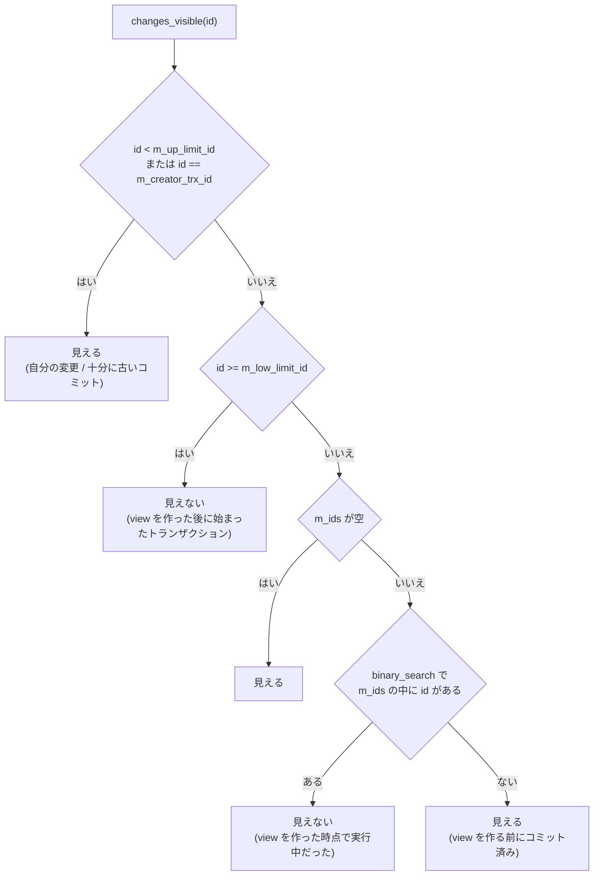

> **前提**: [MVCC](./mvcc-basics/) / [undo ログ](./undo-log/)

## 何を学んだか

「トランザクション開始時点のスナップショット」という言い方をすると、どこかにデータの複製があるように聞こえる。**InnoDB の read view にはデータが 1 バイトも入っていない。** 入っているのは次の 4 つだけだ。

| フィールド         | 意味                                                                                |
| ------------------ | ----------------------------------------------------------------------------------- |
| `m_up_limit_id`    | この値より**小さい** ID の変更はすべて見える (low water mark)                       |
| `m_low_limit_id`   | この値**以上**の ID の変更は 1 つも見えない (high water mark)                       |
| `m_ids`            | view を作った瞬間にアクティブだった読み書きトランザクションの ID を昇順に並べた配列 |
| `m_creator_trx_id` | 自分自身の ID。自分の変更は常に見える                                               |

判定は「まず両端で弾き、残った狭い区間だけ二分探索する」という形になっている。**同時実行トランザクションが少なければ `m_ids` は空で、比較 2 回で終わる。** これが MVCC 読み取りがほとんどコストゼロで済む理由だ。

そして重要なのは**この 4 つがいつ計算されるか**である。REPEATABLE READ ではトランザクション中の最初の一貫読み取りで 1 回だけ、READ COMMITTED では文が始まるたびに作り直される。「RR で最初の SELECT を打った瞬間にスナップショットが固定される」というのは比喩ではなく、`view_open` が呼ばれる場所そのものを指している。

## なぜそうなっているか

**「見えるかどうか」を ID の大小比較に落とし込むために、ID が単調増加であることを利用している。** `trx_sys->next_trx_id_or_no` は `fetch_add(1)` で配られるので、ID の大小はトランザクションの**開始順**を表す。開始順が分かれば「view を作った時点でまだ始まっていなかった」ものは無条件に不可視にできる。残るのは「開始済みだがコミット済みか実行中か分からない」区間だけで、そこだけを `m_ids` に持てばよい。

**`m_ids` を配列 + 二分探索にしているのは、作成コストと判定コストのバランスの取り方だ。** ハッシュにすれば判定は O(1) になるが、`rw_trx_ids` はもともとソート済みの配列なので `memmove` 一発でコピーできる。view の作成は `trx_sys->mutex` を持ったまま行うので、**作成側を速くするほうが全体のスループットに効く**。`copy_trx_ids` に「std::vector::resize のオーバーヘッドが不明なのでこうしている」という言い訳のコメントが残っているのは、その優先順位の表れだ。

**RR で view を使い回すのは、SQL 標準の repeatable read をそのまま実装しているからだ。** 同じトランザクション内の 2 回の読みが同じ結果を返すには、判定に使う 4 つの数が変わらなければ十分である。データを固定する必要はない。**逆に RC で毎文作り直すのは、`view_close` を 2 箇所に足すだけで実装できる。** 分離レベルの差がこれだけ小さいコードで表現できるのは、可視性が「4 つの数の関数」に還元されているおかげだ。

**view をプールするのは `m_ids` の配列を使い回すため。** `ids_t::reserve` は最低 32 要素 (`MIN_TRX_IDS`) を確保し、以後は縮まない。RC で毎文 view を作り直しても、その都度 malloc が走るわけではない。

## ソースコードのどこか

### `ReadView` の定義

[`storage/innobase/include/read0types.h#L48`](https://github.com/mysql/mysql-server/blob/mysql-8.4.11/storage/innobase/include/read0types.h#L48) の `class ReadView`。フィールドは [L284 以降](https://github.com/mysql/mysql-server/blob/mysql-8.4.11/storage/innobase/include/read0types.h#L284) にまとまっている。`m_ids` は `std::vector` ではなく `ids_t` という専用の配列クラスで、`ReadView` に閉じた最小限の API しか持たない。

もう 1 つ `m_low_limit_no` ([L302](https://github.com/mysql/mysql-server/blob/mysql-8.4.11/storage/innobase/include/read0types.h#L302)) がある。これは可視性の判定には使わず、**purge が「どの undo レコードを消してよいか」を決めるために使う**。`m_low_limit_no` より小さい `trx->no` の undo は、どの view からも必要とされない ([purge のページ](./purge/))。

### `changes_visible` — 3 分岐 + 二分探索

```cpp title="storage/innobase/include/read0types.h"
  [[nodiscard]] bool changes_visible(trx_id_t id,
                                     const table_name_t &name) const {
    ut_ad(id > 0);

    if (id < m_up_limit_id || id == m_creator_trx_id) {
      return (true);
    }

    check_trx_id_sanity(id, name);

    if (id >= m_low_limit_id) {
      return (false);

    } else if (m_ids.empty()) {
      return (true);
    }

    const ids_t::value_type *p = m_ids.data();

    return (!std::binary_search(p, p + m_ids.size(), id));
  }
```

[L163-L183](https://github.com/mysql/mysql-server/blob/mysql-8.4.11/storage/innobase/include/read0types.h#L163)。この十数行が InnoDB の可視性判定のすべてだ。



### `prepare` — 4 つの数の作り方

```cpp title="storage/innobase/read/read0read.cc"
void ReadView::prepare(trx_id_t id) {
  ut_ad(trx_sys_mutex_own());

  m_creator_trx_id = id;

  m_low_limit_no = trx_get_serialisation_min_trx_no();

  m_low_limit_id = trx_sys_get_next_trx_id_or_no();

  ut_a(m_low_limit_no <= m_low_limit_id);

  if (!trx_sys->rw_trx_ids.empty()) {
    copy_trx_ids(trx_sys->rw_trx_ids);
  } else {
    m_ids.clear();
  }

  /* The first active transaction has the smallest id. */
  m_up_limit_id = !m_ids.empty() ? m_ids.front() : m_low_limit_id;
```

[`read0read.cc#L447`](https://github.com/mysql/mysql-server/blob/mysql-8.4.11/storage/innobase/read/read0read.cc#L447)。`trx_sys->mutex` を持ったまま `rw_trx_ids` をコピーする。だから **view を作るコストは「そのときアクティブな読み書きトランザクションの本数」に比例する**。

[`copy_trx_ids` (L354)](https://github.com/mysql/mysql-server/blob/mysql-8.4.11/storage/innobase/read/read0read.cc#L354) は自分自身の ID だけを除いてコピーする。除くのは `m_creator_trx_id` との比較を `changes_visible` の 1 分岐目で済ませるためだ。

`m_low_limit_id` に入るのは `next_trx_id_or_no`、つまり**次に配られる ID** である。まだ誰も使っていない値なので「これ以上は見えない」の境界にちょうどよい。

### view の作成と破棄

[`MVCC::view_open` (`read0read.cc#L501`)](https://github.com/mysql/mysql-server/blob/mysql-8.4.11/storage/innobase/read/read0read.cc#L501) が入口。中で [`get_view` (L478)](https://github.com/mysql/mysql-server/blob/mysql-8.4.11/storage/innobase/read/read0read.cc#L478) がフリーリストから `ReadView` を 1 つ取ってくる。**view はプールされていて、閉じられると `m_free` リストに戻る**。`MVCC` のコンストラクタは起動時に一定数を先に確保する。

さらに `view_open` の頭には再利用の速い道がある。

```cpp title="storage/innobase/read/read0read.cc"
    if (trx_is_autocommit_non_locking(trx) && view->empty()) {
      view->m_closed = false;

      if (view->m_low_limit_id == trx_sys_get_next_trx_id_or_no()) {
        return;
      } else {
        view->m_closed = true;
      }
    }
```

[L521-L529](https://github.com/mysql/mysql-server/blob/mysql-8.4.11/storage/innobase/read/read0read.cc#L521)。**前回 view を作ってから 1 本も読み書きトランザクションが始まっていなければ、`trx_sys->mutex` すら取らずに前の view をそのまま使い回す。** 読み取り専用の autocommit `SELECT` を連打する構成でここが効く。

閉じるのは [`view_close` (L674)](https://github.com/mysql/mysql-server/blob/mysql-8.4.11/storage/innobase/read/read0read.cc#L674)。`own_mutex` が false なら「閉じた印」を付けるだけでリストから外さない。ポインタの最下位ビットを立てて閉状態を表す小細工がここにある。

### RR と RC の分かれ目は `view_close` の呼び場所

一貫読み取りの入口はどれも [`trx_assign_read_view` (`trx0trx.cc#L2319`)](https://github.com/mysql/mysql-server/blob/mysql-8.4.11/storage/innobase/trx/trx0trx.cc#L2319) を通る。

```cpp title="storage/innobase/trx/trx0trx.cc"
  } else if (!MVCC::is_view_active(trx->read_view)) {
    trx_sys->mvcc->view_open(trx->read_view, trx);
  }

  return (trx->read_view);
```

**view がすでに生きていれば何もしない。** つまりこの関数自体は分離レベルを一切見ていない。RR と RC の差は「view をいつ閉じるか」だけで作られている。閉じているのは `ha_innodb.cc` の 2 箇所だ。

```cpp title="storage/innobase/handler/ha_innodb.cc"
  if (lock_type != TL_IGNORE && trx->n_mysql_tables_in_use == 0) {
    trx->isolation_level =
        innobase_trx_map_isolation_level(thd_get_trx_isolation(thd));

    if (trx->isolation_level <= TRX_ISO_READ_COMMITTED &&
        MVCC::is_view_active(trx->read_view)) {
      /* At low transaction isolation levels we let
      each consistent read set its own snapshot */

      mutex_enter(&trx_sys->mutex);

      trx_sys->mvcc->view_close(trx->read_view, true);
```

[`ha_innobase::store_lock` (L19728)](https://github.com/mysql/mysql-server/blob/mysql-8.4.11/storage/innobase/handler/ha_innodb.cc#L19728) が文の開始側、[`ha_innobase::external_lock` (L19139)](https://github.com/mysql/mysql-server/blob/mysql-8.4.11/storage/innobase/handler/ha_innodb.cc#L19139) が文の終了側。どちらも `trx->isolation_level <= TRX_ISO_READ_COMMITTED` でガードされている。**`lock0lock.cc` や `row0sel.cc` を grep しても RC のこの挙動は出てこない。**

`row_search_mvcc` 側で view を要求するのは [`row0sel.cc#L4829`](https://github.com/mysql/mysql-server/blob/mysql-8.4.11/storage/innobase/row/row0sel.cc#L4829)、`select_lock_type == LOCK_NONE` (ロックなし読み) のときだけだ。

### 見えなかったときに版を作る

`changes_visible` が false を返したら、クラスタードインデックスなら [`row_vers_build_for_consistent_read` (`row0vers.cc#L1249`)](https://github.com/mysql/mysql-server/blob/mysql-8.4.11/storage/innobase/row/row0vers.cc#L1249) が undo を辿って古い版を作る。ループの本体はこれだけだ。

```cpp title="storage/innobase/row/row0vers.cc"
    trx_id = row_get_rec_trx_id(prev_version, index, *offsets);

    if (view->changes_visible(trx_id, index->table->name)) {
      /* The view already sees this version: we can copy
      it to in_heap and return */
```

[L1317-L1321](https://github.com/mysql/mysql-server/blob/mysql-8.4.11/storage/innobase/row/row0vers.cc#L1317)。`trx_undo_prev_version_build` で 1 段ずつ遡り、`changes_visible` が true になるまで繰り返す ([undo ログのページ](./undo-log/))。

## どう活かすか

**RR では「最初に読んだ瞬間」を意識してトランザクションを組む。** `BEGIN` だけでは view は作られない。バッチ処理で「開始時点の整合したスナップショット」がほしいなら `START TRANSACTION WITH CONSISTENT SNAPSHOT` を使う。ただし [`innobase_start_trx_and_assign_read_view` (`ha_innodb.cc#L5965`)](https://github.com/mysql/mysql-server/blob/mysql-8.4.11/storage/innobase/handler/ha_innodb.cc#L5965) は分離レベルを見ており、**RC では警告 (`WITH CONSISTENT SNAPSHOT was ignored`) を出して何もしない**。RC 運用のシステムでこの構文を書いてもスナップショットは固定されない。

**RC に切り替えると「同じトランザクションで 2 回読むと結果が変わる」。** 一覧を取ってから明細を引く、のような 2 段階の読み取りは、RC では途中で他人のコミットを見てしまう。RR ならこれが起きない。ここは分離レベル選択で最初に確認する差分だ。

**長いトランザクションが `History list length` を伸ばす仕組みはここにある。** view が生きている限り `m_low_limit_no` が purge の進行を止める。`SHOW ENGINE INNODB STATUS` の `History list length` が単調に伸びているなら、疑うべきは「書いている側」ではなく「開きっぱなしの読み手」だ。RR で `BEGIN; SELECT ...;` のまま放置しているアプリケーションが典型で、`information_schema.innodb_trx` の `trx_started` が古い行を探せばよい ([purge のページ](./purge/))。

**RC は「view が短命になるので purge が進みやすい」という副次的な効果を持つ。** 分離レベルを RC にする判断は普通ギャップロックの回避が理由 ([RR と RC のページ](./locking-in-rr-vs-rc/)) だが、長時間の読み取りが多いワークロードでは undo の肥大を抑える効果も同時に得られる。逆に言えば **RR のまま長い読み取りを回すなら、`History list length` の監視をセットで入れる**べきだ。

**同時実行トランザクション数が多いと read view の作成が重くなる。** `m_ids` のコピーは `trx_sys->mutex` の下で行われる。数千本の書き込みトランザクションが同時にアクティブな状況で RC (文ごとに view 作成) を使うと、この mutex が見えてくる。**RC + 高並行 + 短い文**という組み合わせは、この一点だけ RR より不利になりうる。
