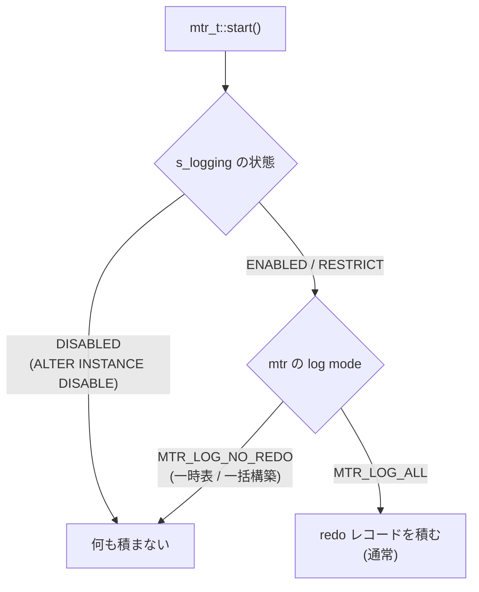

> **前提**: [mini-transaction](./mini-transaction/) / [redo ログ — mtr から #ib_redo ファイルまで](./redo-log-walkthrough/) / [クラッシュリカバリ](./crash-recovery/)

## 何を学んだか

mtr は「ページ変更 + redo レコード」の原子単位だが、**redo を書かないモードを持っている** ([mini-transaction](./mini-transaction/))。

```cpp title="storage/innobase/include/mtr0mtr.h (L603-L607)"
  /** Checks if this mtr has generated any redo log records which should be
  written to the redo log during commit().
  Note: If redo logging is disabled by set_log_mode(MTR_LOG_NONE) or
  set_log_mode(MTR_LOG_NO_REDO) or globally by s_logging.disable(..), then it
  will return false, even if set_modified() was called.
```

redo を書かない経路は 3 つあり、**代償の払い方が違う**。

| 経路                                     | 範囲                 | クラッシュしたら              | doublewrite    |
| ---------------------------------------- | -------------------- | ----------------------------- | -------------- |
| 一時テーブル                             | 一時テーブルスペース | そのテーブルが消える (想定内) | 通さない       |
| インデックス一括構築                     | 構築中のインデックス | DDL がやり直しになる          | 通す           |
| `ALTER INSTANCE DISABLE INNODB REDO_LOG` | サーバ全体           | **インスタンスを作り直す**    | 途中から止まる |

3 つ目だけが桁違いに危険で、その危険さがコードにそのまま書いてある。

## なぜそうなっているか

### 状態機械が「安全でない期間」を明示している

サーバ全体の redo 停止は、単なる ON/OFF ではなく 4 状態の遷移になっている。

```cpp title="storage/innobase/include/mtr0mtr.h (L229-L250)"
    /** mtr global redo logging state.
    Enable Logging  :
    [ENABLED] -> [ENABLED_RESTRICT] -> [DISABLED]

    Disable Logging :
    [DISABLED] -> [ENABLED_RESTRICT] -> [ENABLED_DBLWR] -> [ENABLED] */

    enum State : uint32_t {
      /* Redo Logging is enabled. Server is crash safe. */
      ENABLED,
      /* Redo logging is enabled. All non-logging mtr are finished with the
      pages flushed to disk. Double write is enabled. Some pages could be
      still getting written to disk without double-write. Not safe to crash. */
      ENABLED_DBLWR,
      /* Redo logging is enabled but there could be some mtrs still running
      in no logging mode. Redo archiving and clone are not allowed to start.
      No double-write */
      ENABLED_RESTRICT,
      /* Redo logging is disabled and all new mtrs would not generate any redo.
      Redo archiving and clone are not allowed. */
      DISABLED
    };
```

**戻すときのほうが手順が長い。** `ALTER INSTANCE ENABLE INNODB REDO_LOG` を打っても即座にクラッシュセーフには戻らず、「redo なしで走っていた mtr が全部終わり、そのページがディスクに落ちる」まで待つ必要がある。`ENABLED_DBLWR` のコメントに「Not safe to crash」と書いてあるのがその期間だ。

### なぜ doublewrite まで止まるのか

`DISABLED` の間は doublewrite も無効になる ([doublewrite](./doublewrite/))。**redo が無ければ torn page を直せないので、torn page を検出しても意味がない**からだ。保険を掛ける相手がいない。

これは「redo を止めれば書き込みが半分以下になる」という効果の内訳でもある。redo の書き込みと doublewrite の書き込みが両方消える。

### 止めるときに何を確認しているか

```cpp title="storage/innobase/mtr/mtr0mtr.cc (L941-L963)"
int mtr_t::Logging::disable(THD *) {
  if (is_disabled()) {
    return 0;
  }
  /* Disallow archiving to start. */
  ut_ad(m_state.load() == ENABLED);
  m_state.store(ENABLED_RESTRICT);

  /* Check if redo log archiving is active. */
  if (meb::redo_log_archive_is_active()) {
    m_state.store(ENABLED);
    my_error(ER_INNODB_REDO_ARCHIVING_ENABLED, MYF(0));
    return ER_INNODB_REDO_ARCHIVING_ENABLED;
  }

  /* Concurrent clone operation is not supported. */
  Clone_notify notifier(Clone_notify::Type::SYSTEM_REDO_DISABLE,
                        dict_sys_t::s_invalid_space_id, false);
```

**redo アーカイブとクローンが動いていたら断る。** どちらも redo を読む機能なので、途中で redo が途切れると壊れる。逆に、redo を止めている間はこれらを開始できない。

そして「ここから先はクラッシュしたら駄目」という印を**ディスクに書く**。

```cpp title="storage/innobase/mtr/mtr0mtr.cc (L976-L983)"
    log_persist_disable(*log_sys);
...
  ulonglong current_lsn = log_get_lsn(*log_sys);
  ib::warn(ER_IB_WRN_REDO_DISABLED_INFO, current_lsn);
  m_state.store(DISABLED);
```

redo ファイルのヘッダにフラグが立つ ([`log0constants.h#L220`](https://github.com/mysql/mysql-server/blob/mysql-8.4.11/storage/innobase/include/log0constants.h#L220))。

### 起動時に見つけたら起動しない

そのフラグが立ったまま起動しようとすると、サーバは**起動を拒否する**。

```cpp title="storage/innobase/log/log0files_finder.cc (L339-L347)"
    /* Exit if server is crashed while running without redo logging. */
    if (log_file_header_check_flag(log_flags, LOG_HEADER_FLAG_CRASH_UNSAFE)) {
      /* As of today, the only scenario which leads us here is that
      log_persist_disable() was called and then we crashed. If we
      ever introduce more possibilities, then we need to update
      the error message. */
      ut_ad(log_file_header_check_flag(log_flags, LOG_HEADER_FLAG_NO_LOGGING));
      ib::error(ER_IB_ERR_RECOVERY_REDO_DISABLED);
      return Log_files_find_result::FOUND_DISABLED_FILES;
    }
```

これは `DB_ERROR` になって起動が止まる ([`log0log.cc#L1901-L1903`](https://github.com/mysql/mysql-server/blob/mysql-8.4.11/storage/innobase/log/log0log.cc#L1901))。

**回復手段はない。** データファイルは redo なしで書かれた中途半端な状態なので、「頑張って直す」余地がない。**新しい datadir を作ってデータを入れ直す**しかない。これが「インスタンスを作り直す」という代償の意味だ。

正常終了した場合は、シャットダウン時に全ページを flush し終えた時点でこのフラグだけが外れる。

```cpp title="storage/innobase/buf/buf0flu.cc (L3526-L3529)"
  /* Mark that it is safe to recover as we have already flushed all dirty
  pages in buffer pools. */
  if (mtr_t::s_logging.is_disabled() && !srv_read_only_mode) {
    log_persist_crash_safe(*log_sys);
```

`log_persist_crash_safe` が落とすのは `LOG_HEADER_FLAG_CRASH_UNSAFE` だけで、`LOG_HEADER_FLAG_NO_LOGGING` は残る ([`log0log.cc#L1533-L1538`](https://github.com/mysql/mysql-server/blob/mysql-8.4.11/storage/innobase/log/log0log.cc#L1533))。**「redo を止めたまま `SHUTDOWN` して再起動する」は正常に動き、redo は止まったままになる。落ちたときだけ死ぬ。**

### 一括構築は自分でページを落とす

インデックスの一括構築 (`CREATE INDEX`、`ALTER TABLE` の再構築、8.0 の並列ロード) も redo を書かない。

```cpp title="storage/innobase/btr/btr0load.cc (L317, L834)"
  mtr->set_log_mode(MTR_LOG_NO_REDO);
...
  m_mtr->set_log_mode(MTR_LOG_NO_REDO);
```

こちらがサーバ全体の停止と決定的に違うのは、**構築側が自分で「このページ群をディスクに落とした」ことを保証する**点だ。

```cpp title="storage/innobase/include/mtr0mtr.h (L480-L484)"
  /** Checks if this mtr has modified any buffer pool page.
  It errs on the safe side: may return true even if it didn't modify any page.
  This is used in MTR_LOG_NO_REDO mode to detect that pages should be added to
  flush lists during commit() even though no redo log will be produced.
  @return true if the mini-transaction might have modified buffer pool pages. */
  [[nodiscard]] bool has_modifications() const {
```

**redo を書かない mtr でも、変更したページは flush list に載せる。** 載せなければ page cleaner が書き出さず、ディスクに何も残らない。redo という「後から再現する手段」を捨てた以上、**ページそのものが確実に書かれることだけが頼り**になる。

一括構築側はさらに flush observer を使い、DDL の最後に自分が触ったページをまとめて落とす。**DDL が完了した時点でディスク上のページが正しければ、redo は要らない。** 途中でクラッシュしても、未完了の DDL は DDL ログで巻き戻される ([アトミック DDL](./atomic-ddl-and-ddl-log/))。

つまり、**「redo を書かない」の代わりに「DDL 単位のやり直し」で耐久性を担保している**。B+tree を下から一括で作る経路の設計は[オンライン索引構築のページ](./online-index-build-row-log/)にある。

## ソースコードのどこか

### 3 つの経路の切り替え箇所



グローバルな停止は mtr の開始時に判定され、その mtr は「no logging mtr」として数えられる。

```cpp title="storage/innobase/mtr/mtr0mtr.cc (L609, L621)"
  m_impl.m_marked_nolog = s_logging.mark_mtr(shard_index);
...
    s_logging.unmark_mtr(m_impl.m_shard_index);
```

**シャード化されたカウンタで数えている**のは、`ENABLE` に戻すときに「redo なしの mtr が全部終わったか」を待つためだ。この待ち合わせがあるので、`ENABLE` はすぐには返らない。

### 起動時の再適用

再起動時に redo ヘッダのフラグを読み、**停止状態を引き継ぐ**。

```cpp title="storage/innobase/log/log0log.cc (L727-L732)"
  if (log_file_header_check_flag(log.m_log_flags, LOG_HEADER_FLAG_NO_LOGGING)) {
    auto result = mtr_t::s_logging.disable(nullptr);
    /* Currently never fails. */
    ut_a(result == 0);
    srv_redo_log = false;
  }
```

**正常終了して再起動しても、redo は止まったまま。** `ALTER INSTANCE ENABLE INNODB REDO_LOG` を明示的に打つまで戻らない。設定ファイルではなく redo ファイルのヘッダに状態があるので、「再起動すれば元に戻る」と思っていると危険な状態が続く。

現在の状態は状態変数で見える。

```sql
SHOW GLOBAL STATUS LIKE 'Innodb_redo_log_enabled';
```

この状態変数は `srv_redo_log` をそのまま公開したものだ ([`ha_innodb.cc#L1253`](https://github.com/mysql/mysql-server/blob/mysql-8.4.11/storage/innobase/handler/ha_innodb.cc#L1253))。

## どう活かすか

### `ALTER INSTANCE DISABLE INNODB REDO_LOG` を使ってよい場面

想定されている用途はただ 1 つ、**新しいインスタンスへの初期データ投入**だ。

条件はこうなる。

1. **失っても構わないデータしか入っていない** — 失敗したら datadir ごと捨ててやり直せる
2. **他の用途に使われていない** — 本番トラフィックが同居していたら論外
3. **投入後に必ず `ENABLE` して、完了を確認する** — `Innodb_redo_log_enabled` が `ON` に戻るまでは危険な期間

打ち手として持っておく価値はある。大量 `INSERT` では redo と doublewrite が消えるぶん、投入時間が体感で目に見えて縮む。**ただし本番稼働中のインスタンスで使う理由は 1 つもない。**

### 権限が分かれているのは事故防止

この文には `INNODB_REDO_LOG_ENABLE` という専用の動的権限が要る。`SUPER` や `ALTER` では打てない。**「うっかり打てない」ようにしてある**ということなので、運用でこの権限を常時付けて回らない。

### 一時テーブルが速い理由をここに結びつける

内部一時表 (`GROUP BY` の中間結果など) が redo を書かないのは、この 3 経路の 1 つ目だ ([一時テーブル](./temporary-tables-in-innodb/))。**重い集計クエリが redo を圧迫しない**のはこの設計のおかげで、逆に言えば「一時テーブルが大量に書かれても `Log sequence number` は伸びない」ので、redo の量だけを見て I/O 負荷を判断すると外す。

### DDL 中の I/O は redo に出ない

大きな `ALTER TABLE` の最中、redo の生成量はさほど伸びないのに、ディスクの書き込みは跳ねる。一括構築が redo を書かず、**ページを直接書いている**からだ ([flush list と page cleaner](./flush-list-and-page-cleaner/))。

DDL 中の I/O を見積もるときは、`Innodb_data_written` や OS 側のディスク統計を見る。redo 系の指標では見えない。
