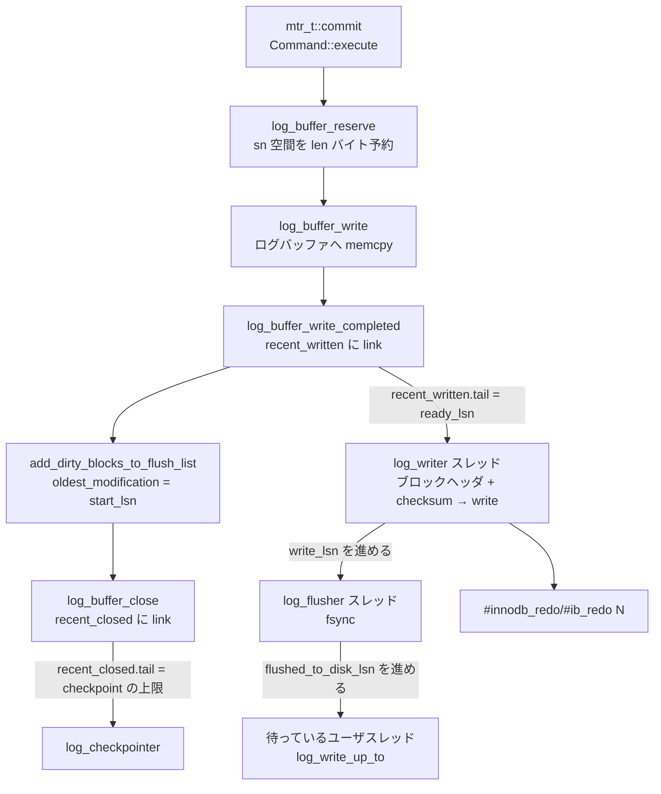

> **前提**: [WAL](./wal-and-recovery-basics/) / [UPDATE の一生](./life-of-an-update/)

## この層の責務

redo ログの仕事は 1 行で書ける。**「ページに何をしたか」を、全スレッド共通の 1 本の数直線の上に並べて、消えない場所に置く**。

なぜページそのものを書かないのかは[WAL の前提ページ](./wal-and-recovery-basics/)にある。ページの書き戻しはランダム I/O で、しかも 16KB 単位だ。対して redo レコードは数十バイトで、追記しかしない。コミットのたびに待たされるのが後者なら、待ち時間は桁で変わる。

この層が上に対して提供するものは 3 つしかない。

1. **`mtr_t::commit` からレコード列を受け取り、LSN の区間を割り当てる** — この区間が「そのページ変更はいつ起きたか」の唯一の時刻になる
2. **指定した LSN まで確実にディスクに届いた、と保証する** (`log_write_up_to`) — コミット時に待つのはこれ
3. **もう要らなくなった前半を捨てて、ファイルを再利用する** ([チェックポイント](./checkpoint/))

そして下に対しては、`#innodb_redo` ディレクトリの `#ib_redo<N>` というファイル群を管理する。**8.0.30 で `innodb_log_file_size` と `innodb_log_files_in_group` は役目を終え、`innodb_redo_log_capacity` 1 つになった。** ファイルの本数・サイズ・作成・削除は `log0files_governor.cc` (2000 行超) が実行中に動かしている。



上下の境界を 1 つだけ先に固定しておく。**ログバッファに入った時点では、まだ何もディスクに届いていない。** `mtr_t::commit` が返ってきても、`COMMIT` を発行しても、`innodb_flush_log_at_trx_commit` の値によっては `fsync` を待たない ([log writer のページ](./log-writer-threads/))。

## 主要な型とその関係

### `lsn` と `sn` — 別の数直線

最初に押さえるのがここだ。**LSN と SN は同じものの別名ではない。**

- **`sn_t`** — redo の**データバイトだけ**を数えた連番。ブロックのヘッダとトレーラは数えない
- **`lsn_t`** — ヘッダとトレーラも含めて数えた番号。ファイル上のオフセットに直接対応する

どちらも `uint64_t` だが ([`log0types.h#L63` / `#L86`](https://github.com/mysql/mysql-server/blob/mysql-8.4.11/storage/innobase/include/log0types.h#L63))、意味が違う。空間の予約は SN で行い、記録される時刻は LSN で表す。変換は [`log_translate_sn_to_lsn` (`log0log.h#L85`)](https://github.com/mysql/mysql-server/blob/mysql-8.4.11/storage/innobase/include/log0log.h#L85) の 1 行だ。

```cpp title="storage/innobase/include/log0log.h"
constexpr inline lsn_t log_translate_sn_to_lsn(sn_t sn) {
  return sn / LOG_BLOCK_DATA_SIZE * OS_FILE_LOG_BLOCK_SIZE +
         sn % LOG_BLOCK_DATA_SIZE + LOG_BLOCK_HDR_SIZE;
}
```

つまり **496 バイトのデータが進むごとに、LSN は 512 進む**。`SHOW ENGINE INNODB STATUS` に出る `Log sequence number` は LSN のほうなので、「1 秒で何バイト redo を書いたか」を LSN の差分で見ると 3% ほど多めに出る。

### ブロックのバイト配置

redo ログは 512 バイト単位のブロックの列だ ([`os0file.h#L192`](https://github.com/mysql/mysql-server/blob/mysql-8.4.11/storage/innobase/include/os0file.h#L192) の `OS_FILE_LOG_BLOCK_SIZE = 512`)。定数はすべて [`log0constants.h`](https://github.com/mysql/mysql-server/blob/mysql-8.4.11/storage/innobase/include/log0constants.h#L253) にある。

```text
512 バイトの redo ログブロック

offset   0          4        6        8              12
        +----------+--------+--------+--------------+
        |  hdr_no  |data_len|first_  |   epoch_no   |  ヘッダ 12 バイト
        | (4 byte) |(2 byte)|rec_grp |   (4 byte)   |  LOG_BLOCK_HDR_SIZE = 12
        |          |        |(2 byte)|              |
        +----------+--------+--------+--------------+
     12 |                                           |
        |        mtr の redo レコード列              |  データ 496 バイト
        |                                           |  LOG_BLOCK_DATA_SIZE
    508 +-------------------------------------------+
        |             checksum (4 byte)             |  トレーラ 4 バイト
    512 +-------------------------------------------+  LOG_BLOCK_TRL_SIZE = 4
```

- `hdr_no` (`LOG_BLOCK_HDR_NO = 0`) — ブロック番号。`epoch_no` (`LOG_BLOCK_EPOCH_NO = 8`) と組で絶対的なブロック番号になる。リカバリのとき「ログの末尾が来た」ことをこの不連続で検出する
- `data_len` (`LOG_BLOCK_HDR_DATA_LEN = 4`) — このブロックに何バイト入っているか。ヘッダの 12 バイトも含む
- `first_rec_group` (`LOG_BLOCK_FIRST_REC_GROUP = 6`) — **このブロックの中で mtr のレコード群が始まるオフセット。0 ならこのブロックの途中で始まる mtr はない**。リカバリのスキャンはここを頼りに「どこから読み始めればよいか」を決める
- checksum (`LOG_BLOCK_CHECKSUM = 4`、末尾からのオフセット)

**ヘッダのうち `first_rec_group` だけがログバッファへの書き込み時に埋まり、残りは log_writer が書き出す直前に埋める。** `prepare_full_blocks` ([`log0write.cc#L1534`](https://github.com/mysql/mysql-server/blob/mysql-8.4.11/storage/innobase/log/log0write.cc#L1534)) が `hdr_no` / `epoch_no` / `data_len` を、`log_block_store_checksum` が checksum を書く。

### `log_t` — この層の状態のすべて

[`log0sys.h#L77`](https://github.com/mysql/mysql-server/blob/mysql-8.4.11/storage/innobase/include/log0sys.h#L77) の `log_t` に、進行状況を表す LSN が並んでいる。**これらの LSN のあいだの大小関係が、この層のほぼすべての不変条件だ。**

| フィールド                     | 意味                                                       | 進めるのは                  |
| ------------------------------ | ---------------------------------------------------------- | --------------------------- |
| `sn`                           | 次に予約する SN。`log_get_lsn()` はこれを LSN に直したもの | ユーザスレッド (atomic)     |
| `recent_written.tail()`        | ここまではログバッファへの `memcpy` が完了                 | log_writer / ユーザスレッド |
| `write_lsn`                    | ここまでは `write(2)` が終わった                           | log_writer                  |
| `flushed_to_disk_lsn`          | ここまでは `fsync` が終わった                              | log_flusher                 |
| `recent_closed.tail()`         | ここまでは dirty page が flush list に載った               | ユーザスレッド              |
| `available_for_checkpoint_lsn` | ここまでならチェックポイントを打てる                       | log_checkpointer            |
| `last_checkpoint_lsn`          | 最後に打ったチェックポイント                               | log_checkpointer            |

`log_get_lsn() >= recent_written.tail() >= write_lsn >= flushed_to_disk_lsn >= available_for_checkpoint_lsn >= last_checkpoint_lsn` が常に成り立つ。**`recent_closed.tail()` だけはこの鎖に載らない**。redo をログバッファに置くのと dirty page を flush list に載せるのは別の段なので、`write_lsn` を追い越すことも追い越されることもある。チェックポイントの上限としては効くので、`available_for_checkpoint_lsn <= recent_closed.tail()` は成り立つ。`SHOW ENGINE INNODB STATUS` の LOG セクションはこの順で印字している ([`log0log.cc#L1163`](https://github.com/mysql/mysql-server/blob/mysql-8.4.11/storage/innobase/log/log0log.cc#L1163))。

```text
Log sequence number          <- log_get_lsn()
Log buffer assigned up to    <- log_get_lsn()
Log buffer completed up to   <- recent_written.tail()
Log written up to            <- write_lsn
Log flushed up to            <- flushed_to_disk_lsn
Added dirty pages up to      <- recent_closed.tail()
Pages flushed up to          <- available_for_checkpoint_lsn
Last checkpoint at           <- last_checkpoint_lsn
```

### `Link_buf` — 順序のない完了報告を順序に戻す

`recent_written` と `recent_closed` は [`Link_buf<lsn_t>`](https://github.com/mysql/mysql-server/blob/mysql-8.4.11/storage/innobase/include/ut0link_buf.h#L78) というリングバッファだ ([`log0sys.h#L143` / `#L157`](https://github.com/mysql/mysql-server/blob/mysql-8.4.11/storage/innobase/include/log0sys.h#L143))。

問題はこうだ。ユーザスレッドは `log_buffer_reserve` で SN の区間を atomic に予約するが、**その後の `memcpy` は並行に、しかも予約順とは無関係な順で終わる**。「LSN X までは確実に全部書き終えた」を知るには、穴のない先頭を追う仕組みが要る。

`Link_buf` はこれを `from → to` の有向リンクの集合として持ち、tail から辿れるところまで tail を進める。ロックは要らない。リングの大きさが「同時に開いていられる穴の最大幅」になり、既定は前者が 1MB、後者が 2MB だ ([`log0constants.h#L493` 付近](https://github.com/mysql/mysql-server/blob/mysql-8.4.11/storage/innobase/include/log0constants.h#L493))。対応する `innodb_log_recent_written_size` / `innodb_log_recent_closed_size` は `ENABLE_EXPERIMENT_SYSVARS` 付きでビルドしたときにしか現れない (`CMakeLists.txt` の既定は OFF) ので、**配布バイナリでは変更できない**。

### ファイル群 — `Log_files_capacity` と governor

ディレクトリは `#innodb_redo`、ファイルは `#ib_redo<N>` ([`log0constants.h#L73` / `#L76`](https://github.com/mysql/mysql-server/blob/mysql-8.4.11/storage/innobase/include/log0constants.h#L73)、組み立ては [`log0files_io.cc#L716`](https://github.com/mysql/mysql-server/blob/mysql-8.4.11/storage/innobase/log/log0files_io.cc#L716))。まだ使っていない予備ファイルは `#ib_redo<N>_tmp` という名前で先に作られる。

- 目標本数 `LOG_N_FILES = 32`。1 ファイルのサイズは `innodb_redo_log_capacity / 32`
- `innodb_redo_log_capacity` は既定 100MB、範囲は `LOG_CAPACITY_MIN = 8M` 〜 `LOG_CAPACITY_MAX = 512G` ([`ha_innodb.cc#L22840`](https://github.com/mysql/mysql-server/blob/mysql-8.4.11/storage/innobase/handler/ha_innodb.cc#L22840))
- 各ファイルの先頭 `LOG_FILE_HDR_SIZE = 4 * 512 = 2048` バイトはヘッダで、**チェックポイントはこのヘッダの 2 箇所 (`LOG_CHECKPOINT_1 = 512` と `LOG_CHECKPOINT_2 = 1536`) に交互に書かれる**

[`Log_files_capacity`](https://github.com/mysql/mysql-server/blob/mysql-8.4.11/storage/innobase/include/log0files_capacity.h#L56) が、物理容量から 3 段の論理上限を導く。

- `soft_logical_capacity()` — ユーザスレッドが使ってよい上限。超えると `log_free_check()` で全員止まる
- `hard_logical_capacity()` — log_writer が使ってよい上限。soft との差が「非常用マージン」
- `adaptive_flush_min_age()` / `adaptive_flush_max_age()` / `aggressive_checkpoint_min_age()` — チェックポイント age がこれを超えるにつれ、page cleaner とチェックポイントが段階的に必死になる

論理容量が物理容量より小さいのは、**次のファイルを常に 1 本作れる余地を残すため**だ。ヘッダのコメントによれば `(LOG_N_FILES - 2) / LOG_N_FILES` に抑えている。

## 処理の流れ

### 1. mtr がレコード列を渡す

[`mtr_t::Command::execute` (`mtr0mtr.cc#L839`)](https://github.com/mysql/mysql-server/blob/mysql-8.4.11/storage/innobase/mtr/mtr0mtr.cc#L839) がこの層の唯一の入口だ。

```cpp title="storage/innobase/mtr/mtr0mtr.cc"
  ulint len = prepare_write();

  if (len > 0) {
    mtr_write_log_t write_log;

    write_log.m_left_to_write = len;

    auto handle = log_buffer_reserve(*log_sys, len);

    write_log.m_handle = handle;
    write_log.m_lsn = handle.start_lsn;

    m_impl->m_log.for_each_block(write_log);
    ...
    log_wait_for_space_in_log_recent_closed(*log_sys, handle.start_lsn);
    ...
    add_dirty_blocks_to_flush_list(handle.start_lsn, handle.end_lsn);

    log_buffer_close(*log_sys, handle);

    m_impl->m_mtr->m_commit_lsn = handle.end_lsn;
```

この 5 段の順序に意味がある。詳細は[mini-transaction のページ](./mini-transaction/)。

### 2. SN の予約 — 唯一の直列化点

[`log_buffer_reserve` (`log0buf.cc#L859`)](https://github.com/mysql/mysql-server/blob/mysql-8.4.11/storage/innobase/log/log0buf.cc#L859) が `log.sn` を `len` だけ atomic に進め、返ってきた `start_sn` / `end_sn` を LSN に直して `Log_handle` に詰める。

```cpp title="storage/innobase/log/log0buf.cc"
  /* Reserve space in sequence of data bytes: */
  const sn_t start_sn = log_buffer_s_lock_enter_reserve(log, len);
  ...
  /* Headers in redo blocks are not calculated to sn values: */
  const sn_t end_sn = start_sn + len;
  ...
  /* Translate sn to lsn (which includes also headers in redo blocks): */
  handle.start_lsn = log_translate_sn_to_lsn(start_sn);
  handle.end_lsn = log_translate_sn_to_lsn(end_sn);
```

**ここが redo 全体で唯一の全スレッド共通の直列化点**で、しかも atomic の fetch_add 1 回だ。ログバッファに空きがないときだけ (`end_sn > buf_limit_sn`) 待ちに落ちる。

### 3. ログバッファへの `memcpy`

[`log_buffer_write` (`log0buf.cc#L922`)](https://github.com/mysql/mysql-server/blob/mysql-8.4.11/storage/innobase/log/log0buf.cc#L922) が、割り当てられた LSN 区間に対応するログバッファの位置へコピーする。ログバッファは `innodb_log_buffer_size` の環状バッファで、位置は `lsn % log.buf_size` で決まる。**512 バイト境界をまたぐときはヘッダの 12 バイトを飛ばして書く**ので、コピーが分割される。

コピーが終わったら [`log_buffer_write_completed` (L1061)](https://github.com/mysql/mysql-server/blob/mysql-8.4.11/storage/innobase/log/log0buf.cc#L1061) が `recent_written` にリンクを追加し、tail を進められるところまで進める。

### 4. log_writer が書く

[`log_writer` (`log0write.cc#L2239`)](https://github.com/mysql/mysql-server/blob/mysql-8.4.11/storage/innobase/log/log0write.cc#L2239) は `recent_written.tail()` を見て、`write_lsn` との差があれば [`log_writer_write_buffer` (L2125)](https://github.com/mysql/mysql-server/blob/mysql-8.4.11/storage/innobase/log/log0write.cc#L2125) を呼ぶ。ここで**書く前に 3 種類の待ちが入りうる**。

1. `log_writer_wait_on_checkpoint` (L1984) — チェックポイントが進まないとファイルを再利用できない
2. `log_writer_wait_on_archiver` (L1996) — redo archiver が有効なとき
3. `log_writer_wait_on_consumers` (L2069) — MySQL Enterprise Backup のような外部の消費者

それを抜けたら `prepare_full_blocks` でヘッダを埋め、必要なら write-ahead バッファに詰め替え (`innodb_log_write_ahead_size`、既定 8KB)、`write(2)` を発行して `write_lsn` を進める。

### 5. log_flusher が `fsync` する

[`log_flusher` (L2504)](https://github.com/mysql/mysql-server/blob/mysql-8.4.11/storage/innobase/log/log0write.cc#L2504) → [`log_flush_low` (L2430)](https://github.com/mysql/mysql-server/blob/mysql-8.4.11/storage/innobase/log/log0write.cc#L2430)。**flusher が対象にするのは常に `write_lsn` まで**であって、それより先には決して行かない。`fsync` が終わったら `flushed_to_disk_lsn` を進めて、待っている人を起こす ([log writer のページ](./log-writer-threads/))。

### 6. コミットが待つ

[`log_write_up_to` (`log0write.cc#L1086`)](https://github.com/mysql/mysql-server/blob/mysql-8.4.11/storage/innobase/log/log0write.cc#L1086) が「LSN X まで write / flush が済むまで待つ」の入口だ。呼ぶのは 2 箇所ある。

- コミット時 — `trx_flush_log_if_needed_low` (`trx0trx.cc#L1758`)。`innodb_flush_log_at_trx_commit` で `flush_to_disk` が決まる ([UPDATE の一生](./life-of-an-update/))
- **dirty page を書き出す直前** — [`buf_flush_write_block_low` (`buf0flu.cc#L1199`)](https://github.com/mysql/mysql-server/blob/mysql-8.4.11/storage/innobase/buf/buf0flu.cc#L1199)。これが WAL 規則そのものだ

## 守られている不変条件

**1. ページを書く前に、そのページを最後に変えた redo が `fsync` されている。**

```cpp title="storage/innobase/buf/buf0flu.cc"
  /* Force the log to the disk before writing the modified block */
  if (!srv_read_only_mode) {
    const lsn_t flush_to_lsn = bpage->get_newest_lsn();
    ...
    if (log_sys->flushed_to_disk_lsn.load() < flush_to_lsn) {
      Wait_stats wait_stats;

      wait_stats = log_write_up_to(*log_sys, flush_to_lsn, true);
```

`newest_modification` はそのページを最後に変えた mtr の `end_lsn` だ。これが守られる限り、リカバリはページの `FIL_PAGE_LSN` 以降の redo を持っている。

**2. `flushed_to_disk_lsn <= write_lsn <= recent_written.tail() <= log_get_lsn()`。**

log_flusher は `write_lsn` を読んでからそこまでを `fsync` する。log_writer は `recent_written.tail()` までしか書かない。tail は `memcpy` が完了した区間の穴のない先頭でしかない。

**3. チェックポイント LSN は `recent_closed.tail()` を超えない。**

[`log_compute_available_for_checkpoint_lsn` (`log0chkp.cc#L180`)](https://github.com/mysql/mysql-server/blob/mysql-8.4.11/storage/innobase/log/log0chkp.cc#L180) がこの上限を取る。理由はコメントに書いてある。

```cpp title="storage/innobase/log/log0chkp.cc"
  /* We cannot return lsn larger than dpa_lsn,
  because some mtr's commit could be in the middle, after
  its log records have been written to log buffer, but before
  its dirty pages have been added to flush lists. */
```

**mtr は redo をログバッファに置いてから dirty page を flush list に載せるまでに隙間がある。** その隙間にいる mtr のページを取りこぼさないために、チェックポイントは `recent_closed.tail()` (= `Added dirty pages up to`) より先には行けない。

**4. flush list は `oldest_modification` の厳密な昇順ではない。**

これも `Link_buf` の帰結だ。`buf0flu.cc` のコメントが「relaxed order」と明言している。ずれの上限は `recent_closed` の容量 (`log_buffer_flush_order_lag`) で、`buf_pool_get_oldest_modification_lwm()` はその分を引いた安全側の値を返す。

**5. checkpoint を書く前に、データファイルが `fsync` されている。** [`log_checkpoint` (`log0chkp.cc#L443`)](https://github.com/mysql/mysql-server/blob/mysql-8.4.11/storage/innobase/log/log0chkp.cc#L443) は checkpoint ヘッダを書く前に `buf_flush_fsync()` を呼ぶ。「チェックポイント LSN より前のページ変更はディスクにある」を成立させるのがこの 1 行だ。

## つまずきどころ

**8.0.30 より前の記事がそのまま当てはまらない。** `innodb_log_file_size` × `innodb_log_files_in_group` でサイズを決める説明は 8.4 では無効だ。設定は `innodb_redo_log_capacity` だけで、しかも**オンラインで変更できる** (`PLUGIN_VAR_PERSIST_AS_READ_ONLY` だが `innodb_redo_log_capacity_update` がある)。ファイルは 32 本前後に自動で割られ、リサイズ中は古いサイズと新しいサイズのファイルが混在する。`ib_logfile0` という名前は旧形式 (`log0pre_8_0_30.cc`) にしか出てこない。

**`Log sequence number` の差分は書き込みバイト数ではない。** LSN はブロックヘッダとトレーラの 16 バイト分を含む。実際のデータバイト数を知りたいなら SN で考えるか、`Innodb_os_log_written` を見る。

**ログバッファを大きくしても `fsync` は減らない。** `innodb_log_buffer_size` が効くのは「予約が空き待ちで止まるか」だけで、`fsync` の回数を決めるのは `innodb_flush_log_at_trx_commit` とコミットの頻度だ。逆に、長いトランザクションで 1 回のコミットあたりの redo が大きい場合には効く。

**`recent_written` / `recent_closed` はそもそもチューニング対象ではない。** サイズを変える変数が実験用ビルドにしか存在しない。仮に広げても、これらは「同時に開いていられる穴の幅」であってスループットの上限ではなく、`recent_closed` を大きくすれば flush list の順序のずれが広がってチェックポイントが取れる LSN は保守的になる。

**redo ログの書き込みは 512 バイト単位に切り上げられる。** log_writer は「完全なブロックだけ書く」戦略を採り、最後の不完全なブロックは次回書き直す。小さいトランザクションを高頻度でコミットすると、同じ 512 バイトを何度も書くことになる。グループコミット ([2PC のページ](./two-phase-commit-and-group-commit/)) が効くのはこの重複を潰すからでもある。
