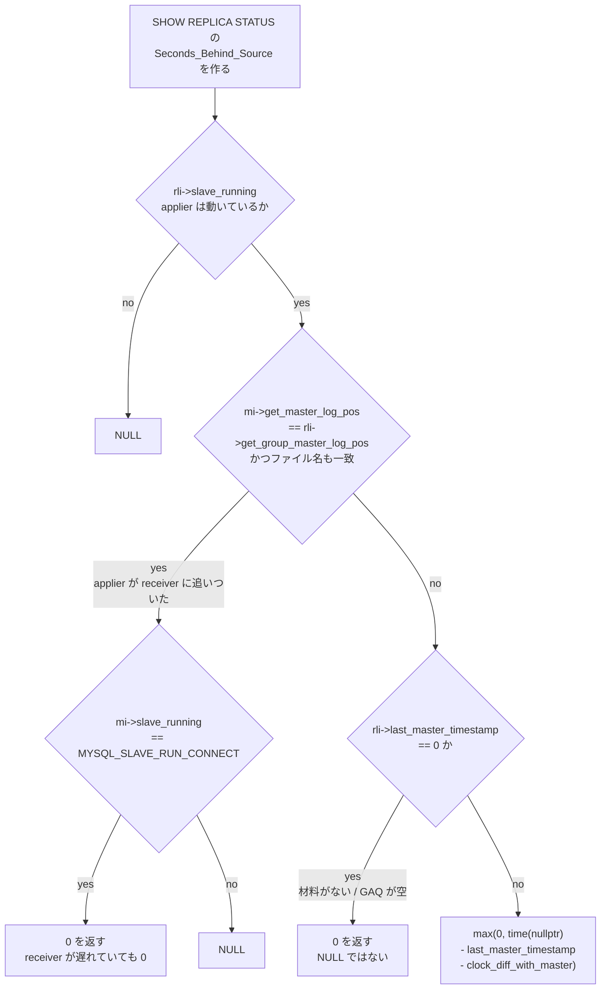

## 何を学んだか

`SHOW REPLICA STATUS` の `Seconds_Behind_Source` は、名前から想像されるような「source の最新状態から何秒遅れているか」ではない。実体は 3 行の引き算だ。

```cpp title="sql/rpl_replica.cc"
      long time_diff = ((long)(time(nullptr) - mi->rli->last_master_timestamp) -
                        mi->clock_diff_with_master);
```

この式には落とし穴が 4 つ入っている。

1. **`clock_diff_with_master` は接続時に 1 回だけ測った値**で、以後更新されない
2. **`last_master_timestamp` が 0 なら、式を通さず 0 を返す。** NULL ではない
3. **「追いついた」の判定は source とではなく、同じレプリカの receiver と比較して行う。** receiver が遅れていれば applier がそれに追いついた瞬間に 0 になる
4. **MTA (既定で有効) では `last_master_timestamp` は GAQ の先頭が退出したときにしか進まない**

結果として、**`Seconds_Behind_Source = 0` は「追いついた」を意味しない**。意味するのは「applier が relay log を読み切った」または「タイムスタンプの材料がない」のどちらかでしかない。



**0 に到達する経路が 2 本ある**のがこの図の要点だ。片方は「applier が receiver に追いついた」、もう片方は「タイムスタンプの材料がない」で、表示上は区別できない。

正しく測るには、遅延を **receiver lag** (source → relay log) と **applier lag** (relay log → 適用完了) に分け、`performance_schema` の timestamp 列を使う。

## ソースコードのどこか

### 計算式の全体

[`show_slave_status_send_data` (`rpl_replica.cc#L3447`)](https://github.com/mysql/mysql-server/blob/mysql-8.4.11/sql/rpl_replica.cc#L3447) の中に擬似コードのコメントごと置かれている。

```cpp title="sql/rpl_replica.cc"
  /*
     The pseudo code to compute Seconds_Behind_Source:
     if (SQL thread is running)
     {
       if (SQL thread processed all the available relay log)
       {
         if (IO thread is running)
            print 0;
         else
            print NULL;
       }
        else
          compute Seconds_Behind_Source;
      }
      else
       print NULL;
  */
```

実際の分岐はこうなっている。

```cpp title="sql/rpl_replica.cc"
  if (mi->rli->slave_running) {
    /*
       Check if SQL thread is at the end of relay log
       Checking should be done using two conditions
       condition1: compare the log positions and
       condition2: compare the file names (to handle rotation case)
    */
    if ((mi->get_master_log_pos() == mi->rli->get_group_master_log_pos()) &&
        (!strcmp(mi->get_master_log_name(),
                 mi->rli->get_group_master_log_name()))) {
      if (mi->slave_running == MYSQL_SLAVE_RUN_CONNECT)
        protocol->store(0LL);
      else
        protocol->store_null();
    } else {
```

**`mi->get_master_log_pos()` は receiver (I/O スレッド) が source から読んだ位置、`rli->get_group_master_log_pos()` は applier が適用し終えた位置だ。** どちらもレプリカ側の値で、source の現在位置は出てこない。

**つまりこの判定は「applier が receiver に追いついたか」を見ている。** ネットワークが遅くて receiver が source から 10 分遅れていても、applier が receiver に追いついていれば `Seconds_Behind_Source` は 0 になる。

追いついていないときの計算と、0 を返す条件。

```cpp title="sql/rpl_replica.cc"
        last_master_timestamp == 0 (an "impossible" timestamp 1970) is a
        special marker to say "consider we have caught up".
      */
      protocol->store(
          (longlong)(mi->rli->last_master_timestamp ? max(0L, time_diff) : 0));
```

**`last_master_timestamp == 0` なら `0` を `store` する。`store_null()` ではない。** 「タイムスタンプの材料がない」と「遅延ゼロ」が同じ値に潰れる。`max(0L, ...)` があるので負の値も 0 になる。

### `clock_diff_with_master` は接続時に 1 回だけ

[`get_master_version_and_clock` の中 (L2753)](https://github.com/mysql/mysql-server/blob/mysql-8.4.11/sql/rpl_replica.cc#L2753)。

```cpp title="sql/rpl_replica.cc"
  master_res = nullptr;
  if (!mysql_real_query(mysql, STRING_WITH_LEN("SELECT UNIX_TIMESTAMP()")) &&
      (master_res = mysql_store_result(mysql)) &&
      (master_row = mysql_fetch_row(master_res))) {
    mysql_mutex_lock(&mi->data_lock);
    mi->clock_diff_with_master =
        (long)(time((time_t *)nullptr) - strtoul(master_row[0], nullptr, 10));
```

**receiver が接続を張った瞬間の `SELECT UNIX_TIMESTAMP()` 1 回で決まる。** 接続が続いている限り再測定されない。NTP が片方だけ時刻を飛ばしたり、VM のサスペンドで時計がずれたりすると、その分だけ `Seconds_Behind_Source` に固定のバイアスが乗る。

取得に失敗した場合は 0 に落として警告を出す。

```cpp title="sql/rpl_replica.cc"
    mi->clock_diff_with_master = 0; /* The "most sensible" value */
    mysql_mutex_unlock(&mi->data_lock);
    LogErr(WARNING_LEVEL, ER_RPL_REPLICA_SECONDS_BEHIND_SOURCE_DUBIOUS,
           mysql_error(mysql), mysql_errno(mysql));
```

**エラーログにこの警告が出ていたら、その接続の `Seconds_Behind_Source` は信用できない。**

### `last_master_timestamp` の更新 — シングルスレッド applier

[`apply_event_and_update_pos` の呼び出し元 (L4947)](https://github.com/mysql/mysql-server/blob/mysql-8.4.11/sql/rpl_replica.cc#L4947)。

```cpp title="sql/rpl_replica.cc"
    if ((!rli->is_parallel_exec() || rli->last_master_timestamp == 0) &&
        !(ev->is_artificial_event() || ev->is_relay_log_event() ||
          ev->get_type_code() ==
              mysql::binlog::event::FORMAT_DESCRIPTION_EVENT ||
          ev->server_id == 0)) {
      rli->last_master_timestamp =
          ev->common_header->when.tv_sec + (time_t)ev->exec_time;
```

条件の 1 つ目が `!rli->is_parallel_exec()` である点が肝だ。**並列適用が有効なら (8.4 の既定は `replica_parallel_workers=4`)、この分岐は初回 (`last_master_timestamp == 0`) を除いて通らない。**

除外条件も重要だ。**ハートビート (`server_id == 0` の artificial event) や FDE では更新されない。** だから source が完全に静かなとき、`last_master_timestamp` は最後の実イベントの時刻のまま止まる。

### MTA での更新 — チェックポイントでしか進まない

[`mta_checkpoint_routine` (L6463)](https://github.com/mysql/mysql-server/blob/mysql-8.4.11/sql/rpl_replica.cc#L6463) の末尾。

```cpp title="sql/rpl_replica.cc"
  /*
    Update the rli->last_master_timestamp for reporting correct
    Seconds_behind_source.

    If GAQ is empty, set it to zero.
    Else, update it with the timestamp of the first job of the Slave_job_queue
    which was assigned in the Log_event::get_slave_worker() function.
  */
  ts = rli->gaq->empty()
           ? 0
           : reinterpret_cast<Slave_job_group *>(rli->gaq->head_queue())->ts;
  rli->reset_notified_checkpoint(cnt, ts, true);
```

**GAQ の先頭 (= 最も古い未完了トランザクション) の時刻が採用される。** GAQ が空なら 0 になり、その 0 が「遅延ゼロ」として表示される。

チェックポイントが走る周期は `replica_checkpoint_period` (既定 300ms) と `replica_checkpoint_group` (既定 512 トランザクション) のどちらか早いほう ([`sys_vars.cc#L6128`](https://github.com/mysql/mysql-server/blob/mysql-8.4.11/sql/sys_vars.cc#L6128))。**1 本の巨大トランザクションが GAQ の先頭に居座っている間、後続がいくら完了しても `last_master_timestamp` は動かない**ので、遅延の数字は伸び続ける ([applier と並列適用](./applier-and-mta/))。

### `SQL_Delay` は遅延ではない

`CHANGE REPLICATION SOURCE TO SOURCE_DELAY = N` を設定すると、applier がわざと N 秒待つ ([L4322 付近](https://github.com/mysql/mysql-server/blob/mysql-8.4.11/sql/rpl_replica.cc#L4322))。

```cpp title="sql/rpl_replica.cc"
        sql_delay_end = ceil((static_cast<Gtid_log_event *>(ev)
                                  ->immediate_commit_timestamp) /
                             1000000.00) +
                        sql_delay;
```

**この待ちも `Seconds_Behind_Source` に乗る。** 遅延レプリカを立てていると、正常時でも `Seconds_Behind_Source ≈ SOURCE_DELAY` になる。`SQL_Remaining_Delay` 列と `SQL_Delay` 列で切り分ける。

なお `commit_timestamps_status == COMMIT_TS_FOUND` なら `Gtid_log_event` の `immediate_commit_timestamp` (マイクロ秒) を基準にし、そうでなければイベントヘッダの秒 + `clock_diff_with_master` を使う。**GTID があるほうが精度が高い。**

### 正しく測るための timestamp 列

`performance_schema` は receiver と applier のそれぞれについて、トランザクション単位の時刻を持っている。

**receiver 側** — `replication_connection_status` ([`table_replication_connection_status.cc#L104`](https://github.com/mysql/mysql-server/blob/mysql-8.4.11/storage/perfschema/table_replication_connection_status.cc#L104))。

```
LAST_QUEUED_TRANSACTION                              CHAR(90)
LAST_QUEUED_TRANSACTION_ORIGINAL_COMMIT_TIMESTAMP    TIMESTAMP(6)
LAST_QUEUED_TRANSACTION_IMMEDIATE_COMMIT_TIMESTAMP   TIMESTAMP(6)
LAST_QUEUED_TRANSACTION_START_QUEUE_TIMESTAMP        TIMESTAMP(6)
LAST_QUEUED_TRANSACTION_END_QUEUE_TIMESTAMP          TIMESTAMP(6)
QUEUEING_TRANSACTION ... (受信中のもの)
```

**applier 側** — `replication_applier_status_by_worker` ([`table_replication_applier_status_by_worker.cc#L70`](https://github.com/mysql/mysql-server/blob/mysql-8.4.11/storage/perfschema/table_replication_applier_status_by_worker.cc#L70))。

```
LAST_APPLIED_TRANSACTION                             CHAR(90)
LAST_APPLIED_TRANSACTION_ORIGINAL_COMMIT_TIMESTAMP   TIMESTAMP(6)
LAST_APPLIED_TRANSACTION_IMMEDIATE_COMMIT_TIMESTAMP  TIMESTAMP(6)
LAST_APPLIED_TRANSACTION_START_APPLY_TIMESTAMP       TIMESTAMP(6)
LAST_APPLIED_TRANSACTION_END_APPLY_TIMESTAMP         TIMESTAMP(6)
APPLYING_TRANSACTION ... (適用中のもの)
```

`ORIGINAL_COMMIT_TIMESTAMP` は**元の source でコミットされた時刻**、`IMMEDIATE_COMMIT_TIMESTAMP` は**直近の上流でコミットされた時刻**だ。どちらも `Gtid_log_event` が運んできた値で ([`control_events.h#L1034`](https://github.com/mysql/mysql-server/blob/mysql-8.4.11/libs/mysql/binlog/event/control_events.h#L1034))、レプリカ側の時計に依存しない。

**これで 3 種類の遅延を分けて測れる。**

```sql
-- receiver lag: source でコミットされてから relay log に書き終わるまで
SELECT
  LAST_QUEUED_TRANSACTION,
  TIMESTAMPDIFF(MICROSECOND,
    LAST_QUEUED_TRANSACTION_ORIGINAL_COMMIT_TIMESTAMP,
    LAST_QUEUED_TRANSACTION_END_QUEUE_TIMESTAMP) / 1000000 AS receiver_lag_sec
FROM performance_schema.replication_connection_status;

-- applier lag: source でコミットされてからレプリカで適用し終わるまで (= end-to-end)
SELECT
  WORKER_ID,
  LAST_APPLIED_TRANSACTION,
  TIMESTAMPDIFF(MICROSECOND,
    LAST_APPLIED_TRANSACTION_ORIGINAL_COMMIT_TIMESTAMP,
    LAST_APPLIED_TRANSACTION_END_APPLY_TIMESTAMP) / 1000000 AS e2e_lag_sec,
  TIMESTAMPDIFF(MICROSECOND,
    LAST_APPLIED_TRANSACTION_START_APPLY_TIMESTAMP,
    LAST_APPLIED_TRANSACTION_END_APPLY_TIMESTAMP) / 1000000 AS apply_time_sec
FROM performance_schema.replication_applier_status_by_worker;

-- 今まさに詰まっているものを見る
SELECT WORKER_ID, APPLYING_TRANSACTION,
       APPLYING_TRANSACTION_ORIGINAL_COMMIT_TIMESTAMP,
       APPLYING_TRANSACTION_START_APPLY_TIMESTAMP
FROM performance_schema.replication_applier_status_by_worker
WHERE APPLYING_TRANSACTION <> '';
```

`ORIGINAL_COMMIT_TIMESTAMP` は source の時計、`END_APPLY_TIMESTAMP` はレプリカの時計なので、この 2 つの差にはやはり時計のずれが乗る。**ただし `Seconds_Behind_Source` と違って「1 回測ったきりの補正値」は挟まらない**ので、NTP が動いていれば素直な値になる。`START_APPLY` と `END_APPLY` の差はレプリカ内で完結するので、時計のずれの影響を受けない。

## なぜそうなっているか

**`Seconds_Behind_Source` が source と直接比較していないのは、レプリカが source の現在時刻を知らないからだ。** 知る手段は接続時の `SELECT UNIX_TIMESTAMP()` しかなく、それを毎秒やればレプリカ台数ぶんのクエリが source に飛ぶ。**「イベントに埋め込まれた時刻」と「自分の時計」の差で近似する**というのが、追加コストゼロで作れる唯一の指標だった。

**「追いついた」の判定を receiver との比較にしているのも同じ制約から来ている。** applier が「relay log の末尾に到達した」ことは自分で分かるが、「source の末尾に到達した」ことは分からない。**receiver が遅れているケースを検出する能力を、この指標は構造的に持っていない。**

**`last_master_timestamp == 0` を「追いついたとみなす」に倒したのは、NULL より 0 のほうが監視しやすいという判断だろう。** コメントが `an "impossible" timestamp 1970` と書いているとおり、0 は「値がない」を表すセンチネルとして使われている。しかし表示上は「遅延ゼロ」と区別がつかない。**この 1 行が、`Seconds_Behind_Source` を監視指標として信用できなくしている最大の原因だ。**

**MTA でチェックポイント単位でしか更新しないのは、GAQ の先頭が「本当に処理し終わった位置」だからだ。** worker 3 が worker 1 より先に完了しても、worker 1 が終わっていなければ「ここまで終わった」とは言えない。**GAQ の先頭の時刻が、レプリカが胸を張れる唯一の位置**になる。副作用として、先頭に居座る巨大トランザクションが指標を凍らせる。

**`performance_schema` 側の timestamp が source 由来の値を持っているのは、この構造的な欠陥への後付けの答えだ。** `Gtid_log_event` に `original_commit_timestamp` と `immediate_commit_timestamp` を入れたのは MySQL 8.0 からで、レプリカ側の時計と補正値に依存しない遅延測定を可能にするためだった。**`Seconds_Behind_Source` は互換のために残っているレガシー指標**と考えるのが正しい。

## どう活かすか

**監視ダッシュボードの `Seconds_Behind_Source` を `performance_schema` ベースに置き換える。** 上の 2 つのクエリを定期実行して、receiver lag と end-to-end lag を別々のメトリクスとして出す。`Seconds_Behind_Source` は「NULL かどうか」(= スレッドが止まっているか) の判定にだけ使う。

**`Seconds_Behind_Source = 0` で read-your-writes を判断しない。** 0 は「applier が receiver に追いついた」または「材料がない」でしかない。書いた直後の読み取りを保証したいなら `WAIT_FOR_EXECUTED_GTID_SET` を使う ([GTID のページ](./gtid/))。

**receiver lag と applier lag のどちらが大きいかで打ち手が変わる。** receiver lag が大きいならネットワーク帯域か source 側の dump thread、applier lag が大きいならレプリカ側の I/O か並列度だ。**両方見ずに `replica_parallel_workers` を上げても、receiver が詰まっていれば何も変わらない。**

**`Seconds_Behind_Source` が階段状に増減するならチェックポイント周期を疑う。** MTA では `replica_checkpoint_period` (既定 300ms) ごとにしか更新されないうえ、GAQ の先頭が動くまで値が固まる。**滑らかな遅延グラフが欲しいなら `performance_schema` を見るしかない。**

**エラーログに `"SELECT UNIX_TIMESTAMP()" failed on source, do not trust column Seconds_Behind_Source of SHOW REPLICA STATUS` が出ていたら、その接続の `Seconds_Behind_Source` は補正なしの生の差だ** ([`share/messages_to_error_log.txt#L1713`](https://github.com/mysql/mysql-server/blob/mysql-8.4.11/share/messages_to_error_log.txt#L1713))。`clock_diff_with_master = 0` なので、source とレプリカの時計がずれているぶんがそのまま出る。

**遅延レプリカ (`SOURCE_DELAY`) では `SQL_Remaining_Delay` を見る。** `Seconds_Behind_Source` は設定した遅延ぶんを含むので、正常時でも大きい値になる。監視の閾値は `SOURCE_DELAY + 許容遅延` に設定する。

**巨大トランザクション 1 本が遅延グラフを壊す。** GAQ の先頭に居座っている間、`last_master_timestamp` は固まったまま `time(nullptr)` だけが進むので、遅延が線形に増え続けるグラフになる。適用が終わった瞬間に一気に落ちる。**この「のこぎり波」を見たら、`APPLYING_TRANSACTION` を見て何が動いているかを特定する。**

**レプリカの時計を NTP で合わせる。** `clock_diff_with_master` は接続時に固定されるので、接続後に時計が飛ぶとバイアスが残り続ける。receiver を再起動 (`STOP REPLICA IO_THREAD; START REPLICA IO_THREAD;`) すると測り直される。
