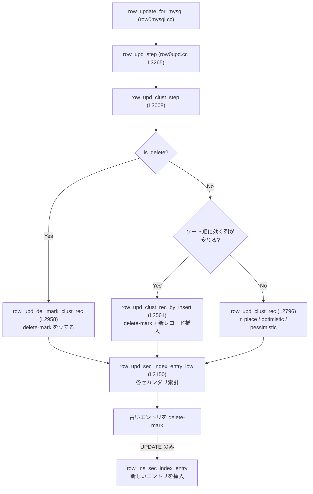

> **前提**: [行の読み取り経路](./row-read-path/) / [undo ログ](./undo-log/) / [B+tree の操作](./btree-operations/)

## 何を学んだか

`storage/innobase/row/` にあるファイルを並べると、あるはずのものが無い。

```
row0ins.cc   INSERT
row0upd.cc   UPDATE
row0sel.cc   SELECT
row0uins.cc  INSERT のロールバック (undo)
row0umod.cc  UPDATE のロールバック (undo)
```

**`row0del.cc` が無い。** DELETE は独立した操作として実装されていない。

```cpp title="storage/innobase/handler/ha_innodb.cc (L10192-L10199)"
  /* This is a delete */

  m_prebuilt->upd_node->is_delete = true;

  error = innobase_srv_conc_enter_innodb(m_prebuilt);

  if (error == DB_SUCCESS) {
    error = row_update_for_mysql((byte *)record, m_prebuilt);
```

`ha_innobase::delete_row` は `is_delete` を立てて `row_update_for_mysql` を呼ぶ。**DELETE は「削除フラグを立てるだけの UPDATE」**として、UPDATE と同じコードを通る。

そして UPDATE 自体も 1 種類ではない。クラスタードインデックスの更新には 2 つの道がある。

| 道                    | 条件                         | 何が起きるか                               |
| --------------------- | ---------------------------- | ------------------------------------------ |
| その場更新 (in place) | ソート順に効く列が変わらない | レコードを書き換え、旧値は undo へ         |
| delete-mark + 挿入    | ソート順に効く列が変わる     | 旧レコードに delete-mark、新レコードを挿入 |

セカンダリインデックスには**その場更新が無い**。常に「古いエントリを delete-mark して、新しいエントリを挿入」になる。

## なぜそうなっているか

### なぜ DELETE を UPDATE として書けるのか

MVCC のもとでは、DELETE は物理削除ではない。**レコードに delete-mark を立て、旧版を undo に残し、purge が後で回収する** ([purge](./purge/))。これは「delete フラグという 1 ビットを更新する UPDATE」と構造的に同じだ。

だから分岐は 1 か所で済む。

```cpp title="storage/innobase/row/row0upd.cc (L3098-L3107)"
  if (node->is_delete) {
    err = row_upd_del_mark_clust_rec(flags, node, index, offsets, thr,
                                     referenced, &mtr);

    if (err == DB_SUCCESS) {
      node->state = UPD_NODE_UPDATE_ALL_SEC;
      node->index = index->next();
    }

    goto exit_func;
  }
```

DELETE のときは `UPD_NODE_UPDATE_ALL_SEC` に進む。**全セカンダリインデックスのエントリを delete-mark しに行く**という意味だ。

### なぜソート順が変わると挿入し直すのか

B+tree のレコードは**キー順に並んでいることが構造の前提**だ。ソートに使われている列 (ordering field) の値が変わると、そのレコードは今の位置に居てはいけない。移動させる手段は「消して入れ直す」しかない。

```cpp title="storage/innobase/row/row0upd.cc (L3128-L3142)"
  if (row_upd_changes_ord_field_binary(index, node->update, thr, node->row,
                                       node->ext, nullptr)) {
    /* Update causes an ordering field (ordering fields within
    the B-tree) of the clustered index record to change: perform
    the update by delete marking and inserting.

    TODO! What to do to the 'Halloween problem', where an update
    moves the record forward in index so that it is again
    updated when the cursor arrives there? Solution: the
    read operation must check the undo record undo number when
    choosing records to update. MySQL solves now the problem
    externally! */

    err =
        row_upd_clust_rec_by_insert(flags, node, index, thr, referenced, &mtr);
```

コメントにある **Halloween problem** — 「更新した行が前方に移動して、カーソルがそこに来たときにもう一度更新される」問題 — は InnoDB では解いておらず、Server 層が (一時表に対象行を確定してから更新するなどして) 回避している、と書いてある。**エンジン単体では正しくならない挙動が、層をまたいで担保されている**例だ。

クラスタードインデックスのソート順に効く列とは、要するに**主キー**だ。したがって、

**主キーを更新する `UPDATE` は、InnoDB の中では DELETE + INSERT になる。** 行が物理的に別の場所へ移り、セカンダリインデックスのエントリもすべて張り替わる。

### その場更新でも 2 段階ある

ソート順が変わらない場合でも、**サイズが変わるかどうか**でもう一段分かれる。

```cpp title="storage/innobase/row/row0upd.cc (L2844-L2852)"
  if (node->cmpl_info & UPD_NODE_NO_SIZE_CHANGE) {
    err = btr_cur_update_in_place(flags | BTR_NO_LOCKING_FLAG, btr_cur, offsets,
                                  node->update, node->cmpl_info, thr,
                                  thr_get_trx(thr)->id, mtr);
  } else {
    err = btr_cur_optimistic_update(
        flags | BTR_NO_LOCKING_FLAG, btr_cur, &offsets, offsets_heap,
        node->update, node->cmpl_info, thr, thr_get_trx(thr)->id, mtr);
  }
```

- **サイズ不変** (`INT` を別の `INT` にする、固定長の更新) → `btr_cur_update_in_place`。バイト列を上書きするだけで、ページの他のレコードは動かない
- **サイズ変化** (`VARCHAR` が伸びる/縮む) → `btr_cur_optimistic_update`。ページ内で入れ替え、入らなければ悲観更新に落ちてページ分割まで行く

**`VARCHAR` を伸ばす更新はページ分割を誘発しうるが、同じ長さで書き換える更新はしない**、という差がここにある ([B+tree の操作](./btree-operations/))。

### なぜセカンダリインデックスは常に入れ直しなのか

セカンダリインデックスのレコードは、**キー列と主キーだけでできている** ([セカンダリインデックス](./secondary-index/))。つまり**すべての列がソート順に効く**。値が変われば必ず位置が変わるので、その場更新という選択肢が存在しない。

```cpp title="storage/innobase/row/row0upd.cc (L2369-L2380)"
  if (node->is_delete || err != DB_SUCCESS) {
    goto func_exit;
  }

  mem_heap_empty(heap);

  /* Build a new index entry */
  entry = row_build_index_entry(node->upd_row, node->upd_ext, index, heap);
  ut_a(entry);

  /* Insert new index entry */
  err = row_ins_sec_index_entry(index, entry, thr, false);
```

古いエントリを delete-mark した後、`is_delete` なら終わり、UPDATE なら新しいエントリを挿入する。**1 本のセカンダリインデックスにつき、削除 1 回と挿入 1 回。** インデックスが 5 本あって、そのうち 3 本に関係する列を更新すれば、B+tree の操作は 1 (クラスタード) + 6 (セカンダリ) 回になる。

## ソースコードのどこか

### DML の入口は 2 系統

```cpp title="storage/innobase/row/row0mysql.cc (L1410 / L1505 / L1709)"
static dberr_t row_insert_for_mysql_using_cursor(const byte *mysql_rec,
...
static dberr_t row_insert_for_mysql_using_ins_graph(const byte *mysql_rec,
...
dberr_t row_insert_for_mysql(const byte *mysql_rec, row_prebuilt_t *prebuilt) {
```

`row_insert_for_mysql` が両者を振り分ける。**cursor 版は intrinsic table (オプティマイザの内部一時表) 専用**の軽い経路で、通常のテーブルは `ins_graph` 版を通る。UPDATE 側も同じ形で `row_update_for_mysql_using_cursor` (L2084) と `..._using_upd_graph` (L2266) に分かれている。

「グラフ」というのは InnoDB が元々持っている**クエリグラフ実行機構** (`que_thr_t`、`upd_node_t`) のことで、MySQL の外側にあった時代の名残だ。今は SQL の実行は Server 層のイテレータがやるので、このグラフは「1 行分の DML を表現する構造体」としてだけ使われている ([エグゼキュータ](./executor-walkthrough/))。

### UPDATE の全体



### オンライン DDL 中はここにログが挟まる

セカンダリインデックスの更新経路には、オンラインでインデックスを作っている最中の分岐が入っている。

```cpp title="storage/innobase/row/row0upd.cc (L2232-L2247)"
    switch (dict_index_get_online_status(index)) {
      case ONLINE_INDEX_COMPLETE:
        /* This is a normal index. Do not log anything.
        Perform the update on the index tree directly. */
        break;
      case ONLINE_INDEX_CREATION:
        /* Log a DELETE and optionally INSERT. */
        row_log_online_op(index, entry, 0);

        if (!node->is_delete) {
          mem_heap_empty(heap);
          entry =
              row_build_index_entry(node->upd_row, node->upd_ext, index, heap);
          ut_a(entry);
          row_log_online_op(index, entry, trx->id);
        }
```

**構築中のインデックスには直接書かず、row log に「DELETE」と「INSERT」を積む。** 後で構築側がこれを適用する ([オンライン索引構築と row log](./online-index-build-row-log/))。DML 側から見ると、**インデックス作成中は同じ更新のコストが (書き込み先が変わるだけで) 変わらない**ということでもある。

### AUTO_INCREMENT の永続化もここで起きる

```cpp title="storage/innobase/row/row0upd.cc (L2836-L2838)"
  /* Check and log if necessary at the beginning, to prevent any
  further potential deadlock */
  persist_autoinc = row_upd_check_autoinc_counter(node, mtr);
```

更新が AUTO_INCREMENT 列の最大値を動かすなら、その値を redo に残す ([AUTO_INCREMENT](./auto-increment/))。

## どう活かすか

### 主キーを更新しない

`UPDATE ... SET id = ?` は、内部では DELETE + INSERT だ。

- クラスタード側で行が移動する (ページ分割の可能性)
- **全セカンダリインデックスのエントリが張り替わる** (葉に主キーが入っているため)
- undo が両方分積まれ、purge の仕事が増える

自然キーを主キーにしていて、業務上その値が変わりうる設計は、この一撃を毎回受ける。**主キーは不変な代理キーにする**という定石は、ここでは実装の都合として裏付けられる。

### インデックスの本数は更新コストに直接効く

「読みが速くなるからインデックスを足す」の裏側で、更新は次のように増える。

| 操作                         | B+tree への書き込み回数                   |
| ---------------------------- | ----------------------------------------- |
| `INSERT`                     | 1 (クラスタード) + インデックス本数       |
| `DELETE`                     | 1 + インデックス本数 (すべて delete-mark) |
| `UPDATE` (非キー列)          | 1 のみ                                    |
| `UPDATE` (索引列 n 本に関係) | 1 + 2n (各索引で delete-mark と挿入)      |

**更新される列を含むインデックスがいちばん高い。** `updated_at` に索引を張ると、全 UPDATE が必ず 2 回の追加操作を払う。

### `VARCHAR` の更新は長さを意識する

同じ長さで書き換わる更新 (`UPDATE ... SET status = 'DONE'` のように固定長に近いもの) は `btr_cur_update_in_place` で終わる。**長さが伸びる更新はページに入りきらなければ分割**になる。

`ROW_FORMAT=DYNAMIC` で `VARCHAR(4000)` に 10 バイト入れておいて後から 3000 バイトに伸ばす、というパターンは、ページの断片化と分割を招く。**初期値の時点で最終的な長さに近い**ほうが、更新は安く済む。

### 大量 DELETE は「更新」として見積もる

`DELETE FROM t WHERE ...` で 100 万行消すとき、実際に起きるのは 100 万件の delete-mark + インデックス本数分の delete-mark + 100 万件分の undo だ。**ファイルは縮まず、purge の仕事だけが積み上がる** ([テーブルスペースのファイル](./tablespace-files-and-import-export/))。

全件削除なら `TRUNCATE`、範囲削除なら分割してコミットを挟む、パーティションなら `DROP PARTITION` — どれも「delete-mark を積まない方法」を選んでいる ([パーティショニング](./partitioning/))。
