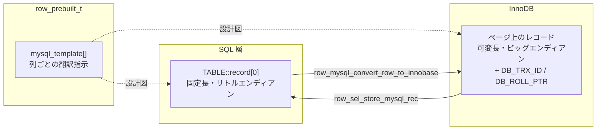

> **前提**: [handler](./handler-walkthrough/)

## 何を学んだか

`handler` の契約では、行は `TABLE::record[0]` というバイト列で受け渡しされる ([handler のページ](./handler-walkthrough/))。だがこのバイト列は、InnoDB がページに書いているバイト列とは**別のフォーマット**だ。両者の間には翻訳が必要で、その翻訳は行を 1 件読むたび・書くたびに走る。

3 つの違いがある。

1. **列の並べ方が違う。** MySQL の行は固定長のバッファで、NULL ビットマップが先頭にあり、各列は固定オフセットに置かれる。VARCHAR も宣言した最大長ぶんの領域を確保する。InnoDB のレコードは可変長で、実際に使ったバイト数しか持たない
2. **値の表現が違う。** 整数は MySQL がリトルエンディアン、InnoDB がビッグエンディアンで、符号付きなら最上位ビットが反転される。InnoDB のレコードは並べ替えなしで `memcmp` によりキー順に比較できる必要があるからだ
3. **InnoDB 側に列が多い。** クラスタードインデックスの葉レコードには、ユーザが定義していない `DB_TRX_ID` (6 バイト) と `DB_ROLL_PTR` (7 バイト) が必ず付く。**合わせて行あたり 13 バイト。** さらに主キーも UNIQUE 制約もないテーブルでは 6 バイトの `DB_ROW_ID` が加わって 19 バイトになる

翻訳の設計図が `row_prebuilt_t::mysql_template` だ。これは「MySQL 側のこのオフセットに、InnoDB レコードの何番目のフィールドを、この変換規則で書く」という指示の配列で、**クエリごと・インデックスごとに作り直される**。カバリングインデックス (`Using index`) が効くかどうか、ICP で降ろした述語をインデックスだけで評価できるかどうかは、この設計図の作られ方に還元される。

## なぜそうなっているか

**MySQL の行が固定長なのは、`Field` オブジェクトがオフセット固定で値を読み書きするからだ。** `Item_field::val_int()` は `field->ptr` を読むだけで、`ptr` は `record[0] + オフセット` に固定されている。可変長にすると列を 1 つ読むたびに前の列を走査する必要が出る。オプティマイザもエグゼキュータも `Field` 越しに値を触るので、この形は SQL 層全体の前提になっている。**その代償が、`VARCHAR(1000)` を宣言すると実際の内容が短くても `record[0]` が 1000 バイト太ることだ。** 内部一時表がすぐディスクに溢れる原因の 1 つでもある ([内部一時表のページ](./materialization-and-temptable/))。

**InnoDB の行が可変長でビッグエンディアンなのは、B+tree のキー比較を `memcmp` で済ませたいからだ。** リトルエンディアンのままだと、整数の大小比較にバイト順の知識が必要になる。ビッグエンディアンに直して符号ビットを反転しておけば、負数も含めて単なるバイト列比較で正しい順序になる。`btr_cur_search_to_nth_level` が 1 ページに数百回走ることを考えると、この前処理は明確に元が取れる ([B+tree の操作のページ](./btree-operations/))。

**`mysql_template` がクエリごとに作り直されるのは、翻訳が「必要な列だけ」で済むようにするためだ。** `SELECT id FROM t WHERE id > 100` なら `id` 1 列ぶんの `mysql_row_templ_t` しか作らない。PK のインデックスだけを走査して、クラスタードインデックスの葉レコードから他の列を取り出す作業も、`record[0]` に書き戻す作業も発生しない。**これが `Using index` (カバリングインデックス) の実体で、EXPLAIN で見えている `Extra` 列は最終的にこの `n_template` の大きさに帰着する。**

**`select_lock_type == LOCK_X` のときに `whole_row = true` に倒しているのは、後で必要になる列を予測できないからだ。** UPDATE は WHERE に出てこない列も更新対象になりうるし、更新前後の行全体を undo と binlog に載せる必要がある。ここで賢く絞ると、後から足りない列を取りに戻る経路が要る。**`UPDATE` が `SELECT` より 1 行あたり重いのは、ロックだけでなく変換量の違いでもある。**

## ソースコードのどこか

### MySQL 側の行 — `TABLE::record[0]`

`record[0]` は `TABLE_SHARE::reclength` バイトの固定長バッファだ。先頭に NULL ビットマップが `null_bytes` バイトあり、その後ろに列が並ぶ。列のオフセットを決めているのは [`sql/dd_table_share.cc#L1129`](https://github.com/mysql/mysql-server/blob/mysql-8.4.11/sql/dd_table_share.cc#L1129) のあたりだ。

```cpp title="sql/dd_table_share.cc"
  uchar *null_flags [[maybe_unused]];
  uchar *null_pos, *rec_pos;
  null_flags = null_pos = share->default_values;
  rec_pos = share->default_values + share->null_bytes;
  uint null_bit_pos =
      (share->db_create_options & HA_OPTION_PACK_RECORD) ? 0 : 1;
```

**`null_bit_pos` が 1 から始まることがある**のが目を引く。`HA_OPTION_PACK_RECORD` が立っていない場合、NULL ビットマップの最初の 1 ビットは使われない。MyISAM の固定長レコードで「この行は削除済み」を表していたビットの名残りだ。

`TABLE` を作るときのオフセット計算も同じ形をしている ([`sql/table.cc#L2989`](https://github.com/mysql/mysql-server/blob/mysql-8.4.11/sql/table.cc#L2989))。

```cpp title="sql/table.cc"
  record = (uchar *)outparam->record[0] - 1; /* Fieldstart = 1 */
  outparam->null_flags = (uchar *)record + 1;
```

`VARCHAR(255)` の列は、実際に 3 文字しか入っていなくても `record[0]` の中では 1 バイトの長さ + 255 バイトぶんの領域を占める。**MySQL の行は「行の内容」ではなく「行が入る型枠」だ。**

`record[1]` は同じ型枠がもう 1 枚あるもので、UPDATE のときに旧値を置く場所として使われる。`handler::ha_update_row` が `assert(old_data == table->record[1])` を持っているのはこのためだ。

### InnoDB 側の隠し列 — [`storage/innobase/include/data0type.h#L177`](https://github.com/mysql/mysql-server/blob/mysql-8.4.11/storage/innobase/include/data0type.h#L177)

```cpp title="storage/innobase/include/data0type.h"
/* Precise data types for system columns and the length of those columns;
NOTE: the values must run from 0 up in the order given! All codes must
be less than 256 */
/** row id: a 48-bit integer */
constexpr uint32_t DATA_ROW_ID = 0;
/** stored length for row id */
constexpr uint32_t DATA_ROW_ID_LEN = 6;

/** Transaction id: 6 bytes */
constexpr size_t DATA_TRX_ID = 1;

/** Transaction ID type size in bytes. */
constexpr size_t DATA_TRX_ID_LEN = 6;

/** Rollback data pointer: 7 bytes */
constexpr size_t DATA_ROLL_PTR = 2;

/** Rollback data pointer type size in bytes. */
constexpr size_t DATA_ROLL_PTR_LEN = 7;

/** number of system columns defined above */
constexpr uint32_t DATA_N_SYS_COLS = 3;
```

この 3 本は [`dict_table_add_system_columns` (`dict0dict.cc#L1131`)](https://github.com/mysql/mysql-server/blob/mysql-8.4.11/storage/innobase/dict/dict0dict.cc#L1131) が、すべてのテーブルの列定義の末尾に足す。

```cpp title="storage/innobase/dict/dict0dict.cc"
  /* NOTE: the system columns MUST be added in the following order
  (so that they can be indexed by the numerical value of DATA_ROW_ID,
  etc.) and as the last columns of the table memory object.
  The clustered index will not always physically contain all system
  columns. */
  ...
  dict_mem_table_add_col(table, heap, "DB_ROW_ID", DATA_SYS,
                         DATA_ROW_ID | DATA_NOT_NULL, DATA_ROW_ID_LEN, false,
                         phy_pos, v_added, v_dropped);

  dict_mem_table_add_col(table, heap, "DB_TRX_ID", DATA_SYS,
                         DATA_TRX_ID | DATA_NOT_NULL, DATA_TRX_ID_LEN, false,
                         phy_pos, v_added, v_dropped);
```

コメントの `will not always physically contain all system columns` が効いてくるのは、クラスタードインデックスを組み立てるところだ ([`dict0dict.cc#L3192`](https://github.com/mysql/mysql-server/blob/mysql-8.4.11/storage/innobase/dict/dict0dict.cc#L3192))。

```cpp title="storage/innobase/dict/dict0dict.cc"
  /* Add ROW ID */
  if (!dict_index_is_unique(index)) {
    dict_index_add_col(new_index, table, table->get_sys_col(DATA_ROW_ID), 0,
                       true);
    set_phy_pos(table->get_sys_col(DATA_ROW_ID));
    trx_id_pos++;
  }

  /* Add TRX ID */
  dict_index_add_col(new_index, table, table->get_sys_col(DATA_TRX_ID), 0,
                     true);
```

**`DB_ROW_ID` はクラスタリングキーが一意でないときだけ物理的に入る。** PRIMARY KEY か NOT NULL な UNIQUE がある普通のテーブルでは、隠し列は `DB_TRX_ID` + `DB_ROLL_PTR` の 13 バイトだけだ。この 2 本が MVCC の入口で、`DB_ROLL_PTR` から undo を辿って古い版を組み立てる ([undo ログのページ](./undo-log/)、[read view のページ](./read-view-and-visibility/))。

2 つのバイト列を並べるとこうなる。`t(id INT PRIMARY KEY, name VARCHAR(255), memo VARCHAR(64) NULL)` に `(7, 'abc', NULL)` を入れた場合のイメージだ。

```
MySQL 側 record[0]  --- 固定長 (reclength バイト)
+--------+-------------+-----------------------+----------------------+
| NULL   | id          | name                  | memo                 |
| bitmap | 4           | 1 + 255               | 1 + 64               |
+--------+-------------+-----------------------+----------------------+
  1 byte   07 00 00 00   03 61 62 63 <未使用>    00 <未使用>
           little endian  長さ 1 byte + padding   NULL でも領域は確保

InnoDB 側 クラスタードインデックスの葉レコード --- 可変長
+--------+--------+--------+-------------+-----------+-------------+--------+
| 可変長 | NULL   | rec    | id (PK)     | DB_TRX_ID | DB_ROLL_PTR | name   |
| 長さ   | bitmap | header |             |           |             |        |
| 1      | 1      | 5      | 4           | 6         | 7           | 3      |
+--------+--------+--------+-------------+-----------+-------------+--------+
   03                        80 00 00 07  \___________  ___________/  61 62 63
   name の長さ               big endian +             13 バイトの隠し列
   (逆順に置かれる)          符号ビット反転
                                        memo は NULL なのでバイトを占めない
```

レコードヘッダの詳細は[レコードの構造のページ](./record-format/)、なぜ PK の後ろにシステム列が来るのかは[クラスタードインデックスのページ](./clustered-index/)。

### 変換の設計図 — `mysql_row_templ_t`

1 列ぶんの翻訳指示が [`storage/innobase/include/row0mysql.h#L455`](https://github.com/mysql/mysql-server/blob/mysql-8.4.11/storage/innobase/include/row0mysql.h#L455) の構造体だ。

```cpp title="storage/innobase/include/row0mysql.h"
struct mysql_row_templ_t {
  ulint col_no;                 /*!< column number of the column */
  ulint rec_field_no;           /*!< field number of the column in an
                                Innobase record in the current index;
                                not defined if template_type is
                                ROW_MYSQL_WHOLE_ROW */
  ulint clust_rec_field_no;     /*!< field number of the column in an
                                Innobase record in the clustered index;
                                not defined if template_type is
                                ROW_MYSQL_WHOLE_ROW */
  ulint icp_rec_field_no;       /*!< field number of the column in an
                                Innobase record in the current index;
                                only defined for columns that could be
                                used to evaluate a pushed down index
                                condition and/or end-range condition */
  ulint mysql_col_offset;       /*!< offset of the column in the MySQL
                                row format */
  ulint mysql_col_len;          /*!< length of the column in the MySQL
                                row format */
```

これが 3 つのフィールド番号を持っているのが要点だ。**同じ列でも、いま走査しているインデックスでの位置 (`rec_field_no`)、クラスタードインデックスでの位置 (`clust_rec_field_no`)、ICP 評価で使う位置 (`icp_rec_field_no`) が別々に記録される。** セカンダリインデックスを走査していて必要な列がその中にあれば `rec_field_no` で足り、なければクラスタードインデックスに戻って `clust_rec_field_no` を使う。

配列を組み立てるのが [`ha_innobase::build_template` (`ha_innodb.cc#L8623`)](https://github.com/mysql/mysql-server/blob/mysql-8.4.11/storage/innobase/handler/ha_innodb.cc#L8623)。

```cpp title="storage/innobase/handler/ha_innodb.cc"
void ha_innobase::build_template(bool whole_row) {
  ...
  if (m_prebuilt->select_lock_type == LOCK_X) {
    /* We always retrieve the whole clustered index record if we
    use exclusive row level locks, for example, if the read is
    done in an UPDATE statement. */

    whole_row = true;
  } else if (!whole_row) {
    if (m_prebuilt->hint_need_to_fetch_extra_cols == ROW_RETRIEVE_ALL_COLS) {
      ...
      if (m_prebuilt->read_just_key) {
        ...
        fetch_all_in_key = true;
      } else {
        whole_row = true;
      }
```

`whole_row` が `true` になると `template_type` は `ROW_MYSQL_WHOLE_ROW`、`false` なら `ROW_MYSQL_REC_FIELDS` になる。

```cpp title="storage/innobase/handler/ha_innodb.cc"
  clust_index = m_prebuilt->table->first_index();

  index = whole_row ? clust_index : m_prebuilt->index;

  m_prebuilt->need_to_access_clustered = (index == clust_index);
```

**排他ロックを取る読み方 (`UPDATE`、`SELECT ... FOR UPDATE`) では常に全列をクラスタードインデックスから読む。** カバリングインデックスで済ませられない、という制約はここから来ている。

呼び出しは 2 箇所に分かれる。`index_read` は [L10473](https://github.com/mysql/mysql-server/blob/mysql-8.4.11/storage/innobase/handler/ha_innodb.cc#L10473) で `build_template(false)`、`write_row` は [L9332](https://github.com/mysql/mysql-server/blob/mysql-8.4.11/storage/innobase/handler/ha_innodb.cc#L9332) で `build_template(true)` を呼ぶ。**書くときは常に全列が要る。**

### 読む向き — `row_sel_store_mysql_rec`

InnoDB のレコードから `record[0]` に詰め替えるのが [`storage/innobase/row/row0sel.cc#L2892`](https://github.com/mysql/mysql-server/blob/mysql-8.4.11/storage/innobase/row/row0sel.cc#L2892)。本体は設計図をなぞるループだ。

```cpp title="storage/innobase/row/row0sel.cc"
  for (ulint i = 0; i < prebuilt->n_template; i++) {
    const auto templ = &prebuilt->mysql_template[i];
    ...
    if (!row_sel_store_mysql_field(mysql_rec, prebuilt, rec, rec_index,
                                   prebuilt_index, offsets, field_no, templ,
                                   sec_field_no, lob_undo, blob_heap)) {
      return false;
    }
  }
```

1 列ぶんの実際の変換は [`row_sel_field_store_in_mysql_format_func` (L2502)](https://github.com/mysql/mysql-server/blob/mysql-8.4.11/storage/innobase/row/row0sel.cc#L2502)。整数の扱いが分かりやすい。

```cpp title="storage/innobase/row/row0sel.cc"
  switch (templ->type) {
    const byte *field_end;
    byte *pad;
    case DATA_INT:
      /* Convert integer data from Innobase to a little-endian
      format, sign bit restored to normal */

      ptr = dest + len;

      for (;;) {
        ptr--;
        *ptr = *data;
        if (ptr == dest) {
          break;
        }
        data++;
      }

      if (!templ->is_unsigned) {
        dest[len - 1] = (byte)(dest[len - 1] ^ 128);
      }
```

**バイトを 1 つずつ逆順にコピーし、符号付きなら最上位ビットを XOR で戻す。** `INT` 1 列につき 4 回のループと 1 回の XOR が、行を返すたびに走っている。

### 書く向き — `row_mysql_convert_row_to_innobase`

逆方向は [`storage/innobase/row/row0mysql.cc#L550`](https://github.com/mysql/mysql-server/blob/mysql-8.4.11/storage/innobase/row/row0mysql.cc#L550)。同じ `mysql_template` を逆にたどる。

```cpp title="storage/innobase/row/row0mysql.cc"
  for (i = 0; i < prebuilt->n_template; i++) {
    ...
    if (templ->mysql_null_bit_mask != 0) {
      /* Column may be SQL NULL */

      if (mysql_rec[templ->mysql_null_byte_offset] &
          (byte)(templ->mysql_null_bit_mask)) {
        /* It is SQL NULL */

        dfield_set_null(dfield);

        continue;
      }
    }
    ...
      row_mysql_store_col_in_innobase_format(
          dfield, prebuilt->ins_upd_rec_buff + templ->mysql_col_offset,
          true, /* MySQL row format data */
```

[`row_mysql_store_col_in_innobase_format` (L376)](https://github.com/mysql/mysql-server/blob/mysql-8.4.11/storage/innobase/row/row0mysql.cc#L376) が 1 列を変換する。関数コメントが対応関係を明記している。

```cpp title="storage/innobase/row/row0mysql.cc"
/** Stores a non-SQL-NULL field given in the MySQL format in the InnoDB format.
 The counterpart of this function is row_sel_field_store_in_mysql_format() in
 row0sel.cc.
 @return up to which byte we used buf in the conversion */
byte *row_mysql_store_col_in_innobase_format(
```

整数は逆向きの同じ処理だ。

```cpp title="storage/innobase/row/row0mysql.cc"
  if (type == DATA_INT) {
    /* Store integer data in Innobase in a big-endian format,
    sign bit negated if the data is a signed integer. In MySQL,
    integers are stored in a little-endian format. */
```

VARCHAR には**行フォーマットとキー値フォーマットで長さバイト数が違う**という罠がある。

```cpp title="storage/innobase/row/row0mysql.cc"
      if (row_format_col) {
        if (dtype->prtype & DATA_LONG_TRUE_VARCHAR) {
          lenlen = 2;
        } else {
          lenlen = 1;
        }
      } else {
        /* In a MySQL key value, lenlen is always 2 */
        lenlen = 2;
      }
```

`row_format_col` という引数がわざわざ存在するのはこのためで、`WHERE name = 'abc'` のキー値と、INSERT する行の中の同じ列は、MySQL 側でのバイト表現が違う。



## どう活かすか

**`SELECT *` をやめると、変換コストがそのまま減る。** 効くのは通信量だけではない。`n_template` が小さくなると、行を 1 件返すたびのループ回数が減り、セカンダリインデックスで済む場合はクラスタードインデックスへの追加参照 (`need_to_access_clustered`) ごと消える。**EXPLAIN の `Extra` に `Using index` が出るかどうかは、`build_template` が `whole_row = false` で走れたかどうかと同じことだ** ([アクセスパスの選択](./access-path-selection/))。

**`VARCHAR` の宣言長を実態より大きく取ると、内部一時表とソートで効く。** InnoDB のページ上では実際のバイト数しか使わないので、テーブルのサイズには響かない。だが `record[0]` は宣言長で確保され、`TABLE_SHARE::reclength` が太る。内部一時表は `reclength` を基準にメモリ上のサイズを見積もるので、`tmp_table_size` に早く当たってディスクに溢れる ([内部一時表のページ](./materialization-and-temptable/))。**「どうせ可変長だから大きめに宣言しておく」は、テーブルには無害でクエリには有害だ。**

**主キーのないテーブルは行あたり 19 バイト太る。** `DB_ROW_ID` の 6 バイトが加わるうえ、この採番はテーブル単位ではなく**インスタンス全体で共有されるカウンタ**から取られる。行が増えるだけでなく、セカンダリインデックスの葉に入る「クラスタリングキー」もこの 6 バイトになるので、インデックス全体が太る ([セカンダリインデックスのページ](./secondary-index/))。主キーを付けないテーブルを作らない理由は、レプリケーションの遅延だけではない。

**行サイズの見積もりでは 13 バイトを忘れない。** 「1 行 100 バイトだから 1000 万行で 1GB」という計算は、隠し列とレコードヘッダとページディレクトリを無視している。`INT` 1 列と `DB_TRX_ID` + `DB_ROLL_PTR` を比べると、**システム列のほうが 3 倍以上大きい**。細い行を大量に持つテーブルほど、実サイズは見積もりから乖離する。

**プロファイルで `row_sel_store_mysql_rec` が上位に来たら、返している列が多すぎる。** この関数は「行が見つかった」後の詰め替えしかしていないので、ここが重いのは I/O でもロックでもなく単純に変換量の問題だ。`n_template` を減らす方向 (列を絞る、カバリングインデックスを作る) にしか手がない。
