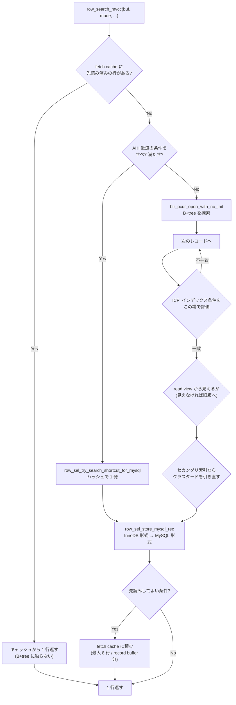

> **前提**: [handler の walkthrough](./handler-walkthrough/) / [read view と可視性](./read-view-and-visibility/) / [セカンダリインデックスと MVCC](./secondary-index-visibility/)

## 何を学んだか

`ha_innobase::index_read` も `::general_fetch` も `::rnd_next` も、行き着く先は 1 つの関数だ。

```cpp title="storage/innobase/include/row0sel.h (L207)"
[[nodiscard]] dberr_t row_search_mvcc(byte *buf, page_cur_mode_t mode,
```

この関数は「1 行返す」というより、**3 つの近道と 1 つの本道を順に試す**構造になっている。



**近道もキャッシュも、条件を 1 つでも外すと丸ごと無効になる。** そしてその条件が、実務で効く形をしている。

## なぜそうなっているか

### なぜ 8 行まとめて読むのか

Server 層と InnoDB の往復は、`handler` の仮想関数呼び出しに加えて `prebuilt` の状態更新と mtr の開始・終了を伴う ([handler の walkthrough](./handler-walkthrough/))。1 行ごとに払うには重い。そこで**同じページに続きの行があるうちにまとめて MySQL 形式へ変換し、キャッシュに積む**。

```cpp title="storage/innobase/include/row0mysql.h (L505-L507)"
constexpr uint32_t MYSQL_FETCH_CACHE_SIZE = 8;
...
constexpr uint32_t MYSQL_FETCH_CACHE_THRESHOLD = 4;
```

先読みは最初の行から始まらない。**4 行取り出すまでは 1 行ずつ返し、5 行目から先読みに切り替える。**

```cpp title="storage/innobase/row/row0sel.cc (L5592-L5595)"
  if (record_buffer != nullptr ||
      ((match_mode == ROW_SEL_EXACT ||
        prebuilt->n_rows_fetched >= MYSQL_FETCH_CACHE_THRESHOLD) &&
       prebuilt->can_prefetch_records())) {
```

`LIMIT 1` のようなクエリで 8 行分の変換を無駄にしないための閾値だ。**「たくさん読むと分かってから先読みを始める」**という判断になっている。

### 先読みが切れる条件

`can_prefetch_records()` の中身が、そのまま「先読みできないケースの一覧」になっている。

```cpp title="storage/innobase/row/row0mysql.cc (L4773-L4776)"
  return select_lock_type == LOCK_NONE && !m_no_prefetch &&
         !templ_contains_blob && !templ_contains_fixed_point &&
         !clust_index_was_generated && !used_in_HANDLER && !innodb_api &&
         template_type != ROW_MYSQL_DUMMY_TEMPLATE && !in_fts_query;
```

実務で当たるのは最初の 3 つだ。

| 条件                            | 外れる場面                                             |
| ------------------------------- | ------------------------------------------------------ |
| `select_lock_type == LOCK_NONE` | `SELECT ... FOR UPDATE` / `FOR SHARE`、`UPDATE` の読み |
| `!templ_contains_blob`          | `TEXT` / `BLOB` / `JSON` を選択リストに入れた          |
| `!clust_index_was_generated`    | **主キーが無いテーブル** (内部 ROW_ID で作った索引)    |

理由はコメントに書いてある。ロック読みではカーソル位置を後で使う (その行を更新する) ので先に進めない。BLOB は `prebuilt` に 1 行分の領域しか持たないので複数行を保持できない。

**`SELECT *` が「列が多いから遅い」だけでなく、BLOB 系の列を 1 つ含んだ瞬間に行あたりの往復コストが 8 倍になりうる**、というのがここから出る。

### なぜ ICP をこの場所で評価するのか

セカンダリインデックスを使った検索では、条件の一部が索引に含まれる列だけで判定できることがある。それを**クラスタードインデックスを引き直す前に**評価するのが ICP だ。

```cpp title="storage/innobase/row/row0sel.cc (L3784-L3807)"
  if (!prebuilt->idx_cond) {
    return (ICP_MATCH);
  }

  MONITOR_INC(MONITOR_ICP_ATTEMPTS);

  /* Convert to MySQL format those fields that are needed for
  evaluating the index condition. */
...
  for (i = 0; i < prebuilt->idx_cond_n_cols; i++) {
    const mysql_row_templ_t *templ = &prebuilt->mysql_template[i];
...
    if (!row_sel_store_mysql_field(
            mysql_rec, prebuilt, rec, prebuilt->index, prebuilt->index, offsets,
            templ->icp_rec_field_no, templ, ULINT_UNDEFINED, nullptr,
            prebuilt->blob_heap)) {
```

**評価に必要な列だけを MySQL 形式に変換する。** 全列を変換してから条件を見るのでは意味がないので、`idx_cond_n_cols` の分だけ変換する。

ここで落とせた行は、クラスタードインデックスの探索 (= ランダム I/O になりうる) を丸ごと省ける。`EXPLAIN` の `Using index condition` はこの経路が有効になったことを示す ([EXPLAIN の列](./explain-columns/))。

なお ICP が有効なときは、先読みの変換順が変わる。

```cpp title="storage/innobase/row/row0sel.cc (L5610-L5613)"
    /* We only convert from InnoDB row format to MySQL row
    format when ICP is disabled. */

    if (!prebuilt->idx_cond) {
```

ICP のために既に一部を変換済みなので、その結果を使い回す ([`row0sel.cc#L3700-3704`](https://github.com/mysql/mysql-server/blob/mysql-8.4.11/storage/innobase/row/row0sel.cc#L3700))。

### AHI の近道は条件が厳しい

```cpp title="storage/innobase/row/row0sel.cc (L4649-L4658)"
  if (UNIV_UNLIKELY(direction == 0) && unique_search && btr_search_enabled &&
      index->is_clustered() && !prebuilt->templ_contains_blob &&
      !prebuilt->used_in_HANDLER &&
      (prebuilt->mysql_row_len < UNIV_PAGE_SIZE / 8) && !prebuilt->innodb_api) {
    mode = PAGE_CUR_GE;

    if (trx->mysql_n_tables_locked == 0 && !prebuilt->ins_sel_stmt &&
        prebuilt->select_lock_type == LOCK_NONE &&
        trx->isolation_level > TRX_ISO_READ_UNCOMMITTED &&
        MVCC::is_view_active(trx->read_view)) {
```

並べると、**「主キーの一意検索」「ロックなし」「read view が確立済み」「BLOB なし」「行が 2KB 未満」「AHI が有効」**を全部満たしたときだけだ。

- `btr_search_enabled` — **8.4 では `innodb_adaptive_hash_index` の既定が OFF** なので、この近道は既定で使われない ([adaptive hash index](./adaptive-hash-index/))
- `trx->mysql_n_tables_locked == 0` — `INSERT ... SELECT` を除外している。理由はコメントにある通りで、挿入と交互に走ると AHI のラッチでデッドロックしうる
- `isolation_level > TRX_ISO_READ_UNCOMMITTED` — READ UNCOMMITTED では read view が無いので使えない

## ソースコードのどこか

### 1 行返すまでのフェーズ

`row_search_mvcc` ([`row0sel.cc#L4420`](https://github.com/mysql/mysql-server/blob/mysql-8.4.11/storage/innobase/row/row0sel.cc#L4420)) はコメントで「PHASE」に区切られている。

| フェーズ | やること                                                         |
| -------- | ---------------------------------------------------------------- |
| PHASE 1  | 前回のカーソル位置の復元、`sql_stat_start` なら read view を確保 |
| PHASE 2  | AHI 近道の試行                                                   |
| PHASE 3  | `btr_pcur` を開いて B+tree を探索                                |
| PHASE 4  | レコードを 1 件ずつ見て、ロック・ICP・可視性・変換を通す         |
| PHASE 5  | 先読みキャッシュに積むか、そのまま返す                           |

キャッシュから返す分岐は、B+tree に一切触らずに終わる。

```cpp title="storage/innobase/row/row0sel.cc (L4565)"
      row_sel_dequeue_cached_row_for_mysql(buf, prebuilt);
```

### セカンダリインデックスからクラスタードへ

```cpp title="storage/innobase/row/row0sel.cc (L5463)"
    err = row_sel_get_clust_rec_for_mysql(
```

セカンダリインデックスの葉には `DB_TRX_ID` が無いので、可視性の判定にはクラスタード側が要る ([セカンダリインデックスと MVCC](./secondary-index-visibility/))。**カバリングインデックスが効くのは、この呼び出しごと省けるから**であって、単に列が少ないからではない。

### ICP の効き目は数えられる

```sql
SELECT name, count FROM information_schema.INNODB_METRICS
 WHERE subsystem = 'icp';
```

`icp_attempts` / `icp_match` / `icp_no_match` / `icp_out_of_range` の 4 つが出る ([`srv0mon.cc#L1348-L1363`](https://github.com/mysql/mysql-server/blob/mysql-8.4.11/storage/innobase/srv/srv0mon.cc#L1348))。既定では無効なので有効化が要る。

```sql
SET GLOBAL innodb_monitor_enable = 'module_icp';
```

**`icp_no_match` が大きいほど ICP が仕事をしている** (クラスタード探索を省けた回数)。逆に `icp_attempts` に対して `icp_match` がほぼ 100% なら、その条件は絞り込みに寄与していないので、インデックスの列順を見直す余地がある ([アクセスパスの選択](./access-path-selection/))。

## どう活かすか

### `SELECT *` を避ける理由がもう 1 つ増える

列が増えれば転送量が増える、という話に加えて、

1. **BLOB / TEXT / JSON を 1 つ含むと先読みが無効になる** — 行あたりの Server ↔ InnoDB 往復が 8 倍に戻る
2. **カバリングインデックスが成立しなくなる** — クラスタード引き直しが行ごとに発生する

大量行を返すバッチ処理ほど効く。**必要な列だけを列挙したクエリが速いのは、I/O だけでなくこの経路の差**でもある。

### `FOR UPDATE` は行あたりのコストを上げる

`select_lock_type != LOCK_NONE` になった瞬間に先読みが切れる。ロックを取ること自体のコストに加えて、往復コストも上がる。

**「更新対象を確定するために広い範囲を `FOR UPDATE` で読む」パターンは二重に高い。** 先に主キーだけを普通の `SELECT` で確定させ、`UPDATE ... WHERE id IN (...)` に分けるほうが、読み取り経路としては安い ([RR と RC の違い](./locking-in-rr-vs-rc/) も併せて検討する)。

### 主キーの無いテーブルは先読みも近道も失う

`clust_index_was_generated` が真、つまり**明示的な主キーが無いテーブル**では先読みが無効になる。AHI 近道も `index->is_clustered()` と一意検索を要求するので実質使えない。

主キーを付けない設計は、レプリケーション ([applier と MTA](./applier-and-mta/)) だけでなく、単純な読み取り経路でも損をする。

### レコードバッファが効く形

Server 層が `handler::ha_set_record_buffer` で大きめのバッファを渡してきた場合 (`record_buffer != nullptr`)、閾値を待たずに先読みが始まり、上限も 8 行ではなくバッファのサイズになる。

```cpp title="storage/innobase/row/row0sel.cc (L5606-L5607)"
    const auto max_rows_to_cache =
        record_buffer ? record_buffer->max_records() : MYSQL_FETCH_CACHE_SIZE;
```

これは Server 側が「この経路は大量に読む」と判断したときにだけ渡される。**先読みを増やす直接のノブは無い**ので、効かせたければクエリの形 (レンジスキャンにする、ロックを外す、BLOB を外す) を変えるしかない。
