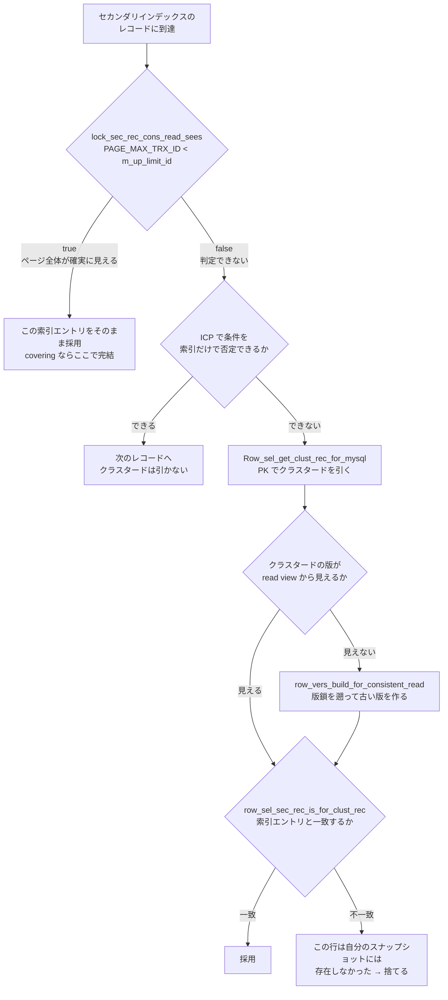

## 何を学んだか

クラスタードインデックスの葉レコードには `DB_TRX_ID` (6 バイト) と `DB_ROLL_PTR` (7 バイト) が付いている ([行フォーマット変換](./row-format-conversion/))。だから「この版は自分に見えるか」を、レコードを見るだけで判定できる。

**セカンダリインデックスの葉にはそれがない。** 入っているのはインデックス列と PK だけだ ([セカンダリインデックス](./secondary-index/))。したがって「この索引エントリが自分の read view から見えるか」を索引だけでは決められない。

InnoDB の解は 2 段構えになっている。

1. **ページ単位の近似**: 索引ページのヘッダに `PAGE_MAX_TRX_ID` という数を持ち、「このページを最後に触ったトランザクションの ID」を単調最大で記録する。この値が read view の `m_up_limit_id` より小さければ、**このページの全レコードは確実に見える**
2. **近似が外れたらクラスタードへ降りる**: `PAGE_MAX_TRX_ID` が大きければ、PK でクラスタード側を引き直し、必要なら版鎖を歩いて古い版を作り、その版がこの索引エントリに対応するかを確かめる

そして 2 番目には**カバリングインデックスの例外がない**。索引だけで完結するはずの `SELECT` でも、ページの `PAGE_MAX_TRX_ID` が新しければクラスタードを引きに行く。これが「更新直後の走査が遅い」の正体だ。

## ソースコードのどこか

### 判定はこれだけ

```cpp title="storage/innobase/lock/lock0lock.cc"
bool lock_sec_rec_cons_read_sees(
    const rec_t *rec,          /*!< in: user record which
                               should be read or passed over
                               by a read cursor */
    const dict_index_t *index, /*!< in: index */
    const ReadView *view)      /*!< in: consistent read view */
{
  ut_ad(page_rec_is_user_rec(rec));

  /* NOTE that we might call this function while holding the search
  system latch. */

  if (recv_recovery_is_on()) {
    return (false);

  } else if (index->table->is_temporary()) {
    ...
    return (true);
  }

  trx_id_t max_trx_id = page_get_max_trx_id(page_align(rec));

  ut_ad(max_trx_id > 0);

  return (view->sees(max_trx_id));
}
```

[`lock0lock.cc#L272`](https://github.com/mysql/mysql-server/blob/mysql-8.4.11/storage/innobase/lock/lock0lock.cc#L272)。ロックとは関係ないのに `lock0lock.cc` にいるのは歴史的な事情だろう。`view->sees(id)` の中身は [`read0types.h#L188`](https://github.com/mysql/mysql-server/blob/mysql-8.4.11/storage/innobase/include/read0types.h#L188) の 1 行で、`id < m_up_limit_id` だ。

**`changes_visible` ではなく `sees` を使っている**のが要点で、これは `changes_visible` の 1 分岐目のうち `id < m_up_limit_id` の側だけを取り出したものにあたる。「疑わしきは false」に倒す近似で、関数の doc コメントもそう書いている——「false の場合でも現在の版が正しい可能性はあるが、クラスタード索引レコードで確かめなければならない」。

### `PAGE_MAX_TRX_ID` はページヘッダの 8 バイト

[`include/page0types.h#L77`](https://github.com/mysql/mysql-server/blob/mysql-8.4.11/storage/innobase/include/page0types.h#L77) に `PAGE_MAX_TRX_ID = 18`、つまりページヘッダの 18 バイト目からの 8 バイト ([ページの構造](./page-layout/))。更新は単調最大だ。

```cpp title="storage/innobase/include/page0page.ic"
static inline void page_update_max_trx_id(
    buf_block_t *block, page_zip_des_t *page_zip, trx_id_t trx_id, mtr_t *mtr) {
  ...
  ut_ad(page_is_leaf(buf_block_get_frame(block)));

  if (page_get_max_trx_id(buf_block_get_frame(block)) < trx_id) {
    page_set_max_trx_id(block, page_zip, trx_id, mtr);
  }
}
```

[`page0page.ic#L68`](https://github.com/mysql/mysql-server/blob/mysql-8.4.11/storage/innobase/include/page0page.ic#L68)。**葉ページにしか意味がなく、決して下がらない。** `lock0lock.cc` から呼ばれるのはセカンダリインデックスを**書き換える**経路の 2 箇所だけだ。

- [`lock_rec_insert_check_and_lock` (`lock0lock.cc#L5139`)](https://github.com/mysql/mysql-server/blob/mysql-8.4.11/storage/innobase/lock/lock0lock.cc#L5139) — セカンダリへの INSERT (更新は [L5228](https://github.com/mysql/mysql-server/blob/mysql-8.4.11/storage/innobase/lock/lock0lock.cc#L5228))
- [`lock_sec_rec_modify_check_and_lock` (L5402)](https://github.com/mysql/mysql-server/blob/mysql-8.4.11/storage/innobase/lock/lock0lock.cc#L5402) — セカンダリレコードの delete-mark / 更新 (更新は [L5452](https://github.com/mysql/mysql-server/blob/mysql-8.4.11/storage/innobase/lock/lock0lock.cc#L5452))
- ほかに `page0page.cc` のページ分割・コピー経路 (分割先に値を引き継ぐ)

**読むだけの経路 (`lock_sec_rec_read_check_and_lock`) は `PAGE_MAX_TRX_ID` を上げない。** 上がるのは書いたときだけだ。

ページ分割で新しいページに引き継がれるので、**分割してもこの値はリセットされない**。

### 走査中の分岐

`row_search_mvcc` の中で、一貫読み取りかつセカンダリインデックスを走っているときの分岐がこれだ。

```cpp title="storage/innobase/row/row0sel.cc"
      if (!srv_read_only_mode &&
          !lock_sec_rec_cons_read_sees(rec, index, trx->read_view)) {
        /* We should look at the clustered index.
        However, as this is a non-locking read,
        we can skip the clustered index lookup if
        the condition does not match the secondary
        index entry. */
        switch (row_search_idx_cond_check(buf, prebuilt, rec, offsets)) {
          case ICP_NO_MATCH:
            goto next_rec;
          case ICP_OUT_OF_RANGE:
            err = DB_RECORD_NOT_FOUND;
            goto idx_cond_failed;
          case ICP_MATCH:
            goto requires_clust_rec;
        }
```

[`row0sel.cc#L5361`](https://github.com/mysql/mysql-server/blob/mysql-8.4.11/storage/innobase/row/row0sel.cc#L5361)。**`goto requires_clust_rec` が飛び先で、そこは `if (index != clust_index && prebuilt->need_to_access_clustered)` というガードの中にあるラベルだ** ([L5444](https://github.com/mysql/mysql-server/blob/mysql-8.4.11/storage/innobase/row/row0sel.cc#L5444))。`goto` はガードを飛び越える。つまり**カバリングインデックス (`need_to_access_clustered == false`) でも、この経路に入ればクラスタードを引く**。

唯一の逃げ道が ICP だ。インデックスコンディションプッシュダウンで条件が索引だけで否定できれば、`ICP_NO_MATCH` でクラスタードを引かずに次のレコードへ行ける ([アクセスパスの選択](./access-path-selection/))。コメントもそう明記している。



### クラスタードを引いた後の照合

[`Row_sel_get_clust_rec_for_mysql::operator()` (`row0sel.cc#L3129`)](https://github.com/mysql/mysql-server/blob/mysql-8.4.11/storage/innobase/row/row0sel.cc#L3129) が PK でクラスタードを引き、必要なら [`row_sel_build_prev_vers_for_mysql`](https://github.com/mysql/mysql-server/blob/mysql-8.4.11/storage/innobase/row/row0sel.cc#L3300) で古い版を作る。**その後にもう 1 段確認が入る。**

```cpp title="storage/innobase/row/row0sel.cc"
    /* If we had to go to an earlier version of row or the
    secondary index record is delete marked, then it may be that
    the secondary index record corresponding to clust_rec
    (or old_vers) is not rec; in that case we must ignore
    such row because in our snapshot rec would not have existed. */
    ...
    if (clust_rec &&
        (old_vers || trx->isolation_level <= TRX_ISO_READ_UNCOMMITTED ||
         dict_index_is_spatial(sec_index) ||
         rec_get_deleted_flag(rec, dict_table_is_comp(sec_index->table)))) {
      bool rec_equal;

      err = row_sel_sec_rec_is_for_clust_rec(rec, sec_index, clust_rec,
                                             clust_index, thr, rec_equal);
```

[L3340-L3362](https://github.com/mysql/mysql-server/blob/mysql-8.4.11/storage/innobase/row/row0sel.cc#L3340)。古い版を作った場合、その版のインデックス列の値が、いま辿ってきた索引エントリと一致するとは限らない。**一致しなければ「自分のスナップショットではこの索引エントリは存在しなかった」ことになり、行ごと捨てる。**

この照合は `Row_sel_get_clust_rec_for_mysql` がクラスと関数オブジェクトになっている理由でもある。`cached_clust_rec` / `cached_old_vers` を持ち、直前と同じクラスタードレコードなら版の再構築を省く ([L3090](https://github.com/mysql/mysql-server/blob/mysql-8.4.11/storage/innobase/row/row0sel.cc#L3090))。

### セカンダリの更新は in-place ではない

`row0ins.cc` のコメントがそのまま書いている。

> InnoDB never updates secondary index records in place, other than clearing or setting the delete-mark flag.

[`row_ins_must_modify_rec` の直前のコメント (`row0ins.cc#L2301`)](https://github.com/mysql/mysql-server/blob/mysql-8.4.11/storage/innobase/row/row0ins.cc#L2301)。実際の更新経路 [`row_upd_sec_index_entry_low` (`row0upd.cc#L2150`)](https://github.com/mysql/mysql-server/blob/mysql-8.4.11/storage/innobase/row/row0upd.cc#L2150) は、古いエントリに delete-mark を立てて、新しいエントリを挿入する。**だからインデックス列を 1 回更新すると、その索引には delete-mark 済みの古いエントリが 1 本増える。** 消すのは purge の仕事だ。

### 暗黙ロックもここで苦労している

同じ問題が可視性だけでなく暗黙ロックにも出る。セカンダリの葉には `DB_TRX_ID` がないので、「このエントリを誰が暗黙的にロックしているか」も索引からは分からない。

[`row_vers_impl_x_locked` (`row0vers.cc#L528`)](https://github.com/mysql/mysql-server/blob/mysql-8.4.11/storage/innobase/row/row0vers.cc#L528) → [`row_vers_impl_x_locked_low` (L298)](https://github.com/mysql/mysql-server/blob/mysql-8.4.11/storage/innobase/row/row0vers.cc#L298) がクラスタードを引いて版鎖を遡り、「この索引エントリを作った (または消した) のはどの版か」を特定する。**この関数の頭には L307 から L485 まで続く証明めいたコメントが置かれている** ([L307 以降](https://github.com/mysql/mysql-server/blob/mysql-8.4.11/storage/innobase/row/row0vers.cc#L307))。`could-be-authored-by` / `was-authored-by` という関係を定義してから、アルゴリズムが現在版のフィールドを一切見ずに済むことを説明している。仮想列の materialize が高価なことと、undo だけを読む経路に統一したいことが理由として挙げられている。

## なぜそうなっているか

**セカンダリの葉に `DB_TRX_ID` を置かなかったのは、索引が太るからだ。** `DB_TRX_ID` (6) + `DB_ROLL_PTR` (7) の 13 バイトをレコードごとに持てば、セカンダリインデックスの fan-out が下がり、カバリングインデックスの利点も削られる。セカンダリインデックスは「小さくて多い」ことに価値があるので、そこに版情報を持たせる選択は取らなかった。

**代わりにページ単位の近似を置いたのは、精度と大きさの妥協点だからだ。** ページヘッダの 8 バイトはレコード数で割れば無視できる。そして「このページを最後に触った ID」は、**偽陽性 (実は見えるのに見えないと判定する) は出すが偽陰性 (見えないのに見えると判定する) は出さない**。単調最大で更新しているので、ページ上のどのレコードの `DB_TRX_ID` よりも大きいことが保証される。安全側に倒れる近似になっている。

**近似が外れたときにクラスタードへ降りる設計にできるのは、セカンダリの葉が PK を持っているからだ** ([セカンダリインデックス](./secondary-index/))。PK さえあればクラスタードを一意に引ける。逆に言うと、この「二度引き」の仕組みがあるから葉に版情報を持たなくて済んでいる。

**`PAGE_MAX_TRX_ID` を下げないのは、下げる根拠を作るのが高価だからだ。** 正確な値を維持するにはページ上の全レコードの `DB_TRX_ID` を知る必要があるが、それはクラスタードにしかない。だから一度上がった値は、ページが再利用されるまで下がらない。**「更新の影響が長く残る」のはこの割り切りの帰結**で、精度より更新コストを取った結果だ。

**セカンダリを in-place で更新しないのは、MVCC のためだ。** 索引列を書き換えてしまうと、古い read view が「更新前の値で引ける」ことを保証できなくなる。delete-mark + insert にしておけば、古い版を見るトランザクションは古いエントリを (delete-mark 越しに) 辿れる。

## どう活かすか

**「covering index なのに遅い」の原因候補にこれを入れる。** `EXPLAIN` の `Extra` が `Using index` でも、対象ページの `PAGE_MAX_TRX_ID` が read view より新しければクラスタードを引く。**更新直後・バッチ投入直後にそのテーブルを走査すると、いつもより遅い**のはこれで説明できる。時間が経てば `m_up_limit_id` が上がっていくので、同じクエリでも自然に速くなる。「再現しない性能問題」になりやすい。

**長い読み取りトランザクションはこの症状を固定化する。** RR で古い read view を握ったまま走査すると `m_up_limit_id` が古いままなので、更新されたページを毎回クラスタードまで降りることになる。**「長いトランザクションが遅い」だけでなく「長いトランザクションだけが遅い」**という形で出る。

**インデックス列を頻繁に更新するテーブルは、セカンダリに delete-mark 済みエントリが溜まる。** ステータス列や更新日時にインデックスを張って毎回更新すると、purge が追いつかない限りエントリが増え続ける。索引のサイズが行数に比べて不自然に大きいときは、purge の遅れ ([purge のページ](./purge/)) と合わせて見る。

**ICP が効いているかどうかがここでも効く。** `PAGE_MAX_TRX_ID` の判定で外れても、ICP で条件が否定できればクラスタードを引かずに済む。`EXPLAIN` の `Extra` に `Using index condition` が出ているかは、この経路のコストにも直結する ([アクセスパスの選択](./access-path-selection/))。

**READ COMMITTED ではこの症状が軽くなる。** RC は文ごとに read view を作り直すので `m_up_limit_id` が常に新しく、`sees` が true になりやすい。分離レベルを RC にする判断の理由は普通ギャップロックの回避だが ([RR と RC のページ](./locking-in-rr-vs-rc/))、セカンダリインデックス走査のコストにも効く。ただし RC でも「まさに今コミットされたばかり」のページには当然引っかかる。
