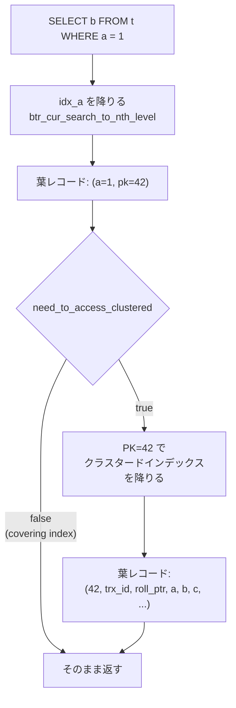

> **前提**: [クラスタードインデックス](./clustered-index/)

## 何を学んだか

セカンダリインデックスも B+tree だが、葉に入っているのは行ではない。

```
セカンダリインデックス KEY idx_a (a) の葉レコード

  [ a ] [ PK 列 1 ] ... [ PK 列 n ]
   ^^^                  ^^^^^^^^^^^
   ユーザが指定した列    自動で追加される
```

**行の他の列は入らない**。`SELECT b FROM t WHERE a = 1` は、`idx_a` の葉から PK を取り出し、その PK でクラスタードインデックスをもう一度降りる。この 2 段目を InnoDB は「clustered record の取得」と呼び、その要否を決めるフラグが `prebuilt->need_to_access_clustered` 1 つだ。



覚えておくべき性質は 4 つ。

1. **PK 列がすでにインデックスに含まれていれば、重複して追加されない**。`PRIMARY KEY (id)` のテーブルに `KEY (id, a)` を作っても `id` は 1 回しか入らない
2. **UNIQUE セカンダリインデックスの一意性判定には PK が含まれない**。`n_uniq` はユーザが宣言した列数のままだ
3. **node pointer には PK まで含めた全フィールドが入る**。クラスタードとは違う
4. **葉に `DB_TRX_ID` も `DB_ROLL_PTR` もない**。だから版が辿れず、MVCC の判定にクラスタードインデックスを見に行く必要が出る ([セカンダリインデックスと MVCC](./secondary-index-visibility/))

## なぜそうなっているか

### なぜ行そのものではなく PK を持つのか

葉に行データを持つと、行が更新されるたびに全セカンダリインデックスを書き換えることになる。PK を持てば、**PK に含まれない列の更新はセカンダリインデックスに触らない**。`UPDATE t SET updated_at = NOW() WHERE id = 1` がインデックス 10 本のテーブルでも 1 本の B+tree しか触らないのは、この設計のおかげだ。

代わりに行を取るのに 2 段かかる。もう 1 つの選択肢は「行の物理アドレス (space, page, offset) を持つ」だが、それをやるとページ内でレコードが移動したり分割が起きたりするたびに全セカンダリインデックスを直す必要がある。**PK は行が動いても変わらない論理的な住所**なので、ページ分割から独立していられる。

### なぜ UNIQUE の `n_uniq` に PK を含めないのか

含めたら、`UNIQUE KEY (email)` に同じ `email` を 2 回入れても `(email, pk)` としては違うレコードになるので、重複が検出できない。宣言された一意性を守るには、比較範囲を宣言した列に限る必要がある。

その代わり、**UNIQUE セカンダリインデックスの重複検査は必ず「その値のギャップを見る」ことになり、RR でも RC でも next-key lock が出る** ([RR と RC の違い](./locking-in-rr-vs-rc/))。

### なぜ node pointer には PK まで入れるのか

node pointer が一意でないと降下先が決まらないからだ。非葉ページのレコードが `(a=5, page=100)` と `(a=5, page=101)` の 2 本あったとき、`a=5` を探すクエリはどちらへ降りればよいか分からない。PK を含めれば順序が全順序になり、二分探索が破綻しない。

このぶん**セカンダリインデックスの非葉ページの fan-out は葉と同じ程度に落ちる**。クラスタードインデックスの非葉が PK だけで済むのと対照的だ。

## ソースコードのどこか

### `dict_index_build_internal_non_clust`

[`dict0dict.cc#L3310`](https://github.com/mysql/mysql-server/blob/mysql-8.4.11/storage/innobase/dict/dict0dict.cc#L3310)。まず「ユーザが宣言した列数 + 1 + クラスタードインデックスの `n_uniq`」の器を作る。

```cpp title="storage/innobase/dict/dict0dict.cc"
  /* Create a new index */
  new_index = dict_mem_index_create(table->name.m_name, index->name,
                                    index->space, index->type,
                                    index->n_fields + 1 + clust_index->n_uniq);
```

次に、すでに含まれている列にマークを付ける。

```cpp title="storage/innobase/dict/dict0dict.cc"
  /* Mark the table columns already contained in new_index */
  for (i = 0; i < new_index->n_def; i++) {
    field = new_index->get_field(i);

    if (field->col->is_virtual()) {
      continue;
    }

    /* If there is only a prefix of the column in the index
    field, do not mark the column as contained in the index */

    if (field->prefix_len == 0) {
      indexed[field->col->ind] = true;
    }
  }
```

そして PK の列のうち、まだ入っていないものだけを追加する。

```cpp title="storage/innobase/dict/dict0dict.cc"
  /* Add to new_index the columns necessary to determine the clustered
  index entry uniquely */

  for (i = 0; i < clust_index->n_uniq; i++) {
    field = clust_index->get_field(i);

    if (!indexed[field->col->ind]) {
      dict_index_add_col(new_index, table, field->col, field->prefix_len,
                         field->is_ascending);
    } else if (dict_index_is_spatial(index)) {
      ...
    }
  }
```

**`if (!indexed[...])` が重複を防ぐ**。`PRIMARY KEY (tenant_id, id)` のテーブルに `KEY (tenant_id, created_at)` を作ると、葉には `(tenant_id, created_at, id)` の 3 列しか入らない。`tenant_id` を 2 回持つことはない。

ただし前ページの接頭辞 PK と同じ罠がある。**インデックス側が接頭辞なら `indexed` が立たない**。`PRIMARY KEY (name)` のテーブルに `KEY (name(10), age)` を作ると、葉は `(name の先頭 10 バイト, age, name のフル値)` になる。

最後に `n_uniq` を決める。

```cpp title="storage/innobase/dict/dict0dict.cc"
  if (dict_index_is_unique(index)) {
    new_index->n_uniq = index->n_fields;
  } else {
    new_index->n_uniq = new_index->n_def;
  }

  /* Set the n_fields value in new_index to the actual defined
  number of fields */

  new_index->n_fields = new_index->n_def;
```

`UNIQUE KEY (email)` なら `n_uniq = 1`。**PK を足した後でも一意性判定は `email` だけを見る**。だからこそ重複が検出できる。一方 `KEY (a)` (非 UNIQUE) なら `n_uniq = n_def` = `a` + PK 全列で、レコードとしては一意になる。

### node pointer にはすべて入る

```cpp title="storage/innobase/include/dict0dict.ic"
inline uint16_t dict_index_get_n_unique_in_tree(
    const dict_index_t *index) /*!< in: an internal representation
                               of index (in the dictionary cache) */
{
  ...
  if (index->is_clustered()) {
    return dict_index_get_n_unique(index);
  }

  return dict_index_get_n_fields(index);
}
```

クラスタードなら `n_uniq`、セカンダリなら `n_fields` を返す。`dict_index_build_node_ptr` はこの値だけフィールドをコピーする ([クラスタードインデックス](./clustered-index/))。

**セカンダリインデックスの node pointer は葉レコードと同じ幅**になる、ということだ。理由は一意性で、`KEY (a)` の非葉ページに `a` だけを載せると、同じ `a` を持つレコードが複数ページにまたがったときにどの子ページへ降りるべきか決まらない。PK まで含めれば node pointer は一意になり、木の降下が確定する。

### 2 度引きの判定

`ha_innobase::build_template` が列ごとにテンプレートを組み立てるとき、フラグを立てる。

```cpp title="storage/innobase/handler/ha_innodb.cc"
  m_prebuilt->need_to_access_clustered = (index == clust_index);
```

[`ha_innodb.cc#L8671`](https://github.com/mysql/mysql-server/blob/mysql-8.4.11/storage/innobase/handler/ha_innodb.cc#L8671)。初期値は「そもそもクラスタードインデックスを走査するなら true」。そして必要な列がセカンダリインデックスに無かった瞬間に true になる。

```cpp title="storage/innobase/handler/ha_innodb.cc"
  if (!index->is_clustered() && templ->rec_field_no == ULINT_UNDEFINED) {
    prebuilt->need_to_access_clustered = true;
  }
```

[L8565](https://github.com/mysql/mysql-server/blob/mysql-8.4.11/storage/innobase/handler/ha_innodb.cc#L8565)。`rec_field_no == ULINT_UNDEFINED` は「この列はこのインデックスのレコードに存在しない」という意味だ。**`SELECT *` は必ずどこかの列で引っかかるので、セカンダリインデックスを使う `SELECT *` は必ず 2 度引く**。

実際に 2 度目を引くのは `row_search_mvcc` の中。

```cpp title="storage/innobase/row/row0sel.cc"
  /* Get the clustered index record if needed, if we did not do the
  search using the clustered index. */

  if (index != clust_index && prebuilt->need_to_access_clustered) {
  requires_clust_rec:
    ut_ad(index != clust_index);
    ...
    mtr_has_extra_clust_latch = true;
    ...
    err = row_sel_get_clust_rec_for_mysql(
        prebuilt, index, rec, thr, &clust_rec, &offsets, &heap,
        need_vrow ? &vrow : nullptr, &mtr, prebuilt->get_lob_undo());
```

[`row0sel.cc#L5444`](https://github.com/mysql/mysql-server/blob/mysql-8.4.11/storage/innobase/row/row0sel.cc#L5444)。呼ばれる先は `Row_sel_get_clust_rec_for_mysql` という**状態を持つ functor** だ。

```cpp title="storage/innobase/row/row0sel.cc"
/** Helper class to cache clust_rec and old_ver */
class Row_sel_get_clust_rec_for_mysql {
  const rec_t *cached_clust_rec;
  rec_t *cached_old_vers;
  ...
```

[`row0sel.cc#L3090`](https://github.com/mysql/mysql-server/blob/mysql-8.4.11/storage/innobase/row/row0sel.cc#L3090)。**直前に取得したクラスタードレコードとその旧版をキャッシュしている**。セカンダリインデックスに同じ PK を指すレコードが連続することがある (delete-mark された旧エントリとその後継など) ので、同じ PK を続けて引かれたら版の再構築をやり直さない。

`mtr_has_extra_clust_latch = true` にも意味がある。セカンダリインデックスの葉ページを latch したまま、クラスタードインデックスの葉ページも latch する。**1 つの mtr が 2 本の木の latch を同時に持つ**ので、この後の処理でカーソルの位置を保存して latch を落とす必要が出る (`btr_pcur_t::store_position`、[B+tree の操作](./btree-operations/))。

### 挿入は 2 本とも更新する

挿入は `row_ins` が `node->index` を進めながら [`row_ins_index_entry_step` (`row0ins.cc#L3474`)](https://github.com/mysql/mysql-server/blob/mysql-8.4.11/storage/innobase/row/row0ins.cc#L3474) を呼ぶループで、クラスタードインデックスの後にセカンダリインデックスを順に回る。セカンダリ側の入口が `row_ins_sec_index_entry` だ。

```cpp title="storage/innobase/row/row0ins.cc"
dberr_t row_ins_sec_index_entry(
```

[`row0ins.cc#L3200`](https://github.com/mysql/mysql-server/blob/mysql-8.4.11/storage/innobase/row/row0ins.cc#L3200)。インデックスが 5 本あれば、1 回の `INSERT` で B+tree の降下が 6 回起きる。UNIQUE インデックスならさらに重複検査のロックが加わる ([INSERT のロック](./insert-and-duplicate-check/))。

### インデックス拡張 — サーバ側の対応物

InnoDB が PK を葉に足していることを、SQL 層も知っている。

```cpp title="sql/table.cc"
uint add_pk_parts_to_sk(KEY *sk, uint sk_n, KEY *pk, uint pk_n,
                        TABLE_SHARE *share, handler *handler_file,
                        uint *usable_parts, bool use_extended_sk) {
  ...
    /* Do not add key part if it's already present in SK. */
    if (!pk_field_is_in_sk) {
      /* MySQL does not support keys longer than MAX_KEY_LENGTH. */
      if (max_key_length + pk_key_part->length > MAX_KEY_LENGTH) {
        is_unique_key = false;
        break;
      }
      max_key_length += pk_key_part->length;
      /*
        Do not add key part if SK is a unique key or
        if use_index_extensions is OFF.
      */
      if ((sk->flags & HA_NOSAME) || !use_extended_sk) continue;
      *current_key_part = *pk_key_part;
      ...
      sk->actual_key_parts++;
```

[`sql/table.cc#L817`](https://github.com/mysql/mysql-server/blob/mysql-8.4.11/sql/table.cc#L817)。`use_extended_sk` は `optimizer_switch` の `use_index_extensions` (既定 on) で、**オプティマイザから見て `KEY (a)` が `KEY (a, pk...)` に見えるようにする**。`KEY (a)` に対して `WHERE a = 1 ORDER BY id` がインデックス順で取れるのはこの拡張のおかげだ。

条件が 2 つある。

- **UNIQUE インデックスは拡張されない** (`if ((sk->flags & HA_NOSAME) || ...) continue;`)。前述のとおり InnoDB 内部でも `n_uniq` は宣言した列数のままなので、整合している
- `MAX_KEY_LENGTH` と `MAX_REF_PARTS` を超えたら打ち切る

`EXPLAIN` の `key_len` が、宣言した列の長さより長く出ることがあるのはこの拡張が効いているときだ。

## どう活かすか

### `SELECT *` が 2 度引く

`EXPLAIN` で `type: ref`、`key: idx_a` と出ていても、`Extra` に `Using index` が無ければ 2 度引いている。10000 行がヒットするクエリなら、B+tree の降下が 10001 回だ。しかも 2 段目はセカンダリインデックス上の順序で PK を辿るので、**クラスタードインデックス側から見ればランダムアクセス**になる。

必要な列だけを列挙して covering index にできれば、この 10000 回が丸ごと消える。効果が大きいのは `LIMIT` の無い集計や、ページネーションの `OFFSET` が深いクエリだ。

### covering index にする条件

`Extra: Using index` が出るのは `need_to_access_clustered` が false のときで、条件は「**`SELECT` の全列と `WHERE` / `ORDER BY` / `GROUP BY` の全列が、そのインデックスのレコードに存在すること**」。ここで「そのインデックスのレコード」には PK 列も含まれる。

つまり `PRIMARY KEY (id)`、`KEY idx_a (a)` のテーブルで

```sql
SELECT id FROM t WHERE a = 1;
```

は **`id` を明示的にインデックスに入れなくても covering になる**。葉に PK が入っているからだ。この事実を知らないと `KEY (a, id)` という冗長なインデックスを作ってしまう (作っても上の `if (!indexed[...])` で `id` は重複せず、`KEY (a)` と物理的に同じものになる)。

注意点が 2 つある。

- **接頭辞インデックスは covering にならない**。`KEY (name(10))` の葉には `name` の先頭 10 バイトしかないので、`SELECT name` を満たせない
- **セカンダリインデックスだけで済んでも、MVCC の都合でクラスタードを見に行くことがある** ([セカンダリインデックスと MVCC](./secondary-index-visibility/))。`Using index` と出ていても実 I/O が減らない場合がある

### 複合インデックスの左端規則

`KEY (a, b, c)` は `(a)`、`(a, b)`、`(a, b, c)` の検索に使えるが `(b)` には使えない。理由は B+tree の順序が `a` → `b` → `c` の辞書順だからで、`b` だけを条件にしても連続した区間にならない。

インデックス拡張を踏まえると、実際のキーは `(a, b, c, pk...)` だ。だから

```sql
SELECT ... FROM t WHERE a = 1 AND b = 2 ORDER BY id LIMIT 20;
```

は `KEY (a, b)` だけで filesort なしに解ける。`ORDER BY id` の `id` が拡張されたキーの左端から連続しているからだ。`optimizer_switch` で `use_index_extensions=off` にすると filesort が復活する。

### インデックスを増やすコストは書き込み側に出る

インデックス 1 本ごとに、`INSERT` / `DELETE` で B+tree の降下が 1 回増える。PK が長ければその複製も 1 本ぶん増える。「読み取りが速くなるから」で足したインデックスが、`INSERT` のスループットを落とし、バッファプールを食い、ダーティページを増やす。

`sys.schema_unused_indexes` と `sys.schema_redundant_indexes` で棚卸しできる。`(a)` と `(a, b)` が両方あるなら `(a)` は不要で、`(a, id)` と `(a)` は上で見たとおり物理的に同じものだ。
