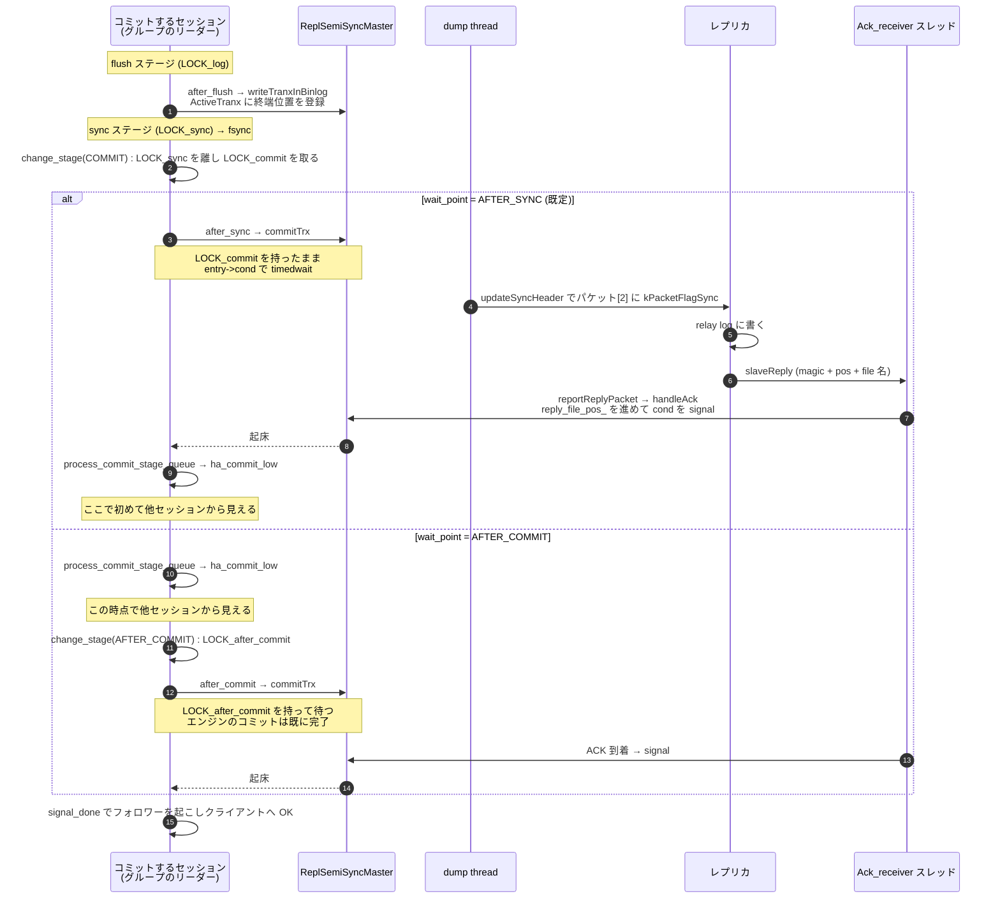

## 何を学んだか

半同期レプリケーションは「レプリカが binlog を受け取ったことを確認してからクライアントに OK を返す」機構だ。実装は今も**プラグイン**で、`plugin/semisync/` にある。`components/` に semisync はない。

待つ場所 (wait point) が 2 つあり、**既定は `AFTER_SYNC`** だ ([`semisync_source_plugin.cc#L303`](https://github.com/mysql/mysql-server/blob/mysql-8.4.11/plugin/semisync/semisync_source_plugin.cc#L303) の `MYSQL_SYSVAR_ENUM(wait_point, ..., WAIT_AFTER_SYNC, ...)`)。

| wait point          | 呼ばれるフック                   | ordered_commit のどこ                       | 保持している mutex  |
| ------------------- | -------------------------------- | ------------------------------------------- | ------------------- |
| `AFTER_SYNC` (既定) | `binlog_storage` の `after_sync` | commit ステージ、`ha_commit_low` の**前**   | **`LOCK_commit`**   |
| `AFTER_COMMIT`      | `transaction` の `after_commit`  | after commit ステージ、`ha_commit_low` の後 | `LOCK_after_commit` |

**この違いが最重要だ。** `AFTER_SYNC` はエンジンへのコミットを止めたまま待つので、「レプリカが受け取っていないトランザクションを source の他セッションが見てしまう」ことがない。代償として、**待っている間、そのグループのコミットも、次に commit ステージへ入ろうとするグループも進まない**。

つまり **1 台の止まったレプリカが、source の commit pipeline 全体を止める。** ACK を待っているセッションだけが遅くなるのではない。この性質を理解せずに半同期を入れると、レプリカのネットワーク障害が source の全書き込みの停止として現れる。

止まりっぱなしにはならず、`rpl_semi_sync_source_timeout` (既定 10000ms) で非同期に落ちる。ただし**その 10 秒間は書き込みが止まる。**

## ソースコードのどこか

### プラグインの構造 — `_old.cc` の正体

```
plugin/semisync/
  semisync.cc / .h                     共通の定数とトレース
  semisync_source.cc / .h              ReplSemiSyncMaster (待ちと ACK の管理)
  semisync_source_plugin.cc            フックの登録とシステム変数
  semisync_source_plugin_old.cc        ← 25 行。うち実コードは 2 行
  semisync_source_ack_receiver.cc / .h Ack_receiver (専用スレッド)
  semisync_source_socket_listener.h
  semisync_replica.cc / .h             ReplSemiSyncSlave
  semisync_replica_plugin.cc
  semisync_replica_plugin_old.cc       ← 同上
```

`_old.cc` の中身はライセンスヘッダを除くとこれだけだ。

```cpp title="plugin/semisync/semisync_source_plugin_old.cc"
#define USE_OLD_SEMI_SYNC_TERMINOLOGY
#include "semisync_source_plugin.cc"
```

**同じ翻訳単位をマクロを変えて 2 回ビルドしている。** `semisync_source_plugin.cc` の先頭で `SOURCE_NAME` / `REPLICA_NAME` / プラグイン名がマクロで切り替わるので、`rpl_semi_sync_source` と `rpl_semi_sync_master` という 2 つのプラグインが 1 つのソースから生成される。旧名のシステム変数 (`rpl_semi_sync_master_enabled` など) は、別プラグインとして丸ごと別に存在している。

### フックの張り方

`sql/replication.h` の `Binlog_storage_observer` と `Trans_observer` に関数ポインタを登録する。semisync 側の実装は [`semisync_source_plugin.cc#L79`](https://github.com/mysql/mysql-server/blob/mysql-8.4.11/plugin/semisync/semisync_source_plugin.cc#L79) 以降だ。

```cpp title="plugin/semisync/semisync_source_plugin.cc"
static int repl_semi_report_binlog_update(Binlog_storage_param *,
                                          const char *log_file,
                                          my_off_t log_pos) {
  int error = 0;

  if (repl_semisync->getMasterEnabled()) {
    ...
    error = repl_semisync->writeTranxInBinlog(log_file, log_pos);
  }

  return error;
}

static int repl_semi_report_binlog_sync(Binlog_storage_param *,
                                        const char *log_file,
                                        my_off_t log_pos) {
  if (rpl_semi_sync_source_wait_point == WAIT_AFTER_SYNC)
    return repl_semisync->commitTrx(log_file, log_pos);
  return 0;
}
```

3 つのフックが順に呼ばれる。

1. **`after_flush`** → `writeTranxInBinlog` — 「このトランザクションの終端はこのファイルのこの位置」を `ActiveTranx` に登録する。**待つのはまだ先**
2. **`after_sync`** → `wait_point == AFTER_SYNC` なら `commitTrx` で待つ
3. **`after_commit`** → `wait_point == AFTER_COMMIT` なら `commitTrx` で待つ

`after_flush` が先に必要なのは、dump thread が「このイベントに ACK 要求フラグを立てるか」を判断するためだ ([後述](#dump-thread-が-ack-を要求する))。

### `AFTER_SYNC` の待ちが `LOCK_commit` の下にあること

`after_sync` フックを呼ぶのは `ordered_commit` の `call_after_sync_hook` だ ([`binlog.cc#L8840`](https://github.com/mysql/mysql-server/blob/mysql-8.4.11/sql/binlog.cc#L8840))。呼ばれる位置を `ordered_commit` から抜き出す。

```cpp title="sql/binlog.cc"
    if (change_stage(thd, Commit_stage_manager::COMMIT_STAGE, final_queue,
                     leave_mutex_before_commit_stage, &LOCK_commit)) {
      ...
    }
    THD *commit_queue =
        Commit_stage_manager::get_instance().fetch_queue_acquire_lock(
            Commit_stage_manager::COMMIT_STAGE);
    ...
    if (flush_error == 0 && sync_error == 0)
      sync_error = call_after_sync_hook(commit_queue);
    ...
    process_commit_stage_queue(thd, commit_queue);
```

**`change_stage(COMMIT_STAGE, ..., enter=&LOCK_commit)` を通ったリーダーは `LOCK_commit` を持っている。** その状態で `call_after_sync_hook` を呼び、その中で `commitTrx` がレプリカの ACK を待つ。`process_commit_stage_queue` (= `ha_commit_low` の呼び出し) はその後だ。

`process_commit_stage_queue` 自身が `LOCK_commit` の保持をアサートしている ([L8579](https://github.com/mysql/mysql-server/blob/mysql-8.4.11/sql/binlog.cc#L8579))。

これが成り立つのは `binlog_order_commits` が ON (既定) のときだけだ。OFF にすると `ordered_commit` は commit ステージを飛ばし、`LOCK_sync` を先に手放してから `call_after_sync_hook` を呼ぶので、**semisync はステージ mutex を 1 本も持たずに待つ**。分岐の実物は[2PC とグループコミットのページ](./two-phase-commit-and-group-commit/)にある。

```cpp title="sql/binlog.cc"
void MYSQL_BIN_LOG::process_commit_stage_queue(THD *thd, THD *first) {
  mysql_mutex_assert_owner(&LOCK_commit);
```

**`LOCK_commit` を持ったまま待つ = commit ステージが空かない = 次のグループは sync ステージから先へ進めない。** これが「止まったレプリカが commit pipeline 全体を止める」の機構的な理由だ。

### 2 つの wait point を図で分ける



**`AFTER_COMMIT` では、待っている間に他のセッションがそのトランザクションの結果を読める。** source がその直後に落ちてフェイルオーバーすると、**読めていたはずのデータが新しい source に存在しない**。これが `AFTER_SYNC` が既定になった理由で、ヘルプ文にもそう書かれている。

```cpp title="plugin/semisync/semisync_source_plugin.cc"
    "AFTER_SYNC is the default value. AFTER_SYNC means that the "
    "source-side semisynchronous plugin waits for the replies just after it "
    "has synced the binary log file (or would have synced, but may have "
    "skipped it, when sync_binlog!=1), but before it has committed in the "
    "engine on the source side. Therefore, it guarantees that no other "
    "sessions on the source can see the effects of the transaction before "
    "the replica has received it. "
```

括弧内の「`sync_binlog!=1` のときは `fsync` を飛ばしているかもしれない」が重要だ。**`sync_binlog=1` でなければ、半同期が保証するのは「レプリカが受け取った」だけで「source のディスクに載った」ではない。**

### 待ちの本体 — `commitTrx`

[`ReplSemiSyncMaster::commitTrx` (`semisync_source.cc#L644`)](https://github.com/mysql/mysql-server/blob/mysql-8.4.11/plugin/semisync/semisync_source.cc#L644)。**semisync 自身の mutex (`LOCK_binlog_`) を取り、`LOCK_commit` の内側でさらにネストする。**

```cpp title="plugin/semisync/semisync_source.cc"
  /* Acquire the mutex. */
  lock();

  TranxNode *entry = nullptr;
  mysql_cond_t *thd_cond = nullptr;
  bool is_semi_sync_trans = true;
  if (active_tranxs_ != nullptr && trx_wait_binlog_name) {
    entry = active_tranxs_->find_active_tranx_node(trx_wait_binlog_name,
                                                   trx_wait_binlog_pos);
    if (entry) thd_cond = &entry->cond;
  }
  /* This must be called after acquired the lock */
  THD_ENTER_COND(nullptr, thd_cond, &LOCK_binlog_,
                 &stage_waiting_for_semi_sync_ack_from_replica, &old_stage);
```

`THD_ENTER_COND` で `SHOW PROCESSLIST` の State が `Waiting for semi-sync ACK from replica` になる。

待つ前に「もう ACK が来ている位置か」を確認し、来ていれば待たずに抜ける。

```cpp title="plugin/semisync/semisync_source.cc"
    while (is_on()) {
      if (reply_file_name_inited_) {
        int cmp =
            ActiveTranx::compare(reply_file_name_, reply_file_pos_,
                                 trx_wait_binlog_name, trx_wait_binlog_pos);
        if (cmp >= 0) {
          /* We have already sent the relevant binlog to the slave: no need to
           * wait here.
           */
          ...
          break;
        }
      }
```

待つのは `mysql_cond_timedwait` で、期限は `wait_timeout_`。

```cpp title="plugin/semisync/semisync_source.cc"
      wait_result = mysql_cond_timedwait(&entry->cond, &LOCK_binlog_, &abstime);
      ...
      if (wait_result != 0) {
        /* This is a real wait timeout. */
        LogErr(WARNING_LEVEL, ER_SEMISYNC_WAIT_FOR_BINLOG_TIMEDOUT,
               trx_wait_binlog_name, (unsigned long)trx_wait_binlog_pos,
               reply_file_name_, (unsigned long)reply_file_pos_);
        rpl_semi_sync_source_wait_timeouts++;

        /* switch semi-sync off */
        switch_off();
```

**タイムアウトすると `switch_off()` で半同期が丸ごと OFF になる。** そのセッションだけが諦めるのではなく、以後のトランザクションは非同期で通る (`Rpl_semi_sync_source_status` が `OFF` になる)。レプリカが追いついてくると [`try_switch_on` (L891)](https://github.com/mysql/mysql-server/blob/mysql-8.4.11/plugin/semisync/semisync_source.cc#L891) で自動的に戻る。

timeout の既定は 10000ms ([`semisync_source_plugin.cc#L259`](https://github.com/mysql/mysql-server/blob/mysql-8.4.11/plugin/semisync/semisync_source_plugin.cc#L259))。

```cpp title="plugin/semisync/semisync_source_plugin.cc"
static MYSQL_SYSVAR_ULONG(
    timeout, rpl_semi_sync_source_timeout, PLUGIN_VAR_OPCMDARG,
    ...
    10000, 0, ~0UL, 1);
```

### dump thread が ACK を要求する

半同期の ACK 要求は、パケットの 3 バイト目のフラグ 1 ビットで表現される。定数は [`semisync.cc#L28`](https://github.com/mysql/mysql-server/blob/mysql-8.4.11/plugin/semisync/semisync.cc#L28)。

```cpp title="plugin/semisync/semisync.cc"
const unsigned char ReplSemiSyncBase::kPacketMagicNum = 0xef;
const unsigned char ReplSemiSyncBase::kPacketFlagSync = 0x01;
...
const unsigned char ReplSemiSyncBase::kSyncHeader[2] = {
    ReplSemiSyncBase::kPacketMagicNum, 0};
```

立てるのは [`updateSyncHeader` (`semisync_source.cc#L946`)](https://github.com/mysql/mysql-server/blob/mysql-8.4.11/plugin/semisync/semisync_source.cc#L946) で、dump thread の `before_send` フックから呼ばれる。

```cpp title="plugin/semisync/semisync_source.cc"
    /* If we are already waiting for some transaction replies which
     * are later in binlog, do not wait for this one event.
     */
    if (cmp >= 0) {
      /*
       * We only wait if the event is a transaction's ending event.
       */
      assert(active_tranxs_ != nullptr);
      sync = active_tranxs_->is_tranx_end_pos(log_file_name, log_file_pos);
    }
```

**フラグが立つのはトランザクションの終端イベントだけ。** 全イベントで ACK を求めたらネットワークが往復だらけになる。レプリカ側は [`slaveReadSyncHeader` (`semisync_replica.cc#L57`)](https://github.com/mysql/mysql-server/blob/mysql-8.4.11/plugin/semisync/semisync_replica.cc#L57) でこのビットを読む。

```cpp title="plugin/semisync/semisync_replica.cc"
    *need_reply = (header[1] & kPacketFlagSync);
```

立っていれば relay log に書いたあと `slaveReply` で位置を返す。**レプリカは適用 (アプライヤ) を待たない。relay log に書いた時点で ACK する。**

### ACK を集めるのは専用スレッド

dump thread は送信専用で、ACK は読まない。読むのは `Ack_receiver` の 1 本のスレッドだ ([`semisync_source_ack_receiver.cc#L243`](https://github.com/mysql/mysql-server/blob/mysql-8.4.11/plugin/semisync/semisync_source_ack_receiver.cc#L243))。

```cpp title="plugin/semisync/semisync_source_ack_receiver.cc"
    ret = listener.listen_on_sockets();
    ...
    set_stage_info(stage_reading_semi_sync_ack);
    i = 0;
    while (i < listener.number_of_slave_sockets() && m_status == ST_UP) {
      if (listener.is_socket_active(i)) {
        Slave slave_obj = listener.get_slave_obj(i);
        ...
          len = my_net_read(&net);
          if (likely(len != packet_error))
            repl_semisync->reportReplyPacket(slave_obj.server_id, net.read_pos,
                                             len);
```

**全レプリカのソケットを 1 本のスレッドが `select` で多重化して読む。** 受け取ったパケットは [`reportReplyPacket` (L345)](https://github.com/mysql/mysql-server/blob/mysql-8.4.11/plugin/semisync/semisync_source.cc#L345) でマジックバイトを検証してから `handleAck` に渡り、`reply_file_pos_` を進めて待っているセッションの条件変数を叩く。

複数レプリカがいるときの扱いは [`reportReplyBinlog` (L566)](https://github.com/mysql/mysql-server/blob/mysql-8.4.11/plugin/semisync/semisync_source.cc#L566) のコメントに書かれている。

```cpp title="plugin/semisync/semisync_source.cc"
   * In reality, to improve the transaction availability, we allow multiple
   * sync replication slaves.  So, if any one of them get the transaction,
   * the transaction session in the primary can move forward.
```

必要な ACK 数は `rpl_semi_sync_source_wait_for_replica_count` (既定 1)。**遅れているレプリカの位置は無視され、最も進んでいるレプリカの位置だけが `reply_file_pos_` を進める。**

### レプリカが 0 台になったとき

`remove_slave` ([L531](https://github.com/mysql/mysql-server/blob/mysql-8.4.11/plugin/semisync/semisync_source.cc#L531)) が判定する。

```cpp title="plugin/semisync/semisync_source.cc"
    if ((rpl_semi_sync_source_clients ==
         rpl_semi_sync_source_wait_for_replica_count - 1) &&
        (!rpl_semi_sync_source_wait_no_replica ||
         connection_events_loop_aborted())) {
      ...
      switch_off();
    }
```

`rpl_semi_sync_source_wait_no_replica` の既定は 1 (ON) なので、**レプリカが 0 台になっても即座には OFF にならず、timeout を待つ**。0 にすると切断と同時に非同期へ落ちる。

## なぜそうなっているか

**`AFTER_SYNC` が `ha_commit_low` の前でなければ意味がない。** エンジンにコミットしてしまうと、その瞬間から他セッションの `SELECT` に見える。そこで source が落ちてフェイルオーバーすると、「見えたのに消えた」という MySQL が保証すべきでない状態が生じる。**エンジンのコミットを止めておくことだけが、これを防ぐ手段だ。**

**その結果として `LOCK_commit` を握ったまま待つことになるのは、避けられない副作用ではなく必然だ。** commit ステージのリーダーはグループ全員の `ha_commit_low` を代行するので、リーダーが待てばグループ全員が待つ。そして `LOCK_commit` が空かないので、次のグループも commit ステージに入れない。**「1 セッションのレイテンシ」ではなく「サーバの書き込みスループット全体」が ACK のラウンドトリップに支配される。**

**`AFTER_COMMIT` が `AFTER_COMMIT_STAGE` という専用ステージを持っているのは、この副作用を減らすためだ。** `LOCK_commit` から `LOCK_after_commit` に持ち替えてからフックを呼ぶので、待っている間も次のグループは `ha_commit_low` まで進める ([2PC とグループコミット](./two-phase-commit-and-group-commit/))。**ステージを 1 つ増やしてまで待ちを別 mutex に移したのは、待ちが外部プラグインのコードだからだ。**

**レプリカが「relay log に書いた」時点で ACK するのは、そこまでが耐久性の境界だからだ。** 適用を待つと、レプリカのアプライヤの速度が source の書き込み速度を直接支配してしまう。半同期が保証するのは「トランザクションが 2 台目のディスクに存在する」ことであって「2 台目で読める」ことではない。**半同期は read-your-writes を提供しない。** それは [GTID](./gtid/) の仕事だ。

**timeout で非同期に落ちる (fail open) 設計は、可用性を一貫性より優先している。** レプリカが死んだときに source も止まるほうが安全だと考えるなら、半同期ではなく Group Replication を使うことになる (この章の対象外)。**半同期は「普段は同期、壊れたら非同期」であって、強い保証ではない。**

**`switch_off` がセッション単位でなくグローバルなのは、片方だけ半同期という中途半端な状態を作らないためだ。** 1 つのトランザクションが timeout したなら、レプリカかネットワークが壊れているので後続も同じ運命になる。全体を切り替えて、`Rpl_semi_sync_source_status` という 1 つの観測点で状態が読めるようにしている。

**`_old.cc` の 2 行という実装は、非推奨名の維持コストをゼロにするための工夫だ。** 用語変更 (master → source) でシステム変数名を変える必要があったが、旧名を消すと既存の設定が起動しなくなる。**同じソースをマクロ違いで 2 回コンパイルして 2 つのプラグインにする**ことで、コードの二重管理を避けている。

## どう活かすか

**半同期を入れる前に、レプリカ 1 台の障害が source の全書き込みを最大 `rpl_semi_sync_source_timeout` 秒止めることを受け入れられるか決める。** 既定の 10 秒は長い。アプリのタイムアウトが 3 秒なら、その 10 秒間は全リクエストが失敗する。**`rpl_semi_sync_source_timeout` はアプリのタイムアウトより短く設定する。**

**`Waiting for semi-sync ACK from replica` が `SHOW PROCESSLIST` に大量に出ていたら、詰まっているのは 1 セッションではない。** `AFTER_SYNC` では commit ステージのリーダーが `LOCK_commit` を握っているので、その後ろのグループも全部止まっている。**同時に `wait/synch/mutex/sql/MYSQL_BIN_LOG::LOCK_commit` の待ちを `performance_schema.events_waits_summary_global_by_event_name` で見ると、影響範囲が分かる。**

**`Rpl_semi_sync_source_status` が `OFF` になっていたら、半同期は効いていない。** `Rpl_semi_sync_source_no_tx` (非同期で通ったトランザクション数) と `Rpl_semi_sync_source_yes_tx` の比を監視する。`Rpl_semi_sync_source_no_times` は「半同期が OFF に落ちた回数」で、これが増えているなら timeout かレプリカの切断が起きている ([ステータス変数の一覧は `semisync_source_plugin.cc#L454`](https://github.com/mysql/mysql-server/blob/mysql-8.4.11/plugin/semisync/semisync_source_plugin.cc#L454))。**「半同期を設定した」と「半同期が動いている」は別だ。**

**レプリカを 2 台にしても `rpl_semi_sync_source_wait_for_replica_count=1` のままなら、保証されるのは「どちらか 1 台」だ。** 特定のレプリカが受け取ったことは保証されない。フェイルオーバー先を固定したいなら、その保証は半同期からは得られない。

**`sync_binlog=1` でないと半同期の保証は片肺になる。** レプリカには届いているが source のディスクには載っていない、という状態が許されてしまう。source が OS ごと落ちると、source だけが巻き戻る。**半同期と `sync_binlog=1` と `innodb_flush_log_at_trx_commit=1` は、それぞれ別のものを守っている。3 つ揃って初めて「コミット応答を返したものは失わない」になる。**

**半同期はレプリカの遅延を減らさない。** ACK は relay log に書いた時点で返る。アプライヤが遅れていれば `Seconds_Behind_Source` は伸びる ([レプリカ遅延の正体](./replication-lag/))。半同期を入れたのに遅延が改善しないのは想定どおりで、半同期が保証しているのは耐久性であって鮮度ではない。

**旧名の変数 (`rpl_semi_sync_master_*`) と新名 (`rpl_semi_sync_source_*`) は別プラグインのものだ。** 両方を同時にインストールすることはできず、`semi_sync_master_plugin_init` が相手側の `_enabled` 変数の存在を見て `ER_INSTALL_PLUGIN_CONFLICT_CLIENT` で弾く ([`semisync_source_plugin.cc#L581`](https://github.com/mysql/mysql-server/blob/mysql-8.4.11/plugin/semisync/semisync_source_plugin.cc#L581))。

```cpp title="plugin/semisync/semisync_source_plugin.cc"
      Unfortunately, two semisync libraries don't make one sync library. :-)
      If user installs both the old-named library and the new-named
      library, we generate an error, since the two would interfere with
      each other.
```

移行時は、設定ファイルに書いた変数名とインストールしたプラグインの世代を必ず揃える。
