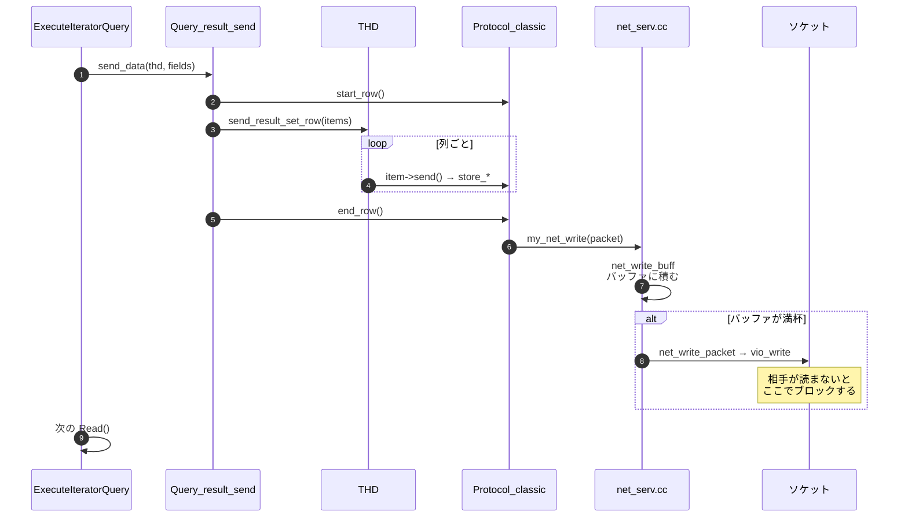

## 何を学んだか

`ExecuteIteratorQuery` のループは、1 行読むごとに `send_data` を呼ぶ ([エグゼキュータのページ](./executor-walkthrough/))。

```cpp title="sql/sql_union.cc"
      ++*send_records_ptr;

      if (query_result->send_data(thd, *fields)) {
        return true;
      }
```

**結果セットは溜めてから送るのではなく、1 行ごとにネットワークバッファへ書かれる。** ここから 3 つの帰結が出る。

1. **`LIMIT` は木の上のほうで `-1` を返すだけで実現できる。** 下位 iterator は打ち切られたことを知らなくてよい
2. **遅いクライアントはサーバスレッドを止める。** ソケットの送信バッファが埋まると `vio_write` がブロックし、そのセッションはロックとバッファを握ったまま待つ
3. **`SQL_BUFFER_RESULT` はその関係を切るためのスイッチだ。** 結果を一時表に全部書いてから送るので、テーブルを早く手放せる

## ソースコードのどこか

### `LimitOffsetIterator`

[`composite_iterators.h#L109`](https://github.com/mysql/mysql-server/blob/mysql-8.4.11/sql/iterators/composite_iterators.h#L109)。クラスコメントが 1 行で仕様を書いている。

```cpp title="sql/iterators/composite_iterators.h"
/**
  Handles LIMIT and/or OFFSET; Init() eats the first "offset" rows, and Read()
  stops as soon as it's seen "limit" rows (including any skipped by offset).
 */
```

ただし実装は少しずれていて、**OFFSET のスキップは `Init()` ではなく最初の `Read()` で行われる** ([`composite_iterators.cc#L130`](https://github.com/mysql/mysql-server/blob/mysql-8.4.11/sql/iterators/composite_iterators.cc#L130))。

```cpp title="sql/iterators/composite_iterators.cc"
    if (m_needs_offset) {
      // We skip OFFSET rows here and not in Init(), since performance schema
      // batch mode may not be set up by the executor before the first Read().
      // This makes sure that
      //
      //   a) we get the performance benefits of batch mode even when reading
      //      OFFSET rows, and
      //   b) we don't inadvertedly enable batch mode (e.g. through the
      //      NestedLoopIterator) during Init(), since the executor may not
      //      be ready to _disable_ it if it gets an error before first Read().
      for (ha_rows row_idx = 0; row_idx < m_offset; ++row_idx) {
        int err = m_source->Read();
        if (err != 0) {
          ...
        }
        if (m_skipped_rows != nullptr) {
          ++*m_skipped_rows;
        }
        m_source->UnlockRow();
      }
```

**`OFFSET` の行も普通に読んでいる。** 読んで捨てるだけだ。`UnlockRow()` を呼ぶので READ COMMITTED なら行ロックは外れるが、REPEATABLE READ では外れない ([RR と RC の違い](./locking-in-rr-vs-rc/))。`LIMIT 1000000, 20` が遅いのは、100 万行を読んで捨てているからで、これはインデックスの問題ではなく実装そのものだ。

早期終了はこの 3 行だ。

```cpp title="sql/iterators/composite_iterators.cc"
    if (m_seen_rows >= m_limit) {
      // We really hit LIMIT (or hit LIMIT immediately after OFFSET finished),
      // so EOF.
      if (m_count_all_rows) {
        // Count rows until the end or error (ignore the error if any).
        while (m_source->Read() == 0) {
          ++*m_skipped_rows;
        }
      }
      return -1;
    }
```

**`m_count_all_rows` が立っていると、`LIMIT` に達した後も最後まで読み続ける。** これが `SQL_CALC_FOUND_ROWS` (`OPTION_FOUND_ROWS`) の実装で、コンストラクタのコメントも "you will not get any performance benefits of early end" と明言している。

### 1 行が返るまで



[`Query_result_send::send_data` (`query_result.cc#L97`)](https://github.com/mysql/mysql-server/blob/mysql-8.4.11/sql/query_result.cc#L97) は 12 行しかない。

```cpp title="sql/query_result.cc"
bool Query_result_send::send_data(THD *thd,
                                  const mem_root_deque<Item *> &items) {
  Protocol *protocol = thd->get_protocol();
  DBUG_TRACE;

  protocol->start_row();
  if (thd->send_result_set_row(items)) {
    protocol->abort_row();
    return true;
  }

  thd->inc_sent_row_count(1);
  return protocol->end_row();
}
```

[`THD::send_result_set_row` (`sql_class.cc#L2914`)](https://github.com/mysql/mysql-server/blob/mysql-8.4.11/sql/sql_class.cc#L2914) が `Item` ごとに `send()` を呼び、[`Protocol_classic::end_row` (`protocol_classic.cc#L3260`)](https://github.com/mysql/mysql-server/blob/mysql-8.4.11/sql/protocol_classic.cc#L3260) が組み上がったバイト列を渡す。

```cpp title="sql/protocol_classic.cc"
bool Protocol_classic::end_row() {
  DBUG_TRACE;
  return my_net_write(&m_thd->net, pointer_cast<uchar *>(packet->ptr()),
                      packet->length());
}
```

### ブロックする場所

[`my_net_write` (`net_serv.cc#L443`)](https://github.com/mysql/mysql-server/blob/mysql-8.4.11/sql-common/net_serv.cc#L443) の冒頭に、この経路の性格を決める 1 行がある。

```cpp title="sql-common/net_serv.cc"
  /* turn off non blocking operations */
  if (!vio_is_blocking(net->vio)) vio_set_blocking_flag(net->vio, true);
```

**送信は必ずブロッキングで行われる。** 書き込み先は [`net_write_buff` (L945)](https://github.com/mysql/mysql-server/blob/mysql-8.4.11/sql-common/net_serv.cc#L945) が管理するバッファ (`net_buffer_length` から始まり `max_allowed_packet` まで伸びる) で、そこが埋まると `net_write_packet` → [`net_write_raw_loop` (L997)](https://github.com/mysql/mysql-server/blob/mysql-8.4.11/sql-common/net_serv.cc#L997) に落ちる。

```cpp title="sql-common/net_serv.cc"
static bool net_write_raw_loop(NET *net, const uchar *buf, size_t count) {
  unsigned int retry_count = 0;

  while (count) {
    const size_t sentcnt = vio_write(net->vio, buf, count);
```

`vio_write` はブロッキング `write(2)` だ。**クライアントがソケットから読まなければ、TCP の送信バッファと受信バッファが順に埋まり、最後にこの `write` が返らなくなる。** そのスレッドは `Sending data` のまま止まり、開いているテーブル、握っている MDL、トランザクションの read view を全部抱えたまま待つ。

我慢の限界を決めるのが `net_write_timeout` ([`sys_vars.cc#L3078`](https://github.com/mysql/mysql-server/blob/mysql-8.4.11/sql/sys_vars.cc#L3078))。

```cpp title="sql/sys_vars.cc"
static Sys_var_ulong Sys_net_write_timeout(
    "net_write_timeout",
    "Number of seconds to wait for a block to be written to a connection "
    "before aborting the write",
    SESSION_VAR(net_write_timeout), CMD_LINE(REQUIRED_ARG),
    VALID_RANGE(1, LONG_TIMEOUT), DEFAULT(NET_WRITE_TIMEOUT), BLOCK_SIZE(1),
```

既定は `NET_WRITE_TIMEOUT` = 60 秒 ([`include/mysql_com.h#L884`](https://github.com/mysql/mysql-server/blob/mysql-8.4.11/include/mysql_com.h#L884))。超えると `ER_NET_WRITE_INTERRUPTED` になり、接続は捨てられる。**`wait_timeout` (コマンド待ち) とは別物**で、こちらは「送っている最中」のタイムアウトだ ([パケットのページ](./packet-framing/))。

### `SQL_BUFFER_RESULT`

文法上は [`sql_yacc.yy#L17370`](https://github.com/mysql/mysql-server/blob/mysql-8.4.11/sql/sql_yacc.yy#L17370) でビットを立てるだけ。

```cpp title="sql/sql_yacc.yy"
        | SQL_BUFFER_RESULT   { $$= OPTION_BUFFER_RESULT; }
```

ビットの定義は [`query_options.h#L72`](https://github.com/mysql/mysql-server/blob/mysql-8.4.11/sql/query_options.h#L72)。

```cpp title="sql/query_options.h"
#define OPTION_BUFFER_RESULT (1ULL << 17)      // SELECT, user
```

セッション変数としても `sql_buffer_result` ([`sys_vars.cc#L5359`](https://github.com/mysql/mysql-server/blob/mysql-8.4.11/sql/sys_vars.cc#L5359)) で同じビットを操作できる。

```cpp title="sql/sys_vars.cc"
static Sys_var_bit Sys_buffer_results("sql_buffer_result", "sql_buffer_result",
                                      HINT_UPDATEABLE SESSION_VAR(option_bits),
                                      NO_CMD_LINE, OPTION_BUFFER_RESULT,
                                      DEFAULT(false));
```

効果が出るのは `JOIN::optimize` の中だ ([`sql_optimizer.cc#L1034`](https://github.com/mysql/mysql-server/blob/mysql-8.4.11/sql/sql_optimizer.cc#L1034))。

```cpp title="sql/sql_optimizer.cc"
        ((query_block->active_options() & OPTION_BUFFER_RESULT) &&
         !has_windows &&
         !(query_expression()->derived_table &&
           query_expression()
               ->derived_table->uses_materialization())) ||     // (7)
```

`need_tmp_before_win` が立つ、つまり **`GROUP BY` も `ORDER BY` もなくても一時表が挿入される**。EXPLAIN でその理由を表示するのが [`sql_executor.cc#L275`](https://github.com/mysql/mysql-server/blob/mysql-8.4.11/sql/sql_executor.cc#L275) だ。

```cpp title="sql/sql_executor.cc"
      if ((group_list.empty() && (order.empty() || windowing) &&
           !select_distinct) ||
          (query_block->active_options() &
           (SELECT_BIG_RESULT | OPTION_BUFFER_RESULT)))
        explain_flags.set(ESC_BUFFER_RESULT, ESP_USING_TMPTABLE);
```

`Using temporary` が出るが、理由は集約でもソートでもなく「結果を溜めるため」ということになる ([内部一時表のページ](./materialization-and-temptable/))。

### `StreamingIterator` — 一時表を作るふりをする

`MaterializeIterator` が要らないと分かったとき、代わりに置かれるのが [`StreamingIterator` (`composite_iterators.h#L561`)](https://github.com/mysql/mysql-server/blob/mysql-8.4.11/sql/iterators/composite_iterators.h#L561) だ。

```cpp title="sql/iterators/composite_iterators.h"
  StreamingIterator is a minimal version of MaterializeIterator that does not
  actually materialize; instead, every Read() just forwards the call to the
  subquery iterator and does the required copying from one set of fields to
  another.
```

`Read()` ([`composite_iterators.cc#L3683`](https://github.com/mysql/mysql-server/blob/mysql-8.4.11/sql/iterators/composite_iterators.cc#L3683)) は下から 1 行読んで `copy_funcs` するだけ。

```cpp title="sql/iterators/composite_iterators.cc"
  int error = m_subquery_iterator->Read();
  if (error != 0) return error;

  // Materialize items for this row.
  if (copy_funcs(m_temp_table_param, thd())) return 1;
```

**一時表の `TABLE` 構造体は作られているのに、行は書かれない。** オプティマイザが「一時表がある前提」で read set や slice を組んでしまっているので、構造だけ残して書き込みを省く、という形になっている ([`composite_iterators.cc#L1225` 付近のコメント](https://github.com/mysql/mysql-server/blob/mysql-8.4.11/sql/iterators/composite_iterators.cc#L1225))。`UNION ALL` のストリーミングもこの仕組みに乗っている ([集約・ウィンドウ・集合演算のページ](./aggregation-window-and-set-ops/))。

### `sql_select_limit`

```cpp title="sql/sys_vars.cc"
static Sys_var_harows Sys_select_limit(
    "sql_select_limit",
    "The maximum number of rows to return from SELECT statements",
    HINT_UPDATEABLE SESSION_VAR(select_limit), NO_CMD_LINE,
    VALID_RANGE(0, HA_POS_ERROR), DEFAULT(HA_POS_ERROR), BLOCK_SIZE(1));
```

[`sys_vars.cc#L5397`](https://github.com/mysql/mysql-server/blob/mysql-8.4.11/sql/sys_vars.cc#L5397)。**書いていない `LIMIT` をセッション単位で押し込む変数**で、`mysql` クライアントの `--safe-updates` が裏で設定する。既定は無制限。

## なぜそうなっているか

**行ごとに送るのは、クライアントが結果を早く受け取れるようにするためだ。** 1 億行の `SELECT` でも、サーバは 1 億行ぶんのメモリを確保しない。バッファは `net_buffer_length` ぶんしかなく、埋まったら送る。この設計のおかげで、サーバ側のメモリ使用は結果セットの大きさに比例しない。

**その代償が「クライアントがサーバを止められる」ことだ。** pull 型の実行木の一番上に、ブロッキングな `write` がぶら下がっている。クライアントが 1 行読むごとに 1 秒スリープすれば、サーバスレッドはその速度でしか進まない。**その間、そのトランザクションの read view は解放されず、undo が purge されない**という副作用まで及ぶ ([purge のページ](./purge/))。長時間の `SELECT` が purge を止める、という現象の一部はこれが原因だ。

**`SQL_BUFFER_RESULT` はこの依存を切るために作られた。** 結果を一時表に全部書き切ってからクライアントに流すので、テーブルロックとハンドラを早く解放できる。今日のワークロードでは一時表のコストのほうが高くつくことが多く、使われる場面は減ったが、「遅いクライアントにテーブルを握られたくない」という要求に対する唯一の言語側の答えとして残っている。

**OFFSET のスキップを `Init()` から `Read()` に移した理由は、性能ではなくエラー処理だ。** コメントは PFS batch mode の話をしている。`Init()` の中で下位の iterator の batch mode を立ててしまうと、その後エラーになったときに終了処理を呼べる保証がない。契約 (「立てたら必ず終わらせる」) を守るために、実際に行を読むのは `Read()` まで遅らせた。

**`SQL_CALC_FOUND_ROWS` が早期終了を潰すのは避けられない。** 「LIMIT がなかったら何行返ったか」を知るには最後まで読むしかない。`m_count_all_rows` のループがそれをやっている。これが `SQL_CALC_FOUND_ROWS` が非推奨になった理由で、代わりに `COUNT(*)` を別クエリで打つほうが、多くの場合インデックスだけで済んで速い。

## どう活かすか

**「行数は少ないのに時間がかかる」ときは、返送の段を疑う。** `SHOW PROCESSLIST` の `State` が `Sending data` のまま止まっているなら、`vio_write` でブロックしている可能性がある。`Sending data` は「実行中」も含む曖昧なステートなので、`performance_schema.events_stages_history` や、クライアント側で行を消費する速度を見て切り分ける。

**アプリケーションで結果をストリーミングするなら、consumer の速度がサーバの速度になる。** mysql2 の `stream()` はまさにこの形だ ([`lib/commands/query.js`](https://github.com/sidorares/node-mysql2/blob/d8932925b237f07b6410263770379998df973502/lib/commands/query.js#L272))。

```js title="lib/commands/query.js (mysql2)"
    const onResult = (row, index) => {
      if (stream.destroyed) return;

      if (!stream.push(row)) {
        this._connection && this._connection.pause();
      }
```

`stream.push()` が false を返す (= Node の Readable のバッファが満杯) と、`connection.pause()` がソケットの読み取りを止める。**そこから TCP の窓が閉じ、サーバの `vio_write` がブロックする。** 60 秒 (`net_write_timeout`) 詰まれば接続が切れる。ストリームの下流でファイル書き込みや HTTP 送信をしているなら、その速度がそのまま MySQL のセッションを縛ると考える。

**ストリーミング中は同じ接続で別のクエリを送れない。** サーバは結果セットを送り切るまで次のコマンドを受け付けない。mysql2 の `stream()` も、`mysql_use_result` も同じ制約を持つ ([クライアント側のページ](./client-library-and-streaming/))。バッチ処理で「1 行ごとに別のクエリを打つ」設計にすると、接続をもう 1 本張るしかない。

**長い `SELECT` を流しっぱなしにすると purge が止まる。** REPEATABLE READ ではトランザクション開始時のスナップショットが最後まで保たれるので、その間に更新された行の古い版が消せない。ストリーミングでクライアントが遅いと、この時間がクライアント側の都合で伸びる。**READ COMMITTED なら文ごとにスナップショットが取り直されるが、実行中の 1 文の間は同じことが起きる。**

**`LIMIT n` を付けても速くならないなら、間に stop-and-go がある。** `Using filesort` ([filesort のページ](./filesort/)) や `Using temporary` が EXPLAIN に出ていたら、そこで全行が止まっている。`LimitOffsetIterator` はその上にいるので、下は既に全部読み終わっている。

**`LIMIT 大きいOFFSET, n` は書き換える。** OFFSET は読んで捨てるだけなので、行数に比例して遅くなる。`WHERE id > ? ORDER BY id LIMIT n` のキーセット方式にすると、読む行数が n に落ちる。

**`SQL_CALC_FOUND_ROWS` は使わない。** 早期終了が無効になるうえ、非推奨だ。総件数が必要なら別途 `COUNT(*)` を打つか、そもそも「次のページがあるか」だけを `LIMIT n+1` で判定する。
