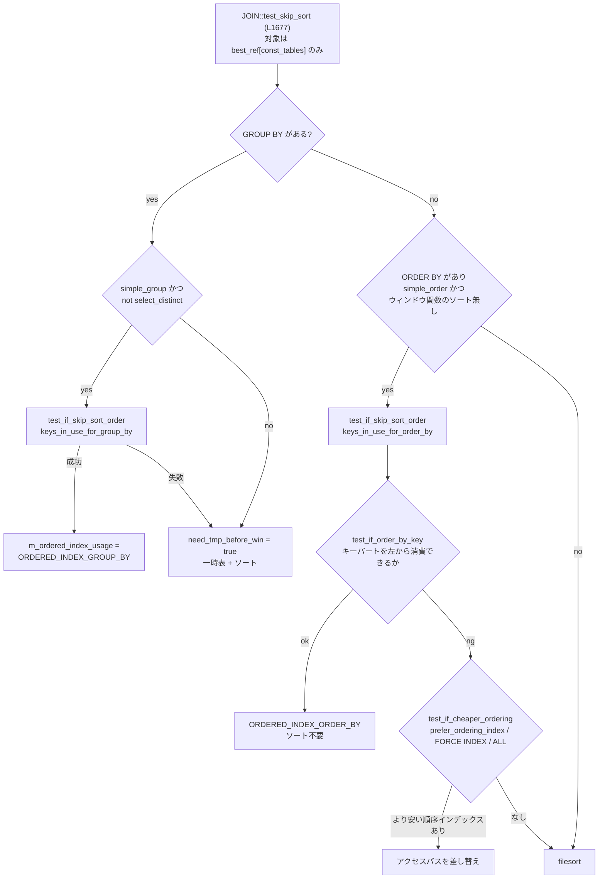

> **前提**: [アクセスパスの選択](./access-path-selection/) / [JOIN::optimize](./optimizer-walkthrough/)

## 何を学んだか

ソートを回避できるのは、次の 2 つが成り立つときだけだ。

1. あるインデックスの並びが、そのまま `ORDER BY` (または `GROUP BY`) の並びになる
2. そのインデックスを使って読むほうが、別の方法で読んでソートするより安い

1 の判定が [`test_if_order_by_key` (`sql/sql_optimizer.cc#L1830`)](https://github.com/mysql/mysql-server/blob/mysql-8.4.11/sql/sql_optimizer.cc#L1830)、2 の判定が [`test_if_cheaper_ordering` (`sql/sql_select.cc#L5131`)](https://github.com/mysql/mysql-server/blob/mysql-8.4.11/sql/sql_select.cc#L5131) にある。両方を束ねるのが [`test_if_skip_sort_order` (`sql/sql_optimizer.cc#L2229`)](https://github.com/mysql/mysql-server/blob/mysql-8.4.11/sql/sql_optimizer.cc#L2229) で、これが `JOIN::optimize` の後半から呼ばれる。

そして**この判定は join 順序が決まった後に、先頭テーブルに対してだけ行われる**。

```cpp title="sql/sql_optimizer.cc (L1677-1680)"
void JOIN::test_skip_sort() {
  DBUG_TRACE;
  ASSERT_BEST_REF_IN_JOIN_ORDER(this);
  JOIN_TAB *const tab = best_ref[const_tables];
```

`best_ref[const_tables]` は「const でない最初のテーブル」だ。**2 番目以降のテーブルのインデックスでソートを省くことはできない。** join の結果は先頭テーブルの順序でしか出てこないからだ。



## なぜそうなっているか

**先頭テーブルしか見ないのは、join の出力順序が先頭テーブルの順序だからだ。** nested loop join では外側のループがそのまま出力順を決める。2 番目のテーブルのインデックス順で出力したければ、そのテーブルを先頭に置くしかない。だが join 順序は既にコストで決まっているので、ここでは動かせない。**「ORDER BY のためにこのテーブルを先頭に持ってくる」という判断は、原理的にこの段ではできない**。

`prune_level = 1` の枝刈り条件に `s->table() == join->sort_by_table` という項目があった ([join 順序のページ](./join-order-search/))。「ソート対象のテーブルが先頭に来る候補は枝刈りしない」という配慮で、順序探索の側から間接的に手当てされている。

**LIMIT があるときにインデックスを乗り換えるのは、「早く止められる」効果がコストモデルに乗らないからだ。** インデックス順に読めば LIMIT 件で打ち切れる。filesort は全行を読まないと 1 件も返せない。この差は通常のコスト計算 (全行を読む前提) では表現できないので、`test_if_cheaper_ordering` という別の推定式が必要になった。式が仮定だらけなのはそのためだ。

**推定式が「無相関」を仮定するのは、相関を知る手段が無いからだ。** `WHERE status = 'pending' ORDER BY created_at LIMIT 10` で、pending の行が古い順に並んでいるのか新しい順に並んでいるのかは、単一列のヒストグラムからは分からない。多変量統計を持たない以上、独立性を仮定するしかない。

**`ORDER BY` に LIMIT が無いときインデックススキャンに乗り換えないのは、経験則だ。** 全行を返すなら、インデックス順に読んでランダムに本体を引くより、順不同で読んで filesort するほうがほぼ常に速い。GROUP BY だけ例外なのは、コメントが認めるとおり合理的な説明がない。

## ソースコードのどこか

### `test_if_order_by_key` — 並びが一致するか

[`sql/sql_optimizer.cc#L1830`](https://github.com/mysql/mysql-server/blob/mysql-8.4.11/sql/sql_optimizer.cc#L1830)。`ORDER BY` の項目を左から順に舐め、インデックスのキーパートを左から順に消費していく。

```cpp title="sql/sql_optimizer.cc (L1847)"
  for (; order; order = order->next, const_key_parts >>= 1) {
    /*
      Since only fields can be indexed, ORDER BY <something> that is
      not a field cannot be resolved by using an index.
    */
    Item *real_itm = (*order->item)->real_item();
    if (real_itm->type() != Item::FIELD_ITEM) return 0;

    const Field *field = down_cast<const Item_field *>(real_itm)->field;

    /*
      Skip key parts that are constants in the WHERE clause if these are
      already removed in the ORDER expression by check_field_is_const().
      ...
    */
    for (; const_key_parts & 1 && key_part < key_part_end &&
           (order_src->is_const_optimized() || key_part->field != field);
         const_key_parts >>= 1) {
      key_part++;
    }
```

読み取れる制約が 4 つある。

1. **`ORDER BY` の項目が `Item_field` でなければ即失敗。** `ORDER BY UPPER(name)` や `ORDER BY a + b` はインデックスで解決できない
2. **WHERE で定数に固定されたキーパートは飛ばせる。** `WHERE a = 1 ORDER BY b` はインデックス `(a, b)` で解決できる。これが `const_key_parts`
3. **飛ばせるのは定数のキーパートだけ。** `(a, b, c)` に対して `ORDER BY a, c` は、`b` が定数でない限り失敗する

```cpp title="sql/sql_optimizer.cc (L1914)"
    if (key_part->field != field || !field->part_of_sortkey.is_set(idx))
      return 0;
    if (order->direction != ORDER_NOT_RELEVANT) {
      const enum_order keypart_order =
          (key_part->key_part_flag & HA_REVERSE_SORT) ? ORDER_DESC : ORDER_ASC;
      /* set flag to 1 if we can use read-next on key, else to -1 */
      const int cur_scan_dir = (order->direction == keypart_order) ? 1 : -1;
      if (reverse && cur_scan_dir != reverse) return 0;
      reverse = cur_scan_dir;  // Remember if reverse
    }
```

4. **方向が混ざると失敗する。** `ORDER BY a ASC, b DESC` は、インデックスが `(a ASC, b ASC)` なら `cur_scan_dir` が途中で変わって `return 0` になる。8.0 以降は降順インデックス (`KEY (a ASC, b DESC)`) を作れるので、これで対応できる。

`part_of_sortkey` のチェックも見逃せない。**プレフィクスインデックス (`KEY (name(10))`) は `part_of_sortkey` に入らない**ので、ソートには使えない。

さらに、末尾には InnoDB 向けの特別扱いがある。

```cpp title="sql/sql_optimizer.cc (L1880)"
      if (!on_pk_suffix &&
          (table->file->ha_table_flags() & HA_PRIMARY_KEY_IN_READ_INDEX) &&
          table->s->primary_key != MAX_KEY && table->s->primary_key != idx) {
        on_pk_suffix = true;
        key_part = table->key_info[table->s->primary_key].key_part;
```

セカンダリインデックスのキーパートを使い切ったら、**主キーのキーパートを続きとして使う**。`KEY (status)` で `ORDER BY status, id` (id が PK) がソート無しになるのはこれだ ([セカンダリインデックスのページ](./secondary-index/))。

### `test_if_cheaper_ordering` — LIMIT があるときの乗り換え

並びが一致するインデックスが見つかっても、それが現在のプランのインデックスとは限らない。`ORDER BY ... LIMIT` では「順序を与えるインデックスに乗り換えたほうが安い」ことがある。その判定が [`test_if_cheaper_ordering` (`sql/sql_select.cc#L5131`)](https://github.com/mysql/mysql-server/blob/mysql-8.4.11/sql/sql_select.cc#L5131) だ。

呼ばれる条件は 3 つのうちどれか ([`sql/sql_optimizer.cc#L2487`](https://github.com/mysql/mysql-server/blob/mysql-8.4.11/sql/sql_optimizer.cc#L2487))。

```cpp title="sql/sql_optimizer.cc"
    // We try to find an ordering_index alternative over the chosen plan, if:
    // 1. "prefer_ordering_index" switch is on or
    // 2. Force index for order/group is specified or
    // 3. Optimizer has chosen to do table scan currently.
    if (thd->optimizer_switch_flag(OPTIMIZER_SWITCH_PREFER_ORDERING_INDEX) ||
        is_force_index || ref_key == -1)
      test_if_cheaper_ordering(tab, &order, table, usable_keys, ref_key_hint,
                               select_limit, &best_key, &best_key_direction,
                               &select_limit, &best_key_parts,
                               &saved_best_key_parts, &best_read_time);
```

`prefer_ordering_index` は既定 ON なので、実質いつも呼ばれる。

中では全インデックスを舐めて、「LIMIT 件を得るために何行読むか」を推定する。推定は 3 段の補正でできている ([L5215 以降](https://github.com/mysql/mysql-server/blob/mysql-8.4.11/sql/sql_select.cc#L5215))。

**(a) GROUP BY なら 1 グループ 1 行なので、`rec_per_key` 倍する。**

```cpp title="sql/sql_select.cc (L5237)"
          if (select_limit > table_records / rec_per_key)
            select_limit = table_records;
          else
            select_limit = (ha_rows)(select_limit * rec_per_key);
```

**(b) 後続テーブルの fanout で割る。** コメントが自らの弱点を書いている。

```cpp title="sql/sql_select.cc (L5242-5251)"
          If tab=tk is not the last joined table tn then to get first
          L records from the result set we can expect to retrieve
          only L/fanout(tk,tn) where fanout(tk,tn) says how many
          rows in the record set on average will match each row tk.
          Usually our estimates for fanouts are too pessimistic.
          So the estimate for L/fanout(tk,tn) will be too optimistic
          and as result we'll choose an index scan when using ref/range
          access + filesort will be cheaper.
```

**(c) WHERE 条件の選択率で割る。**

```cpp title="sql/sql_select.cc (L5274)"
        if (select_limit > refkey_rows_estimate)
          select_limit = table_records;
        else if (table_records >= refkey_rows_estimate)
          select_limit = (ha_rows)(select_limit * (double)table_records /
                                   refkey_rows_estimate);
```

「`ORDER BY` のインデックスと WHERE の条件は無相関」という仮定が明記されている。`refkey_rows_estimate` 行が条件を満たすなら、選択率は `refkey_rows_estimate / table_records`。だから LIMIT L 件を得るには `L / 選択率` 行を読む、という計算だ。

補正した `select_limit` からスキャンコストを出して比較する。

```cpp title="sql/sql_select.cc (L5293-5309)"
        const Cost_estimate table_scan_time = table->file->table_scan_cost();
        const double index_scan_time =
            select_limit / rec_per_key *
            min<double>(table->file->page_read_cost(nr, rec_per_key),
                        table_scan_time.total_cost());
        ...
        if (((cur_access_method == JT_ALL ||
              cur_access_method == JT_INDEX_SCAN) &&
             (is_covering || group || table->force_index_order)) ||
            index_scan_time < read_time) {
```

**この (c) の仮定が、ページネーションが遅くなる現象の震源だ。** 「WHERE の条件と ORDER BY の列が無相関」という仮定が崩れると、推定が桁で外れる。

もう 1 つ、`ORDER BY` に LIMIT が無い場合の非対称な扱いがコメントで告白されている。

```cpp title="sql/sql_select.cc (L5206-5214)"
      /*
        Don't use an index scan with ORDER BY without limit.
        For GROUP BY without limit always use index scan
        if there is a suitable index.
        Why we hold to this asymmetry hardly can be explained
        rationally. It's easy to demonstrate that using
        temporary table + filesort could be cheaper for grouping
        queries too.
      */
      if (is_covering || select_limit != HA_POS_ERROR ||
          (ref_key < 0 && (group || table->force_index_order))) {
```

**`ORDER BY` に LIMIT が無ければインデックススキャンには乗り換えない。ただし `GROUP BY` なら LIMIT が無くても乗り換える。** 「合理的に説明しがたい」と書いてある。

### GROUP BY / DISTINCT を消す

[`JOIN::optimize_distinct_group_order` (`sql/sql_optimizer.cc#L1490`)](https://github.com/mysql/mysql-server/blob/mysql-8.4.11/sql/sql_optimizer.cc#L1490) は、ソートの前段で「そもそもグループ化が要らない」ケースを潰す。

```cpp title="sql/sql_optimizer.cc (L1539-1556)"
  if (plan_is_single_table() && (!group_list.empty() || select_distinct) &&
      !tmp_table_param.sum_func_count &&
      (!tab->range_scan() ||
       tab->range_scan()->type != AccessPath::GROUP_INDEX_SKIP_SCAN)) {
    if (!group_list.empty() && rollup_state == RollupState::NONE &&
        list_contains_unique_index(tab, find_field_in_order_list,
                                   (void *)group_list.order)) {
      /*
        We have found that grouping can be removed since groups correspond to
        only one row anyway.
      */
      group_list.clean();
      grouped = false;
    }
    if (select_distinct &&
        list_contains_unique_index(tab, find_field_in_item_list, fields)) {
      select_distinct = false;
```

**GROUP BY / DISTINCT の列が UNIQUE インデックスの全キーパートを含んでいれば、グループ化は無意味なので消す。** ただし条件が厳しい — 単一テーブル、集約関数なし、NULL 不可の UNIQUE。

同じ関数が `ORDER BY` の定数項目も落とす (`remove_const`)。`ORDER BY 1` や `WHERE a = 5 ORDER BY a` の `a` はここで消える。定数が落ちた結果 `ORDER BY` が空になれば `skip_sort_order = true` になる。

さらに **DISTINCT を GROUP BY に書き換える**変換もここにある (`create_order_from_distinct`)。LIMIT があるときは変換しない、とコメントに書いてある。

### MIN / MAX の畳み込み

`ORDER BY` すら不要になる極端なケースが [`optimize_aggregated_query` (`sql/opt_sum.cc#L277`)](https://github.com/mysql/mysql-server/blob/mysql-8.4.11/sql/opt_sum.cc#L277) だ。GROUP BY のない `MIN()` / `MAX()` は、インデックスの端を 1 回読むだけで答えが出る。

```cpp title="sql/opt_sum.cc"
  Second, the function walks over all expressions in the SELECT list.
  If the expression can be optimized with a storage engine operation that
  is O(1) (MIN or MAX) or O(0) (instant COUNT), the value is looked up
  and inserted in the value buffer, and the corresponding Item is marked
  as being const.
```

`SELECT MAX(created_at) FROM t` が `Select tables optimized away` になるのはこれで、`ORDER BY created_at DESC LIMIT 1` とは別経路である ([JOIN::optimize のページ](./optimizer-walkthrough/))。

### loose index scan

`GROUP BY` にインデックスが使えるもう 1 つの形が loose index scan で、これは range 最適化の側にある ([`group_index_skip_scan_plan.cc`](https://github.com/mysql/mysql-server/blob/mysql-8.4.11/sql/range_optimizer/group_index_skip_scan_plan.cc)、1883 行)。インデックスを頭から舐めるのではなく、**グループの境界だけを飛び石で読む**。`EXPLAIN` には `Using index for group-by` と出る。

`test_skip_sort` はこれを検出して、通常のソート回避判定をスキップする。

```cpp title="sql/sql_optimizer.cc (L1696)"
    if (!(query_block->active_options() & SELECT_BIG_RESULT || with_json_agg) ||
        (tab->range_scan() &&
         tab->range_scan()->type == AccessPath::GROUP_INDEX_SKIP_SCAN) ||
        contains_non_aggregated_fts()) {
```

## どう活かすか

### `Using filesort` が出る条件を切り分ける

| 原因                                 | 確認方法                                      | 対処                                              |
| ------------------------------------ | --------------------------------------------- | ------------------------------------------------- |
| `ORDER BY` の項目が式や関数          | `test_if_order_by_key` が `Item_field` を要求 | 生成列にインデックスを張る                        |
| キーパートが左から連続していない     | `(a,b,c)` に `ORDER BY a, c`                  | `b` を WHERE で固定するか、インデックスを作り直す |
| 昇順降順が混在                       | `ORDER BY a ASC, b DESC`                      | 降順インデックス `KEY (a ASC, b DESC)`            |
| プレフィクスインデックス             | `KEY (name(10))`                              | 完全長のインデックス                              |
| join の 2 番目以降のテーブルでソート | EXPLAIN で `Using filesort` が出る行を見る    | join 順序を `STRAIGHT_JOIN` で固定                |
| join buffer を使っている             | `Using join buffer` が併記される              | `setup_join_buffering` が `simple_order` を落とす |

最後の行は見落としやすい。[JOIN::optimize のページ](./optimizer-walkthrough/) で見たとおり、join buffer を使うテーブルがあると `simple_order = simple_group = false` にされ、ソート回避の判定に入る前に諦める。**hash join が選ばれると ORDER BY のインデックスが使えなくなる**、という連鎖が起きる。

### ページネーションの `ORDER BY ... LIMIT`

`WHERE status = 'x' ORDER BY created_at LIMIT 20` の典型的な失敗はこうだ。

1. `(status)` インデックスで絞れば 100 行に減る。filesort しても速い
2. だが `test_if_cheaper_ordering` は「`(created_at)` を順に読めば、選択率から見て `20 / (100/1000000) = 200000` 行くらい読めば 20 件見つかる」…ではなく、**`select_limit * table_records / refkey_rows_estimate` という式で膨らませた値**を使ってスキャンコストを見積もる
3. 推定が甘い方向に外れると `(created_at)` のインデックススキャンが選ばれ、`status = 'x'` の行が末尾に固まっていた場合、**テーブルをほぼ全部舐める**

症状は「1 ページ目は速いのに深いページで遅い」「データが増えたらある日突然遅くなった」だ。手は 3 つある。

- **`/*+ NO_ORDER_INDEX(t) */`** — このテーブルの ORDER BY 用インデックス候補を消す。8.0 以降の推奨手
- **`/*+ SET_VAR(optimizer_switch='prefer_ordering_index=off') */`** — `test_if_cheaper_ordering` の呼び出し条件 1 を落とす。ただし条件 3 (`ref_key == -1`、フルスキャン中) では依然として呼ばれる
- **seek 法 (keyset pagination)** — `WHERE (created_at, id) > (?, ?) ORDER BY created_at, id LIMIT 20`。OFFSET を捨てれば、ソート回避と早期打ち切りが両立する

`prefer_ordering_index` は 8.0.21 で追加された。それ以前は無条件でこの乗り換えが行われていたので、古い環境ではヒントも効かない。

### 複合インデックスの設計

ソート回避を狙うなら、インデックスの列順はこうなる。

```
KEY (等価条件で使う列..., ORDER BY の列...)
```

`WHERE a = ? AND b = ? ORDER BY c` なら `(a, b, c)`。`const_key_parts` が `a` と `b` を飛ばし、`c` からソート順として消費される。

**範囲条件を挟むと崩れる。** `WHERE a = ? AND b > ? ORDER BY c` では、`(a, b, c)` の `b` が範囲なので `c` の並びは保証されない。この場合は `(a, c)` にして `b` をフィルタで落とすほうが、ソートを消せるぶん有利なことがある。どちらが速いかはデータ次第なので、両方作って `FORCE INDEX` で比べるのが早い。

### `Using index for group-by` を狙う

loose index scan は「`GROUP BY` の列がインデックスの先頭にあり、集約が `MIN` / `MAX` / `COUNT(DISTINCT)` のいずれか」といった強い条件を満たすときだけ選ばれる。効くと**グループ数ぶんしか読まない**ので効果は大きい。EXPLAIN に `Using index for group-by` が出るかどうかで確認する。

`SELECT_BIG_RESULT` (`SQL_BIG_RESULT`) を付けると `test_skip_sort` の分岐が変わり、GROUP BY にインデックスを使わず一時表 + filesort に倒す。グループ数が非常に多いときの逃げ道として用意されている ([filesort のページ](./filesort/))。
