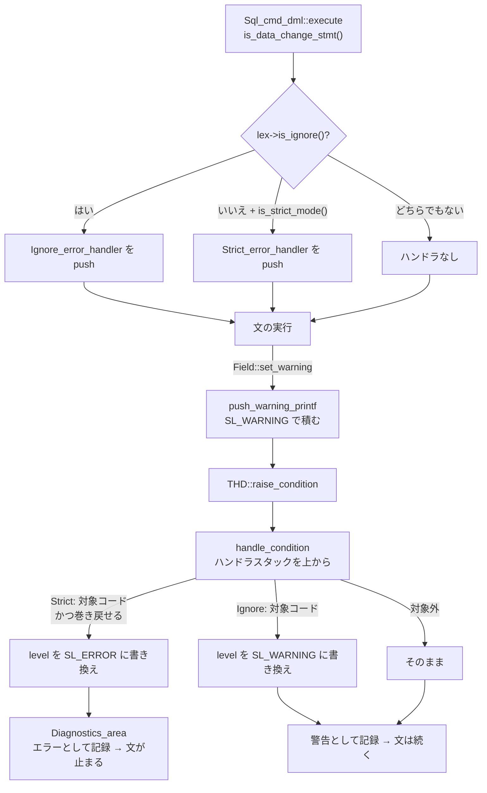

> **前提**: [型と Field クラス](./field-and-types/)

## 何を学んだか

前のページで見たとおり、`Field` の側は警告を積むだけで、`my_error` を呼ばない。`Data truncated for column 'i' at row 1` が**警告として返るかエラーとして返るかを決めているのは、文の実行前に `THD` へ積まれた 1 個のハンドラ**だ。

```cpp title="sql/error_handler.h"
/**
  This internal handler implements upgrade from SL_WARNING to SL_ERROR
  for the error codes affected by STRICT mode. Currently STRICT mode does
  not affect SELECT statements.
*/

class Strict_error_handler : public Internal_error_handler {
```

[`sql/error_handler.h#L269`](https://github.com/mysql/mysql-server/blob/mysql-8.4.11/sql/error_handler.h#L269)。厳格モードの実装はこのクラス 1 個で全部だ。

- **厳格モードは条件分岐ではなくフィルタとして実装されている。** 積まれた警告が診断エリアに入る前に横取りして、深刻度だけを書き換える
- **昇格されるエラーコードは列挙されている。** 22 個の `case` に載っていない警告は、厳格モードでも警告のまま
- **`INSERT IGNORE` は逆向きの同じ仕組みだ。** `Ignore_error_handler` が特定のエラーを警告に落とす。両者は排他で、`IGNORE` があれば厳格ハンドラは積まれない
- **`STRICT_TRANS_TABLES` と `STRICT_ALL_TABLES` の差は「その文がまだ安全にロールバックできるか」**。文の途中で非トランザクショナルな変更が済んでいると、前者は昇格をやめる
- **オプティマイザの定数変換は、`sql_mode` から厳格ビットを一時的に外して実行する。** だから `WHERE d = '2020-01-99'` の比較準備では警告が出ない



## なぜそうなっているか

**ハンドラにしたのは、同じ変換コードを 3 通りの厳しさで動かすためだ。** `Field` の派生は 40 種類あり、その中の変換分岐は数百か所ある。もし各所で `sql_mode` を見て `my_error` と `push_warning` を切り替えていたら、`IGNORE` を足すときに同じ数の分岐をもう一度書くことになる。深刻度の書き換えを 1 か所に集めれば、変換コードは「気付いたことを警告として報告する」だけを担当できる。

**昇格対象をコードで列挙したのは、厳格モードが「全部の警告をエラーにする」ものではないからだ。** 型変換に関わる警告だけを対象にし、それ以外 (たとえばインデックスヒントが解決できなかった警告) は警告のまま残す。列挙されたコードを読むと、厳格モードの定義がそのまま書いてある。

**`STRICT_TRANS_TABLES` が途中で降りるのは、部分適用を避けられないときに文を殺しても意味がないからだ。** 非トランザクショナルなテーブルに 3 行目まで書き終わったあと 4 行目でエラーを返しても、書いた 3 行は戻らない。それなら警告にして最後まで進み、`Warning` を数えて返したほうが状態が分かりやすい。`STRICT_ALL_TABLES` はこの妥協をせず、常に昇格する。

**定数変換で厳格ビットを外すのは、実行していない値の変換で文を殺さないためだ。** オプティマイザは `WHERE date_col = '2020-01-99'` を最適化するとき、右辺を日付として解釈できるか試す。この試行が厳格モードでエラーになると、まだ 1 行も読んでいないのに文が失敗する。

## ソースコードのどこか

### 昇格の本体 — `Strict_error_handler::handle_condition`

```cpp title="sql/error_handler.cc"
bool Strict_error_handler::handle_condition(
    THD *thd, uint sql_errno, const char *,
    Sql_condition::enum_severity_level *level, const char *) {
  ...
  if (!thd->is_strict_mode()) return false;
  /* STRICT MODE should affect only the below statements */
  switch (thd->lex->sql_command) {
    case SQLCOM_SET_OPTION:
    case SQLCOM_SELECT:
      if (m_set_select_behavior == DISABLE_SET_SELECT_STRICT_ERROR_HANDLER)
        return false;
    case SQLCOM_CREATE_TABLE:
    ...
    case SQLCOM_UPDATE:
    case SQLCOM_LOAD:
    case SQLCOM_CALL:
    case SQLCOM_END:
      break;
    default:
      return false;
  }
```

[`sql/error_handler.cc#L155`](https://github.com/mysql/mysql-server/blob/mysql-8.4.11/sql/error_handler.cc#L155)。**`level` がポインタ渡しになっている**のがこの仕組みの要で、ハンドラは条件を握り潰すか (`return true`)、深刻度を書き換えて通すか (`*level` を変えて `return false`) を選べる。厳格モードは後者を使う。

冒頭で `thd->is_strict_mode()` をもう一度見ているのは、ハンドラを積んだあとにストアドプログラムが `sql_mode` を変えた場合への対策だとコメントに書かれている。

昇格対象のコードはこの一覧だ。

```cpp title="sql/error_handler.cc"
  switch (sql_errno) {
    case ER_TRUNCATED_WRONG_VALUE:
    case ER_WRONG_VALUE_FOR_TYPE:
    case ER_WARN_DATA_OUT_OF_RANGE:
    case ER_WARN_DATA_OUT_OF_RANGE_FUNCTIONAL_INDEX:
    case ER_DIVISION_BY_ZERO:
    case ER_TRUNCATED_WRONG_VALUE_FOR_FIELD:
    case WARN_DATA_TRUNCATED:
    case ER_WARN_DATA_TRUNCATED_FUNCTIONAL_INDEX:
    case ER_DATA_TOO_LONG:
    case ER_BAD_NULL_ERROR:
    case ER_NO_DEFAULT_FOR_FIELD:
    case ER_TOO_LONG_KEY:
    case ER_NO_DEFAULT_FOR_VIEW_FIELD:
    case ER_WARN_NULL_TO_NOTNULL:
    case ER_CUT_VALUE_GROUP_CONCAT:
    case ER_DATETIME_FUNCTION_OVERFLOW:
    case ER_WARN_TOO_FEW_RECORDS:
    case ER_WARN_TOO_MANY_RECORDS:
    case ER_INVALID_ARGUMENT_FOR_LOGARITHM:
    case ER_NUMERIC_JSON_VALUE_OUT_OF_RANGE:
    case ER_INVALID_JSON_VALUE_FOR_CAST:
    case ER_WARN_ALLOWED_PACKET_OVERFLOWED:
      if ((*level == Sql_condition::SL_WARNING) &&
          (!thd->get_transaction()->cannot_safely_rollback(
               Transaction_ctx::STMT) ||
           (thd->variables.sql_mode & MODE_STRICT_ALL_TABLES))) {
        (*level) = Sql_condition::SL_ERROR;
      }
      break;
```

[`sql/error_handler.cc#L195`](https://github.com/mysql/mysql-server/blob/mysql-8.4.11/sql/error_handler.cc#L195)。**`cannot_safely_rollback(STMT)` が `STRICT_TRANS_TABLES` と `STRICT_ALL_TABLES` の唯一の違い**になる。この述語は「この文が非トランザクショナルな変更を既にしたか」を返すので、InnoDB だけを使っている限り常に false で、2 つのモードに差はない。

`ER_TOO_LONG_KEY` が入っているのが面白い。`CREATE INDEX` でキー長が上限を超えたとき、非厳格モードでは**警告を出してプレフィックスに切り詰めたインデックスが作られる**。厳格モードならエラーになる。

### 積む場所 — `Sql_cmd_dml`

厳格ハンドラと `IGNORE` ハンドラは同じ場所で排他的に積まれる。

```cpp title="sql/sql_select.cc"
  if (is_data_change_stmt()) {
    // Push ignore / strict error handler
    if (lex->is_ignore()) {
      thd->push_internal_handler(&ignore_handler);
      error_handler_active = true;
      ...
    } else if (thd->is_strict_mode()) {
      thd->push_internal_handler(&strict_handler);
      error_handler_active = true;
    }
  }
```

[`Sql_cmd_dml::execute` (`sql/sql_select.cc#L676`)](https://github.com/mysql/mysql-server/blob/mysql-8.4.11/sql/sql_select.cc#L676)。**`is_data_change_stmt()` が条件なので、`SELECT` にはどちらも積まれない**。ヘッダのコメントの「STRICT mode does not affect SELECT statements」はこの意味だ。`SELECT 1/0` が厳格モードでも警告で済むのはこれによる。

`Sql_cmd_dml::prepare` にも同じブロックがあり、こちらは準備時の定数畳み込みで出る警告を拾う。

```cpp title="sql/sql_select.cc"
  /*
    Constant folding could cause warnings during preparation. Make
    sure they are promoted to errors when strict mode is enabled.
  */
  if (is_data_change_stmt() && needs_explicit_preparation()) {
```

[`sql/sql_select.cc#L490`](https://github.com/mysql/mysql-server/blob/mysql-8.4.11/sql/sql_select.cc#L490)。

### 逆向き — `Ignore_error_handler`

```cpp title="sql/error_handler.cc"
  switch (sql_errno) {
    case ER_SUBQUERY_NO_1_ROW:
    case ER_ROW_IS_REFERENCED_2:
    case ER_NO_REFERENCED_ROW_2:
    case ER_NO_REFERENCED_ROW:
    case ER_ROW_IS_REFERENCED:
    case ER_BAD_NULL_ERROR:
    case ER_DUP_ENTRY:
    case ER_DUP_ENTRY_WITH_KEY_NAME:
    case ER_DUP_KEY:
    case ER_VIEW_CHECK_FAILED:
    case ER_NO_PARTITION_FOR_GIVEN_VALUE:
    case ER_NO_PARTITION_FOR_GIVEN_VALUE_SILENT:
    case ER_ROW_DOES_NOT_MATCH_GIVEN_PARTITION_SET:
    case ER_CHECK_CONSTRAINT_VIOLATED:
      (*level) = Sql_condition::SL_WARNING;
      break;
```

[`sql/error_handler.cc#L73`](https://github.com/mysql/mysql-server/blob/mysql-8.4.11/sql/error_handler.cc#L73)。`INSERT IGNORE` が黙らせるのはこの 14 個だけだ。**外部キー違反 (`ER_NO_REFERENCED_ROW_2` / `ER_ROW_IS_REFERENCED_2`) と CHECK 制約違反も含まれている**ので、`IGNORE` を付けると参照整合性の違反まで警告になる ([外部キー](./foreign-keys/))。「重複だけ無視したい」つもりで `INSERT IGNORE` を書くと、想定より広い範囲が黙る。

### 一時的に外す — `save_in_field_no_warnings`

```cpp title="sql/item.cc"
  thd->variables.sql_mode &=
      ~(MODE_NO_ZERO_IN_DATE | MODE_NO_ZERO_DATE | MODE_STRICT_ALL_TABLES |
        MODE_STRICT_TRANS_TABLES);
  thd->check_for_truncated_fields = CHECK_FIELD_IGNORE;

  const type_conversion_status res = save_in_field(field, no_conversions);
```

[`Item::save_in_field_no_warnings` (`sql/item.cc#L1812`)](https://github.com/mysql/mysql-server/blob/mysql-8.4.11/sql/item.cc#L1812)。`sql_mode` そのものを一時的に書き換えている。コメントによれば、以前は `THD::abort_on_warning` という専用フラグでやっていたのを、フラグの削除に伴ってこの形にしたとある。

オプティマイザが定数を列の型に合わせるとき (`convert_constant_item`) はこの経路を通るので、**準備段階の変換は厳格モードの影響を受けない**。

### `sql_mode` の既定値と展開

```cpp title="sql/sys_vars.cc"
static Sys_var_set Sys_sql_mode(
    "sql_mode",
    ...
    DEFAULT(MODE_NO_ENGINE_SUBSTITUTION | MODE_ONLY_FULL_GROUP_BY |
            MODE_STRICT_TRANS_TABLES | MODE_NO_ZERO_IN_DATE |
            MODE_NO_ZERO_DATE | MODE_ERROR_FOR_DIVISION_BY_ZERO),
```

[`sql/sys_vars.cc#L4797`](https://github.com/mysql/mysql-server/blob/mysql-8.4.11/sql/sys_vars.cc#L4797)。既定に含まれるのは `STRICT_TRANS_TABLES` のほうで、`STRICT_ALL_TABLES` ではない。

`TRADITIONAL` は展開されるエイリアスにすぎない。

```cpp title="sql/sys_vars.cc"
  if (sql_mode & MODE_TRADITIONAL)
    sql_mode |= (MODE_STRICT_TRANS_TABLES | MODE_STRICT_ALL_TABLES |
                 MODE_NO_ZERO_IN_DATE | MODE_NO_ZERO_DATE |
                 MODE_ERROR_FOR_DIVISION_BY_ZERO | MODE_NO_ENGINE_SUBSTITUTION);
```

[`expand_sql_mode` (`sql/sys_vars.cc#L4674`)](https://github.com/mysql/mysql-server/blob/mysql-8.4.11/sql/sys_vars.cc#L4674)。既定との差は `STRICT_ALL_TABLES` が加わることだけで、InnoDB しか使っていなければ差は出ない。

厳格モードのサブモードを中途半端に設定すると警告が出る仕掛けもある。

```cpp title="sql/sys_vars.cc"
  if (((strict_modes_set | new_strict_submodes_set) != 0) &&
      ((new_strict_submodes_set != new_strict_submodes) ||
       (strict_modes_set == 0))) {
    if (thd)
      push_warning(thd, Sql_condition::SL_WARNING, ER_SQL_MODE_MERGED,
                   ER_THD(thd, ER_SQL_MODE_MERGED));
```

[`check_sub_modes_of_strict_mode` (`sql/sys_vars.cc#L4652`)](https://github.com/mysql/mysql-server/blob/mysql-8.4.11/sql/sys_vars.cc#L4652)。`NO_ZERO_DATE` / `NO_ZERO_IN_DATE` / `ERROR_FOR_DIVISION_BY_ZERO` の 3 つは厳格モードとセットで使う前提になっていて、一部だけ設定すると `ER_SQL_MODE_MERGED` が出る。

## どう活かすか

### `sql_mode` はセッション変数なので、接続プールで揃わないことがある

`sql_mode` は `SESSION_VAR` だ。接続時の既定はグローバル値だが、アプリやドライバが接続後に `SET sql_mode = ...` を投げていれば、その接続だけ違う挙動になる。プールが接続を使い回す環境では、**同じアプリの同じクエリが接続によって成功したり失敗したりする**という形で出る ([コネクションプールとセッション状態](./connection-pool-and-session-state/))。

疑ったら `SELECT @@session.sql_mode, @@global.sql_mode` を並べて比べる。

### `INSERT IGNORE` は思ったより広く黙らせる

`Ignore_error_handler` の一覧を見るとおり、`IGNORE` は重複キーだけでなく外部キー違反・CHECK 制約違反・`NOT NULL` 違反 (`ER_BAD_NULL_ERROR`) も警告に落とす。「重複だけスキップしたい」なら `INSERT ... ON DUPLICATE KEY UPDATE` か `INSERT IGNORE` の後に `SHOW WARNINGS` を確認する運用が要る。

`UPDATE ... IGNORE` はさらに危ない。型変換の失敗も黙るので、**更新されるはずの値が切り詰められて入る**。

### 厳格モードは `SELECT` には効かない

`SELECT 1/0` は厳格モードでも `NULL` + 警告になる。`Sql_cmd_dml::execute` が `is_data_change_stmt()` でしか厳格ハンドラを積まないからだ。「厳格モードにしたのに 0 除算がエラーにならない」という混乱はここから来る。

例外があって、ストアドプログラムから呼ばれる `SET` や `SELECT` には `ENABLE_SET_SELECT_STRICT_ERROR_HANDLER` 付きでハンドラが積まれる ([トリガとストアドプログラム](./triggers-and-stored-programs/))。同じ `SELECT` が、直接実行とストアドプログラム経由で挙動が変わりうる。

### 非厳格モードで運用しているなら、`ER_TOO_LONG_KEY` を確認する

昇格対象に `ER_TOO_LONG_KEY` が入っているということは、**非厳格モードでは長すぎるインデックスが警告付きで切り詰められて作られる**ということだ。マイグレーションが「成功した」のに、意図したユニーク制約がプレフィックスだけの制約になっている可能性がある。

`SHOW CREATE TABLE` でキーの後ろに `(255)` のような長さが付いていないかを見る。

### 一般化して持ち帰るもの

**「報告する層」と「深刻度を決める層」を分ける**というのがこの設計の骨子だ。変換コードは事実 (切り詰めた・範囲外だった) だけを報告し、それがエラーかどうかは文脈が決める。同じ形は、ロギングのレベル設計や、バリデーション結果の扱いでもそのまま使える。

条件ハンドラをスタックで持ち、`level` をポインタで渡して書き換え可能にした点も効いている。これがあるから `IGNORE` という逆向きの要求を、既存コードを 1 行も変えずに足せた。
