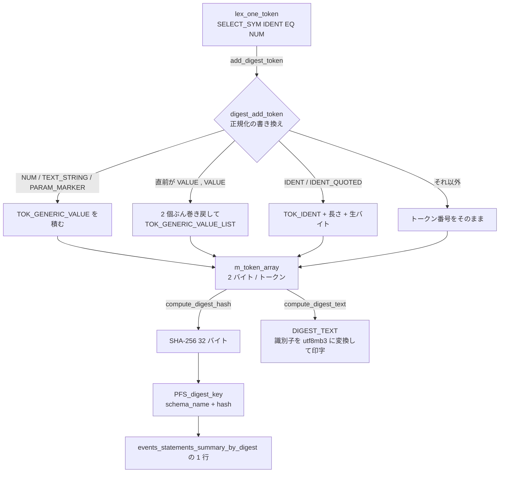

> **前提**: [パーサとリゾルバ](./parser-walkthrough/)

## 何を学んだか

`performance_schema.events_statements_summary_by_digest` を見ると、`SELECT * FROM t WHERE id = ?` のような正規化されたクエリと、その実行回数・合計時間が並んでいる。この「正規化」は、パースが終わった `Query_block` を印字し直しているわけではない。

**ダイジェストはレキサの中で、トークンが 1 個出るたびに作られる。**

```cpp title="sql/sql_lex.cc (my_sql_parser_lex の末尾)"
  yylloc->cpp.end = lip->get_cpp_ptr();
  yylloc->raw.end = lip->get_ptr();
  if (!lip->skip_digest) lip->add_digest_token(token, yylval);
  lip->skip_digest = false;
  return token;
```

貯まるのは「トークン番号を 2 バイトずつ並べたバイト列」で、リテラルは並べる直前に `?` を表す疑似トークンに置き換えられる。文の終わりに、そのバイト列を SHA-256 に通したものがダイジェストになる。

この設計から、直感に反する性質がいくつも出てくる。

- **構文エラーになった文でもダイジェストは作られる。** パースの成否と無関係にトークンは流れる
- **`max_digest_length` (既定 1024 バイト) を超えると、そこで黙って打ち切られる。** 前半が同じ長いクエリは全部同じダイジェストになる
- **正規化は文法ではなくトークン列の書き換えで行われる。** `IN (1,2,3)` と `IN (1,...,1000)` が同じ `IN (...)` に潰れるのは、パーサではなくこの書き換え規則の仕事
- **識別子はクライアント文字セットの生バイトのまま入る。** 同じ見た目のクエリでも `character_set_client` が違えば別のダイジェストになりうる



## なぜそうなっているか

**パース木ではなくトークン列を使うのは、失敗した文も数えたいからだ。** 構文エラーになるクエリが大量に来ているとき、それを `events_statements_summary_by_digest` で見つけられなければ意味がない。トークン列なら、パーサが `syntax error` を返す直前まで積まれたぶんがそのまま指紋になる。

**巻き戻し方式の正規化を選んだのは、レキサを 1 パスで回すためだ。** 「`IN` の後ろの括弧の中身」を知るには文法が要る。しかしレキサは 1 トークンずつしか見ていない。そこで「直前 2 トークンを覗いて、当てはまったら積んだぶんを消す」という後追いの書き換えにした。バイト列上の操作なので、消すのは `m_byte_count` を減らすだけで済む。

**切り詰めを黙って行うのは、ダイジェスト計算をクエリ実行の失敗要因にしないためだ。** 上限を超えたらエラーにする設計もありえたが、観測のための機能がアプリケーションを止めては本末転倒になる。代わりに `m_full` を立てて静かに諦め、`Performance_schema_digest_lost` のようなカウンタで別途知らせる。

**スキーマ名をキーに含めるのは、同名テーブルを区別するためだ。** ダイジェストのトークン列には `FROM users` の `users` しか入っていない。どのスキーマの `users` かは、実行時のデフォルトスキーマにしか書いていない。

## ソースコードのどこか

### 起動 — `dispatch_sql_command` と `parse_sql`

フラグを立てるのは [`dispatch_sql_command`](https://github.com/mysql/mysql-server/blob/mysql-8.4.11/sql/sql_parse.cc#L5275)。

```cpp title="sql/sql_parse.cc"
  // we produce digest if it's not explicitly turned off
  // by setting maximum digest length to zero
  if (get_max_digest_length() != 0)
    parser_state->m_input.m_compute_digest = true;
```

実際にレキサへリスナを刺すのは [`parse_sql`](https://github.com/mysql/mysql-server/blob/mysql-8.4.11/sql/sql_parse.cc#L7118)。

```cpp title="sql/sql_parse.cc"
    if (thd->m_digest != nullptr) {
      /* Start Digest */
      parser_state->m_digest_psi = MYSQL_DIGEST_START(thd->m_statement_psi);

      if (parser_state->m_input.m_compute_digest ||
          (parser_state->m_digest_psi != nullptr)) {
        /*
          If either:
          - the caller wants to compute a digest
          - the performance schema wants to compute a digest
          set the digest listener in the lexer.
        */
        parser_state->m_lip.m_digest = thd->m_digest;
        parser_state->m_lip.m_digest->m_digest_storage.m_charset_number =
            thd->charset()->number;
      }
    }
```

**`character_set_client` の番号がここで記録される。** ただしこの番号がハッシュに混ざるわけではない (後述)。

`Lex_input_stream::m_digest` が `nullptr` かどうかだけで、レキサ側は分岐する。

```cpp title="sql/sql_lex.cc"
void Lex_input_stream::add_digest_token(uint token, Lexer_yystype *yylval) {
  if (m_digest != nullptr) {
    m_digest = digest_add_token(m_digest, token, yylval);
  }
}
```

[`sql/sql_lex.cc#L374`](https://github.com/mysql/mysql-server/blob/mysql-8.4.11/sql/sql_lex.cc#L374)。`max_digest_length = 0` にすると `m_compute_digest` が立たず、この関数が何もしない。**ダイジェスト計算を完全に切る唯一のスイッチ**がこれで、読み取り専用のグローバル変数なので再起動が要る ([`sys_vars.cc#L2828`](https://github.com/mysql/mysql-server/blob/mysql-8.4.11/sql/sys_vars.cc#L2828))。

```cpp title="sql/sys_vars.cc"
static Sys_var_long Sys_max_digest_length(
    "max_digest_length", "Maximum length considered for digest text.",
    READ_ONLY GLOBAL_VAR(max_digest_length), CMD_LINE(REQUIRED_ARG),
    VALID_RANGE(0, 1024 * 1024), DEFAULT(1024), BLOCK_SIZE(1));
```

### 保存形式 — 2 バイトのトークンと、長さ付きの識別子

普通のトークンは 2 バイト ([`sql_digest.cc#L75`](https://github.com/mysql/mysql-server/blob/mysql-8.4.11/sql/sql_digest.cc#L75))。

```cpp title="sql/sql_digest.cc"
inline void store_token(sql_digest_storage *digest_storage, uint token) {
  ...
  if (digest_storage->m_byte_count + SIZE_OF_A_TOKEN <=
      digest_storage->m_token_array_length) {
    unsigned char *dest =
        &digest_storage->m_token_array[digest_storage->m_byte_count];
    dest[0] = token & 0xff;
    dest[1] = (token >> 8) & 0xff;
    digest_storage->m_byte_count += SIZE_OF_A_TOKEN;
  } else {
    digest_storage->m_full = true;
  }
}
```

**バッファに入らなくなったら `m_full` を立てて、以降は何も積まない。** エラーにはならないし、警告も出ない。

識別子だけは中身も保存する ([`store_token_identifier` (L133)](https://github.com/mysql/mysql-server/blob/mysql-8.4.11/sql/sql_digest.cc#L133))。

```
+--------+--------+--------+--------+---------------------------+
| token (2 bytes) | length (2 bytes)| identifier bytes (length) |
+--------+--------+--------+--------+---------------------------+
```

テーブル名と列名がダイジェストに残るのはこのためだ。逆に言えば**文字列リテラルの中身は 1 バイトも残らない**。パスワードや個人情報がダイジェストに漏れないのは、この保存形式が保証している。

### 正規化 — `digest_add_token` の書き換え規則

[`sql/sql_digest.cc#L381`](https://github.com/mysql/mysql-server/blob/mysql-8.4.11/sql/sql_digest.cc#L381)。数値・文字列・`?` はまず 1 つの疑似トークンに揃う。

```cpp title="sql/sql_digest.cc"
    case LEX_HOSTNAME:
    case TEXT_STRING:
    case NCHAR_STRING:
    case PARAM_MARKER: {
      /*
        REDUCE:
        TOK_GENERIC_VALUE := BIN_NUM | DECIMAL_NUM | ... | ULONGLONG_NUM
      */
      token = TOK_GENERIC_VALUE;

      peek_last_two_tokens(digest_storage, state->m_last_id_index, &last_token,
                           &last_token2);

      if ((last_token2 == TOK_GENERIC_VALUE ||
           last_token2 == TOK_GENERIC_VALUE_LIST) &&
          (last_token == ',')) {
        /*
          REDUCE:
          TOK_GENERIC_VALUE_LIST :=
            TOK_GENERIC_VALUE ',' TOK_GENERIC_VALUE
          ...
        */
        digest_storage->m_byte_count -= 2 * SIZE_OF_A_TOKEN;
        token = TOK_GENERIC_VALUE_LIST;
      }
```

**直前 2 トークンを覗いて、既に積んだぶんを巻き戻す。** LR 構文解析の還元を、2 バイト単位のバイト列上で手書きしている。`?, ?` を見たら 2 個ぶん (`?` と `,`) 消して `TOK_GENERIC_VALUE_LIST` を 1 個積む。だから `IN (1, 2, 3, ..., 1000)` はトークン 3 個ぶんに縮む。

同じ要領で `'(' VALUE ')'` → `TOK_ROW_SINGLE_VALUE`、`IN_SYM TOK_ROW_*` → `TOK_IN_GENERIC_VALUE_EXPRESSION` と潰れていく。`INSERT ... VALUES (1,2),(3,4),(5,6)` が 1 行のときと同じダイジェストになるのはこの連鎖の結果だ。

単項マイナスの扱いには専用のループがある。

```cpp title="sql/sql_digest.cc"
            To achieve this, every token that is followed by an <expr>
            expression in the SQL grammar is flagged. See sql/sql_yacc.yy See
            sql/gen_lex_token.cc

            For example,
            "(-1)" is parsed as "(", "-", NUM, ")", and
            lex_token_array["("].m_start_expr is true, so reduction of the "-"
            NUM is done, the result is "(?)".
            "(a-1)" is parsed as "(", ID, "-", NUM, ")", and
            lex_token_array[ID].m_start_expr is false, so the operator is
            binary, no reduction is done, and the result is "(a-?)".
```

`-1` は `?` に潰したいが、`a - 1` の `-` は演算子として残したい。この区別のために「後ろに式が来うるトークン」の集合が、ビルド時に `sql/gen_lex_token.cc` の `set_start_expr_token` で作られる。

識別子の扱いにも一言ある。

```cpp title="sql/sql_digest.cc"
      /*
        REDUCE:
          TOK_IDENT := IDENT | IDENT_QUOTED
        The parser gives IDENT or IDENT_TOKEN for the same text,
        depending on the character set used.
        We unify both to always print the same digest text,
        and always have the same digest hash.
      */
```

レキサは、識別子に非 ASCII バイトが混ざっていると `IDENT` ではなく `IDENT_QUOTED` を返す ([`sql_lex.cc`](https://github.com/mysql/mysql-server/blob/mysql-8.4.11/sql/sql_lex.cc#L1596) の `result_state = result_state & 0x80 ? IDENT_QUOTED : IDENT;`)。そのままだと文字セット次第でトークン番号が変わるので、ダイジェスト側で `TOK_IDENT` に揃える。**トークン番号は揃うが、続けて積まれる識別子の生バイトは揃わない。**

### ハッシュ — SHA-256、トークン配列だけを対象に

```cpp title="sql/sql_digest.cc"
void compute_digest_hash(const sql_digest_storage *digest_storage,
                         unsigned char *hash) {
  static_assert(DIGEST_HASH_SIZE == SHA256_DIGEST_LENGTH,
                "DIGEST is no longer SHA256, fix compute_digest_hash()");

  SHA_EVP256(digest_storage->m_token_array, digest_storage->m_byte_count, hash);
}
```

[`sql/sql_digest.cc#L160`](https://github.com/mysql/mysql-server/blob/mysql-8.4.11/sql/sql_digest.cc#L160)。32 バイトのハッシュを 64 文字の 16 進文字列にしたものが `DIGEST` 列である (`DIGEST_HASH_TO_STRING_LENGTH 64`)。`parse_sql` の doxygen コメントには `compute_digest_md5` を呼ぶ使用例が今も残っていて、かつてハッシュ関数が別だったことの化石になっている。**ダイジェスト値をバージョンを跨いで比較してはいけない**という戒めとして読める。

入力は `m_token_array` の先頭 `m_byte_count` バイトだけ。`m_charset_number` は**入っていない**。したがって、

- ASCII だけのクエリは、`character_set_client` が何であっても同じハッシュになる
- 識別子に非 ASCII を含むクエリは、生バイトが違えば別のハッシュになる (`utf8mb4` の `商品` と `sjis` の `商品` は別)

`DIGEST_TEXT` を作るときにだけ `m_charset_number` が使われる ([`compute_digest_text` (L171)](https://github.com/mysql/mysql-server/blob/mysql-8.4.11/sql/sql_digest.cc#L171))。

```cpp title="sql/sql_digest.cc"
  /* Convert text to utf8 */
  const CHARSET_INFO *from_cs =
      get_charset(digest_storage->m_charset_number, MYF(0));
  const CHARSET_INFO *to_cs = &my_charset_utf8mb3_bin;
```

保存は生バイト、表示のときだけ utf8mb3 に変換、という分担になっている。

### トークン番号は互換性の対象

疑似トークンの番号がビルドごとに動くとダイジェストが変わってしまう。文法ファイルにその注意がある。

```text title="sql/sql_yacc.yy"
   2) About token values

   Token values are assigned by bison, in order of declaration.

   Token values are used in query DIGESTS.
   To make DIGESTS stable, it is desirable to avoid changing token values.

   In practice, this means adding new tokens at the end of the list,
   in the current release section (8.0),
   instead of adding them in the middle of the list.
```

[`sql/sql_yacc.yy#L595`](https://github.com/mysql/mysql-server/blob/mysql-8.4.11/sql/sql_yacc.yy#L595)。`gen_lex_token.cc` 側も同じ理由で、トークン番号空間をパートに区切ってパディングを挟んでいる。

疑似トークンの印字文字列もそこで決まる ([`gen_lex_token.cc#L350`](https://github.com/mysql/mysql-server/blob/mysql-8.4.11/sql/gen_lex_token.cc#L350))。

```cpp title="sql/gen_lex_token.cc"
  tok_generic_value = range_for_digests.add_token("?", __LINE__);
  tok_generic_value_list = range_for_digests.add_token("?, ...", __LINE__);
  tok_row_single_value = range_for_digests.add_token("(?)", __LINE__);
  tok_row_single_value_list =
      range_for_digests.add_token("(?) /* , ... */", __LINE__);
  tok_row_multiple_value = range_for_digests.add_token("(...)", __LINE__);
  tok_row_multiple_value_list =
      range_for_digests.add_token("(...) /* , ... */", __LINE__);
  tok_ident = range_for_digests.add_token("(tok_id)", __LINE__);
```

`DIGEST_TEXT` に現れる `?, ...` や `(?) /* , ... */` という見慣れない表記は、ここで定義された固定文字列である。

### PFS のキーはスキーマ名 + ハッシュ

[`find_or_create_digest` (`storage/perfschema/pfs_digest.cc#L248`)](https://github.com/mysql/mysql-server/blob/mysql-8.4.11/storage/perfschema/pfs_digest.cc#L248)。

```cpp title="storage/perfschema/pfs_digest.cc"
  PFS_digest_key hash_key;
  /* Copy digest hash of the tokens received. */
  memcpy(&hash_key.m_hash, digest_storage->m_hash, DIGEST_HASH_SIZE);
  /* Add the current schema to the key */
  hash_key.m_schema_name.set(schema_name, schema_name_length);
```

```cpp title="storage/perfschema/pfs_digest.h"
struct PFS_digest_key {
  PFS_schema_name m_schema_name;
  unsigned char m_hash[DIGEST_HASH_SIZE];
};
```

**同じ SQL でも、実行時のデフォルトスキーマが違えば別の行になる。** マルチテナントでスキーマを分けている構成では、同じクエリが 100 個のスキーマぶん 100 行に散る。

行が足りなくなったときの振る舞いも決まっている。

```cpp title="storage/perfschema/pfs_digest.cc"
  if (digest_full) {
    /* digest_stat array is full. Add stat at index 0 and return. */
    pfs = &statements_digest_stat_array[0];
    digest_lost++;
```

**添字 0 は予約された「その他」行**で、溢れたぶんは全部そこに合算される。この行の `SCHEMA_NAME` / `DIGEST` / `DIGEST_TEXT` は NULL になる ([`table_helper.cc` の `PFS_digest_row::make_row`](https://github.com/mysql/mysql-server/blob/mysql-8.4.11/storage/perfschema/table_helper.cc#L655))。

```cpp title="storage/perfschema/table_helper.cc"
  /*
    "0" value for byte_count indicates special entry i.e. aggregated
    stats at index 0 of statements_digest_stat_array. So do not calculate
    digest/digest_text as it should always be "NULL".
  */
```

### SQL からダイジェストを計算できる

`STATEMENT_DIGEST()` と `STATEMENT_DIGEST_TEXT()` という組み込み関数があり、実行せずに任意の文字列のダイジェストを求められる ([`item_strfunc.cc#L1039`](https://github.com/mysql/mysql-server/blob/mysql-8.4.11/sql/item_strfunc.cc#L1039))。

```cpp title="sql/item_strfunc.cc"
bool parse(THD *thd, Item *statement_expr, String *statement_string) {
  ...
  const CHARSET_INFO *cs = statement_string->charset();
  thd->variables.character_set_client = cs;
  thd->update_charset();

  Parser_state ps;
  ...
  ps.m_lip.m_digest = thd->m_digest;
  ps.m_lip.m_digest->m_digest_storage.m_charset_number = cs->number;
```

**引数の文字セットを `character_set_client` として使う**ので、文字セットによる違いを手元で確かめることもできる。

## どう活かすか

### 遅いクエリを探す起点として

```sql
SELECT SCHEMA_NAME, DIGEST_TEXT,
       COUNT_STAR, SUM_TIMER_WAIT/1e12 AS total_sec,
       AVG_TIMER_WAIT/1e9 AS avg_ms,
       SUM_ROWS_EXAMINED/COUNT_STAR AS avg_examined,
       SUM_NO_INDEX_USED, SUM_NO_GOOD_INDEX_USED
FROM performance_schema.events_statements_summary_by_digest
ORDER BY SUM_TIMER_WAIT DESC LIMIT 20;
```

slow query log と違って**閾値を超えなかったクエリも全部入っている**のが強みだ。「1 回 5ms だが 1 秒に 1000 回呼ばれている」クエリは slow log には出ないが、この表では `SUM_TIMER_WAIT` の上位に来る ([slow log のページ](./logs-and-status-variables/))。

`SUM_NO_INDEX_USED` が `COUNT_STAR` に近い行は、インデックスが効いていないクエリの塊である。原因の切り分けは [名前解決のページ](./name-resolution-and-items/) と [range 分析のページ](./range-optimizer/) へ。

### 症状: `DIGEST_TEXT` が途中で切れている

長い `INSERT ... VALUES` や巨大な `IN` リストを持つクエリで、`DIGEST_TEXT` が文の途中で終わっていることがある。これは `m_full` が立って以降のトークンが捨てられた状態だ。

**このとき、前半 1024 バイトぶんのトークンが一致する別々のクエリは、全部同じ 1 行に合算される。** 「なぜかこの 1 行だけ実行回数が異常に多い」という見え方をする。

対処は 2 つ。`max_digest_length` と `performance_schema_max_digest_length` を両方上げる (どちらも読み取り専用なので再起動が要る)、あるいはクエリを短くする。前者はスレッドごとにトークンバッファを確保するので、`max_connections` × サイズぶんのメモリが増える点に注意する。

### 症状: 同じクエリが複数行に分かれる

- **スキーマが違う。** キーに `SCHEMA_NAME` が入っている。マルチテナントでは想定どおり
- **識別子の非 ASCII バイトが違う。** 日本語のテーブル名・列名を使っていて、接続によって `character_set_client` が違う場合に起きる
- **コメントの有無。** ヒント以外のコメントはトークンにならないので、ここでは分かれない。逆に `/*+ ... */` のオプティマイザヒントは `TOK_HINT_COMMENT_OPEN` として残るので**別のダイジェストになる**

### 症状: `DIGEST` が NULL の行に大量の実行が集まっている

ダイジェストのスロット (`performance_schema_digests_size`) を使い切ったサインである。予約された添字 0 の「その他」行に落ちている。

```sql
SHOW GLOBAL STATUS LIKE 'Performance_schema_digest_lost';
```

これが増え続けているなら、`performance_schema_digests_size` を上げるか、そもそもダイジェストの種類が多すぎないかを疑う。**バインドパラメータを使わずにリテラルを埋め込んだ SQL でも、リテラルは `?` に潰れるのでダイジェストは増えない。** 増えるとしたら、テーブル名を動的に組み立てている (シャーディングやログテーブルの日付サフィックス) 場合が多い。識別子はダイジェストに残るからだ。

### アプリのクエリを事前に指紋化する

デプロイ前に「このリリースで増えたクエリはどれか」を知りたいとき、`STATEMENT_DIGEST()` でアプリ側の SQL テンプレートを指紋化しておけば、`events_statements_summary_by_digest` の `DIGEST` 列と直接突き合わせられる。

```sql
SELECT STATEMENT_DIGEST('SELECT * FROM users WHERE id = 1') AS d1,
       STATEMENT_DIGEST('SELECT * FROM users WHERE id = 999') AS d2;
-- d1 = d2
```

サーバを通さずに正規化の結果だけ見たいなら `STATEMENT_DIGEST_TEXT()` を使う。**この 2 つの関数は実行計画を作らずパーサだけを回す**ので、対象テーブルが存在しなくても動く。

### ダイジェストを切りたいとき

`max_digest_length = 0` にすると計算そのものが止まる。極端に高いスループットで PFS のオーバーヘッドを削りたい場合の最後の手段だが、`events_statements_summary_by_digest` が空になるので観測手段を 1 つ失う。ふつうは `performance_schema_max_digest_length` を小さく (128 など) して、トークンバッファのメモリと SHA-256 のコストを減らす方を先に検討する ([performance_schema のページ](./performance-schema-internals/))。
