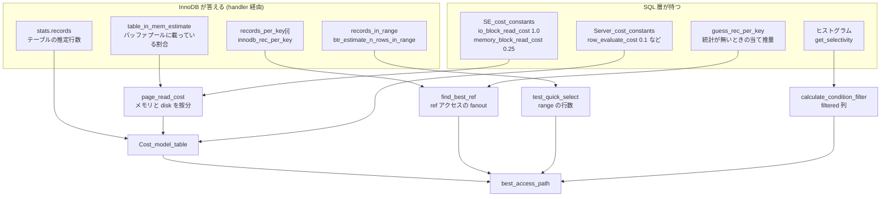

## 何を学んだか

コストベースオプティマイザというからには統計とコストモデルがあるはずだ、と思って `sql/opt_statistics.cc` を開くと**120 行しかなく、関数が 1 つだけ**入っている。これは肩透かしではなく情報で、**SQL 層は統計をほとんど持っていない**ということを意味する。

行数もカーディナリティも、実体は InnoDB 側にある。SQL 層が持っているのは次の 3 つだけだ。

1. **6 個のサーバコスト定数**と**2 個のエンジンコスト定数**。`mysql.server_cost` / `mysql.engine_cost` テーブルで上書きできる
2. **統計が無いときの当て推量** (`guess_rec_per_key`)。「先頭キーパートは全体の 1%」という 1 行の仮定
3. **ヒストグラム** (`sql/histograms/`)。ただしこれはアクセスパス選択には使われず、条件のフィルタ率の推定にだけ使われる

コスト計算に入る数値は 4 つの出どころに分かれている。



## ソースコードのどこか

### `sql/opt_statistics.cc` の全部

ファイルは 120 行で、公開関数は [`guess_rec_per_key` (L61)](https://github.com/mysql/mysql-server/blob/mysql-8.4.11/sql/opt_statistics.cc#L61) 1 つだけだ。ヘッダのコメントが仮定をそのまま書いている。

```cpp title="sql/opt_statistics.cc"
  Assume that the first key part matches 1% of the file and that the
  whole key matches 10 (duplicates) or 1 (unique) records. For small
  tables, ensure there are at least ten different key values.  Assume
  also that more key matches proportionally more records. This gives
  the formula:

    records = a - (x-1)/(c-1)*(a-b)
```

```cpp title="sql/opt_statistics.cc (L96)"
  // rec_per_key estimate for first key part (1% of records)
  const rec_per_key_t rec_per_key_first = table_rows * 0.01f;
```

**「先頭キーパートは全体の 1%」**という 1 行が、統計の無いインデックスのすべての見積りの土台になっている。呼ばれるのは `key->has_records_per_key(n)` が false のとき、つまり InnoDB が persistent statistics を返さなかったキーパートだけだ。

### InnoDB が返すカーディナリティ

`ha_innobase::info(HA_STATUS_CONST)` が全インデックスのキーパートを舐めて `KEY::set_records_per_key()` を埋める ([`ha_innodb.cc#L17670` 付近](https://github.com/mysql/mysql-server/blob/mysql-8.4.11/storage/innobase/handler/ha_innodb.cc#L17670))。

```cpp title="storage/innobase/handler/ha_innodb.cc"
        /* innodb_rec_per_key() will use
        index->stat_n_diff_key_vals[] and the value we
        pass index->table->stat_n_rows. Both are
        calculated by ANALYZE and by the background
        stats gathering thread (which kicks in when too
        much of the table has been changed). In
        addition table->stat_n_rows is adjusted with
        each DML (e.g. ++ on row insert). Those
        adjustments are not MVCC'ed and not even
        reversed on rollback. So,
        index->stat_n_diff_key_vals[] and
        index->table->stat_n_rows could have been
        calculated at different time. This is
        acceptable. */
        const rec_per_key_t rec_per_key =
            innodb_rec_per_key(index, (ulint)j, index->table->stat_n_rows);
```

コメントが**統計の一貫性を諦めている**ことを明言している。`stat_n_diff_key_vals[]` は ANALYZE か背景スレッドが更新し、`stat_n_rows` は DML ごとに増減する。両者は別の時点の値で、しかも `stat_n_rows` はロールバックしても戻らない。それでも「許容できる」と書いてある。統計は当たっていなくてよい、というのがこのコードの立場だ。

同じループの中で、もう 1 つ重要な値が拾われる。

```cpp title="storage/innobase/handler/ha_innodb.cc (L17641)"
      pct_cached = index_pct_cached(index);
    }

    key->set_in_memory_estimate(pct_cached);

    if (index == pk) {
      stats.table_in_mem_estimate = pct_cached;
    }
```

**そのインデックスの葉ページのうち何割がバッファプールに載っているか**を、インデックスごとに返している。

### コスト定数

[`sql/opt_costconstants.h#L65`](https://github.com/mysql/mysql-server/blob/mysql-8.4.11/sql/opt_costconstants.h#L65) の `Server_cost_constants` に既定値がある。

```cpp title="sql/opt_costconstants.h (L79)"
  Server_cost_constants(Optimizer optimizer) {
    switch (optimizer) {
      case Optimizer::kOriginal:
        m_row_evaluate_cost = 0.1;
        m_key_compare_cost = 0.05;
        m_memory_temptable_create_cost = 1.0;
        m_memory_temptable_row_cost = 0.1;
        m_disk_temptable_create_cost = 20.0;
        m_disk_temptable_row_cost = 0.5;
        break;
      case Optimizer::kHypergraph:
```

**旧オプティマイザと hypergraph で同じ値が並んでいる。** 分岐する余地だけが用意されていて、8.4 時点では中身が同一だ。

エンジン側は [`SE_cost_constants` (L202)](https://github.com/mysql/mysql-server/blob/mysql-8.4.11/sql/opt_costconstants.h#L202) に 2 つ。

```cpp title="sql/opt_costconstants.h (L221)"
        m_io_block_read_cost = 1.0;
        m_memory_block_read_cost = 0.25;
```

コストの単位は「row_evaluate_cost = 0.1 の世界での相対値」であって秒でもミリ秒でもない。ディスクから 1 ページ読むのが 1.0、メモリから読むのが 0.25、1 行の条件評価が 0.1、キー比較が 0.05。**ディスク I/O 1 回は行評価 10 回分**、という比率がこのモデルの骨格である。

### メモリとディスクの按分

[`sql/opt_costmodel.cc#L86`](https://github.com/mysql/mysql-server/blob/mysql-8.4.11/sql/opt_costmodel.cc#L86) の `Cost_model_table::page_read_cost` が、上の 2 つを混ぜる。

```cpp title="sql/opt_costmodel.cc"
double Cost_model_table::page_read_cost(double pages) const {
  assert(m_initialized);
  assert(pages >= 0.0);

  const double in_mem = m_table->file->table_in_memory_estimate();

  const double pages_in_mem = pages * in_mem;
  const double pages_on_disk = pages - pages_in_mem;
  assert(pages_on_disk >= 0.0);

  const double cost =
      buffer_block_read_cost(pages_in_mem) + io_block_read_cost(pages_on_disk);

  return cost;
}
```

`table_in_memory_estimate()` は先ほどの `stats.table_in_mem_estimate`、つまり InnoDB が報告した「バッファプールに載っている割合」だ。**同じクエリでも、バッファプールの中身が変わればコストが変わる。** インデックス単位の版 `page_read_cost_index` もあり、こちらは `key->in_memory_estimate` を使う。

### range の行数 — index dive

`test_quick_select` が区間を作った後、行数は [`ha_innobase::records_in_range` (`ha_innodb.cc#L16940`)](https://github.com/mysql/mysql-server/blob/mysql-8.4.11/storage/innobase/handler/ha_innodb.cc#L16940) が答える。これは統計ではなく**実測**だ。

```cpp title="storage/innobase/handler/ha_innodb.cc"
      n_rows = btr_estimate_n_rows_in_range(index, range_start, mode1,
                                            range_end, mode2);
```

[`btr_estimate_n_rows_in_range` (`btr0cur.cc#L5350`)](https://github.com/mysql/mysql-server/blob/mysql-8.4.11/storage/innobase/btr/btr0cur.cc#L5350) は区間の両端まで B+tree を潜り (これが index dive)、その間のページを数える。全部は読まない。

```cpp title="storage/innobase/btr/btr0cur.cc (L4918-4923)"
  /* Do not read more than this number of pages in order not to hurt
  performance with this code which is just an estimation. If we read
  this many pages before reaching slot2->page_no then we estimate the
  average from the pages scanned so far. */

  constexpr uint32_t N_PAGES_READ_LIMIT = 10;
```

**10 ページ読んだら、そこまでの平均で外挿する。** 広い範囲の見積りほど雑になる。

`records_in_range` の末尾には、0 を返さない細工がある。

```cpp title="storage/innobase/handler/ha_innodb.cc"
  /* The MySQL optimizer seems to believe an estimate of 0 rows is
  always accurate and may return the result 'Empty set' based on that.
  The accuracy is not guaranteed, and even if it were, for a locking
  read we should anyway perform the search to set the next-key lock.
  Add 1 to the value to make sure MySQL does not make the assumption! */

  if (n_rows == 0) {
    n_rows = 1;
  }
```

見積りが 0 でも 1 を返す。ロッキングリードでは実際に探索してギャップロックを取らなければならないからだ ([ロックのページ](./lock-modes-and-types/))。

### index dive をやめる閾値

等価区間が多すぎると dive の回数が支配的になるので、途中で統計に切り替わる ([`index_range_scan_plan.cc#L603`](https://github.com/mysql/mysql-server/blob/mysql-8.4.11/sql/range_optimizer/index_range_scan_plan.cc#L603))。

```cpp title="sql/range_optimizer/index_range_scan_plan.cc"
  /*
    If there are more equality ranges than specified by the
    eq_range_index_dive_limit variable we switches from using index
    dives to use statistics.
  */
  uint range_count = 0;
  param->use_index_statistics = eq_ranges_exceeds_limit(
      tree, &range_count, thd->variables.eq_range_index_dive_limit);
```

`eq_range_index_dive_limit` は既定 200 ([`sys_vars.cc#L3746`](https://github.com/mysql/mysql-server/blob/mysql-8.4.11/sql/sys_vars.cc#L3746))。**`IN (...)` の要素数が 200 を超えると、見積りの精度が段差で落ちる。**

### ヒストグラムは別経路

`sql/histograms/` にヒストグラムの実装がある (`equi_height.cc` の等高ヒストグラムと、値が少ないときの `singleton.cc`)。だがこれは `records_in_range` の代わりにはならない。ヒストグラムが効くのは `Item::get_filtering_effect()` を経由した**条件のフィルタ率**、つまり EXPLAIN の `filtered` 列であって、アクセスパスの選択そのものではない。しかも `condition_fanout_filter` スイッチが on のときだけ効く。

これは「ANALYZE TABLE ... UPDATE HISTOGRAM ON col を打ったのにプランが変わらない」の理由になる。ヒストグラムは join 順序 (fanout) の推定を通じて間接的にプランを変えることはあるが、「このインデックスを使うか」の判断には直接は入らない。

## なぜそうなっているか

**統計を SQL 層に持たなかったのは、handler API がエンジンの実装を知らないからだ。** クラスタードインデックスを持つ InnoDB と、行 ID で間接参照する MyISAM では、「1 行読むコスト」も「キーの重複度」も意味が違う。SQL 層が持てるのは「エンジンに聞く窓口」(`handler::stats`、`KEY::records_per_key`) と「エンジン非依存のコスト定数」だけになる。`opt_statistics.cc` が 120 行なのはその結果だ。

**`records_in_range` が実測なのは、統計では区間の形が表現できないからだ。** `rec_per_key` は「等価条件 1 個あたり何行か」しか言えない。`WHERE d BETWEEN '2024-01-01' AND '2024-01-31'` が何行かは、値の分布を知らないと答えられない。そこで「区間の両端まで実際に潜って、間のページを数える」という荒っぽいが確実な手を選んでいる。上限 10 ページはそのコストを抑える妥協である。

**統計の一貫性を諦めているのは、一貫させるコストが見合わないからだ。** `stat_n_rows` を MVCC 化すれば正確になるが、DML ごとにトランザクショナルな更新が要る。ANALYZE の結果と行数カウンタが別時点であることを許す代わりに、統計の更新はどこからも止められない軽い処理で済んでいる。だから統計は「たまに大きく外れる」ものとして扱う必要がある。

**コストの単位が無次元なのは、ハードウェアを知らないからだ。** `io_block_read_cost = 1.0` は「ディスクから 1 ページ」を意味するが、それが NVMe でも EBS でも同じ 1.0 だ。`mysql.engine_cost` を書き換える口が用意されているのはこのためで、SSD 環境で `io_block_read_cost` を下げるとフルスキャン寄りのプランになる。ただし `page_read_cost` がバッファプール滞留率で按分するので、素朴に思うほど効かないことも多い。

## どう活かすか

### 「インデックスがあるのに使われない」を統計から切り分ける

疑う順に並べる。

| 症状                                 | 見るもの                                                 | 確認方法                                                            |
| ------------------------------------ | -------------------------------------------------------- | ------------------------------------------------------------------- |
| `rows` が実際と桁違いに多い          | `rec_per_key` が古い                                     | `SHOW INDEX FROM t` の `Cardinality`、`ANALYZE TABLE t`             |
| `Cardinality` が NULL / 極端に小さい | persistent stats が無い                                  | `information_schema.INNODB_TABLESTATS`、`innodb_stats_persistent`   |
| `IN (...)` の要素が 200 超で急に悪化 | index dive をやめている                                  | `eq_range_index_dive_limit` を一時的に上げて EXPLAIN が変わるか見る |
| 起動直後だけ遅い / 暖まると直る      | `table_in_mem_estimate` が 0 に近い                      | バッファプールを暖めてから EXPLAIN を取り直す                       |
| `filtered` が 100.00 のまま          | ヒストグラムが無い、または `condition_fanout_filter` off | `information_schema.COLUMN_STATISTICS`                              |

**`ANALYZE TABLE` を打っても直らないなら、統計ではない。** その場合は range 分析が区間を作れていないか ([range 分析](./range-optimizer/))、ref アクセスの候補が作られていないか ([アクセスパスの選択](./access-path-selection/))、暗黙の型変換で `Item` が変わっているか ([名前解決のページ](./name-resolution-and-items/)) を疑う。

### `optimizer_trace` に生の数字が出る

上に挙げた値はほぼ全部 optimizer trace に出る。`rows_estimation` 配列の各テーブルに `table_scan` の `rows` / `cost` があり、`analyzing_range_alternatives` に候補インデックスごとの `rows` と `cost` が並ぶ。**EXPLAIN の `rows` は最終プランの値だが、trace には選ばれなかった候補のコストも残る。** 「なぜこのインデックスが負けたか」はここでしか分からない。

```sql
SET optimizer_trace = 'enabled=on';
SELECT ...;
SELECT * FROM information_schema.OPTIMIZER_TRACE\G
SET optimizer_trace = 'enabled=off';
```

### コスト定数をいじる前に按分を思い出す

`mysql.engine_cost` の `io_block_read_cost` を下げるのは、SSD 環境でよく提案されるチューニングだ。だが `page_read_cost` は `table_in_mem_estimate` でメモリ分とディスク分を按分するので、**バッファプールに十分載っているテーブルでは `io_block_read_cost` はほとんど効かない**。効くのは「載っていない大きなテーブル」で、そこは元々フルスキャンを避けたい対象でもある。変更したら `FLUSH OPTIMIZER_COSTS` が要り、既存セッションには効かない。

### 統計は「たまに外れるもの」として設計する

`stat_n_rows` はロールバックで戻らず、`stat_n_diff_key_vals[]` とは別時点の値だ。大量削除やロールバックの直後、統計は実態と乖離しうる。バッチ処理の後に `ANALYZE TABLE` を挟むのは、儀式ではなくこの乖離を潰す作業である。`innodb_stats_auto_recalc` が既定 ON なので背景スレッドが再計算はするが、その条件は「変更カウンタが行数の 10% を超えたとき」でしかない ([`row0mysql.cc#L1119`](https://github.com/mysql/mysql-server/blob/mysql-8.4.11/storage/innobase/row/row0mysql.cc#L1119))。

```cpp title="storage/innobase/row/row0mysql.cc"
  if (dict_stats_is_persistent_enabled(table)) {
    if (counter > n_rows / 10 /* 10% */
        && dict_stats_auto_recalc_is_enabled(table)) {
      dict_stats_recalc_pool_add(table);
      table->stat_modified_counter = 0;
    }
    return;
  }
```

**閾値に届かない偏った更新は拾われない。** 1 億行のテーブルで 500 万行だけ分布が変わっても、自動再計算は走らない。
