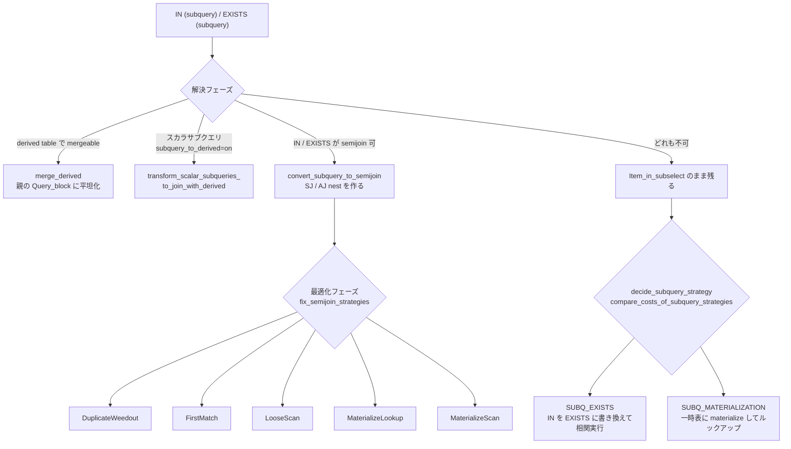

> **前提**: [JOIN::optimize](./optimizer-walkthrough/) / [join 順序](./join-order-search/)

## 何を学んだか

`WHERE x IN (SELECT ...)` は、そのままの形では実行されない。MySQL は 4 通りの書き換えを持っていて、順に適用を試みる。

| 変換                                | いつ               | どこ                                                  |
| ----------------------------------- | ------------------ | ----------------------------------------------------- |
| **derived table への merge**        | 解決フェーズ       | `Query_block::merge_derived`                          |
| **scalar subquery → derived table** | 解決フェーズ       | `transform_scalar_subqueries_to_join_with_derived`    |
| **semijoin flattening**             | 解決フェーズの末尾 | `flatten_subqueries` → `convert_subquery_to_semijoin` |
| **IN → EXISTS / マテリアライズ**    | 最適化フェーズ     | `decide_subquery_strategy`                            |

重要なのは**タイミングが 2 つに分かれている**ことだ。semijoin 化までは解決フェーズ (`Query_block::prepare`) で、コストを見ずに構文的な条件だけで決める。コストが絡むのは、平坦化に失敗したサブクエリの IN→EXISTS 判断と、平坦化に成功したサブクエリの実行戦略選択だけである。



## なぜそうなっているか

**semijoin 化を解決フェーズに置いたのは、テーブルの集合を変えてしまう変換だからだ。** 平坦化は `Query_block` の `leaf_tables` にテーブルを追加する。統計を取るのも join 順序を探索するのも、テーブルの集合が確定してからでないとできない。だから「コストを見て平坦化するか決める」ことはできず、**構文的な条件だけで決めて、その後の戦略選択にコストを回している**。

**IN と EXISTS を同じ入口 (`Item_exists_subselect`) にまとめたのは、意味が同じだからだ。** `x IN (SELECT y FROM t)` と `EXISTS (SELECT 1 FROM t WHERE y = x)` は (NULL の扱いを除けば) 同値で、両方とも「内側に 1 行でもあるか」を問う。だから平坦化のコードは 1 本で済み、`convert_subquery_to_semijoin` の assert も 2 つの型しか許していない。

**マテリアライズと IN→EXISTS の 2 択がコスト比較なのは、初期コストと反復コストのトレードオフだからだ。** マテリアライズは「サブクエリを 1 回実行 + 一時表への書き込み」という固定費を払って、以後のルックアップを安くする。外側が 1 行ならこの固定費は無駄で、外側が 100 万行なら圧倒的に得だ。分岐点は外側の行数に依存するので、静的には決められない。

**LIMIT がある派生表に条件を押し込めないのは、意味が変わるからだ。** `(SELECT * FROM t ORDER BY x LIMIT 10)` の中に `WHERE y = 5` を押し込むと、「上位 10 件のうち y=5 のもの」が「y=5 のうち上位 10 件」に変わってしまう。同じ理由で `has_any_limit()` は 1 つでも LIMIT があれば true を返す。

## ソースコードのどこか

### 派生表の merge か materialize か

`FROM (SELECT ...) AS d` は、親のクエリブロックに溶かし込む (merge) か、一時表にする (materialize) かのどちらかになる。判断は [`Query_block::merge_derived` (`sql/sql_resolver.cc#L3344`)](https://github.com/mysql/mysql-server/blob/mysql-8.4.11/sql/sql_resolver.cc#L3344) にあり、コメントが優先順位を明記している。

```cpp title="sql/sql_resolver.cc (L3368-3385)"
  /*
    Check whether derived table is mergeable, and directives allow merging;
    priority order is:
    - ALGORITHM says MERGE or TEMPTABLE
    - hint specifies MERGE or NO_MERGE (=materialization)
    - optimizer_switch's derived_merge is ON and heuristic suggests merge
  */
  if (derived_table->algorithm == VIEW_ALGORITHM_TEMPTABLE ||
      !derived_query_expression->is_mergeable())
    return false;

  if (derived_table->algorithm == VIEW_ALGORITHM_UNDEFINED) {
    const bool merge_heuristic =
        (derived_table->is_view() || allow_merge_derived) &&
        derived_query_expression->merge_heuristic(thd->lex);
    if (!hint_table_state(thd, derived_table, DERIVED_MERGE_HINT_ENUM,
                          merge_heuristic ? OPTIMIZER_SWITCH_DERIVED_MERGE : 0))
      return false;
  }
```

`is_mergeable` ([`sql/sql_lex.cc#L3962`](https://github.com/mysql/mysql-server/blob/mysql-8.4.11/sql/sql_lex.cc#L3962)) が構文的な条件のすべてだ。

```cpp title="sql/sql_lex.cc"
bool Query_expression::is_mergeable() const {
  if (is_set_operation()) return false;

  Query_block *const select = first_query_block();
  return !select->is_grouped() && select->having_cond() == nullptr &&
         !select->is_distinct() && select->has_tables() &&
         !select->has_limit() && !select->has_wfs();
}
```

**GROUP BY、HAVING、DISTINCT、LIMIT、ウィンドウ関数、UNION のどれか 1 つでもあれば merge できない。** テーブルを 1 枚も持たない (`SELECT 1`) 場合も merge できない。

`merge_heuristic` ([L3991](https://github.com/mysql/mysql-server/blob/mysql-8.4.11/sql/sql_lex.cc#L3991)) はさらに 2 つ条件を足す。

```cpp title="sql/sql_lex.cc"
bool Query_expression::merge_heuristic(const LEX *lex) const {
  if (lex->set_var_list.elements != 0) return false;

  Query_block *const select = first_query_block();
  for (Item *item : select->visible_fields()) {
    if (item->has_subquery() && !item->const_for_execution()) return false;
  }
  return true;
}
```

**選択リストに非定数のサブクエリがあると merge しない。** merge すると、そのサブクエリが親の join の各行で評価されてしまうからだ。

merge されない派生表は 1 回だけ materialize される。だから「派生表を使うと遅い」は正確ではなく、**merge されると外側の join に飲み込まれて何度も評価されうる**、というほうが問題になりやすい。

### 派生表への条件プッシュダウン

materialize される派生表には、外側の WHERE 条件を押し込める。判断は [`Table_ref::can_push_condition_to_derived` (`sql/sql_derived.cc#L1099`)](https://github.com/mysql/mysql-server/blob/mysql-8.4.11/sql/sql_derived.cc#L1099) にあり、6 つの禁止条件が並んでいる。

```cpp title="sql/sql_derived.cc"
bool Table_ref::can_push_condition_to_derived(THD *thd) {
  Query_expression const *unit = derived_query_expression();
  return hint_table_state(thd, this, DERIVED_CONDITION_PUSHDOWN_HINT_ENUM,
                          OPTIMIZER_SWITCH_DERIVED_CONDITION_PUSHDOWN) &&  // 1
         !unit->has_any_limit() &&                                         // 2
         !is_inner_table_of_outer_join() &&                                // 3
         !(common_table_expr() &&
           (common_table_expr()->references.size() >= 2 ||
            common_table_expr()->recursive)) &&     // 4
         (thd->lex->set_var_list.elements == 0) &&  // 5
         !unit->m_reject_multiple_rows;             // 6
}
```

**`LIMIT` があると押し込めない**のが実務で効く。「派生表の中で LIMIT を掛けてから外で絞る」という書き方は、押し込みを自分で止めていることになる。CTE を 2 回以上参照している場合も押し込めない (共有マテリアライズになるため)。

入口は [`Query_block::push_conditions_to_derived_tables` (L679)](https://github.com/mysql/mysql-server/blob/mysql-8.4.11/sql/sql_resolver.cc#L679) で、最上位のクエリブロックから再帰的に呼ばれる。

### semijoin flattening

`IN` / `EXISTS` を join に平坦化する変換で、doc comment に 4 パターンが書いてある ([`convert_subquery_to_semijoin` (`sql/sql_resolver.cc#L2881`)](https://github.com/mysql/mysql-server/blob/mysql-8.4.11/sql/sql_resolver.cc#L2881))。

```
  FROM (ot1 ... otN) SJ (it1 ... itK)
                     [ON inner-cond]
  [WHERE outer-cond]
```

`SJ` が semijoin、`AJ` が antijoin (`NOT IN` / `NOT EXISTS`) だ。antijoin は `LEFT JOIN` + `IS NULL` に近い形になると書いてある。

```cpp title="sql/sql_resolver.cc (L2850)"
  where AJ means "antijoin" and is like a LEFT JOIN; and is-null-cond is
  false if the row of it1 is "found" and "not_null_compl" (i.e. matches
  inner-cond).
```

**「`IN` を書いても `EXISTS` を書いても、平坦化に成功すれば同じ SJ nest になる」**のがこの変換の要点だ。

候補は解決フェーズ中に `sj_candidates` に集められ、`Query_block::prepare` の末尾で [`flatten_subqueries` (L3707)](https://github.com/mysql/mysql-server/blob/mysql-8.4.11/sql/sql_resolver.cc#L3707) がまとめて処理する。処理は**ボトムアップ**で、コメントが実行フローを図示している。

```cpp title="sql/sql_resolver.cc"
    Semijoin flattening is bottom-up. Indeed, we have this execution flow,
    for SELECT#1 WHERE X IN (SELECT #2 WHERE Y IN (SELECT#3)) :

    Query_block::prepare() (select#1)
       -> fix_fields() on IN condition
           -> Query_block::prepare() on subquery (select#2)
               ...
               -> flatten_subqueries: merge #3 in #2
```

候補には優先順位が付く。

```cpp title="sql/sql_resolver.cc (L3762)"
    item->sj_convert_priority =
        (((dependent * MAX_TABLES_FOR_SIZE) +  // dependent subqueries first
          child_query_block->leaf_table_count) *
         65536) +           // then with many tables
        (65536 - subq_no);  // then based on position
```

**相関サブクエリを優先し、次にテーブル数の多いものを優先する。** 平坦化はテーブル数の上限 (`MAX_TABLES` = 61) に当たると打ち切られるので、優先度の低いものから諦めることになる。

```cpp title="sql/sql_resolver.cc (L3813)"
    if (table_count + tables_added <= MAX_TABLES &&              // (1)
        !item->query_expr()->first_query_block()->has_aj_nests)  // (2)
      item->strategy = Subquery_strategy::SEMIJOIN;
```

`(2)` の条件も重要で、**antijoin nest を含むサブクエリは semijoin にできない**。

### 平坦化できなかったとき

平坦化されなかったサブクエリは `Item_in_subselect` のまま残り、最適化フェーズの [`JOIN::decide_subquery_strategy` (`sql/sql_optimizer.cc#L11245`)](https://github.com/mysql/mysql-server/blob/mysql-8.4.11/sql/sql_optimizer.cc#L11245) で扱いが決まる。

```cpp title="sql/sql_optimizer.cc"
  if ((chosen_method == Subquery_strategy::CANDIDATE_FOR_IN2EXISTS_OR_MAT) &&
      compare_costs_of_subquery_strategies(&chosen_method))
    return true;

  switch (chosen_method) {
    case Subquery_strategy::SUBQ_EXISTS:
      ...
      return in_pred->finalize_exists_transform(thd, query_block);
    case Subquery_strategy::SUBQ_MATERIALIZATION:
      return in_pred->finalize_materialization_transform(thd, this);
```

**ここが唯一、IN と EXISTS が本当に分岐する場所だ。**

- `SUBQ_EXISTS` — `x IN (SELECT y FROM t)` を `EXISTS (SELECT 1 FROM t WHERE y = x)` に書き換え、外側の各行ごとに実行する。相関するので毎回走るが、初期コストがゼロ
- `SUBQ_MATERIALIZATION` — サブクエリを 1 回だけ実行して一時表に入れ、外側の各行はハッシュルックアップで引く。初期コストが大きいが、ルックアップは安い

[`compare_costs_of_subquery_strategies` (L11306)](https://github.com/mysql/mysql-server/blob/mysql-8.4.11/sql/sql_optimizer.cc#L11306) がコストで選ぶ。ただしこの比較は `subquery_materialization_cost_based` スイッチ (既定 ON) が off だと行われず、常にマテリアライズが選ばれる。

`Subquery_strategy` は [`sql/item_subselect.h#L406`](https://github.com/mysql/mysql-server/blob/mysql-8.4.11/sql/item_subselect.h#L406) の 9 値の enum で、`CANDIDATE_FOR_*` (候補) と確定値が同じ enum に同居している。

### semijoin の 5 戦略

平坦化に成功した SJ nest は、実行方法をさらに選ぶ。定数は enum ではなく `#define` で、[`sql/sql_select.h#L312`](https://github.com/mysql/mysql-server/blob/mysql-8.4.11/sql/sql_select.h#L312) にある。

```cpp title="sql/sql_select.h"
#define SJ_OPT_NONE 0
#define SJ_OPT_DUPS_WEEDOUT 1
#define SJ_OPT_LOOSE_SCAN 2
#define SJ_OPT_FIRST_MATCH 3
#define SJ_OPT_MATERIALIZE_LOOKUP 4
#define SJ_OPT_MATERIALIZE_SCAN 5

inline bool sj_is_materialize_strategy(uint strategy) {
  return strategy >= SJ_OPT_MATERIALIZE_LOOKUP;
}
```

最後の inline 関数のために**値の並び順に意味がある** (materialize 系を末尾に固めてある)。

コストは join 順序探索の中で計算され、確定は [`Optimize_table_order::fix_semijoin_strategies` (`sql/sql_planner.cc#L3371`)](https://github.com/mysql/mysql-server/blob/mysql-8.4.11/sql/sql_planner.cc#L3371) で行われる。戦略ごとのコスト計算は 4 つの関数に分かれている。

| 戦略                   | コスト計算                                                                                                                               | EXPLAIN の見え方                    |
| ---------------------- | ---------------------------------------------------------------------------------------------------------------------------------------- | ----------------------------------- |
| FirstMatch / LooseScan | [`semijoin_firstmatch_loosescan_access_paths` (L3675)](https://github.com/mysql/mysql-server/blob/mysql-8.4.11/sql/sql_planner.cc#L3675) | `FirstMatch(t)` / `LooseScan`       |
| MaterializeScan        | [`semijoin_mat_scan_access_paths` (L3830)](https://github.com/mysql/mysql-server/blob/mysql-8.4.11/sql/sql_planner.cc#L3830)             | `Start temporary` / `End temporary` |
| MaterializeLookup      | [`semijoin_mat_lookup_access_paths` (L3913)](https://github.com/mysql/mysql-server/blob/mysql-8.4.11/sql/sql_planner.cc#L3913)           | `<subquery2>` という擬似テーブル    |
| DuplicateWeedout       | [`semijoin_dupsweedout_access_paths` (L3960)](https://github.com/mysql/mysql-server/blob/mysql-8.4.11/sql/sql_planner.cc#L3960)          | `Start temporary` / `End temporary` |

戦略ごとに `optimizer_switch` のフラグがある (`firstmatch`、`loosescan`、`duplicateweedout`、`materialization`)。`semijoin` 自体を off にすると平坦化ごと止まる。

### scalar subquery → derived table

`SELECT (SELECT MAX(x) FROM t2) FROM t1` のようなスカラサブクエリを derived table に変換して join にする、という比較的新しい変換が [`transform_scalar_subqueries_to_join_with_derived` (`sql/sql_resolver.cc#L8103`)](https://github.com/mysql/mysql-server/blob/mysql-8.4.11/sql/sql_resolver.cc#L8103) にある。

呼び出し側の条件を見ると、既定では動かないことが分かる ([L490](https://github.com/mysql/mysql-server/blob/mysql-8.4.11/sql/sql_resolver.cc#L490))。

```cpp title="sql/sql_resolver.cc"
  if (!(thd->lex->context_analysis_only & CONTEXT_ANALYSIS_ONLY_VIEW) &&
      (thd->optimizer_switch_flag(OPTIMIZER_SWITCH_SUBQUERY_TO_DERIVED) ||
       (parent_lex->m_sql_cmd != nullptr &&
        thd->secondary_engine_optimization() ==
            Secondary_engine_optimization::SECONDARY)) &&
      transform_scalar_subqueries_to_join_with_derived(thd))
```

**`subquery_to_derived` は既定 off** で、セカンダリエンジン (HeatWave) の最適化パスでだけ自動的に有効になる ([ヒントと optimizer_switch](./optimizer-hints-and-switches/))。テーブルサブクエリ用の [`transform_table_subquery_to_join_with_derived` (L5395)](https://github.com/mysql/mysql-server/blob/mysql-8.4.11/sql/sql_resolver.cc#L5395) は `flatten_subqueries` から呼ばれる。

## どう活かすか

### `IN (subquery)` / `EXISTS` / `JOIN` の使い分け

**まず、この 3 つは多くの場合同じプランになる。** semijoin 化が成功すれば、`IN` も `EXISTS` も内部的には SJ nest になり、`JOIN` + `DISTINCT` に近い実行になる。だから「`EXISTS` のほうが速い」といった一般則は 8.x では成り立たない。

意味のある使い分けは次のとおりだ。

| 書き方                              | 選ぶ理由                                                                                             |
| ----------------------------------- | ---------------------------------------------------------------------------------------------------- |
| `IN (subquery)`                     | 既定。平坦化されればコストベースで 5 戦略から選ばれる                                                |
| `EXISTS`                            | 相関条件が複数列にまたがる、または列の対応が単純でないとき。平坦化の対象になるのは同じ               |
| `JOIN` + `DISTINCT`                 | 内側のテーブルの列を SELECT リストで使いたいとき。ただし `DISTINCT` が余分なソートを生む可能性がある |
| `JOIN` (重複が出ないと分かっている) | 内側が UNIQUE 制約で 1 行に決まるとき。semijoin の重複除去コストが完全に消える                       |

**`NOT IN` は注意が要る。** NULL があると `NOT IN` は 3 値論理で NULL を返すので、antijoin への変換に追加条件が付く。`NOT EXISTS` にはこの問題がなく、意図が曖昧にならない。

### 平坦化されているかを確かめる

`EXPLAIN FORMAT=TREE` か `EXPLAIN` の `Extra` を見る。

- `Start temporary` / `End temporary` — DuplicateWeedout または MaterializeScan。**平坦化されている**
- `FirstMatch(tbl)` — FirstMatch。平坦化されている
- `LooseScan` — LooseScan。平坦化されている
- `<subquery2>` という `table` — MaterializeLookup。平坦化されている
- `MATERIALIZED` という `select_type` — 平坦化されずにマテリアライズされた
- `DEPENDENT SUBQUERY` — 平坦化も マテリアライズもされず、**外側の行ごとに実行されている**

最後の `DEPENDENT SUBQUERY` が最悪のケースだ。optimizer trace の `transformation_to_semi_join` オブジェクトを見ると、平坦化を試みて失敗した理由が出る。

### 平坦化されない典型パターン

- **サブクエリに `UNION` がある** — `is_mergeable` も semijoin もできない
- **サブクエリが `GROUP BY` / `HAVING` を持つ** — 派生表への変換が必要になる
- **`NOT IN` / `NOT EXISTS` の中にさらに `NOT EXISTS` がある** — `has_aj_nests` で弾かれる
- **`STRAIGHT_JOIN` を付けている** — `Join_tab_compare_straight` の assert が示すとおり、両立しない
- **テーブル数が 61 に近い** — `table_count + tables_added <= MAX_TABLES` で打ち切られる
- **`optimizer_switch` の `semijoin` が off** / `/*+ NO_SEMIJOIN(...) */`

### 派生表の書き方

- **`GROUP BY` を持つ派生表は必ず materialize される。** 外側で絞りたい条件は、押し込みが効くように書く (`LIMIT` を付けない、CTE を 2 回参照しない)
- **`LIMIT` 付きの派生表は条件が押し込まれない。** 「派生表で絞ってから外で join」のつもりが、派生表を全部作ってから join することになる
- **CTE を 2 回以上参照すると共有マテリアライズになり、条件プッシュダウンが止まる。** 1 回しか使わない CTE と 2 回使う CTE では最適化のされ方が違う
- **選択リストにサブクエリを持つ派生表は merge されない** (`merge_heuristic`)。merge させたければ、そのサブクエリを join に書き換える

`/*+ MERGE(d) */` と `/*+ NO_MERGE(d) */` で明示的に指定できる。ヒントは `derived_merge` スイッチより優先される ([ヒントと optimizer_switch](./optimizer-hints-and-switches/))。
