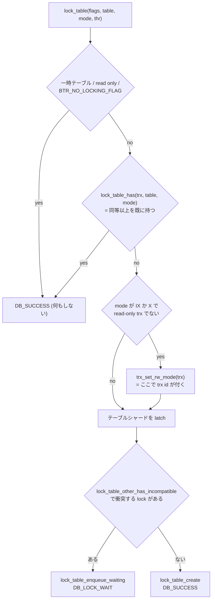

> **前提**: [ロックの種類 (前提)](./lock-kinds/) / [ロックの種類 (InnoDB)](./lock-modes-and-types/)

## 何を学んだか

[前提のページ](./lock-kinds/)で「階層があるから意図ロックが要る」という話を書いた。InnoDB の実装を読むと、その階層は思ったより薄い。

- **モードは 5 つで全部**。`IS` / `IX` / `S` / `X` / `AUTO_INC`。行に付くのは `S` と `X` だけで、**`IS` / `IX` / `AUTO_INC` はテーブルにしか付かない**
- **普通の `SELECT` はテーブルロックも取らない**。一貫性読み取りは read view だけで済むので、`lock_table()` を呼ぶ枝に入らない。テーブルロックキューに現れるのは、ロック読み取りと DML と DDL だけだ
- **`IX` 同士は互換**。だから DML がどれだけ並んでもテーブルロックの層では衝突しない。衝突するのは `S` か `X` を取る誰かがいるときだけで、それは `LOCK TABLES` か DDL か `IMPORT TABLESPACE` に限られる
- そのことを InnoDB 自身が最適化に使っている。**テーブルに `S` も `X` も 1 つも無ければ、`IS` / `IX` の要求はキューを走査せずに即座に許可される**。同じコメントが 3 箇所に貼られている
- **`AUTO_INC` もテーブルロックの一種**。`lock_t` を毎回作らず、テーブルごとに 1 個だけ事前確保したインスタンスを使い回す
- **`LOCK TABLES ... WRITE` は autocommit=1 では InnoDB のテーブル `X` ロックを取らない**。取るのは MDL だけになる

最後の 1 つは、`ha_innobase::external_lock` の条件式を読むまで信じられなかった。

## なぜそうなっているか

**意図ロックは「行ロックの存在を、行を見ずに知るため」にある。** `ALTER TABLE` がテーブル全体を `X` で押さえたいとき、そのテーブルの行ロックが 1 つでも残っているかを知りたい。行を全部走査するわけにはいかないので、行ロックを取る側が事前にテーブルへ「これから行を触る」という印を置く。それが `IX` だ。**`X` は `IX` と非互換なので、印が 1 つでも残っていれば `X` は待つ。**

**`IS` / `IX` 同士を互換にしたのは、そうしないと意図ロックが意味を失うからだ。** 意図ロックが排他的なら、DML は 1 本ずつしか通らなくなる。意図ロックの役割は「行ロックの有無をテーブル層に要約すること」であって、行同士の調停は行ロックの層がやる。**要約は互換でなければ要約にならない。**

**一貫性読み取りが `IS` すら取らないのは、read view が行ロックを一切使わないからだ。** 意図ロックは「行ロックを取る」という宣言なので、行ロックを取らない読み取りには宣言するものが無い。だから `SELECT` は `ALTER` を InnoDB のロック層では止めない。止めるのは MDL の層だ ([MDL のページ](./metadata-locking/))。**「SELECT が ALTER を止める」現象の正体が MDL であることの、InnoDB 側の裏付けになっている。**

**`count_by_mode` という配列を持つことにしたのは、キュー走査が O(n²) になるからだ。** ヘッダのコメントが理由を書いている。OLTP では `IX` が数百個並ぶのに対し `S` / `X` はほぼ現れない。それでも新しい `IX` のたびにキュー全体を走査すると、`n` 個の `IX` に対して `n²` 回の比較になる。**モードごとの本数を数えておけば、`S` と `X` が 0 本であることを 2 回の比較で確かめられる。**

**`AUTO_INC` をテーブルロックにしたのは、採番が「テーブル 1 個につき 1 本のカウンタ」だからだ。** 行ではなくテーブル属性を排他したい。互換表を見ると `AUTO_INC` は `IS` / `IX` と互換で、`S` / `X` および `AUTO_INC` 同士とは非互換になっている。**DML の意図ロックとは共存し、採番同士だけは直列化する**という設計だ。

**`LOCK TABLES` が autocommit=1 で InnoDB ロックを取らないのは、取っても即座に外れるうえにデッドロックの温床だったからだ。** これもコードコメントに残っている。autocommit=1 では `LOCK TABLES` の直後に文が完了してトランザクションが終わるので、InnoDB のテーブルロックは寿命がほぼゼロになる。

## ソースコードのどこか

### 5 つのモードと 2 枚の表

[`storage/innobase/include/lock0priv.h#L593`](https://github.com/mysql/mysql-server/blob/mysql-8.4.11/storage/innobase/include/lock0priv.h#L593) に互換表がある。

```cpp title="storage/innobase/include/lock0priv.h"
static const byte lock_compatibility_matrix[5][5] = {
    /**         IS     IX       S     X       AI */
    /* IS */ {true, true, true, false, true},
    /* IX */ {true, true, false, false, true},
    /* S  */ {true, false, true, false, false},
    /* X  */ {false, false, false, false, false},
    /* AI */ {true, true, false, false, false}};
```

表の上のコメントが、この章で一番効く 3 行を書いている。

> Note that for rows, InnoDB only acquires S or X locks.
> For tables, InnoDB normally acquires IS or IX locks.
> S or X table locks are only acquired for LOCK TABLES.

**行は `S` / `X` だけ。テーブルは普段 `IS` / `IX` だけ。テーブルの `S` / `X` は `LOCK TABLES` のときだけ。** 実際には DDL と `IMPORT TABLESPACE` も `X` を取るので「`LOCK TABLES` だけ」は少し古いが、「日常の DML では現れない」という主張は今も正しい。

もう 1 枚、強さの表が続く ([L610](https://github.com/mysql/mysql-server/blob/mysql-8.4.11/storage/innobase/include/lock0priv.h#L610))。

```cpp title="storage/innobase/include/lock0priv.h"
static const byte lock_strength_matrix[5][5] = {
    /**         IS     IX       S     X       AI */
    /* IS */ {true, false, false, false, false},
    /* IX */ {true, true, false, false, false},
    /* S  */ {true, false, true, false, false},
    /* X  */ {true, true, true, true, true},
    /* AI */ {false, false, false, false, true}};
```

**`X` は他のすべてより強い。`AUTO_INC` すら含む。** これは後で効く——`LOCK TABLES ... WRITE` で `X` を持っているトランザクションは、AUTO-INC ロックを取りに行っても即座に「もう持っている」と判定される。

### 行ロックの前に必ずテーブルロックを取る

`row_search_mvcc` の入口 ([`row0sel.cc#L4835`](https://github.com/mysql/mysql-server/blob/mysql-8.4.11/storage/innobase/row/row0sel.cc#L4835))。

```cpp title="storage/innobase/row/row0sel.cc"
  } else if (prebuilt->select_lock_type == LOCK_NONE) {
    /* This is a consistent read */
    /* Assign a read view for the query */

    if (!srv_read_only_mode) {
      trx_assign_read_view(trx);
    }

    prebuilt->sql_stat_start = false;
  } else {
  wait_table_again:
    err = lock_table(0, index->table,
                     prebuilt->select_lock_type == LOCK_S ? LOCK_IS : LOCK_IX,
                     thr);
```

**`if` と `else` が対になっている**のがこのページの主張そのものだ。一貫性読み取りなら read view を割り当てて終わり、ロック読み取りなら `LOCK_IS` か `LOCK_IX` を取る。`SELECT ... FOR SHARE` は `IS`、`FOR UPDATE` は `IX`。

DML 側も同じ形で、`INSERT` は [`row0ins.cc#L1182`](https://github.com/mysql/mysql-server/blob/mysql-8.4.11/storage/innobase/row/row0ins.cc#L1182) と [L3701](https://github.com/mysql/mysql-server/blob/mysql-8.4.11/storage/innobase/row/row0ins.cc#L3701)、`UPDATE` / `DELETE` は [`row0upd.cc#L3297`](https://github.com/mysql/mysql-server/blob/mysql-8.4.11/storage/innobase/row/row0upd.cc#L3297) で `LOCK_IX` を取る。外部キー検査だけは親テーブルに `LOCK_IS` を取る ([`row0ins.cc#L1579`](https://github.com/mysql/mysql-server/blob/mysql-8.4.11/storage/innobase/row/row0ins.cc#L1579)、[外部キーのページ](./foreign-keys/))。

守られていることは assert で宣言されている。

```cpp title="storage/innobase/lock/lock0lock.cc"
  ut_a(lock_table_has(trx, table, LOCK_IX) || table->is_temporary());
```

[L6060](https://github.com/mysql/mysql-server/blob/mysql-8.4.11/storage/innobase/lock/lock0lock.cc#L6060)。**行ロックを作る経路には、必ず「テーブルに IX を持っているか」の確認が置かれている** ([L5174](https://github.com/mysql/mysql-server/blob/mysql-8.4.11/storage/innobase/lock/lock0lock.cc#L5174) にも同じものがある)。一時テーブルだけが例外で、これは他セッションから見えないのでロック自体を省略する ([一時テーブルのページ](./temporary-tables-in-innodb/))。

### `lock_table` の骨格

[`lock0lock.cc#L3548`](https://github.com/mysql/mysql-server/blob/mysql-8.4.11/storage/innobase/lock/lock0lock.cc#L3548)。分岐は 4 段しかない。



`trx_set_rw_mode` がここに現れるのが面白い。**`IX` か `X` を取るということは書く予定があるということなので、この時点で read-only トランザクションから昇格して trx id を割り当てる** ([トランザクションのページ](./transaction-walkthrough/))。

`lock_table_has` の実装 ([`lock0priv.ic#L152`](https://github.com/mysql/mysql-server/blob/mysql-8.4.11/storage/innobase/include/lock0priv.ic#L152)) には、地味だが効いている前提がある。

```cpp title="storage/innobase/include/lock0priv.ic"
  /* Look for stronger locks the same trx already has on the table */
  for (const lock_t *lock = UT_LIST_GET_FIRST(trx->lock.trx_locks);
       lock != nullptr && lock_get_type(lock) == LOCK_TABLE;
       lock = UT_LIST_GET_NEXT(trx_locks, lock)) {
```

**`LOCK_TABLE` でなくなった時点でループを抜ける。** これが成立するのは、トランザクションのロックリストへの追加が種類で front / back に振り分けられているからだ。

```cpp title="storage/innobase/lock/lock0lock.cc"
static void add_to_trx_locks(lock_t *lock) {
  ut_ad(lock->trx != nullptr);
  ut_ad(trx_mutex_own(lock->trx));
  if (lock_get_type_low(lock) == LOCK_REC) {
    UT_LIST_ADD_LAST(lock->trx->lock.trx_locks, lock);
  } else {
    UT_LIST_ADD_FIRST(lock->trx->lock.trx_locks, lock);
  }
```

[L1236](https://github.com/mysql/mysql-server/blob/mysql-8.4.11/storage/innobase/lock/lock0lock.cc#L1236)。**テーブルロックは先頭、レコードロックは末尾。** 数万個の行ロックを持つトランザクションでも、テーブルロックの検索は数個で終わる。

### `S` も `X` も無ければキューを見ない

`lock_table_other_has_incompatible` ([L3507](https://github.com/mysql/mysql-server/blob/mysql-8.4.11/storage/innobase/lock/lock0lock.cc#L3507)) の冒頭。

```cpp title="storage/innobase/lock/lock0lock.cc"
  if ((mode == LOCK_IS || mode == LOCK_IX) &&
      table->count_by_mode[LOCK_S] == 0 && table->count_by_mode[LOCK_X] == 0) {
    return nullptr;
  }
```

この 4 行と、その上に貼られた 10 行のコメントが、`lock_table_has_to_wait_in_queue` ([L3672](https://github.com/mysql/mysql-server/blob/mysql-8.4.11/storage/innobase/lock/lock0lock.cc#L3672)) と `lock_table_dequeue` ([L3729](https://github.com/mysql/mysql-server/blob/mysql-8.4.11/storage/innobase/lock/lock0lock.cc#L3729)) にもほぼそのまま複製されている。3 つ目のコメントが計算量を明言している。

> When an occasional DDL finishes and releases the LOCK_S or LOCK_X, it has to scan the queue and grant any locks which were blocked by it. This can take Omega(n^2) if each of intention locks has to verify that all the other locks.

`count_by_mode` の宣言は [`dict0mem.h#L2424`](https://github.com/mysql/mysql-server/blob/mysql-8.4.11/storage/innobase/include/dict0mem.h#L2424) にあり、コメントに「`count_by_mode[LOCK_AUTO_INC]` は許可済みと待機中の AUTO-INC ロックの数を数えるのにも使っている」と書かれている。**1 つの配列が 2 つの目的に使われている。**

### AUTO-INC ロックは 1 個だけ事前に持っている

`lock_table_create` ([L3260](https://github.com/mysql/mysql-server/blob/mysql-8.4.11/storage/innobase/lock/lock0lock.cc#L3260)) の中。

```cpp title="storage/innobase/lock/lock0lock.cc"
  /* For AUTOINC locking we reuse the lock instance only if
  there is no wait involved else we allocate the waiting lock
  from the transaction lock heap. */
  if (type_mode == LOCK_AUTO_INC) {
    lock = table->autoinc_lock;
    ut_ad(table->autoinc_trx == nullptr);
    table->autoinc_trx = trx;

    ib_vector_push(trx->lock.autoinc_locks, &lock);
```

`type_mode` に `LOCK_WAIT` が付いていれば `==` が成立しないので、待つ側は普通に heap から確保する。**「同時に 1 本しか許可されない」ので、許可された側の `lock_t` はテーブルに 1 個あれば足りる。**

所有者は `table->autoinc_trx` に直接書かれる。だから所有判定はキューを見ずに済む ([`row0mysql.cc#L1146`](https://github.com/mysql/mysql-server/blob/mysql-8.4.11/storage/innobase/row/row0mysql.cc#L1146))。

```cpp title="storage/innobase/row/row0mysql.cc"
  /* If we already hold an AUTOINC lock on the table then do nothing.
  Note: We peek at the value of the current owner without acquiring any latch,
  which is OK, because if the equality holds, it means we were granted the lock,
  and the only way table->autoinc_trx can subsequently change is by releasing
  the lock, which can not happen concurrently with the thread running the trx.*/
  ut_ad(trx_can_be_handled_by_current_thread(trx));
  if (trx == table->autoinc_trx) {
    return (DB_SUCCESS);
  }
```

**latch を取らずにポインタを 1 個読むだけ**で済ませている。等しければ自分が所有者であることは自明、という論法だ。

解放側 (`lock_table_remove_autoinc_lock`、[L3346](https://github.com/mysql/mysql-server/blob/mysql-8.4.11/storage/innobase/lock/lock0lock.cc#L3346)) が意外に長いのは、ストアドプロシージャの中で「同じ文」の途中にテーブルが `DROP` されうるからだ。ベクタの末尾でなければ、その位置を `NULL` で埋めて穴にする。次に末尾を取り出すとき、`lock_table_pop_autoinc_locks` ([L3325](https://github.com/mysql/mysql-server/blob/mysql-8.4.11/storage/innobase/lock/lock0lock.cc#L3325)) が穴を読み飛ばす。

採番モード (`innodb_autoinc_lock_mode`) の話は [INSERT のロックのページ](./insert-and-duplicate-check/)にある。ここで押さえるのは、**AUTO-INC は行ロックではなくテーブルロックのキューに並ぶ**ということだ。だから `performance_schema.data_locks` では `LOCK_TYPE='TABLE'`、`LOCK_MODE='AUTO_INC'` として見える ([data_locks のページ](./data-locks-and-sys-schema/))。

### テーブルの `S` / `X` を取るのは誰か

3 系統ある。

**1 つ目、`LOCK TABLES`。** `ha_innobase::external_lock` ([`ha_innodb.cc#L19080`](https://github.com/mysql/mysql-server/blob/mysql-8.4.11/storage/innobase/handler/ha_innodb.cc#L19080)) の条件式が全部を決めている。

```cpp title="storage/innobase/handler/ha_innodb.cc"
    /* Starting from 4.1.9, no InnoDB table lock is taken in LOCK
    TABLES if AUTOCOMMIT=1. It does not make much sense to acquire
    an InnoDB table lock if it is released immediately at the end
    of LOCK TABLES, and InnoDB's table locks in that case cause
    VERY easily deadlocks.
    ...
    if (m_prebuilt->select_lock_type != LOCK_NONE) {
      if (sql_command == SQLCOM_LOCK_TABLES && THDVAR(thd, table_locks) &&
          thd_test_options(thd, OPTION_NOT_AUTOCOMMIT) &&
          thd_in_lock_tables(thd)) {
        dberr_t error = row_lock_table(m_prebuilt);
```

条件は 4 つの AND だ。`LOCK TABLES` であること、`innodb_table_locks` が ON であること (既定は ON、[L1075](https://github.com/mysql/mysql-server/blob/mysql-8.4.11/storage/innobase/handler/ha_innodb.cc#L1075) のセッション変数)、**autocommit が OFF であること**、そして `LOCK TABLES` の処理中であること。**既定の autocommit=1 では 3 つ目で落ちるので、InnoDB のテーブルロックは取られない。**

**2 つ目、DDL。** `handler0alter.cc` が `ddl::lock_table` 経由で取る ([`ddl0ddl.cc#L300`](https://github.com/mysql/mysql-server/blob/mysql-8.4.11/storage/innobase/ddl/ddl0ddl.cc#L300) → `lock_table_for_trx`)。既存テーブルへの `LOCK_X` が [`handler0alter.cc#L7508`](https://github.com/mysql/mysql-server/blob/mysql-8.4.11/storage/innobase/handler/handler0alter.cc#L7508)、コピー先の新テーブルへの `LOCK_S` が [L4557](https://github.com/mysql/mysql-server/blob/mysql-8.4.11/storage/innobase/handler/handler0alter.cc#L4557)。

**3 つ目、`DISCARD` / `IMPORT TABLESPACE`。** [`ha_innodb.cc#L15429`](https://github.com/mysql/mysql-server/blob/mysql-8.4.11/storage/innobase/handler/ha_innodb.cc#L15429) で `row_mysql_lock_table(trx, table, LOCK_X, ...)`。`trx->op_info` に文字列を渡しているので、`SHOW ENGINE INNODB STATUS` に `setting table lock for IMPORT TABLESPACE` と出る ([テーブルスペースのページ](./tablespace-files-and-import-export/))。

### 待つときと、リカバリのとき

`lock_table_enqueue_waiting` ([L3452](https://github.com/mysql/mysql-server/blob/mysql-8.4.11/storage/innobase/lock/lock0lock.cc#L3452)) には、辞書操作中の待ちを事故として扱う枝がある。

```cpp title="storage/innobase/lock/lock0lock.cc"
  switch (trx_get_dict_operation(trx)) {
    case TRX_DICT_OP_NONE:
      break;
    case TRX_DICT_OP_TABLE:
    case TRX_DICT_OP_INDEX:
      ib::error(ER_IB_MSG_642) << "A table lock wait happens in a dictionary"
                                  " operation. Table "
                               << table->name << ".";
      ib::error(ER_IB_MSG_SUBMIT_DETAILED_BUG_REPORT);
      ut_d(ut_error);
  }
```

**「バグ報告してくれ」とエラーログに書く。** 辞書操作は MDL で保護されているので、そこで InnoDB のテーブルロック待ちが起きるのは想定外だという主張だ。

クラッシュリカバリ用の入口もある ([`lock_table_ix_resurrect`, L3646](https://github.com/mysql/mysql-server/blob/mysql-8.4.11/storage/innobase/lock/lock0lock.cc#L3646))。redo から復元した未コミットのトランザクションに `IX` を戻す関数で、**待ちが起きないことを `ut_ad` で断言している**。リカバリ中は他に誰もいないからだ ([クラッシュリカバリのページ](./crash-recovery/))。行ロックのほうは復元されず、undo から再構築されるわけでもない——復元されたトランザクションはロールバックされるので、必要なのは「他の誰かが `X` を取れない」ことだけで、それには `IX` が 1 個あれば足りる。

## どう活かすか

**`LOCK TABLES ... WRITE` を InnoDB の排他制御として使うなら、autocommit を切る。** 既定の `autocommit=1` のままだと InnoDB のテーブル `X` ロックは取られず、効いているのは MDL だけになる。MDL は他の DML を止めないので、「`LOCK TABLES WRITE` を取ったから他セッションは書けないはず」という前提が崩れる。そもそも InnoDB で `LOCK TABLES` を使う理由はほとんど無く、**トランザクションと行ロックで組むのが正しい**。

**DML 同士がテーブルロックで詰まることはない。** `IX` は互いに互換だからだ。`performance_schema.data_locks` に `LOCK_TYPE='TABLE'` の待ちが出ているなら、犯人はテーブルの `S` か `X` を取っている誰か——`LOCK TABLES`、`ALTER`、`IMPORT TABLESPACE`——に限られる。**待ち行列の先頭を 1 つ見れば分かる。**

```sql
SELECT ENGINE_TRANSACTION_ID, OBJECT_NAME, LOCK_TYPE, LOCK_MODE, LOCK_STATUS
  FROM performance_schema.data_locks WHERE LOCK_TYPE = 'TABLE';
```

**一貫性読み取りは InnoDB のテーブルロックを一切取らない。** だから「長い `SELECT` が `ALTER` を止めている」ときに `data_locks` を見ても、その `SELECT` は出てこない。見るべきは `performance_schema.metadata_locks` のほうだ ([MDL のページ](./metadata-locking/))。**2 つのロック層のどちらを見るかを間違えると、犯人が消える。**

**`SERIALIZABLE` にすると `SELECT` がテーブル `IS` を取り始める。** 平文の `SELECT` が `LOCK_S` の行ロックに変わるので ([`ha_innodb.cc#L19050` 付近](https://github.com/mysql/mysql-server/blob/mysql-8.4.11/storage/innobase/handler/ha_innodb.cc#L19050))、その前段の `lock_table(LOCK_IS)` も走る。分離レベルを上げるコストは行ロックだけでなく、**テーブルロックキューにも行が増える**ことを含む。

**AUTO-INC の待ちは `LOCK_TYPE='TABLE'` として現れる。** 行ロック待ちを探して見つからないとき、`innodb_autoinc_lock_mode` が 0 か 1 のままで `INSERT ... SELECT` が走っている、という筋がある。8.4 の既定は 2 なので、**明示的に下げていないか設定を確認する**のが先だ。

**`innodb_table_locks=OFF` にする理由はまず無い。** これはセッション変数で、`LOCK TABLES` を InnoDB に伝えないようにするものだ。5.x 時代の互換性のために残っている設定で、既定の ON のままにしておけばよい。
