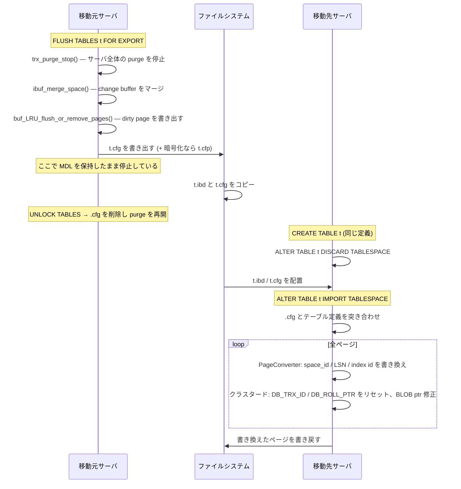

> **前提**: [物理構造 — テーブルスペース → エクステント → ページ → レコード](./innodb-physical-walkthrough/) / [セグメントとエクステント](./fsp-segments-and-extents/)

## 何を学んだか

`.ibd` は自己完結したファイルではない。中には**そのサーバでしか意味を持たない識別子**が焼き込まれている。

| 焼き込まれているもの        | どこに                         | 別サーバで困る理由                       |
| --------------------------- | ------------------------------ | ---------------------------------------- |
| space_id                    | 全ページの `FIL_PAGE_SPACE_ID` | 移動先で別のテーブルと衝突する           |
| index id                    | インデックスページのヘッダ     | 移動先の DD が持つ index id と一致しない |
| `DB_TRX_ID` / `DB_ROLL_PTR` | クラスタードインデックスの全行 | 移動先には対応する undo が存在しない     |
| LSN                         | 全ページの `FIL_PAGE_LSN`      | 移動先の LSN より未来の値になりうる      |

だから `ALTER TABLE ... IMPORT TABLESPACE` は**ファイルを置くだけの操作ではない**。全ページを 1 枚ずつバッファプールに読み、書き換えて、dirty にする。

```cpp title="storage/innobase/row/row0import.cc (L827-L850)"
/* Functor that is called for each physical page that is read from the
tablespace file.

1. Check each page for corruption.

2. Update the space id and LSN on every page
   - For the header page
     - Validate the flags
     - Update the LSN

3. On Btree pages
   - Set the index id
   - Update the max trx id
   - In a cluster index, update the system columns
   - In a cluster index, update the BLOB ptr, set the space id
   - Purge delete marked records, but only if they can be easily
     removed from the page
...
4. Set the page state to dirty so that it will be written to disk.
*/
class PageConverter : public AbstractCallback {
```

**IMPORT の所要時間はテーブルのページ数に比例する。** `mysqldump` + リストアより速いのは、B+tree を作り直さずに済むからであって、ファイルコピーだからではない。

## なぜそうなっているか

### なぜ `DB_TRX_ID` と `DB_ROLL_PTR` をリセットするのか

移動先のサーバには、元サーバの undo ログが無い。`DB_ROLL_PTR` をそのまま残すと、**存在しない undo レコードを指すポインタ**になる。read view がその行を「自分より新しい」と判定した瞬間、InnoDB は旧版を探しに行って壊れる ([read view と可視性](./read-view-and-visibility/))。

```cpp title="storage/innobase/row/row0import.cc (L2437-2443)"
  if ((err = adjust_cluster_index_blob_ref(rec, offsets)) == DB_SUCCESS) {
    /* Reset DB_TRX_ID and DB_ROLL_PTR.  Normally, these fields
    are only written in conjunction with other changes to the
    record. */

    row_upd_rec_sys_fields(rec, m_page_zip_ptr, index, m_offsets, m_trx, 0);
  }
```

`roll_ptr` に 0 を渡している。**IMPORT した直後の全行は「IMPORT したトランザクションが書いた、旧版のない行」に見える。** これは import 後に元サーバの MVCC 履歴が一切引き継がれないということでもある。

### なぜ delete-marked レコードをその場で消そうとするのか

同じ理由だ。delete-mark された行は「まだ purge されていない、undo に旧版がある行」なので、移動先では意味を持てない。

```cpp title="storage/innobase/row/row0import.cc (L2495-2503)"
    if (deleted) {
      /* A successful purge will move the cursor to the
      next record. */

      if (!purge()) {
        m_rec_iter.next();
      }

      ++m_index->m_stats.m_n_deleted;
```

楽観的に消せるものだけ消し、消せないものは残る (残った分は移動先の purge が回収する)。ついでにこのループで**行数を数え直している**ので、IMPORT 後の統計はページを読んだ実測値から始まる。

### なぜ export 側で change buffer をマージするのか

change buffer に溜まっているセカンダリインデックスの変更は、まだ `.ibd` に書かれていない ([change buffer](./change-buffer/))。マージせずにコピーすると、**セカンダリインデックスだけ古いファイル**が出来上がる。

```cpp title="storage/innobase/row/row0quiesce.cc (L935-946)"
  if (trx_purge_state() != PURGE_STATE_DISABLED) {
    trx_purge_stop();
  }

  for (ulint count = 0;
       ibuf_merge_space(table->space) != 0 && !trx_is_interrupted(trx);
       ++count) {
    if (!(count % 20)) {
      ib::info(ER_IB_MSG_1017)
          << "Merging change buffer entries for " << table->name;
    }
  }
```

1 行目に注目してほしい。**`FLUSH TABLES ... FOR EXPORT` は purge をサーバ全体で止める。** 対象テーブルだけではない。止めないと、マージ中に purge がページを書き換えてしまうからだ。

その後、バッファプールからこの space のページを追い出す。

```cpp title="storage/innobase/row/row0quiesce.cc (L957)"
    buf_LRU_flush_or_remove_pages(table->space, BUF_REMOVE_FLUSH_WRITE, trx);
```

ここまで済んで初めて、ディスク上の `.ibd` が「その時点のテーブルの完全な姿」になる。

### なぜ `.cfg` が要るのか

`.ibd` にはスキーマが入っていない。列の数、型、照合順序、インデックスの構成、INSTANT ADD された列のデフォルト値 — これらは移動元の DD にしかない。`.cfg` はそれを書き出したものだ。

移動先で `IMPORT` すると、`.cfg` の内容と移動先テーブルの定義を突き合わせる。ずれていれば `ER_TABLE_SCHEMA_MISMATCH` になる。列数が違うときのメッセージが分かりやすい。

```cpp title="storage/innobase/row/row0import.cc (L1398-1400)"
              "Found %u columns in destination table whereas cfg file has %u"
```

`.cfg` が無くても IMPORT は試みられるが、その場合は**移動先テーブルの定義が正しいと信じる**しかない。INSTANT 列を持つページが出てきた時点で諦める。

```cpp title="storage/innobase/row/row0import.cc (L2467-2471)"
    /* CFG file is required to process records having version */

    if (m_cfg->m_missing && has_version) {
      return (DB_SCHEMA_MISMATCH);
    }
```

## ソースコードのどこか

### テーブルスペースの種類と space_id

```cpp title="storage/innobase/include/dict0dict.h (L1096-L1128)"
  static constexpr space_id_t s_log_space_id = 0xFFFFFFF0UL;
...
  static constexpr space_id_t s_invalid_space_id = 0xFFFFFFFF;
...
  static constexpr space_id_t s_dict_space_id = 0xFFFFFFFE;
...
  static constexpr space_id_t s_temp_space_id = 0xFFFFFFFD;
...
  static constexpr space_id_t s_undo_space_id_range = 400000;
```

| 種類                     | space_id                      | ファイル                            |
| ------------------------ | ----------------------------- | ----------------------------------- |
| システムテーブルスペース | 0                             | `ibdata1` (`innodb_data_file_path`) |
| file-per-table / general | 1 から順に割り当て            | `<db>/<table>.ibd` / `<name>.ibd`   |
| グローバル一時           | `0xFFFFFFFD`                  | `ibtmp1`                            |
| セッション一時           | 一時領域用の 400000 個の範囲  | `#innodb_temp/temp_N.ibt`           |
| undo                     | `0xFFFFFFF0 - undo_space_num` | `undo_001` など                     |
| redo (擬似 space)        | `0xFFFFFFF0`                  | `#innodb_redo/#ib_redo*`            |

undo と一時領域が**上位から降りてくる**のは、ユーザテーブル用の 1 から昇る番号と衝突しないようにするためだ。両者の間に 400000 ずつの範囲が確保されている。

### export と import の全体



`UNLOCK TABLES` 側で `.cfg` を消しているのは [`row_quiesce_table_complete` (`row0quiesce.cc#L986`)](https://github.com/mysql/mysql-server/blob/mysql-8.4.11/storage/innobase/row/row0quiesce.cc#L986) だ。**コピーし忘れて `UNLOCK TABLES` すると `.cfg` は消える。**

### TRUNCATE TABLE は rename + drop + create

InnoDB の `TRUNCATE` は行を消す操作ではない。

```cpp title="storage/innobase/handler/ha_innodb.cc (L14806-14833)"
int innobase_truncate<Table>::truncate() {
...
  /* Rename tablespace file to avoid existing file in create. */
  if (m_file_per_table) {
    error = rename_tablespace();
  }
...
  dd_table_close(m_table, m_thd, nullptr, false);
  m_table = nullptr;
...
  error = innobase_basic_ddl::delete_impl(m_thd, m_name, m_dd_table, nullptr);
```

**まず `.ibd` を一時名にリネームし、それを削除し、空のテーブルスペースを作り直す。** リネームを先に挟むのは、作成が始まる前に元ファイルを確実にどける (同名ファイルの衝突を避ける) ためだ。途中でクラッシュしても DDL ログが後始末する ([アトミック DDL](./atomic-ddl-and-ddl-log/))。

DISCARD 済みのテーブルは truncate できない。

```cpp title="storage/innobase/handler/ha_innodb.cc (L15547-15552)"
  if (dict_table_is_discarded(innodb_table)) {
    ib_senderrf(thd, IB_LOG_LEVEL_ERROR, ER_TABLESPACE_DISCARDED, norm_name);
    return HA_ERR_NO_SUCH_TABLE;
  } else if (innodb_table->ibd_file_missing) {
    return HA_ERR_TABLESPACE_MISSING;
  }
```

## どう活かすか

### `FLUSH TABLES ... FOR EXPORT` は握ったままにしない

このセッションが `UNLOCK TABLES` するまで、**サーバ全体の purge が止まっている**。数百 GB のテーブルをコピーしている間ずっと止まるので、その間に走った DML の undo が全部残る。History list length が伸び、`ibdata1` や undo テーブルスペースが膨らむ ([purge](./purge/))。

大きなテーブルを持ち出すなら、コピーの所要時間をあらかじめ測っておく。「エクスポートは一瞬だがコピーが 2 時間」は、purge が 2 時間止まるということだ。

### IMPORT の失敗はたいてい定義のずれ

- **`ER_TABLE_SCHEMA_MISMATCH`** — 移動先の `CREATE TABLE` が完全に同じでない。列順、型、`NOT NULL`、照合順序、`ROW_FORMAT`、インデックスの並びまで一致させる。移動元で `SHOW CREATE TABLE` を取って使うのが確実
- **`.cfg` を忘れた** — 動く場合もあるが、INSTANT ADD された列があると `DB_SCHEMA_MISMATCH` で止まる。8.0 以降で `ALTER TABLE ... ADD COLUMN` を打ったテーブルは、まず INSTANT 列を持っていると考えてよい ([INSTANT DDL と行バージョン](./instant-ddl-row-versions/))
- **移動先が同じ MySQL バージョンでない** — ページフォーマットの互換は保証されていない方向がある。上げるのは可、下げるのは不可と考える

### IMPORT 後の統計とバッファプール

IMPORT はページを全部読むので、**終わった直後はそのテーブルがバッファプールを占領している**。他のワークロードを動かしているサーバで大きなテーブルを import すると、既存のホットデータが押し出される ([LRU と midpoint 挿入](./lru-and-midpoint/))。

行数は import 中に数え直されるが、ヒストグラムなど DD 側の統計は別なので、必要なら `ANALYZE TABLE` を打つ ([統計とコストモデル](./statistics-and-cost-model/))。

### `TRUNCATE` と `DELETE` の使い分けは「ファイルが作り直されるか」

- **`TRUNCATE TABLE`** — `.ibd` を捨てて作り直す。ファイルサイズも断片化もリセットされる。AUTO_INCREMENT も 0 に戻る。ただし**排他 MDL が要る**ので、実行中のクエリがあれば待つ
- **`DELETE FROM t`** — 行を delete-mark して undo を積む。ファイルは縮まず、purge の仕事が増える。ロールバックできるのはこちらだけ

「毎日全件入れ替えるテーブル」で `DELETE` を使うと、`.ibd` が伸びっぱなしになり purge も回らない。`TRUNCATE` か、新テーブルを作って `RENAME TABLE` で差し替えるほうが素直だ。

### ファイルコピーだけのバックアップが動かない理由

`.ibd` を `cp` して別サーバの datadir に置いても認識されない。DD (`mysql.ibd` の中のデータディクショナリ) にそのテーブルの定義が無く、space_id も一致しないからだ ([データディクショナリ](./data-dictionary/))。**`DISCARD` → 配置 → `IMPORT` の 3 手順は省略できない。**

サーバごと止めて datadir 全体をコピーするなら話は別で、そのときは space_id もすべて整合している。中途半端に「テーブル 1 つだけファイルを持っていく」ときだけ IMPORT が要る。
