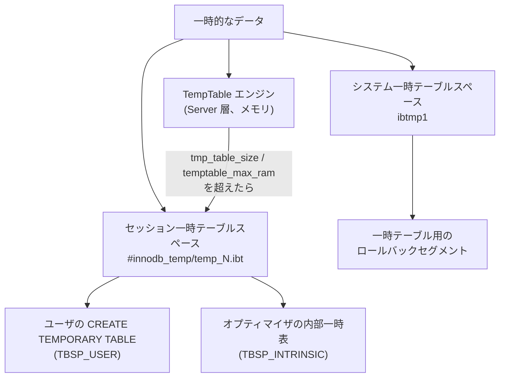

> **前提**: [テーブルスペースのファイル](./tablespace-files-and-import-export/) / [undo ログ](./undo-log/) / [マテリアライズと TempTable](./materialization-and-temptable/)

## 何を学んだか

InnoDB の一時テーブルは「普通のテーブルを一時ディレクトリに置いたもの」ではない。**耐久性まわりの規則が丸ごと違う。**

| 項目         | 通常のテーブル               | 一時テーブル                                 |
| ------------ | ---------------------------- | -------------------------------------------- |
| redo ログ    | 書く                         | **書かない** (`MTR_LOG_NO_REDO`)             |
| undo ログ    | undo テーブルスペースの rseg | システム一時テーブルスペースの rseg          |
| doublewrite  | 通す                         | 通さない                                     |
| ファイル     | `<db>/<table>.ibd`           | `#innodb_temp/temp_N.ibt` (セッションに貸出) |
| クラッシュ後 | redo + undo で復旧           | **消える** (起動時に作り直す)                |

そして**1 つのトランザクションは、rseg を 2 系統持つ**。

```cpp title="storage/innobase/trx/trx0undo.cc (L1714, L2018-L2027)"
  bool no_redo = (&trx->rsegs.m_noredo == undo_ptr);
...
  if (trx->rsegs.m_noredo.update_undo) {
...
  if (trx->rsegs.m_noredo.insert_undo) {
```

`trx->rsegs.m_redo` が通常テーブル用、`trx->rsegs.m_noredo` が一時テーブル用だ。**同じトランザクションの中で通常テーブルと一時テーブルの両方を更新すると、undo が 2 か所に積まれる。**

一時テーブルでも undo を積むのは、**ロールバックが要るから**だ。redo は要らない (クラッシュしたらテーブルごと消えてよい) が、`ROLLBACK` や文の失敗でその場で巻き戻す必要はある。「redo と undo は別の目的の仕組みである」ことが、ここで一番はっきり見える ([undo ログ](./undo-log/))。

## なぜそうなっているか

### なぜ redo を書かないのか

クラッシュから復旧する意味がないからだ。一時テーブルは接続が切れれば消えるし、サーバが落ちれば当然消える。**復旧対象でないものに redo を書くのは、書き込み帯域と log buffer の純粋な無駄**になる。

内部一時表 (`GROUP BY` の中間結果、`UNION` のマテリアライズなど) は「1 クエリの間だけ存在する巨大な書き込み」なので、ここに redo を書くと redo ログの回転が一気に速くなる。**重い集計クエリが走ると checkpoint が忙しくなる**、という現象を避けるための設計でもある ([チェックポイント](./checkpoint/))。

mtr のログモードでこれを表現している。

```cpp title="storage/innobase/include/mtr0log.ic (L48)"
      mtr_get_log_mode(mtr) == MTR_LOG_NO_REDO) {
```

`MTR_LOG_NO_REDO` の mtr は、ページを変更しても redo レコードを積まない ([mini-transaction](./mini-transaction/))。一時テーブルスペースへの変更はすべてこのモードで行われる。

### なぜセッションごとにファイルを貸し出すのか

MySQL 5.7 では、すべての一時テーブルが 1 つの共有ファイル (`ibtmp1`) に入っていた。これだと**一度膨らんだファイルは再起動するまで縮まない**。巨大な `GROUP BY` が 1 回走ると `ibtmp1` が数十 GB のまま残る、という問題が有名だった。

8.0 以降は、セッションごとに `.ibt` ファイルを貸し出す方式になった。

```cpp title="storage/innobase/include/srv0tmp.h (L129-137)"
/** Pool of session temporary tablespaces. Each session gets at max two
tablespaces. For a session, we allocate one tablespace on the creation of
first intrinsic table and another on the creation of first user temporary
table (CREATE TEMPORARY TABLE t1). These tablespaces are private to session.
No other session can use them when a tablespace is in-use by the session.

Once a session disconnects, the tablespaces are truncated and released
to the pool. */
class Tablespace_pool {
```

**1 セッションにつき最大 2 つ**。用途で分かれている。

```cpp title="storage/innobase/include/srv0tmp.h (L34-43)"
enum tbsp_purpose {
  TBSP_NONE = 0,  /*!< Tablespace is not being used for any
                 temporary table */
  TBSP_USER,      /*!< Tablespace is used for user temporary
                 tables */
  TBSP_INTRINSIC, /*!< Tablespace is used for intrinsic
                  tables */
  TBSP_SLAVE      /*!< Tablespace is used by the slave node
                  in a replication setup */
};
```

`TBSP_USER` が `CREATE TEMPORARY TABLE`、`TBSP_INTRINSIC` がオプティマイザの内部一時表 (intrinsic table) だ。**ユーザが作った一時テーブルと、クエリが勝手に作る中間結果は、別のファイルに入る。**

`TBSP_SLAVE` はレプリカの applier 用。レプリカでは applier スレッドが一時テーブルを扱う ([applier と MTA](./applier-and-mta/))。

### なぜ切断時に truncate なのか

返却時に、**初期サイズを超えているファイルだけ truncate する**。

```cpp title="storage/innobase/srv/srv0tmp.cc (L226-233)"
void Tablespace_pool::free_ts(Tablespace *ts) {
  space_id_t space_id = ts->space_id();
  fil_space_t *space = fil_space_get(space_id);
  ut_ad(space != nullptr);

  if (space->size != FIL_IBT_FILE_INITIAL_SIZE) {
    ts->truncate();
  }
```

`FIL_IBT_FILE_INITIAL_SIZE` は 5 ページ = 80KB ([`fil0fil.h#L1175`](https://github.com/mysql/mysql-server/blob/mysql-8.4.11/storage/innobase/include/fil0fil.h#L1175))。膨らんでいなければ何もしないので、短命なセッションでは truncate の I/O が発生しない。

**重要なのは「返却時」であることだ。** 返却は**セッションが切れたとき**であって、一時テーブルを `DROP` したときではない。ここが後述の運用上の落とし穴になる。

### プールは尽きたら伸びる

初期サイズは 10 個。

```cpp title="storage/innobase/srv/srv0tmp.cc (L38)"
const uint32_t INIT_SIZE = 10;
```

空になったら `POOL_EXPAND_SIZE` ずつ増やす。増やせない (= ディスクが無い) ときだけエラーになる。

```cpp title="storage/innobase/srv/srv0tmp.cc (L204-213)"
  if (m_free->size() == 0) {
    /* Free pool is empty. Add more tablespaces by expanding it */
    dberr_t err = expand(POOL_EXPAND_SIZE);
    if (err != DB_SUCCESS) {
      /* Failure to expand the pool means that there is no disk space
      available to create .IBT files */
      release();
      ib::error(ER_IB_UNABLE_TO_EXPAND_TEMPORARY_TABLESPACE_POOL)
          << "Unable to expand the temporary tablespace pool";
      return (nullptr);
    }
  }
```

つまり `.ibt` の本数は**同時に一時テーブルを使っているセッション数**でほぼ決まる。同時接続 500 で全員が一時テーブルを作れば、`#innodb_temp/` に 1000 個近いファイルが並びうる。

## ソースコードのどこか

### 3 つの一時領域を混同しない



**`ibtmp1` (`innodb_temp_data_file_path`) にはもうテーブルのデータは入らない。** 入っているのは一時テーブル用の undo (rseg) だ。8.0 で役割が分かれたのに設定名は残っているので、「`ibtmp1` が膨らむ = 一時テーブルが大きい」と読むと外す。

一時テーブル用の rseg は、`trx_sys->tmp_rsegs` として作られる。

```cpp title="storage/innobase/trx/trx0rseg.cc (L983-988)"
  /* Make sure Temporary Tablespace has enough rsegs. */
  if (!trx_rseg_add_rollback_segments(srv_tmp_space.space_id(),
                                      target_rollback_segments,
                                      &(trx_sys->tmp_rsegs), nullptr)) {
    return (false);
  }
```

本数は `innodb_rollback_segments` と同じ値が使われる。すぐ下のコメントも面白い。

```cpp title="storage/innobase/trx/trx0rseg.cc (L990-993)"
  /* Only the temp rsegs are used with a high force_recovery. */
  if (srv_force_recovery >= SRV_FORCE_NO_UNDO_LOG_SCAN) {
    return (true);
  }
```

`innodb_force_recovery` を上げて undo を読まない状態で起動しても、**一時テーブル用の rseg だけは作る**。壊れたデータの救出中でも内部一時表は必要だからだ。

### space_id の範囲

セッション一時テーブルスペースの space_id は、上位から降りてくる予約範囲に置かれる ([`dict0dict.h#L1118-1125`](https://github.com/mysql/mysql-server/blob/mysql-8.4.11/storage/innobase/include/dict0dict.h#L1118))。ファイル名の番号はその範囲内のオフセットで決まる。

```cpp title="storage/innobase/include/srv0tmp.h (L105-107)"
  /** The id used for name on disk temp_1.ibt, temp_2.ibt, etc
  @return the offset based on s_min_temp_space_id. The minimum offset is 1 */
  uint32_t file_id() const;
```

`temp_7.ibt` という名前は、そのファイルが 7 番目に作られたことを意味するだけで、**特定のセッションに固定で紐づいているわけではない**。誰が今使っているかは I_S から引ける。

```sql
SELECT * FROM information_schema.INNODB_SESSION_TEMP_TABLESPACES;
```

このテーブルは [`i_s_innodb_session_temp_tablespaces` (`ha_innodb.cc#L23690`)](https://github.com/mysql/mysql-server/blob/mysql-8.4.11/storage/innobase/handler/ha_innodb.cc#L23690) として登録されている。**`ID` は space_id ではなくスレッド ID** で、貸出中でなければ 0 になる (`STATE` が `INACTIVE`)。space_id は `SPACE` 列のほうだ。`PURPOSE` に `USER` / `INTRINSIC` / `SLAVE` / `NONE` が出るので、**巨大な `.ibt` がユーザの一時テーブルなのかクエリの中間結果なのかがここで分かる**。

## どう活かすか

### `#innodb_temp` が縮まないときに見るもの

`.ibt` が返却・truncate されるのは**セッションが切れたとき**だ。接続プールを使うアプリケーションでは接続が切れないので、**一度巨大な一時テーブルを作った接続は、そのサイズのファイルを握ったまま次のリクエストを処理し続ける**。

```sql
SELECT ID, SPACE, PATH, SIZE, STATE, PURPOSE
  FROM information_schema.INNODB_SESSION_TEMP_TABLESPACES
 ORDER BY SIZE DESC;
```

まずは `INNODB_SESSION_TEMP_TABLESPACES` を `SIZE` 降順で見る。**大きいファイルを握っているスレッド ID が分かれば、そのコネクションを切れば領域は戻る。** プール側の `maxLifetime` 相当の設定で接続を定期的に作り直す運用が効くのはこのためだ ([コネクションプールとセッション状態](./connection-pool-and-session-state/))。

### ディスクに落ちる境界を測る

内部一時表は、まず TempTable エンジン (メモリ) で作られ、収まらなくなると InnoDB の一時テーブルに落ちる ([マテリアライズと TempTable](./materialization-and-temptable/))。落ちたかどうかは状態変数で分かる。

```sql
SHOW GLOBAL STATUS LIKE 'Created_tmp_%tables';
```

`Created_tmp_disk_tables` が伸びているクエリを特定するには、`performance_schema.events_statements_summary_by_digest` の `SUM_CREATED_TMP_DISK_TABLES` を見るのが早い ([ダイジェスト](./statement-digest/))。

### 一時テーブルはレプリケーションされない、が binlog には出る

`CREATE TEMPORARY TABLE` は行ベースレプリケーションではレプリカに送られない。ただし**ステートメントベースでは送られる**ので、`binlog_format=STATEMENT` の環境では applier が一時テーブルを持つ (`TBSP_SLAVE` の出番)。

`binlog_format=ROW` で一時テーブルを使うこと自体は安全だが、**一時テーブルを持ったままの接続が切れると、その一時テーブルは黙って消える**。アプリケーション側で「作った後に必ず使う」流れになっているか確認する。

### クラッシュ後に `#innodb_temp` が残っていても気にしない

起動時に一時テーブルスペースは作り直される。redo も undo も一時テーブルのために復旧されないので、**クラッシュ前の一時テーブルは 1 つも残らない**。逆に言えば、一時テーブルに入れたデータは「サーバが落ちたら消えてよいもの」に限る必要がある。
