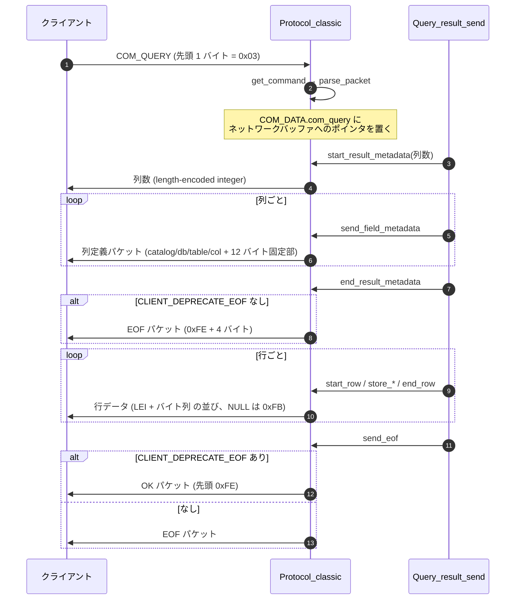

> **前提**: [パケット](./packet-framing/)

## 何を学んだか

`SELECT 1` を投げたとき、ワイヤ上に並ぶのはこれだけだ。

```
クライアント -> サーバ
  05 00 00 00  03  "SELECT 1"           COM_QUERY
サーバ -> クライアント
  01 00 00 01  01                       列数 = 1 (length-encoded integer)
  17 00 00 02  ... "def" ... "1" ...    列定義 x 1
 (01 00 00 03  fe ...)                  EOF (CLIENT_DEPRECATE_EOF なしのときだけ)
  02 00 00 04  01 "1"                   行データ: 長さ 1 + "1"
  07 00 00 05  fe 00 00 02 00 00 00     終端 (OK パケットの形をした EOF)
```

読み取れることが 4 つある。

1. **コマンドはパケットの先頭 1 バイト。** `03` = `COM_QUERY`。[`include/my_command.h`](https://github.com/mysql/mysql-server/blob/mysql-8.4.11/include/my_command.h#L48) の `enum enum_server_command` の並び順がそのまま番号になる
2. **文字列の長さは length-encoded integer (LEI)。** 1 / 3 / 4 / 9 バイトの可変長で、**先頭バイト 251 は NULL 専用に予約されている**
3. **メタデータは 3 段に分かれて送られる。** `start_result_metadata` で列数、`send_field_metadata` を列の数だけ、`end_result_metadata` で締め。**8.0 時代に探した `Protocol_classic::send_result_set_metadata` という関数は存在しない**
4. **終端パケットの形は capability で変わる。** `CLIENT_DEPRECATE_EOF` を交渉していれば、`send_eof()` は EOF パケットではなく先頭 `0xFE` の OK パケットを送る

「テキストプロトコル」の意味は文字どおりで、**`INT` も `DATETIME` も `DOUBLE` も 10 進文字列に変換して送る**。型情報はメタデータにあるが、値そのものは全部文字列だ。



## なぜそうなっているか

**LEI が 251 を NULL に予約したのは、行データの中で「長さ」と「NULL」を同じ場所で表現したかったからだ。** 別に NULL bitmap を持てば 1 ビットで済むが、テキストプロトコルは「行 = 可変長フィールドの素朴な列挙」という最小の形を選んだ。結果として、251 バイト以上の文字列は 3 バイト以上の長さプレフィックスを払う。[バイナリプロトコル](./binary-protocol-prepared-statements/)は逆に NULL bitmap を先頭に置く形を採ったので、この非対称が 2 系統のプロトコルとして残った。

**メタデータが 3 段に分かれているのは、列数が確定してから列定義を作るまでの間に処理が挟まるからだ。** サーバは行を 1 つも読まずにメタデータを送り始められる ([`Query_result_send::send_result_set_metadata` (`sql/query_result.cc#L70`)](https://github.com/mysql/mysql-server/blob/mysql-8.4.11/sql/query_result.cc#L70) が実行の前に呼ばれる。**8.0 時代の記憶にある `Protocol_classic::send_result_set_metadata` ではなく、`Query_result` 側のこれが本物だ**)。`start` で列数を送っておけば、クライアントは配列を確保して待てる。関数を 1 つにまとめると、列定義を全部作ってからでないと送れない。

**`CLIENT_DEPRECATE_EOF` を入れたのは、EOF パケットが情報を運べなかったからだ。** EOF は先頭 `0xFE` + warnings 2 バイト + status 2 バイトの 5 バイト固定で、`affected_rows` も `info` も `session state change` も乗らない。OK パケットにはそれが全部ある。だが先頭バイトを `0x00` にすると、行データの「列 0 の長さが 0」と区別できない。そこで **`0xFE` という EOF の先頭バイトを借りて、中身を OK にした**。受け取る側は「先頭 `0xFE` かつパケット長が 9 バイト未満なら EOF、それ以上なら OK」で見分ける。

**`COM_BINLOG_DUMP` だけ例外なのは、レプリカのプロトコルが結果セットではないからだ。** dump thread は binlog イベントをそのまま流し続け、最後に EOF を置く。ここで OK パケットを送ると、レプリカ側のイベントパーサが `0xFE` で始まるイベントヘッダとして解釈しようとする。

**数値を文字列で送るのは、型のない転送を選んだからだ。** すべての値が「長さ + バイト列」なので、クライアントは型を知らなくても行をパースできる。代償として、`BIGINT` 1 個に最大 20 バイト、`DOUBLE` に最大 24 バイト使う。これがバイナリプロトコルを作った動機の 1 つになった。

## ソースコードのどこか

### コマンド番号

```cpp title="include/my_command.h"
enum enum_server_command {
  /**
    Currently refused by the server. See ::dispatch_command.
    Also used internally to mark the start of a session.
  */
  COM_SLEEP,
  COM_QUIT,       /**< See @ref page_protocol_com_quit */
  COM_INIT_DB,    /**< See @ref page_protocol_com_init_db */
  COM_QUERY,      /**< See @ref page_protocol_com_query */
  COM_FIELD_LIST, /**< Deprecated. See @ref page_protocol_com_field_list */
  COM_CREATE_DB, /**< Currently refused by the server. See ::dispatch_command */
  COM_DROP_DB,   /**< Currently refused by the server. See ::dispatch_command */
  COM_UNUSED_2,  /**< Removed, used to be COM_REFRESH. */
  COM_UNUSED_1,  /**< Removed, used to be COM_SHUTDOWN */
```

[L48](https://github.com/mysql/mysql-server/blob/mysql-8.4.11/include/my_command.h#L48)。**削除されたコマンドが `COM_UNUSED_n` として穴埋めで残っている**のが特徴で、番号は絶対に詰められない。ヘッダにも警告がある。

```cpp title="include/my_command.h"
  @par Warning
  Add new commands to the end of this list, otherwise old
  servers won't be able to handle them as 'unsupported'.
```

`COM_SHUTDOWN` (8) と `COM_REFRESH` (7) が 8.4 では消えていて、`SHUTDOWN` は SQL 文に、`FLUSH` は SQL 文にそれぞれ移った。古いクライアントがこれらを送ると、`dispatch_command` が「未対応」として蹴る。

### 受信 — `get_command`

```cpp title="sql/protocol_classic.cc"
int Protocol_classic::get_command(COM_DATA *com_data,
                                  enum_server_command *cmd) {
  // read packet from the network
  if (const int rc = read_packet()) return rc;
  ...
  if (input_packet_length == 0) /* safety */
  {
    /* Initialize with COM_SLEEP packet */
    input_raw_packet[0] = (uchar)COM_SLEEP;
    input_packet_length = 1;
  }
  /* Do not rely on my_net_read, extra safety against programming errors. */
  input_raw_packet[input_packet_length] = '\0'; /* safety */

  *cmd = (enum enum_server_command)(uchar)input_raw_packet[0];

  if (*cmd >= COM_END) *cmd = COM_END;  // Wrong command
```

[L2888](https://github.com/mysql/mysql-server/blob/mysql-8.4.11/sql/protocol_classic.cc#L2888)。長さ 0 のパケットを `COM_SLEEP` に読み替え、範囲外のコマンド番号を `COM_END` に丸める。**このあと `dispatch_command` は `COM_END` を「未対応」として素直にエラーにできる。**

そのまま [`parse_packet` (L2743)](https://github.com/mysql/mysql-server/blob/mysql-8.4.11/sql/protocol_classic.cc#L2743) に渡り、コマンド種別ごとに `COM_DATA` (`include/mysql/com_data.h` の union) を埋める。`COM_QUERY` の分岐はこうだ。

```cpp title="sql/protocol_classic.cc"
    case COM_QUERY: {
      uchar *read_pos = input_raw_packet;
      size_t packet_left = input_packet_length;

      if (this->has_client_capability(CLIENT_QUERY_ATTRIBUTES)) {
        if (parse_query_bind_params(m_thd, 0, &data->com_query.parameters,
                                    nullptr, &data->com_query.parameter_count,
                                    nullptr, &read_pos, &packet_left, true,
                                    true))
          goto malformed;
      } else {
        data->com_query.parameters = nullptr;
        data->com_query.parameter_count = 0;
      }

      data->com_query.query = reinterpret_cast<const char *>(read_pos);
      data->com_query.length = packet_left;
      break;
    }
```

**`CLIENT_QUERY_ATTRIBUTES` を交渉していると、`COM_QUERY` の SQL 文の前に prepared statement と同じバイナリ形式のパラメータが付く。** 交渉していなければ、コマンドバイトの後は全部 SQL 文だ。パースに失敗したら `ER_MALFORMED_PACKET` で `bad_packet = true` を立てる。

`data->com_query.query` は**ネットワークバッファへのポインタで、コピーではない**。だから `dispatch_command` から先の処理は、この間ネットワークバッファを上書きできない。

### length-encoded integer

```cpp title="mysys/pack.cc"
uchar *net_store_length(uchar *packet, ulonglong length) {
  if (length < (ulonglong)251LL) {
    *packet = (uchar)length;
    return packet + 1;
  }
  /* 251 is reserved for NULL */
  if (length < (ulonglong)65536LL) {
    *packet++ = 252;
    int2store(packet, (uint)length);
    return packet + 2;
  }
  if (length < (ulonglong)16777216LL) {
    *packet++ = 253;
    int3store(packet, (ulong)length);
    return packet + 3;
  }
  *packet++ = 254;
  int8store(packet, length);
  return packet + 8;
}
```

[`mysys/pack.cc#L129`](https://github.com/mysql/mysql-server/blob/mysql-8.4.11/mysys/pack.cc#L129)。

```
+-----------------+---------+------------------------------------+
| 先頭バイト       | 全長    | 意味                                |
+-----------------+---------+------------------------------------+
| 0x00 .. 0xFA    | 1       | 値そのもの (0 .. 250)               |
| 0xFB (251)      | 1       | NULL                               |
| 0xFC (252)      | 3       | 続く 2 バイトが値                   |
| 0xFD (253)      | 4       | 続く 3 バイトが値                   |
| 0xFE (254)      | 9       | 続く 8 バイトが値                   |
| 0xFF (255)      | -       | ERR パケットの先頭。値としては使わない |
+-----------------+---------+------------------------------------+
```

読む側は [`net_field_length` (`mysys/pack.cc#L38`)](https://github.com/mysql/mysql-server/blob/mysql-8.4.11/mysys/pack.cc#L38)。**251 は `NULL_LENGTH` (`(unsigned long)~0`) を返す。** 行データの中で `0xFB` が 1 バイトだけ現れたら、その列は NULL だ。

`Protocol_text::store_null` がまさにそれを書いている。

```cpp title="sql/protocol_classic.cc"
bool Protocol_text::store_null() {
  field_pos++;
  char buff[1];
  buff[0] = (char)251;
  return packet->append(buff, sizeof(buff), PACKET_BUFFER_EXTRA_ALLOC);
}
```

**0xFE と 0xFF が特別扱いになるのは、パケットの先頭バイトとしてだけ**で、LEI の途中に出てくるぶんには何も起きない。ここを混同すると「行データの先頭が 0xFE だったら EOF と誤認するのでは」という誤解になる。実際には、列数が 251 以上でない限り行データの先頭バイトは列 0 の長さで、`cli_read_rows` は「0 で始まるか、`is_data_packet` が立っているか」で判定している ([クライアント側のページ](./client-library-and-streaming/))。

### メタデータの 3 段

```cpp title="sql/protocol_classic.cc"
bool Protocol_classic::start_result_metadata(uint num_cols_arg, uint flags,
                                             const CHARSET_INFO *cs) {
  ...
  if (flags & Protocol::SEND_NUM_ROWS) {
    uchar tmp[sizeof(ulonglong) + 1];
    uchar *pos = net_store_length((uchar *)&tmp, num_cols);

    if (has_client_capability(CLIENT_OPTIONAL_RESULTSET_METADATA)) {
      /* Store resultset metadata flag. */
      *pos = static_cast<uchar>(m_thd->variables.resultset_metadata);
      pos++;
    }

    my_net_write(&m_thd->net, (uchar *)&tmp, (size_t)(pos - (uchar *)&tmp));
  }
```

[L2977](https://github.com/mysql/mysql-server/blob/mysql-8.4.11/sql/protocol_classic.cc#L2977)。`SEND_NUM_ROWS` フラグを見ているのは、prepared statement の実行では列数を先に別のパケット (`Protocol_classic::store_ps_status`) で送っているからだ ([prepared statement のページ](./binary-protocol-prepared-statements/))。

各列は [`send_field_metadata` (L3166)](https://github.com/mysql/mysql-server/blob/mysql-8.4.11/sql/protocol_classic.cc#L3166)。

```cpp title="sql/protocol_classic.cc"
  if (has_client_capability(CLIENT_PROTOCOL_41)) {
    if (store_string(STRING_WITH_LEN("def"), cs) ||
        store_string(field->db_name, strlen(field->db_name), cs) ||
        store_string(field->table_name, strlen(field->table_name), cs) ||
        store_string(field->org_table_name, strlen(field->org_table_name),
                     cs) ||
        store_string(field->col_name, strlen(field->col_name), cs) ||
        store_string(field->org_col_name, strlen(field->org_col_name), cs) ||
        packet->mem_realloc(packet->length() + 12)) {
```

`"def"` は catalog 名で、**MySQL は catalog の概念を持たないのに固定文字列を送り続けている**。以降は db / table (別名) / org_table (実名) / col (別名) / org_col (実名) の 5 つ。`AS` を付けたときに `table` と `org_table` がずれる。

その後の 12 バイト固定部分。

```cpp title="sql/protocol_classic.cc"
    pos = packet->ptr() + packet->length();
    *pos++ = 12;  // Length of packed fields
```

```
列定義パケットの固定 12 バイト
+--------+--------+--------------------------------------------+
| offset | size   | 内容                                        |
+--------+--------+--------------------------------------------+
|      0 | 2      | character set (結果の charset)              |
|      2 | 4      | column length (バイト長)                    |
|      6 | 1      | type (enum_field_types)                     |
|      7 | 2      | flags (NOT_NULL_FLAG など)                  |
|      9 | 1      | decimals                                    |
|     10 | 2      | 予約 (0x0000)                               |
+--------+--------+--------------------------------------------+
```

`column length` の計算に長いコメントが付いている。

```cpp title="sql/protocol_classic.cc"
      max_length = (field->type >= MYSQL_TYPE_TINY_BLOB &&
                    field->type <= MYSQL_TYPE_BLOB)
                       ? field->length / item_charset->mbminlen
                       : field->length / item_charset->mbmaxlen;
      field_length =
          char_to_byte_length_safe(max_length, thd_charset->mbmaxlen);
```

**列の charset とセッションの `character_set_results` が違うと、ここで長さが換算される。** `VARCHAR(255)` を latin1 で定義して utf8mb4 で受け取れば、メタデータ上の長さは 255 × 4 = 1020 になる。ORM が「列の最大長」を信じて配列を確保するとずれる。

締めが [`end_result_metadata` (L3022)](https://github.com/mysql/mysql-server/blob/mysql-8.4.11/sql/protocol_classic.cc#L3022)。

```cpp title="sql/protocol_classic.cc"
bool Protocol_classic::end_result_metadata() {
  ...
  send_metadata = false;
  if (sending_flags & SEND_EOF) {
    /* if it is new client do not send EOF packet */
    if (!(has_client_capability(CLIENT_DEPRECATE_EOF))) {
```

メタデータの後の EOF パケットは、`CLIENT_DEPRECATE_EOF` を交渉したクライアントには送られない。**つまり新しいクライアントでは、列定義の直後にいきなり行データが来る。**

### 行の書き出し

行 1 つは `Protocol_text::start_row` で `packet->length(0)` してから、列ごとに `store_*` を呼び、最後に `end_row`。

```cpp title="sql/protocol_classic.cc"
bool Protocol_classic::end_row() {
  DBUG_TRACE;
  return my_net_write(&m_thd->net, pointer_cast<uchar *>(packet->ptr()),
                      packet->length());
}
```

[L3260](https://github.com/mysql/mysql-server/blob/mysql-8.4.11/sql/protocol_classic.cc#L3260)。**行 1 つが論理パケット 1 つ**になる。16MB を超える行は [`my_net_write` が自動で分割する](./packet-framing/)。

整数の書き出しが、テキストプロトコルの本質をよく表している。

```cpp title="sql/protocol_classic.cc"
  // Make sure the packet has space for a length byte, the digits and a
  // terminating zero character.
  char *pos = packet->prep_append(MY_INT64_NUM_DECIMAL_DIGITS + 2,
                                  PACKET_BUFFER_EXTRA_ALLOC);
  if (pos == nullptr) return true;
  const char *end = longlong10_to_str(value, pos + 1, unsigned_flag ? 10 : -10);
  *pos = end - (pos + 1);  // Set the length byte.
  packet->length(end - packet->ptr());
```

[`store_integer` (L3352)](https://github.com/mysql/mysql-server/blob/mysql-8.4.11/sql/protocol_classic.cc#L3352)。**`longlong10_to_str` で 10 進文字列に直し、長さバイトを後から書き戻す。** 長さバイトを先に予約しておいて後で埋めるので、桁数を数えるための余計なパスがない。`BIGINT` の 9223372036854775807 は 19 バイトの ASCII として飛ぶ。

文字列は [`store_string` (L3320)](https://github.com/mysql/mysql-server/blob/mysql-8.4.11/sql/protocol_classic.cc#L3320) で、ここで `character_set_results` への変換が入る。

```cpp title="sql/protocol_classic.cc"
  // result_cs is nullptr when client issues SET character_set_results=NULL
  if (result_cs != nullptr && !my_charset_same(fromcs, result_cs) &&
      fromcs != &my_charset_bin && result_cs != &my_charset_bin) {
    // Store with conversion.
    return net_store_data_with_conversion(pointer_cast<const uchar *>(from),
                                          length, fromcs, result_cs);
  }
```

**`SET character_set_results = NULL` にすると変換をスキップして生バイトを返す。** mysqldump がこれを使う。

### OK / ERR / EOF

3 種類の終端パケットは先頭バイトで区別される。

```
+-------+-----------------+------------------------------------------------+
| 先頭  | 種類            | 中身                                            |
+-------+-----------------+------------------------------------------------+
| 0x00  | OK              | affected_rows (LEI), last_insert_id (LEI),      |
|       |                 | status flags (2), warnings (2), info            |
| 0xFF  | ERR             | errno (2), '#', sqlstate (5), message           |
| 0xFE  | EOF             | warnings (2), status flags (2)  ※ 5 バイト固定 |
| 0xFE  | OK (DEPRECATE_  | OK と同じ中身。長さで EOF と区別する            |
|       | EOF 時)         |                                                 |
+-------+-----------------+------------------------------------------------+
```

OK の先頭バイトを決めているのがここ。

```cpp title="sql/protocol_classic.cc"
  /*
    Use 0xFE packet header if eof_identifier is true
    unless we are talking to old client
  */
  if (eof_identifier && (protocol->has_client_capability(CLIENT_DEPRECATE_EOF)))
    buff[0] = 254;
  else
    buff[0] = 0;
```

[`net_send_ok` (L860)](https://github.com/mysql/mysql-server/blob/mysql-8.4.11/sql/protocol_classic.cc#L860)。そして分岐の本体はこう。

```cpp title="sql/protocol_classic.cc"
bool Protocol_classic::send_eof(uint server_status, uint statement_warn_count) {
  DBUG_TRACE;
  bool retval;
  /*
    Normally end of statement reply is signaled by OK packet, but in case
    of binlog dump request an EOF packet is sent instead. Also, old clients
    expect EOF packet instead of OK
  */
  if (has_client_capability(CLIENT_DEPRECATE_EOF) &&
      (m_thd->get_command() != COM_BINLOG_DUMP &&
       m_thd->get_command() != COM_BINLOG_DUMP_GTID))
    retval = net_send_ok(m_thd, server_status, statement_warn_count, 0, 0,
                         nullptr, true);
  else
    retval = net_send_eof(m_thd, server_status, statement_warn_count);
```

[L1315](https://github.com/mysql/mysql-server/blob/mysql-8.4.11/sql/protocol_classic.cc#L1315)。**`send_eof()` という名前の関数が OK パケットを送る。** 例外は `COM_BINLOG_DUMP` / `COM_BINLOG_DUMP_GTID` の 2 つだけで、レプリカが本物の EOF を期待しているためだ ([dump thread のページ](./dump-thread-and-receiver/))。

OK パケットのサイズには上限がある。

```cpp title="sql/protocol_classic.cc"
  /* OK packet length will be restricted to 16777215 bytes */
  if (((size_t)(pos - start)) > MAX_PACKET_LENGTH) {
    net->error = NET_ERROR_SOCKET_RECOVERABLE;
    net->last_errno = ER_NET_OK_PACKET_TOO_LARGE;
```

`CLIENT_SESSION_TRACK` でセッション状態変更を全部詰め込むと 16MB を超えうるので、専用のエラーがある。

### `SERVER_STATUS_*` フラグ

OK / EOF パケットに 2 バイトで乗るステータスは [`include/mysql_com.h#L817`](https://github.com/mysql/mysql-server/blob/mysql-8.4.11/include/mysql_com.h#L817)。

```cpp title="include/mysql_com.h"
  SERVER_STATUS_IN_TRANS = 1,
  SERVER_STATUS_AUTOCOMMIT = 2,   /**< Server in auto_commit mode */
  SERVER_MORE_RESULTS_EXISTS = 8, /**< Multi query - next query exists */
  SERVER_QUERY_NO_GOOD_INDEX_USED = 16,
  SERVER_QUERY_NO_INDEX_USED = 32,
```

このうち運用で効くのは 3 つだ。

- **`SERVER_STATUS_IN_TRANS` (1)** — 「いまトランザクションの途中か」。コネクションプールがこれを見て、返却時に `ROLLBACK` を打つかどうかを決められる
- **`SERVER_MORE_RESULTS_EXISTS` (8)** — マルチステートメント / ストアドプロシージャで次の結果セットがあるか
- **`SERVER_QUERY_NO_INDEX_USED` (32) / `SERVER_QUERY_NO_GOOD_INDEX_USED` (16)** — `log_queries_not_using_indexes` が使う判定と同じフラグが**クライアントにも届いている**

`SERVER_STATUS_IN_TRANS_READONLY` (8192) のコメントが、これらの意味を正確に定めている。

```cpp title="include/mysql_com.h"
  /**
    Set at the same time as SERVER_STATUS_IN_TRANS if the started
    multi-statement transaction is a read-only transaction. Cleared
    when the transaction commits or aborts. Since this flag is sent
    to clients in OK and EOF packets, the flag indicates the
    transaction status at the end of command execution.
  */
```

**「コマンド実行が終わった時点の状態」**であって、実行中の状態ではない。

## どう活かすか

**`SELECT` の結果が期待した文字化けをするなら、`character_set_results` を疑う。** 変換は `store_string` の中でだけ行われ、列の charset とセッションの `character_set_results` が違うときに走る。`SET NAMES utf8mb4` は `character_set_client` / `_connection` / `_results` の 3 つを同時に設定するショートカットだ。`character_set_results = NULL` にすると変換が止まり、ストレージ上のバイト列がそのまま来る。

**列の最大長 (`MYSQL_FIELD::length`) を信じてバッファを確保するとずれる。** 前述のとおり charset 換算が入るので、`VARCHAR(255)` の列が 1020 と申告されることがある。ORM やドライバの「列の最大長」から `char[]` を確保する実装は過剰に取る。

**`Warning: Query was not using index` を出す仕組みは `SERVER_QUERY_NO_INDEX_USED` と同じフラグを見ている。** slow log の `log_queries_not_using_indexes` と、クライアントに届くステータスフラグが同じ情報源だ。アプリ側でこのフラグを拾って計測すれば、slow log を漁らずに「インデックスを使えていないクエリ」を数えられる。

**コネクションプールの返却時チェックには `SERVER_STATUS_IN_TRANS` を使う。** 「アプリが `COMMIT` を忘れた接続をプールに返す」事故は、このフラグを見れば検出できる。多くのプールは `ROLLBACK` を無条件に打つが、そのぶん往復が 1 回増える。フラグを見て必要なときだけ打つ実装のほうが速い。

**マルチステートメント (`CLIENT_MULTI_STATEMENTS`) を有効にすると、`SERVER_MORE_RESULTS_EXISTS` が立つ間ずっと結果を読み切る責任がクライアントに移る。** 読み切らずに次のコマンドを送ると `Commands out of sync` か `Got packets out of order` になる ([クライアント側のページ](./client-library-and-streaming/))。SQL インジェクションの被害が広がる経路でもあるので、必要でなければ無効のままにする。

**未知の `COM_*` は「未対応」で返るが、番号は絶対に再利用されない。** `COM_UNUSED_1` / `COM_UNUSED_2` という穴埋めは、古いクライアントが古い番号を送ってきたときに別のコマンドとして実行されてしまうのを防ぐためにある。プロキシやプロトコル実装を書くときは、この穴を詰めてはいけない。
