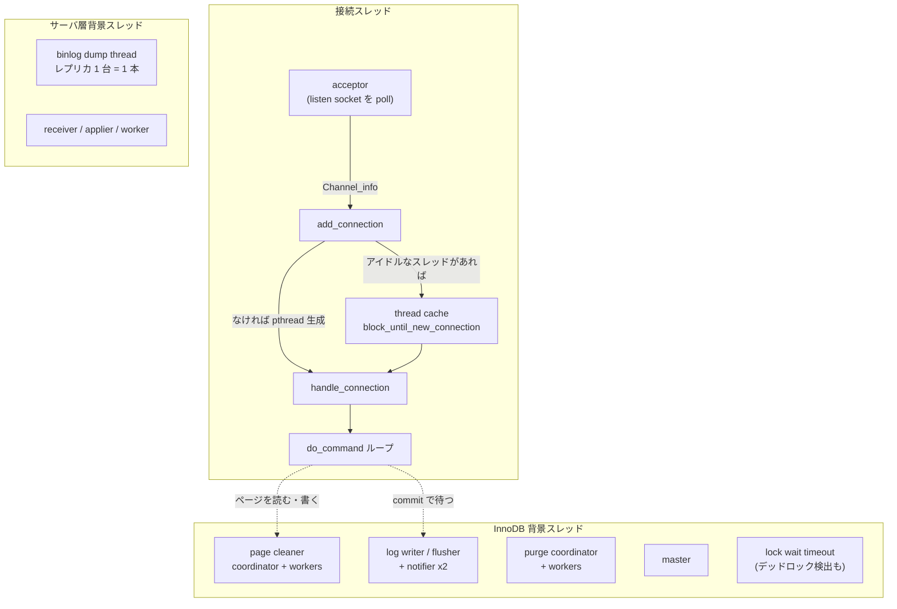

## 何を学んだか

mysqld のスレッドは大きく 3 種類ある。

1. **接続スレッド** — 既定の `Per_thread_connection_handler` では接続 1 本につき OS スレッド 1 本。`handle_connection` が `do_command` をループで回す
2. **InnoDB の背景スレッド** — `Srv_threads` に列挙された十数本。page cleaner、log writer/flusher、purge coordinator + workers、master、monitor など
3. **サーバ層の背景スレッド** — signal handler、binlog dump thread (レプリカ 1 台につき 1 本)、レプリカ側の receiver / applier / worker

このうち 1 だけが `max_connections` に支配され、2 と 3 は接続数と無関係に存在する。**「MySQL が重い」ときにどちらが詰まっているのかは、この区別がついていないと切り分けられない。**

そしてスレッドキャッシュには落とし穴がある。**pthread は再利用されるが `THD` と performance_schema の thread は毎回作り直される。** `thread_id` は接続ごとに変わり、OS スレッド ID は変わらない。



## ソースコードのどこか

### 接続スレッド — `handle_connection`

[`sql/conn_handler/connection_handler_per_thread.cc#L246`](https://github.com/mysql/mysql-server/blob/mysql-8.4.11/sql/conn_handler/connection_handler_per_thread.cc#L246)。外側の `for (;;)` がスレッドキャッシュの本体だ。

```cpp title="sql/conn_handler/connection_handler_per_thread.cc"
  for (;;) {
    THD *thd = init_new_thd(channel_info);
    ...
    if (thd_prepare_connection(thd))
      handler_manager->inc_aborted_connects();
    else {
      while (thd_connection_alive(thd)) {
        if (do_command(thd)) break;
      }
      end_connection(thd);
    }
    close_connection(thd, 0, false, false);
    ...
    delete thd;
    ...
    channel_info = Per_thread_connection_handler::block_until_new_connection();
    if (channel_info == nullptr) break;
    pthread_reused = true;
```

ループの底で `delete thd` してから `block_until_new_connection()` に入る。つまり**再利用されるのは pthread だけで、`THD` はループを回るたびに `init_new_thd` で作り直される**。performance_schema 側も同じで、`pthread_reused` が立っているときは `PSI_THREAD_CALL(new_thread)` で新しい計装オブジェクトを作り、走っている pthread に付け替えている。

```cpp title="sql/conn_handler/connection_handler_per_thread.cc"
    if (pthread_reused) {
      /*
        Reusing existing pthread:
        Create new instrumentation for the new THD job,
        and attach it to this running pthread.
      */
      PSI_thread *psi = PSI_THREAD_CALL(new_thread)(key_thread_one_connection,
                                                    0 /* no sequence number */,
                                                    thd, thd->thread_id());
```

`block_until_new_connection` は [L144](https://github.com/mysql/mysql-server/blob/mysql-8.4.11/sql/conn_handler/connection_handler_per_thread.cc#L144) にあり、`LOCK_thread_cache` と `COND_thread_cache` で待つ。待てる本数の上限が `thread_cache_size` だ。

### InnoDB の背景スレッド — `Srv_threads`

[`storage/innobase/include/srv0srv.h`](https://github.com/mysql/mysql-server/blob/mysql-8.4.11/storage/innobase/include/srv0srv.h#L167) に、InnoDB が起動する背景スレッドが 1 つの構造体としてまとめて宣言されている。

```cpp title="storage/innobase/include/srv0srv.h (抜粋)"
  IB_thread m_monitor;
  IB_thread m_error_monitor;
  IB_thread m_log_files_governor;
  IB_thread m_log_checkpointer;
  IB_thread m_log_writer;
  IB_thread m_log_flusher;
  IB_thread m_log_write_notifier;
  IB_thread m_log_flush_notifier;
  IB_thread m_buf_dump;
  IB_thread m_buf_resize;
  IB_thread m_dict_stats;
  /** Thread detecting lock wait timeouts. */
  IB_thread m_lock_wait_timeout;
  IB_thread m_master;
  ...
  IB_thread m_purge_coordinator;
  size_t m_purge_workers_n;
  IB_thread *m_purge_workers;
  IB_thread m_page_cleaner_coordinator;
  size_t m_page_cleaner_workers_n;
  IB_thread *m_page_cleaner_workers;
  IB_thread m_fts_optimize;
  IB_thread m_gtid_persister;
```

ここに並ぶ名前が、そのまま[背景スレッドの群](./innodb-threads-walkthrough/)の目次になる。

注意点として、**この構造体にスロットがあるからといって `srv0start.cc` がそれを起動しているとは限らない**。page cleaner は [`buf/buf0flu.cc`](https://github.com/mysql/mysql-server/blob/mysql-8.4.11/storage/innobase/buf/buf0flu.cc) 側の初期化で、log 系の 4 本 + checkpointer + files governor は [`log/log0log.cc`](https://github.com/mysql/mysql-server/blob/mysql-8.4.11/storage/innobase/log/log0log.cc) 側で作られる。`srv0start.cc` を grep しても見つからないのはそのためだ。

### 接続数の上限は「+1」される

[`sql/conn_handler/connection_handler_manager.cc#L104`](https://github.com/mysql/mysql-server/blob/mysql-8.4.11/sql/conn_handler/connection_handler_manager.cc#L104) の `check_and_incr_conn_count` は `max_connections + 1` まで通す。この 1 本は `SUPER` / `CONNECTION_ADMIN` を持つユーザのための予約枠で、**認証が終わって権限が分かった時点で**「予約枠を使ってよい接続だったか」が判定される。詳細は[接続層のページ](./connection-layer/)。

## なぜそうなっているか

**1 接続 1 スレッドは、C10K 以前の設計を引きずっているというより、SQL の実行モデルと相性がよいから残っている。** 1 本のクエリの実行は深い再帰と大きなスタック上の状態 (パーサの状態、`Item` ツリー、iterator の木) を持つ。これをイベントループで扱おうとすると、全部をヒープ上の状態機械に書き換える必要がある。実際、後から作られた X Plugin ですらこのモデルを捨てていない。X はイベントループを持つが、**そこに登録されるのは listen ソケットとタイマーだけ**で、確立済みの接続はワーカースレッドが `Client::run` のループで抱え込む ([X Plugin のスレッドのページ](./x-plugin-threading-and-pipelining/))。classic との違いは、スレッドの供給が固定サイズの thread cache ではなく動的プールである点だけだ。

**pthread だけ再利用して `THD` を作り直すのは、`THD` に残る状態が多すぎるからだ。** `THD` にはセッション変数、一時テーブル、prepared statement、トランザクション状態、診断領域が全部ぶら下がっている。これを接続をまたいで安全にリセットするより、丸ごと捨てて作り直すほうが確実で、実際に高いのは `THD` の生成ではなく pthread の生成 (スタック確保) のほうだ、という判断になる。

**InnoDB の背景スレッドが役割ごとに固定本数で分かれているのは、それぞれ「待つ相手」が違うからだ。** log writer はログバッファの詰め替えを待ち、log flusher は `fsync` を待ち、page cleaner は I/O capacity を待ち、purge は read view を待つ。これらを 1 本のスレッドで回すと、`fsync` の待ちが purge を止める、といった無関係な結合が生まれる。8.0 で log 系が 4 本に分かれたのも、書き込みと `fsync` と「終わったことの通知」を分離するためだった ([log writer のページ](./log-writer-threads/))。

## どう活かすか

**`Too many connections` は接続スレッドの話であって、背景スレッドの話ではない。** `max_connections` を上げても、詰まっているのが page cleaner や purge なら何も改善しないどころか、同時に走るクエリが増えてさらに悪化する。まず `SHOW ENGINE INNODB STATUS` の ROW OPERATIONS と `History list length` を見る ([INNODB STATUS のページ](./innodb-status-sections/))。

**`performance_schema.threads` の `THREAD_OS_ID` が同じでも別の接続かもしれない。** スレッドキャッシュで pthread が再利用されるからだ。接続を一意に指すのは `PROCESSLIST_ID` (= `thread_id`) のほうで、これは接続ごとに新しい値になる。OS 側の `top -H` や `perf` で見えるスレッド ID から接続を逆引きするときは、この時間差に注意する。

**接続を細かく張り直すワークロードでは、`thread_cache_size` が効くのは pthread 生成コストの部分だけ**で、認証のラウンドトリップ ([ハンドシェイクのページ](./handshake-and-auth/)) と `THD` の初期化は毎回かかる。効くのはコネクションプールを持つことのほうで、これはアプリ側の話になる。

**スレッド数が接続数に比例するので、メモリの見積もりも比例する。** `sort_buffer_size`、`join_buffer_size`、`read_rnd_buffer_size` はセッションごとに確保されうるバッファで、`max_connections` を大きくしたままこれらを大きくすると、上限が掛け算で効く。実際に確保されるのは使うときだけだが、`tmp_table_size` と `temptable_max_ram` のようにスコープが違うものが混ざっている ([一時表のページ](./materialization-and-temptable/))。
