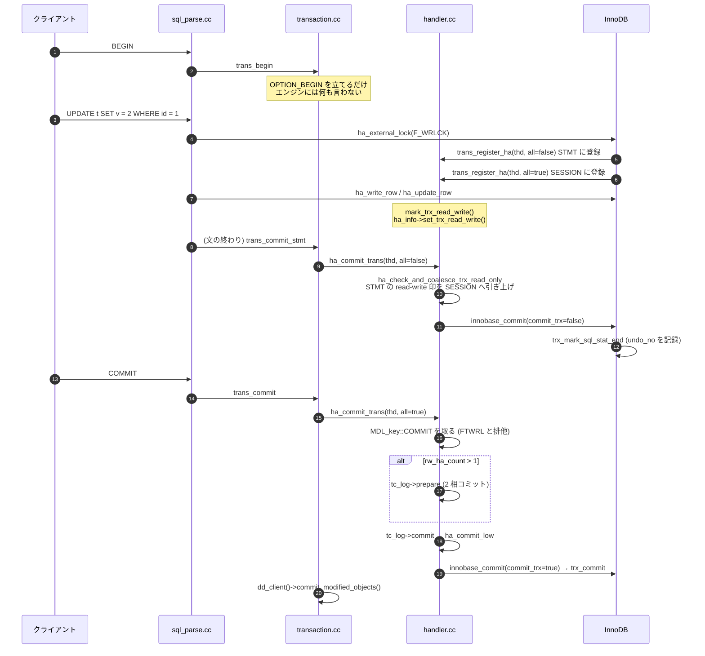

> **前提**: [handler](./handler-walkthrough/) / [UPDATE の一生](./life-of-an-update/)

## 何を学んだか

「トランザクション」と呼んでいるものが、`sql/` の中では 2 つある。

|                   | statement transaction (`Transaction_ctx::STMT`) | normal transaction (`Transaction_ctx::SESSION`) |
| ----------------- | ----------------------------------------------- | ----------------------------------------------- |
| 生存期間          | 1 文                                            | `BEGIN` から `COMMIT` まで                      |
| 閉じるのは        | `mysql_execute_command` の末尾                  | `COMMIT` / 暗黙コミット                         |
| 呼び出し          | `ha_commit_trans(thd, all=false)`               | `ha_commit_trans(thd, all=true)`                |
| InnoDB での対応物 | `trx_mark_sql_stat_end` (暗黙のセーブポイント)  | `trx_commit`                                    |

この 2 層があるので、**文の途中でエラーになったときに「その文だけ」を巻き戻せる**。`INSERT` が重複キーで失敗しても、それより前の文は生きたままだ。

もう 2 つ、構造を決めている性質がある。

1. **`BEGIN` はエンジンに何も伝えない。** [`trans_begin`](https://github.com/mysql/mysql-server/blob/mysql-8.4.11/sql/transaction.cc#L125) がやるのは `OPTION_BEGIN` フラグと `SERVER_STATUS_IN_TRANS` を立てることだけで、InnoDB の `trx_t` は作られない。参加者はエンジン側が **`trans_register_ha` で自分から名乗り出る**
2. **参加者のうち「書いた」ものを数えたのが `rw_ha_count`** で、これが 2 相コミットに入るかどうかを決める ([UPDATE の一生](./life-of-an-update/))。印を立てているのは `handler` の wrapper だ ([handler のページ](./handler-walkthrough/))



## なぜそうなっているか

**参加者を遅延登録にしたのは、「触っていないエンジンをコミットの経路に入れない」ためだ。** MySQL は複数のエンジンを同時に載せられる。`BEGIN` の時点で全エンジンを起こすと、使わないエンジンにも文ごとのコールバックが飛ぶ。エンジン側から名乗り出る形にすれば、参加者は実際に触ったものだけになる。**その代償が、`BEGIN` にトランザクション開始の意味がなくなったことだ。** `SHOW ENGINE INNODB STATUS` に出てくる `trx` が `BEGIN` の直後には存在しないのはこのためで、[performance_schema のトランザクション計装](./performance-schema-internals/)も `trans_begin` と `trans_register_ha` の 2 箇所に分かれてしまっている。

**statement transaction を InnoDB 側でセーブポイントにしたのは、行ロックを解放したくないからだ。** 文が失敗したとき、その文の変更だけを消したいが、ロックまで消すと直列化可能性が壊れる。undo レコード番号で切り戻すやり方なら、undo だけを逆適用してロックはそのまま残せる。**「失敗した `INSERT` でもロックは残る」という直感に反する挙動は、この設計の直接の帰結だ** ([INSERT のロックのページ](./insert-and-duplicate-check/))。

**`autocommit` を「フラグを見て文の終わりに本物のコミットとして扱う」形にしたのは、autocommit 用の別経路を作らないためだ。** `ha_commit_trans(thd, all=false)` は autocommit のときも `BEGIN` の中でも同じ関数を通り、`is_real_trans` の 1 行だけが違う。InnoDB 側も同じ判定を `will_commit` としてもう一度書いている。**同じ条件を 2 箇所で独立に評価している**のは重複だが、SQL 層とエンジンが疎結合であることの代償でもある。

**`FLUSH TABLES WITH READ LOCK` を MDL の名前空間で表現したのは、コミットを 1 点で止める必要があるからだ。** テーブルロックだけでは、既に開いたテーブルに対する進行中のコミットを止められない。`MDL_key::COMMIT` という架空のオブジェクトに全書き込みトランザクションが IX ロックを取る形にすれば、FTWRL 側は X ロックを 1 回取るだけで全員を待たせられる。

## ソースコードのどこか

### `trans_begin` は何もしない

[`sql/transaction.cc#L125`](https://github.com/mysql/mysql-server/blob/mysql-8.4.11/sql/transaction.cc#L125)。まず先行するトランザクションを閉じ、フラグを立てるだけだ。

```cpp title="sql/transaction.cc"
  if (thd->in_multi_stmt_transaction_mode() ||
      (thd->variables.option_bits & OPTION_TABLE_LOCK)) {
    thd->variables.option_bits &= ~OPTION_TABLE_LOCK;
    thd->server_status &=
        ~(SERVER_STATUS_IN_TRANS | SERVER_STATUS_IN_TRANS_READONLY);
    DBUG_PRINT("info", ("clearing SERVER_STATUS_IN_TRANS"));
    res = ha_commit_trans(thd, true);
  }
  ...
  thd->variables.option_bits |= OPTION_BEGIN;
  thd->server_status |= SERVER_STATUS_IN_TRANS;
```

**`BEGIN` を 2 回打つと 1 回目が暗黙にコミットされる**のはこの先頭の分岐だ。`SERVER_STATUS_IN_TRANS` は OK パケットのステータスフラグとしてクライアントに返る値でもある ([テキストプロトコルのページ](./text-protocol-and-resultset/))。

例外は `START TRANSACTION WITH CONSISTENT SNAPSHOT` で、これだけはその場でエンジンを呼ぶ。

```cpp title="sql/transaction.cc"
  /* ha_start_consistent_snapshot() relies on OPTION_BEGIN flag set. */
  if (flags & MYSQL_START_TRANS_OPT_WITH_CONS_SNAPSHOT) {
    if (tst) tst->add_trx_state(thd, TX_WITH_SNAPSHOT);
    res = ha_start_consistent_snapshot(thd);
  }
```

REPEATABLE READ でスナップショットが固定されるのは、通常は**最初の一貫性読み取りの瞬間**であって `BEGIN` の瞬間ではない。この構文だけが例外を作っている ([read view のページ](./read-view-and-visibility/))。

### 参加者の登録 — `trans_register_ha`

[`sql/handler.cc#L1316`](https://github.com/mysql/mysql-server/blob/mysql-8.4.11/sql/handler.cc#L1316)。コメントが契約をそのまま書いている。

```cpp title="sql/handler.cc"
/**
  Register a storage engine for a transaction.

  Every storage engine MUST call this function when it starts
  a transaction or a statement (that is it must be called both for the
  "beginning of transaction" and "beginning of statement").
  Only storage engines registered for the transaction/statement
  will know when to commit/rollback it.

  @note
    trans_register_ha is idempotent - storage engine may register many
    times per transaction.
*/
void trans_register_ha(THD *thd, bool all, handlerton *ht_arg,
                       const ulonglong *trxid [[maybe_unused]]) {
  Ha_trx_info *ha_info;
  Transaction_ctx *trn_ctx = thd->get_transaction();
  const Transaction_ctx::enum_trx_scope trx_scope =
      all ? Transaction_ctx::SESSION : Transaction_ctx::STMT;
```

登録先は `THD` がエンジンごとに持つ 2 要素の配列で、`[0]` が STMT、`[1]` が SESSION だ。

```cpp title="sql/handler.cc"
  ha_info = thd->get_ha_data(ht_arg->slot)->ha_info + (all ? 1 : 0);

  if (ha_info->is_started()) {
    assert(trn_ctx->ha_trx_info(trx_scope));
    return; /* already registered, return */
  }

  trn_ctx->register_ha(trx_scope, ha_info, ht_arg);
  trn_ctx->set_ha_trx_info(trx_scope, ha_info);

  if (ht_arg->prepare == nullptr) trn_ctx->set_no_2pc(trx_scope, true);
```

**`prepare` の関数ポインタを持たないエンジンが 1 つでも参加すると `no_2pc` が立つ。** 2 相コミットの可否は、参加者の数と、参加者全員が prepare をサポートしているかの両方で決まる。

InnoDB 側の呼び出しは [`innobase_register_trx` (`ha_innodb.cc#L3007`)](https://github.com/mysql/mysql-server/blob/mysql-8.4.11/storage/innobase/handler/ha_innodb.cc#L3007)。

```cpp title="storage/innobase/handler/ha_innodb.cc"
void innobase_register_trx(handlerton *hton, /* in: Innobase handlerton */
                           THD *thd,   /* in: MySQL thd (connection) object */
                           trx_t *trx) /* in: transaction to register */
{
  const ulonglong trx_id = static_cast<ulonglong>(trx_get_id_for_print(trx));

  trans_register_ha(thd, false, hton, &trx_id);

  if (!trx_is_registered_for_2pc(trx) &&
      thd_test_options(thd, OPTION_NOT_AUTOCOMMIT | OPTION_BEGIN)) {
    trans_register_ha(thd, true, hton, &trx_id);
  }

  trx_register_for_2pc(trx);
}
```

**STMT には必ず登録し、SESSION には「複数文トランザクションの中にいるとき」だけ登録する。** `autocommit=1` で `BEGIN` もない状態なら SESSION 側は空のままだ。これが後で効いてくる。

呼び出し元は [`ha_innobase::external_lock` (`ha_innodb.cc#L19003`)](https://github.com/mysql/mysql-server/blob/mysql-8.4.11/storage/innobase/handler/ha_innodb.cc#L19003) が中心で、DDL 系 (`truncate`、`delete_table`) からも直接呼ばれる。

```cpp title="storage/innobase/handler/ha_innodb.cc"
  if (lock_type != F_UNLCK) {
    /* MySQL is setting a new table lock */

    *trx->detailed_error = 0;

    innobase_register_trx(ht, thd, trx);
```

**登録は「テーブルにロックを掛けるとき」に起きる。** `BEGIN` の直後に何も触らずに `COMMIT` すると、参加者が 0 なので `ha_commit_trans` はほぼ何もせずに戻る。

### 文の終わりの調停

[`mysql_execute_command` (`sql_parse.cc#L2909`)](https://github.com/mysql/mysql-server/blob/mysql-8.4.11/sql/sql_parse.cc#L2909) の後片付けで、成否によって分岐する ([L4940](https://github.com/mysql/mysql-server/blob/mysql-8.4.11/sql/sql_parse.cc#L4940))。

```cpp title="sql/sql_parse.cc"
    /* report error issued during command execution */
    if ((thd->is_error() && !early_error_on_rep_command) ||
        (thd->variables.option_bits & OPTION_MASTER_SQL_ERROR))
      trans_rollback_stmt(thd);
    else {
      /* If commit fails, we should be able to reset the OK status. */
      thd->get_stmt_da()->set_overwrite_status(true);
      trans_commit_stmt(thd);
```

[`trans_commit_stmt` (`transaction.cc#L513`)](https://github.com/mysql/mysql-server/blob/mysql-8.4.11/sql/transaction.cc#L513) は `all=false` で `ha_commit_trans` を呼ぶ。

```cpp title="sql/transaction.cc"
  thd->get_transaction()->merge_unsafe_rollback_flags();

  if (thd->get_transaction()->is_active(Transaction_ctx::STMT)) {
    res = ha_commit_trans(thd, false, ignore_global_read_lock);
    if (!thd->in_active_multi_stmt_transaction())
      trans_reset_one_shot_chistics(thd);
  } else if (tc_log)
    res = tc_log->commit(thd, false);
```

### `ha_commit_trans` の中で `all` が何を分けるか

[`sql/handler.cc#L1634`](https://github.com/mysql/mysql-server/blob/mysql-8.4.11/sql/handler.cc#L1634)。まず「本物のコミットか」を判定する。

```cpp title="sql/handler.cc"
  /*
    "real" is a nick name for a transaction for which a commit will
    make persistent changes. E.g. a 'stmt' transaction inside a 'all'
    transaction is not 'real': even though it's possible to commit it,
    the changes are not durable as they might be rolled back if the
    enclosing 'all' transaction is rolled back.
  */
  const bool is_real_trans =
      all || !trn_ctx->is_active(Transaction_ctx::SESSION);
```

**`all=false` でも、外側の SESSION トランザクションが存在しなければそれは本物のコミットだ。** これが `autocommit=1` の実装そのものになっている。`BEGIN` していないので SESSION は空、だから文の終わりの `trans_commit_stmt` が `is_real_trans == true` になり、耐久性のある確定として扱われる。

次に read-write の参加者を数える ([L1741](https://github.com/mysql/mysql-server/blob/mysql-8.4.11/sql/handler.cc#L1741))。

```cpp title="sql/handler.cc"
    if (ha_info->is_started())
      rw_ha_count = ha_check_and_coalesce_trx_read_only(thd, ha_info, all);
    trn_ctx->set_rw_ha_count(trx_scope, rw_ha_count);
    /* rw_trans is true when we in a transaction changing data */
    rw_trans = is_real_trans && (rw_ha_count > 0);
```

数えているのは [`ha_check_and_coalesce_trx_read_only` (L1400)](https://github.com/mysql/mysql-server/blob/mysql-8.4.11/sql/handler.cc#L1400) で、**数えるだけでなく STMT の印を SESSION に引き上げる**という副作用を持つ。

```cpp title="sql/handler.cc"
  for (auto const &ha_info : ha_list) {
    if (ha_info.is_trx_read_write()) ++rw_ha_count;

    if (!all) {
      Ha_trx_info *ha_info_all =
          &thd->get_ha_data(ha_info.ht()->slot)->ha_info[1];
      assert(&ha_info != ha_info_all);
      /*
        Merge read-only/read-write information about statement
        transaction to its enclosing normal transaction. Do this
        only if in a real transaction -- that is, if we know
        that ha_info_all is registered in thd->transaction.all.
        Since otherwise we only clutter the normal transaction flags.
      */
      if (ha_info_all->is_started()) /* false if autocommit. */
        ha_info_all->coalesce_trx_with(ha_info);
    } else if (rw_ha_count > 1) {
```

**`handler::mark_trx_read_write` が印を立てるのは `ha_info[0]` (STMT) だけ**なので、文の終わりごとにこの関数が SESSION 側へ持ち上げないと、`COMMIT` の時点で「誰が書いたか」が分からなくなる。`all=true` の側は `rw_ha_count > 1` になった時点でループを打ち切る。関数のコメントが `return value might NOT be the exact number of engines with read-write changes` と正直に書いているのはこのためだ。**`rw_ha_count` は正確な参加者数ではなく「2 を超えたか」の判定に足りるだけの値だ。**

コミットの直前には MDL を 1 つ取る ([L1762](https://github.com/mysql/mysql-server/blob/mysql-8.4.11/sql/handler.cc#L1762))。

```cpp title="sql/handler.cc"
    if (rw_trans && !ignore_global_read_lock) {
      /*
        Acquire a metadata lock which will ensure that COMMIT is blocked
        by an active FLUSH TABLES WITH READ LOCK (and vice versa:
        COMMIT in progress blocks FTWRL).

        We allow the owner of FTWRL to COMMIT; we assume that it knows
        what it does.
      */
      MDL_REQUEST_INIT(&mdl_request, MDL_key::COMMIT, "", "",
                       MDL_INTENTION_EXCLUSIVE, MDL_EXPLICIT);
```

**`FLUSH TABLES WITH READ LOCK` がコミットを止める仕組みは、行ロックでもテーブルロックでもなく `MDL_key::COMMIT` という名前空間の MDL だ** ([MDL のページ](./metadata-locking/))。書いていないトランザクション (`rw_trans == false`) はこのロックを取らないので、FTWRL 中でも読み取りは進む。

そして 2 相コミットの判定と実行 ([L1792](https://github.com/mysql/mysql-server/blob/mysql-8.4.11/sql/handler.cc#L1792))。条件の意味は[UPDATE の一生](./life-of-an-update/)で見たとおりだ。

### `ha_commit_low` — 参加者を順に叩く

[`sql/handler.cc#L1907`](https://github.com/mysql/mysql-server/blob/mysql-8.4.11/sql/handler.cc#L1907)。やっていることは登録リストのループだけだ。

```cpp title="sql/handler.cc"
    for (auto &ha_info : ha_list) {
      int err;
      auto ht = ha_info.ht();
      if ((err = ht->commit(ht, thd, all))) {
        char errbuf[MYSQL_ERRMSG_SIZE];
        my_error(ER_ERROR_DURING_COMMIT, MYF(0), err,
                 my_strerror(errbuf, MYSQL_ERRMSG_SIZE, err));
        error = 1;
      }
      assert(!thd->status_var_aggregated);
      thd->status_var.ha_commit_count++;
      global_aggregated_stats.get_shard(thd->thread_id()).ha_commit_count++;
      ha_info.reset(); /* keep it conveniently zero-filled */
    }
```

**エラーが起きても抜けずに全参加者を回る。** `ha_commit_low` の時点では prepare が終わっているので、ここで止まると片方だけコミットされた状態になる。だから戻り値でエラーを覚えつつ全員を叩き切る。

### InnoDB 側で `all` がどう解釈されるか

[`innobase_commit` (`ha_innodb.cc#L6013`)](https://github.com/mysql/mysql-server/blob/mysql-8.4.11/storage/innobase/handler/ha_innodb.cc#L6013) が、この章で最も重要な 1 行を持っている。

```cpp title="storage/innobase/handler/ha_innodb.cc"
  /*
    ...
  Note that innobase_commit is called not only on "real" COMMIT, but also
  after each statement (with commit_trx=false), so we need some logic to decide
  if we really plan to perform commit during this call.
  */
  bool will_commit =
      commit_trx ||
      (!thd_test_options(thd, OPTION_NOT_AUTOCOMMIT | OPTION_BEGIN));
```

**`commit_trx == false` (文の終わり) でも、autocommit なら本当にコミットする。** SQL 層の `is_real_trans` と同じ判定を InnoDB 側でも独立に行っている。分岐の先はこうだ。

```cpp title="storage/innobase/handler/ha_innodb.cc"
  } else {
    /* We just mark the SQL statement ended and do not do a
    transaction commit */

    /* If we had reserved the auto-inc lock for some
    table in this SQL statement we release it now */

    if (!read_only) {
      lock_unlock_table_autoinc(trx);
    }

    /* Store the current undo_no of the transaction so that we
    know where to roll back if we have to roll back the next
    SQL statement */

    trx_mark_sql_stat_end(trx);
  }
```

**statement transaction の InnoDB 側の実体は、undo レコード番号を控えておくことだ。** 明示的なセーブポイントと同じ機構で、文がエラーになったら `trx_rollback_last_sql_stat_for_mysql` がこの番号まで undo を逆適用する。**行ロックはここでは解放されない**ので、文が失敗しても取ったロックは `COMMIT` / `ROLLBACK` まで残る。

AUTO_INCREMENT のテーブルロックだけは文の終わりで外れる。`innodb_autoinc_lock_mode` の話がここに繋がる ([INSERT のロックのページ](./insert-and-duplicate-check/))。

### DDL の暗黙コミット

DDL が現在のトランザクションを閉じるのは、コマンドごとのフラグで表現されている ([`sql/sql_parse.h#L348`](https://github.com/mysql/mysql-server/blob/mysql-8.4.11/sql/sql_parse.h#L348))。

```cpp title="sql/sql_parse.h"
/**
  CF_IMPLICIT_COMMIT_BEGIN and CF_IMPLICIT_COMMIT_END are used
  to ensure that the active transaction is implicitly committed
  before and after every DDL statement and any statement that
  modifies our currently non-transactional system tables.
*/
#define CF_AUTO_COMMIT_TRANS (CF_IMPLICIT_COMMIT_BEGIN | CF_IMPLICIT_COMMIT_END)
```

**前と後の 2 回コミットする。** 前でコミットするのは、DDL が自分のトランザクションを持つためだ ([`sql_parse.cc#L3215`](https://github.com/mysql/mysql-server/blob/mysql-8.4.11/sql/sql_parse.cc#L3215))。

```cpp title="sql/sql_parse.cc"
  /*
    End a active transaction so that this command will have it's
    own transaction and will also sync the binary log. If a DDL is
    not run in it's own transaction it may simply never appear on
    the slave in case the outside transaction rolls back.
  */
  if (stmt_causes_implicit_commit(thd, CF_IMPLICIT_COMMIT_BEGIN)) {
    ...
    /* Commit the normal transaction if one is active. */
    if (trans_commit_implicit(thd)) return -1;
    /* Release metadata locks acquired in this transaction. */
    thd->mdl_context.release_transactional_locks();
  }
```

理由がコメントに書いてある。**DDL はレプリケーションでロールバックできないので、外側のトランザクションと運命を共にさせられない。**

判定は [`stmt_causes_implicit_commit` (L404)](https://github.com/mysql/mysql-server/blob/mysql-8.4.11/sql/sql_parse.cc#L404) で、一様ではない。

```cpp title="sql/sql_parse.cc"
  switch (lex->sql_command) {
    case SQLCOM_DROP_TABLE:
      return !lex->drop_temporary;
    case SQLCOM_ALTER_TABLE:
    case SQLCOM_CREATE_TABLE:
      /* If CREATE TABLE of non-temporary table or without
        START TRANSACTION, do implicit commit */
      return (lex->create_info->options & HA_LEX_CREATE_TMP_TABLE ||
              lex->create_info->m_transactional_ddl) == 0;
```

**`DROP TEMPORARY TABLE` は暗黙コミットを起こさない。** `CREATE TABLE ... SELECT` も、`START TRANSACTION` の中で実行されると `m_transactional_ddl` が立って暗黙コミットを飛ばす。

## どう活かすか

**`BEGIN` した直後は何もロックしていないし何も見ていない。** REPEATABLE READ でも、スナップショットが固定されるのは最初の一貫性読み取りの瞬間だ。「`BEGIN` してから外部 API を呼んで、その結果で `SELECT`」という書き方では、`BEGIN` から `SELECT` までの間に他のセッションがコミットした変更が見える。スナップショットを `BEGIN` の瞬間に固定したいなら `START TRANSACTION WITH CONSISTENT SNAPSHOT` を使う。READ COMMITTED では文ごとにスナップショットが取り直されるので、そもそもこの区別に意味がない。

**アプリのトランザクション境界とサーバのそれがずれる。** ORM が「トランザクションを開始した」と言っていても、サーバ側では `SERVER_STATUS_IN_TRANS` が立っているだけのことがある。`performance_schema.events_transactions_current` を見ると、実際に始まっているかどうかが分かる。

**DDL を含むマイグレーションスクリプトは、途中で失敗すると中途半端に確定する。** `CF_IMPLICIT_COMMIT_BEGIN` / `END` があるので、`BEGIN; ALTER TABLE a ...; ALTER TABLE b ...; COMMIT;` は 4 回コミットしているのと同じだ。個々の `ALTER TABLE` はアトミックだが ([アトミック DDL のページ](./atomic-ddl-and-ddl-log/))、複数の DDL をまとめてロールバックすることはできない。**「DDL をトランザクションで囲めば安全」は成立しない。**

**`DROP TEMPORARY TABLE` を DDL のつもりで書くとトランザクションが切れない。** 逆に言うと、トランザクションの中で一時テーブルを作って捨てる書き方は成立する。ただし `CREATE TEMPORARY TABLE` は行ベース binlog では複製されないなど、別の注意が要る。

**`ha_commit_count` (`SHOW STATUS LIKE 'Handler_commit'`) は文の数に近い。** `ha_commit_low` は文の終わりごとにも呼ばれるので、autocommit で 1000 文を実行すればこの値は 1000 増える。「コミット回数が多い」を見るときは、`Com_commit` (明示的な `COMMIT` の数) と区別する。

**`FLUSH TABLES WITH READ LOCK` が返ってこないときは、コミット中のトランザクションを疑う。** `MDL_key::COMMIT` の X ロック待ちなので、`performance_schema.metadata_locks` で `OBJECT_TYPE = 'COMMIT'` の行を見ると誰が持っているかが分かる ([data_locks と sys スキーマ](./data-locks-and-sys-schema/))。長い `UPDATE` が 2PC の prepare で止まっていると、FTWRL はその間ずっと待つ。
