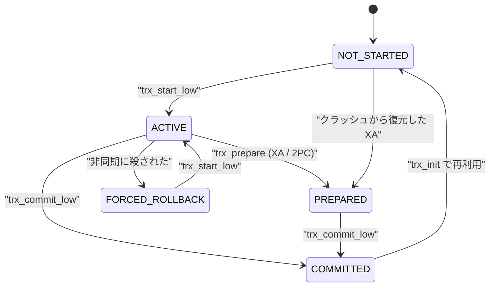

> **前提**: [MVCC](./mvcc-basics/) / [トランザクションの調停](./transaction-coordination/)

## この層の責務

この層の仕事は 3 つある。

1. **トランザクションに ID を割り当てる。** ただし**読むだけのトランザクションには ID を付けない**。書いた瞬間に初めて `trx_sys_allocate_trx_id()` を呼ぶ
2. **「今アクティブな書き込みトランザクション」の集合を維持する。** これが `trx_sys->rw_trx_ids` で、read view はこの配列のスナップショットを取る ([read view のページ](./read-view-and-visibility/))
3. **コミット / ロールバックの順序を決める。** どの順で「ID を集合から抜く」「状態を COMMITTED にする」「ロックを外す」を行うかが、他のトランザクションから見える一貫性を決める

上から見ると入口は [`transaction-coordination`](./transaction-coordination/) の `innobase_commit` / `innobase_xa_prepare` で、下は undo ログ・ロック・redo に繋がる。**このページは `trx_t` という 1 つの構造体の一生を追う**ことに徹し、undo の中身は[undo ログのページ](./undo-log/)、ロックの種類は[ロックのページ](./lock-modes-and-types/)に譲る。



この図は `trx0trx.h` の [`trx_t::state` のコメント (L748 以降)](https://github.com/mysql/mysql-server/blob/mysql-8.4.11/storage/innobase/include/trx0trx.h#L748) がもとになっている (`FORCED_ROLLBACK` を出入りする 2 本だけはコメントの遷移一覧になく、`trx_commit_in_memory` の [L2144](https://github.com/mysql/mysql-server/blob/mysql-8.4.11/storage/innobase/trx/trx0trx.cc#L2144) と `trx_start_low` から補った)。**`COMMITTED_IN_MEMORY` は終点ではなく `NOT_STARTED` に戻る**。`trx_t` はコネクションに紐づいてプールされ、次の文で再利用される。

## 主要な型とその関係

### `trx_t` — 1 セッション 1 つ

[`storage/innobase/include/trx0trx.h#L675`](https://github.com/mysql/mysql-server/blob/mysql-8.4.11/storage/innobase/include/trx0trx.h#L675) の `struct trx_t`。重要なフィールドだけ挙げる。

| フィールド                             | 意味                                                                                                            |
| -------------------------------------- | --------------------------------------------------------------------------------------------------------------- |
| `id`                                   | トランザクション ID。**read-only なら 0**                                                                       |
| `no`                                   | シリアライズ番号。コミット時に割り当てられ、purge の順序を決める                                                |
| `state`                                | `std::atomic<trx_state_t>`。上の図の 5 状態                                                                     |
| `isolation_level`                      | `trx_t::isolation_level_t`。`READ_UNCOMMITTED` / `READ_COMMITTED` / `REPEATABLE_READ` / `SERIALIZABLE`          |
| `read_view`                            | `ReadView*`。一貫読み取りのスナップショット                                                                     |
| `rsegs.m_redo` / `m_noredo`            | 割り当てられたロールバックセグメント (通常表用 / 一時表用)                                                      |
| `lock.trx_locks`                       | このトランザクションが持つ `lock_t` のリスト                                                                    |
| `lock.wait_lock` / `lock.blocking_trx` | 待っているロックと、待たせている相手                                                                            |
| `undo_no`                              | このトランザクションが書いた undo レコードの本数。ロールバック時のカウンタであり、victim 選択の重み計算にも使う |

`trx_state_t` 自体は [`include/trx0types.h#L80`](https://github.com/mysql/mysql-server/blob/mysql-8.4.11/storage/innobase/include/trx0types.h#L80) にある。

### 分離レベルは 4 つの述語に集約される

`isolation_level` を直接 `switch` するコードはほとんどない。代わりに `trx_t` の 4 つのメンバ関数が使われる。

```cpp title="storage/innobase/include/trx0trx.h"
  bool releases_gap_locks_at_prepare() const {
    return isolation_level <= READ_COMMITTED;
  }

  bool skip_gap_locks() const {
    switch (isolation_level) {
      case READ_UNCOMMITTED:
      case READ_COMMITTED:
        return (true);
      case REPEATABLE_READ:
      case SERIALIZABLE:
        return (false);
    }
    ut_d(ut_error);
    ut_o(return (false));
  }

  bool allow_semi_consistent() const { return (skip_gap_locks()); }
```

[`trx0trx.h#L1109-L1131`](https://github.com/mysql/mysql-server/blob/mysql-8.4.11/storage/innobase/include/trx0trx.h#L1109)。**RR と RC の差はほぼこの 4 つの述語に閉じている**。どこでどう効くかは [RR と RC のページ](./locking-in-rr-vs-rc/)。

### `trx_sys` — グローバルなトランザクション表

[`include/trx0sys.h`](https://github.com/mysql/mysql-server/blob/mysql-8.4.11/storage/innobase/include/trx0sys.h#L552) に `trx_sys_t` があり、この層で効くのは次の 4 つ。

- `next_trx_id_or_no` ([L495](https://github.com/mysql/mysql-server/blob/mysql-8.4.11/storage/innobase/include/trx0sys.h#L495)) — `std::atomic<trx_id_t>`。**ID と no は同じカウンタから配られる**
- `rw_trx_ids` ([L552](https://github.com/mysql/mysql-server/blob/mysql-8.4.11/storage/innobase/include/trx0sys.h#L552)) — アクティブな読み書きトランザクションの ID を昇順に並べた配列。read view のスナップショット元
- `serialisation_list` ([L510](https://github.com/mysql/mysql-server/blob/mysql-8.4.11/storage/innobase/include/trx0sys.h#L510)) — `trx->no` を貰ったがまだコミット mtr を書き終えていないトランザクション。purge が「どこまで消してよいか」を決めるのに使う
- `shards[TRX_SHARDS_N]` ([L557](https://github.com/mysql/mysql-server/blob/mysql-8.4.11/storage/innobase/include/trx0sys.h#L557)、`TRX_SHARDS_N = 256`) — ID → `trx_t*` の索引。256 分割されている

## 処理の流れ

### 開始 — ID をもらうのは書いたとき

[`trx_start_low` (`trx0trx.cc#L1304`)](https://github.com/mysql/mysql-server/blob/mysql-8.4.11/storage/innobase/trx/trx0trx.cc#L1304) が唯一の開始点。ここで分岐が 2 つある。

```cpp title="storage/innobase/trx/trx0trx.cc"
  if (!trx->read_only &&
      (trx->mysql_thd == nullptr || read_write || trx->ddl_operation)) {
    trx_assign_rseg_durable(trx);
    ...
    trx_sys_mutex_enter();

    trx->id = trx_sys_allocate_trx_id();

    trx_sys->rw_trx_ids.push_back(trx->id);
    ...
    trx_add_to_rw_trx_list(trx);

    trx->state.store(TRX_STATE_ACTIVE, std::memory_order_relaxed);
    ...
  } else {
    trx->id = 0;
```

読み書きになると分かっているときだけ ID を配る。そうでなければ [`trx->id = 0` (L1429)](https://github.com/mysql/mysql-server/blob/mysql-8.4.11/storage/innobase/trx/trx0trx.cc#L1429) のまま ACTIVE になる。**`trx->id == 0` は「まだ何も書いていない」の意味**だ。

後から書くことになったら、そのとき初めて ID が付く。一時表への書き込みなら [L1443](https://github.com/mysql/mysql-server/blob/mysql-8.4.11/storage/innobase/trx/trx0trx.cc#L1443)、一時表用ロールバックセグメントの割り当てなら [`trx_assign_rseg_temp` (L1283)](https://github.com/mysql/mysql-server/blob/mysql-8.4.11/storage/innobase/trx/trx0trx.cc#L1283) の中だ。いずれも `trx_sys_mutex` を取り、`rw_trx_ids` に push してから抜ける。

ID の払い出し自体は 2 行しかない。

```cpp title="storage/innobase/include/trx0sys.ic"
inline trx_id_t trx_sys_allocate_trx_id_or_no() {
  ut_ad(trx_sys_mutex_own() || trx_sys_serialisation_mutex_own());

  trx_id_t trx_id = trx_sys->next_trx_id_or_no.fetch_add(1);

  if (trx_id % trx_sys_get_trx_id_write_margin() == 0) {
```

[`trx0sys.ic#L236`](https://github.com/mysql/mysql-server/blob/mysql-8.4.11/storage/innobase/include/trx0sys.ic#L236)。256 個 (`TRX_SYS_TRX_ID_WRITE_MARGIN`) 進むごとにシステムページへ最大値を書き出す。だから**再起動すると ID は最大 256 飛ぶ**。`trx_sys_allocate_trx_id` ([L258](https://github.com/mysql/mysql-server/blob/mysql-8.4.11/storage/innobase/include/trx0sys.ic#L258)) はこれを `trx_sys_mutex` 前提で呼ぶ薄いラッパで、`trx_assign_id_for_rw` のような関数は存在しない。

### 実行中 — read view とロックが積み上がる

一貫読み取りが最初に必要になった時点で [`trx_assign_read_view` (`trx0trx.cc#L2319`)](https://github.com/mysql/mysql-server/blob/mysql-8.4.11/storage/innobase/trx/trx0trx.cc#L2319) が `MVCC::view_open` を呼び、`trx->read_view` にスナップショットが入る。**REPEATABLE READ ではこれが 1 回だけ起き、以降のすべての読みが同じ view を使う。** READ COMMITTED では文の境界で view を閉じるので毎回作り直される ([read view のページ](./read-view-and-visibility/))。

ロックを取ると `lock_t` が `trx->lock.trx_locks` に繋がる。ロックが取れなければ `trx->lock.wait_lock` と `trx->lock.blocking_trx` が埋まり、スレッドは [`lock_wait_suspend_thread` (`lock0wait.cc#L206`)](https://github.com/mysql/mysql-server/blob/mysql-8.4.11/storage/innobase/lock/lock0wait.cc#L206) で眠る。

### PREPARE — 2 相コミットの片割れ

binlog が有効なら [`ha_prepare_low`](./life-of-an-update/) 経由で [`trx_prepare_for_mysql` (`trx0trx.cc#L3118`)](https://github.com/mysql/mysql-server/blob/mysql-8.4.11/storage/innobase/trx/trx0trx.cc#L3118) → [`trx_prepare` (L2989)](https://github.com/mysql/mysql-server/blob/mysql-8.4.11/storage/innobase/trx/trx0trx.cc#L2989) が呼ばれる。やることは 3 つ。

1. undo ログセグメントの状態を `TRX_UNDO_ACTIVE` から `TRX_UNDO_PREPARED` に変える (`trx_prepare_low`)
2. `trx_sys_mutex` を取って `state` を `TRX_STATE_PREPARED` にし、`n_prepared_trx` を増やす
3. **RC 以下なら、ここでギャップロックだけ先に解放する**

3 番目はこう書かれている。

```cpp title="storage/innobase/trx/trx0trx.cc"
  /* Release read locks after PREPARE for READ COMMITTED
  and lower isolation. */
  if (trx->releases_gap_locks_at_prepare()) {
    /* Stop inheriting GAP locks. */
    trx->skip_lock_inheritance = true;

    /* Release only GAP locks for now. */
    lock_trx_release_read_locks(trx, true);
  }
```

[L3024-L3032](https://github.com/mysql/mysql-server/blob/mysql-8.4.11/storage/innobase/trx/trx0trx.cc#L3024)。RR ではこの分岐に入らない。

### コミット — 順序がすべて

[`trx_commit` (L2257)](https://github.com/mysql/mysql-server/blob/mysql-8.4.11/storage/innobase/trx/trx0trx.cc#L2257) → [`trx_commit_low` (L2165)](https://github.com/mysql/mysql-server/blob/mysql-8.4.11/storage/innobase/trx/trx0trx.cc#L2165) → `trx_write_serialisation_history` → `mtr_commit` → [`trx_commit_in_memory` (L1963)](https://github.com/mysql/mysql-server/blob/mysql-8.4.11/storage/innobase/trx/trx0trx.cc#L1963)。

`trx_commit_in_memory` の中で読み書きトランザクションが通るのは [`trx_release_impl_and_expl_locks` (L1857)](https://github.com/mysql/mysql-server/blob/mysql-8.4.11/storage/innobase/trx/trx0trx.cc#L1857) で、ここが**この章でもっとも順序が重要な関数**だ。

1. `trx_sys_mutex` を取り、[`trx_erase_lists` (L1834)](https://github.com/mysql/mysql-server/blob/mysql-8.4.11/storage/innobase/trx/trx0trx.cc#L1834) で `rw_trx_ids` から自分の ID を消す。**この瞬間以降に作られた read view は、このトランザクションを「アクティブでない」と見る**。同じ関数の中で `read_view` も閉じられる。ここまでで `trx_sys_mutex` は手放す ([L1893](https://github.com/mysql/mysql-server/blob/mysql-8.4.11/storage/innobase/trx/trx0trx.cc#L1893))
2. `trx_sys_mutex` を持たない状態で、Trx_shard の mutex と `trx->mutex` をこの順に取って `state` を `TRX_STATE_COMMITTED_IN_MEMORY` にし、shard の索引から自分を消す。ソースのコメントいわく「**この一点を、暗黙ロックが解放された瞬間と考えてほしい**」
3. `serialisation_list` から抜ける
4. 最後に [`lock_trx_release_locks` (`lock0lock.cc#L5904`)](https://github.com/mysql/mysql-server/blob/mysql-8.4.11/storage/innobase/lock/lock0lock.cc#L5904) で**明示ロック**を解放する

つまり**暗黙ロックが先に消え、明示ロックが後に消える**。この順序については[コミットとロールバックのページ](./commit-and-rollback-internals/)で詳しく扱う。

### ロールバック — 最後は commit する

[`trx_rollback_to_savepoint_low` (`trx0roll.cc#L79`)](https://github.com/mysql/mysql-server/blob/mysql-8.4.11/storage/innobase/trx/trx0roll.cc#L79) が undo レコードを新しい順に取り出して逆適用する。完全ロールバックのときだけ [`trx_rollback_finish` (L1101)](https://github.com/mysql/mysql-server/blob/mysql-8.4.11/storage/innobase/trx/trx0roll.cc#L1101) が呼ばれ、その中身は `trx_commit(trx)` だ。**ロールバックの出口はコミットと同じ**で、だからロックもそこで初めて外れる。

## 守られている不変条件

### `trx->id == 0` なら行を 1 つも書いていない

読むだけのトランザクションは ID を持たないので、`DB_TRX_ID` に自分の ID が入ることもなく、暗黙ロックの持ち主にもなれない。`trx_commit_in_memory` の read-only 経路には `ut_ad(trx->id == 0)` と `ut_a(UT_LIST_GET_LEN(trx->lock.trx_locks) == 0)` が並んでいる。

### ACTIVE → PREPARED は `trx_sys->mutex`、COMMITTED への遷移は `trx->mutex`

`trx0trx.h` の状態コメントが 2 つを別々に書いている。「ACTIVE→PREPARED の遷移は `trx_sys->mutex` で保護される」 ([L789](https://github.com/mysql/mysql-server/blob/mysql-8.4.11/storage/innobase/include/trx0trx.h#L789))、「COMMITTED への遷移は `trx->mutex` で保護される」 ([L794](https://github.com/mysql/mysql-server/blob/mysql-8.4.11/storage/innobase/include/trx0trx.h#L794))。**コミット側は `trx_sys->mutex` を持ったまま状態を変えるのではない**——上で見たとおり `rw_trx_ids` から抜けた時点で手放し、そのあと Trx_shard の mutex と `trx->mutex` で state を書き換える。read-only の AC-NL-RO トランザクションだけは mutex なしで状態を動かす。**そのため `SHOW ENGINE INNODB STATUS` が read-only トランザクションの状態を一瞬ちぐはぐに表示することがある**のは、ソースが自認している既知の割り切りだ。

### `rw_trx_ids` からの削除はロック解放より先

`trx_release_impl_and_expl_locks` のコメントがこう書いている。「一貫スナップショットのために、コミットしロックを解放する前に、現在のトランザクションを実行中トランザクション ID リストから外す必要がある」。逆順にすると「ロックは取れたのに、そのトランザクションの変更はまだ見えない」という状態が生まれる。

### `serialisation_list` からの削除は `rw_trx_ids` からの削除より後

こちらもソースにコメントがある。先に外すと「この変更は見えない」と主張する read view が作られた後で、その版を作るための undo が purge されうる。

### `trx->no` と commit LSN の順序は一致しないことがある

`trx_commit_low` のコメント (L2208 付近) が明示している。ロールバックセグメントが違えば `trx->no` の順とコミット LSN の順はずれる。ただし「T2 が T1 の変更を見られるなら、T2 の `no` と LSN は必ず T1 より大きい」ことは保証される。

## つまずきどころ

### 「BEGIN した瞬間にスナップショットが取れる」ではない

`BEGIN` / `START TRANSACTION` は `trx_start_low` すら呼ばないことがある。read view が作られるのは**最初の一貫読み取りのとき**だ。明示的に始点を固定したければ `START TRANSACTION WITH CONSISTENT SNAPSHOT` を使う。ただしこれは [`innobase_start_trx_and_assign_read_view` (`ha_innodb.cc#L5965`)](https://github.com/mysql/mysql-server/blob/mysql-8.4.11/storage/innobase/handler/ha_innodb.cc#L5965) で **REPEATABLE READ のときしか効かない**。RC では警告を出して無視される。

### `SHOW ENGINE INNODB STATUS` の trx id が飛ぶ

`next_trx_id_or_no` は ID と `no` の**両方**を同じカウンタから配る。さらに再起動で最大 256 飛ぶ。連番として意味を読み取ろうとしないほうがよい。

### PREPARED のまま残るトランザクションがある

クライアントが `XA PREPARE` の後に切断すると、`trx_t` は PREPARED のまま残る。`state` コメントの「XA (2PC) (shutdown or disconnect before ROLLBACK or COMMIT)」がそれだ。この状態のトランザクションはロックを持ち続けるので、`XA RECOVER` で拾って明示的に片付ける必要がある。

### 「read-only トランザクションだからロックを取らない」わけではない

`trx->read_only` は「このトランザクションは書かない」という宣言であって、`SELECT ... FOR SHARE` のようなロック読みは別だ。`trx_start_low` は `trx->will_lock` を見て read-only 扱いを取り下げる。ロックを取る `SELECT` を投げれば ID も付く。

### `trx_t` は使い回される

`trx_commit_in_memory` の末尾で `trx_init(trx)` が呼ばれ、同じ構造体が次の文で再利用される。次に `trx_start_low` を通るとき `++trx->version` されるのは、この使い回しを識別するためだ。デッドロック検出のスナップショットが「同じポインタだが別のトランザクション」を掴んでしまう ABA 問題は、待ちスロットの `slot->reservation_no` を比較して避けている ([デッドロック検出のページ](./deadlock-detection/))。
