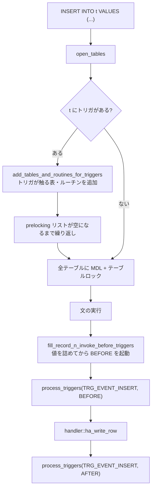

> **前提**: [handler](./handler-walkthrough/) / [sql_mode と厳格モード](./sql-mode-and-strict/) / [MDL](./metadata-locking/)

## 何を学んだか

トリガの一番大きな影響は、実行時ではなく**テーブルを開く段階**に出る。

```cpp title="sql/sql_base.cc"
  if (table_list->trg_event_map) {
    if (table_list->table->triggers) {
      *need_prelocking = true;

      if (table_list->table->triggers->add_tables_and_routines_for_triggers(
              thd, prelocking_ctx, table_list))
        return true;
    }
```

[`DML_prelocking_strategy::handle_table` (`sql/sql_base.cc#L6281`)](https://github.com/mysql/mysql-server/blob/mysql-8.4.11/sql/sql_base.cc#L6281)。**トリガが触るテーブルとルーチンは、文が始まる前に全部開かれてロックされる。**

- **prelocking のせいで、1 テーブルへの `INSERT` が何枚もの MDL を取る。** トリガが参照する先も、そのまた先も
- **トリガは作成時の `sql_mode` と文字セットで固定される。** 実行しているセッションの設定ではない
- **外部キーのカスケードからはトリガが呼ばれない。** InnoDB の中で完結するため ([外部キー](./foreign-keys/))
- **ストアドプログラムは接続ごとにキャッシュされる。** 一度呼ばれた `sp_head` はその接続が終わるまで残る
- **`max_sp_recursion_depth` の既定は 0。** ストアドプロシージャの再帰は既定で禁止されている



## なぜそうなっているか

**prelocking が要るのは、文の途中で新しいテーブルを開けないからだ。** テーブルを開くには MDL が要り、MDL は文の途中で取ると順序が保証できずデッドロックの原因になる ([MDL](./metadata-locking/))。だから「この文が触りうるテーブル」を実行前に全部確定させ、まとめてロックする。トリガの本体は静的な SQL なので、参照先を先に列挙できる。

**作成時の `sql_mode` を固定するのは、トリガの意味を安定させるためだ。** トリガを書いた人は自分の `sql_mode` を前提にしている。実行するセッションの `sql_mode` で動くと、同じトリガが接続ごとに違う挙動になる。文字セットと照合順序についても同じで、`Trigger_creation_ctx` が作成時の `character_set_client` / `collation_connection` / データベースの照合順序を持ち回る。

**外部キーのカスケードでトリガが起動しないのは、カスケードが InnoDB の中で完結するからだ。** SQL 層に戻らないので、`process_triggers` を呼ぶ場所がない。これは設計上の選択というより、層をまたがない実装を選んだことの帰結になる。

**ストアドプログラムを接続ごとにキャッシュするのは、`sp_head` がスレッド間で共有できないからだ。** 中身は `Item` ツリーと実行時の変数領域を含む構造で、`TABLE` と同じ理由で共有できない。

## ソースコードのどこか

### トリガの起動点

```cpp title="sql/table_trigger_dispatcher.cc"
bool Table_trigger_dispatcher::process_triggers(
    THD *thd, enum_trigger_event_type event,
    enum_trigger_action_time_type action_time, bool old_row_is_record1) {
  if (check_for_broken_triggers()) return true;

  Trigger_chain *tc = get_triggers(event, action_time);

  if (!tc) return false;
  ...
  /*
    This trigger must have been processed by the pre-locking
    algorithm.
  */
  assert(m_subject_table->pos_in_table_list->trg_event_map &
         static_cast<uint>(1 << static_cast<int>(event)));

  const bool rc = tc->execute_triggers(thd);
```

[`sql/table_trigger_dispatcher.cc#L517`](https://github.com/mysql/mysql-server/blob/mysql-8.4.11/sql/table_trigger_dispatcher.cc#L517)。**イベント (INSERT/UPDATE/DELETE) と時点 (BEFORE/AFTER) の組ごとに `Trigger_chain` が 1 本**あり、同じ組に複数のトリガがあれば `FOLLOWS` / `PRECEDES` で決まった順に並ぶ。

`assert` が「この経路に来た以上、prelocking を通っているはず」と宣言している。トリガの起動と prelocking は 1 対 1 に対応する。

`old_row_is_record1` で `OLD` と `NEW` の指す先を入れ替えているのが実装の要点だ。**`OLD.col` と `NEW.col` は別のバッファではなく、`record[0]` と `record[1]` のどちらを見るかの切り替え**でしかない ([行フォーマット変換](./row-format-conversion/))。

書き込み経路からは、値を詰めるのと一緒に呼ばれる。

```cpp title="sql/sql_base.cc"
bool fill_record_n_invoke_before_triggers(
```

[`sql/sql_base.cc#L9977`](https://github.com/mysql/mysql-server/blob/mysql-8.4.11/sql/sql_base.cc#L9977)。名前のとおり「値を詰めてから BEFORE トリガを呼ぶ」が 1 つの関数になっている。**BEFORE トリガが `NEW.col` を書き換えられるのは、この順序のおかげ**だ。

### 作成時の文脈が凍結される

トリガを読み込むとき、`sql_mode` を差し替えてパースし、元に戻す。

```cpp title="sql/trigger.cc"
  Trigger_creation_ctx *creation_ctx = Trigger_creation_ctx::create(
      thd, m_db_name, m_subject_table_name, m_client_cs_name,
      m_connection_cl_name, m_db_cl_name);
  bool parse_error = false;
  if (creation_ctx != nullptr)
    parse_error = parse_sql(thd, &parser_state, creation_ctx);

  thd->m_digest = digest_saved;
  thd->m_statement_psi = statement_locker_saved;
  thd->sp_runtime_ctx = sp_runtime_ctx_saved;
  thd->variables.sql_mode = sql_mode_saved;
```

[`sql/trigger.cc#L488`](https://github.com/mysql/mysql-server/blob/mysql-8.4.11/sql/trigger.cc#L488)。`m_client_cs_name` / `m_connection_cl_name` / `m_db_cl_name` の 3 つが `CREATE TRIGGER` した時点の文字セット設定で、`Trigger` オブジェクトに保存されている ([`sql/trigger.h#L286`](https://github.com/mysql/mysql-server/blob/mysql-8.4.11/sql/trigger.h#L286) に `m_sql_mode`)。

**`sql_mode` を変えても、既存のトリガの挙動は変わらない。** 変えたいなら作り直すしかない。`SHOW TRIGGERS` に `sql_mode` 列があるのはこのためだ。

同じ関数で、パース中は診断の PSI とダイジェストが `nullptr` に落とされる。**トリガの中の文は `events_statements_summary_by_digest` に別の行として現れない** ([ダイジェスト](./statement-digest/))。トリガの重い処理は、呼び出し元の文の時間として計上される。

### 厳格モードの扱い

トリガの中では、`SELECT` や `SET` にも厳格モードが効く。

```cpp title="sql/sp_instr.cc"
  Strict_error_handler strict_handler(
      Strict_error_handler::ENABLE_SET_SELECT_STRICT_ERROR_HANDLER);
```

[`sql/sp_instr.cc#L1138`](https://github.com/mysql/mysql-server/blob/mysql-8.4.11/sql/sp_instr.cc#L1138)。[sql_mode のページ](./sql-mode-and-strict/)で見た `m_set_select_behavior` の `ENABLE` 側がこれだ。**同じ `SET @x = 1/0` が、直接実行なら警告、ストアドプログラムの中ならエラーになる。**

### ストアドプログラムのキャッシュ

```cpp title="sql/sp_cache.h"
/*
  Stored procedures/functions cache. This is used as follows:
   * Each thread has its own cache.
   * Each sp_head object is put into its thread cache before it is used, and
     then remains in the cache until deleted.
*/
```

[`sql/sp_cache.h#L33`](https://github.com/mysql/mysql-server/blob/mysql-8.4.11/sql/sp_cache.h#L33)。`THD` は 2 本持つ。

```cpp title="sql/sql_class.h"
  sp_cache *sp_proc_cache;
  sp_cache *sp_func_cache;
```

[`sql/sql_class.h#L2838`](https://github.com/mysql/mysql-server/blob/mysql-8.4.11/sql/sql_class.h#L2838)。上限は緩い。

```cpp title="sql/sys_vars.cc"
static Sys_var_ulong Sys_sp_cache_size(
    "stored_program_cache",
    "The soft upper limit for number of cached stored routines for "
    "one connection.",
    GLOBAL_VAR(stored_program_cache_size), CMD_LINE(REQUIRED_ARG),
    VALID_RANGE(16, 512 * 1024), DEFAULT(256), BLOCK_SIZE(1));
```

[`sql/sys_vars.cc#L6341`](https://github.com/mysql/mysql-server/blob/mysql-8.4.11/sql/sys_vars.cc#L6341)。**`soft upper limit` で、しかも「1 接続あたり」**。ルーチン数 × 接続数のぶんだけ `sp_head` がメモリに載りうる。

再帰の既定は禁止になっている。

```cpp title="sql/sys_vars.cc"
static Sys_var_ulong Sys_max_sp_recursion_depth(
    "max_sp_recursion_depth", "Maximum stored procedure recursion depth",
    SESSION_VAR(max_sp_recursion_depth), CMD_LINE(OPT_ARG), VALID_RANGE(0, 255),
    DEFAULT(0), BLOCK_SIZE(1));
```

[`sql/sys_vars.cc#L2965`](https://github.com/mysql/mysql-server/blob/mysql-8.4.11/sql/sys_vars.cc#L2965)。0 = 再帰なし。再帰のたびに `sp_head` の実行時インスタンスが増えるので、無制限にするとメモリを食う。

## どう活かすか

### トリガのあるテーブルへの書き込みは、ロックの範囲が広がる

prelocking はトリガが参照するテーブルを全部開いてロックする。しかも再帰的で、参照先のテーブルにもトリガがあればそのまた参照先まで広がる。

これが効いてくるのは 2 か所だ。

- **MDL の範囲** — 参照先テーブルへの `ALTER` が、トリガ経由で書き込みをしている文と衝突する ([MDL](./metadata-locking/))
- **デッドロックの経路** — 直接触っていないテーブルが、待ちグラフに現れる

`SHOW ENGINE INNODB STATUS` のデッドロック情報に、クエリに出てこないテーブルが登場したら、トリガの参照先を疑う。

### トリガはロールバックの単位に含まれる

トリガはその文と同じトランザクションで動く。トリガの中でエラーになれば、文全体が失敗する。**トリガの中で `COMMIT` はできない**ので、「トリガで別テーブルに記録して、記録だけは残す」という設計は成立しない。監査ログをトリガで書くなら、本体がロールバックすればログも消えることを前提にする。

### `sql_mode` を変えたら、トリガとストアドプログラムを作り直す

`sql_mode` は作成時に凍結される。移行で `sql_mode` を厳しくしても、既存のトリガとストアドプログラムは古いモードで動き続ける。

```sql
SELECT trigger_schema, trigger_name, sql_mode FROM information_schema.triggers;
SELECT routine_schema, routine_name, sql_mode FROM information_schema.routines;
```

文字セットも同じで、`character_set_client` が古い設定のまま凍結される。**5.7 から 8.0 に上げた環境で、トリガの中でだけ文字化けする**という症状はここから来る ([文字セットと照合順序](./charset-and-collation/))。

### トリガの中の処理は、性能の計測から消える

パース時に PSI とダイジェストが切られるので、トリガ内部の文は `events_statements_summary_by_digest` に独立した行として現れない。**「この `INSERT` が遅い」の原因がトリガでも、ダイジェストからは見えない。** `performance_schema.events_statements_history` の入れ子イベントを見るか、トリガを外して比較するしかない。

### ストアドプログラムはコネクションプールでメモリを食う

`sp_head` は接続ごとにキャッシュされ、その接続が切れるまで残る。**接続 200 本のプールで 10 個のプロシージャを使えば、2000 個の `sp_head` が生きる。** `stored_program_cache` は「1 接続あたり」の soft limit なので、全体の上限にはならない。

長寿命の接続をプールで使い回す構成では、メモリの内訳を見るときにここも数える ([コネクションプールとセッション状態](./connection-pool-and-session-state/))。

### 一般化して持ち帰るもの

**「実行時に何を触るか」を実行前に確定させる**というのが prelocking の考え方だ。動的に資源を取りに行くとデッドロックの順序が保証できないので、静的に列挙できる範囲で先に全部取る。トリガの本体が静的な SQL に限られている (動的 SQL を書けない) のは、この列挙を可能にするための制約でもある。

もう 1 つは、**コードを保存するときは実行環境も一緒に保存する**という判断だ。`sql_mode` と文字セットを凍結しなければ、同じトリガが接続ごとに違う動きをする。ただし凍結は「後から設定を変えても追随しない」という別の驚きを生む。どちらを取っても驚きは残るので、**凍結した値を `information_schema` から読めるようにしてある**ことのほうが実務では効く。
