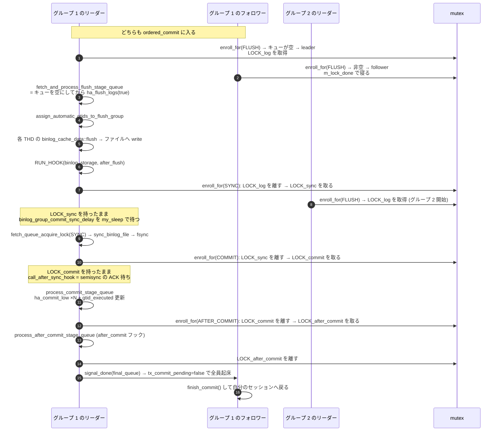

## 何を学んだか

`log_bin=ON` の InnoDB では、`COMMIT` は必ず 2 相コミットになる。参加者は InnoDB と binlog の 2 つで、調停者 (`TC_LOG`) は binlog 自身だ。順序は固定されている。

1. **prepare** — InnoDB に XA PREPARE させる。redo に prepare レコードと XID が残る
2. **binlog へ書いて `fsync`** — ここを通過したトランザクションは「コミット済み」と見なされる
3. **commit** — InnoDB のトランザクションをコミットし、ロックを外す

**この順序の意味は「binlog に出たものは必ず InnoDB でも生き残る」を保証すること**にある。クラッシュリカバリは binlog をスキャンして XID を集め、InnoDB 側の prepare 済みトランザクションのうち binlog に XID があるものをコミット、ないものをロールバックする。逆順 (InnoDB が先) だと「source ではコミットされたのにレプリカに送られていない」トランザクションが生まれてしまう。

そして、この 3 段を 1 セッションずつ律儀にやると `fsync` が接続数だけ発生する。そこで**同時にコミットしようとしているセッションを 1 本のリーダーがまとめて処理する**のがグループコミットだ。実装は [`MYSQL_BIN_LOG::ordered_commit` (`binlog.cc#L8924`)](https://github.com/mysql/mysql-server/blob/mysql-8.4.11/sql/binlog.cc#L8924) にある。

ここで最初に押さえるべき事実。**ステージは 3 つではなく、StageID が 5 つある。**

```cpp title="sql/rpl_commit_stage_manager.h"
  enum StageID {
    BINLOG_FLUSH_STAGE,
    SYNC_STAGE,
    COMMIT_STAGE,
    AFTER_COMMIT_STAGE,
    COMMIT_ORDER_FLUSH_STAGE,
    STAGE_COUNTER
  };
```

`AFTER_COMMIT_STAGE` は **`after_commit` フックを `LOCK_commit` とは別の mutex で回すためだけに存在する**。`COMMIT_ORDER_FLUSH_STAGE` は binlog を持たないレプリカのアプライヤ専用で、`BINLOG_FLUSH_STAGE` と mutex を共有する。

## ソースコードのどこか

### prepare — なぜここで `fsync` しないのか

[`MYSQL_BIN_LOG::prepare` (L8083)](https://github.com/mysql/mysql-server/blob/mysql-8.4.11/sql/binlog.cc#L8083)。

```cpp title="sql/binlog.cc"
  thd->durability_property = HA_IGNORE_DURABILITY;

  CONDITIONAL_SYNC_POINT_FOR_TIMESTAMP("before_prepare_in_engines");
  int error = ha_prepare_low(thd, all);
```

コメントが目的をそのまま書いている。

```cpp title="sql/binlog.cc"
    Set HA_IGNORE_DURABILITY to not flush the prepared record of the
    transaction to the log of storage engine (for example, InnoDB
    redo log) during the prepare phase. So that we can flush prepared
    records of transactions to the log of storage engine in a group
    right before flushing them to binary log during binlog group
    commit flush stage.
```

**prepare の耐久化はセッション単位ではやらず、flush ステージのリーダーがグループ全体ぶんを 1 回で行う。** その 1 回が `ha_flush_logs(true)` だ ([`fetch_and_process_flush_stage_queue` (L8477)](https://github.com/mysql/mysql-server/blob/mysql-8.4.11/sql/binlog.cc#L8477))。

### キューとリーダー選出 — `enroll_for`

ステージ間の遷移はすべて [`change_stage` (L8680)](https://github.com/mysql/mysql-server/blob/mysql-8.4.11/sql/binlog.cc#L8680) → [`Commit_stage_manager::enroll_for` (`rpl_commit_stage_manager.cc#L238`)](https://github.com/mysql/mysql-server/blob/mysql-8.4.11/sql/rpl_commit_stage_manager.cc#L238) を通る。中で起きることの順序が重要だ。

1. `lock_queue(stage)` してキューに `THD` を繋ぐ。**キューが空だったスレッドがリーダー**
2. `unlock_queue(stage)`
3. `if (stage_mutex) mysql_mutex_unlock(stage_mutex);` — **前のステージの mutex を離す**
4. フォロワーなら `m_lock_done` を取って `m_stage_cond_binlog` で寝る
5. リーダーなら `mysql_mutex_lock(enter_mutex)` — **次のステージの mutex を取る**

```cpp title="sql/rpl_commit_stage_manager.cc"
  if (!leader) {
    CONDITIONAL_SYNC_POINT_FOR_TIMESTAMP("before_follower_wait");
    mysql_mutex_lock(&m_lock_done);
    ...
    while (thd->tx_commit_pending) {
      if (stage == COMMIT_ORDER_FLUSH_STAGE) {
        mysql_cond_wait(&m_stage_cond_commit_order, &m_lock_done);
      } else {
        mysql_cond_wait(&m_stage_cond_binlog, &m_lock_done);
      }
    }
```

**3 と 5 の順序が「離してから取る」であることが、この機構の全部だ。** 2 本のステージ mutex を同時に持つ瞬間がないので、ステージ間でデッドロックが起きない。そして**前のステージの mutex が空くので、次のグループがそのステージを始められる**。パイプライン化はここから来ている。

キューは `THD::next_to_commit` で繋いだ単方向リストで、リーダーは `fetch_queue_acquire_lock` でリスト全体を一度に切り取って空にする ([`.cc#L479`](https://github.com/mysql/mysql-server/blob/mysql-8.4.11/sql/rpl_commit_stage_manager.cc#L479))。

### 5 つのステージを 1 本の時間軸で



**この図で一番間違えやすいのは、`call_after_sync_hook` の位置だ。** 名前は "after sync" だが、呼ばれるのは `LOCK_sync` を離して `LOCK_commit` を取った**後**、`ha_commit_low` を呼ぶ**前**である。

```cpp title="sql/binlog.cc"
    if (change_stage(thd, Commit_stage_manager::COMMIT_STAGE, final_queue,
                     leave_mutex_before_commit_stage, &LOCK_commit)) {
      ...
    }
    THD *commit_queue =
        Commit_stage_manager::get_instance().fetch_queue_acquire_lock(
            Commit_stage_manager::COMMIT_STAGE);
    ...
    if (flush_error == 0 && sync_error == 0)
      sync_error = call_after_sync_hook(commit_queue);
    ...
    process_commit_stage_queue(thd, commit_queue);
```

半同期の既定 wait point (`AFTER_SYNC`) はこのフックに繋がっている。つまり **`LOCK_commit` を握ったままレプリカの ACK を待つ** ([半同期レプリケーション](./semi-sync/))。

### `binlog_order_commits=OFF` で消えるもの

commit ステージと after commit ステージは、`if` の中にまるごと入っている。

```cpp title="sql/binlog.cc"
commit_stage:
  /* Clone needs binlog commit order. */
  if ((opt_binlog_order_commits || Clone_handler::need_commit_order()) &&
      (sync_error == 0 || binlog_error_action != ABORT_SERVER)) {
```

`else` 側はこうだ。

```cpp title="sql/binlog.cc"
  } else {
    if (leave_mutex_before_commit_stage)
      mysql_mutex_unlock(leave_mutex_before_commit_stage);
    if (flush_error == 0 && sync_error == 0)
      sync_error = call_after_sync_hook(final_queue);
  }
```

**`OFF` にすると `LOCK_sync` を離してから `call_after_sync_hook` を呼ぶので、半同期の待ちはステージ mutex を持たない状態になる。** 代わりに `ha_commit_low` は各セッションが `finish_commit` の中で自分で呼ぶ ([L8795](https://github.com/mysql/mysql-server/blob/mysql-8.4.11/sql/binlog.cc#L8795))。**InnoDB のコミット順序が binlog の順序と一致しなくなる**のはこのためだ。`binlog_order_commits` の既定は `ON` ([`sys_vars.cc#L1699`](https://github.com/mysql/mysql-server/blob/mysql-8.4.11/sql/sys_vars.cc#L1699))。

### 4 本の mutex と 5 つの stage

キューの mutex は `STAGE_COUNTER - 1` = 4 本しかない ([`rpl_commit_stage_manager.h#L466`](https://github.com/mysql/mysql-server/blob/mysql-8.4.11/sql/rpl_commit_stage_manager.h#L466))。

```cpp title="sql/rpl_commit_stage_manager.cc"
  m_queue[BINLOG_FLUSH_STAGE].init(&m_queue_lock[BINLOG_FLUSH_STAGE]);
  m_queue[SYNC_STAGE].init(&m_queue_lock[SYNC_STAGE]);
  m_queue[COMMIT_STAGE].init(&m_queue_lock[COMMIT_STAGE]);
  m_queue[AFTER_COMMIT_STAGE].init(&m_queue_lock[AFTER_COMMIT_STAGE]);
  m_queue[COMMIT_ORDER_FLUSH_STAGE].init(&m_queue_lock[BINLOG_FLUSH_STAGE]);
```

`COMMIT_ORDER_FLUSH_STAGE` が `BINLOG_FLUSH_STAGE` の mutex を共有しているのは、**この 2 つのキューを 1 つの原子的な操作で見る必要がある**からだ。使うのは「binlog を無効にしたレプリカで `replica_preserve_commit_order=ON` にしている」構成で、アプライヤの worker がこのキューに並ぶ ([`Commit_order_manager::flush_engine_and_signal_threads` (`rpl_replica_commit_order_manager.cc#L335`)](https://github.com/mysql/mysql-server/blob/mysql-8.4.11/sql/rpl_replica_commit_order_manager.cc#L335))。

2 つのキューが同時に空でないとき、リーダーの譲り渡しが起きる。`enroll_for` の中にその理由がコメントで書かれている。

```cpp title="sql/rpl_commit_stage_manager.cc"
        The reason we need to change leader is that the commit order leader
        cannot be leader for binlog threads, since commit order threads have to
        leave the commit group before the binlog threads are done.
```

commit order 側の worker は「エンジンへ flush して次の worker を解放する」までしかやらないので、binlog グループの最後まで付き合えない。だから binlog スレッドが来たらリーダーを譲る。

### `binlog_group_commit_sync_delay` が効く条件

```cpp title="sql/binlog.cc"
  if (!flush_error && (sync_counter + 1 >= get_sync_period()))
    Commit_stage_manager::get_instance().wait_count_or_timeout(
        opt_binlog_group_commit_sync_no_delay_count,
        opt_binlog_group_commit_sync_delay, Commit_stage_manager::SYNC_STAGE);
```

`get_sync_period()` は `sync_binlog` の値。**このグループで実際に `fsync` する番でなければ待たない。** `sync_binlog=1000` なら 1000 グループに 1 回しか待たない。`sync_binlog=0` のときは `get_sync_period()` が 0 なので条件が常に真になり、毎グループ待つ (コード中のコメントが「特別扱い」と明記している)。

待ち方は condvar ではなく `my_sleep` のポーリングだ ([`.cc#L456`](https://github.com/mysql/mysql-server/blob/mysql-8.4.11/sql/rpl_commit_stage_manager.cc#L456))。

```cpp title="sql/rpl_commit_stage_manager.cc"
  while (
      to_wait > 0 &&
      (count == 0 || static_cast<ulong>(m_queue[stage].get_size()) < count)) {
    ...
    my_sleep(delta);
    to_wait -= delta;
  }
```

`binlog_group_commit_sync_no_delay_count` に達したら打ち切る。**この待ちの間、リーダーは `LOCK_sync` を持ったままだ**が、`LOCK_log` は既に離しているので次のグループの flush は進む。

### `binlog_max_flush_queue_time` は無効

```cpp title="sql/sys_vars.cc"
static Sys_var_int32 Sys_binlog_max_flush_queue_time(
    "binlog_max_flush_queue_time",
    ...
    VALID_RANGE(0, 100000), DEFAULT(0), BLOCK_SIZE(1), NO_MUTEX_GUARD,
    NOT_IN_BINLOG, ON_CHECK(nullptr), ON_UPDATE(nullptr), DEPRECATED_VAR(""));
```

`opt_binlog_max_flush_queue_time` を読むコードは `binlog.cc` に 1 箇所もない。参照は `sys_vars.cc` の定義と `mysqld.cc` の非推奨警告だけだ。**変数は残っているが挙動には影響しない。**

### クラッシュリカバリ — XID の突き合わせ

`sql/binlog/recovery.cc` は 63 行しかない。核心はこれだけだ。

```cpp title="sql/binlog/recovery.cc"
binlog::Binlog_recovery &binlog::Binlog_recovery::recover() {
  process_logs(m_reader);
  if (!this->is_log_malformed() && total_ha_2pc > 1) {
    Xa_state_list xa_list{this->m_external_xids};
    this->m_no_engine_recovery = ha_recover(&this->m_internal_xids, &xa_list);
    if (this->m_no_engine_recovery) {
      this->m_failure_message.assign("Recovery failed in storage engines");
    }
  }
  return (*this);
}
```

`process_logs` の実体は [`sql/binlog/log_sanitizer_impl.hpp`](https://github.com/mysql/mysql-server/blob/mysql-8.4.11/sql/binlog/log_sanitizer_impl.hpp) のテンプレートで、最後の binlog ファイルを頭から舐めて `XID_EVENT` / `QUERY_EVENT` / `XA_PREPARE_LOG_EVENT` / `ROTATE_EVENT` だけを見る。やることは 2 つ。

- `m_internal_xids` に XID を集める
- **トランザクション境界にいるときのファイル位置を `m_valid_pos` に記録し続ける**

```cpp title="sql/binlog/log_sanitizer_impl.hpp"
    // Whenever the current position is at a transaction boundary, save it
    // to m_valid_pos
    if (!this->m_is_malformed && !this->m_in_transaction &&
        !is_any_gtid_event(ev.get()) && !is_session_control_event(ev.get()) &&
        m_validation_started) {
      this->m_valid_pos = reader.position();
```

呼び出し側 ([`MYSQL_BIN_LOG::open_binlog` (L7910)](https://github.com/mysql/mysql-server/blob/mysql-8.4.11/sql/binlog.cc#L7910)) は、この `valid_pos` でファイルを切り詰める。**半分だけ書かれたトランザクションはファイルごと捨てられる。**

**`total_ha_2pc > 1` の条件が「2PC エンジンが 1 つならエンジン側リカバリを飛ばす」の実体だ。** ただし XID のスキャンそのものは飛ばさない。理由がコメントに書いてある。

```cpp title="sql/binlog.cc"
    Therefore, we do need to iterate over the binary log, even if
    total_ha_2pc == 1, to find the last valid group of events written.
    Later we will take this value and truncate the log if need be.
```

スキャン自体を丸ごと省略するのは、`LOG_EVENT_BINLOG_IN_USE_F` が立っていないとき — つまり前回きれいに閉じているときだけだ ([binlog イベント](./binlog-events/))。

### `Bgc_ticket_manager` — グループの境界を外から決める仕組み

`sql/binlog/group_commit/` にチケット機構がある ([`bgc_ticket_manager.h#L218`](https://github.com/mysql/mysql-server/blob/mysql-8.4.11/sql/binlog/group_commit/bgc_ticket_manager.h#L218))。`ordered_commit` の冒頭でセッションにチケットが割り当てられ、`enroll_for` はチケットが「自分の番」になるまでキューに並べない。

```cpp title="sql/binlog.cc"
  CONDITIONAL_SYNC_POINT_FOR_TIMESTAMP("before_assign_session_to_bgc_ticket");
  thd->rpl_thd_ctx.binlog_group_commit_ctx().assign_ticket();
```

通常運用ではチケットは 1 つのまま進み、事実上何もしない。**グループの境界を外部から明示的に区切りたい機能 (Group Replication やテスト) のためのフック**だと読める。

## なぜそうなっているか

**2PC が「参加者 2 つ以上」で条件付けられているのは、コストが実測できるほど大きいからだ。** `ha_commit_trans` の `rw_ha_count > 1` がその判定で ([UPDATE の一生](./life-of-an-update/))、binlog を切ると prepare が丸ごと消える。ただし 8.4 では prepare 時点の `fsync` が `HA_IGNORE_DURABILITY` で抑止され、グループ単位の `ha_flush_logs(true)` に置き換わっているので、**同時実行が多い環境では 2PC の追加コストは「グループあたり 1 回の redo fsync」まで薄まる**。逆に同時実行が 1 のときはそのまま乗る。

**ステージを分けたのは、直列化が必要な区間の長さがステージごとに違うからだ。** ファイルへの `write` は `LOCK_log`、`fsync` は `LOCK_sync`、エンジンへの `commit` は `LOCK_commit` と、別の資源には別の mutex を割り当てる。1 本の大きな mutex で全部を守ると、`fsync` している間はファイルへの `write` もできない。**3 本に割ることで、3 つのグループが 3 つのステージで同時に進める。**

**`AFTER_COMMIT_STAGE` が独立している理由は、`after_commit` フックが外部プラグインのコードだからだ。** 半同期の `AFTER_COMMIT` wait point や Group Replication がここに入る。これを `LOCK_commit` を握ったまま呼ぶと、プラグインが待つ間ずっとエンジンへのコミットが止まる。**別の mutex に移すことで「エンジンのコミットは終わった、フックはまだ」という状態を作れる**ようにしている。

**逆に `AFTER_SYNC` は `LOCK_commit` を持ったまま待つ。これは意図的だ。** wait point の説明文がそう書いている ([`semisync_source_plugin.cc#L303`](https://github.com/mysql/mysql-server/blob/mysql-8.4.11/plugin/semisync/semisync_source_plugin.cc#L303))。

```cpp title="plugin/semisync/semisync_source_plugin.cc"
    "has synced the binary log file (or would have synced, but may have "
    "skipped it, when sync_binlog!=1), but before it has committed in the "
    "engine on the source side. Therefore, it guarantees that no other "
    "sessions on the source can see the effects of the transaction before "
    "the replica has received it. "
```

「レプリカが受け取る前に source の他セッションから見えてはいけない」という保証を得るには、**エンジンのコミットを止めておくしかない**。その代償が「commit pipeline 全体が止まる」ことで、これは設計上避けられない。

**`fetch_and_process_flush_stage_queue` が「キューを空にしてから `ha_flush_logs`」の順にしているのは、グループの境界を先に確定させるためだ。** 先に redo を落としてからキューを取ると、その間に並んだセッションの prepare が redo に落ちていないまま binlog に書かれうる。順序を逆にすれば、切り取ったリストの全員が確実に flush 済みになる。

**`gtid_executed` の更新を commit ステージのリーダーがまとめてやるのは、`Gtid_set` を単一区間に保つためだ。**

```cpp title="sql/binlog.cc"
      If we allow each thread to call update_on_commit only when they
      are at finish_commit, the GTID order cannot be guaranteed and
      temporary gaps may appear in gtid_executed. When this happen,
      the server would have to add and remove intervals from the
      Gtid_set, and adding and removing intervals requires a mutex,
      which would reduce performance.
```

順序を守ること自体が目的ではなく、**順序を守ったほうがデータ構造が軽い**という理由になっている ([GTID のページ](./gtid/))。

## どう活かすか

**「グループコミットが効いていない」を疑うときは同時実行数を見る。** グループのサイズは「リーダーが `LOCK_log` を取ってからキューを切り取るまでの間に何本並んだか」でしかない。同時にコミットしようとするセッションが 1 本しかなければ、グループは常にサイズ 1 で `fsync` は毎回走る。**`sync_binlog=1` の性能を単一スレッドのベンチマークで測ると、実運用より必ず悪く出る。**

**`binlog_group_commit_sync_delay` は「意図的にレイテンシを足してスループットを買う」つまみで、`sync_binlog` の周期に達したグループにしか効かない。** `sync_binlog=1` なら毎グループ効く。`sync_binlog` を大きくしている環境で `sync_delay` を入れても、ほぼ何も起きない。

**なお MySQL にはグループコミットのサイズを直接数えるステータス変数がない。** `mysqld.cc` の `status_vars[]` にある binlog 系は `Binlog_cache_use` / `Binlog_cache_disk_use` / `Binlog_stmt_cache_*` の 4 つだけだ ([`mysqld.cc#L11370`](https://github.com/mysql/mysql-server/blob/mysql-8.4.11/sql/mysqld.cc#L11370))。実務では `performance_schema.events_waits_summary_global_by_event_name` の `wait/synch/mutex/sql/MYSQL_BIN_LOG::LOCK_sync` と `::LOCK_log` の待ち時間を見て、どのステージで詰まっているかを切り分けるほうが早い。

**`binlog_max_flush_queue_time` を調整する記事は 8.4 では無効だ。** 変数は設定できるがコードが読んでいない。設定して効果がなかったのは設定ミスではない。

**`binlog_order_commits=OFF` は「バックアップツールを使っていない」ことを確認してから。** これを切ると InnoDB のコミット順序と binlog の順序が一致しなくなる。物理バックアップから binlog の位置を割り出す手順や、クローンプラグインが前提を失う (コード上、クローンが動いていれば強制的に commit ステージに入る)。得られるのは `LOCK_commit` の競合が消えることだけで、`ha_commit_low` 自体のコストは消えない。

**`binlog_error_action=ABORT_SERVER` (既定) でディスクフルになるとサーバが落ちる。** [`handle_binlog_flush_or_sync_error` (L8876)](https://github.com/mysql/mysql-server/blob/mysql-8.4.11/sql/binlog.cc#L8876) が `exec_binlog_error_action_abort` を呼ぶ。`IGNORE_ERROR` にすれば落ちない代わりに **binlog がその場で閉じられて以後書かれなくなる**ので、レプリカは静かに置いていかれる。どちらも許容できないなら、binlog のディスクを監視するしかない。

**クラッシュ後に「binlog が短くなっている」のは正常な動作だ。** リカバリが `m_valid_pos` でファイルを切り詰める。切り詰められた分は InnoDB 側でもロールバックされているので、失われたのは「コミット応答を返していないトランザクション」だけになる。**ただし `innodb_flush_log_at_trx_commit != 1` ならこの保証は崩れる**。2PC の順序は「binlog に出たものは InnoDB でも生き残る」を保証するが、「binlog に出たものが OS のクラッシュを越える」は `sync_binlog=1` が、「InnoDB の commit が OS のクラッシュを越える」は `innodb_flush_log_at_trx_commit=1` が別々に担保している。

**`Waiting for semi-sync ACK from replica` が commit の直前で詰まっていたら、それは 1 セッションの問題ではない。** そのセッションは `LOCK_commit` を持っているリーダーかもしれず、その場合は同じグループの全員と、次に commit ステージへ入ろうとする全グループが止まる。[半同期レプリケーション](./semi-sync/)で詳しく見る。
